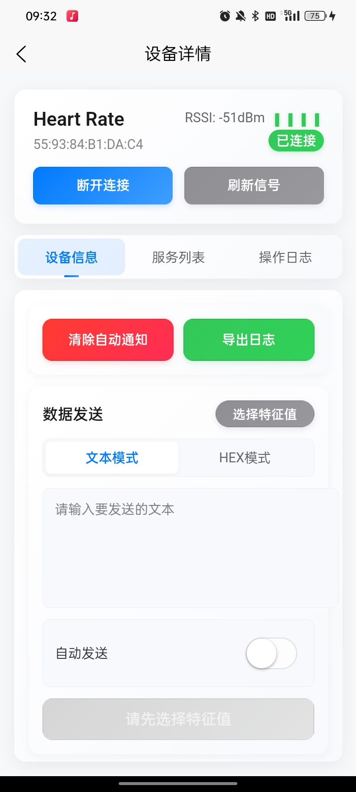
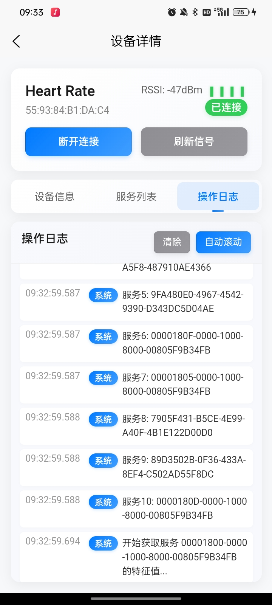

# LightBLE 蓝牙调试工具

<div align="center">
  <h3>多平台BLE调试工具，支持微信小程序、iOS和Android原生应用</h3>
  <p>
    <a href="https://lightble.i2kai.com/">官方网站</a> ·
    <a href="#快速开始">快速开始</a> ·
    <a href="#应用截图">应用截图</a> ·
    <a href="#主要功能">功能介绍</a>
  </p>
</div>

<div align="center">
  
  <p>扫码使用微信小程序版本</p>
</div>

## 💡 项目简介

LightBLE 是一款专业的蓝牙调试工具，基于 uni-app + Vue 3 开发，支持多平台部署。

- 版本：1.0.0
- 框架：uni-app + Vue 3
- 开源协议：MIT

## 📱 应用截图

<div align="center">
  <div>
    
    
    
  </div>
  <div style="margin-top: 10px;">
    
    
    
  </div>
</div>

## ✨ 主要功能

### 🌐 多平台支持
- 完整支持微信小程序、iOS和Android原生应用
- 提供统一的API接口，轻松实现跨平台开发
- 内置权限管理，自动处理蓝牙和定位权限请求

### 🛠️ 核心功能
- 🔍 蓝牙设备扫描与发现
- 📱 设备详情查看
- 📡 自定义蓝牙广播
- 📊 广播数据和扫描响应配置
- ⚙️ 灵活的参数配置
- ⚡ 实时数据监控

## 🔧 技术实现

### 技术栈
- 前端框架：Vue 3
- UI 框架：@dcloudio/uni-ui
- 原生插件：BLE-Module（自定义蓝牙广播插件）

### 平台支持
- **微信小程序**：使用微信小程序原生API
- **iOS原生**：基于CoreBluetooth框架
- **Android原生**：支持Android 5.0及以上版本

## 📦 项目结构

```
smart-ble/
├── SmartBLE/              # 主项目目录
│   ├── pages/            # 页面文件
│   │   ├── index/       # 主页（设备列表）
│   │   ├── device/      # 设备详情页
│   │   └── broadcast/   # 广播配置页
│   ├── static/          # 静态资源
│   ├── utils/          # 工具函数
│   ├── nativeplugins/  # 原生插件
│   └── App.vue         # 应用入口
└── docs/               # 文档和资源
```

## 🚀 快速开始

### 安装
```bash
cd SmartBLE
npm install
```

### 运行
```bash
# H5版本
npm run dev:h5

# 微信小程序
npm run dev:mp-weixin

# App开发
npm run dev:app
```

### 使用示例
```javascript
// 初始化蓝牙模块
uni.openBluetoothAdapter({
  success: () => {
    console.log('蓝牙初始化成功');
    // 开始搜索设备
    uni.startBluetoothDevicesDiscovery({
      success: () => {
        console.log('开始搜索设备');
      }
    });
  }
});

// 监听设备发现事件
uni.onBluetoothDeviceFound((devices) => {
  console.log('发现新设备:', devices);
});

// 连接设备
function connectDevice(deviceId) {
  uni.createBLEConnection({
    deviceId: deviceId,
    success: () => {
      console.log('连接成功');
      // 获取设备服务
      uni.getBLEDeviceServices({
        deviceId: deviceId,
        success: (res) => {
          console.log('设备服务列表:', res.services);
        }
      });
    }
  });
}
```

## 📝 权限说明

### Android 权限
- 蓝牙权限（BLUETOOTH）
- 蓝牙管理权限（BLUETOOTH_ADMIN）
- 位置权限（ACCESS_FINE_LOCATION）
- 蓝牙扫描权限（BLUETOOTH_SCAN）
- 蓝牙广播权限（BLUETOOTH_ADVERTISE）
- 蓝牙连接权限（BLUETOOTH_CONNECT）

### iOS 权限
- 蓝牙权限（用于搜索和连接蓝牙设备）

## ⚠️ 注意事项

1. Android 设备需要定位权限才能搜索蓝牙设备
2. iOS 需要在 Info.plist 中配置蓝牙权限描述
3. 微信小程序需要在开发者后台配置蓝牙相关权限

## 📥 下载安装

- [iOS App Store](#)
- [Google Play](#)
- 微信小程序：扫描顶部二维码

## 🤝 贡献指南

欢迎提交问题和改进建议！我们欢迎任何形式的贡献：
- 🐛 报告问题
- 💡 提交功能建议
- 🔧 提交代码改进
- 📖 完善文档

## 📄 开源协议

本项目采用 [MIT License](LICENSE) 开源协议 