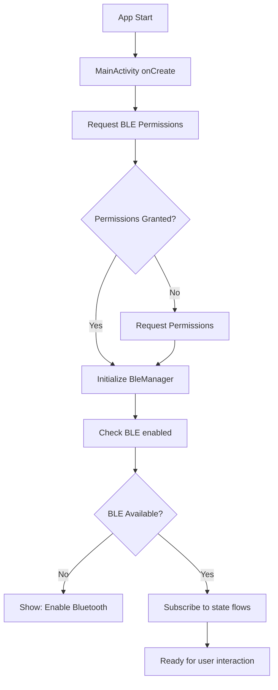
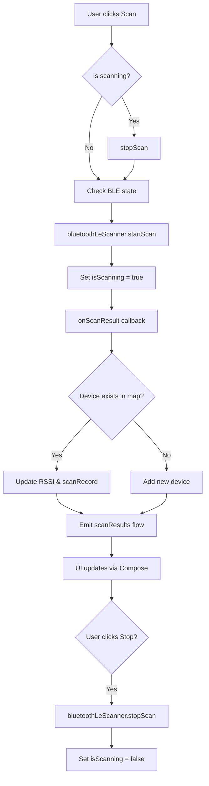
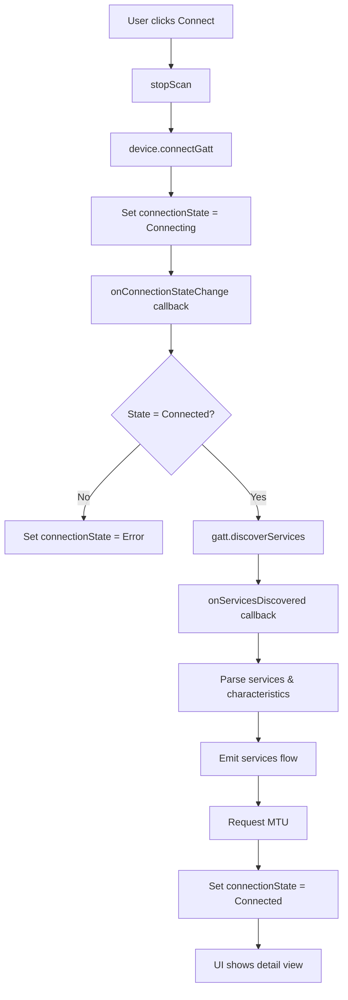
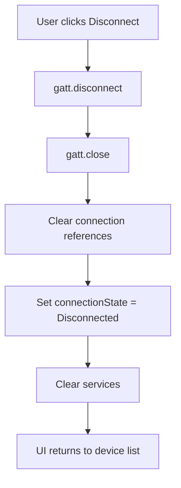
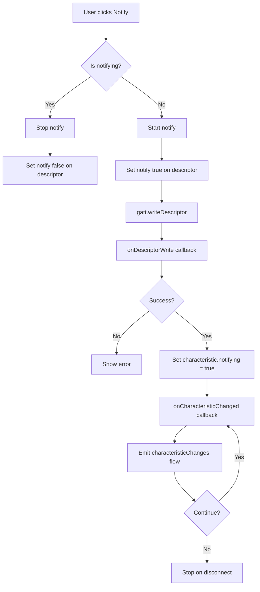
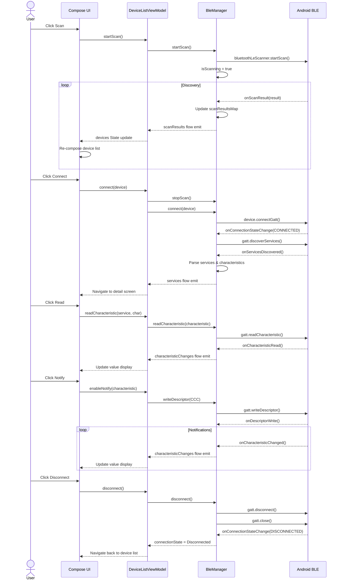

# SmartBLE Android - Architecture Documentation

## Overview

SmartBLE Android is a native Android BLE (Bluetooth Low Energy) debugging tool built with Jetpack Compose and Kotlin.

**Tech Stack:**
- **Language**: Kotlin
- **UI Framework**: Jetpack Compose
- **Architecture**: MVVM with Kotlin Flow
- **Minimum SDK**: 23 (Android 6.0)
- **Target SDK**: 34 (Android 14)

---

## Feature List

### Core Features
| Feature | Status | Description |
|---------|--------|-------------|
| BLE Initialization | ✅ | Initialize BLE adapter, check permissions |
| Device Scanning | ✅ | Scan for nearby BLE devices with filters |
| Device Filtering | ✅ | Filter by RSSI, name prefix, hide unnamed |
| Device Connection | ✅ | Connect to discovered BLE peripherals |
| Service Discovery | ✅ | Discover services and characteristics |
| Characteristic Read | ✅ | Read values from characteristics |
| Characteristic Write | ✅ | Write values (hex/string/bytes) |
| Characteristic Notify | ✅ | Enable/disable notifications |
| Device Disconnection | ✅ | Disconnect from connected device |
| BLE Broadcasting | ✅ | Advertise as BLE peripheral |
| MTU Request | ✅ | Request MTU size (up to 517) |
| About Page | ✅ | Show app info and version |

### UI Features
- Material Design 3 with dynamic colors
- Real-time device list with signal indicators
- Expandable service/characteristic tree
- Filter panel with presets
- Loading states and animations
- Log panel for debugging

---

## Architecture

### Directory Structure
```
android/app/src/main/java/com/smartble/
├── core/
│   ├── ble/
│   │   ├── BleManager.kt           # BLE Central manager
│   │   └── BlePeripheralManager.kt # BLE Peripheral manager
│   └── model/
│       ├── BleDevice.kt            # Device data class
│       ├── BleService.kt           # Service data class
│       ├── BleCharacteristic.kt    # Characteristic data class
│       └── ConnectionState.kt       # Connection state enum
├── ui/
│   ├── MainActivity.kt             # Main activity
│   ├── screen/
│   │   ├── DeviceListScreen.kt    # Device list & scan UI
│   │   ├── DeviceDetailScreen.kt  # Service/char operations
│   │   ├── BroadcastScreen.kt     # Broadcasting UI
│   │   └── AboutScreen.kt         # About page
│   ├── viewmodel/
│   │   ├── DeviceListViewModel.kt # Scan & connect logic
│   │   ├── DeviceDetailViewModel.kt # Service operations
│   │   └── BroadcastViewModel.kt  # Broadcast logic
│   └── theme/
│       ├── Color.kt               # Material colors
│       ├── Theme.kt               # App theme
│       └── Type.kt                # Typography
└── AndroidManifest.xml            # Permissions & config
```

### Data Models

#### BleDevice
```kotlin
data class BleDevice(
    val address: String,           // MAC address
    val name: String?,             // Device name
    val rssi: Int,                 // Signal strength
    val scanRecord: ScanRecord?,   // Advertising data
    val bondState: Int             // Bond state
)
```

#### BleService
```kotlin
data class BleService(
    val uuid: UUID,                // Service UUID
    val characteristics: List<BleCharacteristic>
)
```

#### BleCharacteristic
```kotlin
data class BleCharacteristic(
    val uuid: UUID,                // Characteristic UUID
    val serviceUuid: UUID,         // Parent service UUID
    val properties: Property,      // Read/Write/Notify flags
    val value: ByteArray? = null   // Current value
)
```

#### ConnectionState
```kotlin
sealed class ConnectionState {
    data object Disconnected : ConnectionState()
    data object Connecting : ConnectionState()
    data object Connected : ConnectionState()
    data class Error(val message: String) : ConnectionState()
}
```

---

## Flow Diagrams

### 1. App Initialization Flow



### 2. Device Scan Flow



### 3. Connect Flow



### 4. Disconnect Flow



### 5. Characteristic Notify Flow



---

## Sequence Diagrams

### Complete Scan-Connect-Operate-Disconnect Flow



---

## BLE Manager Implementation

### Key Components

```kotlin
class BleManager(private val context: Context) {
    // Scanner
    private val bluetoothLeScanner: BluetoothLeScanner?

    // Connection
    private var gattConnection: BluetoothGatt?

    // State Flows (Reactive Streams)
    private val _scanResults = MutableSharedFlow<List<ScanResult>>()
    private val _isScanning = MutableStateFlow(false)
    private val _connectionState = MutableStateFlow<ConnectionState>(Disconnected)
    private val _services = MutableStateFlow<List<BleService>>(emptyList())
    private val _characteristicChanges = MutableSharedFlow<CharacteristicChangeEvent>()

    // Public API
    fun startScan()
    fun stopScan()
    fun connect(device: BleDevice)
    fun disconnect()
    fun readCharacteristic(characteristic: BleCharacteristic)
    fun writeCharacteristic(characteristic: BleCharacteristic, data: ByteArray)
    fun enableNotify(characteristic: BleCharacteristic)
    fun disableNotify(characteristic: BleCharacteristic)
    fun requestMtu(mtu: Int)
}
```

### GATT Callback Handling

```kotlin
private val gattCallback = object : BluetoothGattCallback() {
    override fun onConnectionStateChange(gatt: BluetoothGatt, status: Int, newState: Int) {
        when (newState) {
            BluetoothGatt.STATE_CONNECTED -> {
                gatt.discoverServices()
            }
            BluetoothGatt.STATE_DISCONNECTED -> {
                _connectionState.value = ConnectionState.Disconnected
            }
        }
    }

    override fun onServicesDiscovered(gatt: BluetoothGatt, status: Int) {
        if (status == BluetoothGatt.GATT_SUCCESS) {
            val services = parseServices(gatt.services)
            _services.value = services
            requestMtu(517)
        }
    }

    override fun onCharacteristicRead(gatt: BluetoothGatt, characteristic: BluetoothGattCharacteristic, status: Int) {
        if (status == BluetoothGatt.GATT_SUCCESS) {
            _characteristicChanges.tryEmit(CharacteristicChangeEvent(
                characteristic.uuid, characteristic.value
            ))
        }
    }

    override fun onCharacteristicChanged(gatt: BluetoothGatt, characteristic: BluetoothGattCharacteristic) {
        _characteristicChanges.tryEmit(CharacteristicChangeEvent(
            characteristic.uuid, characteristic.value
        ))
    }
}
```

---

## ViewModel Pattern

### DeviceListViewModel

```kotlin
class DeviceListViewModel(
    private val bleManager: BleManager
) : ViewModel() {
    // UI State
    val isScanning: StateFlow<Boolean> = bleManager.isScanning.stateIn(...)
    val scanResults: StateFlow<List<ScanResult>> = bleManager.scanResults.stateIn(...)
    val connectionState: StateFlow<ConnectionState> = bleManager.connectionState.stateIn(...)

    // Filters
    var filterRssi by mutableStateOf(-100)
    var filterNamePrefix by mutableStateOf("")
    var hideUnnamed by mutableStateOf(false)

    // Actions
    fun startScan() = viewModelScope.launch {
        bleManager.startScan()
    }

    fun stopScan() = viewModelScope.launch {
        bleManager.stopScan()
    }

    fun connect(device: BleDevice) = viewModelScope.launch {
        bleManager.connect(device)
    }
}
```

### DeviceDetailViewModel

```kotlin
class DeviceDetailViewModel(
    private val bleManager: BleManager
) : ViewModel() {
    val services: StateFlow<List<BleService>> = bleManager.services.stateIn(...)
    val characteristicChanges: SharedFlow<CharacteristicChangeEvent> = bleManager.characteristicChanges

    fun readCharacteristic(serviceUuid: UUID, charUuid: UUID) = viewModelScope.launch {
        bleManager.readCharacteristic(serviceUuid, charUuid)
    }

    fun writeCharacteristic(serviceUuid: UUID, charUuid: UUID, data: ByteArray) = viewModelScope.launch {
        bleManager.writeCharacteristic(serviceUuid, charUuid, data)
    }

    fun toggleNotify(characteristic: BleCharacteristic) = viewModelScope.launch {
        if (characteristic.notifying) {
            bleManager.disableNotify(characteristic.uuid)
        } else {
            bleManager.enableNotify(characteristic)
        }
    }
}
```

---

## Jetpack Compose UI

### Device List Screen

```kotlin
@Composable
fun DeviceListScreen(
    viewModel: DeviceListViewModel = hiltViewModel()
) {
    val devices by viewModel.scanResults.collectAsState()
    val isScanning by viewModel.isScanning.collectAsState()

    Column {
        // Filter Panel
        FilterPanel(
            rssi = viewModel.filterRssi,
            onRssiChange = { viewModel.filterRssi = it },
            namePrefix = viewModel.filterNamePrefix,
            onNamePrefixChange = { viewModel.filterNamePrefix = it },
            hideUnnamed = viewModel.hideUnnamed,
            onHideUnnamedChange = { viewModel.hideUnnamed = it }
        )

        // Scan Button
        Button(onClick = { viewModel.toggleScan() }) {
            Text(if (isScanning) "停止扫描" else "搜索设备")
        }

        // Device List
        LazyColumn {
            items(filteredDevices) { device ->
                DeviceItem(
                    device = device,
                    onClick = { viewModel.connect(device) }
                )
            }
        }
    }
}
```

---

## Permissions

### AndroidManifest.xml

```xml
<!-- Legacy permissions (Android 11 or lower) -->
<uses-permission android:name="android.permission.BLUETOOTH" />
<uses-permission android:name="android.permission.BLUETOOTH_ADMIN" />

<!-- Android 12+ permissions -->
<uses-permission android:name="android.permission.BLUETOOTH_CONNECT" />
<uses-permission android:name="android.permission.BLUETOOTH_SCAN" />

<!-- Location permission for scanning (Android 11 or lower) -->
<uses-permission android:name="android.permission.ACCESS_FINE_LOCATION" />

<!-- For Android 13+ notification permission -->
<uses-permission android:name="android.permission.POST_NOTIFICATIONS" />
```

### Permission Request Flow

```kotlin
when {
    Build.VERSION.SDK_INT >= Build.VERSION_CODES.S -> {
        // Android 12+: Request BLUETOOTH_SCAN and BLUETOOTH_CONNECT
        ActivityCompat.requestPermissions(
            activity,
            arrayOf(
                Manifest.permission.BLUETOOTH_SCAN,
                Manifest.permission.BLUETOOTH_CONNECT
            ),
            PERMISSION_REQUEST_CODE
        )
    }
    else -> {
        // Android 11 or lower: Request LOCATION
        ActivityCompat.requestPermissions(
            activity,
            arrayOf(Manifest.permission.ACCESS_FINE_LOCATION),
            PERMISSION_REQUEST_CODE
        )
    }
}
```

---

## Known Issues & Solutions

| Issue | Solution |
|-------|----------|
| Scan doesn't find devices | Check ACCESS_FINE_LOCATION permission on Android 11- |
| Connection fails | Ensure device is not already connected (check gattConnection) |
| MTU request fails | Some devices don't support MTU negotiation, handle gracefully |
| Notifications not received | Check CCC descriptor write result |
| Service discovery empty | Some devices need delay after connection |
| Bonding required | Some devices require bonding before operations |

---

## Platform-Specific Notes

### Android 12+ (API 31+)
- New BLUETOOTH_SCAN and BLUETOOTH_CONNECT permissions
- NeverFor getLocation() permission for scan
- Must declare usesPermissionFlags="neverForLocation" in manifest

### Android 13 (API 33+)
- POST_NOTIFICATIONS permission for notifications
- Runtime permission required

### MTU Size
- Maximum MTU varies by device (typically 517)
- Request after connection established
- Some devices may negotiate lower MTU

---

## Testing Checklist

- [ ] Permissions requested and granted
- [ ] Scan starts and finds devices
- [ ] Device list updates smoothly
- [ ] Filters work correctly
- [ ] Connection succeeds
- [ ] Services discovered
- [ ] Read operation works
- [ ] Write operation works
- [ ] Notify operation works
- [ ] Disconnect works cleanly
- [ ] Broadcast mode works
- [ ] MTU request succeeds
- [ ] No crashes during normal flow
