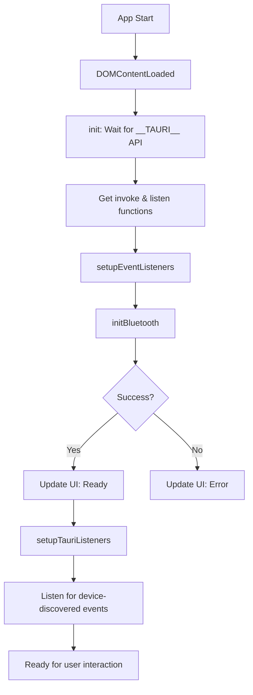
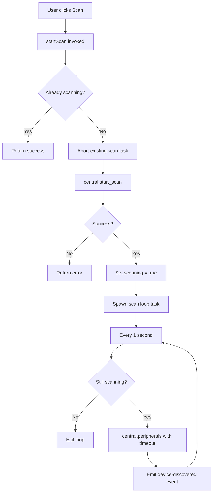
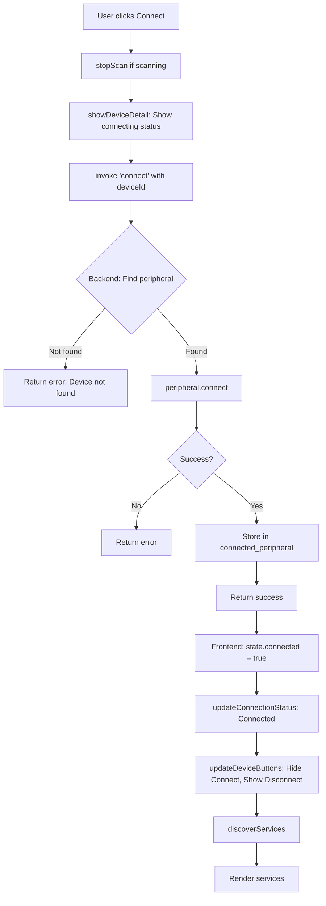
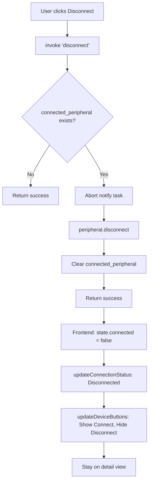
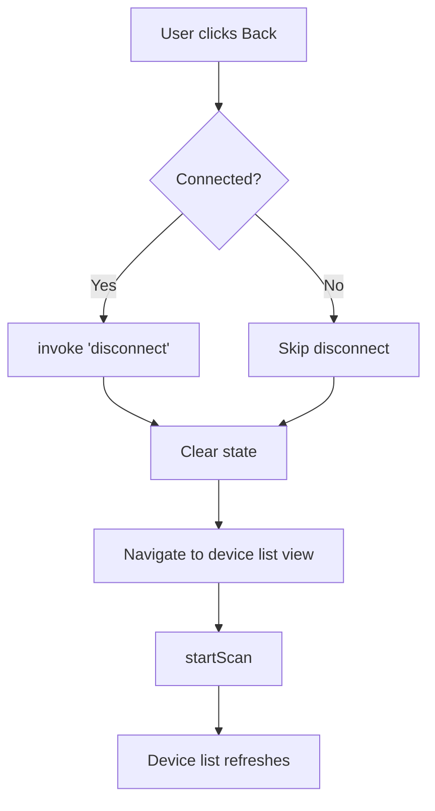
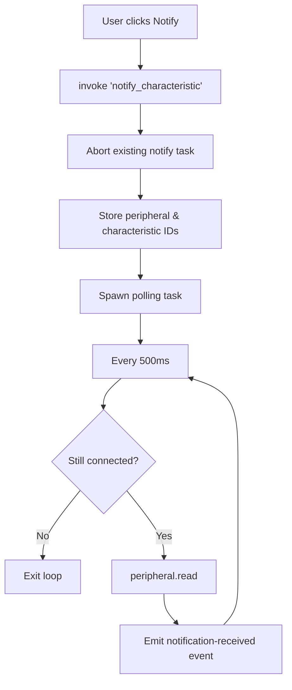
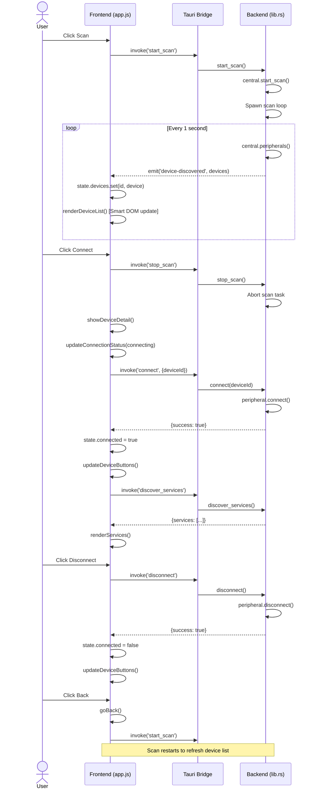

# SmartBLE Tauri - Architecture Documentation

## Overview

SmartBLE Tauri is a cross-platform desktop BLE (Bluetooth Low Energy) application built with Tauri framework.

**Tech Stack:**
- **Backend**: Rust + Tauri 1.5 + btleplug 0.11
- **Frontend**: Vanilla JavaScript + HTML + CSS
- **Platforms**: macOS, Windows, Linux

---

## Feature List

### Core Features
| Feature | macOS | Windows | Linux | Description |
|---------|-------|---------|-------|-------------|
| BLE Initialization | ✅ | ✅ | ✅ | Initialize BLE adapter on app start |
| Device Scanning | ✅ | ✅ | ✅ | Scan for nearby BLE devices with RSSI updates |
| Device Filtering | ✅ | ✅ | ✅ | Filter by RSSI, name prefix, hide unnamed devices |
| Device Connection | ✅ | ✅ | ✅ | Multi-device concurrent connection (HashMap) |
| Service Discovery | ✅ | ✅ | ✅ | Discover services and characteristics after connection |
| Characteristic Read | ✅ | ✅ | ✅ | Read values from characteristics |
| Characteristic Write | ✅ | ✅ | ✅ | Write values to characteristics (auto Write/WriteWithoutResponse) |
| Characteristic Notify | ✅ | ✅ | ✅ | **Event-driven** via `peripheral.notifications()` stream (btleplug 0.11) |
| Device Disconnection | ✅ | ✅ | ✅ | Disconnect from connected device; auto-reconnect (max 3, 2/4/6s backoff) |
| BLE Broadcasting | ✅ | ❌ | ❌ | Advertise as BLE peripheral (macOS only via btleplug) |
| About Page | ✅ | ✅ | ✅ | Show app info — Tauri 1.5 / Rust + btleplug 0.11 |

### UI Features
- Real-time device list updates (no flickering with smart DOM updates)
- Connection status indicator with animations
- Service/characteristic tree view (Web Components)
- Log panel for debugging (Web Component)
- Filter panel with presets (-50, -70, -90 dBm)
- Multi-device management: "Connected" tab view
- Auto-reconnect: 3 attempts with 2s/4s/6s exponential backoff
- SSOT CSS tokens aligned with Electron + Flutter AppColors palette

---

## Architecture

### Directory Structure
```
tauri/
├── src/                          # Frontend (HTML/CSS/JS)
│   ├── index.html               # Main HTML structure
│   ├── styles.css               # Styles
│   └── app.js                   # Frontend logic
└── src-tauri/                   # Backend (Rust)
    ├── Cargo.toml               # Dependencies
    ├── build.rs                 # Build script (plist patching)
    ├── tauri.conf.json          # Tauri config
    └── src/
        └── lib.rs               # BLE backend commands
```

### Backend (Rust) Structure

#### Main Components
```rust
// BLE State
pub struct BleState {
    pub central: Option<Arc<Central>>,
    pub connected_peripheral: Option<Peripheral>,
    pub scanning: bool,
    pub scan_handle: Option<JoinHandle<()>>,
    pub notify_handle: Option<JoinHandle<()>>,
}

// Tauri Commands (invoked from frontend)
init_bluetooth()      // Initialize BLE adapter
start_scan()          // Start scanning for devices
stop_scan()           // Stop scanning
connect(deviceId)     // Connect to device
disconnect()          // Disconnect from device
discover_services()   // Discover services
read_characteristic() // Read characteristic value
write_characteristic()// Write characteristic value
notify_characteristic()// Start polling for notifications
start_broadcast()     // Start advertising (macOS)
stop_broadcast()      // Stop advertising
```

### Frontend (JavaScript) Structure

#### State Management
```javascript
const state = {
    bluetoothReady: false,    // BLE initialized
    scanning: false,          // Currently scanning
    devices: new Map(),       // Discovered devices (deduplicated by ID)
    currentDevice: null,      // Selected device
    connected: false,         // Connection status
    services: [],             // Discovered services
    logs: [],                 // Debug logs
    advertising: false,       // Broadcasting status
    filters: {                // Device filters
        rssi: -100,
        namePrefix: '',
        hideUnnamed: false
    }
};
```

#### Key Functions
```javascript
// BLE Operations
initBluetooth()         // Initialize BLE
startScan()             // Start device scan
stopScan()              // Stop scan
connectDevice(id)       // Connect to device
disconnectDevice()      // Disconnect
discoverServices(id)    // Get services
readCharacteristic()    // Read value
writeCharacteristic()   // Write value
notifyCharacteristic()  // Start polling

// UI Functions
renderDeviceList()      // Smart DOM update (no flicker)
renderServices()        // Render service tree
updateConnectionStatus()// Update status indicator
updateDeviceButtons()   // Show/hide connect/disconnect buttons
goBack()                // Navigate to device list

// Event Handlers (Tauri events)
device-discovered       // New devices found
notification-received   // Characteristic value changed
```

---

## Flow Diagrams

### 1. App Initialization Flow



### 2. Device Scan Flow



### 3. Connect Flow



### 4. Disconnect Flow



### 5. Back Button Flow (goBack)



### 6. Characteristic Notify Flow (Polling)



---

## Sequence Diagrams

### Complete Scan-Connect-Disconnect Flow



---

## BLE Event Handlers

### Tauri Events

| Event | Payload | Description |
|-------|---------|-------------|
| `device-discovered` | `DeviceInfo[]` | Emitted every second during scan with updated device list |
| `notification-received` | `{serviceUuid, charUuid, value}` | Emitted when characteristic value changes (polling) |

### Event Implementation

```javascript
// Listen for device discovery
await listen('device-discovered', (event) => {
    event.payload.forEach(device => {
        state.devices.set(device.id, device); // Map auto-deduplicates
    });
    renderDeviceList(); // Smart DOM update
});

// Listen for notifications
await listen('notification-received', (event) => {
    const { serviceUuid, charUuid, value } = event.payload;
    addLog('info', `Received: ${value}`);
});
```

---

## Important Implementation Details

### 1. Device List Smart Updates (No Flickering)

**Problem**: Rebuilding entire DOM every second causes flickering.

**Solution**: Track existing devices and only update changed ones.

```javascript
function renderDeviceList() {
    const filteredDevices = applyFilters();

    // Get current device IDs in DOM
    const currentIds = new Set();
    elements.deviceList.querySelectorAll('.device-item').forEach(item => {
        currentIds.add(item.dataset.id);
    });

    // Remove devices not in filtered list
    currentIds.forEach(id => {
        if (!newIds.has(id)) {
            item.remove();
        }
    });

    // Add new devices or update existing ones
    filteredDevices.forEach(device => {
        let item = querySelector(`[data-id="${device.id}"]`);
        if (!item) {
            // Create new item
        } else {
            // Update only RSSI and name (not entire DOM)
            rssiEl.textContent = `${device.rssi} dBm`;
        }
    });
}
```

### 2. Scan Loop Management

**Problem**: btleplug scan doesn't emit events; need to poll.

**Solution**: Spawn a task that polls `peripherals()` every second.

```rust
let handle = tokio::spawn(async move {
    let mut tick = tokio::time::interval(Duration::from_secs(1));
    loop {
        tick.tick().await;
        let is_scanning = { state.lock().await.scanning };
        if !is_scanning { break; }
        let peripherals = central.peripherals().await;
        // Emit to frontend
    }
});
```

**Important**: Always abort the scan task before starting a new one.

### 3. macOS Bluetooth Permission

**Problem**: macOS requires `NSBluetoothAlwaysUsageDescription` in Info.plist.

**Solution**: Patch Info.plist in `build.rs` since Tauri 1.x doesn't support it in config.

```rust
// build.rs
if !content.contains("NSBluetoothAlwaysUsageDescription") {
    let permission = "\t<key>NSBluetoothAlwaysUsageDescription</key>...";
    content.insert_str(content.find("</dict>").unwrap(), permission);
    fs::write(&plist_path, new_content)?;
}
```

### 4. Notification Polling

**Problem**: btleplug 0.11 doesn't support proper notification events on macOS.

**Solution**: Poll the characteristic value every 500ms.

```rust
loop {
    tokio::time::sleep(Duration::from_millis(500)).await;
    let data = peripheral.read(characteristic).await?;
    emit("notification-received", data)?;
}
```

### 5. Reconnection After Disconnect

**Problem**: After disconnect, device list is stale; can't reconnect.

**Solution**: When returning to device list, restart scan automatically.

```javascript
async function goBack() {
    if (state.connected) await disconnect();
    navigateToList();
    await startScan(); // Refresh device list
}
```

---

## Known Issues & Solutions

| Issue | Solution |
|-------|----------|
| Scan loop stops immediately | Don't use oneshot channel; check `scanning` flag instead |
| Device list flickers | Use smart DOM updates, don't rebuild entire list |
| Can't reconnect after disconnect | Restart scan when returning to list |
| Connect button shows after connection | Call `updateDeviceButtons()` after state change |
| btleplug panic on macOS | Add timeout to `peripherals()` call; check scanning flag before call |
| Multiple scan tasks running | Check `scanning` flag at start of `start_scan`; abort existing task |
| Empty state not clearing | Remove `.empty-state` element before adding devices |
| Bluetooth permission denied | Add `NSBluetoothAlwaysUsageDescription` to Info.plist |

---

## Platform-Specific Notes

### macOS
- Requires Bluetooth permission in Info.plist
- CoreBluetooth framework used by btleplug
- Supports BLE Central and Peripheral modes
- MTU negotiation supported
- Background scanning limited

### Windows
- Uses Windows Bluetooth APIs
- May require administrator privileges
- BLE Central mode only
- MTU negotiation not supported

### Linux (BlueZ)
- Requires BlueZ installed
- May need `bluetooth` service running
- BLE Central mode only
- Some distributions require additional setup

---

## Tauri Command Reference

| Command | Parameters | Returns | Description |
|---------|------------|---------|-------------|
| `init_bluetooth` | none | `{success, data, error}` | Initialize BLE adapter |
| `start_scan` | none | `{success, data, error}` | Start scanning for devices |
| `stop_scan` | none | `{success, data, error}` | Stop scanning |
| `connect` | `deviceId: String` | `{success, data, error}` | Connect to device |
| `disconnect` | none | `{success, data, error}` | Disconnect from device |
| `discover_services` | `deviceId: String` | `{success, data: Service[], error}` | Discover services |
| `read_characteristic` | `serviceUuid, charUuid` | `{success, data: value, error}` | Read characteristic |
| `write_characteristic` | `serviceUuid, charUuid, data` | `{success, error}` | Write characteristic |
| `notify_characteristic` | `serviceUuid, charUuid` | `{success, error}` | Start notification polling |
| `start_broadcast` | `name, serviceUuid` | `{success, error}` | Start advertising |
| `stop_broadcast` | none | `{success, error}` | Stop advertising |

---

## Testing Checklist

- [ ] App initializes without errors
- [ ] Scan starts and devices appear
- [ ] Device list updates smoothly (no flickering)
- [ ] Connect button visible and works
- [ ] Connection status updates to "Connected"
- [ ] Disconnect button appears after connection
- [ ] Services are discovered after connection
- [ ] Can read characteristics
- [ ] Can write characteristics
- [ ] Can start/stop notifications
- [ ] Disconnect works and updates UI
- [ ] Back button returns to list
- [ ] Can reconnect to same device after disconnect
- [ ] Filter panel works
- [ ] Broadcasting works (macOS)
- [ ] No console errors during normal flow
