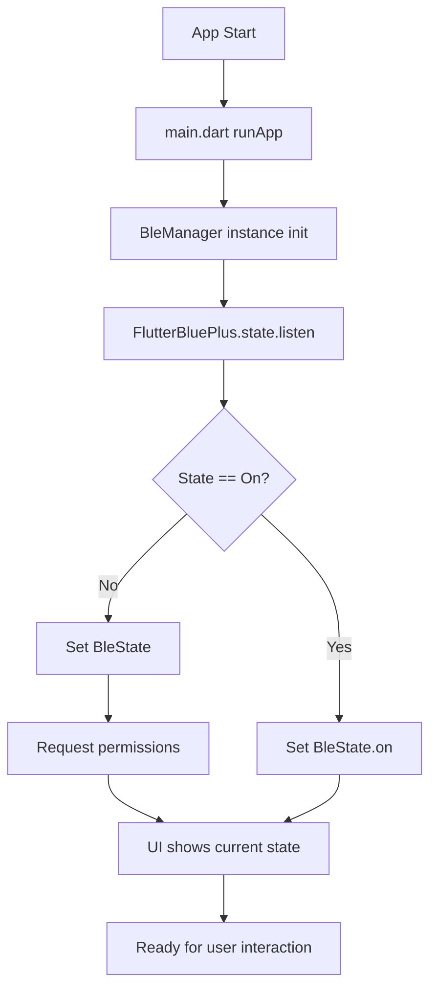
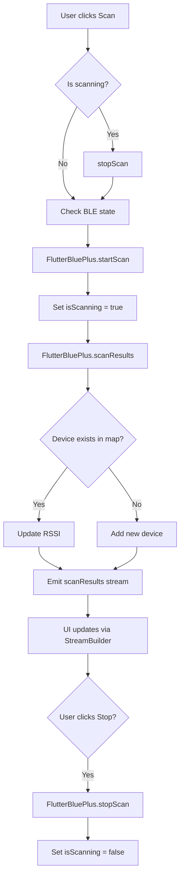
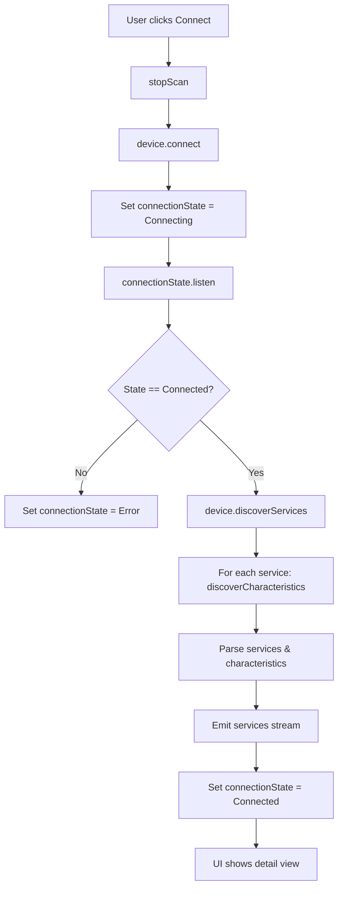
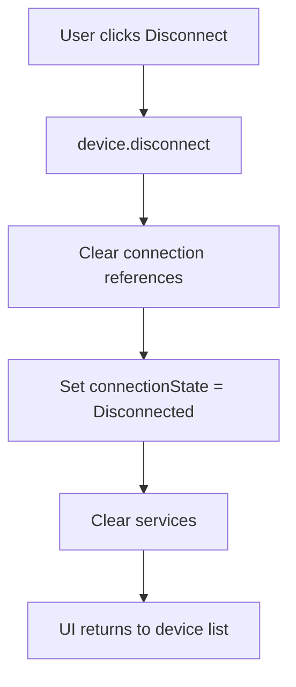
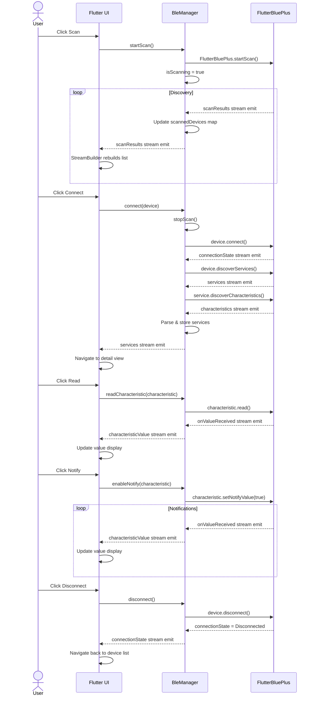

# SmartBLE Flutter - Architecture Documentation

## Overview

SmartBLE Flutter is a cross-platform mobile BLE (Bluetooth Low Energy) debugging tool built with Flutter and flutter_blue_plus plugin.

**Tech Stack:**
- **Language**: Dart
- **Framework**: Flutter
- **Architecture**: BLoC pattern with Streams
- **BLE Plugin**: flutter_blue_plus
- **Platforms**: iOS 12+, Android 21+ (Android 6.0)

---

## Feature List

### Core Features
| Feature | iOS | Android | Description |
|---------|-----|---------|-------------|
| BLE Initialization | ✅ | ✅ | Initialize BLE adapter, check permissions |
| Device Scanning | ✅ | ✅ | Scan for nearby BLE devices with filters |
| Device Filtering | ✅ | ✅ | Filter by RSSI, name prefix, hide unnamed |
| Device Connection | ✅ | ✅ | Connect to discovered BLE peripherals |
| Service Discovery | ✅ | ✅ | Discover services and characteristics |
| Characteristic Read | ✅ | ✅ | Read values from characteristics |
| Characteristic Write | ✅ | ✅ | Write values (hex/string/bytes) |
| Characteristic Notify | ✅ | ✅ | Enable/disable notifications |
| Device Disconnection | ✅ | ✅ | Disconnect from connected device |
| BLE Broadcasting | ✅ | ✅ | Advertise as BLE peripheral |
| Log Panel | ✅ | ✅ | View operation logs |
| About Page | ✅ | ✅ | Show app info and version |

### UI Features
- Material Design with adaptive layouts
- Real-time device list with signal indicators
- Expandable service/characteristic tree
- Filter panel with presets
- Loading states and animations
- Log panel with color-coded entries

---

## Architecture

### Directory Structure
```
flutter/
├── lib/
│   ├── main.dart                  # App entry point
│   ├── core/
│   │   ├── ble/
│   │   │   ├── ble_manager.dart            # BLE Central manager
│   │   │   └── ble_peripheral_manager.dart # BLE Peripheral manager
│   │   └── models/
│   │       ├── ble_device.dart             # Device data class
│   │       ├── ble_service.dart            # Service data class
│   │       ├── ble_scan_result.dart        # Scan result data class
│   │       └── ble_characteristic.dart     # Characteristic data class
│   └── ui/
│       ├── pages/
│       │   ├── device_list_page.dart       # Device list & scan UI
│       │   ├── device_detail_page.dart     # Service/char operations
│       │   ├── broadcast_page.dart         # Broadcasting UI
│       │   └── about_page.dart             # About page
│       └── widgets/
│           ├── device_card.dart            # Device list item
│           ├── service_tile.dart           # Service/char tree item
│           ├── filter_panel.dart           # Filter controls
│           └── log_panel.dart              # Log display
└── pubspec.yaml                    # Dependencies
```

### Data Models

```dart
// BLE State
enum BleState {
  unknown,
  unavailable,
  unauthorized,
  turningOn,
  on,
  turningOff,
  off,
}

// Scan Result
class BleScanResult {
  final String deviceId;        // Device ID
  final String? name;           // Device name
  final int rssi;               // Signal strength
  final ScanResult? scanResult; // flutter_blue_plus result
}

// BLE Service
class BleService {
  final String uuid;            // Service UUID
  final String deviceId;         // Parent device ID
  final List<BleCharacteristic> characteristics;
  final bool isPrimary;
  final Service? service;        // flutter_blue_plus service
}

// BLE Characteristic
class BleCharacteristic {
  final String uuid;            // Characteristic UUID
  final String serviceUuid;     // Parent service UUID
  final String deviceId;        // Device ID
  final Characteristic? characteristic; // flutter_blue_plus char
  final List<CharacteristicProperty> properties;
  final bool notifying;
  final List<int> value;
}
```

---

## Flow Diagrams

### 1. App Initialization Flow



### 2. Device Scan Flow



### 3. Connect Flow



### 4. Disconnect Flow



### 5. Characteristic Notify Flow

```mermaid
flowchart TD
    A[User clicks Notify] --> B{Is notifying?}
    B -->|Yes| C[Stop notify]
    B -->|No| D[Start notify]
    C --> E[characteristic.setNotifyValue(false)]
    D --> F[characteristic.setNotifyValue(true)]
    F --> G[onValueReceived.listen]
    G --> H{Success?}
    H -->|No| I[Show error]
    H -->|Yes| J[Set characteristic.notifying = true]
    J --> K[Emit value stream]
    K --> L{Continue?}
    L -->|Yes| K
    L -->|No| O[Stop on disconnect]
```

---

## Sequence Diagrams

### Complete Scan-Connect-Operate-Disconnect Flow



---

## BLE Manager Implementation

### Key Components

```dart
class BleManager {
  // Singleton
  static BleManager get instance => _instance ??= BleManager._internal();

  // Stream Controllers
  late StreamController<BleState> _stateController;
  late StreamController<List<BleScanResult>> _scanResultsController;
  late StreamController<BluetoothConnectionState> _connectionStateController;

  // State
  final Map<String, BleScanResult> _scannedDevices = {};
  BleDevice? _connectedDevice;
  List<BleService> _services = [];

  // Public Streams
  Stream<BleState> get stateStream => _stateController.stream;
  Stream<List<BleScanResult>> get scanResultsStream => _scanResultsController.stream;
  Stream<BluetoothConnectionState> get connectionStateStream => _connectionStateController.stream;

  // Public API
  Future<void> startScan();
  Future<void> stopScan();
  Future<void> connect(BleScanResult device);
  Future<void> disconnect();
  Future<void> readCharacteristic(BleCharacteristic characteristic);
  Future<void> writeCharacteristic(BleCharacteristic characteristic, List<int> data);
  Future<void> enableNotify(BleCharacteristic characteristic);
  Future<void> disableNotify(BleCharacteristic characteristic);
  Future<void> startAdvertising(String name, List<String> serviceUuids);
  Future<void> stopAdvertising();
}
```

### Scan Implementation

```dart
Future<void> startScan() async {
  if (await FlutterBluePlus.isScanning.isWhere((s) => s == true)) {
    return; // Already scanning
  }

  // Clear previous results
  _scannedDevices.clear();

  // Start scanning
  await FlutterBluePlus.startScan(timeout: Duration(seconds: 60));

  // Listen to scan results
  FlutterBluePlus.scanResults.listen((results) {
    for (ScanResult result in results) {
      final device = BleScanResult(
        deviceId: result.device.id.id,
        name: result.device.localName,
        rssi: result.rssi,
        scanResult: result,
      );
      _scannedDevices[device.deviceId] = device;
    }
    _scanResultsController.add(_scannedDevices.values.toList());
  });
}
```

---

## Flutter UI

### DeviceListPage

```dart
class DeviceListPage extends StatefulWidget {
  @override
  _DeviceListPageState createState() => _DeviceListPageState();
}

class _DeviceListPageState extends State<DeviceListPage> {
  final BleManager _bleManager = BleManager.instance;

  @override
  Widget build(BuildContext context) {
    return Scaffold(
      appBar: AppBar(
        title: Text('SmartBLE'),
        actions: [
          StreamBuilder<bool>(
            stream: _bleManager.isScanningStream,
            builder: (context, snapshot) {
              final isScanning = snapshot.data ?? false;
              return IconButton(
                icon: Icon(isScanning ? Icons.stop : Icons.search),
                onPressed: () {
                  if (isScanning) {
                    _bleManager.stopScan();
                  } else {
                    _bleManager.startScan();
                  }
                },
              );
            },
          ),
        ],
      ),
      body: Column(
        children: [
          FilterPanel(),
          Expanded(
            child: StreamBuilder<List<BleScanResult>>(
              stream: _bleManager.scanResultsStream,
              builder: (context, snapshot) {
                final devices = snapshot.data ?? [];
                return ListView.builder(
                  itemCount: devices.length,
                  itemBuilder: (context, index) {
                    return DeviceCard(
                      device: devices[index],
                      onTap: () => _bleManager.connect(devices[index]),
                    );
                  },
                );
              },
            ),
          ),
        ],
      ),
    );
  }
}
```

---

## Permissions Configuration

### Android (android/app/src/main/AndroidManifest.xml)

```xml
<!-- Legacy permissions -->
<uses-permission android:name="android.permission.BLUETOOTH" />
<uses-permission android:name="android.permission.BLUETOOTH_ADMIN" />
<uses-permission android:name="android.permission.BLUETOOTH_SCAN" />
<uses-permission android:name="android.permission.BLUETOOTH_CONNECT" />

<!-- Location permission for scanning (Android 11 or lower) -->
<uses-permission android:name="android.permission.ACCESS_FINE_LOCATION" />
```

### iOS (ios/Runner/Info.plist)

```xml
<key>NSBluetoothAlwaysUsageDescription</key>
<string>This app needs Bluetooth access to scan for and connect to nearby devices.</string>

<key>NSBluetoothPeripheralUsageDescription</key>
<string>This app needs Bluetooth peripheral access to advertise as a BLE device.</string>

<key>UIBackgroundModes</key>
<array>
    <string>bluetooth-central</string>
    <string>bluetooth-peripheral</string>
</array>
```

---

## Dependencies (pubspec.yaml)

```yaml
dependencies:
  flutter:
    sdk: flutter
  flutter_blue_plus: ^1.32.0  # BLE plugin
  rxdart: ^0.27.0              # Reactive extensions
  permission_handler: ^11.0.0   # Runtime permissions
```

---

## Known Issues & Solutions

| Issue | Solution |
|-------|----------|
| Scan doesn't find devices (Android) | Check ACCESS_FINE_LOCATION permission |
| Scan doesn't find devices (iOS) | Check NSBluetoothAlwaysUsageDescription |
| Connection fails | Ensure device is not already connected |
| Services not discovered | Check if connected and timeout |
| Notify doesn't work | Check if characteristic supports notify property |
| MTU negotiation | Some devices don't support, handle gracefully |
| Bonding required | Some devices require bonding before operations |
| Android 12+ issues | Use new BLUETOOTH_SCAN/CONNECT permissions |

---

## Platform-Specific Notes

### Android
- Requires ACCESS_FINE_LOCATION on Android 11 or lower
- Android 12+: BLUETOOTH_SCAN and BLUETOOTH_CONNECT permissions
- NeverForgetLocation() can be used on Android 12+ for scan
- Some devices may require bonding

### iOS
- Location permission NOT required for BLE
- Pairing handled automatically by iOS
- Background scanning limited
- May require user approval for Bluetooth access

### Cross-Platform
- flutter_blue_plus provides unified API
- Platform-specific permissions handled in native code
- Test on both platforms for full compatibility

---

## Testing Checklist

- [ ] Permissions requested and granted
- [ ] Scan starts and finds devices
- [ ] Device list updates smoothly
- [ ] Filters work correctly
- [ ] Connection succeeds
- [ ] Services discovered
- [ ] Read operation works
- [ ] Write operation works
- [ ] Notify operation works
- [ ] Disconnect works cleanly
- [ ] Broadcast mode works
- [ ] Log panel captures operations
- [ ] No crashes during normal flow
