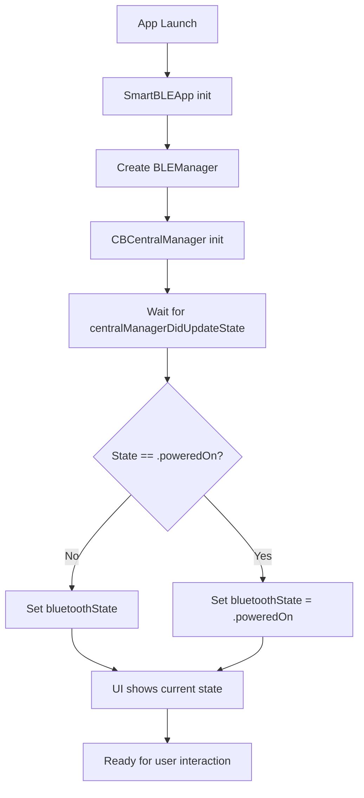
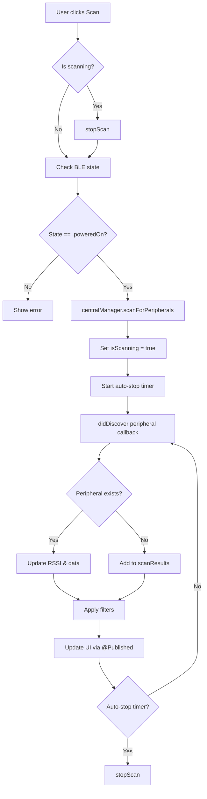
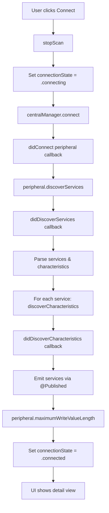
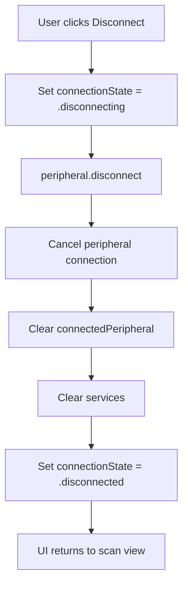
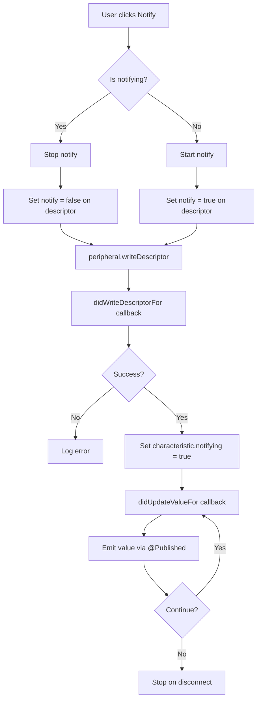
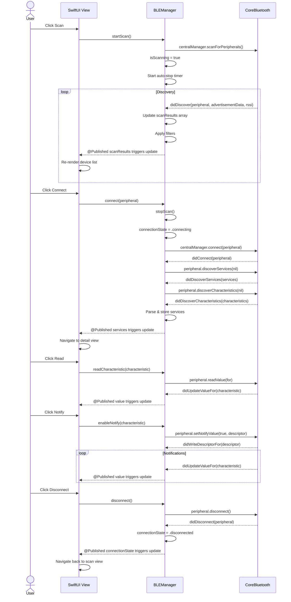

# SmartBLE iOS - Architecture Documentation

## Overview

SmartBLE iOS is a native iOS/macOS BLE (Bluetooth Low Energy) debugging tool built with SwiftUI and CoreBluetooth.

**Tech Stack:**
- **Language**: Swift
- **UI Framework**: SwiftUI
- **Architecture**: MVVM with Combine
- **BLE Framework**: CoreBluetooth
- **Platforms**: iOS 15+, macOS 12+

---

## Feature List

### Core Features
| Feature | iOS | macOS | Description |
|---------|-----|-------|-------------|
| BLE Initialization | ✅ | ✅ | Initialize BLE Central manager |
| Device Scanning | ✅ | ✅ | Scan for nearby BLE devices |
| Device Filtering | ✅ | ✅ | Filter by RSSI, name prefix, hide unnamed |
| Device Connection | ✅ | ✅ | Connect to discovered BLE peripherals |
| Service Discovery | ✅ | ✅ | Discover services and characteristics |
| Characteristic Read | ✅ | ✅ | Read values from characteristics |
| Characteristic Write | ✅ | ✅ | Write values (hex/string/bytes) |
| Characteristic Notify | ✅ | ✅ | Enable/disable notifications |
| Device Disconnection | ✅ | ✅ | Disconnect from connected device |
| BLE Broadcasting | ✅ | ✅ | Advertise as BLE peripheral |
| Log Panel | ✅ | ✅ | View operation logs |
| About Page | ✅ | ✅ | Show app info and version |

### UI Features
- Native SwiftUI with iOS/macOS adaptive layouts
- Real-time device list with signal indicators
- Expandable service/characteristic tree
- Filter panel with presets
- Loading states and animations
- Log panel with color-coded entries

---

## Architecture

### Directory Structure
```
ios/
├── Sources/
│   ├── SmartBLEApp.swift         # App entry point
│   ├── Models/
│   │   └── BLEModels.swift       # Data models
│   ├── Manager/
│   │   └── BLEManager.swift      # BLE manager (Central + Peripheral)
│   └── Views/
│       ├── ScanView.swift        # Device list & scan UI
│       ├── DeviceDetailView.swift # Service/char operations
│       ├── BroadcastView.swift   # Broadcasting UI
│       └── LogView.swift         # Log panel
└── Package.swift                 # Swift Package Manager config
```

### Data Models

```swift
// BLE State
enum BLEState {
    case unknown
    case unavailable
    case unauthorized
    case poweredOff
    case poweredOn
}

// Connection State
enum ConnectionState {
    case disconnected
    case connecting
    case connected
    case disconnecting
}

// Scan Result
struct ScanResult: Identifiable {
    let id: UUID              // Peripheral UUID
    let name: String?         // Device name
    let rssi: Int             // Signal strength
    let peripheral: CBPeripheral?
    var advertisementData: [String: Any]
}

// BLE Service
struct BLEService: Identifiable {
    let id: UUID              // Service UUID
    let uuid: CBUUID
    let characteristics: [BLECharacteristic]
    let isPrimary: Bool
}

// BLE Characteristic
struct BLECharacteristic: Identifiable {
    let id: UUID              // Characteristic UUID
    let uuid: CBUUID
    let properties: CBCharacteristicProperties
    var value: Data?
    var notifying: Bool
}
```

---

## Flow Diagrams

### 1. App Initialization Flow



### 2. Device Scan Flow



### 3. Connect Flow



### 4. Disconnect Flow



### 5. Characteristic Notify Flow



---

## Sequence Diagrams

### Complete Scan-Connect-Operate-Disconnect Flow



---

## BLE Manager Implementation

### Key Components

```swift
@MainActor
class BLEManager: NSObject, ObservableObject {
    // Central & Peripheral Managers
    private var centralManager: CBCentralManager!
    private var peripheralManager: CBPeripheralManager!

    // Connection
    private var connectedPeripheral: CBPeripheral?

    // @Published Properties (Reactive)
    @Published var bluetoothState: BLEState = .unknown
    @Published var scanResults: [ScanResult] = []
    @Published var isScanning = false
    @Published var connectionState: ConnectionState = .disconnected
    @Published var connectedDevice: ScanResult?
    @Published var services: [BLEService] = []
    @Published var logs: [LogEntry] = []
    @Published var isAdvertising = false

    // Filter Settings
    @Published var filterRSSI: Int = -100
    @Published var filterNamePrefix: String = ""
    @Published var hideNoNameDevices: Bool = false

    // Public API
    func startScan()
    func stopScan()
    func connect(_ peripheral: CBPeripheral)
    func disconnect()
    func readCharacteristic(_ characteristic: CBCharacteristic)
    func writeCharacteristic(_ characteristic: CBCharacteristic, data: Data)
    func enableNotify(_ characteristic: CBCharacteristic)
    func disableNotify(_ characteristic: CBCharacteristic)
    func startAdvertising(name: String, serviceUUIDs: [String])
    func stopAdvertising()
}
```

### CBCentralManagerDelegate

```swift
extension BLEManager: CBCentralManagerDelegate {
    func centralManagerDidUpdateState(_ central: CBCentralManager) {
        switch central.state {
        case .poweredOn:
            bluetoothState = .poweredOn
        case .poweredOff:
            bluetoothState = .poweredOff
        case .unauthorized:
            bluetoothState = .unauthorized
        default:
            bluetoothState = .unavailable
        }
    }

    func centralManager(_ central: CBCentralManager,
                        didDiscover peripheral: CBPeripheral,
                        advertisementData: [String: Any],
                        rssi: NSNumber) {
        // Update or add to scanResults
        // Apply filters
        // UI updates automatically via @Published
    }

    func centralManager(_ central: CBCentralManager,
                        didConnect peripheral: CBPeripheral) {
        connectionState = .connected
        peripheral.discoverServices(nil)
    }

    func centralManager(_ central: CBCentralManager,
                        didDisconnectPeripheral peripheral: CBPeripheral,
                        error: Error?) {
        connectionState = .disconnected
    }
}
```

### CBPeripheralDelegate

```swift
extension BLEManager: CBPeripheralDelegate {
    func peripheral(_ peripheral: CBPeripheral,
                    didDiscoverServices error: Error?) {
        guard let services = peripheral.services else { return }
        for service in services {
            peripheral.discoverCharacteristics(nil, for: service)
        }
    }

    func peripheral(_ peripheral: CBPeripheral,
                    didDiscoverCharacteristicsFor service: CBService,
                    error: Error?) {
        // Parse and store characteristics
        // Update @Published services
    }

    func peripheral(_ peripheral: CBPeripheral,
                    didUpdateValueFor characteristic: CBCharacteristic,
                    error: Error?) {
        // Update characteristic value
        // UI updates automatically via @Published
    }

    func peripheral(_ peripheral: CBPeripheral,
                    didWriteValueFor descriptor: CBDescriptor,
                    error: Error?) {
        // Handle descriptor write result (notify enable/disable)
    }
}
```

---

## SwiftUI Views

### ScanView

```swift
struct ScanView: View {
    @StateObject private var bleManager = BLEManager()

    var body: some View {
        NavigationView {
            VStack(spacing: 0) {
                // Filter Panel
                FilterPanel(
                    rssi: $bleManager.filterRSSI,
                    namePrefix: $bleManager.filterNamePrefix,
                    hideUnnamed: $bleManager.hideNoNameDevices
                )

                // Device List
                List(bleManager.filteredScanResults) { device in
                    DeviceRow(device: device)
                        .onTapGesture {
                            bleManager.connect(device.peripheral)
                        }
                }
            }
            .navigationTitle("SmartBLE")
            .toolbar {
                ToolbarItem(placement: .navigationBarTrailing) {
                    Button(bleManager.isScanning ? "Stop" : "Scan") {
                        bleManager.toggleScan()
                    }
                }
            }
        }
    }
}
```

### DeviceDetailView

```swift
struct DeviceDetailView: View {
    @StateObject private var bleManager = BLEManager()
    let device: ScanResult

    var body: some View {
        List {
            ForEach(bleManager.services) { service in
                Section(service.uuid.uuidString) {
                    ForEach(service.characteristics) { characteristic in
                        CharacteristicRow(characteristic: characteristic)
                            .onTapGesture {
                                if characteristic.properties.contains(.read) {
                                    bleManager.readCharacteristic(characteristic.cbCharacteristic)
                                }
                            }
                    }
                }
            }
        }
        .navigationTitle(device.name ?? "Unknown Device")
        .toolbar {
            ToolbarItem(placement: .navigationBarTrailing) {
                Button("Disconnect") {
                    bleManager.disconnect()
                }
            }
        }
    }
}
```

---

## Permissions (Info.plist)

### iOS
```xml
<key>NSBluetoothAlwaysUsageDescription</key>
<string>This app needs Bluetooth access to scan for and connect to nearby devices.</string>

<key>NSBluetoothPeripheralUsageDescription</key>
<string>This app needs Bluetooth peripheral access to advertise as a BLE device.</string>

<key>UIBackgroundModes</key>
<array>
    <string>bluetooth-central</string>
    <string>bluetooth-peripheral</string>
</array>
```

### macOS
```xml
<key>NSBluetoothAlwaysUsageDescription</key>
<string>This app needs Bluetooth access to scan for and connect to nearby devices.</string>
```

---

## Known Issues & Solutions

| Issue | Solution |
|-------|----------|
| Scan doesn't find devices | Check Bluetooth permission in Info.plist |
| Connection fails | Ensure device is not already connected |
| Services not discovered | Wait for didDiscoverServices callback |
| Notify doesn't work | Check if characteristic supports notify property |
| MTU negotiation | Some devices don't support, handle gracefully |
| Background scanning | Limited by iOS, may not work reliably |
| Pairing dialog | iOS may show pairing dialog automatically |

---

## Platform-Specific Notes

### iOS
- Requires NSBluetoothAlwaysUsageDescription in Info.plist
- Background scanning limited to ~10 seconds
- Location permission NOT required for BLE (unlike Android)
- Pairing handled automatically by iOS

### macOS
- Same permissions as iOS
- Background scanning more flexible
- May require user approval for Bluetooth access
- Supports multiple concurrent connections

### Cross-Platform
- CoreBluetooth API is the same for iOS and macOS
- Use conditional compilation for platform-specific code:
  ```swift
  #if os(iOS)
      // iOS-specific code
  #elseif os(macOS)
      // macOS-specific code
  #endif
  ```

---

## Testing Checklist

- [ ] Bluetooth permission approved
- [ ] Scan starts and finds devices
- [ ] Device list updates smoothly
- [ ] Filters work correctly
- [ ] Connection succeeds
- [ ] Services discovered
- [ ] Read operation works
- [ ] Write operation works
- [ ] Notify operation works
- [ ] Disconnect works cleanly
- [ ] Broadcast mode works
- [ ] Log panel captures operations
- [ ] No crashes during normal flow
