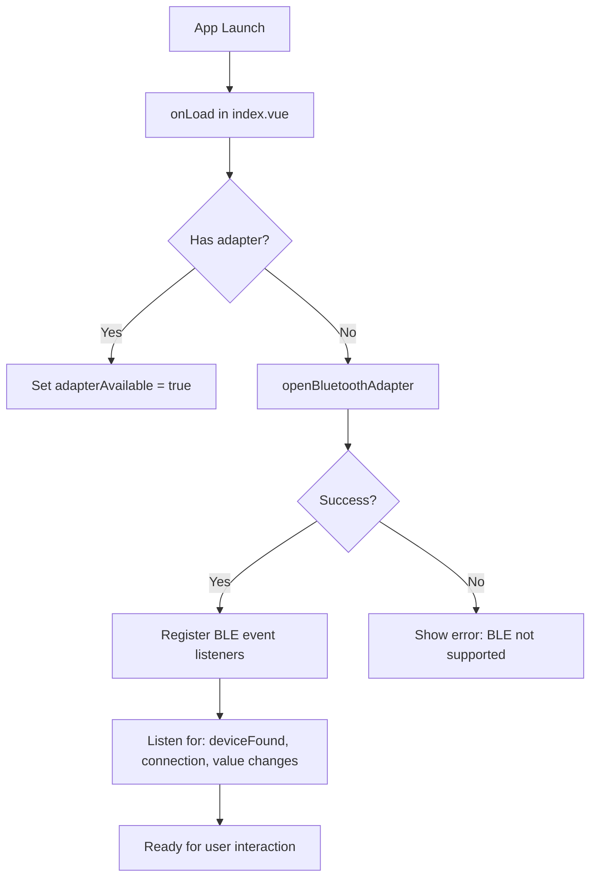
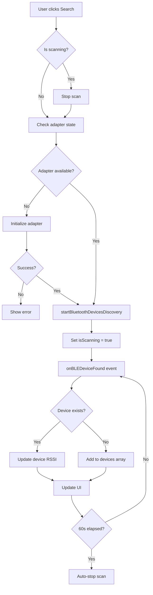
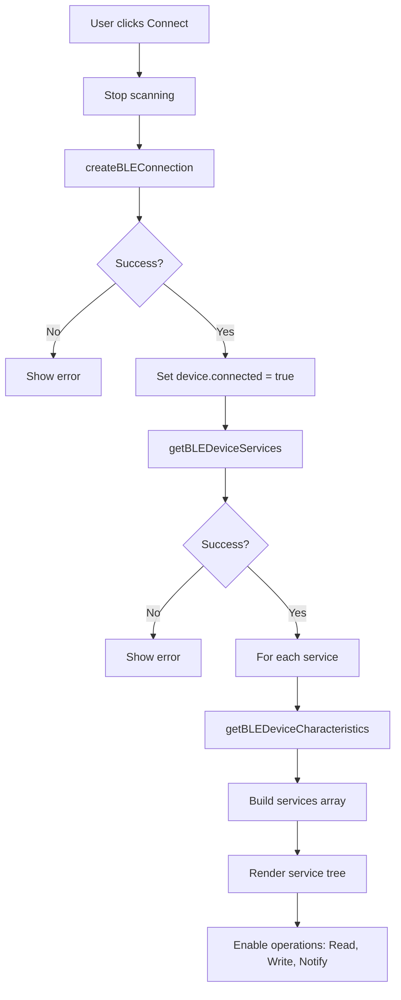
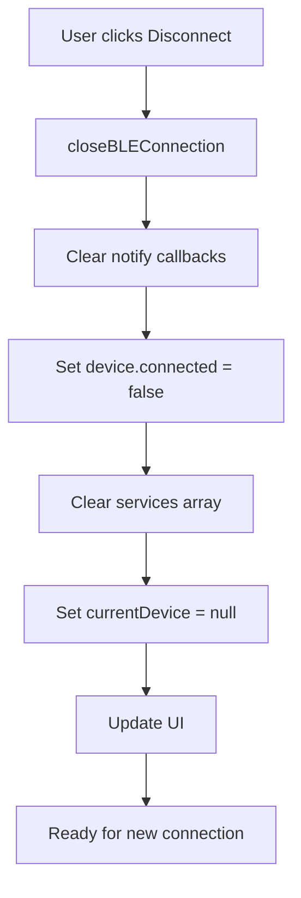
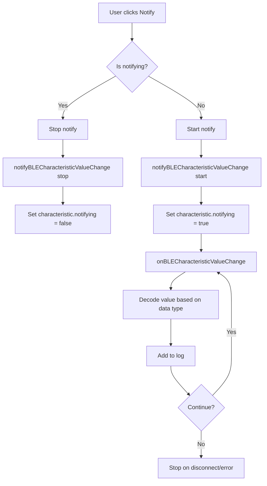
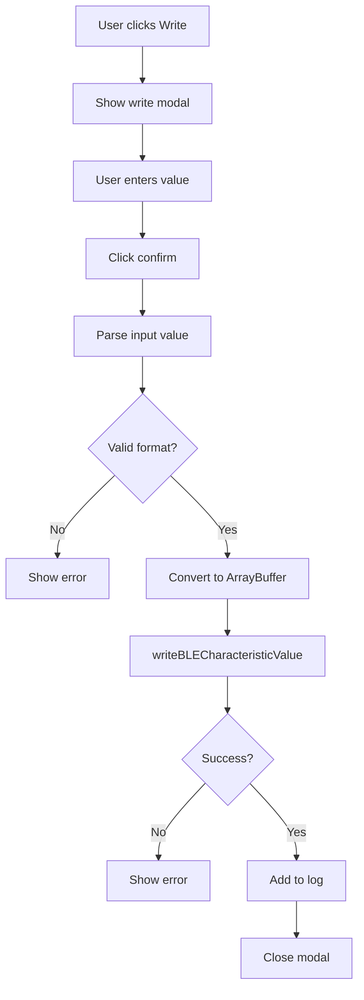
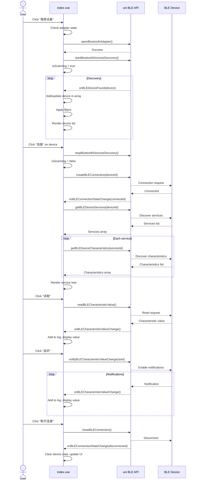

# SmartBLE UniApp - Architecture Documentation

## Overview

SmartBLE UniApp is a cross-platform mobile BLE (Bluetooth Low Energy) debugging tool built with UniApp framework, supporting iOS, Android, and various mini-programs.

**Tech Stack:**
- **Framework**: UniApp (Vue 2 based)
- **Language**: JavaScript/Vue.js
- **Platforms**: iOS, Android, WeChat Mini Program, Alipay Mini Program
- **BLE API**: uni.openBluetoothAdapter, uni.getBLEDeviceCharacters, etc.

---

## Feature List

### Core Features
| Feature | iOS | Android | Mini Program | Description |
|---------|-----|---------|--------------|-------------|
| BLE Initialization | ✅ | ✅ | ✅ | Initialize BLE adapter |
| Device Scanning | ✅ | ✅ | ✅ | Scan for nearby BLE devices |
| Device Filtering | ✅ | ✅ | ✅ | Filter by RSSI, name prefix, hide unnamed |
| Device Connection | ✅ | ✅ | ✅ | Connect to discovered peripherals |
| Service Discovery | ✅ | ✅ | ✅ | Discover services and characteristics |
| Characteristic Read | ✅ | ✅ | ✅ | Read values from characteristics |
| Characteristic Write | ✅ | ✅ | ✅ | Write values to characteristics |
| Characteristic Notify | ✅ | ✅ | ✅ | Enable/disable notifications |
| Advertising Data | ✅ | ✅ | ✅ | View device advertising data |
| BLE Broadcasting | ✅ | ✅ | ❌ | Advertise as BLE peripheral (native plugin) |
| Log Panel | ✅ | ✅ | ✅ | View operation logs |
| About Page | ✅ | ✅ | ✅ | App information and version |

### UI Features
- Real-time device list with signal strength indicators
- Expandable service/characteristic tree view
- Filter panel with RSSI slider and name prefix input
- Connection status indicators
- Modal dialogs for advertising data and write operations
- Loading states and animations

---

## Architecture

### Directory Structure
```
uniapp/
├── src/
│   ├── pages/
│   │   ├── index/           # Main scan page
│   │   │   └── index.vue    # Device list & connection UI
│   │   ├── device/
│   │   │   └── detail.vue   # Device detail page (legacy)
│   │   ├── broadcast/
│   │   │   └── index.vue    # BLE broadcasting page
│   │   └── about/
│   │       ├── index.vue    # About page
│   │       └── version.vue  # Version component
│   └── utils/
│       └── ble-utils.js     # BLE utility functions
├── nativeplugins/
│   └── LysBlePeripheral/    # Native plugin for broadcasting
├── pages.json               # Page configuration
├── manifest.json            # App manifest
├── App.vue                  # App root component
└── main.js                  # Entry point
```

### Data Model

#### Device Object
```javascript
{
    deviceId: String,        // Unique device ID
    name: String,            // Device name (may be empty)
    RSSI: Number,            // Signal strength (-100 to 0)
    localName: String,       // Name from advertising data
    advertisData: Object,    // Complete advertising data
    connected: Boolean,      // Connection status
    services: Array          // Discovered services (cached)
}
```

#### Service Object
```javascript
{
    uuid: String,            // Service UUID
    isPrimary: Boolean,      // Primary service flag
    characteristics: Array   // Characteristic list
}
```

#### Characteristic Object
```javascript
{
    uuid: String,            // Characteristic UUID
    properties: {
        read: Boolean,       // Read supported
        write: Boolean,      // Write supported
        notify: Boolean,     // Notify supported
        indicate: Boolean    // Indicate supported
    },
    value: ArrayBuffer,      // Current value
    notifying: Boolean       // Currently notifying
}
```

### BLE State Management

```javascript
// Main data in index.vue
data() {
    return {
        // BLE State
        adapterAvailable: false,   // BLE adapter available
        isScanning: false,          // Currently scanning
        scanTimer: null,            // Auto-stop timer (60s)

        // Device Data
        devices: [],                // Discovered devices
        currentDevice: null,        // Connected device
        services: [],               // Discovered services

        // Filters
        filterRSSI: -100,           // RSSI threshold
        filterPrefix: '',           // Name prefix filter
        hideNoName: false,          // Hide unnamed devices

        // UI State
        showAdvDataModal: false,    // Advertising modal
        showWriteModal: false,      // Write modal
        writeValue: '',             // Write input value

        // Logging
        logs: [],                   // Operation logs

        // Notification tracking
        notifyCallbacks: {}         // Characteristic notify callbacks
    }
}
```

---

## Flow Diagrams

### 1. App Initialization Flow



### 2. Device Scan Flow



### 3. Connect Flow



### 4. Disconnect Flow



### 5. Characteristic Notify Flow



### 6. Write Flow



---

## Sequence Diagrams

### Complete Scan-Connect-Operate-Disconnect Flow



---

## BLE Event Handlers

### UniApp BLE Events

| Event | Handler | Description |
|-------|---------|-------------|
| `onBLEDeviceFound` | onDeviceFound | New device discovered during scan |
| `onBLEConnectionStateChange` | onConnectionStateChange | Connection state changed |
| `onBLECharacteristicValueChange` | onCharacteristicValueChange | Characteristic value changed |
| `onBLEMTUChange` | onMTUChange | MTU size changed |

### Event Implementation

```javascript
// Device discovery
onBluetoothDeviceFound(res) {
    const device = res.devices[0];
    const existing = this.devices.find(d => d.deviceId === device.deviceId);
    if (existing) {
        // Update RSSI
        existing.RSSI = device.RSSI;
        existing.advertisData = device.advertisData;
    } else {
        // Add new device
        this.devices.push(device);
    }
}

// Connection state change
onBLEConnectionStateChange(res) {
    if (res.connected) {
        console.log('Connected to', res.deviceId);
        this.getServices(res.deviceId);
    } else {
        console.log('Disconnected from', res.deviceId);
        this.handleDisconnect();
    }
}

// Characteristic value change
onBLECharacteristicValueChange(res) {
    const { deviceId, serviceId, characteristicId, value } = res;
    const hex = this.ab2hex(value); // ArrayBuffer to hex
    this.addLog('notify', `Received: ${hex}`);
}
```

---

## Utility Functions

### ble-utils.js

```javascript
// Format UUID (remove dashes)
formatUUID(uuid) → String

// Get short UUID (4 chars for standard, full for custom)
getShortUUID(uuid) → String

// Get service name from UUID
getServiceName(uuid) → String

// Get characteristic name from UUID
getCharacteristicName(uuid) → String
```

### Data Conversion

```javascript
// ArrayBuffer to Hex string
ab2hex(buffer) → String

// Hex string to ArrayBuffer
hex2ab(hex) → ArrayBuffer

// String to ArrayBuffer (UTF-8)
str2ab(str) → ArrayBuffer

// ArrayBuffer to String
ab2str(buffer) → String
```

---

## Known Issues & Solutions

| Issue | Solution |
|-------|----------|
| Device list flickers | Use device ID to update existing devices instead of replacing |
| Duplicate devices | Use deviceId as unique key, update RSSI only |
| Auto-stop after 60s | Set timer when scan starts, clear when stopped |
| Notify not working on some devices | Check if characteristic supports notify property |
| MTU limit on Android | Request MTU change after connection |
| Connection fails | Ensure adapter is initialized, retry connection |
| Service discovery timeout | Increase timeout or handle empty result |

---

## Platform-Specific Notes

### iOS
- Requires location permission for BLE scanning
- Background scanning limited
- MTU negotiation supported

### Android
- Requires BLUETOOTH_SCAN and BLUETOOTH_CONNECT permissions (Android 12+)
- Supports larger MTU (can request up to 517)
- Background scanning more flexible

### WeChat Mini Program
- Requires ` bluetooth` permission in app.json
- Limited to 10 low-energy devices
- Auto-disconnect after 1 minute without activity
- Some characterstic operations may be restricted

---

## Page Configuration (pages.json)

```json
{
    "pages": [
        {
            "path": "pages/index/index",
            "style": {
                "navigationBarTitleText": "SmartBLE",
                "enablePullDownRefresh": false
            }
        },
        {
            "path": "pages/broadcast/index",
            "style": {
                "navigationBarTitleText": "BLE广播"
            }
        },
        {
            "path": "pages/about/index",
            "style": {
                "navigationBarTitleText": "关于"
            }
        }
    ]
}
```

---

## Testing Checklist

- [ ] Adapter initializes correctly
- [ ] Scan starts and finds devices
- [ ] Device list updates smoothly
- [ ] Filters work (RSSI, name prefix, hide unnamed)
- [ ] Connect button works
- [ ] Connection status updates
- [ ] Services are discovered
- [ ] Characteristics are discovered
- [ ] Read operation works
- [ ] Write operation works
- [ ] Notify operation works
- [ ] Disconnect works cleanly
- [ ] Log panel captures all operations
- [ ] Advertising data modal shows correct data
- [ ] Broadcast page works (where supported)

---

## Common Code Patterns

### Safe BLE Operation Pattern

```javascript
async safeBLEOperation(operation) {
    if (!this.adapterAvailable) {
        await this.initAdapter();
    }

    try {
        const result = await operation();
        this.addLog('success', 'Operation succeeded');
        return result;
    } catch (error) {
        this.addLog('error', `Operation failed: ${error.errMsg}`);
        throw error;
    }
}
```

### Device Filter Pattern

```javascript
get filteredDevices() {
    return this.devices.filter(device => {
        // RSSI filter
        if (device.RSSI < this.filterRSSI) return false;

        // Name prefix filter
        if (this.filterPrefix) {
            const name = device.name || device.localName || '';
            if (!name.toLowerCase().startsWith(this.filterPrefix.toLowerCase())) {
                return false;
            }
        }

        // Hide unnamed filter
        if (this.hideNoName && !device.name && !device.localName) {
            return false;
        }

        return true;
    }).sort((a, b) => b.RSSI - a.RSSI); // Sort by signal strength
}
```

---

## Native Plugin: LysBlePeripheral

For BLE broadcasting (peripheral mode), a native plugin is used:

### Plugin Structure
```
LysBlePeripheral/
├── ios/                      # iOS native code
│   └── Classes/
│       └── LysBlePeripheral.swift
├── android/                  # Android native code
│   └── LysBlePeripheral.java
└── package.json              # Plugin config
```

### Plugin Methods
```javascript
// Start advertising
LysBlePeripheral.startAdvertising({
    name: 'TestDevice',
    serviceUuid: 'FFF0'
});

// Stop advertising
LysBlePeripheral.stopAdvertising();
```
