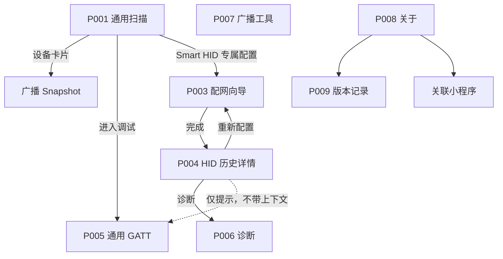
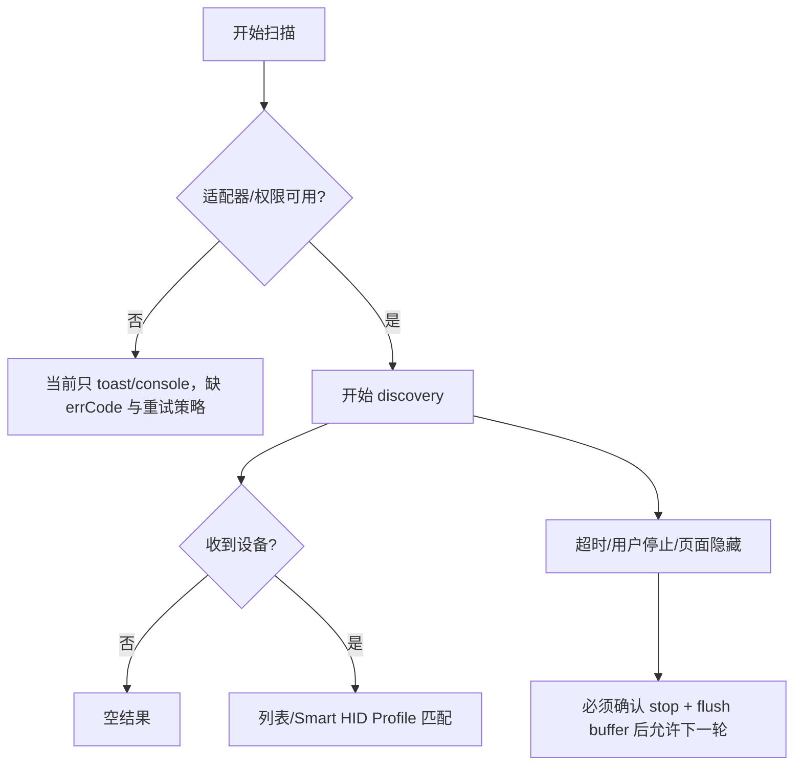

# 页面与用户流

```mermaid
flowchart TD
  A[P001 通用扫描] -->|设备卡片| B[广播 Snapshot]
  A -->|进入调试| C[P005 通用 GATT]
  A -->|Smart HID 专属配置| E[P003 配网向导]
  E -->|完成| F[P004 HID 历史详情]
  F -->|重新配置| E
  F -->|诊断| G[P006 诊断]
  F -.仅提示，不带上下文.-> C
  H[P007 广播工具]
  I[P008 关于] --> J[P009 版本记录]
  I --> K[关联小程序]
```

## 异常流

```mermaid
flowchart TD
 S[开始扫描] --> V{适配器/权限可用?}
 V -- 否 --> E[当前只 toast/console，缺 errCode 与重试策略]
 V -- 是 --> D[开始 discovery]
 D --> R{收到设备?}
 R -- 否 --> N[空结果]
 R -- 是 --> L[列表/Smart HID Profile 匹配]
 D --> T[超时/用户停止/页面隐藏]
 T --> X[必须确认 stop + flush buffer 后允许下一轮]
```

产品问题：通用扫描、Smart HID 扫描共用同一全局 discovery；用户从一个 flow 跳到另一个 flow 时，没有 visible 的 session 归属和交接。
