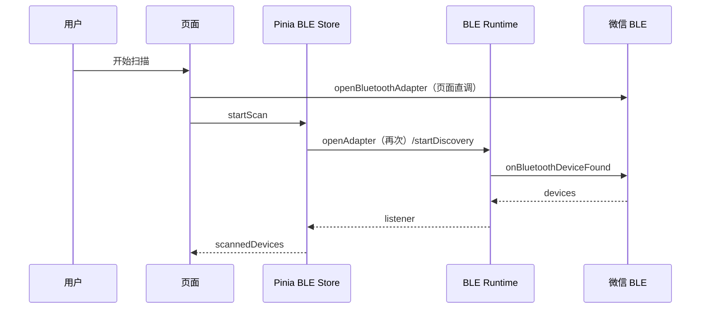

# 当前实现审计

## 数据链路

## 状态与持久化

- `bleStore.scannedDevices`、连接状态：内存；重启/重新进入不保留。
- `hidStore.knownDevices`：亦只见 Pinia 内存实现，未发现 `setStorage`；“历史设备”跨小程序重启不可成立。
- pairing token 和 Wi-Fi 密码未发现写入 storage，符合安全要求。
- 未发现 HTTP API、登录、服务端数据持久化；这些项目级能力不适用。

## 重要实现偏差

1. Runtime 已统一发现/特征/连接回调，但 adapter-state callback 仍在 P001 直接注册。
2. Store 的 scan catch 记录 console 后返回列表，页面不能区分 API fail/empty。
3. 现有 runtime 测试覆盖 listener 路由、断连、read timeout；不覆盖连续扫描、stop race、page hide 或字段快照。
4. 当前 dist 缺新静态资源；源代码与实际调试产物不同步。
