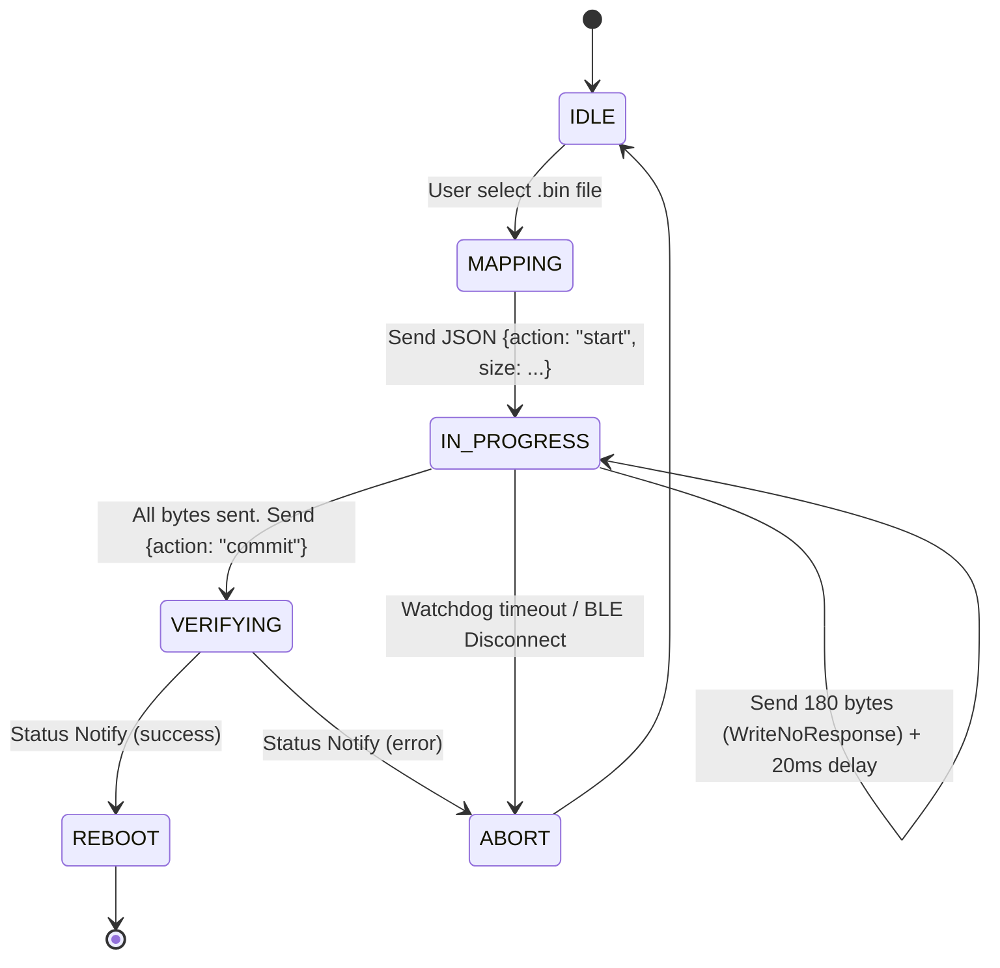

# 商业级 OTA / 固件空中升级架构蓝图

大文件和固件在低功耗蓝牙（BLE）链路中的传输往往伴随着极高的丢包率和 MTU 碎片化危机。Smart BLE 采用**基于三通道隔离的命令-数据微型状态机**进行固件下发，确保 Flutter、UNI-APP 和 Tauri 等多端设备能在同一套可靠性策略下完成跨平台更新。

## 1. 核心频道拆分 (Topography)

为避免高速固件分片数据拥塞导致控制信号延迟，我们严格切分以下三条独立的特征流（Characteristics）：

| 名称 | UUID | 属性权限 | 用途说明 |
| :--- | :--- | :--- | :--- |
| **Service 主服务** | `4fafc201-1fb5-459e-8fcc-c5c9c331914d` | - | 挂载 OTA 的主服务，下位机广播时可携带。 |
| **Control 控制台** | `beb5483e-36e1-4688-b7f5-ea07361b26c0` | `Write` | 通讯协调端口。负责收发如 `start`, `commit`, `abort` 等轻量级 **JSON-RPC 指令**。必须要求硬件确认 (With Response)。 |
| **Data 高速数据流** | `beb5483e-36e1-4688-b7f5-ea07361b26c1` | `WriteWithoutResponse` | 固件文件通道。所有二进制碎片均通过此通道单向倾泻，追求极限传输速率。 |
| **Status 状态回传** | `beb5483e-36e1-4688-b7f5-ea07361b26c2` | `Notify/Indicate` | 硬件下位机向 App 推送验证进度、校验警告或安装异常错误的唯一通道。 |

::: warning
**硬件端绝对禁令**：在数据传输阶段（`Data` 通道狂飙时），如果硬件发生致命性错误空间不足，必须通过 `Status` 通道异步拉高 Notify 进行报警。App 监听到 Alarm 会强行发出 `abort` 阻断上传流。
:::

## 2. 动态分包与 MTU 控制策略

BLE 的默认物理 MTU 只有极小的 23 Bytes（实际负载仅约 20 Bytes）。更新上 MB 的微控制器固件时，若以 20 字节切割会导致冗长的握手时间开销。因此我们制定了一套普适的分块防抖机制：

1. **强行提权协商 (MTU Negotiation)**: APP 在启动 OTA 前必须发出最低 `MTU=247` 的申请。
2. **黄金分割限制 (180 Bytes Chunking)**: 尽管蓝牙 4.2+ 支持 244 字节的最大净荷，但为了防范部分山寨级 Android 设备的蓝牙栈溢出，我们将 **单包切片卡口写死在 180 Bytes**，这是一套经历了百万设备验证的抗攻击尺寸。
3. **休眠节流阀 (Chunk Delay)**: 每发送 180 字节后，必须强制 Thread Delay 休眠 `20ms`，配合下位机将串口或 RAM 数据腾挪进 Flash 区。

## 3. 全链路状态机

> [!NOTE]
> 在执行 `commit` 后，下位机应当验证 MD5 或者系统级校验（取决于下位机 SDK），在这期间无论消耗几秒钟，APP 必须阻塞挂起，绝对不能强行中断蓝牙。只有下位机发送 `status=success` 后，方可判定完全竣工。
