# Smart BLE 项目全面梳理文档

> 生成时间：2026-04-11  
> 基于代码现状整理，覆盖 UniApp、Flutter、Android、iOS、Tauri、Electron、macOS Native

---

## 目录

1. [整体架构图](#1-整体架构图)
2. [页面结构对照](#2-页面结构对照)
3. [各平台页面交互草稿](#3-各平台页面交互草稿)
4. [核心 BLE 操作时序图](#4-核心-ble-操作时序图)
5. [完整业务流程图](#5-完整业务流程图)
6. [状态机图](#6-状态机图)
7. [平台差异对照矩阵](#7-平台差异对照矩阵)
8. [当前不一致问题清单](#8-当前不一致问题清单)
9. [统一建议](#9-统一建议)

---

## 1. 整体架构图

### 1.1 产品家族架构

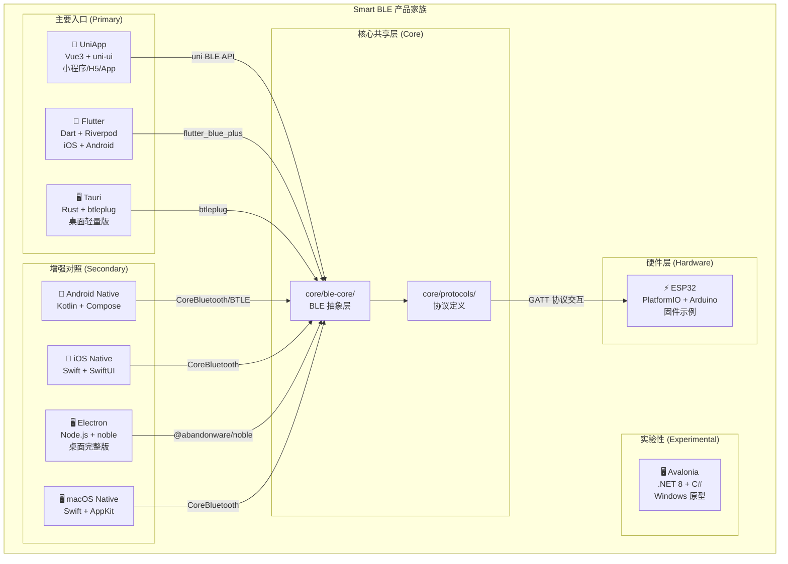
```mermaid
graph TB
    subgraph "Smart BLE 产品家族"
        subgraph "主要入口 (Primary)"
            UA["📱 UniApp<br/>Vue3 + uni-ui<br/>小程序/H5/App"]
            FL["📱 Flutter<br/>Dart + Riverpod<br/>iOS + Android"]
            TR["🖥️ Tauri<br/>Rust + btleplug<br/>桌面轻量版"]
        end

        subgraph "增强对照 (Secondary)"
            AN["📱 Android Native<br/>Kotlin + Compose"]
            IO["📱 iOS Native<br/>Swift + SwiftUI"]
            EL["🖥️ Electron<br/>Node.js + noble<br/>桌面完整版"]
            MC["🖥️ macOS Native<br/>Swift + AppKit"]
        end

        subgraph "实验性 (Experimental)"
            AV["🖥️ Avalonia<br/>.NET 8 + C#<br/>Windows 原型"]
        end

        subgraph "硬件层 (Hardware)"
            ESP["⚡ ESP32<br/>PlatformIO + Arduino<br/>固件示例"]
        end

        subgraph "核心共享层 (Core)"
            BLE["core/ble-core/<br/>BLE 抽象层"]
            PROTO["core/protocols/<br/>协议定义"]
        end
    end

    UA -->|"uni BLE API"| BLE
    FL -->|"flutter_blue_plus"| BLE
    TR -->|"btleplug"| BLE
    AN -->|"CoreBluetooth/BTLE"| BLE
    IO -->|"CoreBluetooth"| BLE
    EL -->|"@abandonware/noble"| BLE
    MC -->|"CoreBluetooth"| BLE
    BLE --> PROTO
    PROTO -->|"GATT 协议交互"| ESP
```

### 1.2 单平台内部架构（以 Flutter 为例）

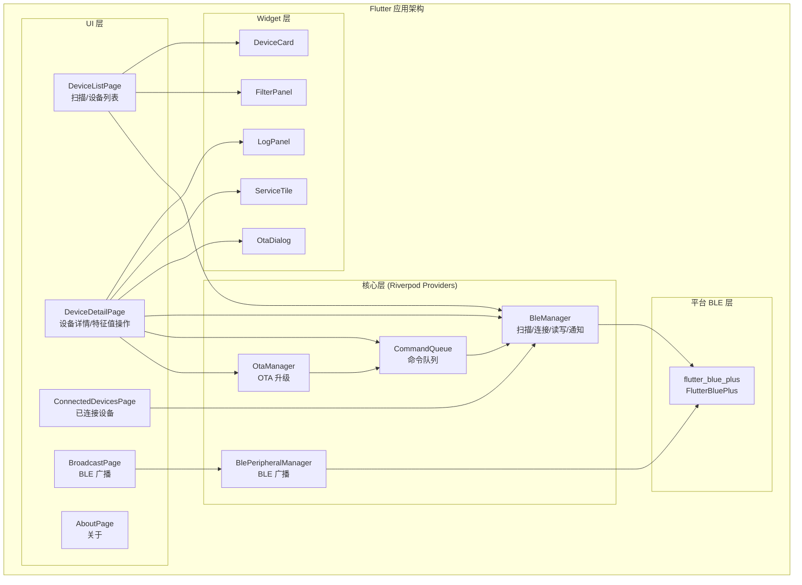
```mermaid
graph TB
    subgraph "Flutter 应用架构"
        subgraph "UI 层"
            DLP["DeviceListPage<br/>扫描/设备列表"]
            CDP["ConnectedDevicesPage<br/>已连接设备"]
            DDP["DeviceDetailPage<br/>设备详情/特征值操作"]
            BP["BroadcastPage<br/>BLE 广播"]
            AP["AboutPage<br/>关于"]
        end

        subgraph "Widget 层"
            DC["DeviceCard"]
            FP["FilterPanel"]
            LP["LogPanel"]
            ST["ServiceTile"]
            OD["OtaDialog"]
        end

        subgraph "核心层 (Riverpod Providers)"
            BM["BleManager<br/>扫描/连接/读写/通知"]
            BPM["BlePeripheralManager<br/>BLE 广播"]
            CQ["CommandQueue<br/>命令队列"]
            OM["OtaManager<br/>OTA 升级"]
        end

        subgraph "平台 BLE 层"
            FBP["flutter_blue_plus<br/>FlutterBluePlus"]
        end
    end

    DLP --> DC
    DLP --> FP
    DDP --> LP
    DDP --> ST
    DDP --> OD
    DLP --> BM
    CDP --> BM
    DDP --> BM
    DDP --> CQ
    BP --> BPM
    DDP --> OM
    BM --> FBP
    BPM --> FBP
    CQ --> BM
    OM --> CQ
```

### 1.3 UniApp 内部架构

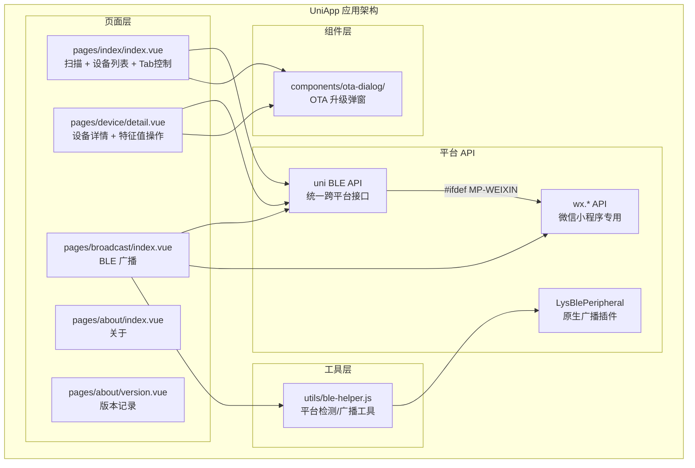
```mermaid
graph TB
    subgraph "UniApp 应用架构"
        subgraph "页面层"
            IDX["pages/index/index.vue<br/>扫描 + 设备列表 + Tab控制"]
            DTL["pages/device/detail.vue<br/>设备详情 + 特征值操作"]
            BRD["pages/broadcast/index.vue<br/>BLE 广播"]
            ABT["pages/about/index.vue<br/>关于"]
            VER["pages/about/version.vue<br/>版本记录"]
        end

        subgraph "组件层"
            OTA["components/ota-dialog/<br/>OTA 升级弹窗"]
        end

        subgraph "工具层"
            BH["utils/ble-helper.js<br/>平台检测/广播工具"]
        end

        subgraph "平台 API"
            UAPI["uni BLE API<br/>统一跨平台接口"]
            WX["wx.* API<br/>微信小程序专用"]
            NATIVE["LysBlePeripheral<br/>原生广播插件"]
        end
    end

    IDX --> OTA
    DTL --> OTA
    BRD --> BH
    BH --> NATIVE
    IDX --> UAPI
    DTL --> UAPI
    BRD --> WX
    BRD --> UAPI
    UAPI -->|"#ifdef MP-WEIXIN"| WX
```

---

## 2. 页面结构对照

### 2.1 各平台页面/视图对照表

> **注**：「已连接设备管理」是**多设备并发连接的核心功能目标**，不是 Flutter 专属。各平台底层 BLE 栈均支持，差异在于 UI 和状态中心是否已实现。

| 功能模块 | UniApp | Flutter | Android | iOS | Tauri | Electron |
|---------|--------|---------|---------|-----|-------|----------|
| **扫描/设备列表** | `pages/index/index.vue` | `DeviceListPage` | `DeviceListScreen` | `ScanView` | `deviceListView` | `deviceList` section |
| **已连接设备管理** | 🚧 待实现（Pinia 全局 Store）| ✅ `ConnectedDevicesPage` | 🚧 待实现（ViewModel Map）| 🚧 待实现（CBCentralManager 单例）| 🚧 待实现（全局状态）| 🚧 待实现（全局 Map）|
| **设备详情/特征值** | `pages/device/detail.vue` | `DeviceDetailPage` | `DeviceDetailScreen` | `DeviceDetailView` | `deviceDetailView` | `deviceDetail` section |
| **BLE 广播** | `pages/broadcast/index.vue` | `BroadcastPage` | `BroadcastScreen` | `BroadcastView` | `broadcastView` | `broadcast` section |
| **关于** | `pages/about/index.vue` | `AboutPage` | `AboutScreen` | ❓ 未确认 | `aboutView` | `about` section |
| **版本记录** | `pages/about/version.vue` | ❌ 无 | ❌ 无 | ❌ 无 | ❌ 无 | ❌ 无 |
| **OTA 升级** | `components/ota-dialog/` | `OtaDialog` (widget) | ❓ 未确认 | ❌ 无 | ❌ 无 | ❌ 无 |
| **日志面板** | 内联于 detail 页 | `LogPanel` (widget) | 内联于 detail | `LogView` (独立) | 内联于 detail | 内联于 detail |

### 2.2 导航模式对照

| 平台 | 导航模式 | 说明 |
|------|---------|------|
| UniApp | **多页路由** + Tab nav | `uni.navigateTo()` 跳转，index 作为主入口 |
| Flutter | **底部 Tab** + Push route | `BottomNavigationBar` (4 Tab) + `Navigator.push` 进入详情 |
| Android | **NavController** 多屏 | Compose Navigation |
| iOS | **NavigationLink** 多视图 | SwiftUI Navigation |
| Tauri | **单页 Tab 切换** | SPA，切换视图 div 显隐 |
| Electron | **单页视图切换** | SPA，JS 控制 section 显隐 |
| macOS Native | **Split View** | 侧边栏 + 内容区 |

**关键说明**：UniApp 有「版本记录」子页，其他平台没有。「已连接设备」Tab 是多设备管理功能的 UI 入口，Flutter 已实现，其他平台为待跟进项目。

---

## 3. 各平台页面交互草稿

### 3.1 扫描页（首页/设备列表页）

#### 3.1.1 页面内容规范（目标统一态）

```
┌─────────────────────────────────────────┐
│  ← BLE Toolkit+              [蓝牙状态] │  导航栏
├─────────────────────────────────────────┤
│  ▼ 过滤设置                             │  可折叠面板（默认折叠）
│    信号强度: [━━━━━━━━━━] -70 dBm       │
│    预设: [-100] [-80] [-60] [-40]       │
│    名称前缀: [___________________]      │
│    □ 隐藏无名称设备      [重置]         │
├─────────────────────────────────────────┤
│  [🔍 开始扫描]   发现 12 台 / 共 30 台  │  操作行
├─────────────────────────────────────────┤
│  ┌─────────────────────────────────────┐│
│  │ 📶 ESP32-BLE        [BLE]    [连接] ││  设备卡片
│  │    ...E7:88        ▂▃▅▇  -65 dBm  ││
│  └─────────────────────────────────────┘│
│  ┌─────────────────────────────────────┐│
│  │ 📶 nRF52              [BLE]  [已连接]││  已连接状态（灰色禁用）
│  │    ...AA:BB        ▂▃▅   -72 dBm  ││
│  └─────────────────────────────────────┘│
│  ┌─────────────────────────────────────┐│
│  │ 📶 未知设备                   [连接] ││
│  │    ...CC:DD        ▂     -88 dBm  ││
│  └─────────────────────────────────────┘│
└─────────────────────────────────────────┘

点击设备卡片（非连接按钮）→ 弹出广播信息弹窗：
┌─────────────────────────────────────────┐
│  广播信息                            [×] │
├─────────────────────────────────────────┤
│  设备ID:  AA:BB:CC:DD:EE:FF             │
│  名称:    ESP32-BLE                     │
│  RSSI:   -65 dBm                        │
│                                         │
│  广播服务 UUIDs:                         │
│  FFE0                                   │
│  180A                                   │
│                                         │
│  广播数据 (Hex):                         │
│  0201060A00...                          │
├─────────────────────────────────────────┤
│       [复制全部]    [关闭]              │
└─────────────────────────────────────────┘
```

#### 3.1.2 各平台当前状态

| 元素 | UniApp | Flutter | Android | iOS | Tauri |
|------|--------|---------|---------|-----|-------|
| 过滤面板折叠 | ✅ | ✅ | ✅ | ✅ | ✅ |
| RSSI 滑块 | ✅ | ✅ | ✅ | ✅ | ✅ |
| 预设按钮 | ❌ 无 | ✅ | ✅ | ✅ | ✅ |
| 名称前缀过滤 | ✅ | ✅ | ✅ | ✅ | ✅ |
| 隐藏无名称 | ✅ | ✅ | ✅ | ✅ | ✅ |
| 重置按钮 | ❌ 无 | ✅ | ✅ | ✅ | ✅ |
| 蓝牙状态指示 | ✅ | ✅ | ✅ | ✅ | ⚠️ |
| 广播信息弹窗 | ✅ 自定义 | ✅ | ✅ | ✅ | ✅ |
| 复制广播数据 | ✅ | ✅ | ✅ | ✅ | ✅ |

### 3.2 设备详情页

#### 3.2.1 页面内容规范（目标统一态）

```
┌─────────────────────────────────────────┐
│  ← 设备详情                             │  导航栏
├─────────────────────────────────────────┤
│  ┌─────────────────────────────────────┐│
│  │ ESP32-BLE  ● 已连接                 ││  设备信息面板
│  │ ID: AA:BB:CC:DD:EE:FF               ││
│  │ [清空日志] [导出日志] [断开/连接]    ││
│  └─────────────────────────────────────┘│
├─────────────────────────────────────────┤
│  服务列表         [展开全部 / 收起全部]  │
│  ┌─────────────────────────────────────┐│
│  │▶ 服务 1: FFE0（自定义服务）         ││  折叠状态
│  └─────────────────────────────────────┘│
│  ┌─────────────────────────────────────┐│
│  │▼ 服务 2: 设备信息 (180A)            ││  展开状态
│  │  ┌───────────────────────────────┐  ││
│  │  │ 制造商名称 (2A29)             │  ││  特征值
│  │  │ 属性: [Read]                  │  ││
│  │  │ [📖 读取]                     │  ││
│  │  ├───────────────────────────────┤  ││
│  │  │ 型号 (2A24)                   │  ││
│  │  │ 属性: [Read] [Write] [Notify] │  ││
│  │  │ [📖读取] [✏️写入] [🔔监听]    │  ││
│  │  └───────────────────────────────┘  ││
│  └─────────────────────────────────────┘│
│  [固件更新 OTA]  <- 仅检测到OTA服务时显示│
├─────────────────────────────────────────┤  固定底部日志
│  通信日志                               │
│  ┌─────────────────────────────────────┐│
│  │ 14:23:15 [系统] 初始化蓝牙适配器   ││
│  │ 14:23:16 [系统] 设备连接成功       ││
│  │ 14:23:17 [读取] 开始读取: 2A29     ││
│  │ 14:23:18 [接收] HEX: 4C 59 53...  ││
│  │          TEXT: LYS...              ││
│  └─────────────────────────────────────┘│
└─────────────────────────────────────────┘

写入弹窗：
┌─────────────────────────────────────────┐
│  写入数据                           [×] │
├─────────────────────────────────────────┤
│  数据类型: ◉ 文本  ○ HEX               │
│  数据内容: [________________________]   │
│  提示: 文本→UTF-8编码; HEX→如 FF 01    │
├─────────────────────────────────────────┤
│       [取消]            [确定发送]      │
└─────────────────────────────────────────┘
```

#### 3.2.2 各平台当前状态

| 元素 | UniApp | Flutter | Android | iOS | Tauri |
|------|--------|---------|---------|-----|-------|
| 设备名 + 连接状态 | ✅ | ✅ | ✅ | ✅ | ✅ |
| 操作按钮行 | ✅ [清空][导出][连接] | ✅ | ✅ | ⚠️ | ✅ |
| 服务列表折叠 | ✅ | ✅ | ✅ | ✅ | ✅ |
| 展开/收起全部 | ✅ | ✅ | ✅ | ⚠️ | ✅ |
| 特征值属性标签 | ✅ | ✅ | ✅ | ⚠️ | ✅ |
| 读取按钮 | ✅ | ✅ | ✅ | ✅ | ✅ |
| 写入弹窗（文本+HEX切换）| ✅ | ✅ | ✅ | ✅ | ✅ |
| 监听按钮（状态切换）| ✅ | ✅ | ✅ | ✅ | ✅ |
| 日志面板（底部固定）| ✅ | ✅ | ✅ | ⚠️ 独立页 | ✅ |
| 日志导出/复制 | ✅ 复制 | ✅ 文件导出 | ⚠️ | ✅ | ✅ |
| OTA 升级入口 | ✅ 按需显示 | ✅ dialog | ❌ | ❌ | ❌ |
| 自动重连（3次）| ✅ | ❌ | ✅ | ❌ | ❌ |

### 3.3 BLE 广播页

#### 3.3.1 页面内容规范

```
┌─────────────────────────────────────────┐
│  ← BLE 广播                             │  导航栏
├─────────────────────────────────────────┤
│  ┌─────────────────────────────────────┐│
│  │ 基本配置                            ││
│  │                                     ││
│  │ 设备名称: [BLEToolkit____________]  ││  最多8字节
│  │ 服务UUID: [FFE0______________]      ││
│  │ 厂商ID:   [0001______________]      ││  HEX格式
│  │ 厂商数据: [BLEToolkit_Test____]     ││
│  └─────────────────────────────────────┘│
│                                         │
│  <!-- #ifdef APP-PLUS-ANDROID -->       │
│  ┌─────────────────────────────────────┐│
│  │ Android 高级配置                    ││
│  │ 广播模式: [低延迟 ▼]               ││
│  │ 发射功率: [高功率 ▼]               ││
│  │ □ 可连接   □ 包含设备名   □ 服务UUID││
│  └─────────────────────────────────────┘│
│  <!-- #endif -->                        │
│                                         │
│  [📡 开始广播]                          │
│  [🔍 检查状态]                          │
├─────────────────────────────────────────┤
│  状态: 支持广播 ✅ | 广播中 📡          │
├─────────────────────────────────────────┤
│  日志:                                  │
│  14:30:00 [系统] 初始化成功             │
│  14:30:01 [系统] 广播启动成功           │
└─────────────────────────────────────────┘
```

#### 3.3.2 各平台当前状态

| 元素 | UniApp | Flutter | Android | iOS | Tauri |
|------|--------|---------|---------|-----|-------|
| 设备名称输入 | ✅ | ✅ | ✅ | ✅ | ⚠️ 基础 |
| 服务 UUID 输入 | ✅ | ✅ | ✅ | ✅ | ❌ |
| 厂商 ID 输入 | ✅ | ✅ | ✅ | ✅ | ❌ |
| 厂商数据输入 | ✅ | ✅ | ✅ | ✅ | ❌ |
| Android 广播模式 | ✅ | ✅ | ✅ | N/A | N/A |
| Android 发射功率 | ✅ | ✅ | ✅ | N/A | N/A |
| 可连接开关 | ✅ | ✅ | ✅ | N/A | N/A |
| 广播状态指示 | ✅ | ✅ | ✅ | ✅ | ⚠️ |
| 广播日志 | ✅ | ✅ | ✅ | ✅ | ⚠️ |

### 3.4 关于页

#### 3.4.1 页面内容规范

```
┌─────────────────────────────────────────┐
│  ← 关于                                 │  导航栏
├─────────────────────────────────────────┤
│                                         │
│         ┌──────────┐                    │
│         │  [LOGO]  │                    │
│         └──────────┘                    │
│                                         │
│          BLE Toolkit+                   │  应用名
│         版本 v1.0.x                     │  版本号
│                                         │
│    专业的跨平台蓝牙调试工具               │
│    支持微信小程序、iOS、Android           │
│    及多种桌面平台                        │
│                                         │
├─────────────────────────────────────────┤
│  ┌─────────────────────────────────────┐│
│  │ 📋 版本记录                   >    ││  列表项
│  ├─────────────────────────────────────┤│
│  │ 📜 开源协议 (MIT)             >    ││
│  ├─────────────────────────────────────┤│
│  │ 💬 问题反馈 / GitHub          >    ││
│  └─────────────────────────────────────┘│
│                                         │
│  ┌─────────────────────────────────────┐│
│  │       微信小程序码                  ││  二维码区域
│  │         [QR CODE]                   ││
│  │      扫码体验小程序版               ││
│  └─────────────────────────────────────┘│
└─────────────────────────────────────────┘
```

#### 3.4.2 各平台当前状态

| 元素 | UniApp | Flutter | Android | iOS | Tauri |
|------|--------|---------|---------|-----|-------|
| Logo + 应用名 | ✅ | ✅ | ✅ | ⚠️ | ✅ |
| 版本号 | ✅ | ✅ | ✅ | ⚠️ | ✅ |
| 版本记录入口 | ✅ 跳转子页 | ❌ | ❌ | ❌ | ❌ |
| 开源协议链接 | ✅ | ✅ | ✅ | ⚠️ | ✅ |
| 问题反馈链接 | ✅ | ✅ | ✅ | ⚠️ | ✅ |
| 二维码 | ✅ | ✅ | ❌ | ❌ | ❌ |

### 3.5 已连接设备页（多设备管理核心功能）

> **目标状态**：所有平台均应实现，以支持多设备并发连接管理。  
> **当前状态**：Flutter ✅ 已实现；其他平台 🚧 待实现。

#### 3.5.1 页面内容规范（目标统一态）

```
┌─────────────────────────────────────────┐
│  ← 已连接设备              [全部断开]   │  导航栏（>1台时显示全部断开）
├─────────────────────────────────────────┤
│  ┌─────────────────────────────────────┐│
│  │ 🔵 ESP32-BLE          ● 已连接      ││  设备卡片
│  │    ...EE:FF   3 个服务              ││
│  │                    [断开] [详情 >]  ││
│  └─────────────────────────────────────┘│
│  ┌─────────────────────────────────────┐│
│  │ 🔵 nRF52-HRM          ● 已连接      ││
│  │    ...AA:BB   2 个服务              ││
│  │                    [断开] [详情 >]  ││
│  └─────────────────────────────────────┘│
│                                         │
│    （空状态：暂无已连接设备）             │
│    在扫描页面点击设备进行连接            │
└─────────────────────────────────────────┘
```

#### 3.5.2 各平台实现路径

| 平台 | 状态层实现 | UI 层实现 | 进入详情路径 |
|------|---------|---------|------------|
| **Flutter** ✅ | `BleManager` 单例（per-device Map）| `ConnectedDevicesPage` | `Navigator.push → DeviceDetailPage(deviceId)` |
| **UniApp** 🚧 | `useBleStore()` Pinia Store（全局 Map，脱离页面生命周期）| 新增 `pages/connected/index.vue` 或在 Tab 内嵌入 | `uni.navigateTo → detail?device=...` |
| **Android** 🚧 | `BleViewModel`（`Map<String, BluetoothGatt>`）+ Service | `ConnectedDevicesScreen` | `navigate(ConnectedDevicesRoute → DeviceDetailRoute)` |
| **iOS** 🚧 | `BLECentralManager` 单例（`[CBPeripheral]` 数组）| `ConnectedDevicesView` | `NavigationLink → DeviceDetailView(peripheral:)` |
| **Tauri** 🚧 | Rust `Arc<Mutex<HashMap<String, Peripheral>>>` | 已连接 Tab 视图（SPA div 显隐）| `showDetailView(deviceId)` |
| **Electron** 🚧 | 全局 `connectedDevices: Map` | 已连接 section | `showDeviceDetail(deviceId)` |

---

## 4. 核心 BLE 操作时序图

### 4.1 BLE 扫描时序

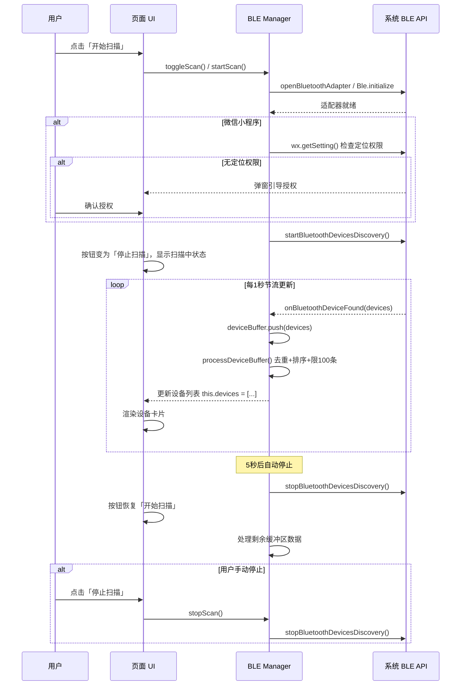
```mermaid
sequenceDiagram
    participant U as 用户
    participant UI as 页面 UI
    participant BM as BLE Manager
    participant OS as 系统 BLE API

    U->>UI: 点击「开始扫描」
    UI->>BM: toggleScan() / startScan()
    BM->>OS: openBluetoothAdapter / Ble.initialize
    OS-->>BM: 适配器就绪

    alt 微信小程序
        BM->>OS: wx.getSetting() 检查定位权限
        alt 无定位权限
            OS-->>UI: 弹窗引导授权
            U->>UI: 确认授权
        end
    end

    BM->>OS: startBluetoothDevicesDiscovery()
    UI->>UI: 按钮变为「停止扫描」，显示扫描中状态

    loop 每1秒节流更新
        OS-->>BM: onBluetoothDeviceFound(devices)
        BM->>BM: deviceBuffer.push(devices)
        BM->>BM: processDeviceBuffer() 去重+排序+限100条
        BM-->>UI: 更新设备列表 this.devices = [...]
        UI->>UI: 渲染设备卡片
    end

    Note over BM: 5秒后自动停止
    BM->>OS: stopBluetoothDevicesDiscovery()
    UI->>UI: 按钮恢复「开始扫描」
    BM->>BM: 处理剩余缓冲区数据

    alt 用户手动停止
        U->>UI: 点击「停止扫描」
        UI->>BM: stopScan()
        BM->>OS: stopBluetoothDevicesDiscovery()
    end
```

### 4.2 设备连接时序

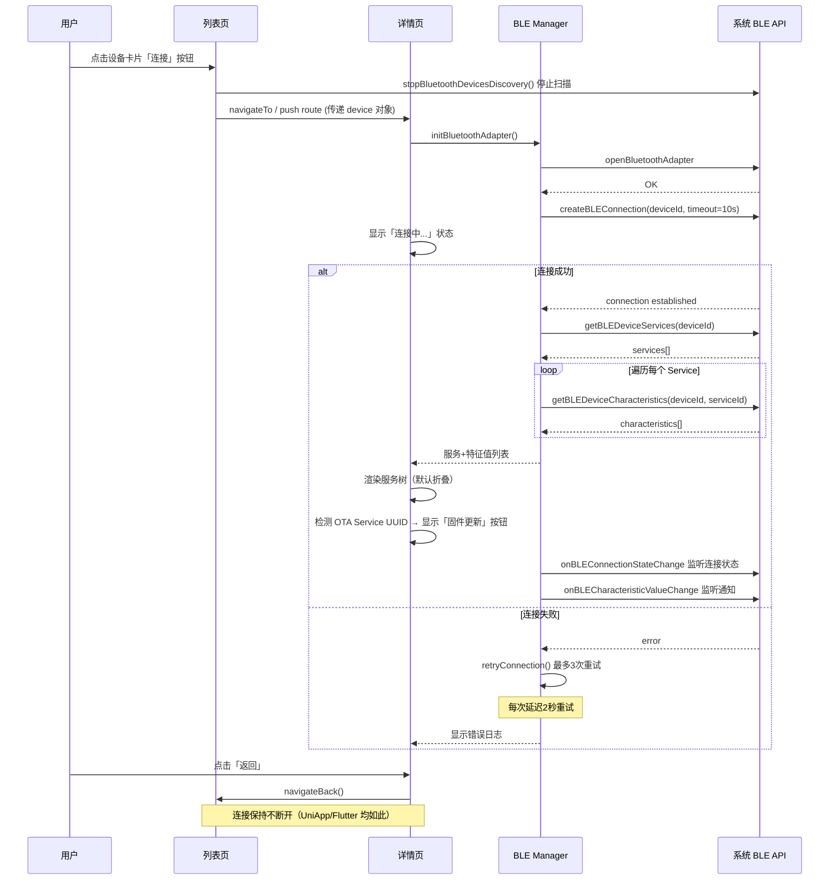
```mermaid
sequenceDiagram
    participant U as 用户
    participant LIST as 列表页
    participant DETAIL as 详情页
    participant BM as BLE Manager
    participant OS as 系统 BLE API

    U->>LIST: 点击设备卡片「连接」按钮
    LIST->>OS: stopBluetoothDevicesDiscovery() 停止扫描
    LIST->>DETAIL: navigateTo / push route (传递 device 对象)

    DETAIL->>BM: initBluetoothAdapter()
    BM->>OS: openBluetoothAdapter
    OS-->>BM: OK

    BM->>OS: createBLEConnection(deviceId, timeout=10s)
    DETAIL->>DETAIL: 显示「连接中...」状态

    alt 连接成功
        OS-->>BM: connection established
        BM->>OS: getBLEDeviceServices(deviceId)
        OS-->>BM: services[]

        loop 遍历每个 Service
            BM->>OS: getBLEDeviceCharacteristics(deviceId, serviceId)
            OS-->>BM: characteristics[]
        end

        BM-->>DETAIL: 服务+特征值列表
        DETAIL->>DETAIL: 渲染服务树（默认折叠）
        DETAIL->>DETAIL: 检测 OTA Service UUID → 显示「固件更新」按钮

        BM->>OS: onBLEConnectionStateChange 监听连接状态
        BM->>OS: onBLECharacteristicValueChange 监听通知
    else 连接失败
        OS-->>BM: error
        BM->>BM: retryConnection() 最多3次重试
        Note over BM: 每次延迟2秒重试
        BM-->>DETAIL: 显示错误日志
    end

    U->>DETAIL: 点击「返回」
    DETAIL->>LIST: navigateBack()
    Note over LIST,DETAIL: 连接保持不断开（UniApp/Flutter 均如此）
```

### 4.3 特征值读取时序

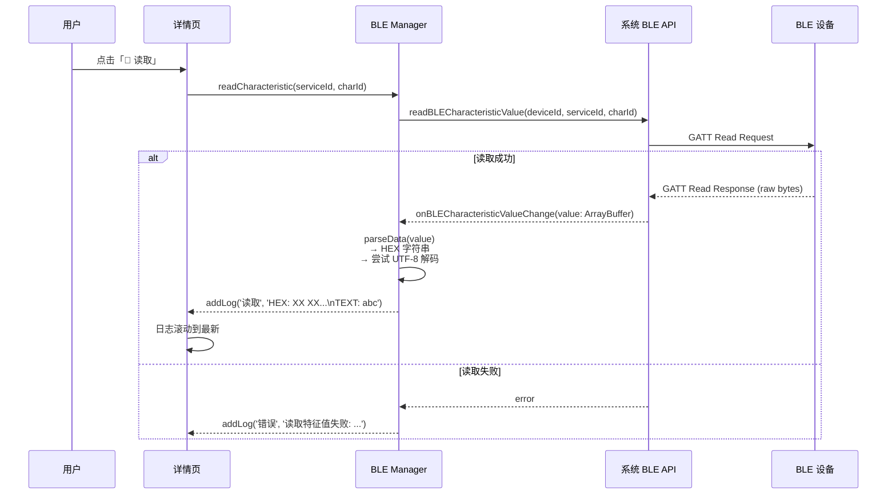
```mermaid
sequenceDiagram
    participant U as 用户
    participant UI as 详情页
    participant BM as BLE Manager
    participant OS as 系统 BLE API
    participant DEV as BLE 设备

    U->>UI: 点击「📖 读取」
    UI->>BM: readCharacteristic(serviceId, charId)
    BM->>OS: readBLECharacteristicValue(deviceId, serviceId, charId)
    OS->>DEV: GATT Read Request

    alt 读取成功
        DEV-->>OS: GATT Read Response (raw bytes)
        OS-->>BM: onBLECharacteristicValueChange(value: ArrayBuffer)
        BM->>BM: parseData(value)<br/>→ HEX 字符串<br/>→ 尝试 UTF-8 解码
        BM-->>UI: addLog('读取', 'HEX: XX XX...\nTEXT: abc')
        UI->>UI: 日志滚动到最新
    else 读取失败
        OS-->>BM: error
        BM-->>UI: addLog('错误', '读取特征值失败: ...')
    end
```

### 4.4 特征值写入时序

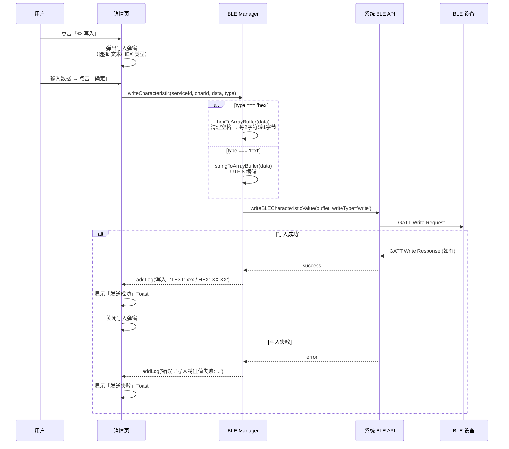
```mermaid
sequenceDiagram
    participant U as 用户
    participant UI as 详情页
    participant BM as BLE Manager
    participant OS as 系统 BLE API
    participant DEV as BLE 设备

    U->>UI: 点击「✏️ 写入」
    UI->>UI: 弹出写入弹窗<br/>（选择 文本/HEX 类型）

    U->>UI: 输入数据 → 点击「确定」

    UI->>BM: writeCharacteristic(serviceId, charId, data, type)

    alt type === 'hex'
        BM->>BM: hexToArrayBuffer(data)<br/>清理空格 → 每2字符转1字节
    else type === 'text'
        BM->>BM: stringToArrayBuffer(data)<br/>UTF-8 编码
    end

    BM->>OS: writeBLECharacteristicValue(buffer, writeType='write')
    OS->>DEV: GATT Write Request

    alt 写入成功
        DEV-->>OS: GATT Write Response (如有)
        OS-->>BM: success
        BM-->>UI: addLog('写入', 'TEXT: xxx / HEX: XX XX')
        UI->>UI: 显示「发送成功」Toast
        UI->>UI: 关闭写入弹窗
    else 写入失败
        OS-->>BM: error
        BM-->>UI: addLog('错误', '写入特征值失败: ...')
        UI->>UI: 显示「发送失败」Toast
    end
```

### 4.5 通知订阅/取消时序

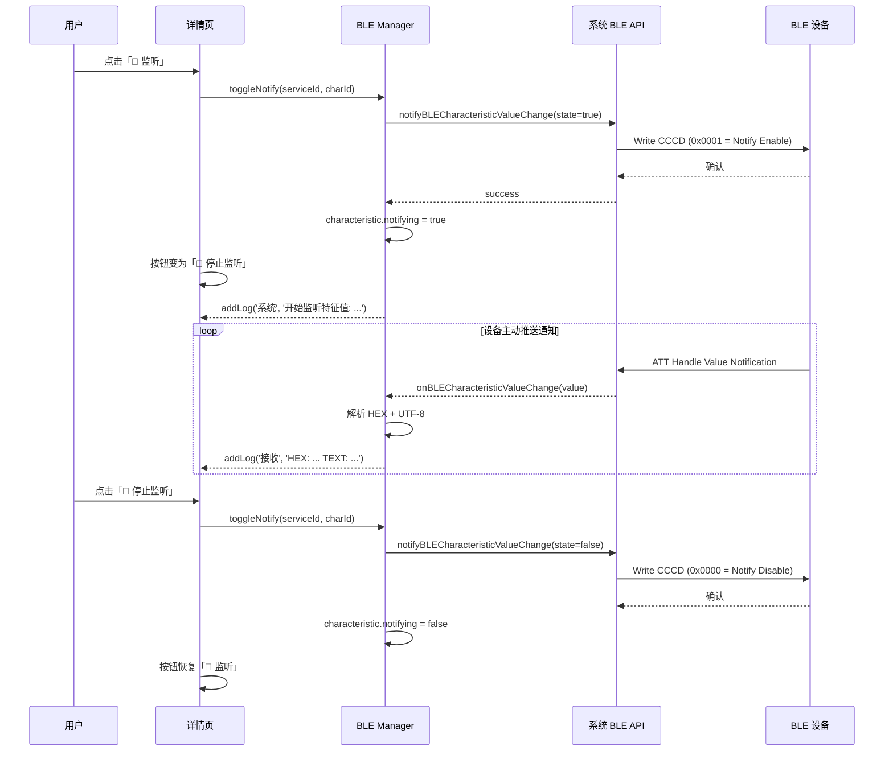
```mermaid
sequenceDiagram
    participant U as 用户
    participant UI as 详情页
    participant BM as BLE Manager
    participant OS as 系统 BLE API
    participant DEV as BLE 设备

    U->>UI: 点击「🔕 监听」
    UI->>BM: toggleNotify(serviceId, charId)
    BM->>OS: notifyBLECharacteristicValueChange(state=true)
    OS->>DEV: Write CCCD (0x0001 = Notify Enable)
    DEV-->>OS: 确认
    OS-->>BM: success
    BM->>BM: characteristic.notifying = true
    UI->>UI: 按钮变为「🔔 停止监听」
    BM-->>UI: addLog('系统', '开始监听特征值: ...')

    loop 设备主动推送通知
        DEV->>OS: ATT Handle Value Notification
        OS-->>BM: onBLECharacteristicValueChange(value)
        BM->>BM: 解析 HEX + UTF-8
        BM-->>UI: addLog('接收', 'HEX: ... TEXT: ...')
    end

    U->>UI: 点击「🔔 停止监听」
    UI->>BM: toggleNotify(serviceId, charId)
    BM->>OS: notifyBLECharacteristicValueChange(state=false)
    OS->>DEV: Write CCCD (0x0000 = Notify Disable)
    DEV-->>OS: 确认
    BM->>BM: characteristic.notifying = false
    UI->>UI: 按钮恢复「🔕 监听」
```

### 4.6 OTA 固件升级时序

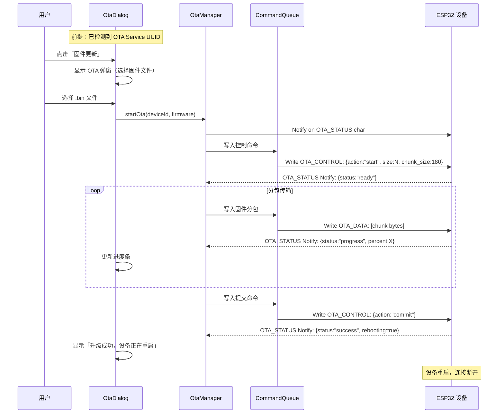
```mermaid
sequenceDiagram
    participant U as 用户
    participant UI as OtaDialog
    participant OM as OtaManager
    participant CQ as CommandQueue
    participant DEV as ESP32 设备

    Note over UI: 前提：已检测到 OTA Service UUID
    U->>UI: 点击「固件更新」
    UI->>UI: 显示 OTA 弹窗（选择固件文件）
    U->>UI: 选择 .bin 文件
    UI->>OM: startOta(deviceId, firmware)

    OM->>DEV: Notify on OTA_STATUS char
    OM->>CQ: 写入控制命令
    CQ->>DEV: Write OTA_CONTROL: {action:"start", size:N, chunk_size:180}
    DEV-->>OM: OTA_STATUS Notify: {status:"ready"}

    loop 分包传输
        OM->>CQ: 写入固件分包
        CQ->>DEV: Write OTA_DATA: [chunk bytes]
        DEV-->>OM: OTA_STATUS Notify: {status:"progress", percent:X}
        UI->>UI: 更新进度条
    end

    OM->>CQ: 写入提交命令
    CQ->>DEV: Write OTA_CONTROL: {action:"commit"}
    DEV-->>OM: OTA_STATUS Notify: {status:"success", rebooting:true}
    UI->>UI: 显示「升级成功，设备正在重启」
    Note over DEV: 设备重启，连接断开
```

### 4.7 BLE 广播时序

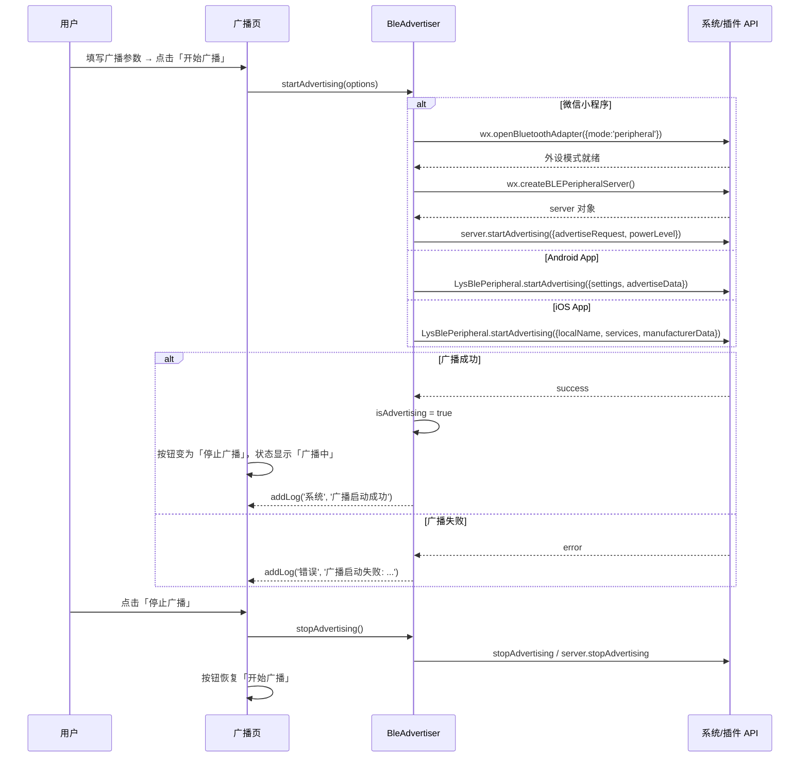
```mermaid
sequenceDiagram
    participant U as 用户
    participant UI as 广播页
    participant BA as BleAdvertiser
    participant OS as 系统/插件 API

    U->>UI: 填写广播参数 → 点击「开始广播」
    UI->>BA: startAdvertising(options)

    alt 微信小程序
        BA->>OS: wx.openBluetoothAdapter({mode:'peripheral'})
        OS-->>BA: 外设模式就绪
        BA->>OS: wx.createBLEPeripheralServer()
        OS-->>BA: server 对象
        BA->>OS: server.startAdvertising({advertiseRequest, powerLevel})
    else Android App
        BA->>OS: LysBlePeripheral.startAdvertising({settings, advertiseData})
    else iOS App
        BA->>OS: LysBlePeripheral.startAdvertising({localName, services, manufacturerData})
    end

    alt 广播成功
        OS-->>BA: success
        BA->>BA: isAdvertising = true
        UI->>UI: 按钮变为「停止广播」，状态显示「广播中」
        BA-->>UI: addLog('系统', '广播启动成功')
    else 广播失败
        OS-->>BA: error
        BA-->>UI: addLog('错误', '广播启动失败: ...')
    end

    U->>UI: 点击「停止广播」
    UI->>BA: stopAdvertising()
    BA->>OS: stopAdvertising / server.stopAdvertising
    UI->>UI: 按钮恢复「开始广播」
```

---

## 5. 完整业务流程图

### 5.1 用户主流程（HAPPY PATH）

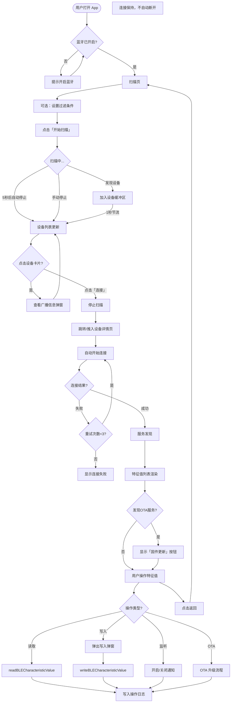
```mermaid
flowchart TD
    START([用户打开 App]) --> CHECK_BT{蓝牙已开启?}
    CHECK_BT -->|否| PROMPT_BT[提示开启蓝牙]
    PROMPT_BT --> CHECK_BT
    CHECK_BT -->|是| SCAN_PAGE[扫描页]

    SCAN_PAGE --> SET_FILTER[可选：设置过滤条件]
    SET_FILTER --> SCAN_BTN[点击「开始扫描」]
    SCAN_BTN --> SCANNING{扫描中...}

    SCANNING -->|5秒后自动停止| DEVICE_LIST[设备列表更新]
    SCANNING -->|手动停止| DEVICE_LIST
    SCANNING -->|发现设备| BUFFER[加入设备缓冲区]
    BUFFER -->|1秒节流| DEVICE_LIST

    DEVICE_LIST --> VIEW_ADVERT{点击设备卡片?}
    VIEW_ADVERT -->|是| ADV_MODAL[查看广播信息弹窗]
    ADV_MODAL --> DEVICE_LIST

    VIEW_ADVERT -->|点击「连接」| STOP_SCAN[停止扫描]
    STOP_SCAN --> NAV_DETAIL[跳转/推入设备详情页]

    NAV_DETAIL --> CONNECTING[自动开始连接]
    CONNECTING --> CONN_RESULT{连接结果?}
    CONN_RESULT -->|失败| RETRY{重试次数<3?}
    RETRY -->|是| CONNECTING
    RETRY -->|否| CONN_FAIL[显示连接失败]

    CONN_RESULT -->|成功| DISCOVER[服务发现]
    DISCOVER --> CHAR_LIST[特征值列表渲染]
    CHAR_LIST --> DETECT_OTA{发现OTA服务?}
    DETECT_OTA -->|是| SHOW_OTA[显示「固件更新」按钮]
    DETECT_OTA -->|否| OPS

    SHOW_OTA --> OPS[用户操作特征值]

    OPS --> OP_TYPE{操作类型?}
    OP_TYPE -->|读取| READ_OP[readBLECharacteristicValue]
    OP_TYPE -->|写入| WRITE_MODAL[弹出写入弹窗]
    OP_TYPE -->|监听| NOTIFY_OP[开启/关闭通知]
    OP_TYPE -->|OTA| OTA_FLOW[OTA 升级流程]

    READ_OP --> LOG[写入操作日志]
    WRITE_MODAL --> WRITE_OP[writeBLECharacteristicValue]
    WRITE_OP --> LOG
    NOTIFY_OP --> LOG
    OTA_FLOW --> LOG

    OPS --> BACK_BTN[点击返回]
    BACK_BTN --> SCAN_PAGE
    Note1[连接保持，不自动断开]
```

### 5.2 权限检查流程

```mermaid
flowchart TD
    TRIGGER[触发扫描/广播] --> CHK_BT[检查蓝牙适配器状态]
    CHK_BT --> BT_OK{适配器可用?}

    BT_OK -->|否，errCode=10001| SHOW_BT_MODAL[提示「请开启系统蓝牙」]
    SHOW_BT_MODAL --> END_FAIL([操作终止])

    BT_OK -->|是| PLATFORM{当前平台?}

    PLATFORM -->|微信小程序| CHK_LOCATION[检查定位权限]
    CHK_LOCATION --> LOC_OK{已授权?}
    LOC_OK -->|否| REQ_LOCATION[wx.authorize scope.userLocation]
    REQ_LOCATION --> LOC_RESULT{用户选择?}
    LOC_RESULT -->|拒绝| GUIDE_SETTING[引导去设置页]
    GUIDE_SETTING --> END_FAIL
    LOC_RESULT -->|允许| PROCEED[继续操作]
    LOC_OK -->|是| PROCEED

    PLATFORM -->|Android (APP-PLUS)| CHK_ANDROID[检查运行时权限]
    CHK_ANDROID -->|Android 12+| NEED_NEW[BLUETOOTH_SCAN, BLUETOOTH_CONNECT,<br/>BLUETOOTH_ADVERTISE, ACCESS_FINE_LOCATION]
    CHK_ANDROID -->|Android 11及以下| NEED_OLD[BLUETOOTH, BLUETOOTH_ADMIN,<br/>ACCESS_FINE_LOCATION]
    NEED_NEW --> REQ_PERM[plus.android.requestPermissions]
    NEED_OLD --> REQ_PERM
    REQ_PERM --> PERM_RESULT{用户选择?}
    PERM_RESULT -->|拒绝| END_FAIL
    PERM_RESULT -->|允许| PROCEED

    PLATFORM -->|iOS| CHK_IOS[系统自动弹出蓝牙权限对话框]
    CHK_IOS --> IOS_RESULT{用户选择?}
    IOS_RESULT -->|拒绝| GUIDE_SETTING
    IOS_RESULT -->|允许| PROCEED

    PLATFORM -->|Flutter/Tauri/桌面| DIRECT[直接调用 API, 系统处理权限]
    DIRECT --> PROCEED

    PROCEED --> DO_OP([执行 BLE 操作])
```

### 5.3 日志系统流程

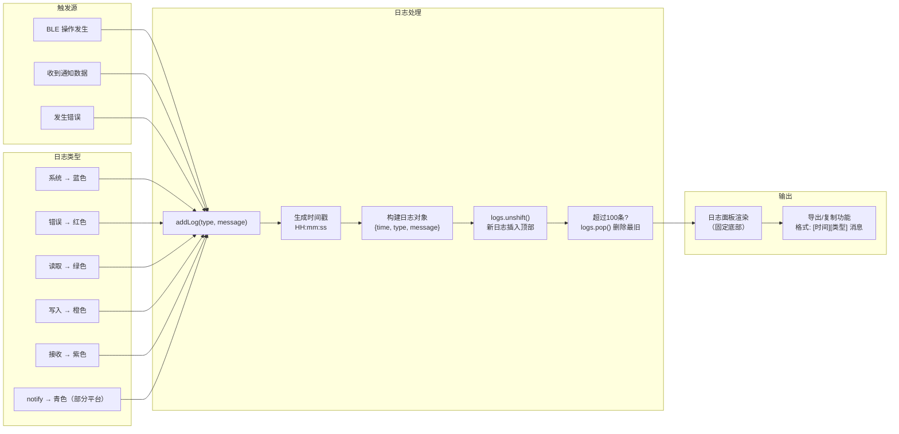
```mermaid
flowchart LR
    subgraph "触发源"
        BLE_OP[BLE 操作发生]
        DATA_RCV[收到通知数据]
        ERR[发生错误]
    end

    subgraph "日志处理"
        ADD_LOG["addLog(type, message)"]
        GEN_TIME["生成时间戳<br/>HH:mm:ss"]
        BUILD_OBJ["构建日志对象<br/>{time, type, message}"]
        PREPEND["logs.unshift()<br/>新日志插入顶部"]
        TRIM["超过100条?<br/>logs.pop() 删除最旧"]
    end

    subgraph "日志类型"
        SYS["系统 → 蓝色"]
        ERR_LOG["错误 → 红色"]
        READ_LOG["读取 → 绿色"]
        WRITE_LOG["写入 → 橙色"]
        RCV_LOG["接收 → 紫色"]
        NOTIFY_LOG["notify → 青色（部分平台）"]
    end

    subgraph "输出"
        UI_LOG["日志面板渲染<br/>（固定底部）"]
        EXPORT["导出/复制功能<br/>格式: [时间][类型] 消息"]
    end

    BLE_OP --> ADD_LOG
    DATA_RCV --> ADD_LOG
    ERR --> ADD_LOG
    ADD_LOG --> GEN_TIME --> BUILD_OBJ --> PREPEND --> TRIM --> UI_LOG
    UI_LOG --> EXPORT
    SYS & ERR_LOG & READ_LOG & WRITE_LOG & RCV_LOG & NOTIFY_LOG --> ADD_LOG
```

---

## 6. 状态机图

### 6.1 BLE 连接状态机

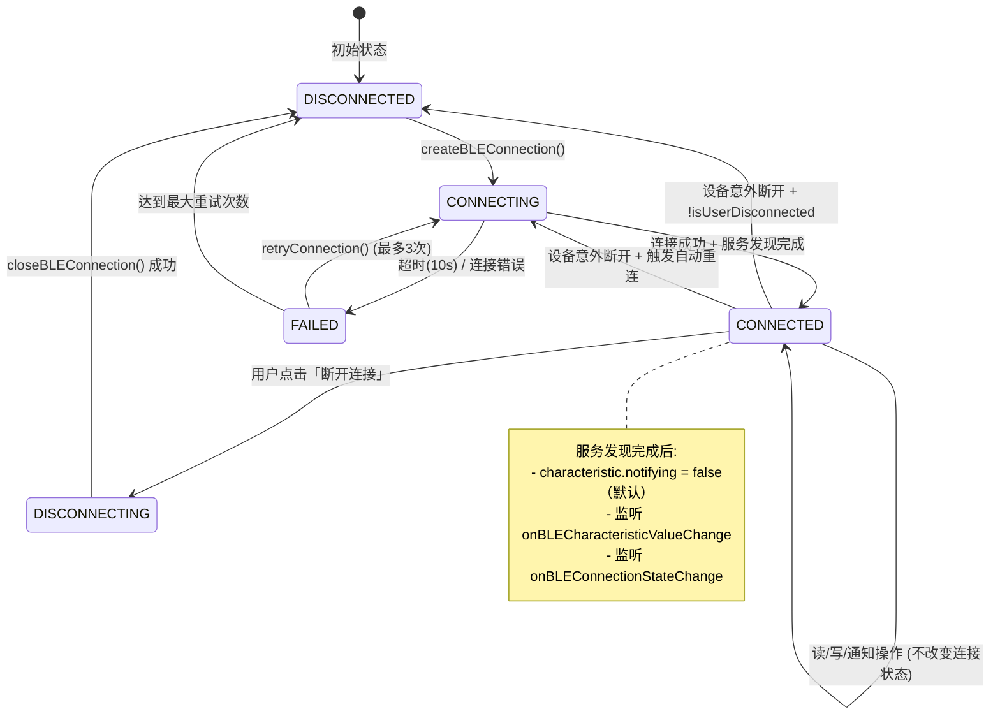
```mermaid
stateDiagram-v2
    [*] --> DISCONNECTED : 初始状态

    DISCONNECTED --> CONNECTING : createBLEConnection()
    CONNECTING --> CONNECTED : 连接成功 + 服务发现完成
    CONNECTING --> FAILED : 超时(10s) / 连接错误
    FAILED --> CONNECTING : retryConnection() (最多3次)
    FAILED --> DISCONNECTED : 达到最大重试次数

    CONNECTED --> DISCONNECTING : 用户点击「断开连接」
    CONNECTED --> DISCONNECTED : 设备意外断开 + !isUserDisconnected
    CONNECTED --> CONNECTING : 设备意外断开 + 触发自动重连

    DISCONNECTING --> DISCONNECTED : closeBLEConnection() 成功

    CONNECTED --> CONNECTED : 读/写/通知操作 (不改变连接状态)

    note right of CONNECTED
        服务发现完成后:
        - characteristic.notifying = false（默认）
        - 监听 onBLECharacteristicValueChange
        - 监听 onBLEConnectionStateChange
    end note
```

### 6.2 扫描状态机

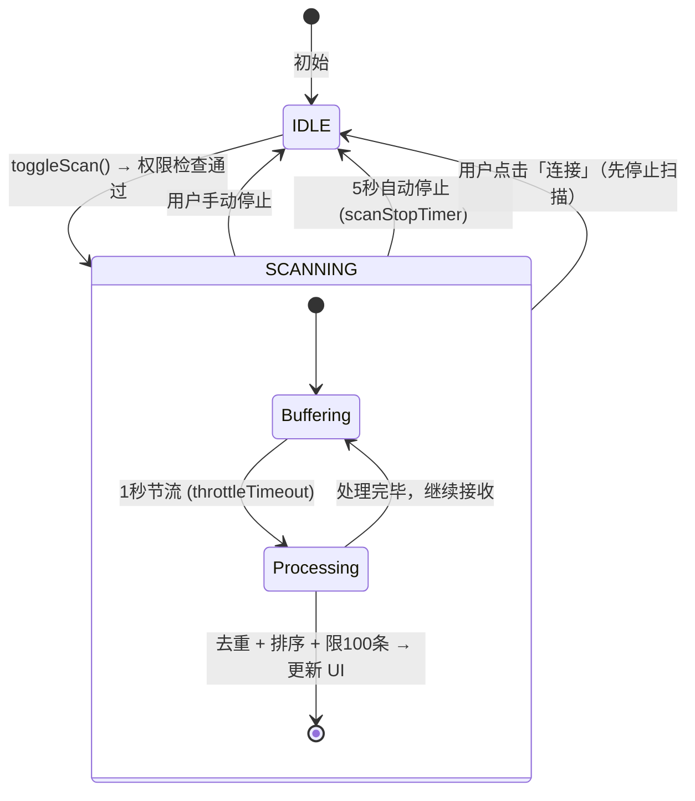
```mermaid
stateDiagram-v2
    [*] --> IDLE : 初始
    IDLE --> SCANNING : toggleScan() → 权限检查通过
    SCANNING --> IDLE : 用户手动停止
    SCANNING --> IDLE : 5秒自动停止 (scanStopTimer)
    SCANNING --> IDLE : 用户点击「连接」（先停止扫描）

    state SCANNING {
        [*] --> Buffering
        Buffering --> Processing : 1秒节流 (throttleTimeout)
        Processing --> Buffering : 处理完毕，继续接收
        Processing --> [*] : 去重 + 排序 + 限100条 → 更新 UI
    }
```

### 6.3 通知（Notify）状态机

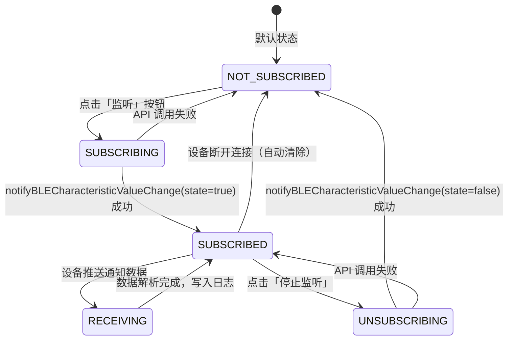
```mermaid
stateDiagram-v2
    [*] --> NOT_SUBSCRIBED : 默认状态

    NOT_SUBSCRIBED --> SUBSCRIBING : 点击「监听」按钮
    SUBSCRIBING --> SUBSCRIBED : notifyBLECharacteristicValueChange(state=true) 成功
    SUBSCRIBING --> NOT_SUBSCRIBED : API 调用失败

    SUBSCRIBED --> RECEIVING : 设备推送通知数据
    RECEIVING --> SUBSCRIBED : 数据解析完成，写入日志

    SUBSCRIBED --> UNSUBSCRIBING : 点击「停止监听」
    UNSUBSCRIBING --> NOT_SUBSCRIBED : notifyBLECharacteristicValueChange(state=false) 成功
    UNSUBSCRIBING --> SUBSCRIBED : API 调用失败

    SUBSCRIBED --> NOT_SUBSCRIBED : 设备断开连接（自动清除）
```

---

## 7. 平台差异对照矩阵

### 7.1 核心功能支持

| 功能 | UniApp 小程序 | UniApp App | Flutter | Android Native | iOS Native | Tauri | Electron |
|------|:---:|:---:|:---:|:---:|:---:|:---:|:---:|
| BLE 扫描 | ✅ | ✅ | ✅ | ✅ | ✅ | ✅ | ✅ |
| RSSI 过滤 | ✅ | ✅ | ✅ | ✅ | ✅ | ✅ | ✅ |
| 名称前缀过滤 | ✅ | ✅ | ✅ | ✅ | ✅ | ✅ | ✅ |
| 5秒自动停止 | ✅ | ✅ | ✅ | ✅ | ✅ | ✅ | ✅ |
| 设备连接 | ✅ | ✅ | ✅ | ✅ | ✅ | ✅ | ✅ |
| 自动重连（3次）| ❌ | ✅ | ❌ | ✅ | ❌ | ❌ | ❌ |
| 服务/特征值发现 | ✅ | ✅ | ✅ | ✅ | ✅ | ✅ | ✅ |
| 特征值读取 | ✅ | ✅ | ✅ | ✅ | ✅ | ✅ | ✅ |
| 特征值写入（文本）| ✅ | ✅ | ✅ | ✅ | ✅ | ✅ | ✅ |
| 特征值写入（HEX）| ✅ | ✅ | ✅ | ✅ | ✅ | ✅ | ✅ |
| 通知订阅 | ✅ | ✅ | ✅ | ✅ | ✅ | ✅ | ✅ |
| BLE 广播（外设模式）| ✅ wx API | ✅ 插件 | ✅ | ✅ | ⚠️ 有限 | ⚠️ 平台依赖 | ❌ |
| 广播高级配置 | ⚠️ 有限 | ✅ | ✅ | ✅ | ⚠️ iOS 限制 | ❌ | N/A |
| 操作日志 | ✅ | ✅ | ✅ | ✅ | ✅ | ✅ | ✅ |
| 日志导出 | ✅ 复制 | ✅ 文件 | ⚠️ | ✅ 文件 | ✅ | ✅ | ✅ |
| OTA 固件升级 | ✅ | ✅ | ✅ | ❌ | ❌ | ❌ | ❌ |
| 多设备管理 | ❌ | ❌ | ✅ 独立Tab | ✅ | ❌ | ❌ | ❌ |
| 后台 BLE | ❌ | ✅ 前台服务 | ⚠️ | ✅ | ⚠️ | N/A | N/A |

### 7.2 UI/UX 一致性

| UI 元素 | UniApp | Flutter | Android | iOS | Tauri | Electron |
|---------|:---:|:---:|:---:|:---:|:---:|:---:|
| 过滤面板 RSSI 预设按钮 | ❌ | ✅ | ✅ | ✅ | ✅ | ✅ |
| 过滤面板重置按钮 | ❌ | ✅ | ✅ | ✅ | ✅ | ✅ |
| 日志面板（详情页底部固定）| ✅ | ✅ | ✅ | ❌ 独立页 | ✅ | ✅ |
| OTA 升级入口 | ✅ | ✅ | ❌ | ❌ | ❌ | ❌ |
| 关于页二维码 | ✅ | ✅ | ❌ | ❌ | ❌ | ❌ |
| 版本记录子页 | ✅ | ❌ | ❌ | ❌ | ❌ | ❌ |
| 返回时保持连接 | ✅ | ✅ | ✅ | ✅ | ✅ | ✅ |
| 广播信息弹窗（复制）| ✅ | ✅ | ✅ | ✅ | ✅ | ✅ |

### 7.3 页面导航模式

| 平台 | 主导航 | 详情进入方式 | 返回方式 |
|------|--------|------------|---------|
| UniApp | 自定义 TabBar（首页）+ navigateTo | uni.navigateTo → detail | uni.navigateBack |
| Flutter | BottomNavigationBar (4 Tab) | Navigator.push | Navigator.pop |
| Android | NavController | navigate() | popBackStack() |
| iOS | NavigationStack | NavigationLink / push | Back button |
| Tauri | 自定义 Tab 切换 SPA | showDetailView(device) | goBack() |
| Electron | 自定义视图切换 SPA | showDeviceDetail(device) | showDeviceList() |
| macOS Native | Split View | 选择设备 → 右侧内容区更新 | N/A |

---

## 8. 当前不一致问题清单

### P0 - 影响核心体验

| 问题 | 影响平台 | 说明 |
|------|---------|------|
| UniApp 扫描页缺少 RSSI 预设按钮 | UniApp | Flutter/Android/iOS/Tauri 均有，UniApp 只有滑块 |
| UniApp 扫描页缺少「重置过滤」按钮 | UniApp | 用户无法一键重置过滤条件 |
| iOS 日志位置不一致 | iOS Native | 单独 LogView 页面，其他平台均在详情页内联 |
| OTA 升级仅 UniApp/Flutter 支持 | Android、iOS、Tauri、Electron | 功能不一致，调试能力差异大 |

### P1 - 影响功能完整性

| 问题 | 影响平台 | 说明 |
|------|---------|------|
| Tauri 广播页配置缺失 | Tauri | 无厂商ID/厂商数据/广播模式/功率等配置 |
| Android/iOS/Tauri 无版本记录页 | 非 UniApp 平台 | 仅 UniApp 有版本记录子页 |
| 多设备管理仅 Flutter 支持 | 其他平台 | Flutter 有专门 ConnectedDevicesPage |
| 自动重连逻辑不一致 | 大部分平台 | UniApp App/Android 有3次重试，Flutter/iOS/Tauri 无 |
| 广播页日志有无不统一 | Tauri/Electron | 部分平台缺少广播操作日志 |

### P2 - 体验优化

| 问题 | 影响平台 | 说明 |
|------|---------|------|
| 关于页二维码 | Android/iOS/Tauri/Electron | 仅 UniApp/Flutter 显示二维码 |
| 特征值名称识别 | 各平台不一致 | 是否显示标准 UUID 对应的友好名称 |
| 日志格式不完全统一 | 各平台 | HEX/TEXT 双格式显示在各平台实现不同 |
| 广播参数验证反馈 | 各平台 | 数据长度超限时的提示方式不统一 |

---

## 9. 统一建议

### 9.1 立即可做（不需要大改动）

1. **UniApp 补充 RSSI 预设按钮**：在滑块下方添加 `-100 / -80 / -60 / -40` 预设按钮，参考 Flutter FilterPanel
2. **UniApp 补充「重置过滤」按钮**：重置为默认值（RSSI=-100, 前缀='', hideNoName=false）
3. **日志格式统一**：统一格式 `HEX: XX XX XX\nTEXT: abc`，各平台都应同时展示

### 9.2 中期规划（需要一定开发工作量）

1. **OTA 功能扩展**：将 OTA 升级扩展到 Android Native 和 Tauri（参考 Flutter 的 OtaManager 实现）
2. **Tauri 广播页完善**：补充厂商 ID、厂商数据、广播模式、功率配置
3. **iOS 日志位置调整**：将 LogView 改为详情页内联，与其他平台保持一致
4. **统一自动重连策略**：建议所有平台实现最多3次重试，间隔2秒

### 9.3 长期统一方向

1. **定义「黄金标准页面规范」**：以本文档 §3 的交互草稿为准，作为所有平台实现的标准
2. **建立跨平台功能矩阵表**：在项目主 README 中维护一个实时更新的功能矩阵
3. **引入 E2E 测试基准**：基于 `docs/test-checklist.md` 建立自动化验证
4. **版本号统一管理**：各平台版本号建议统一跟进，避免版本分叉

---

## 10. 跨平台 UI 组件化架构标准

为根治各平台日益臃肿的堆叠式代码（Spaghetti Code），确立以下 5 大核心 UI 原子组件。**所有平台（UniApp、Flutter、Android、iOS 等）此后不论使用何种框架开发，均必须遵循此粒度进行强抽象封装。**

### 10.1 `FilterPanel` (条件过滤面板)
- **职责**：维护 RSSI 阈值计算、前缀字符过滤、隐藏无名设备的开关操作。
- **产出规则**：由外部传入预设值并监听 onChange，返回确切的过滤数据字典 `filterSettings`，并在此内部处理重置逻辑。
- **跨端形态**：
  - **Vue/UniApp**: `<filter-panel v-model="settings" />`
  - **Flutter**: `FilterPanelWidget(onFilterChanged)`
  - **Android/Compose**: `@Composable FilterPanel(settings, onSettingsChange)`

### 10.2 `DeviceCard` (设备信息卡片)
- **职责**：抽象单体设备的呈现。必须内部包含自适应的信号强度彩条绘画（自动将 RSSI 转为可视格数）。必须内部区分“发现设备”和“已连接”状态（用以禁止/启用特定的点击事件）。
- **跨端形态**：
  - **Vue/UniApp**: `<device-card :device="d" @action="connect" />`
  - **Flutter**: `DeviceCardWidget(device, onConnect, onDisconnect)`
  - **Android/Compose**: `@Composable DeviceCard(device, onAction)`

### 10.3 `ServicePanel` / `ServiceList` (服务特征展示板)
- **职责**：解析底层获取到的 Service Array 嵌套字典。实现多层级（Service -> Characteristic -> Descriptors）的折叠渲染展示，彻底将 Read / Write / Notify 三大按钮的行为动作提取为仅带 `serviceId` 和 `charId` 的回调。
- **跨端形态**：
  - **Vue/UniApp**: `<service-panel @read="r" @write="w" @notifyToggle="t" />`
  - **Flutter**: `ServiceListWidget(services)` / `CharacteristicTile`
  - **Android/Compose**: `@Composable ServiceList(services, actions)`

### 10.4 `LogPanel` (底部通信台)
- **职责**：将冗复的通信日志打印提取。根据日志分类（系统、接收、写入、错误）自行实现富文本渲染与十六进制着色，且内部必须解决无限加长时的“自动滚动至最底”逻辑。
- **跨端形态**：
  - **Vue/UniApp**: `<log-panel :logs="messages" />`
  - **Flutter**: `LogPanelWidget(logs)`
  - **Android/Compose**: `@Composable LogPanel(logs)`

### 10.5 `WriteDialog` (指令投递弹框)
- **职责**：以纯数据组件的形式脱离页面主体。用户输入 HEX 或者 TEXT，内层自带正则校验器（判断 HEX 是否合法偶数位），校验通过后仅发还 ByteBuffer 给上层业务页面进行传输。
- **跨端形态**：
  - **Vue/UniApp**: `<write-dialog v-model:visible="v" @confirm="c" />`
  - **Flutter**: `WriteDataDialog(onConfirm)`
  - **Android/Compose**: `@Composable WriteDialog(onDismiss, onSend)`

---

## 附录 A：数据模型对照

### A.1 设备数据结构

```typescript
// 目标统一数据结构（伪类型）
interface BleDevice {
  deviceId: string;          // MAC 地址 / UUID（iOS）
  name: string;              // 设备名（可能为空）
  localName?: string;        // 本地名称（UniApp）
  rssi: number;              // 信号强度 dBm
  advertisDataHex: string;   // 广播数据 Hex
  advertisServiceUUIDs: string[]; // 广播服务 UUID 列表
  connected: boolean;        // 连接状态
}
```

### A.2 日志数据结构

```typescript
interface LogEntry {
  time: string;    // "HH:mm:ss"
  type: LogType;   // '系统' | '错误' | '读取' | '写入' | '接收' | 'notify'
  message: string; // 日志内容
}

// 颜色映射（CSS 变量）
const LOG_COLORS = {
  '系统':  '#007AFF', // 蓝色
  '错误':  '#FF3B30', // 红色
  '读取':  '#34C759', // 绿色
  '写入':  '#FF9500', // 橙色
  '接收':  '#5856D6', // 紫色
  'notify':'#30B0C7', // 青色（建议统一）
}
```

### A.3 特征值数据结构

```typescript
interface BleCharacteristic {
  uuid: string;
  name?: string;    // 标准 UUID 的友好名称
  properties: {
    read: boolean;
    write: boolean;
    notify: boolean;
    indicate?: boolean;
    writeNoResponse?: boolean;
  };
  notifying: boolean; // 当前是否正在监听
  value?: string;     // 最后读取的值
}
```

---

## 附录 B：关键 UUID 速查

| UUID | 类型 | 名称 | 平台 |
|------|------|------|------|
| `4fafc201-1fb5-459e-8fcc-c5c9c331914b` | Service | ESP32 智能蓝牙主服务 | ESP32 |
| `4fafc201-1fb5-459e-8fcc-c5c9c331914c` | Service | 权限演示服务 | ESP32 |
| `4fafc201-1fb5-459e-8fcc-c5c9c331914d` | Service | OTA 服务 | ESP32 |
| `beb5483e-36e1-4688-b7f5-ea07361b26a8` | Char | LED 控制/响应 | ESP32 |
| `beb5483e-36e1-4688-b7f5-ea07361b26c0` | Char | OTA Control | ESP32 |
| `beb5483e-36e1-4688-b7f5-ea07361b26c1` | Char | OTA Data | ESP32 |
| `beb5483e-36e1-4688-b7f5-ea07361b26c2` | Char | OTA Status | ESP32 |
| `180A` | Service | Device Information | 标准 BLE |
| `180F` | Service | Battery Service | 标准 BLE |
| `FFE0` | Service | 自定义（广播演示）| 惯例 |
