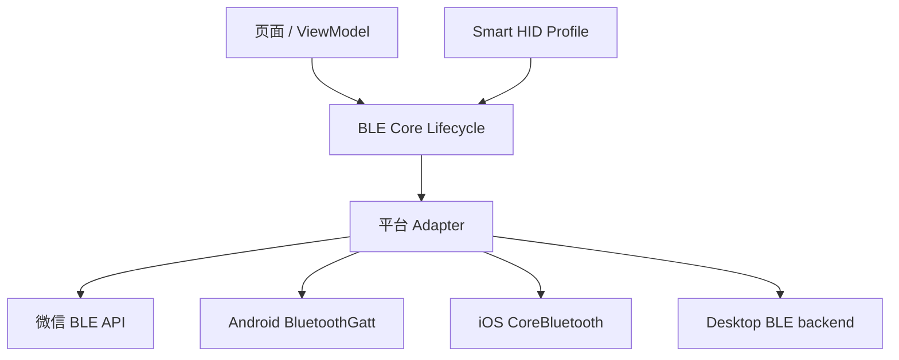
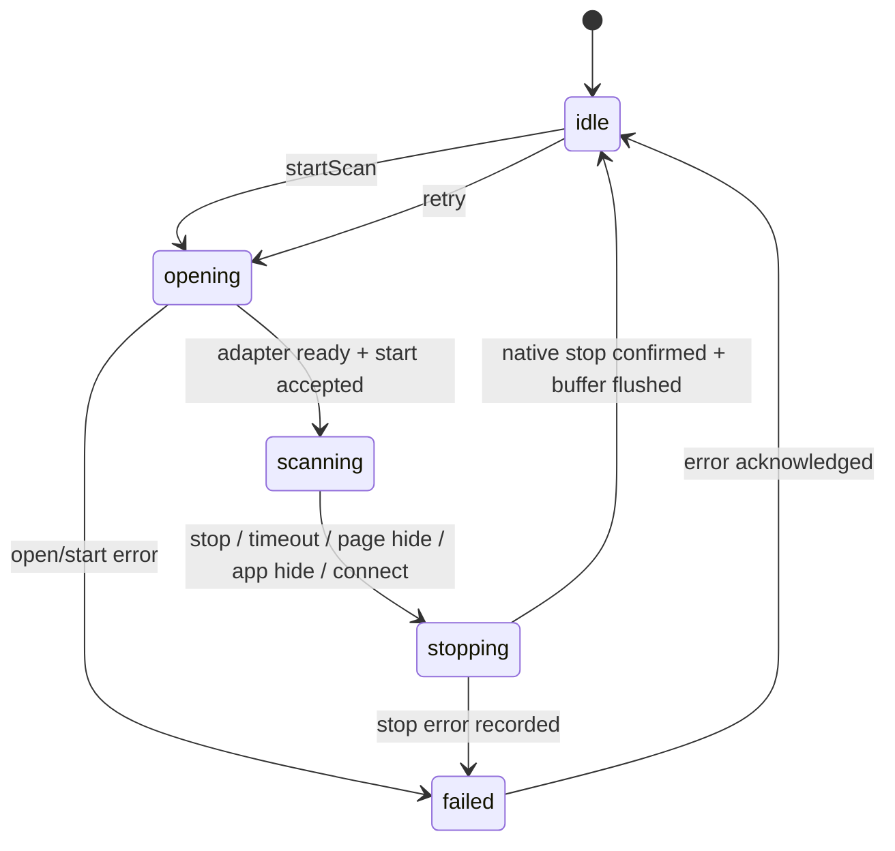
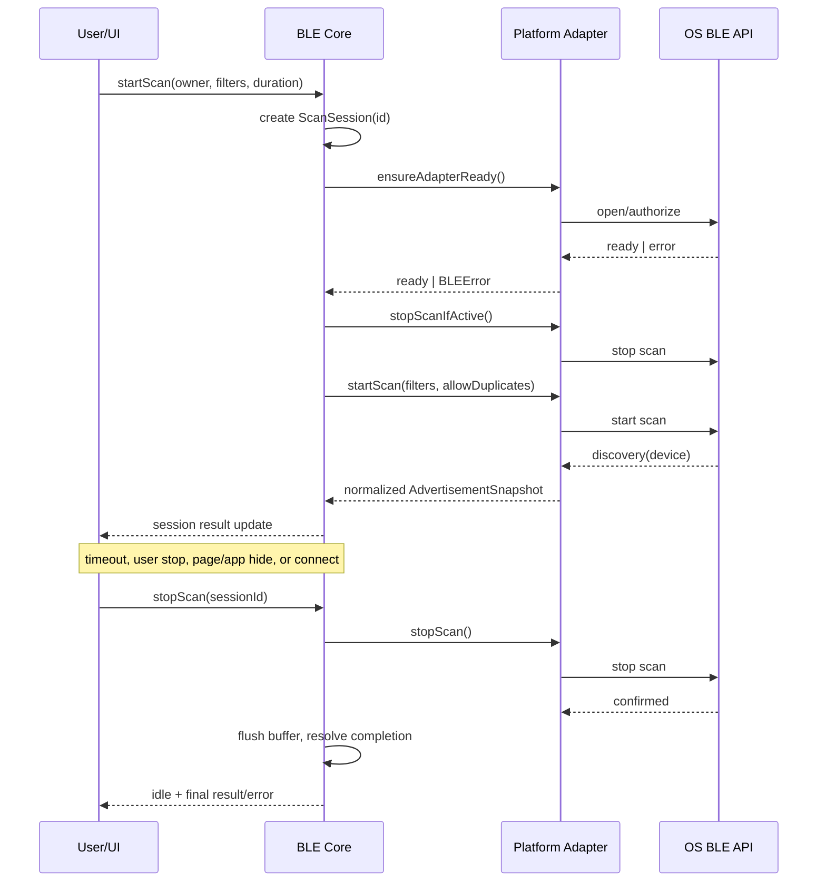
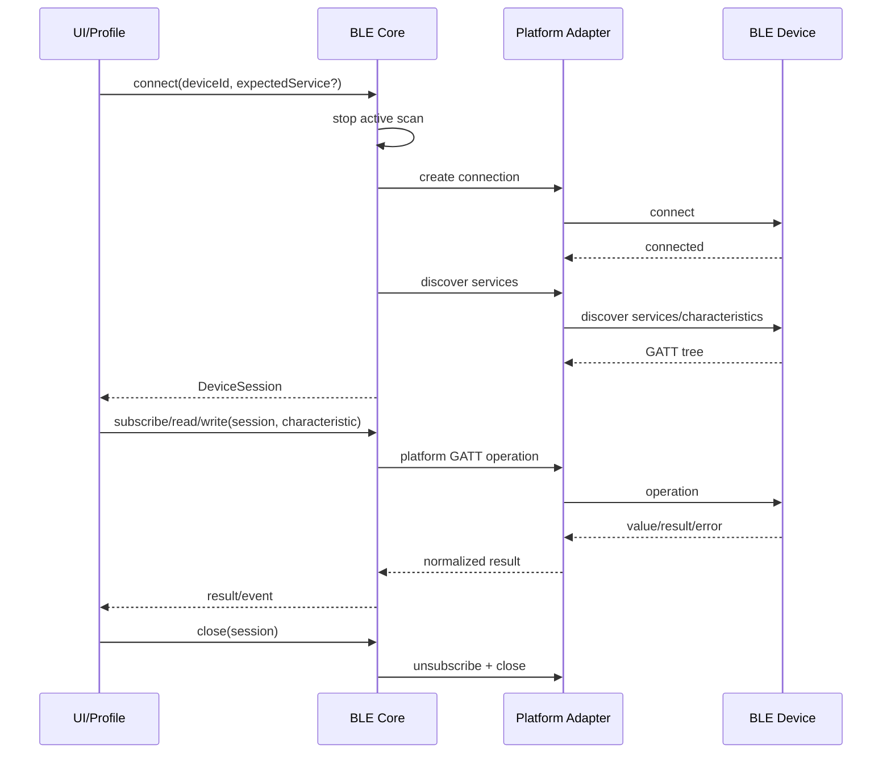

# BLE Core Lifecycle

> 状态：`DRAFT / canonical target`。本文件定义 Smart BLE 各客户端共有的目标行为，不代表所有平台现已符合。Smart HID 在此之上作为 Profile，不改变此生命周期；当前符合度见 `../../audit/14_PAGE_FUNCTION_REVIEW.md`。

## 1. 分层与不变量



不变量：

1. 每个 adapter 在任意时刻最多一个全局扫描 session。
2. `start` 在上一 session 的 `stop` 完成前不得开始；并发调用返回同一 session completion 或显式 `in_progress`。
3. 所有 discovery、connection、notify、adapter-state 原生回调只有 Adapter/Runtime 注册；UI 不直接持有全局回调。
4. 每个设备连接独立；设备 A 的断开、通知和 cleanup 不影响设备 B。
5. 每次 API 失败产生结构化错误：`operation / platformCode / message / sessionId / retryable`，不得转化为“空列表”。
6. 广播结果保留原始字段的存在性；`not_provided`、`empty`、`bytes` 是三个不同状态。

## 2. 扫描状态机



`ScanSession` 最小字段：`id`、`owner`（通用扫描/Smart HID）、`startedAt`、`deadline`、`state`、`error`、`resultCount`、`completion`。UI 显示本轮，而不是把旧结果或失败伪装成结果。

## 3. 通用扫描时序



## 4. 连接、发现与 GATT 时序



## 5. 广播 Snapshot 正典

```ts
type ByteField =
  | { state: 'not_provided' }
  | { state: 'empty'; byteLength: 0 }
  | { state: 'bytes'; byteLength: number; hex: string }

type AdvertisementSnapshot = {
  deviceId: string
  localName: string | null
  rssi: number | null
  serviceUuids: string[]
  advertisData: ByteField
  manufacturerData: Array<{ companyId: number | null; value: ByteField }>
  serviceData: Array<{ serviceUuid: string | null; value: ByteField }>
  observedAt: number
}
```

平台没有给出某字段是正常情况；Core 必须如实保留，UI 必须如实显示，不能生成或猜测 payload。

## 6. 平台映射

| 生命周期操作 | 微信小程序 | Android | iOS/macOS | Electron/Tauri |
|---|---|---|---|---|
| adapter ready | `openBluetoothAdapter` | `BluetoothAdapter` + runtime permission | `CBCentralManager.state` | backend initialization |
| start scan | `startBluetoothDevicesDiscovery` | `BluetoothLeScanner.startScan` | `scanForPeripherals` | native backend start |
| result | `onBluetoothDeviceFound` | `ScanCallback` | central delegate | IPC/event callback |
| stop scan | `stopBluetoothDevicesDiscovery` | `stopScan` | `stopScan` | backend stop |
| connect | `createBLEConnection` | `connectGatt` | `connect` | backend connect |
| discover | `getBLEDeviceServices/Characteristics` | `discoverServices` | peripheral delegates | backend discover |
| notify | `notifyBLECharacteristicValueChange` | descriptor notification | `setNotifyValue` | backend subscribe |
| disconnect | `closeBLEConnection` | `disconnect/close` | `cancelPeripheralConnection` | backend disconnect |

平台差异只允许在权限、回调模型、字段完整度和 capability 上体现；上层仍使用同一状态机。

## 7. 页面生命周期规则

| 事件 | Core 行为 |
|---|---|
| 页面进入扫描页 | 可显示上次已完成结果；不自动隐藏启动扫描 |
| 页面 hide / app hide | 停止该页面拥有的 scan session；保留最后完整 Snapshot |
| 进入连接 | 先停止全局扫描；连接失败后不自动重扫，给用户明确重试入口 |
| 断开连接 | 清理该 DeviceSession 的 listeners/pending read；其它 session 保持 |
| 页面 unload | 取消 owner listeners；不直接清理别的页面/设备资源 |

## 8. 最低测试门禁

| ID | 级别 | 场景 |
|---|---|---|
| BLE-C01 | 单元 | start → result → stop → second start，第二轮可收新结果 |
| BLE-C02 | 单元 | start 失败保留结构化错误，不写成空结果 |
| BLE-C03 | 单元 | page/app hide 会 stop 并 flush buffer |
| BLE-C04 | 单元 | Snapshot 区分 not provided、empty、bytes，含 manufacturer/service data |
| BLE-C05 | 单元 | 设备 A/B 同 UUID 的 notify 不串路；断 A 不断 B |
| BLE-C06 | 开发者工具 | 连续两轮扫描、权限拒绝、蓝牙关闭、无设备 |
| BLE-C07 | 真机 | iOS 微信、Android 微信各执行 C01-C04；记录 OS/微信/基础库版本 |

只有 C01-C05 通过自动化、C06 有运行日志、C07 有真机证据后，才能把相应平台的核心 BLE 流程标为“已验证通过”。

## 9. 当前实现差距

- UniApp 已具备可测的 ScanSession、Runtime 回调路由与 AdvertisementSnapshot，但 E3/E4 未完成。
- `core/ble-core/interfaces/adapter.ts` 目前是接口定义；Android、Apple、Electron、Tauri 尚未统一实现它。
- 连接/GATT 操作队列、notify 引用计数和后台恢复仍需后续批次形成跨平台实现。
- 因此本文是目标契约，不得作为“所有平台核心 BLE 已通过”的证明。
