# Smart-BLE：跨端共用 vs 单端自身封装

> 版本：1.5 · 日期：2026-09-11  
> 对象：`smart-ble` 仓库（多平台产品家族）  
> 用途：封装决策的分类正典——**什么必须跨端共用语义 / 什么只能单端封装实现**；含架构图 / 时序图 / 流程图  
> 图册目录：[DIAGRAM_CATALOG.md](./DIAGRAM_CATALOG.md)  
> 依据：`docs/specs/08_development/RUNTIME_ARCHITECTURE.md`（Ports & Adapters）· `PLATFORM_ADAPTER_SPEC.md` · `LEGACY_REUSE_MATRIX.md` · `FLUTTER_REUSE_MATRIX.md` · 实地代码盘点  
> 性质：**分析与边界说明**，不新增产品功能；冲突时以 specs 正典为准。

---

## 0. 先说结论

封装不是「抽一个万能 BLEManager」。应按三层区分：

| 层级 | 含义 | 形态 |
|---|---|---|
| **L1 跨端共用** | 所有端必须同一产品语义 | 物理共享代码 **或** 契约锁 + 多语言镜像 + 向量 parity |
| **L2 家族共用** | 同一技术族内可真正共享实现 | JS 族 / Apple 族 / 桌面前端族 |
| **L3 单端自身封装** | 只在本端 Adapter 内收敛平台 API | 各端 Port 实现；禁止上浮到 Shared Core |

**总判**：L1 必须共用语义；L2 能共用则共用；L3 **禁止**做成跨端物理库。

---

## 全图目录（跳转）

> 独立索引页：[DIAGRAM_CATALOG.md](./DIAGRAM_CATALOG.md)

### 架构图 §1

| ID | 图 | 锚点 |
|---|---|---|
| A1 | 三层封装总图 L1/L2/L3 | [§1.1](#11-三层封装总图l1--l2--l3) |
| A2 | Ports & Adapters 目标分层 | [§1.2](#12-目标运行时分层ports--adapters与正典对齐) |
| A3 | 产品家族 × 共享边界 | [§1.3](#13-产品家族--共享边界图) |
| A4 | BleManager 现状→目标拆分 | [§1.4](#14-现状巨石-vs-目标拆分blemanager) |
| A5 | PlatformPortBundle ×9 | [§1.5](#15-platformportbundle-职责拆分图) |

### 流程图 §2

| ID | 图 | 锚点 |
|---|---|---|
| F1 | 新代码封装归属决策 | [§2.1](#21-封装归属决策流新代码放哪) |
| F2 | 跨语言 L1 同步（lock/vectors） | [§2.2](#22-跨语言共用落地流无法物理共享时) |
| F3 | UniApp 目标依赖（禁双向） | [§2.3](#23-uniapp-目标依赖流禁止双向) |
| F4 | 扫描会话状态机 | [§2.4](#24-扫描会话状态流语义跨端--实现单端) |

### 时序 / 专项流程 §3

| ID | 主题 | 锚点 | L1 共用要点 | L3 单端要点 |
|---|---|---|---|---|
| S1 | 扫描发现 | [§3.1](#31-目标扫描发现设备命令流--事件流) | 过滤/显示名 | 开扫 API |
| S2 | 连接+重连 | [§3.2](#32-目标连接--被动断线重连策略共用--调度单端) | 1/3/5 | timer/连接栈 |
| S3 | HID 配网 | [§3.3](#33-目标smart-hid-配网纯逻辑共用--传输单端) | 工作流/帧 | Transport |
| S4 | 反例直调平台 | [§3.4](#34-现状问题时序反例page--manager-直调平台) | — | 违 R-2/R-4 |
| S5 | E/T IPC | [§3.5](#35-electron--tauri前端共用--原生单端) | bundle | noble/btleplug |
| S6 | OTA | [§3.6](#36-目标ota-升级校验-l1-共用--传输-l3-单端--端到端-blocked) | 校验/12 态 | 选文件+GATT；BLOCKED |
| S7 | 广播 C1 | [§3.7](#37-目标外围广播发射31b-预算-l1--startadvertising-l3--c1) | 31B | 外围 API/探测 |
| S8 | 多设备 C3 | [§3.8](#38-目标多设备会话registry-l1-语义--连接-l3--c3) | Registry | 连接句柄 |
| S9 | 配网占用互斥 | [§3.9](#39-多设备--配网占用互斥) | owner 规则 | GATT 句柄 |
| S10 | P005 诊断 | [§3.10](#310-目标p005-smart-hid-诊断两路径--运行隔离) | 五行/generation | 读特征/modal |
| S11 | P006 GATT | [§3.11](#311-目标p006-gatt-读--写--notify--写队列) | 队列/codec | writeCharacteristic |
| S12 | 权限 F002 | [§3.12](#312-权限判定次序--permissionportf002--与产品六态关系) | 判定次序/态枚举 | 授权弹窗 |
| S13 | BR-06 生命周期 | [§3.13](#313-生命周期-br-06停扫--停广播--停监听) | 必须停什么 | 宿主回调 |
| S14 | 错误码+四分流 | [§3.14](#314-错误码四级分层--三级映射--恢复四分流) | AppError/映射/四分流 | 原生码/UI |

### 表与落地 §4–8

| 节 | 内容 |
|---|---|
| [§4](#4-对照表配合上图) | L1/L2/L3 资产对照 |
| [§5](#5-能力归属总表) | 能力→层总表 |
| [§6](#6-推荐落地顺序) | 阶段流水线 |
| [§7](#7-一句话决策清单) | 五条决策 |
| [§8](#8-相关文档) | 正典链接 |

---

## 1. 架构图

### 1.1 三层封装总图（L1 / L2 / L3）

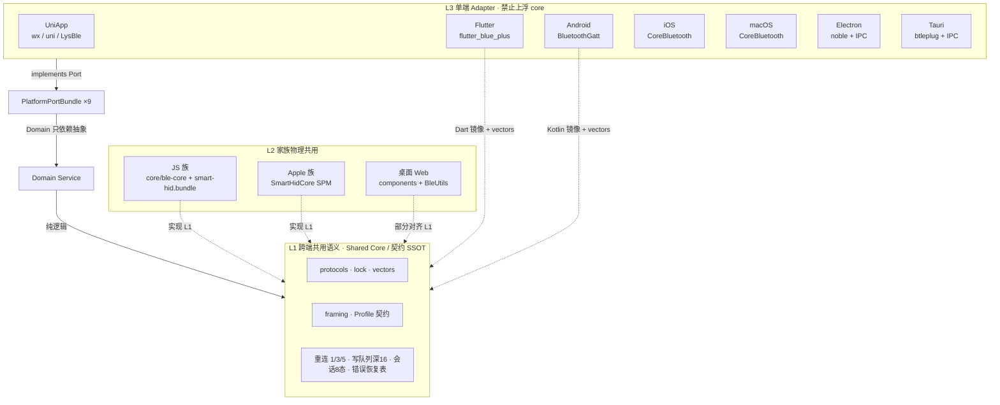
```mermaid
flowchart TB
    subgraph L1["L1 跨端共用语义 · Shared Core / 契约 SSOT"]
        P["protocols · lock · vectors"]
        F["framing · Profile 契约"]
        R["重连 1/3/5 · 写队列深16 · 会话8态 · 错误恢复表"]
    end

    subgraph L2["L2 家族物理共用"]
        JS["JS 族<br/>core/ble-core + smart-hid.bundle"]
        AP["Apple 族<br/>SmartHidCore SPM"]
        DW["桌面 Web<br/>components + BleUtils"]
    end

    subgraph L3["L3 单端 Adapter · 禁止上浮 core"]
        U["UniApp<br/>wx / uni / LysBle"]
        FL["Flutter<br/>flutter_blue_plus"]
        AN["Android<br/>BluetoothGatt"]
        IO["iOS<br/>CoreBluetooth"]
        MC["macOS<br/>CoreBluetooth"]
        EL["Electron<br/>noble + IPC"]
        TA["Tauri<br/>btleplug + IPC"]
    end

    L3 -->|"implements Port"| PORTS["PlatformPortBundle ×9"]
    PORTS -->|"Domain 只依赖抽象"| DOM["Domain Service"]
    DOM -->|"纯逻辑"| L1
    JS -.->|"实现 L1"| L1
    AP -.->|"实现 L1"| L1
    DW -.->|"部分对齐 L1"| L1
    FL -.->|"Dart 镜像 + vectors"| L1
    AN -.->|"Kotlin 镜像 + vectors"| L1
```

### 1.2 目标运行时分层（Ports & Adapters，与正典对齐）

> 与 `RUNTIME_ARCHITECTURE.md` §0.1 同构；此处强调 **哪些跨端、哪些单端**。

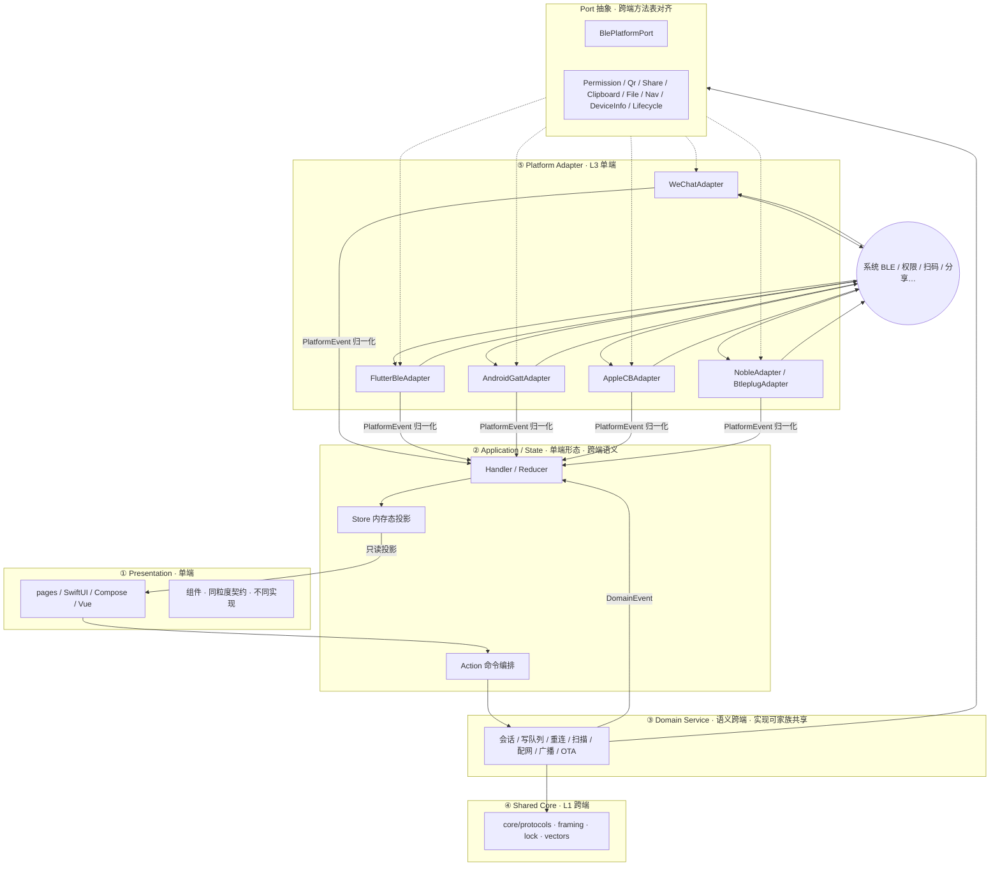
```mermaid
flowchart TB
    subgraph PRES["① Presentation · 单端"]
        PAGE["pages / SwiftUI / Compose / Vue"]
        COMP["组件 · 同粒度契约 · 不同实现"]
    end

    subgraph APP["② Application / State · 单端形态 · 跨端语义"]
        ACT["Action 命令编排"]
        HND["Handler / Reducer"]
        ST["Store 内存态投影"]
    end

    subgraph DOM["③ Domain Service · 语义跨端 · 实现可家族共享"]
        SVC["会话 / 写队列 / 重连 / 扫描 / 配网 / 广播 / OTA"]
    end

    subgraph PORTS["Port 抽象 · 跨端方法表对齐"]
        PBLE["BlePlatformPort"]
        POTH["Permission / Qr / Share / Clipboard / File / Nav / DeviceInfo / Lifecycle"]
    end

    subgraph SC["④ Shared Core · L1 跨端"]
        CORE["core/protocols · framing · lock · vectors"]
    end

    subgraph AD["⑤ Platform Adapter · L3 单端"]
        A1["WeChatAdapter"]
        A2["FlutterBleAdapter"]
        A3["AndroidGattAdapter"]
        A4["AppleCBAdapter"]
        A5["NobleAdapter / BtleplugAdapter"]
    end

    SYS(("系统 BLE / 权限 / 扫码 / 分享…"))

    PAGE --> ACT
    ACT --> SVC
    SVC --> CORE
    SVC --> PORTS
    PORTS -.-> A1 & A2 & A3 & A4 & A5
    A1 & A2 & A3 & A4 & A5 --> SYS
    SYS --> A1 & A2 & A3 & A4 & A5
    A1 & A2 & A3 & A4 & A5 -->|"PlatformEvent 归一化"| HND
    SVC -->|"DomainEvent"| HND
    HND --> ST
    ST -->|"只读投影"| PAGE
```

### 1.3 产品家族 × 共享边界图

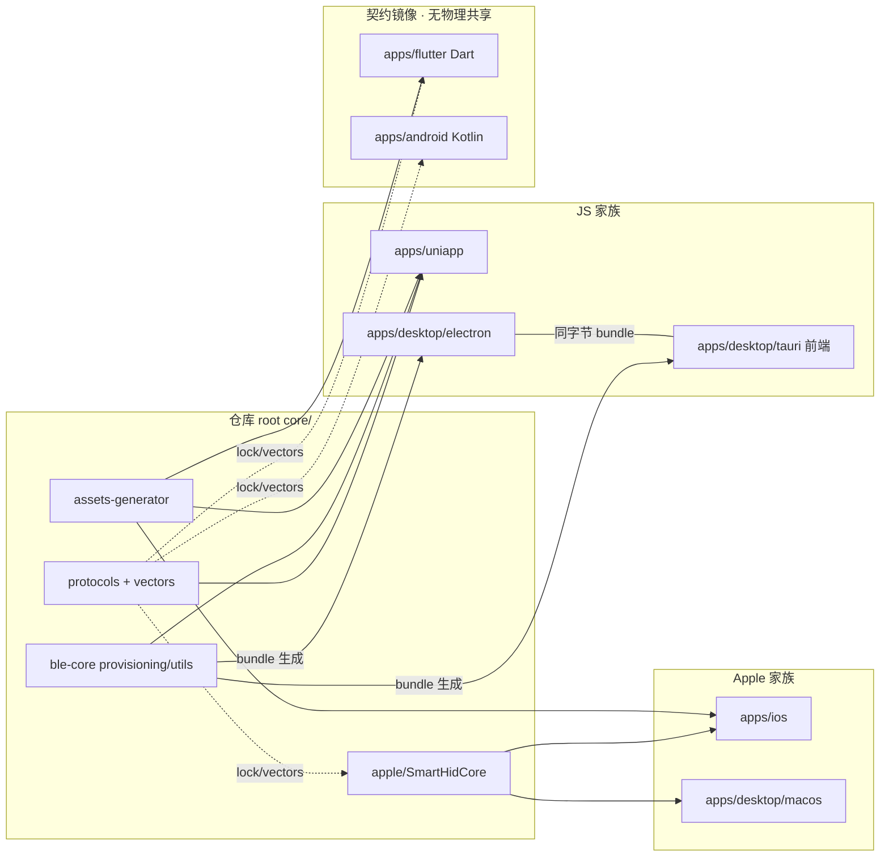
```mermaid
flowchart LR
    subgraph SHARED["仓库 root core/"]
        PROTO["protocols + vectors"]
        BLECORE["ble-core provisioning/utils"]
        APPLE["apple/SmartHidCore"]
        ASSET["assets-generator"]
    end

    subgraph JSFAM["JS 家族"]
        UNI["apps/uniapp"]
        ELE["apps/desktop/electron"]
        TAU["apps/desktop/tauri 前端"]
    end

    subgraph APPLEFAM["Apple 家族"]
        IOS["apps/ios"]
        MAC["apps/desktop/macos"]
    end

    subgraph MIRROR["契约镜像 · 无物理共享"]
        FLT["apps/flutter Dart"]
        AND["apps/android Kotlin"]
    end

    PROTO --> UNI
    BLECORE --> UNI
    PROTO -.->|"lock/vectors"| FLT & AND & APPLE
    BLECORE -->|"bundle 生成"| ELE & TAU
    APPLE --> IOS & MAC
    ASSET --> UNI & FLT & IOS
    ELE ---|"同字节 bundle"| TAU
```

### 1.4 现状巨石 vs 目标拆分（BleManager）

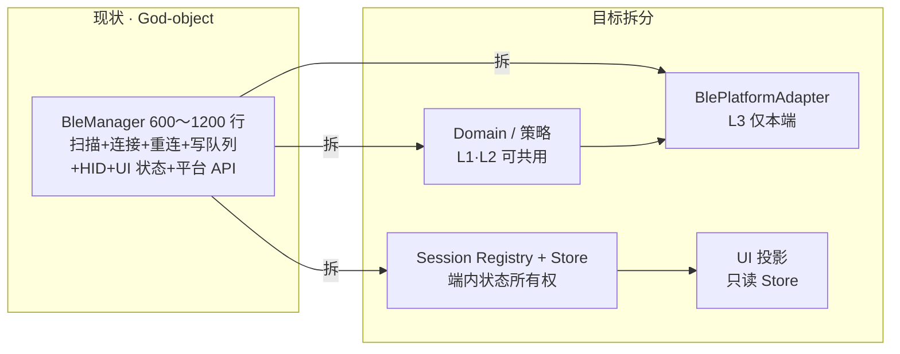
```mermaid
flowchart LR
    subgraph ASIS["现状 · God-object"]
        M["BleManager 600～1200 行<br/>扫描+连接+重连+写队列<br/>+HID+UI 状态+平台 API"]
    end

    subgraph TOBE["目标拆分"]
        D["Domain / 策略<br/>L1·L2 可共用"]
        S["Session Registry + Store<br/>端内状态所有权"]
        A["BlePlatformAdapter<br/>L3 仅本端"]
        U["UI 投影<br/>只读 Store"]
    end

    M -->|"拆"| D
    M -->|"拆"| S
    M -->|"拆"| A
    S --> U
    D --> A
```

### 1.5 PlatformPortBundle 职责拆分图

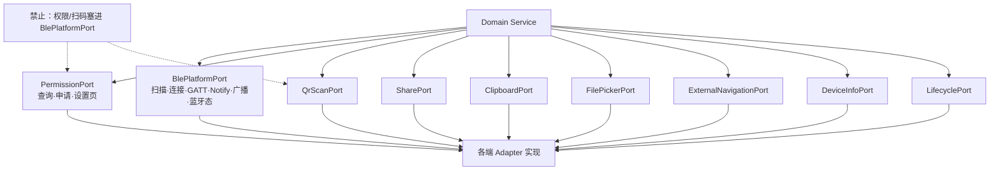
```mermaid
flowchart TB
    DOM["Domain Service"]
    DOM --> BLE["BlePlatformPort<br/>扫描·连接·GATT·Notify·广播·蓝牙态"]
    DOM --> PERM["PermissionPort<br/>查询·申请·设置页"]
    DOM --> QR["QrScanPort"]
    DOM --> SH["SharePort"]
    DOM --> CB["ClipboardPort"]
    DOM --> FP["FilePickerPort"]
    DOM --> NAV["ExternalNavigationPort"]
    DOM --> DI["DeviceInfoPort"]
    DOM --> LC["LifecyclePort"]

    BLE --> AD["各端 Adapter 实现"]
    PERM --> AD
    QR --> AD
    SH --> AD
    CB --> AD
    FP --> AD
    NAV --> AD
    DI --> AD
    LC --> AD

    note1["禁止：权限/扫码塞进 BlePlatformPort"]
    note1 -.-> PERM
    note1 -.-> QR
```

---

## 2. 流程图

### 2.1 封装归属决策流（新代码放哪）

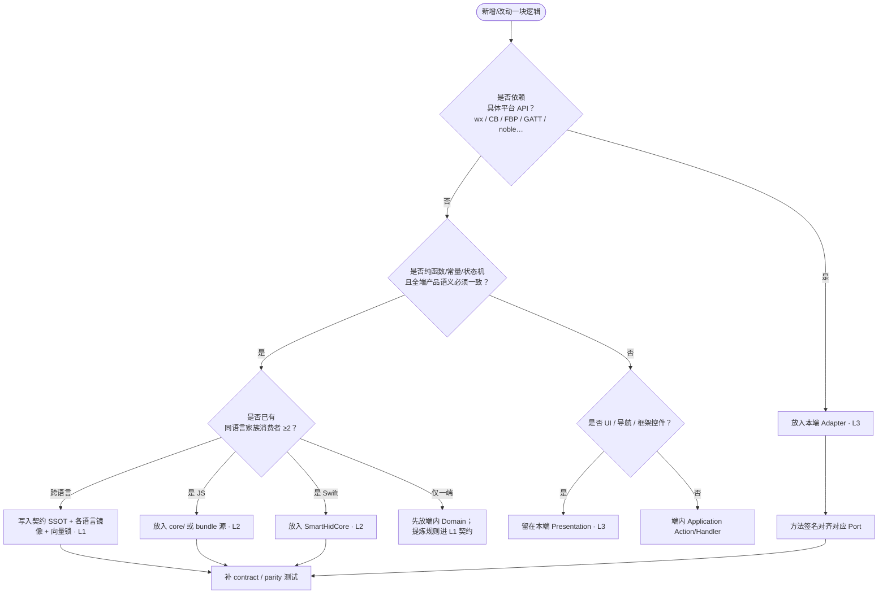
```mermaid
flowchart TD
    START([新增/改动一块逻辑]) --> Q1{是否依赖<br/>具体平台 API？<br/>wx / CB / FBP / GATT / noble…}

    Q1 -->|是| L3[放入本端 Adapter · L3]
    Q1 -->|否| Q2{是否纯函数/常量/状态机<br/>且全端产品语义必须一致？}

    Q2 -->|是| Q3{是否已有<br/>同语言家族消费者 ≥2？}
    Q2 -->|否| Q4{是否 UI / 导航 / 框架控件？}

    Q3 -->|是 JS| L2JS[放入 core/ 或 bundle 源 · L2]
    Q3 -->|是 Swift| L2AP[放入 SmartHidCore · L2]
    Q3 -->|跨语言| L1[写入契约 SSOT + 各语言镜像 + 向量锁 · L1]
    Q3 -->|仅一端| TMP[先放端内 Domain；<br/>提炼规则进 L1 契约]

    Q4 -->|是| UI[留在本端 Presentation · L3]
    Q4 -->|否| APP[端内 Application Action/Handler]

    L1 --> TEST[补 contract / parity 测试]
    L2JS --> TEST
    L2AP --> TEST
    L3 --> PORT[方法签名对齐对应 Port]
    PORT --> TEST
```

### 2.2 跨语言「共用」落地流（无法物理共享时）

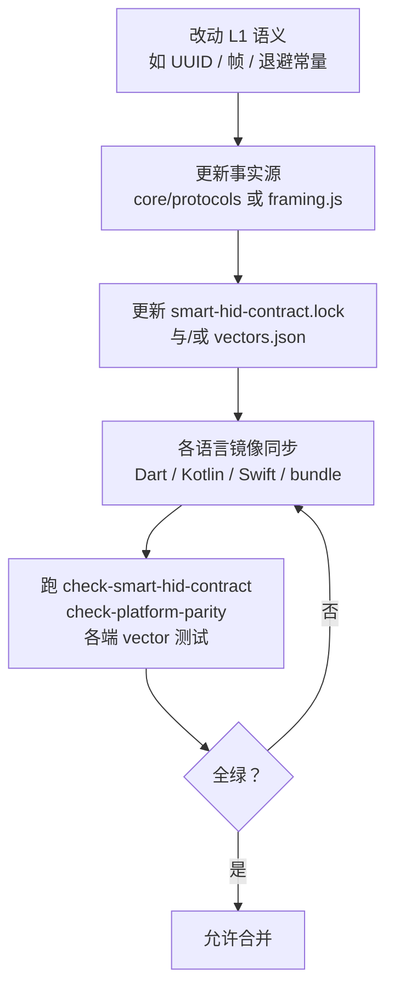
```mermaid
flowchart TD
    A[改动 L1 语义<br/>如 UUID / 帧 / 退避常量] --> B[更新事实源<br/>core/protocols 或 framing.js]
    B --> C[更新 smart-hid-contract.lock<br/>与/或 vectors.json]
    C --> D[各语言镜像同步<br/>Dart / Kotlin / Swift / bundle]
    D --> E[跑 check-smart-hid-contract<br/>check-platform-parity<br/>各端 vector 测试]
    E --> F{全绿？}
    F -->|否| D
    F -->|是| G[允许合并]
```

### 2.3 UniApp 目标依赖流（禁止双向）

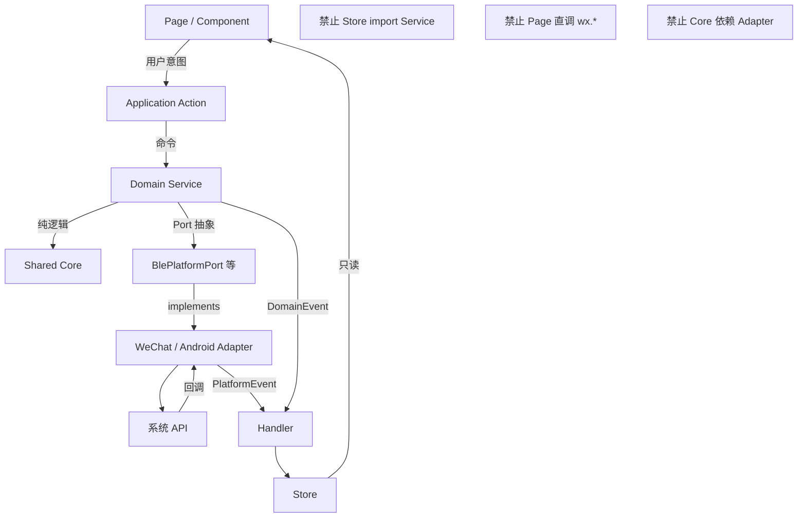
```mermaid
flowchart TD
    P[Page / Component] -->|"用户意图"| ACT[Application Action]
    ACT -->|"命令"| SVC[Domain Service]
    SVC -->|"纯逻辑"| CORE[Shared Core]
    SVC -->|"Port 抽象"| PORT[BlePlatformPort 等]
    PORT -->|"implements"| AD[WeChat / Android Adapter]
    AD --> SYS[系统 API]

    SYS -->|"回调"| AD
    AD -->|"PlatformEvent"| HND[Handler]
    SVC -->|"DomainEvent"| HND
    HND --> ST[Store]
    ST -->|"只读"| P

    BAD1[禁止 Store import Service]
    BAD2[禁止 Page 直调 wx.*]
    BAD3[禁止 Core 依赖 Adapter]
```

### 2.4 扫描会话状态流（语义跨端 · 实现单端）

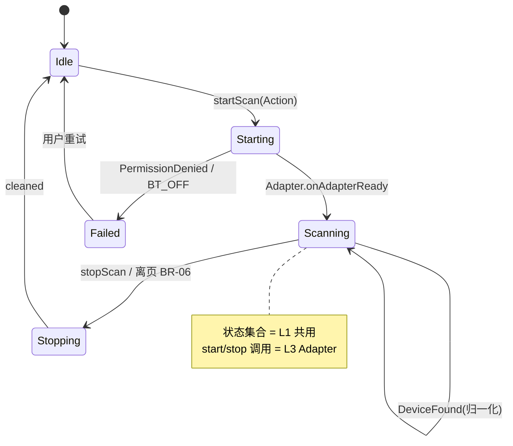
```mermaid
stateDiagram-v2
    [*] --> Idle
    Idle --> Starting: startScan(Action)
    Starting --> Scanning: Adapter.onAdapterReady
    Starting --> Failed: PermissionDenied / BT_OFF
    Scanning --> Stopping: stopScan / 离页 BR-06
    Scanning --> Scanning: DeviceFound(归一化)
    Stopping --> Idle: cleaned
    Failed --> Idle: 用户重试

    note right of Scanning
      状态集合 = L1 共用
      start/stop 调用 = L3 Adapter
    end note
```

---

## 3. 时序图

### 3.1 目标：扫描发现设备（命令流 + 事件流）

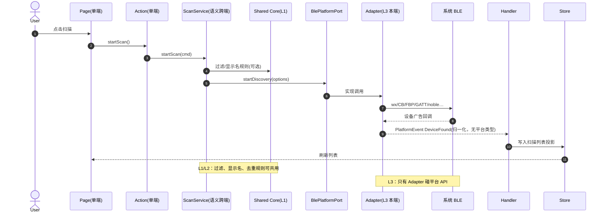
```mermaid
sequenceDiagram
    autonumber
    actor User
    participant UI as Page(单端)
    participant ACT as Action(单端)
    participant SVC as ScanService(语义跨端)
    participant CORE as Shared Core(L1)
    participant PORT as BlePlatformPort
    participant AD as Adapter(L3 本端)
    participant SYS as 系统 BLE
    participant HND as Handler
    participant ST as Store

    User->>UI: 点击扫描
    UI->>ACT: startScan()
    ACT->>SVC: startScan(cmd)
    SVC->>CORE: 过滤/显示名规则(可选)
    SVC->>PORT: startDiscovery(options)
    PORT->>AD: 实现调用
    AD->>SYS: wx/CB/FBP/GATT/noble…

    SYS-->>AD: 设备广告回调
    AD-->>HND: PlatformEvent DeviceFound(归一化，无平台类型)
    HND->>ST: 写入扫描列表投影
    ST-->>UI: 刷新列表

    Note over SVC,CORE: L1/L2：过滤、显示名、去重规则可共用
    Note over AD,SYS: L3：只有 Adapter 碰平台 API
```

### 3.2 目标：连接 + 被动断线重连（策略共用 · 调度单端）

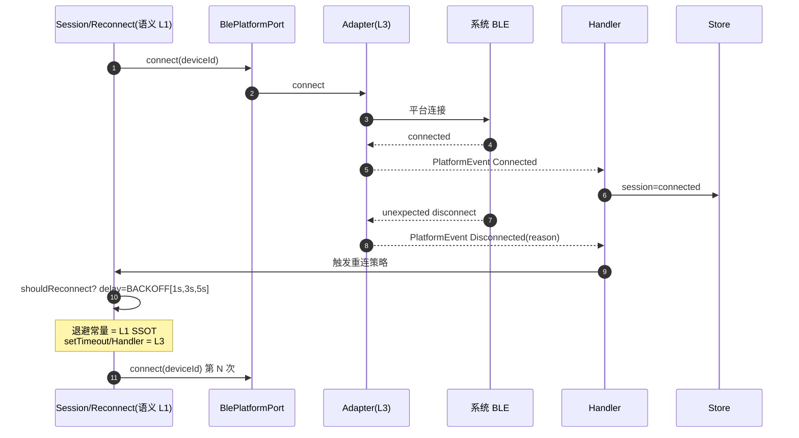
```mermaid
sequenceDiagram
    autonumber
    participant SVC as Session/Reconnect(语义 L1)
    participant PORT as BlePlatformPort
    participant AD as Adapter(L3)
    participant SYS as 系统 BLE
    participant HND as Handler
    participant ST as Store

    SVC->>PORT: connect(deviceId)
    PORT->>AD: connect
    AD->>SYS: 平台连接
    SYS-->>AD: connected
    AD-->>HND: PlatformEvent Connected
    HND->>ST: session=connected

    SYS-->>AD: unexpected disconnect
    AD-->>HND: PlatformEvent Disconnected(reason)
    HND->>SVC: 触发重连策略
    SVC->>SVC: shouldReconnect? delay=BACKOFF[1s,3s,5s]
    Note over SVC: 退避常量 = L1 SSOT<br/>setTimeout/Handler = L3
    SVC->>PORT: connect(deviceId) 第 N 次
```

### 3.3 目标：Smart HID 配网（纯逻辑共用 · 传输单端）

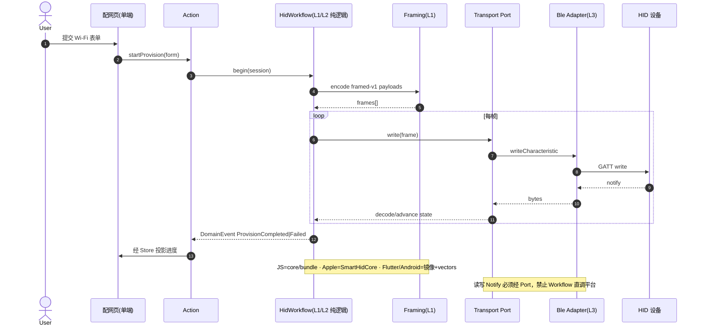
```mermaid
sequenceDiagram
    autonumber
    actor User
    participant UI as 配网页(单端)
    participant ACT as Action
    participant WF as HidWorkflow(L1/L2 纯逻辑)
    participant FR as Framing(L1)
    participant TP as Transport Port
    participant AD as Ble Adapter(L3)
    participant DEV as HID 设备

    User->>UI: 提交 Wi-Fi 表单
    UI->>ACT: startProvision(form)
    ACT->>WF: begin(session)
    WF->>FR: encode framed-v1 payloads
    FR-->>WF: frames[]
    loop 每帧
        WF->>TP: write(frame)
        TP->>AD: writeCharacteristic
        AD->>DEV: GATT write
        DEV-->>AD: notify
        AD-->>TP: bytes
        TP-->>WF: decode/advance state
    end
    WF-->>ACT: DomainEvent ProvisionCompleted|Failed
    ACT->>UI: 经 Store 投影进度

    Note over WF,FR: JS=core/bundle · Apple=SmartHidCore · Flutter/Android=镜像+vectors
    Note over TP,AD: 读写 Notify 必须经 Port，禁止 Workflow 直调平台
```

### 3.4 现状问题时序（反例：Page / Manager 直调平台）

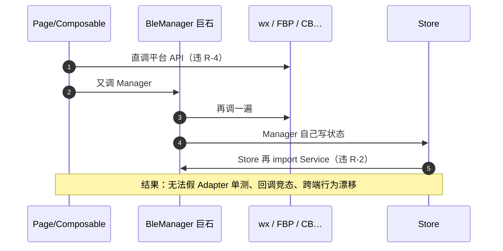
```mermaid
sequenceDiagram
    autonumber
    participant UI as Page/Composable
    participant M as BleManager 巨石
    participant SYS as wx / FBP / CB…
    participant ST as Store

    UI->>SYS: 直调平台 API（违 R-4）
    UI->>M: 又调 Manager
    M->>SYS: 再调一遍
    M->>ST: Manager 自己写状态
    ST->>M: Store 再 import Service（违 R-2）
    Note over UI,ST: 结果：无法假 Adapter 单测、回调竞态、跨端行为漂移
```

### 3.5 Electron / Tauri：前端共用 + 原生单端

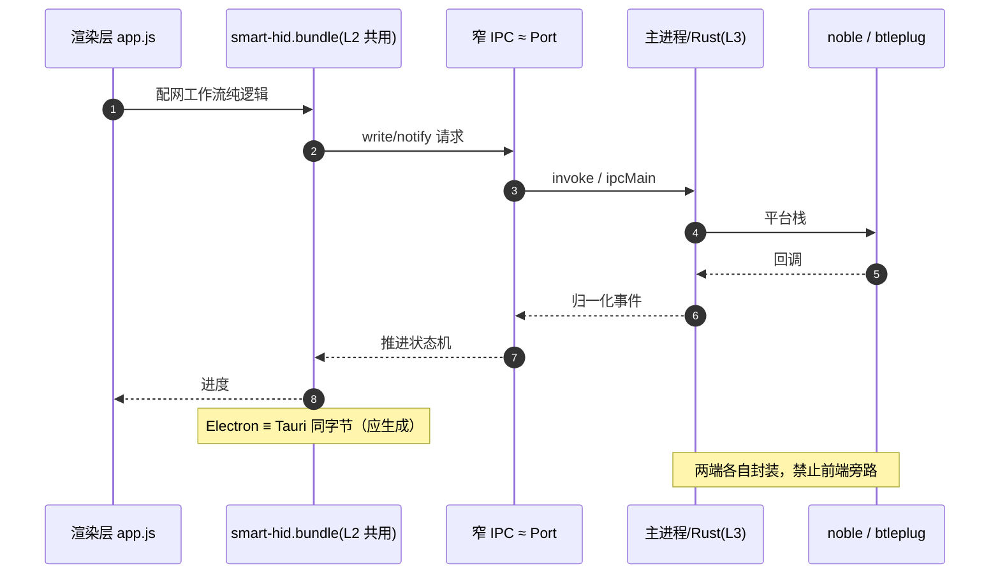
```mermaid
sequenceDiagram
    autonumber
    participant UI as 渲染层 app.js
    participant BUNDLE as smart-hid.bundle(L2 共用)
    participant IPC as 窄 IPC ≈ Port
    participant HOST as 主进程/Rust(L3)
    participant STACK as noble / btleplug

    UI->>BUNDLE: 配网工作流纯逻辑
    BUNDLE->>IPC: write/notify 请求
    IPC->>HOST: invoke / ipcMain
    HOST->>STACK: 平台栈
    STACK-->>HOST: 回调
    HOST-->>IPC: 归一化事件
    IPC-->>BUNDLE: 推进状态机
    BUNDLE-->>UI: 进度

    Note over BUNDLE: Electron ≡ Tauri 同字节（应生成）
    Note over HOST,STACK: 两端各自封装，禁止前端旁路
```

### 3.6 目标：OTA 升级（校验 L1 共用 · 传输 L3 单端 · 端到端 BLOCKED）

> 正典：`DEVELOPMENT_SCOPE` §5 —— 12 态事务与校验契约保留，**不得提前宣告端到端可用**。

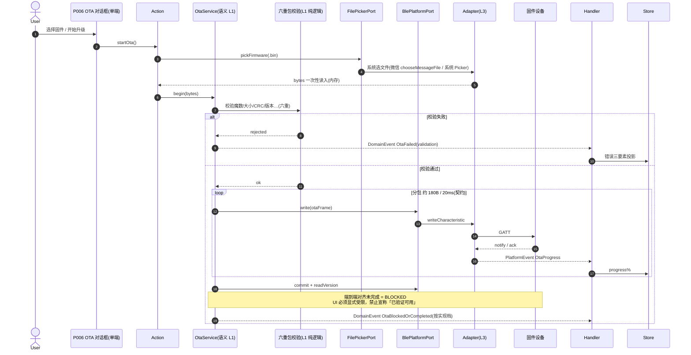
```mermaid
sequenceDiagram
    autonumber
    actor User
    participant UI as P006 OTA 对话框(单端)
    participant ACT as Action
    participant OTA as OtaService(语义 L1)
    participant VAL as 六重包校验(L1 纯逻辑)
    participant FP as FilePickerPort
    participant PORT as BlePlatformPort
    participant AD as Adapter(L3)
    participant DEV as 固件设备
    participant HND as Handler
    participant ST as Store

    User->>UI: 选择固件 / 开始升级
    UI->>ACT: startOta()
    ACT->>FP: pickFirmware(.bin)
    FP->>AD: 系统选文件(微信 chooseMessageFile / 系统 Picker)
    AD-->>ACT: bytes 一次性读入(内存)

    ACT->>OTA: begin(bytes)
    OTA->>VAL: 校验魔数/大小/CRC/版本…(六重)
    alt 校验失败
        VAL-->>OTA: rejected
        OTA-->>HND: DomainEvent OtaFailed(validation)
        HND->>ST: 错误三要素投影
    else 校验通过
        VAL-->>OTA: ok
        loop 分包 约 180B / 20ms(契约)
            OTA->>PORT: write(otaFrame)
            PORT->>AD: writeCharacteristic
            AD->>DEV: GATT
            DEV-->>AD: notify / ack
            AD-->>HND: PlatformEvent OtaProgress
            HND->>ST: progress%
        end
        OTA->>PORT: commit + readVersion
        Note over OTA,DEV: 端到端对齐未完成 = BLOCKED<br/>UI 必须显式受限，禁止宣称「已验证可用」
        OTA-->>HND: DomainEvent OtaBlockedOrCompleted(按实现档)
    end
```

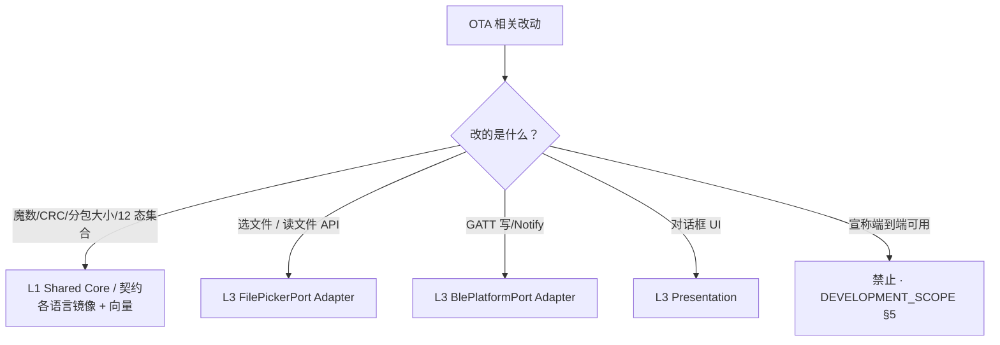
```mermaid
flowchart TD
    A[OTA 相关改动] --> B{改的是什么？}
    B -->|魔数/CRC/分包大小/12 态集合| L1[L1 Shared Core / 契约<br/>各语言镜像 + 向量]
    B -->|选文件 / 读文件 API| L3F[L3 FilePickerPort Adapter]
    B -->|GATT 写/Notify| L3B[L3 BlePlatformPort Adapter]
    B -->|对话框 UI| UI[L3 Presentation]
    B -->|宣称端到端可用| STOP[禁止 · DEVELOPMENT_SCOPE §5]
```

### 3.7 目标：外围广播发射（31B 预算 L1 · startAdvertising L3 · C1）

> 正典：C1 = `supported_limited` —— 真机探测后启用；devtools unsupported；后台不承诺；禁止静默降级。

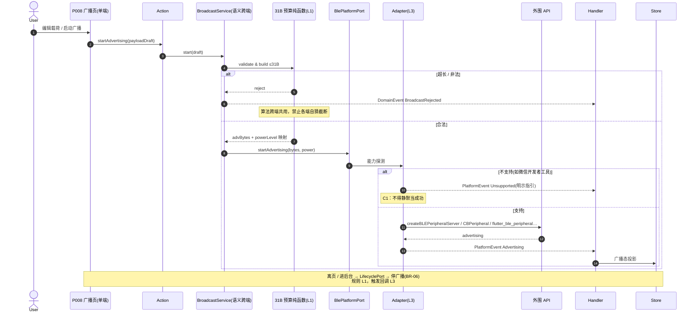
```mermaid
sequenceDiagram
    autonumber
    actor User
    participant UI as P008 广播页(单端)
    participant ACT as Action
    participant BR as BroadcastService(语义跨端)
    participant BUD as 31B 预算纯函数(L1)
    participant PORT as BlePlatformPort
    participant AD as Adapter(L3)
    participant SYS as 外围 API
    participant HND as Handler
    participant ST as Store

    User->>UI: 编辑载荷 / 启动广播
    UI->>ACT: startAdvertising(payloadDraft)
    ACT->>BR: start(draft)
    BR->>BUD: validate & build ≤31B
    alt 超长 / 非法
        BUD-->>BR: reject
        BR-->>HND: DomainEvent BroadcastRejected
        Note over BUD: 算法跨端共用，禁止各端自猜截断
    else 合法
        BUD-->>BR: advBytes + powerLevel 映射
        BR->>PORT: startAdvertising(bytes, power)
        PORT->>AD: 能力探测
        alt 不支持(如微信开发者工具)
            AD-->>HND: PlatformEvent Unsupported(明示指引)
            Note over AD: C1：不得静默当成功
        else 支持
            AD->>SYS: createBLEPeripheralServer / CBPeripheral / flutter_ble_peripheral…
            SYS-->>AD: advertising
            AD-->>HND: PlatformEvent Advertising
            HND->>ST: 广播态投影
        end
    end

    Note over UI,ST: 离页 / 进后台 → LifecyclePort → 停广播(BR-06)<br/>规则 L1，触发回调 L3
```

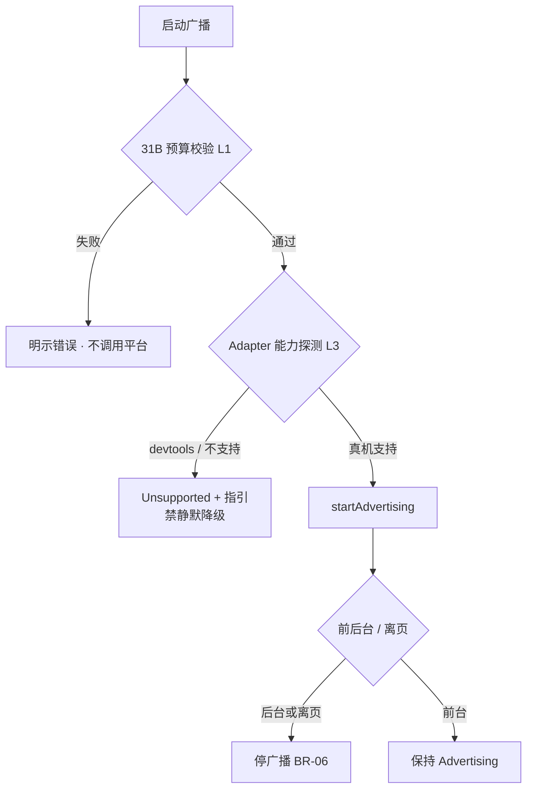
```mermaid
flowchart TD
    S[启动广播] --> V{31B 预算校验 L1}
    V -->|失败| R[明示错误 · 不调用平台]
    V -->|通过| C{Adapter 能力探测 L3}
    C -->|devtools / 不支持| U[Unsupported + 指引<br/>禁静默降级]
    C -->|真机支持| A[startAdvertising]
    A --> L{前后台 / 离页}
    L -->|后台或离页| STOP[停广播 BR-06]
    L -->|前台| KEEP[保持 Advertising]
```

### 3.8 目标：多设备会话（Registry L1 语义 · 连接 L3 · C3）

> 正典：C3 = `supported_foreground` —— 前台多 Session；不承诺后台保持与固定上限；**Session Registry 唯一事实源**；每 Session 独立错误反馈。

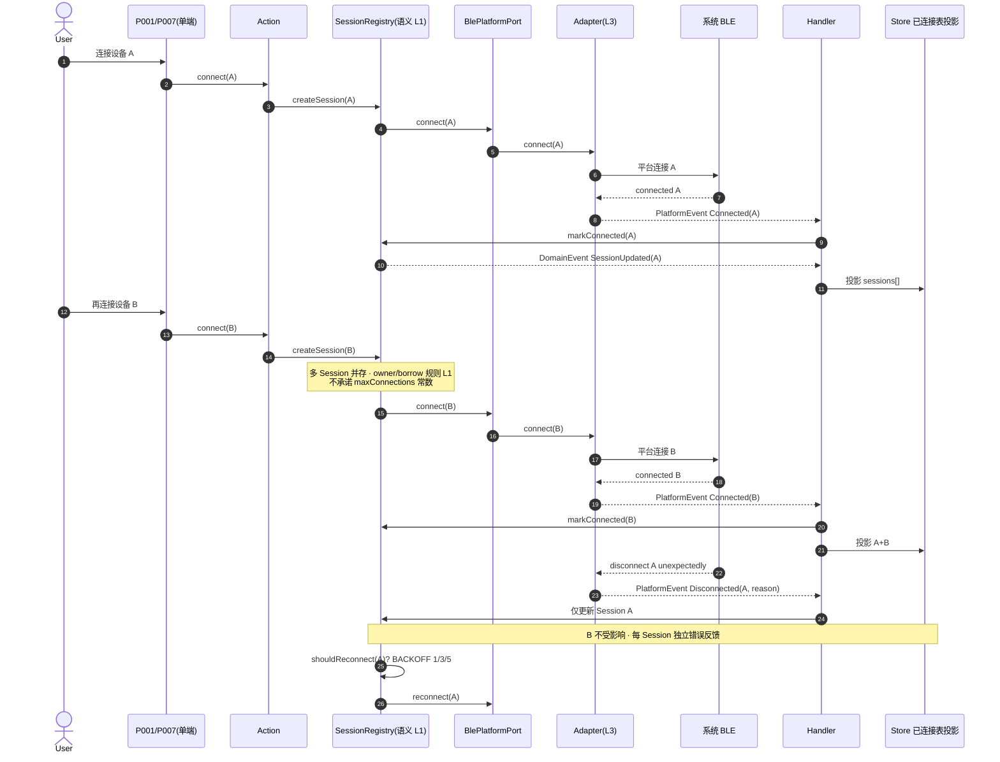
```mermaid
sequenceDiagram
    autonumber
    actor User
    participant UI as P001/P007(单端)
    participant ACT as Action
    participant REG as SessionRegistry(语义 L1)
    participant PORT as BlePlatformPort
    participant AD as Adapter(L3)
    participant SYS as 系统 BLE
    participant HND as Handler
    participant ST as Store 已连接表投影

    User->>UI: 连接设备 A
    UI->>ACT: connect(A)
    ACT->>REG: createSession(A)
    REG->>PORT: connect(A)
    PORT->>AD: connect(A)
    AD->>SYS: 平台连接 A
    SYS-->>AD: connected A
    AD-->>HND: PlatformEvent Connected(A)
    HND->>REG: markConnected(A)
    REG-->>HND: DomainEvent SessionUpdated(A)
    HND->>ST: 投影 sessions[]

    User->>UI: 再连接设备 B
    UI->>ACT: connect(B)
    ACT->>REG: createSession(B)
    Note over REG: 多 Session 并存 · owner/borrow 规则 L1<br/>不承诺 maxConnections 常数
    REG->>PORT: connect(B)
    PORT->>AD: connect(B)
    AD->>SYS: 平台连接 B
    SYS-->>AD: connected B
    AD-->>HND: PlatformEvent Connected(B)
    HND->>REG: markConnected(B)
    HND->>ST: 投影 A+B

    SYS-->>AD: disconnect A unexpectedly
    AD-->>HND: PlatformEvent Disconnected(A, reason)
    HND->>REG: 仅更新 Session A
    Note over REG,ST: B 不受影响 · 每 Session 独立错误反馈
    REG->>REG: shouldReconnect(A)? BACKOFF 1/3/5
    REG->>PORT: reconnect(A)
```

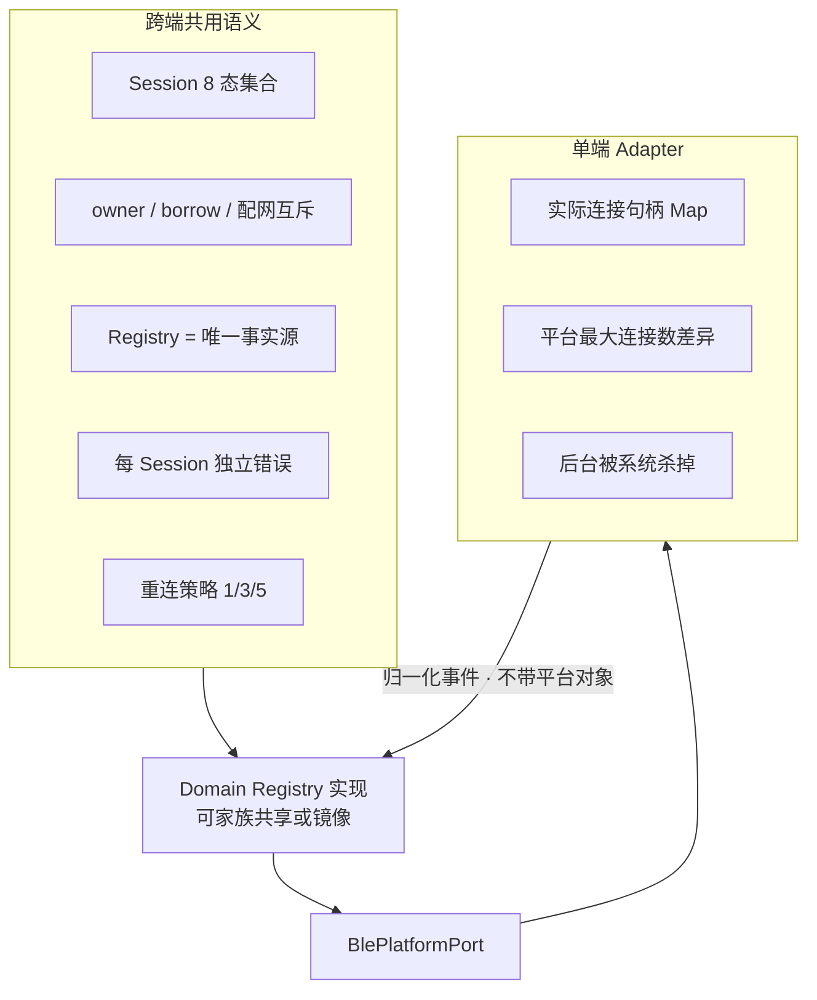
```mermaid
flowchart TD
    subgraph L1["跨端共用语义"]
        R1[Session 8 态集合]
        R2[owner / borrow / 配网互斥]
        R3[Registry = 唯一事实源]
        R4[每 Session 独立错误]
        R5[重连策略 1/3/5]
    end

    subgraph L3["单端 Adapter"]
        A1[实际连接句柄 Map]
        A2[平台最大连接数差异]
        A3[后台被系统杀掉]
    end

    L1 --> DOM[Domain Registry 实现<br/>可家族共享或镜像]
    DOM --> PORT[BlePlatformPort]
    PORT --> L3
    L3 -->|"归一化事件 · 不带平台对象"| DOM
```

### 3.9 多设备 × 配网占用（互斥）

```mermaid
sequenceDiagram
    autonumber
    participant REG as SessionRegistry
    participant HID as HidWorkflow
    participant PORT as BlePlatformPort

    Note over REG: Session A = connected, owner=GATT
    HID->>REG: acquire(A, purpose=provisioning)
    alt 已被其他流程占用
        REG-->>HID: rejected(busy)
    else 获取成功
        REG-->>HID: owner=provisioning
        HID->>PORT: write/notify on A
        HID->>REG: release(A)
        REG-->>HID: owner=GATT 或 idle
    end
    Note over REG,HID: 占用规则 = L1；GATT 句柄 = L3
```

### 3.10 目标：P005 Smart HID 诊断（两路径 + 运行隔离）

> 正典：PAGE_SPEC §5 · API_ACTION_MATRIX P05-01～04 · RUNTIME 五元组（防旧回调盖新 UI）。

```mermaid
sequenceDiagram
    autonumber
    actor User
    participant UI as P005 诊断页(单端)
    participant ACT as Action
    participant DIAG as DiagnosticService(语义 L1)
    participant REG as SessionRegistry
    participant PORT as BlePlatformPort
    participant AD as Adapter(L3)
    participant DEV as HID 设备
    participant HND as Handler
    participant ST as Store

    User->>UI: 重新检测(P05-01)
    UI->>ACT: diagnose(deviceId)
    ACT->>ACT: 分配 operationId + generation++
    ACT->>REG: ensureSession(deviceId)

    alt 会话不在线(路径一：offline)
        REG-->>ACT: offline
        ACT-->>UI: 投影 offline + modal「BLE 未连接」
        User->>UI: 确认「连接并检测」
        UI->>ACT: connectThenDiagnose
        ACT->>PORT: connect(deviceId)
        PORT->>AD: connect
        AD->>DEV: 平台连接
        DEV-->>AD: connected
        AD-->>HND: PlatformEvent Connected
        HND->>REG: markConnected
    else 已在线(路径二：直接诊断)
        REG-->>ACT: connected
    end

    ACT->>DIAG: runFiveChecks(generation=G)
    Note over DIAG: 五行：连接/模式/状态/错误/版本等映射<br/>状态集合与映射规则 = L1
    DIAG->>PORT: read(STATUS 特征域…)
    PORT->>AD: readCharacteristic
    AD->>DEV: GATT read / notify
    DEV-->>AD: bytes
    AD-->>HND: PlatformEvent CharacteristicValue
    HND->>HND: 校验 generation==G？
    alt generation 已过期(用户已离页/重跑)
        HND-->>HND: 丢弃旧回调(运行隔离)
    else 仍有效
        HND->>DIAG: 喂入结果
        DIAG-->>HND: DomainEvent DiagnosticUpdated(五行)
        HND->>ST: 投影 ✓/!/…/·
        ST-->>UI: 刷新五行 + 可选错误码块
    end
```

```mermaid
flowchart TD
    START[P05-01 重新检测] --> ONLINE{Session 在线？}
    ONLINE -->|否| M[modal 连接并检测]
    M -->|取消| STAY[停留 P005 offline]
    M -->|确认| CONN[connect 10s + 重连策略]
    CONN --> RUN
    ONLINE -->|是| RUN[diagnose generation++]
    RUN --> READ[经 BlePlatformPort 读状态域]
    READ --> GEN{回调 generation<br/>仍是当前？}
    GEN -->|否| DROP[丢弃 · 防旧回调盖新 UI]
    GEN -->|是| MAP[L1 映射五行状态词]
    MAP --> UI[Store 投影到 P005]

    subgraph L1["跨端共用"]
        T1[五行状态模型]
        T2[错误码→异常行定位]
        T3[generation 丢弃规则]
    end
    subgraph L3["单端"]
        T4[连接/读特征值 API]
        T5[modal / 导航栈 P05-03/04]
    end
```

```mermaid
sequenceDiagram
    autonumber
    participant UI as P005
    participant ACT as Action
    participant HND as Handler

    Note over UI,HND: 反例：无 generation → 慢回调污染
    UI->>ACT: diagnose #1 (慢)
    UI->>ACT: diagnose #2 (快，用户连点)
    ACT-->>HND: 结果 #2 已展示「正常」
    ACT-->>HND: 迟到结果 #1「异常」
    HND->>UI: 错误地盖成异常
    Note over HND: 正典：结果 #1 因 generation 过期必须丢弃
```

### 3.11 目标：P006 GATT 读 / 写 / Notify / 写队列

> 正典：API_ACTION_MATRIX P06-08～11 · 写队列同设备串行（深 16 / 单写 5s）· 读 3s 超时 · 被动断线 abort 队列。

```mermaid
sequenceDiagram
    autonumber
    actor User
    participant UI as P006(单端)
    participant ACT as Action
    participant Q as WriteQueue(策略 L1)
    participant CODEC as gatt-codec(L1)
    participant PORT as BlePlatformPort
    participant AD as Adapter(L3)
    participant DEV as 外设
    participant HND as Handler
    participant LOG as 会话日志(内存)

    rect rgb(240,248,255)
    Note over User,LOG: 读取 P06-08
    User->>UI: 点击读取
    UI->>ACT: read(svc, char)
    ACT->>PORT: read(svc, char) 超时 3s
    PORT->>AD: readCharacteristic
    AD->>DEV: GATT read
    DEV-->>AD: bytes
    AD-->>HND: PlatformEvent Value
    HND->>CODEC: HEX + UTF-8 TEXT
    CODEC-->>HND: 双视图
    HND->>LOG: 「接收」行
    HND->>UI: 经 Store 刷新
    end

    rect rgb(255,248,240)
    Note over User,LOG: 写入 P06-09/11 · 队列串行
    User->>UI: 写入 → write-dialog TEXT/HEX
    UI->>ACT: write(payload)
    ACT->>CODEC: 校验 HEX / 编码 TEXT
    alt 非法
        CODEC-->>UI: toast 拦截
    else 合法
        ACT->>Q: enqueue(deviceId, writeJob)
        Note over Q: 同设备串行 · 跨设备可并行<br/>深 16 · 单写 5s = L1
        Q->>PORT: write(下一笔)
        PORT->>AD: writeCharacteristic
        AD->>DEV: GATT write
        DEV-->>AD: 成功/失败
        AD-->>HND: PlatformEvent WriteResult
        HND->>Q: complete → 触发下一笔
        HND->>LOG: 「写入」或「错误」
    end
    end

    rect rgb(240,255,240)
    Note over User,LOG: Notify P06-10
    User->>UI: 开始监听
    UI->>ACT: enableNotify(svc, char)
    ACT->>PORT: enableNotify
    PORT->>AD: subscribe
    AD->>DEV: setNotify
    loop 设备推送
        DEV-->>AD: notification
        AD-->>HND: PlatformEvent Notify(归一化)
        HND->>CODEC: 解码
        HND->>LOG: 「接收」
    end
    User->>UI: 停止监听
    UI->>ACT: disableNotify
    ACT->>PORT: disableNotify
    end
```

```mermaid
sequenceDiagram
    autonumber
    participant SYS as 系统 BLE
    participant AD as Adapter
    participant HND as Handler
    participant Q as WriteQueue
    participant REG as SessionRegistry
    participant REC as Reconnect(L1 策略)

    SYS-->>AD: unexpected disconnect
    AD-->>HND: PlatformEvent Disconnected
    HND->>Q: abort(deviceId) 未发事务取消不重发
    HND->>REG: session=disconnected
    HND->>REC: shouldReconnect?
    REC->>REC: delay 1s/3s/5s
    REC->>AD: connect via Port
    Note over Q,REC: abort 与退避规则跨端共用；<br/>平台 disconnect 回调仅 L3
```

```mermaid
flowchart TD
    W[写入请求] --> V{codec 校验 L1}
    V -->|HEX 非法/空| T[toast 拦截]
    V -->|合法| E[入队 WriteQueue]
    E --> D{队列深 >16？}
    D -->|是| RJ[rejected 明示]
    D -->|否| S[同设备串行调度]
    S --> P[BlePlatformPort.write]
    P --> A[Adapter L3]
    A --> OK{5s 内完成？}
    OK -->|超时/失败| ERR[日志错误 · 可选重试策略]
    OK -->|成功| NXT[complete → 下一笔]

    subgraph SHARED["L1 共用"]
        C1[TEXT/HEX 规则]
        C2[深 16 / 5s]
        C3[同设备串行]
        C4[断线 abort]
    end
    subgraph LOCAL["L3 单端"]
        L1a[writeCharacteristic API]
        L2a[write-dialog UI]
        L3a[日志面板呈现]
    end
```

### 3.12 权限：判定次序 + PermissionPort（F002）+ 与「产品六态」关系

> 正典：`PERMISSION.md` —— 工程态 ×7；**先能力 → 再蓝牙态 → 再权限**；蓝牙未开 = BLE_001 ≠ 权限；Page 禁止直调权限 API（走 PermissionPort）。  
> 「页面视觉六态」（正常/空/加载/错误/权限/弹窗）是 **UI 验收矩阵**，不是再增一套业务状态机。

```mermaid
flowchart TD
    ACT[用户点「开始扫描」P01-01] --> CAP{① 能力探测 capability}
    CAP -->|能力缺失| UNSUP[unsupported · 明示指引<br/>不占 BLE_002]
    CAP -->|有能力| BT{② 蓝牙适配器态}
    BT -->|未开 10001| BT1[BLE_001 · modal 请先打开系统蓝牙<br/>recovery=open_settings]
    BT -->|可用| PERM{③ PermissionPort 查询/申请}
    PERM --> PS[PermissionState 工程态]

    PS --> U[unknown]
    PS --> C[checking]
    PS --> G[granted → 进入扫描]
    PS --> D[denied → 横幅 + 可重试申请]
    PS --> P[permanentlyDenied → 仅去设置]
    PS --> N[notRequired → 直接扫描]
    PS --> S[unsupported · 宿主限制]

    D --> SET[open_settings]
    P --> SET
    SET --> SHOW[从设置返回 onShow]
    SHOW --> RE[P-5 重新检查 · 不缓存 granted]
    RE --> PERM
```

```mermaid
sequenceDiagram
    autonumber
    actor User
    participant UI as P001(单端)
    participant ACT as Action
    participant PP as PermissionPort
    participant AD as Adapter(L3)
    participant SYS as 系统/微信授权
    participant BLE as BlePlatformPort
    participant HND as Handler
    participant ST as Store

    User->>UI: 开始扫描(Just-in-time，禁启动时索要全部权限)
    UI->>ACT: startScan()
    ACT->>ACT: ① capability ② bluetooth state
    alt 蓝牙未开
        ACT-->>HND: DomainEvent BtOff(BLE_001)
        HND->>ST: modal 投影
    else 需权限
        ACT->>PP: ensureBluetoothPermission()
        PP->>AD: 查询/申请(wx / Android runtime / …)
        AD->>SYS: 系统弹窗
        SYS-->>AD: 用户结果
        AD-->>HND: PlatformEvent PermissionStateChanged
        HND->>ST: 权限横幅/去设置投影
        alt granted / notRequired
            ACT->>BLE: startDiscovery
            BLE->>AD: 平台开扫
        else denied
            Note over ST: 横幅 reason 分类<br/>bluetooth_permission_denied…
        else permanentlyDenied
            Note over ST: 仅剩去设置 · App Android 二次拒绝口径
        end
    end

    User->>UI: 从系统设置返回
    UI->>ACT: onShow / LifecycleChanged
    ACT->>PP: recheck(不假设仍 granted)
    Note over PP,AD: PermissionState 仅内存 · L1 规则<br/>弹窗文案/跳转 API = L3
```

```mermaid
stateDiagram-v2
    [*] --> unknown
    unknown --> checking: ensure()
    checking --> granted
    checking --> denied
    checking --> permanentlyDenied
    checking --> notRequired
    checking --> unsupported
    denied --> checking: 用户点重试申请
    denied --> permanentlyDenied: 二次拒绝(Android 实证口径)
    permanentlyDenied --> checking: 从设置返回 recheck
    granted --> checking: onShow recheck(P-5)

    note right of granted
      工程态 · 不扩 STATE_MODEL
      投影到产品：可扫 / 横幅 / modal
    end note
```

```mermaid
flowchart LR
    subgraph L1["跨端共用语义"]
        A1[判定次序 capability→bt→permission]
        A2[PermissionState 枚举含义]
        A3[denied≠BT_OFF≠unsupported]
        A4[P-1 Just-in-time · P-5 onShow 复查]
        A5[错误四级映射 BLE_001/002]
    end
    subgraph L3["单端 Adapter"]
        B1[微信授权弹窗 + 去设置]
        B2[Android FINE_LOCATION 链]
        B3[iOS Info.plist / 系统对话框]
        B4[扫码相机权限 QrScanPort]
    end
    L1 --> PP[PermissionPort 方法表]
    PP --> L3
```

### 3.13 生命周期 BR-06：停扫 / 停广播 / 停监听

> 正典：`BUSINESS_RULE` BR-06 —— 后台或离开页面即停扫、停广播、停监听；**规则跨端共用，触发表达单端**（微信后台挂起、Web 页签可见性、Desktop 退出确认等）。

```mermaid
sequenceDiagram
    autonumber
    participant LC as LifecyclePort
    participant AD as Adapter(L3)
    participant SYS as 宿主生命周期
    participant HND as Handler
    participant SCAN as ScanService
    participant BR as BroadcastService
    participant GATT as Session/Notify
    participant PORT as BlePlatformPort
    participant ST as Store

    SYS-->>AD: 进后台 / 页签隐藏 / 离页 onUnload
    AD-->>HND: PlatformEvent LifecycleChanged(background|unload)
    HND->>SCAN: stopScan(reason=lifecycle)
    HND->>BR: stopAdvertising(reason=lifecycle)
    HND->>GATT: disableActiveNotifies(reason=lifecycle)
    SCAN->>PORT: stopDiscovery
    BR->>PORT: stopAdvertising
    GATT->>PORT: disableNotify(各订阅)
    PORT->>AD: 平台停扫/停播/取消订阅
    HND->>ST: 投影「已停止」· 不假装仍在扫

    Note over HND,ST: 守则内容 = L1（必须停什么）<br/>何谓 background = L3（各宿主回调）
```

```mermaid
flowchart TD
    E[生命周期事件] --> W{哪类？}
    W -->|P001 离页/后台| S1[停扫描会话]
    W -->|P008 离页/后台| S2[停广播 · C1 不承诺后台播]
    W -->|P006 有 Notify| S3[停监听订阅]
    W -->|P002 onUnload| S4[清敏感内存 + 断开配网连接]
    W -->|P005/P006 卸载| S5[清理本页持有连接/诊断 generation 作废]

    S1 & S2 & S3 & S4 & S5 --> PORT[经 Port 调用 · 禁止 Page 直调]
    PORT --> AD[Adapter 调系统 API]

    subgraph RULE["L1 BR-06"]
        R1[后台不得继续扫/播/听]
        R2[敏感数据仅内存 · 离页清理]
    end
    subgraph EXPR["L3 平台表达"]
        X1[微信：onHide/onUnload]
        X2[App：前后台 API]
        X3[Web：visibilitychange]
        X4[Desktop：blur/quit 策略]
    end
```

```mermaid
sequenceDiagram
    autonumber
    participant User
    participant UI as P001
    participant LC as Lifecycle
    participant SCAN as ScanService
    participant PP as PermissionPort

    User->>UI: 扫描中…被系统拉去设置
    LC-->>SCAN: background → stopScan
    Note over SCAN: BR-06 已停扫 · 非用户点停止
    User->>UI: 从设置返回 onShow
    LC-->>PP: recheck permission(P-5)
    alt 仍无权限
        PP-->>UI: 横幅保持
    else 已授权
        Note over UI: 不自动狂扫（除非产品规定回流续扫口径）<br/>Android 文档有「回流自动续扫」实证项须按端对齐
        UI-->>User: 可再次点开始扫描
    end
```

### 3.14 错误码四级分层 + 三级映射 + 恢复四分流

> 正典：`ERROR_CODE.md` —— AppError；四层；平台原生→BLE_00x→产品码；**异常三要素**（提示+下一步+恢复动作）；P002 恢复四分流 `form / pairing / diagnostics / retry` 为产品资产，**Adapter 不得改**（R-5）。  
> 取消类 = `cancelled`，**不是错误**。

```mermaid
flowchart TB
    subgraph L4N["第1层 platform-native · 仅 Adapter 内"]
        N1["微信 errCode 10001 / 10000–10013"]
        N2["Android 权限 reason / 插件码"]
        N3["其他宿主原生码"]
    end

    subgraph L4S["第2层 sdk-transport"]
        S1["BLE_001 蓝牙未开"]
        S2["BLE_002 权限不足"]
        S3["BLE_003～007 扫/连/服务/写/Notify"]
        S4["BLE_008 OTA/广播冲突等"]
    end

    subgraph L4P["第3层 product-domain"]
        P1["配网8码 wifi_failed / pairing_* …"]
        P2["通用 timeout / scan_failed / connection_lost …"]
    end

    subgraph L4V["第4层 validation-capability"]
        V1["非法 HEX · 空 payload · 超31B"]
        V2["能力/宿主 unsupported"]
    end

    L4N -->|"Adapter 映射 · 禁直接展示原生码"| L4S
    L4S --> L4P
    L4V --> UI["userMessage + recoveryAction"]
    L4P --> UI

    note1["L1 共用：分层、映射表、恢复枚举、三要素"]
    note2["L3 单端：原生码产生与 Adapter 内映射实现"]
```

```mermaid
sequenceDiagram
    autonumber
    participant SYS as 系统/设备
    participant AD as Adapter(L3)
    participant PORT as Port
    participant SVC as Domain Service
    participant MAP as 错误映射(L1 表)
    participant HND as Handler
    participant ST as Store
    participant UI as Page

    SYS-->>AD: 原生失败(如 wx 10001 / STATUS wifi_failed)
    AD->>AD: 归一化 PlatformEvent(带 platformCode，不进 UI)
    AD-->>HND: PlatformEvent 或经 SVC
    SVC->>MAP: platform/device → AppError
    MAP-->>SVC: AppError{layer,code,userMessage,recoveryAction,…}
    Note over MAP: technicalMessage 已脱敏<br/>cause 不入日志
    SVC-->>HND: DomainEvent Failed(AppError)
    HND->>ST: 投影横幅/modal（三要素）
    ST-->>UI: 显示提示+下一步+恢复按钮文案

    alt recoveryAction=form
        UI->>UI: 回配网表单(保留 SSID/密码内存)
    else pairing
        UI->>UI: 重新扫码路径
    else diagnostics
        UI->>UI: navigateTo P005
    else retry
        UI->>SVC: 重下发 / 重试操作
    else open_settings / rescan / reconnect
        UI->>PORT: 经对应 Port 执行通用动作
    end
```

```mermaid
flowchart TD
    E[配网失败 · 设备 STATUS error] --> C{产品码}
    C -->|invalid_payload / wifi_failed| F[form 回表单]
    C -->|pairing_invalid / expired / used| P[pairing 重扫码]
    C -->|controlhub_unreachable| D1[diagnostics 或 retry]
    C -->|mqtt_invalid| D2[form 或 diagnostics]
    C -->|storage_failed / timeout| R[retry 重下发]
    C -->|identity_failed| RC[reconnect / 返回]

    F & P & D1 & D2 & R & RC --> BTN[P002 恢复按钮<br/>文案随码变化]
    BTN --> NOTE[四分流 = L1 产品资产<br/>禁止 Adapter 增删分流]
```

```mermaid
flowchart TD
    X[发生失败/取消] --> Q{是用户取消？}
    Q -->|是 扫码取消/停扫/主动断开/OTA abort/离配网| CAN[CommandResult=cancelled<br/>状态转移 · 无错误横幅]
    Q -->|否| LAY{哪一层？}
    LAY -->|原生未映射| SAFE[仅 platformCode+脱敏摘要<br/>禁止脑补业务码]
    LAY -->|已映射| APP[构造 AppError]
    APP --> TRI[异常三要素齐全？]
    TRI -->|缺下一步或恢复| FIX[补齐 · BR-07]
    TRI -->|齐全| SHOW[投影 UI]

    subgraph SHARED["L1 必须共用"]
        M1[AppError 字段契约]
        M2[BLE_001～008]
        M3[配网8码→四分流表]
        M4[取消≠错误]
        M5[脱敏黑名单]
    end
    subgraph LOCAL["L3 单端"]
        M6[原生 errCode 产生]
        M7[横幅/modal 控件]
        M8[去设置跳转 API]
    end
```

```mermaid
sequenceDiagram
    autonumber
    actor User
    participant UI as P002
    participant ACT as Action
    participant WF as HidWorkflow(L1)
    participant AD as Adapter

    Note over UI,AD: 反例：Adapter 擅自改恢复路由
    WF-->>UI: AppError recoveryAction=pairing
    AD->>AD: 错误地改成 retry
    UI->>User: 按钮变成「重下发」
    Note over AD: 违 R-5 / ERROR_CODE §5<br/>四分流任何层不得改

    Note over UI,AD: 正例
    WF-->>UI: recoveryAction=pairing(契约)
    UI->>User: 「重新扫码」
    User->>UI: 点击
    UI->>ACT: startPairingScan
    ACT->>AD: 仅执行扫码能力，不改码表
```

---

## 4. 对照表（配合上图）

### 4.1 L1 — 多平台必须共用（语义 / 契约）

| # | 资产 | 路径 | 共用方式 |
|---|---|---|---|
| S1–S7 | 协议 / lock / vectors / framing / profile-contract | `core/protocols/*` · `core/ble-core/provisioning/*` | 物理或镜像+parity |
| C1 | 重连 1/3/5 | 正典；Android 仍 2s 漂移 | 策略 SSOT |
| C2–C8 | 写队列 / 会话态 / 显示名 / codec / 错误恢复 / Profile / 五元组 | 各端散落 | 契约+测试收口 |

### 4.2 L2 — 家族内可物理共用

| 家族 | 资产 | 路径 |
|---|---|---|
| JS | framing/logger/queue、smart-hid 纯逻辑、bundle | `core/ble-core` · uniapp services · `smart-hid.bundle.js` |
| Apple | SmartHidCore | `core/apple/SmartHidCore` |
| Desktop Web | 五原子组件、BleUtils | `core/ble-core/components` · `desktop-shared`（禁进 UniApp） |

### 4.3 L3 — 单端自身封装

| 端 | 必须自封 |
|---|---|
| UniApp | wx/uni BLE、scan-permission、wx-peripheral、LysBlePeripheral、Vue 页面 |
| Flutter | flutter_blue_plus、peripheral 插件、Riverpod/UI |
| Android | BluetoothGatt/Scanner、Compose |
| iOS/macOS | CoreBluetooth（可共用 SmartHidCore，不可共用 CB 调用） |
| Electron | noble、主进程、IPC |
| Tauri | btleplug、Rust commands、IPC |

---

## 5. 能力归属总表

| 能力 | 层 | 共用什么 | 单端封什么 |
|---|---|---|---|
| UUID / 帧 / 错误码 | L1 | lock + vectors | 语言镜像 |
| 重连 / 写队列参数 | L1 | 策略 SSOT | timer/线程 |
| Session 8 态 | L1 | 语义契约 | Registry 实现 |
| HID 工作流纯逻辑 | L1/L2 | core/bundle/SmartHidCore/镜像 | — |
| 扫描连接读写 Notify | L3 | Port 方法表 | 各 BLE 栈 |
| 权限扫码分享选文件 | L3 | Port 方法表 | 各系统 API |
| 页面与导航 | L3 | 页面号/组件粒度 | UI 框架 |
| 31B 预算算法 | L1 | 纯函数 | startAdvertising（C1 探测在 Adapter） |
| OTA 校验 / 12 态集合 | L1 | 校验与状态集合 | 选文件+GATT；端到端 BLOCKED |
| OTA 选文件 / 写固件 | L3 | Port 方法表 | FilePicker + Ble Adapter |
| 多设备 Session | L1+L3 | Registry 语义 / 8 态 / 独立错误 | 连接句柄与系统上限 |
| 广播 C1 能力探测 | L3 | Unsupported 明示口径 | 各外围 API |
| P005 五行诊断映射 | L1 | 状态词/错误行定位 | 读特征经 Port |
| P005 generation 隔离 | L1 | 五元组丢弃规则 | 回调投递在 Adapter |
| P006 读 3s / 写队列 / Notify | L1+L3 | 超时与队列策略、codec | GATT API + 写弹窗 UI |
| P006 断线 abort 队列 | L1 | abort 不重发未发事务 | disconnect 事件归一化 |
| 权限判定次序 / PermissionState | L1 | 枚举含义与 P-1～P-6 | 各系统授权弹窗与设置页 |
| 权限 API 调用 | L3 | PermissionPort 方法表 | wx / Android runtime / iOS |
| BR-06 停扫停播停听 | L1 | 必须停的对象与时机语义 | LifecyclePort 回调形态 |
| 视觉六态截图矩阵 | 验收 | 正常/空/加载/错误/权限/弹窗 | 各端 UI 渲染（非业务状态机） |
| AppError / 四层 / BLE_001～008 | L1 | 对象字段与映射表 | Adapter 内原生码→映射 |
| 配网恢复四分流 | L1 | form/pairing/diagnostics/retry | 按钮与导航呈现 |
| 取消 cancelled | L1 | 不进 AppError | 各端取消入口 API |

---

## 6. 推荐落地顺序

```mermaid
flowchart LR
    S0[0 基线漂移表] --> S1[1 L1 常量/向量/bundle生成]
    S1 --> S2[2 UniApp Port L3 标杆]
    S2 --> S3[3 切断 Store↔Service]
    S3 --> S4[4 Apple SmartHidCore+拆 Manager]
    S4 --> S5[5 Flutter/Android/E/T Adapter 化]
    S5 --> S6[6 Fake Port + 文档收口]
```

| 阶段 | 验收信号 |
|---|---|
| 0 | 重连常量实测表；E≡T bundle |
| 1 | parity / contract 绿；Android 改为 1/3/5 |
| 2 | platform 经 Port；permission 不直调 wx |
| 3 | R-1/R-2 静态检查 0 |
| 4 | iOS/macOS Manager 职责可指认；测过 SmartHidCore |
| 5 | 各端重连/写队列对齐；Manager 降为 Adapter |
| 6 | CI 可跑 Fake Port；废弃单一 IBLEAdapter 表述 |

---

## 7. 一句话决策清单

1. **协议、帧、Profile、错误恢复、重连/写队列参数** → 跨端共用语义（L1）。  
2. **JS 纯逻辑 / Apple SmartHidCore / 桌面 Web Components** → 家族内物理共用（L2）。  
3. **真 BLE 栈、权限、扫码、分享、生命周期、UI** → 单端自身封装（L3）。  
4. **不要**做七端统一 BLEManager；**不要**把 L3 塞进 `core/`。  
5. 跨语言共用默认形态：**契约锁 + 向量 parity + 语言镜像**。

---

## 8. 相关文档

- [RUNTIME_ARCHITECTURE.md](../specs/08_development/RUNTIME_ARCHITECTURE.md)  
- [PLATFORM_ADAPTER_SPEC.md](../specs/08_development/PLATFORM_ADAPTER_SPEC.md)  
- [LEGACY_REUSE_MATRIX.md](../specs/08_development/LEGACY_REUSE_MATRIX.md)  
- [FLUTTER_REUSE_MATRIX.md](../specs/08_development/FLUTTER_REUSE_MATRIX.md)  
- [CROSS_PLATFORM_BLE_GUIDE.md](../CROSS_PLATFORM_BLE_GUIDE.md)  
- 仓库外：`Open/docs/smart-ble/SMART_BLE_ANALYSIS.md` · 索引 `Open/docs/smart-ble/SHARED_VS_PLATFORM_ENCAPSULATION.md`
