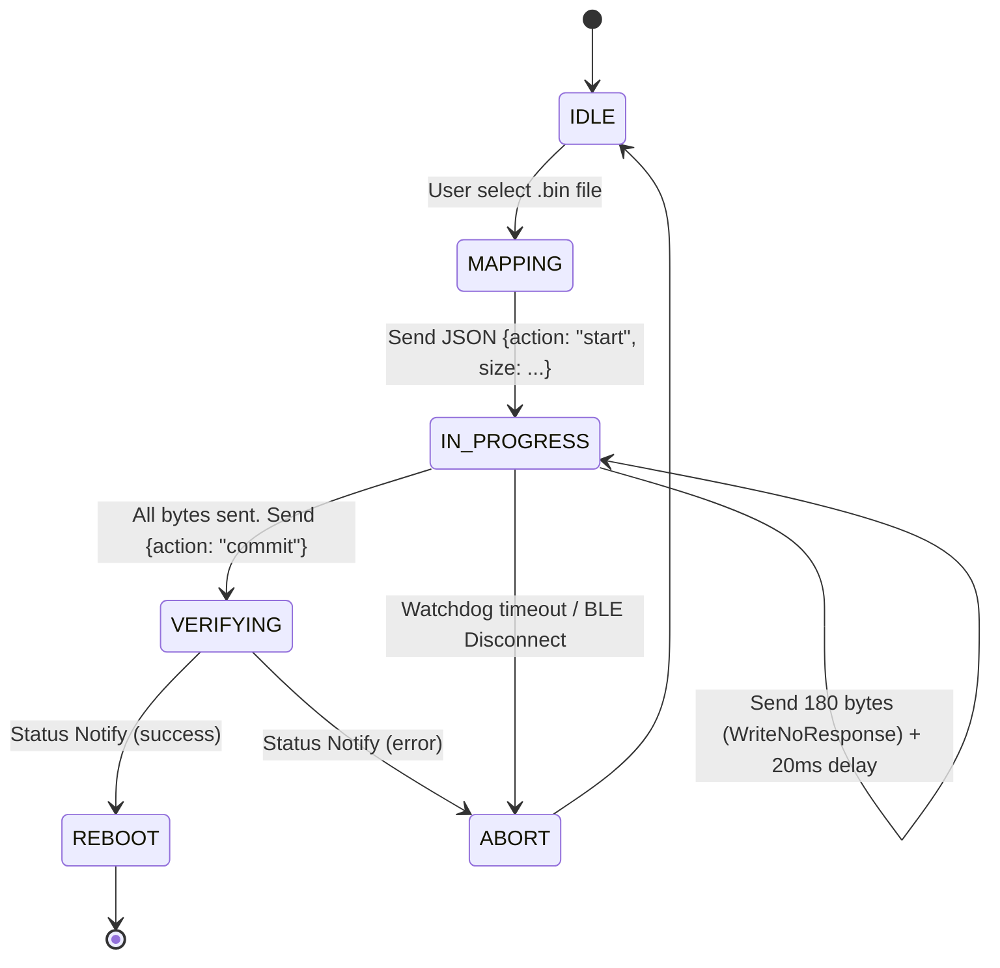

> [!NOTE]
> English translation is currently work-in-progress. Displaying the original Chinese text for now.

# 鍟嗕笟绾?OTA / 鍥轰欢绌轰腑鍗囩骇鏋舵瀯钃濆浘

澶ф枃浠跺拰鍥轰欢鍦ㄤ綆鍔熻€楄摑鐗欙紙BLE锛夐摼璺腑鐨勪紶杈撳線寰€浼撮殢鐫€鏋侀珮鐨勪涪鍖呯巼鍜?MTU 纰庣墖鍖栧嵄鏈恒€係mart BLE 閲囩敤**鍩轰簬涓夐€氶亾闅旂鐨勫懡浠?鏁版嵁寰瀷鐘舵€佹満**杩涜鍥轰欢涓嬪彂锛岀‘淇?Flutter銆乁NI-APP 鍜?Tauri 绛夊绔澶囪兘鍦ㄥ悓涓€濂楀彲闈犳€х瓥鐣ヤ笅瀹屾垚璺ㄥ钩鍙版洿鏂般€?
## 1. 鏍稿績棰戦亾鎷嗗垎 (Topography)

涓洪伩鍏嶉珮閫熷浐浠跺垎鐗囨暟鎹嫢濉炲鑷存帶鍒朵俊鍙峰欢杩燂紝鎴戜滑涓ユ牸鍒囧垎浠ヤ笅涓夋潯鐙珛鐨勭壒寰佹祦锛圕haracteristics锛夛細

| 鍚嶇О | UUID | 灞炴€ф潈闄?| 鐢ㄩ€旇鏄?|
| :--- | :--- | :--- | :--- |
| **Service 涓绘湇鍔?* | `4fafc201-1fb5-459e-8fcc-c5c9c331914d` | - | 鎸傝浇 OTA 鐨勪富鏈嶅姟锛屼笅浣嶆満骞挎挱鏃跺彲鎼哄甫銆?|
| **Control 鎺у埗鍙?* | `beb5483e-36e1-4688-b7f5-ea07361b26c0` | `Write` | 閫氳鍗忚皟绔彛銆傝礋璐ｆ敹鍙戝 `start`, `commit`, `abort` 绛夎交閲忕骇 **JSON-RPC 鎸囦护**銆傚繀椤昏姹傜‖浠剁‘璁?(With Response)銆?|
| **Data 楂橀€熸暟鎹祦** | `beb5483e-36e1-4688-b7f5-ea07361b26c1` | `WriteWithoutResponse` | 鍥轰欢鏂囦欢閫氶亾銆傛墍鏈変簩杩涘埗纰庣墖鍧囬€氳繃姝ら€氶亾鍗曞悜鍊炬郴锛岃拷姹傛瀬闄愪紶杈撻€熺巼銆?|
| **Status 鐘舵€佸洖浼?* | `beb5483e-36e1-4688-b7f5-ea07361b26c2` | `Notify/Indicate` | 纭欢涓嬩綅鏈哄悜 App 鎺ㄩ€侀獙璇佽繘搴︺€佹牎楠岃鍛婃垨瀹夎寮傚父閿欒鐨勫敮涓€閫氶亾銆?|

::: warning
**纭欢绔粷瀵圭浠?*锛氬湪鏁版嵁浼犺緭闃舵锛坄Data` 閫氶亾鐙傞鏃讹級锛屽鏋滅‖浠跺彂鐢熻嚧鍛芥€ч敊璇┖闂翠笉瓒筹紝蹇呴』閫氳繃 `Status` 閫氶亾寮傛鎷夐珮 Notify 杩涜鎶ヨ銆侫pp 鐩戝惉鍒?Alarm 浼氬己琛屽彂鍑?`abort` 闃绘柇涓婁紶娴併€?:::

## 2. 鍔ㄦ€佸垎鍖呬笌 MTU 鎺у埗绛栫暐

BLE 鐨勯粯璁ょ墿鐞?MTU 鍙湁鏋佸皬鐨?23 Bytes锛堝疄闄呰礋杞戒粎绾?20 Bytes锛夈€傛洿鏂颁笂 MB 鐨勫井鎺у埗鍣ㄥ浐浠舵椂锛岃嫢浠?20 瀛楄妭鍒囧壊浼氬鑷村啑闀跨殑鎻℃墜鏃堕棿寮€閿€銆傚洜姝ゆ垜浠埗瀹氫簡涓€濂楁櫘閫傜殑鍒嗗潡闃叉姈鏈哄埗锛?
1. **寮鸿鎻愭潈鍗忓晢 (MTU Negotiation)**: APP 鍦ㄥ惎鍔?OTA 鍓嶅繀椤诲彂鍑烘渶浣?`MTU=247` 鐨勭敵璇枫€?2. **榛勯噾鍒嗗壊闄愬埗 (180 Bytes Chunking)**: 灏界钃濈墮 4.2+ 鏀寔 244 瀛楄妭鐨勬渶澶у噣鑽凤紝浣嗕负浜嗛槻鑼冮儴鍒嗗北瀵ㄧ骇 Android 璁惧鐨勮摑鐗欐爤婧㈠嚭锛屾垜浠皢 **鍗曞寘鍒囩墖鍗″彛鍐欐鍦?180 Bytes**锛岃繖鏄竴濂楃粡鍘嗕簡鐧句竾璁惧楠岃瘉鐨勬姉鏀诲嚮灏哄銆?3. **浼戠湢鑺傛祦闃€ (Chunk Delay)**: 姣忓彂閫?180 瀛楄妭鍚庯紝蹇呴』寮哄埗 Thread Delay 浼戠湢 `20ms`锛岄厤鍚堜笅浣嶆満灏嗕覆鍙ｆ垨 RAM 鏁版嵁鑵炬尓杩?Flash 鍖恒€?
## 3. 鍏ㄩ摼璺姸鎬佹満

> [!NOTE]
> 鍦ㄦ墽琛?`commit` 鍚庯紝涓嬩綅鏈哄簲褰撻獙璇?MD5 鎴栬€呯郴缁熺骇鏍￠獙锛堝彇鍐充簬涓嬩綅鏈?SDK锛夛紝鍦ㄨ繖鏈熼棿鏃犺娑堣€楀嚑绉掗挓锛孉PP 蹇呴』闃诲鎸傝捣锛岀粷瀵逛笉鑳藉己琛屼腑鏂摑鐗欍€傚彧鏈変笅浣嶆満鍙戦€?`status=success` 鍚庯紝鏂瑰彲鍒ゅ畾瀹屽叏绔ｅ伐銆?
