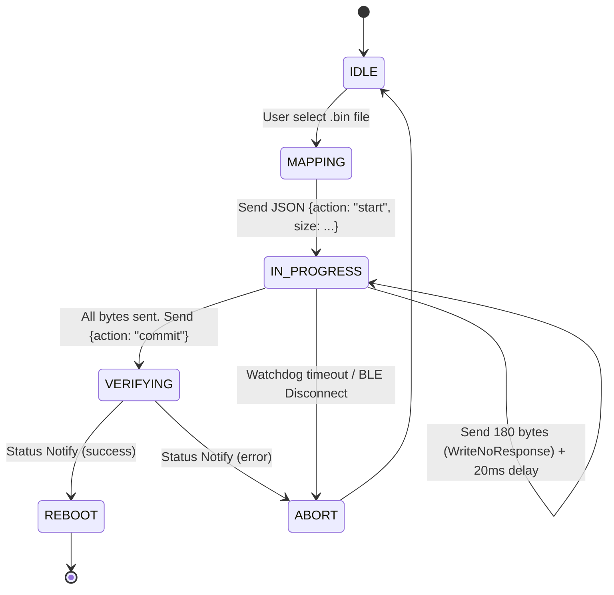

# Commercial OTA & Firmware Distribution Architecture

Large file transfers and firmware overwrites within Bluetooth Low Energy (BLE) environments face massive fragmentation crises and extreme packet drop ratios.

Smart BLE implements a **3-Channel Isolated Command-Data Micro-State Engine** to issue firmwares, ensuring Flutter, UniApp, and Tauri frontends negotiate payloads reliably against embedded ESP32 and Nordic chips.

## 1. Topography Channel Splitting (The Holy Trinity)

To prevent the high-velocity firmware data chunks from congesting control ACKs, we strictly sever the BLE Characteristics into three distinct pipes:

| Name | UUID | Permissions | Purpose Description |
| :--- | :--- | :--- | :--- |
| **Service Root** | `4fafc201-1fb5-459e-8fcc-c5c9c331914d` | - | Primary GATT Service advertised by hardware. |
| **Control (Write)** | `beb5483e-36e1-4688-b7f5-ea07361b26c0` | `Write` | Comms coordinator. Responsible for `start`, `commit`, `abort` JSON-RPC signals. Hardcoded to require ACK from hardware. |
| **Data (High-Speed)** | `beb5483e-36e1-4688-b7f5-ea07361b26c1` | `WriteWithoutResponse` | The bin file hose. Binary chunk fragments are blasted natively down this pipe sequentially without ACK for maximum throughput. |
| **Status (Notify)** | `beb5483e-36e1-4688-b7f5-ea07361b26c2` | `Notify/Indicate` | The singular vector for the hardware to scream back validation progress, signature mismatch, or low-memory fatal alarms. |

::: warning
**Hardware Ban**: During the blazing fast `Data` transmission, if the hardware runs into a fatal memory constraint, it **MUST** asynchronously fire an alert via the `Status` notify channel. App watchdogs will intercept this and abruptly execute an `abort` interrupt.
:::

## 2. Dynamic Chunking & MTU Strict Policies

BLE's baseline Physical MTU limits are historically tiny (roughly 20 Bytes of true payload). Attempting to send MBs of firmware via a 20-byte slice imposes unacceptable handshake latency.

1. **MTU Privilege Escalation**: Frontends MUST request an MTU lift to `247` upon connecting.
2. **The Golden Ratio Chunk (180 Bytes)**: While Bluetooth 4.2+ allows up to 244-byte payloads, we officially lock the chunk gate at **180 Bytes** across all repositories. This exact byte limitation survives low-tier Android Bluetooth Stack buffer overflows.
3. **Throttle Pipeline Constraint**: Post transmission of every `180-Byte` chunk, the Flutter/UniApp logic MUST thread-sleep for `20ms`, allowing the slow hardware RAM enough leeway to shovel bytes down to physical Flash storage without dropping queues.

## 3. End-to-End State Machine Tracking

> [!NOTE]
> Upon receiving the `commit` payload, the ESP32/Nordic hardware should block and internally validate the final binary checksum (MD5). During this internal validation timeframe, apps MUST hang gracefully and await the final `status=success` JSON notification signal before disconnecting GATT safely.
