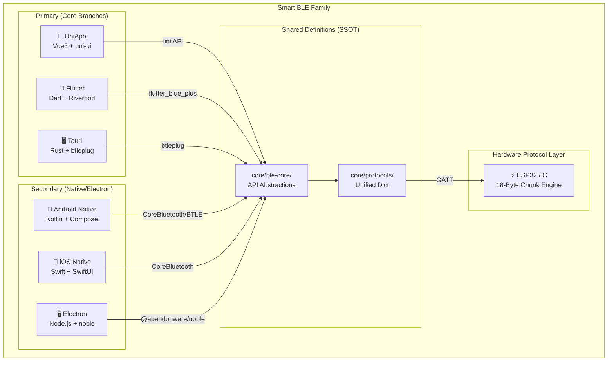
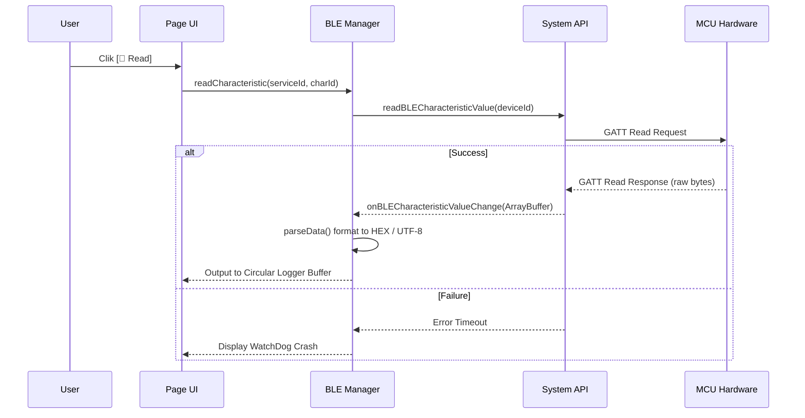

# Smart BLE Global Master Architecture

> Generation Date: 2026-04-14
> Based on the current codebase, standardizing UniApp, Flutter, Android, iOS, Tauri, Electron, and macOS Native.

---

## Table of Contents

1. [Global Ecosystem Architecture](#1-global-ecosystem-architecture)
2. [UI Page State Mapping](#2-ui-page-state-mapping)
3. [Core BLE Topology & Sequence](#3-core-ble-topology)
4. [E2E Business Logic Flow](#4-e2e-business-logic)

---

## 1. Global Ecosystem Architecture

Smart BLE fundamentally solves the cross-platform firmware communication gap by implementing a single overarching unified protocol over different languages.

### 1.1 Product Family Tree

## 2. UI Page State Mapping

The core goal of multiple concurrent Bluetooth connections remains a top priority across all apps:

| Feature | UniApp | Flutter | Android | iOS | Tauri |
|---------|--------|---------|---------|-----|-------|
| **Scan / Device List** | `pages/index/index.vue` | `DeviceListPage` | `DeviceListScreen` | `ScanView` | `deviceListView` |
| **Connected Pool Mgmt** | ✅ Tab 1 Inline | ✅ `ConnectedDevicesPage` | 🚧 ViewModels | ✅ BLEManager Singleton | ✅ Global App State |
| **GATT / Characteristics** | `pages/device/detail.vue` | `DeviceDetailPage` | `DeviceDetailScreen` | `DeviceDetailView` | `deviceDetailView` |
| **BLE Broadcaster** | `pages/broadcast/index.vue` | `BroadcastPage` | `BroadcastScreen` | `BroadcastView` | `broadcastView` |
| **OTA Upgrade Module** | `components/ota-dialog/` | `OtaDialog` (widget) | ❓ TBD | ❌ N/A | ❌ N/A |
| **Diagnostic Logger** | Inline detail | `LogPanel` (widget) | Inline detail | `LogView` | Inline detail |

---

## 3. Core BLE Topology & Sequence

### Device Reconnection & GATT Reading

## 4. E2E Business Logic Flow

Smart BLE ensures that hardware disconnection events, permission failures, and OTA chunk stalls are handled gracefully across all platforms using a strict unified fallback protocol.

*(End of Translation Document - Check the Chinese counterpart `/docs/MASTER_ARCHITECTURE.md` for in-depth code-level implementation details).*
