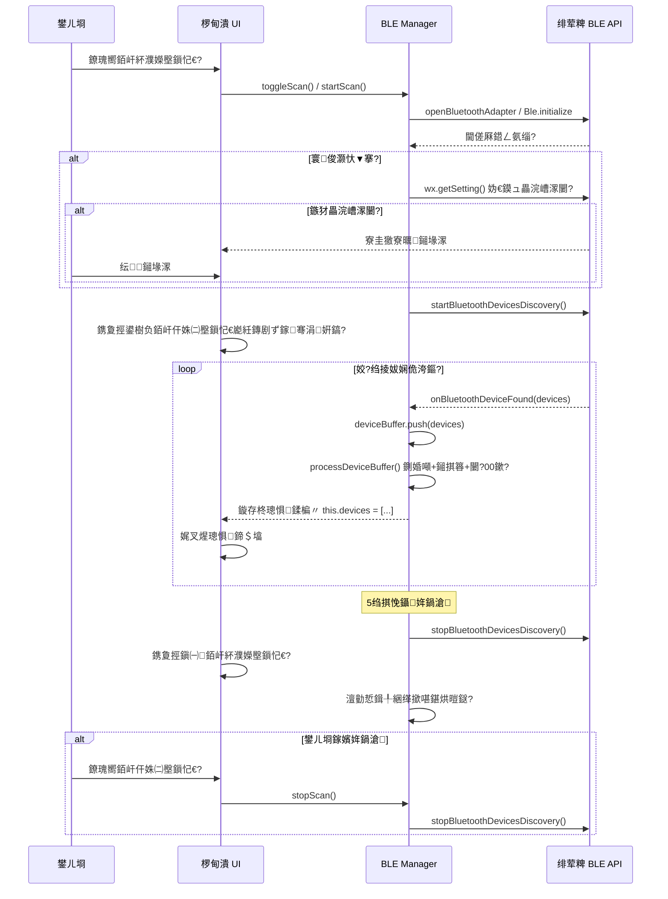
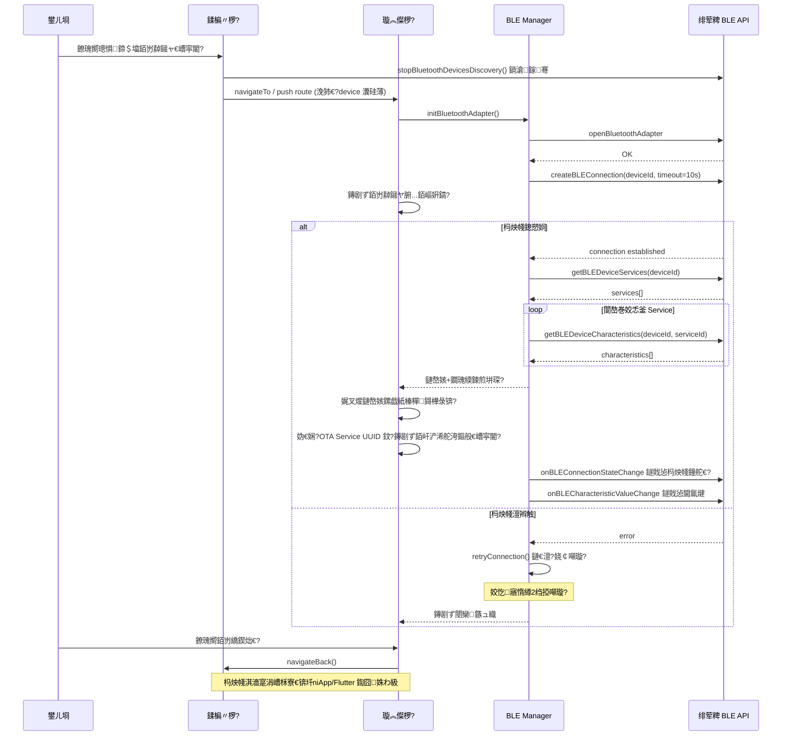
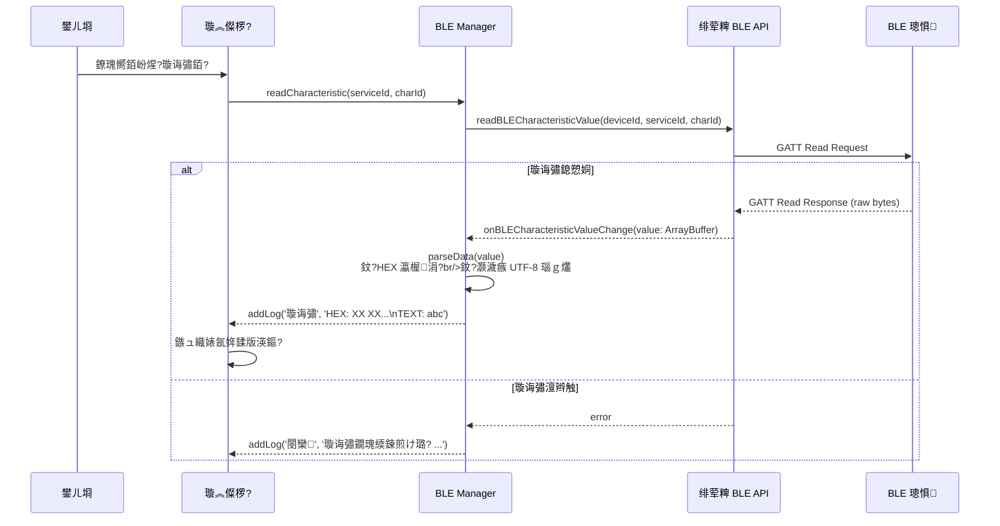
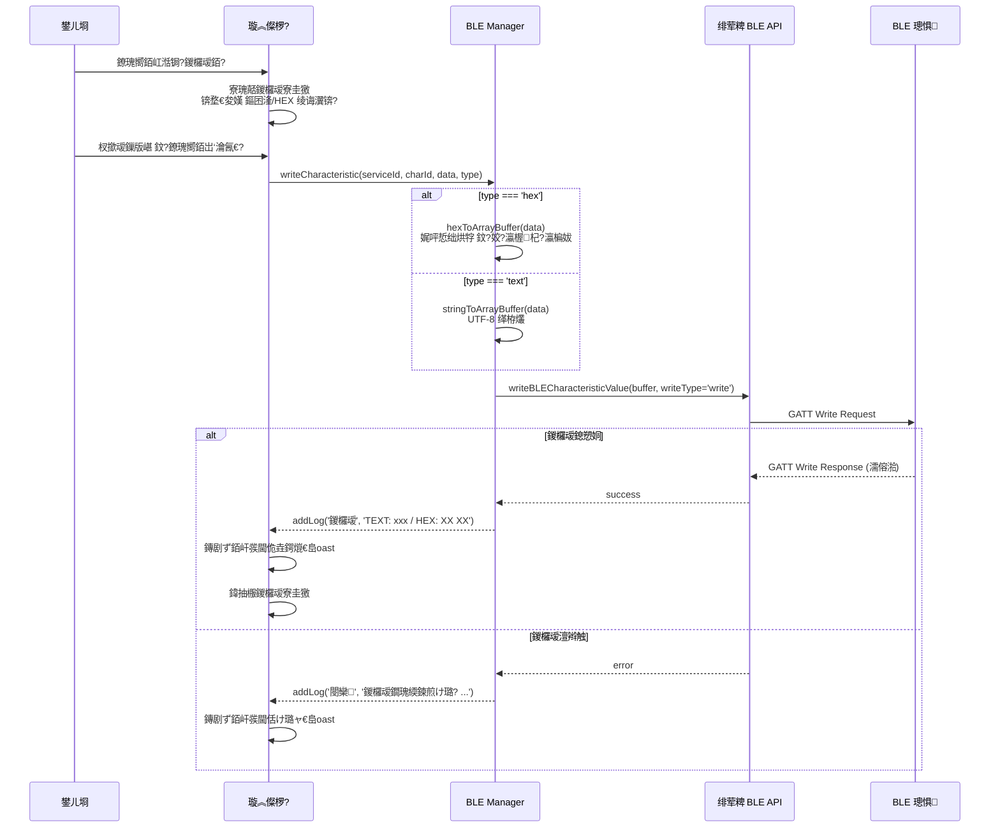
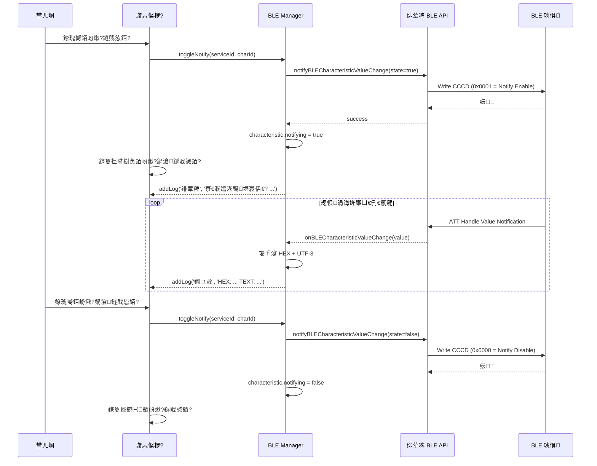
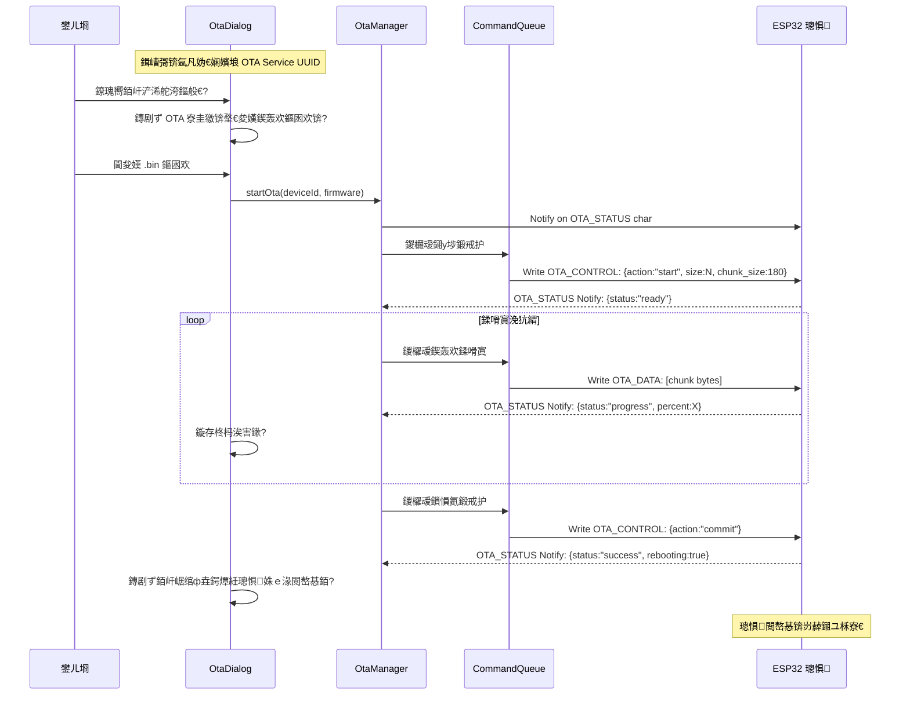
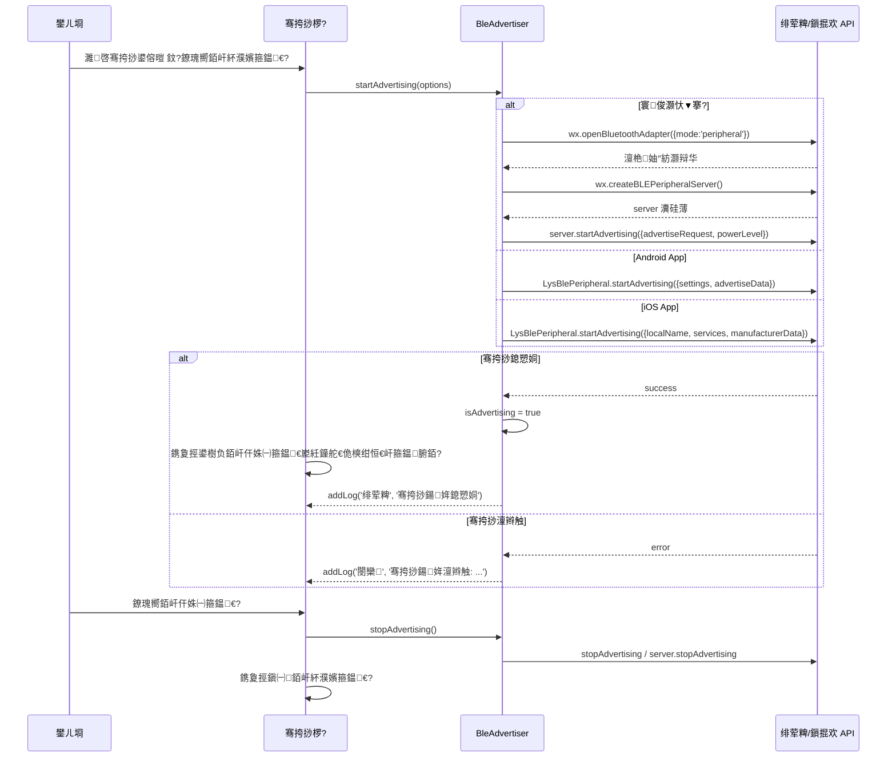
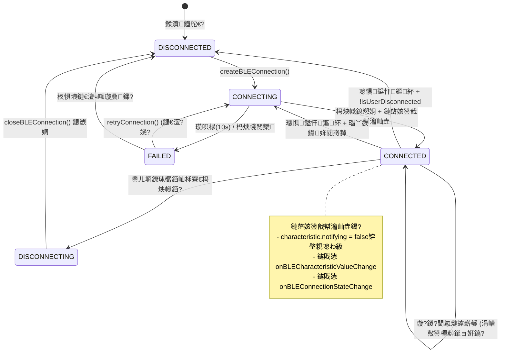
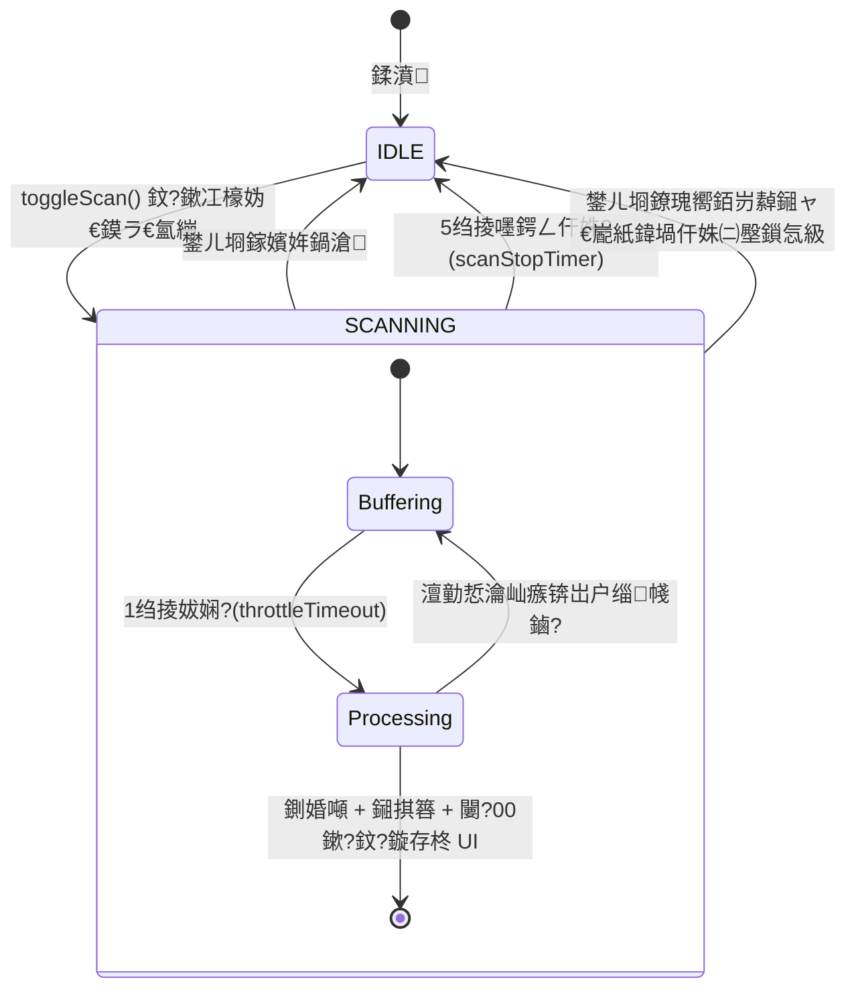
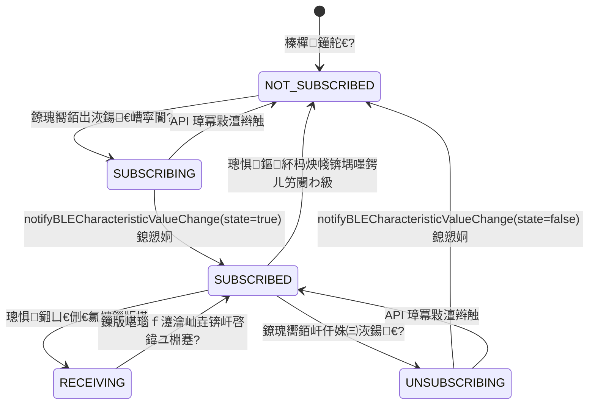

> [!NOTE]
> English translation is currently work-in-progress. Displaying the original Chinese text for now.

# Smart BLE 椤圭洰鍏ㄩ潰姊崇悊鏂囨。

> 鐢熸垚鏃堕棿锛?026-04-11  
> 鍩轰簬浠ｇ爜鐜扮姸鏁寸悊锛岃鐩?UniApp銆丗lutter銆丄ndroid銆乮OS銆乀auri銆丒lectron銆乵acOS Native

---

## 鐩綍

1. [鏁翠綋鏋舵瀯鍥綸(#1-鏁翠綋鏋舵瀯鍥?
2. [椤甸潰缁撴瀯瀵圭収](#2-椤甸潰缁撴瀯瀵圭収)
3. [鍚勫钩鍙伴〉闈氦浜掕崏绋縘(#3-鍚勫钩鍙伴〉闈氦浜掕崏绋?
4. [鏍稿績 BLE 鎿嶄綔鏃跺簭鍥綸(#4-鏍稿績-ble-鎿嶄綔鏃跺簭鍥?
5. [瀹屾暣涓氬姟娴佺▼鍥綸(#5-瀹屾暣涓氬姟娴佺▼鍥?
6. [鐘舵€佹満鍥綸(#6-鐘舵€佹満鍥?
7. [骞冲彴宸紓瀵圭収鐭╅樀](#7-骞冲彴宸紓瀵圭収鐭╅樀)
8. [褰撳墠涓嶄竴鑷撮棶棰樻竻鍗昡(#8-褰撳墠涓嶄竴鑷撮棶棰樻竻鍗?
9. [缁熶竴寤鸿](#9-缁熶竴寤鸿)
10. [涓婚涓庡璇█(i18n)鏋舵瀯璁捐](#10-涓婚涓庡璇█i18n鏋舵瀯璁捐)

---

## 1. 鏁翠綋鏋舵瀯鍥?

### 1.1 浜у搧瀹舵棌鏋舵瀯

```mermaid
graph TB
    subgraph "Smart BLE 浜у搧瀹舵棌"
        subgraph "涓昏鍏ュ彛 (Primary)"
            UA["馃摫 UniApp<br/>Vue3 + uni-ui<br/>灏忕▼搴?H5/App"]
            FL["馃摫 Flutter<br/>Dart + Riverpod<br/>iOS + Android"]
            TR["馃枼锔?Tauri<br/>Rust + btleplug<br/>妗岄潰杞婚噺鐗?]
        end

        subgraph "澧炲己瀵圭収 (Secondary)"
            AN["馃摫 Android Native<br/>Kotlin + Compose"]
            IO["馃摫 iOS Native<br/>Swift + SwiftUI"]
            EL["馃枼锔?Electron<br/>Node.js + noble<br/>妗岄潰瀹屾暣鐗?]
            MC["馃枼锔?macOS Native<br/>Swift + AppKit"]
        end

        subgraph "瀹為獙鎬?(Experimental)"
            AV["馃枼锔?Avalonia<br/>.NET 8 + C#<br/>Windows 鍘熷瀷"]
        end

        subgraph "纭欢灞?(Hardware)"
            ESP["鈿?ESP32<br/>PlatformIO + Arduino<br/>鍥轰欢绀轰緥"]
        end

        subgraph "鏍稿績鍏变韩灞?(Core)"
            BLE["core/ble-core/<br/>BLE 鎶借薄灞?]
            PROTO["core/protocols/<br/>鍗忚瀹氫箟"]
        end
    end

    UA -->|"uni BLE API"| BLE
    FL -->|"flutter_blue_plus"| BLE
    TR -->|"btleplug"| BLE
    AN -->|"CoreBluetooth/BTLE"| BLE
    IO -->|"CoreBluetooth"| BLE
    EL -->|"@abandonware/noble"| BLE
    MC -->|"CoreBluetooth"| BLE
    BLE --> PROTO
    PROTO -->|"GATT 鍗忚浜や簰"| ESP
```

### 1.2 鍗曞钩鍙板唴閮ㄦ灦鏋勶紙浠?Flutter 涓轰緥锛?

```mermaid
graph TB
    subgraph "Flutter 搴旂敤鏋舵瀯"
        subgraph "UI 灞?
            DLP["DeviceListPage<br/>鎵弿/璁惧鍒楄〃"]
            CDP["ConnectedDevicesPage<br/>宸茶繛鎺ヨ澶?]
            DDP["DeviceDetailPage<br/>璁惧璇︽儏/鐗瑰緛鍊兼搷浣?]
            BP["BroadcastPage<br/>BLE 骞挎挱"]
            AP["AboutPage<br/>鍏充簬"]
        end

        subgraph "Widget 灞?
            DC["DeviceCard"]
            FP["FilterPanel"]
            LP["LogPanel"]
            ST["ServiceTile"]
            OD["OtaDialog"]
        end

        subgraph "鏍稿績灞?(Riverpod Providers)"
            BM["BleManager<br/>鎵弿/杩炴帴/璇诲啓/閫氱煡"]
            BPM["BlePeripheralManager<br/>BLE 骞挎挱"]
            CQ["CommandQueue<br/>鍛戒护闃熷垪"]
            OM["OtaManager<br/>OTA 鍗囩骇"]
        end

        subgraph "骞冲彴 BLE 灞?
            FBP["flutter_blue_plus<br/>FlutterBluePlus"]
        end
    end

    DLP --> DC
    DLP --> FP
    DDP --> LP
    DDP --> ST
    DDP --> OD
    DLP --> BM
    CDP --> BM
    DDP --> BM
    DDP --> CQ
    BP --> BPM
    DDP --> OM
    BM --> FBP
    BPM --> FBP
    CQ --> BM
    OM --> CQ
```

### 1.3 UniApp 鍐呴儴鏋舵瀯

```mermaid
graph TB
    subgraph "UniApp 搴旂敤鏋舵瀯"
        subgraph "椤甸潰灞?
            IDX["pages/index/index.vue<br/>鎵弿 + 璁惧鍒楄〃 + Tab鎺у埗"]
            DTL["pages/device/detail.vue<br/>璁惧璇︽儏 + 鐗瑰緛鍊兼搷浣?]
            BRD["pages/broadcast/index.vue<br/>BLE 骞挎挱"]
            ABT["pages/about/index.vue<br/>鍏充簬"]
            VER["pages/about/version.vue<br/>鐗堟湰璁板綍"]
        end

        subgraph "缁勪欢灞?
            OTA["components/ota-dialog/<br/>OTA 鍗囩骇寮圭獥"]
        end

        subgraph "宸ュ叿灞?
            BH["utils/ble-helper.js<br/>骞冲彴妫€娴?骞挎挱宸ュ叿"]
        end

        subgraph "骞冲彴 API"
            UAPI["uni BLE API<br/>缁熶竴璺ㄥ钩鍙版帴鍙?]
            WX["wx.* API<br/>寰俊灏忕▼搴忎笓鐢?]
            NATIVE["LysBlePeripheral<br/>鍘熺敓骞挎挱鎻掍欢"]
        end
    end

    IDX --> OTA
    DTL --> OTA
    BRD --> BH
    BH --> NATIVE
    IDX --> UAPI
    DTL --> UAPI
    BRD --> WX
    BRD --> UAPI
    UAPI -->|"#ifdef MP-WEIXIN"| WX
```

---

## 2. 椤甸潰缁撴瀯瀵圭収

### 2.1 鍚勫钩鍙伴〉闈?瑙嗗浘瀵圭収琛?

> **娉?*锛氥€屽凡杩炴帴璁惧绠＄悊銆嶆槸**澶氳澶囧苟鍙戣繛鎺ョ殑鏍稿績鍔熻兘鐩爣**锛屼笉鏄?Flutter 涓撳睘銆傚悇骞冲彴搴曞眰 BLE 鏍堝潎鏀寔锛屽樊寮傚湪浜?UI 鍜岀姸鎬佷腑蹇冩槸鍚﹀凡瀹炵幇銆?

| 鍔熻兘妯″潡 | UniApp | Flutter | Android | iOS | Tauri | Electron |
|---------|--------|---------|---------|-----|-------|----------|
| **鎵弿/璁惧鍒楄〃** | `pages/index/index.vue` | `DeviceListPage` | `DeviceListScreen` | `ScanView` | `deviceListView` | `deviceList` section |
| **宸茶繛鎺ヨ澶囩鐞?* | 鉁?鍐呭祵浜?index (Tab 1)| 鉁?`ConnectedDevicesPage` | 馃毀 寰呭疄鐜帮紙ViewModel Map锛墊 鉁?宸插疄鐜帮紙`BLEManager` 鍗曚緥锛墊 鉁?宸插疄鐜帮紙鍏ㄥ眬鐘舵€侊級| 鉁?宸插疄鐜帮紙鍏ㄥ眬 Map锛墊
| **璁惧璇︽儏/鐗瑰緛鍊?* | `pages/device/detail.vue` | `DeviceDetailPage` | `DeviceDetailScreen` | `DeviceDetailView` | `deviceDetailView` | `deviceDetail` section |
| **BLE 骞挎挱** | `pages/broadcast/index.vue` | `BroadcastPage` | `BroadcastScreen` | `BroadcastView` | `broadcastView` | `broadcast` section |
| **鍏充簬** | `pages/about/index.vue` | `AboutPage` | `AboutScreen` | 鉂?鏈‘璁?| `aboutView` | `about` section |
| **鐗堟湰璁板綍** | `pages/about/version.vue` | 鉂?鏃?| 鉂?鏃?| 鉂?鏃?| 鉂?鏃?| 鉂?鏃?|
| **OTA 鍗囩骇** | `components/ota-dialog/` | `OtaDialog` (widget) | 鉂?鏈‘璁?| 鉂?鏃?| 鉂?鏃?| 鉂?鏃?|
| **鏃ュ織闈㈡澘** | 鍐呰仈浜?detail 椤?| `LogPanel` (widget) | 鍐呰仈浜?detail | `LogView` (鐙珛) | 鍐呰仈浜?detail | 鍐呰仈浜?detail |

### 2.2 瀵艰埅妯″紡瀵圭収

| 骞冲彴 | 瀵艰埅妯″紡 | 璇存槑 |
|------|---------|------|
| UniApp | **澶氶〉璺敱** + Tab nav | `uni.navigateTo()` 璺宠浆锛宨ndex 浣滀负涓诲叆鍙?|
| Flutter | **搴曢儴 Tab** + Push route | `BottomNavigationBar` (4 Tab) + `Navigator.push` 杩涘叆璇︽儏 |
| Android | **NavController** 澶氬睆 | Compose Navigation |
| iOS | **NavigationLink** 澶氳鍥?| SwiftUI Navigation |
| Tauri | **鍗曢〉 Tab 鍒囨崲** | SPA锛屽垏鎹㈣鍥?div 鏄鹃殣 |
| Electron | **鍗曢〉瑙嗗浘鍒囨崲** | SPA锛孞S 鎺у埗 section 鏄鹃殣 |
| macOS Native | **Split View** | 渚ц竟鏍?+ 鍐呭鍖?|

**鍏抽敭璇存槑**锛歎niApp 鏈夈€岀増鏈褰曘€嶅瓙椤碉紝鍏朵粬骞冲彴娌℃湁銆傘€屽凡杩炴帴璁惧銆峊ab 鏄璁惧绠＄悊鍔熻兘鐨?UI 鍏ュ彛锛孎lutter 宸插疄鐜帮紝鍏朵粬骞冲彴涓哄緟璺熻繘椤圭洰銆?

---

## 3. 鍚勫钩鍙伴〉闈氦浜掕崏绋?

### 3.1 鎵弿椤碉紙棣栭〉/璁惧鍒楄〃椤碉級

#### 3.1.1 椤甸潰鍐呭瑙勮寖锛堢洰鏍囩粺涓€鎬侊級

```
鈹屸攢鈹€鈹€鈹€鈹€鈹€鈹€鈹€鈹€鈹€鈹€鈹€鈹€鈹€鈹€鈹€鈹€鈹€鈹€鈹€鈹€鈹€鈹€鈹€鈹€鈹€鈹€鈹€鈹€鈹€鈹€鈹€鈹€鈹€鈹€鈹€鈹€鈹€鈹€鈹€鈹€鈹?
鈹? 鈫?BLE Toolkit+              [钃濈墮鐘舵€乚 鈹? 瀵艰埅鏍?
鈹溾攢鈹€鈹€鈹€鈹€鈹€鈹€鈹€鈹€鈹€鈹€鈹€鈹€鈹€鈹€鈹€鈹€鈹€鈹€鈹€鈹€鈹€鈹€鈹€鈹€鈹€鈹€鈹€鈹€鈹€鈹€鈹€鈹€鈹€鈹€鈹€鈹€鈹€鈹€鈹€鈹€鈹?
鈹? 鈻?杩囨护璁剧疆                             鈹? 鍙姌鍙犻潰鏉匡紙榛樿鎶樺彔锛?
鈹?   淇″彿寮哄害: [鈹佲攣鈹佲攣鈹佲攣鈹佲攣鈹佲攣] -70 dBm       鈹?
鈹?   棰勮: [-100] [-80] [-60] [-40]       鈹?
鈹?   鍚嶇О鍓嶇紑: [___________________]      鈹?
鈹?   鈻?闅愯棌鏃犲悕绉拌澶?     [閲嶇疆]         鈹?
鈹溾攢鈹€鈹€鈹€鈹€鈹€鈹€鈹€鈹€鈹€鈹€鈹€鈹€鈹€鈹€鈹€鈹€鈹€鈹€鈹€鈹€鈹€鈹€鈹€鈹€鈹€鈹€鈹€鈹€鈹€鈹€鈹€鈹€鈹€鈹€鈹€鈹€鈹€鈹€鈹€鈹€鈹?
鈹? [馃攳 寮€濮嬫壂鎻廬   鍙戠幇 12 鍙?/ 鍏?30 鍙? 鈹? 鎿嶄綔琛?
鈹溾攢鈹€鈹€鈹€鈹€鈹€鈹€鈹€鈹€鈹€鈹€鈹€鈹€鈹€鈹€鈹€鈹€鈹€鈹€鈹€鈹€鈹€鈹€鈹€鈹€鈹€鈹€鈹€鈹€鈹€鈹€鈹€鈹€鈹€鈹€鈹€鈹€鈹€鈹€鈹€鈹€鈹?
鈹? 鈹屸攢鈹€鈹€鈹€鈹€鈹€鈹€鈹€鈹€鈹€鈹€鈹€鈹€鈹€鈹€鈹€鈹€鈹€鈹€鈹€鈹€鈹€鈹€鈹€鈹€鈹€鈹€鈹€鈹€鈹€鈹€鈹€鈹€鈹€鈹€鈹€鈹€鈹愨攤
鈹? 鈹?馃摱 ESP32-BLE        [BLE]    [杩炴帴] 鈹傗攤  璁惧鍗＄墖
鈹? 鈹?   ...E7:88        鈻傗杻鈻呪枃  -65 dBm  鈹傗攤
鈹? 鈹斺攢鈹€鈹€鈹€鈹€鈹€鈹€鈹€鈹€鈹€鈹€鈹€鈹€鈹€鈹€鈹€鈹€鈹€鈹€鈹€鈹€鈹€鈹€鈹€鈹€鈹€鈹€鈹€鈹€鈹€鈹€鈹€鈹€鈹€鈹€鈹€鈹€鈹樷攤
鈹? 鈹屸攢鈹€鈹€鈹€鈹€鈹€鈹€鈹€鈹€鈹€鈹€鈹€鈹€鈹€鈹€鈹€鈹€鈹€鈹€鈹€鈹€鈹€鈹€鈹€鈹€鈹€鈹€鈹€鈹€鈹€鈹€鈹€鈹€鈹€鈹€鈹€鈹€鈹愨攤
鈹? 鈹?馃摱 nRF52              [BLE]  [宸茶繛鎺鈹傗攤  宸茶繛鎺ョ姸鎬侊紙鐏拌壊绂佺敤锛?
鈹? 鈹?   ...AA:BB        鈻傗杻鈻?  -72 dBm  鈹傗攤
鈹? 鈹斺攢鈹€鈹€鈹€鈹€鈹€鈹€鈹€鈹€鈹€鈹€鈹€鈹€鈹€鈹€鈹€鈹€鈹€鈹€鈹€鈹€鈹€鈹€鈹€鈹€鈹€鈹€鈹€鈹€鈹€鈹€鈹€鈹€鈹€鈹€鈹€鈹€鈹樷攤
鈹? 鈹屸攢鈹€鈹€鈹€鈹€鈹€鈹€鈹€鈹€鈹€鈹€鈹€鈹€鈹€鈹€鈹€鈹€鈹€鈹€鈹€鈹€鈹€鈹€鈹€鈹€鈹€鈹€鈹€鈹€鈹€鈹€鈹€鈹€鈹€鈹€鈹€鈹€鈹愨攤
鈹? 鈹?馃摱 鏈煡璁惧                   [杩炴帴] 鈹傗攤
鈹? 鈹?   ...CC:DD        鈻?    -88 dBm  鈹傗攤
鈹? 鈹斺攢鈹€鈹€鈹€鈹€鈹€鈹€鈹€鈹€鈹€鈹€鈹€鈹€鈹€鈹€鈹€鈹€鈹€鈹€鈹€鈹€鈹€鈹€鈹€鈹€鈹€鈹€鈹€鈹€鈹€鈹€鈹€鈹€鈹€鈹€鈹€鈹€鈹樷攤
鈹斺攢鈹€鈹€鈹€鈹€鈹€鈹€鈹€鈹€鈹€鈹€鈹€鈹€鈹€鈹€鈹€鈹€鈹€鈹€鈹€鈹€鈹€鈹€鈹€鈹€鈹€鈹€鈹€鈹€鈹€鈹€鈹€鈹€鈹€鈹€鈹€鈹€鈹€鈹€鈹€鈹€鈹?

鐐瑰嚮璁惧鍗＄墖锛堥潪杩炴帴鎸夐挳锛夆啋 寮瑰嚭骞挎挱淇℃伅寮圭獥锛?
鈹屸攢鈹€鈹€鈹€鈹€鈹€鈹€鈹€鈹€鈹€鈹€鈹€鈹€鈹€鈹€鈹€鈹€鈹€鈹€鈹€鈹€鈹€鈹€鈹€鈹€鈹€鈹€鈹€鈹€鈹€鈹€鈹€鈹€鈹€鈹€鈹€鈹€鈹€鈹€鈹€鈹€鈹?
鈹? 骞挎挱淇℃伅                            [脳] 鈹?
鈹溾攢鈹€鈹€鈹€鈹€鈹€鈹€鈹€鈹€鈹€鈹€鈹€鈹€鈹€鈹€鈹€鈹€鈹€鈹€鈹€鈹€鈹€鈹€鈹€鈹€鈹€鈹€鈹€鈹€鈹€鈹€鈹€鈹€鈹€鈹€鈹€鈹€鈹€鈹€鈹€鈹€鈹?
鈹? 璁惧ID:  AA:BB:CC:DD:EE:FF             鈹?
鈹? 鍚嶇О:    ESP32-BLE                     鈹?
鈹? RSSI:   -65 dBm                        鈹?
鈹?                                        鈹?
鈹? 骞挎挱鏈嶅姟 UUIDs:                         鈹?
鈹? FFE0                                   鈹?
鈹? 180A                                   鈹?
鈹?                                        鈹?
鈹? 骞挎挱鏁版嵁 (Hex):                         鈹?
鈹? 0201060A00...                          鈹?
鈹溾攢鈹€鈹€鈹€鈹€鈹€鈹€鈹€鈹€鈹€鈹€鈹€鈹€鈹€鈹€鈹€鈹€鈹€鈹€鈹€鈹€鈹€鈹€鈹€鈹€鈹€鈹€鈹€鈹€鈹€鈹€鈹€鈹€鈹€鈹€鈹€鈹€鈹€鈹€鈹€鈹€鈹?
鈹?      [澶嶅埗鍏ㄩ儴]    [鍏抽棴]              鈹?
鈹斺攢鈹€鈹€鈹€鈹€鈹€鈹€鈹€鈹€鈹€鈹€鈹€鈹€鈹€鈹€鈹€鈹€鈹€鈹€鈹€鈹€鈹€鈹€鈹€鈹€鈹€鈹€鈹€鈹€鈹€鈹€鈹€鈹€鈹€鈹€鈹€鈹€鈹€鈹€鈹€鈹€鈹?
```

#### 3.1.2 鍚勫钩鍙板綋鍓嶇姸鎬?

| 鍏冪礌 | UniApp | Flutter | Android | iOS | Tauri |
|------|--------|---------|---------|-----|-------|
| 杩囨护闈㈡澘鎶樺彔 | 鉁?| 鉁?| 鉁?| 鉁?| 鉁?|
| RSSI 婊戝潡 | 鉁?| 鉁?| 鉁?| 鉁?| 鉁?|
| 棰勮鎸夐挳 | 鉂?鏃?| 鉁?| 鉁?| 鉁?| 鉁?|
| 鍚嶇О鍓嶇紑杩囨护 | 鉁?| 鉁?| 鉁?| 鉁?| 鉁?|
| 闅愯棌鏃犲悕绉?| 鉁?| 鉁?| 鉁?| 鉁?| 鉁?|
| 閲嶇疆鎸夐挳 | 鉂?鏃?| 鉁?| 鉁?| 鉁?| 鉁?|
| 钃濈墮鐘舵€佹寚绀?| 鉁?| 鉁?| 鉁?| 鉁?| 鈿狅笍 |
| 骞挎挱淇℃伅寮圭獥 | 鉁?鑷畾涔?| 鉁?| 鉁?| 鉁?| 鉁?|
| 澶嶅埗骞挎挱鏁版嵁 | 鉁?| 鉁?| 鉁?| 鉁?| 鉁?|

### 3.2 璁惧璇︽儏椤?

#### 3.2.1 椤甸潰鍐呭瑙勮寖锛堢洰鏍囩粺涓€鎬侊級

```
鈹屸攢鈹€鈹€鈹€鈹€鈹€鈹€鈹€鈹€鈹€鈹€鈹€鈹€鈹€鈹€鈹€鈹€鈹€鈹€鈹€鈹€鈹€鈹€鈹€鈹€鈹€鈹€鈹€鈹€鈹€鈹€鈹€鈹€鈹€鈹€鈹€鈹€鈹€鈹€鈹€鈹€鈹?
鈹? 鈫?璁惧璇︽儏                             鈹? 瀵艰埅鏍?
鈹溾攢鈹€鈹€鈹€鈹€鈹€鈹€鈹€鈹€鈹€鈹€鈹€鈹€鈹€鈹€鈹€鈹€鈹€鈹€鈹€鈹€鈹€鈹€鈹€鈹€鈹€鈹€鈹€鈹€鈹€鈹€鈹€鈹€鈹€鈹€鈹€鈹€鈹€鈹€鈹€鈹€鈹?
鈹? 鈹屸攢鈹€鈹€鈹€鈹€鈹€鈹€鈹€鈹€鈹€鈹€鈹€鈹€鈹€鈹€鈹€鈹€鈹€鈹€鈹€鈹€鈹€鈹€鈹€鈹€鈹€鈹€鈹€鈹€鈹€鈹€鈹€鈹€鈹€鈹€鈹€鈹€鈹愨攤
鈹? 鈹?ESP32-BLE  鈼?宸茶繛鎺?                鈹傗攤  璁惧淇℃伅闈㈡澘
鈹? 鈹?ID: AA:BB:CC:DD:EE:FF               鈹傗攤
鈹? 鈹?[娓呯┖鏃ュ織] [瀵煎嚭鏃ュ織] [鏂紑/杩炴帴]    鈹傗攤
鈹? 鈹斺攢鈹€鈹€鈹€鈹€鈹€鈹€鈹€鈹€鈹€鈹€鈹€鈹€鈹€鈹€鈹€鈹€鈹€鈹€鈹€鈹€鈹€鈹€鈹€鈹€鈹€鈹€鈹€鈹€鈹€鈹€鈹€鈹€鈹€鈹€鈹€鈹€鈹樷攤
鈹溾攢鈹€鈹€鈹€鈹€鈹€鈹€鈹€鈹€鈹€鈹€鈹€鈹€鈹€鈹€鈹€鈹€鈹€鈹€鈹€鈹€鈹€鈹€鈹€鈹€鈹€鈹€鈹€鈹€鈹€鈹€鈹€鈹€鈹€鈹€鈹€鈹€鈹€鈹€鈹€鈹€鈹?
鈹? 鏈嶅姟鍒楄〃         [灞曞紑鍏ㄩ儴 / 鏀惰捣鍏ㄩ儴]  鈹?
鈹? 鈹屸攢鈹€鈹€鈹€鈹€鈹€鈹€鈹€鈹€鈹€鈹€鈹€鈹€鈹€鈹€鈹€鈹€鈹€鈹€鈹€鈹€鈹€鈹€鈹€鈹€鈹€鈹€鈹€鈹€鈹€鈹€鈹€鈹€鈹€鈹€鈹€鈹€鈹愨攤
鈹? 鈹傗柖 鏈嶅姟 1: FFE0锛堣嚜瀹氫箟鏈嶅姟锛?        鈹傗攤  鎶樺彔鐘舵€?
鈹? 鈹斺攢鈹€鈹€鈹€鈹€鈹€鈹€鈹€鈹€鈹€鈹€鈹€鈹€鈹€鈹€鈹€鈹€鈹€鈹€鈹€鈹€鈹€鈹€鈹€鈹€鈹€鈹€鈹€鈹€鈹€鈹€鈹€鈹€鈹€鈹€鈹€鈹€鈹樷攤
鈹? 鈹屸攢鈹€鈹€鈹€鈹€鈹€鈹€鈹€鈹€鈹€鈹€鈹€鈹€鈹€鈹€鈹€鈹€鈹€鈹€鈹€鈹€鈹€鈹€鈹€鈹€鈹€鈹€鈹€鈹€鈹€鈹€鈹€鈹€鈹€鈹€鈹€鈹€鈹愨攤
鈹? 鈹傗柤 鏈嶅姟 2: 璁惧淇℃伅 (180A)            鈹傗攤  灞曞紑鐘舵€?
鈹? 鈹? 鈹屸攢鈹€鈹€鈹€鈹€鈹€鈹€鈹€鈹€鈹€鈹€鈹€鈹€鈹€鈹€鈹€鈹€鈹€鈹€鈹€鈹€鈹€鈹€鈹€鈹€鈹€鈹€鈹€鈹€鈹€鈹€鈹? 鈹傗攤
鈹? 鈹? 鈹?鍒堕€犲晢鍚嶇О (2A29)             鈹? 鈹傗攤  鐗瑰緛鍊?
鈹? 鈹? 鈹?灞炴€? [Read]                  鈹? 鈹傗攤
鈹? 鈹? 鈹?[馃摉 璇诲彇]                     鈹? 鈹傗攤
鈹? 鈹? 鈹溾攢鈹€鈹€鈹€鈹€鈹€鈹€鈹€鈹€鈹€鈹€鈹€鈹€鈹€鈹€鈹€鈹€鈹€鈹€鈹€鈹€鈹€鈹€鈹€鈹€鈹€鈹€鈹€鈹€鈹€鈹€鈹? 鈹傗攤
鈹? 鈹? 鈹?鍨嬪彿 (2A24)                   鈹? 鈹傗攤
鈹? 鈹? 鈹?灞炴€? [Read] [Write] [Notify] 鈹? 鈹傗攤
鈹? 鈹? 鈹?[馃摉璇诲彇] [鉁忥笍鍐欏叆] [馃敂鐩戝惉]    鈹? 鈹傗攤
鈹? 鈹? 鈹斺攢鈹€鈹€鈹€鈹€鈹€鈹€鈹€鈹€鈹€鈹€鈹€鈹€鈹€鈹€鈹€鈹€鈹€鈹€鈹€鈹€鈹€鈹€鈹€鈹€鈹€鈹€鈹€鈹€鈹€鈹€鈹? 鈹傗攤
鈹? 鈹斺攢鈹€鈹€鈹€鈹€鈹€鈹€鈹€鈹€鈹€鈹€鈹€鈹€鈹€鈹€鈹€鈹€鈹€鈹€鈹€鈹€鈹€鈹€鈹€鈹€鈹€鈹€鈹€鈹€鈹€鈹€鈹€鈹€鈹€鈹€鈹€鈹€鈹樷攤
鈹? [鍥轰欢鏇存柊 OTA]  <- 浠呮娴嬪埌OTA鏈嶅姟鏃舵樉绀衡攤
鈹溾攢鈹€鈹€鈹€鈹€鈹€鈹€鈹€鈹€鈹€鈹€鈹€鈹€鈹€鈹€鈹€鈹€鈹€鈹€鈹€鈹€鈹€鈹€鈹€鈹€鈹€鈹€鈹€鈹€鈹€鈹€鈹€鈹€鈹€鈹€鈹€鈹€鈹€鈹€鈹€鈹€鈹? 鍥哄畾搴曢儴鏃ュ織
鈹? 閫氫俊鏃ュ織                               鈹?
鈹? 鈹屸攢鈹€鈹€鈹€鈹€鈹€鈹€鈹€鈹€鈹€鈹€鈹€鈹€鈹€鈹€鈹€鈹€鈹€鈹€鈹€鈹€鈹€鈹€鈹€鈹€鈹€鈹€鈹€鈹€鈹€鈹€鈹€鈹€鈹€鈹€鈹€鈹€鈹愨攤
鈹? 鈹?14:23:15 [绯荤粺] 鍒濆鍖栬摑鐗欓€傞厤鍣?  鈹傗攤
鈹? 鈹?14:23:16 [绯荤粺] 璁惧杩炴帴鎴愬姛       鈹傗攤
鈹? 鈹?14:23:17 [璇诲彇] 寮€濮嬭鍙? 2A29     鈹傗攤
鈹? 鈹?14:23:18 [鎺ユ敹] HEX: 4C 59 53...  鈹傗攤
鈹? 鈹?         TEXT: LYS...              鈹傗攤
鈹? 鈹斺攢鈹€鈹€鈹€鈹€鈹€鈹€鈹€鈹€鈹€鈹€鈹€鈹€鈹€鈹€鈹€鈹€鈹€鈹€鈹€鈹€鈹€鈹€鈹€鈹€鈹€鈹€鈹€鈹€鈹€鈹€鈹€鈹€鈹€鈹€鈹€鈹€鈹樷攤
鈹斺攢鈹€鈹€鈹€鈹€鈹€鈹€鈹€鈹€鈹€鈹€鈹€鈹€鈹€鈹€鈹€鈹€鈹€鈹€鈹€鈹€鈹€鈹€鈹€鈹€鈹€鈹€鈹€鈹€鈹€鈹€鈹€鈹€鈹€鈹€鈹€鈹€鈹€鈹€鈹€鈹€鈹?

鍐欏叆寮圭獥锛?
鈹屸攢鈹€鈹€鈹€鈹€鈹€鈹€鈹€鈹€鈹€鈹€鈹€鈹€鈹€鈹€鈹€鈹€鈹€鈹€鈹€鈹€鈹€鈹€鈹€鈹€鈹€鈹€鈹€鈹€鈹€鈹€鈹€鈹€鈹€鈹€鈹€鈹€鈹€鈹€鈹€鈹€鈹?
鈹? 鍐欏叆鏁版嵁                           [脳] 鈹?
鈹溾攢鈹€鈹€鈹€鈹€鈹€鈹€鈹€鈹€鈹€鈹€鈹€鈹€鈹€鈹€鈹€鈹€鈹€鈹€鈹€鈹€鈹€鈹€鈹€鈹€鈹€鈹€鈹€鈹€鈹€鈹€鈹€鈹€鈹€鈹€鈹€鈹€鈹€鈹€鈹€鈹€鈹?
鈹? 鏁版嵁绫诲瀷: 鈼?鏂囨湰  鈼?HEX               鈹?
鈹? 鏁版嵁鍐呭: [________________________]   鈹?
鈹? 鎻愮ず: 鏂囨湰鈫扷TF-8缂栫爜; HEX鈫掑 FF 01    鈹?
鈹溾攢鈹€鈹€鈹€鈹€鈹€鈹€鈹€鈹€鈹€鈹€鈹€鈹€鈹€鈹€鈹€鈹€鈹€鈹€鈹€鈹€鈹€鈹€鈹€鈹€鈹€鈹€鈹€鈹€鈹€鈹€鈹€鈹€鈹€鈹€鈹€鈹€鈹€鈹€鈹€鈹€鈹?
鈹?      [鍙栨秷]            [纭畾鍙戦€乚      鈹?
鈹斺攢鈹€鈹€鈹€鈹€鈹€鈹€鈹€鈹€鈹€鈹€鈹€鈹€鈹€鈹€鈹€鈹€鈹€鈹€鈹€鈹€鈹€鈹€鈹€鈹€鈹€鈹€鈹€鈹€鈹€鈹€鈹€鈹€鈹€鈹€鈹€鈹€鈹€鈹€鈹€鈹€鈹?
```

#### 3.2.2 鍚勫钩鍙板綋鍓嶇姸鎬?

| 鍏冪礌 | UniApp | Flutter | Android | iOS | Tauri |
|------|--------|---------|---------|-----|-------|
| 璁惧鍚?+ 杩炴帴鐘舵€?| 鉁?| 鉁?| 鉁?| 鉁?| 鉁?|
| 鎿嶄綔鎸夐挳琛?| 鉁?[娓呯┖][瀵煎嚭][杩炴帴] | 鉁?| 鉁?| 鈿狅笍 | 鉁?|
| 鏈嶅姟鍒楄〃鎶樺彔 | 鉁?| 鉁?| 鉁?| 鉁?| 鉁?|
| 灞曞紑/鏀惰捣鍏ㄩ儴 | 鉁?| 鉁?| 鉁?| 鈿狅笍 | 鉁?|
| 鐗瑰緛鍊煎睘鎬ф爣绛?| 鉁?| 鉁?| 鉁?| 鈿狅笍 | 鉁?|
| 璇诲彇鎸夐挳 | 鉁?| 鉁?| 鉁?| 鉁?| 鉁?|
| 鍐欏叆寮圭獥锛堟枃鏈?HEX鍒囨崲锛墊 鉁?| 鉁?| 鉁?| 鉁?| 鉁?|
| 鐩戝惉鎸夐挳锛堢姸鎬佸垏鎹級| 鉁?| 鉁?| 鉁?| 鉁?| 鉁?|
| 鏃ュ織闈㈡澘锛堝簳閮ㄥ浐瀹氾級| 鉁?| 鉁?| 鉁?| 鈿狅笍 鐙珛椤?| 鉁?|
| 鏃ュ織瀵煎嚭/澶嶅埗 | 鉁?澶嶅埗 | 鉁?鏂囦欢瀵煎嚭 | 鈿狅笍 | 鉁?| 鉁?|
| OTA 鍗囩骇鍏ュ彛 | 鉁?鎸夐渶鏄剧ず | 鉁?dialog | 鉂?| 鉂?| 鉂?|
| 鑷姩閲嶈繛锛?娆★級| 鉁?| 鉁?| 鉁?| 鉁?| 鉁?|

### 3.3 BLE 骞挎挱椤?

#### 3.3.1 椤甸潰鍐呭瑙勮寖

```
鈹屸攢鈹€鈹€鈹€鈹€鈹€鈹€鈹€鈹€鈹€鈹€鈹€鈹€鈹€鈹€鈹€鈹€鈹€鈹€鈹€鈹€鈹€鈹€鈹€鈹€鈹€鈹€鈹€鈹€鈹€鈹€鈹€鈹€鈹€鈹€鈹€鈹€鈹€鈹€鈹€鈹€鈹?
鈹? 鈫?BLE 骞挎挱                             鈹? 瀵艰埅鏍?
鈹溾攢鈹€鈹€鈹€鈹€鈹€鈹€鈹€鈹€鈹€鈹€鈹€鈹€鈹€鈹€鈹€鈹€鈹€鈹€鈹€鈹€鈹€鈹€鈹€鈹€鈹€鈹€鈹€鈹€鈹€鈹€鈹€鈹€鈹€鈹€鈹€鈹€鈹€鈹€鈹€鈹€鈹?
鈹? 鈹屸攢鈹€鈹€鈹€鈹€鈹€鈹€鈹€鈹€鈹€鈹€鈹€鈹€鈹€鈹€鈹€鈹€鈹€鈹€鈹€鈹€鈹€鈹€鈹€鈹€鈹€鈹€鈹€鈹€鈹€鈹€鈹€鈹€鈹€鈹€鈹€鈹€鈹愨攤
鈹? 鈹?鍩烘湰閰嶇疆                            鈹傗攤
鈹? 鈹?                                    鈹傗攤
鈹? 鈹?璁惧鍚嶇О: [BLEToolkit____________]  鈹傗攤  鏈€澶?瀛楄妭
鈹? 鈹?鏈嶅姟UUID: [FFE0______________]      鈹傗攤
鈹? 鈹?鍘傚晢ID:   [0001______________]      鈹傗攤  HEX鏍煎紡
鈹? 鈹?鍘傚晢鏁版嵁: [BLEToolkit_Test____]     鈹傗攤
鈹? 鈹斺攢鈹€鈹€鈹€鈹€鈹€鈹€鈹€鈹€鈹€鈹€鈹€鈹€鈹€鈹€鈹€鈹€鈹€鈹€鈹€鈹€鈹€鈹€鈹€鈹€鈹€鈹€鈹€鈹€鈹€鈹€鈹€鈹€鈹€鈹€鈹€鈹€鈹樷攤
鈹?                                        鈹?
鈹? <!-- #ifdef APP-PLUS-ANDROID -->       鈹?
鈹? 鈹屸攢鈹€鈹€鈹€鈹€鈹€鈹€鈹€鈹€鈹€鈹€鈹€鈹€鈹€鈹€鈹€鈹€鈹€鈹€鈹€鈹€鈹€鈹€鈹€鈹€鈹€鈹€鈹€鈹€鈹€鈹€鈹€鈹€鈹€鈹€鈹€鈹€鈹愨攤
鈹? 鈹?Android 楂樼骇閰嶇疆                    鈹傗攤
鈹? 鈹?骞挎挱妯″紡: [浣庡欢杩?鈻糫               鈹傗攤
鈹? 鈹?鍙戝皠鍔熺巼: [楂樺姛鐜?鈻糫               鈹傗攤
鈹? 鈹?鈻?鍙繛鎺?  鈻?鍖呭惈璁惧鍚?  鈻?鏈嶅姟UUID鈹傗攤
鈹? 鈹斺攢鈹€鈹€鈹€鈹€鈹€鈹€鈹€鈹€鈹€鈹€鈹€鈹€鈹€鈹€鈹€鈹€鈹€鈹€鈹€鈹€鈹€鈹€鈹€鈹€鈹€鈹€鈹€鈹€鈹€鈹€鈹€鈹€鈹€鈹€鈹€鈹€鈹樷攤
鈹? <!-- #endif -->                        鈹?
鈹?                                        鈹?
鈹? [馃摗 寮€濮嬪箍鎾璢                          鈹?
鈹? [馃攳 妫€鏌ョ姸鎬乚                          鈹?
鈹溾攢鈹€鈹€鈹€鈹€鈹€鈹€鈹€鈹€鈹€鈹€鈹€鈹€鈹€鈹€鈹€鈹€鈹€鈹€鈹€鈹€鈹€鈹€鈹€鈹€鈹€鈹€鈹€鈹€鈹€鈹€鈹€鈹€鈹€鈹€鈹€鈹€鈹€鈹€鈹€鈹€鈹?
鈹? 鐘舵€? 鏀寔骞挎挱 鉁?| 骞挎挱涓?馃摗          鈹?
鈹溾攢鈹€鈹€鈹€鈹€鈹€鈹€鈹€鈹€鈹€鈹€鈹€鈹€鈹€鈹€鈹€鈹€鈹€鈹€鈹€鈹€鈹€鈹€鈹€鈹€鈹€鈹€鈹€鈹€鈹€鈹€鈹€鈹€鈹€鈹€鈹€鈹€鈹€鈹€鈹€鈹€鈹?
鈹? 鏃ュ織:                                  鈹?
鈹? 14:30:00 [绯荤粺] 鍒濆鍖栨垚鍔?            鈹?
鈹? 14:30:01 [绯荤粺] 骞挎挱鍚姩鎴愬姛           鈹?
鈹斺攢鈹€鈹€鈹€鈹€鈹€鈹€鈹€鈹€鈹€鈹€鈹€鈹€鈹€鈹€鈹€鈹€鈹€鈹€鈹€鈹€鈹€鈹€鈹€鈹€鈹€鈹€鈹€鈹€鈹€鈹€鈹€鈹€鈹€鈹€鈹€鈹€鈹€鈹€鈹€鈹€鈹?
```

#### 3.3.2 鍚勫钩鍙板綋鍓嶇姸鎬?

| 鍏冪礌 | UniApp | Flutter | Android | iOS | Tauri |
|------|--------|---------|---------|-----|-------|
| 璁惧鍚嶇О杈撳叆 | 鉁?| 鉁?| 鉁?| 鉁?| 鈿狅笍 鍩虹 |
| 鏈嶅姟 UUID 杈撳叆 | 鉁?| 鉁?| 鉁?| 鉁?| 鉂?|
| 鍘傚晢 ID 杈撳叆 | 鉁?| 鉁?| 鉁?| 鉁?| 鉂?|
| 鍘傚晢鏁版嵁杈撳叆 | 鉁?| 鉁?| 鉁?| 鉁?| 鉂?|
| Android 骞挎挱妯″紡 | 鉁?| 鉁?| 鉁?| N/A | N/A |
| Android 鍙戝皠鍔熺巼 | 鉁?| 鉁?| 鉁?| N/A | N/A |
| 鍙繛鎺ュ紑鍏?| 鉁?| 鉁?| 鉁?| N/A | N/A |
| 骞挎挱鐘舵€佹寚绀?| 鉁?| 鉁?| 鉁?| 鉁?| 鈿狅笍 |
| 骞挎挱鏃ュ織 | 鉁?| 鉁?| 鉁?| 鉁?| 鈿狅笍 |

### 3.4 鍏充簬椤?

#### 3.4.1 椤甸潰鍐呭瑙勮寖

```
鈹屸攢鈹€鈹€鈹€鈹€鈹€鈹€鈹€鈹€鈹€鈹€鈹€鈹€鈹€鈹€鈹€鈹€鈹€鈹€鈹€鈹€鈹€鈹€鈹€鈹€鈹€鈹€鈹€鈹€鈹€鈹€鈹€鈹€鈹€鈹€鈹€鈹€鈹€鈹€鈹€鈹€鈹?
鈹? 鈫?鍏充簬                                 鈹? 瀵艰埅鏍?
鈹溾攢鈹€鈹€鈹€鈹€鈹€鈹€鈹€鈹€鈹€鈹€鈹€鈹€鈹€鈹€鈹€鈹€鈹€鈹€鈹€鈹€鈹€鈹€鈹€鈹€鈹€鈹€鈹€鈹€鈹€鈹€鈹€鈹€鈹€鈹€鈹€鈹€鈹€鈹€鈹€鈹€鈹?
鈹?                                        鈹?
鈹?        鈹屸攢鈹€鈹€鈹€鈹€鈹€鈹€鈹€鈹€鈹€鈹?                   鈹?
鈹?        鈹? [LOGO]  鈹?                   鈹?
鈹?        鈹斺攢鈹€鈹€鈹€鈹€鈹€鈹€鈹€鈹€鈹€鈹?                   鈹?
鈹?                                        鈹?
鈹?         BLE Toolkit+                   鈹? 搴旂敤鍚?
鈹?        鐗堟湰 v1.0.x                     鈹? 鐗堟湰鍙?
鈹?                                        鈹?
鈹?   涓撲笟鐨勮法骞冲彴钃濈墮璋冭瘯宸ュ叿               鈹?
鈹?   鏀寔寰俊灏忕▼搴忋€乮OS銆丄ndroid           鈹?
鈹?   鍙婂绉嶆闈㈠钩鍙?                       鈹?
鈹?                                        鈹?
鈹溾攢鈹€鈹€鈹€鈹€鈹€鈹€鈹€鈹€鈹€鈹€鈹€鈹€鈹€鈹€鈹€鈹€鈹€鈹€鈹€鈹€鈹€鈹€鈹€鈹€鈹€鈹€鈹€鈹€鈹€鈹€鈹€鈹€鈹€鈹€鈹€鈹€鈹€鈹€鈹€鈹€鈹?
鈹? 鈹屸攢鈹€鈹€鈹€鈹€鈹€鈹€鈹€鈹€鈹€鈹€鈹€鈹€鈹€鈹€鈹€鈹€鈹€鈹€鈹€鈹€鈹€鈹€鈹€鈹€鈹€鈹€鈹€鈹€鈹€鈹€鈹€鈹€鈹€鈹€鈹€鈹€鈹愨攤
鈹? 鈹?馃搵 鐗堟湰璁板綍                   >    鈹傗攤  鍒楄〃椤?
鈹? 鈹溾攢鈹€鈹€鈹€鈹€鈹€鈹€鈹€鈹€鈹€鈹€鈹€鈹€鈹€鈹€鈹€鈹€鈹€鈹€鈹€鈹€鈹€鈹€鈹€鈹€鈹€鈹€鈹€鈹€鈹€鈹€鈹€鈹€鈹€鈹€鈹€鈹€鈹も攤
鈹? 鈹?馃摐 寮€婧愬崗璁?(MIT)             >    鈹傗攤
鈹? 鈹溾攢鈹€鈹€鈹€鈹€鈹€鈹€鈹€鈹€鈹€鈹€鈹€鈹€鈹€鈹€鈹€鈹€鈹€鈹€鈹€鈹€鈹€鈹€鈹€鈹€鈹€鈹€鈹€鈹€鈹€鈹€鈹€鈹€鈹€鈹€鈹€鈹€鈹も攤
鈹? 鈹?馃挰 闂鍙嶉 / GitHub          >    鈹傗攤
鈹? 鈹斺攢鈹€鈹€鈹€鈹€鈹€鈹€鈹€鈹€鈹€鈹€鈹€鈹€鈹€鈹€鈹€鈹€鈹€鈹€鈹€鈹€鈹€鈹€鈹€鈹€鈹€鈹€鈹€鈹€鈹€鈹€鈹€鈹€鈹€鈹€鈹€鈹€鈹樷攤
鈹?                                        鈹?
鈹? 鈹屸攢鈹€鈹€鈹€鈹€鈹€鈹€鈹€鈹€鈹€鈹€鈹€鈹€鈹€鈹€鈹€鈹€鈹€鈹€鈹€鈹€鈹€鈹€鈹€鈹€鈹€鈹€鈹€鈹€鈹€鈹€鈹€鈹€鈹€鈹€鈹€鈹€鈹愨攤
鈹? 鈹?      寰俊灏忕▼搴忕爜                  鈹傗攤  浜岀淮鐮佸尯鍩?
鈹? 鈹?        [QR CODE]                   鈹傗攤
鈹? 鈹?     鎵爜浣撻獙灏忕▼搴忕増               鈹傗攤
鈹? 鈹斺攢鈹€鈹€鈹€鈹€鈹€鈹€鈹€鈹€鈹€鈹€鈹€鈹€鈹€鈹€鈹€鈹€鈹€鈹€鈹€鈹€鈹€鈹€鈹€鈹€鈹€鈹€鈹€鈹€鈹€鈹€鈹€鈹€鈹€鈹€鈹€鈹€鈹樷攤
鈹斺攢鈹€鈹€鈹€鈹€鈹€鈹€鈹€鈹€鈹€鈹€鈹€鈹€鈹€鈹€鈹€鈹€鈹€鈹€鈹€鈹€鈹€鈹€鈹€鈹€鈹€鈹€鈹€鈹€鈹€鈹€鈹€鈹€鈹€鈹€鈹€鈹€鈹€鈹€鈹€鈹€鈹?
```

#### 3.4.2 鍚勫钩鍙板綋鍓嶇姸鎬?

| 鍏冪礌 | UniApp | Flutter | Android | iOS | Tauri |
|------|--------|---------|---------|-----|-------|
| Logo + 搴旂敤鍚?| 鉁?| 鉁?| 鉁?| 鈿狅笍 | 鉁?|
| 鐗堟湰鍙?| 鉁?| 鉁?| 鉁?| 鈿狅笍 | 鉁?|
| 鐗堟湰璁板綍鍏ュ彛 | 鉁?璺宠浆瀛愰〉 | 鉂?| 鉂?| 鉂?| 鉂?|
| 寮€婧愬崗璁摼鎺?| 鉁?| 鉁?| 鉁?| 鈿狅笍 | 鉁?|
| 闂鍙嶉閾炬帴 | 鉁?| 鉁?| 鉁?| 鈿狅笍 | 鉁?|
| 浜岀淮鐮?| 鉁?| 鉁?| 鉂?| 鉂?| 鉂?|

### 3.5 宸茶繛鎺ヨ澶囬〉锛堝璁惧绠＄悊鏍稿績鍔熻兘锛?

> **鐩爣鐘舵€?*锛氭墍鏈夊钩鍙板潎搴斿疄鐜帮紝浠ユ敮鎸佸璁惧骞跺彂杩炴帴绠＄悊銆? 
> **褰撳墠鐘舵€?*锛欶lutter 鉁?宸插疄鐜帮紱鍏朵粬骞冲彴 馃毀 寰呭疄鐜般€?

#### 3.5.1 椤甸潰鍐呭瑙勮寖锛堢洰鏍囩粺涓€鎬侊級

```
鈹屸攢鈹€鈹€鈹€鈹€鈹€鈹€鈹€鈹€鈹€鈹€鈹€鈹€鈹€鈹€鈹€鈹€鈹€鈹€鈹€鈹€鈹€鈹€鈹€鈹€鈹€鈹€鈹€鈹€鈹€鈹€鈹€鈹€鈹€鈹€鈹€鈹€鈹€鈹€鈹€鈹€鈹?
鈹? 鈫?宸茶繛鎺ヨ澶?             [鍏ㄩ儴鏂紑]   鈹? 瀵艰埅鏍忥紙>1鍙版椂鏄剧ず鍏ㄩ儴鏂紑锛?
鈹溾攢鈹€鈹€鈹€鈹€鈹€鈹€鈹€鈹€鈹€鈹€鈹€鈹€鈹€鈹€鈹€鈹€鈹€鈹€鈹€鈹€鈹€鈹€鈹€鈹€鈹€鈹€鈹€鈹€鈹€鈹€鈹€鈹€鈹€鈹€鈹€鈹€鈹€鈹€鈹€鈹€鈹?
鈹? 鈹屸攢鈹€鈹€鈹€鈹€鈹€鈹€鈹€鈹€鈹€鈹€鈹€鈹€鈹€鈹€鈹€鈹€鈹€鈹€鈹€鈹€鈹€鈹€鈹€鈹€鈹€鈹€鈹€鈹€鈹€鈹€鈹€鈹€鈹€鈹€鈹€鈹€鈹愨攤
鈹? 鈹?馃數 ESP32-BLE          鈼?宸茶繛鎺?     鈹傗攤  璁惧鍗＄墖
鈹? 鈹?   ...EE:FF   3 涓湇鍔?             鈹傗攤
鈹? 鈹?                   [鏂紑] [璇︽儏 >]  鈹傗攤
鈹? 鈹斺攢鈹€鈹€鈹€鈹€鈹€鈹€鈹€鈹€鈹€鈹€鈹€鈹€鈹€鈹€鈹€鈹€鈹€鈹€鈹€鈹€鈹€鈹€鈹€鈹€鈹€鈹€鈹€鈹€鈹€鈹€鈹€鈹€鈹€鈹€鈹€鈹€鈹樷攤
鈹? 鈹屸攢鈹€鈹€鈹€鈹€鈹€鈹€鈹€鈹€鈹€鈹€鈹€鈹€鈹€鈹€鈹€鈹€鈹€鈹€鈹€鈹€鈹€鈹€鈹€鈹€鈹€鈹€鈹€鈹€鈹€鈹€鈹€鈹€鈹€鈹€鈹€鈹€鈹愨攤
鈹? 鈹?馃數 nRF52-HRM          鈼?宸茶繛鎺?     鈹傗攤
鈹? 鈹?   ...AA:BB   2 涓湇鍔?             鈹傗攤
鈹? 鈹?                   [鏂紑] [璇︽儏 >]  鈹傗攤
鈹? 鈹斺攢鈹€鈹€鈹€鈹€鈹€鈹€鈹€鈹€鈹€鈹€鈹€鈹€鈹€鈹€鈹€鈹€鈹€鈹€鈹€鈹€鈹€鈹€鈹€鈹€鈹€鈹€鈹€鈹€鈹€鈹€鈹€鈹€鈹€鈹€鈹€鈹€鈹樷攤
鈹?                                        鈹?
鈹?   锛堢┖鐘舵€侊細鏆傛棤宸茶繛鎺ヨ澶囷級             鈹?
鈹?   鍦ㄦ壂鎻忛〉闈㈢偣鍑昏澶囪繘琛岃繛鎺?           鈹?
鈹斺攢鈹€鈹€鈹€鈹€鈹€鈹€鈹€鈹€鈹€鈹€鈹€鈹€鈹€鈹€鈹€鈹€鈹€鈹€鈹€鈹€鈹€鈹€鈹€鈹€鈹€鈹€鈹€鈹€鈹€鈹€鈹€鈹€鈹€鈹€鈹€鈹€鈹€鈹€鈹€鈹€鈹?
```

#### 3.5.2 鍚勫钩鍙板疄鐜拌矾寰?

| 骞冲彴 | 鐘舵€佸眰瀹炵幇 | UI 灞傚疄鐜?| 杩涘叆璇︽儏璺緞 |
|------|---------|---------|------------|
| **Flutter** 鉁?| `BleManager` 鍗曚緥锛坧er-device Map锛墊 `ConnectedDevicesPage` | `Navigator.push 鈫?DeviceDetailPage(deviceId)` |
| **UniApp** 鉁?| `useBleStore()` Pinia Store锛堝叏灞€ Map锛墊 Tab 鍐呭祵鍏?`connected-tab-content` | `uni.navigateTo 鈫?detail?device=...` |
| **Android** 馃毀 | `BleViewModel`锛坄Map<String, BluetoothGatt>`锛? Service | `ConnectedDevicesScreen` | `navigate(ConnectedDevicesRoute 鈫?DeviceDetailRoute)` |
| **iOS** 鉁?| `BLEManager` 鍗曚緥锛坄Map<String, ConnectionState>`锛墊 `ConnectedDevicesView` | `NavigationLink 鈫?DeviceDetailView(peripheral:)` |
| **Tauri** 鉁?| Rust `Arc<Mutex<HashMap<String, Peripheral>>>` | 宸茶繛鎺?Tab 瑙嗗浘锛圫PA div 鏄鹃殣锛墊 `showDeviceDetailPanel(deviceId)` |
| **Electron** 鉁?| 鍏ㄥ眬 `connectedDevices: Map` | 宸茶繛鎺?section (`connectedView`) | `showDeviceDetailPanel(deviceId)` |

---

## 4. 鏍稿績 BLE 鎿嶄綔鏃跺簭鍥?

### 4.1 BLE 鎵弿鏃跺簭



### 4.2 璁惧杩炴帴鏃跺簭



### 4.3 鐗瑰緛鍊艰鍙栨椂搴?



### 4.4 鐗瑰緛鍊煎啓鍏ユ椂搴?



### 4.5 閫氱煡璁㈤槄/鍙栨秷鏃跺簭



### 4.6 OTA 鍥轰欢鍗囩骇鏃跺簭



### 4.7 BLE 骞挎挱鏃跺簭



---

## 5. 瀹屾暣涓氬姟娴佺▼鍥?

### 5.1 鐢ㄦ埛涓绘祦绋嬶紙HAPPY PATH锛?

```mermaid
flowchart TD
    START([鐢ㄦ埛鎵撳紑 App]) --> CHECK_BT{钃濈墮宸插紑鍚?}
    CHECK_BT -->|鍚 PROMPT_BT[鎻愮ず寮€鍚摑鐗橾
    PROMPT_BT --> CHECK_BT
    CHECK_BT -->|鏄瘄 SCAN_PAGE[鎵弿椤礭

    SCAN_PAGE --> SET_FILTER[鍙€夛細璁剧疆杩囨护鏉′欢]
    SET_FILTER --> SCAN_BTN[鐐瑰嚮銆屽紑濮嬫壂鎻忋€峕
    SCAN_BTN --> SCANNING{鎵弿涓?..}

    SCANNING -->|5绉掑悗鑷姩鍋滄| DEVICE_LIST[璁惧鍒楄〃鏇存柊]
    SCANNING -->|鎵嬪姩鍋滄| DEVICE_LIST
    SCANNING -->|鍙戠幇璁惧| BUFFER[鍔犲叆璁惧缂撳啿鍖篯
    BUFFER -->|1绉掕妭娴亅 DEVICE_LIST

    DEVICE_LIST --> VIEW_ADVERT{鐐瑰嚮璁惧鍗＄墖?}
    VIEW_ADVERT -->|鏄瘄 ADV_MODAL[鏌ョ湅骞挎挱淇℃伅寮圭獥]
    ADV_MODAL --> DEVICE_LIST

    VIEW_ADVERT -->|鐐瑰嚮銆岃繛鎺ャ€峾 STOP_SCAN[鍋滄鎵弿]
    STOP_SCAN --> NAV_DETAIL[璺宠浆/鎺ㄥ叆璁惧璇︽儏椤礭

    NAV_DETAIL --> CONNECTING[鑷姩寮€濮嬭繛鎺
    CONNECTING --> CONN_RESULT{杩炴帴缁撴灉?}
    CONN_RESULT -->|澶辫触| RETRY{閲嶈瘯娆℃暟<3?}
    RETRY -->|鏄瘄 CONNECTING
    RETRY -->|鍚 CONN_FAIL[鏄剧ず杩炴帴澶辫触]

    CONN_RESULT -->|鎴愬姛| DISCOVER[鏈嶅姟鍙戠幇]
    DISCOVER --> CHAR_LIST[鐗瑰緛鍊煎垪琛ㄦ覆鏌揮
    CHAR_LIST --> DETECT_OTA{鍙戠幇OTA鏈嶅姟?}
    DETECT_OTA -->|鏄瘄 SHOW_OTA[鏄剧ず銆屽浐浠舵洿鏂般€嶆寜閽甝
    DETECT_OTA -->|鍚 OPS

    SHOW_OTA --> OPS[鐢ㄦ埛鎿嶄綔鐗瑰緛鍊糫

    OPS --> OP_TYPE{鎿嶄綔绫诲瀷?}
    OP_TYPE -->|璇诲彇| READ_OP[readBLECharacteristicValue]
    OP_TYPE -->|鍐欏叆| WRITE_MODAL[寮瑰嚭鍐欏叆寮圭獥]
    OP_TYPE -->|鐩戝惉| NOTIFY_OP[寮€鍚?鍏抽棴閫氱煡]
    OP_TYPE -->|OTA| OTA_FLOW[OTA 鍗囩骇娴佺▼]

    READ_OP --> LOG[鍐欏叆鎿嶄綔鏃ュ織]
    WRITE_MODAL --> WRITE_OP[writeBLECharacteristicValue]
    WRITE_OP --> LOG
    NOTIFY_OP --> LOG
    OTA_FLOW --> LOG

    OPS --> BACK_BTN[鐐瑰嚮杩斿洖]
    BACK_BTN --> SCAN_PAGE
    Note1[杩炴帴淇濇寔锛屼笉鑷姩鏂紑]
```

### 5.2 鏉冮檺妫€鏌ユ祦绋?

```mermaid
flowchart TD
    TRIGGER[瑙﹀彂鎵弿/骞挎挱] --> CHK_BT[妫€鏌ヨ摑鐗欓€傞厤鍣ㄧ姸鎬乚
    CHK_BT --> BT_OK{閫傞厤鍣ㄥ彲鐢?}

    BT_OK -->|鍚︼紝errCode=10001| SHOW_BT_MODAL[鎻愮ず銆岃寮€鍚郴缁熻摑鐗欍€峕
    SHOW_BT_MODAL --> END_FAIL([鎿嶄綔缁堟])

    BT_OK -->|鏄瘄 PLATFORM{褰撳墠骞冲彴?}

    PLATFORM -->|寰俊灏忕▼搴弢 CHK_LOCATION[妫€鏌ュ畾浣嶆潈闄怾
    CHK_LOCATION --> LOC_OK{宸叉巿鏉?}
    LOC_OK -->|鍚 REQ_LOCATION[wx.authorize scope.userLocation]
    REQ_LOCATION --> LOC_RESULT{鐢ㄦ埛閫夋嫨?}
    LOC_RESULT -->|鎷掔粷| GUIDE_SETTING[寮曞鍘昏缃〉]
    GUIDE_SETTING --> END_FAIL
    LOC_RESULT -->|鍏佽| PROCEED[缁х画鎿嶄綔]
    LOC_OK -->|鏄瘄 PROCEED

    PLATFORM -->|"Android (APP-PLUS)"| CHK_ANDROID[妫€鏌ヨ繍琛屾椂鏉冮檺]
    CHK_ANDROID -->|Android 12+| NEED_NEW[BLUETOOTH_SCAN, BLUETOOTH_CONNECT,<br/>BLUETOOTH_ADVERTISE, ACCESS_FINE_LOCATION]
    CHK_ANDROID -->|Android 11鍙婁互涓媩 NEED_OLD[BLUETOOTH, BLUETOOTH_ADMIN,<br/>ACCESS_FINE_LOCATION]
    NEED_NEW --> REQ_PERM[plus.android.requestPermissions]
    NEED_OLD --> REQ_PERM
    REQ_PERM --> PERM_RESULT{鐢ㄦ埛閫夋嫨?}
    PERM_RESULT -->|鎷掔粷| END_FAIL
    PERM_RESULT -->|鍏佽| PROCEED

    PLATFORM -->|iOS| CHK_IOS[绯荤粺鑷姩寮瑰嚭钃濈墮鏉冮檺瀵硅瘽妗哴
    CHK_IOS --> IOS_RESULT{鐢ㄦ埛閫夋嫨?}
    IOS_RESULT -->|鎷掔粷| GUIDE_SETTING
    IOS_RESULT -->|鍏佽| PROCEED

    PLATFORM -->|Flutter/Tauri/妗岄潰| DIRECT[鐩存帴璋冪敤 API, 绯荤粺澶勭悊鏉冮檺]
    DIRECT --> PROCEED

    PROCEED --> DO_OP([鎵ц BLE 鎿嶄綔])
```

### 5.3 鏃ュ織绯荤粺娴佺▼

```mermaid
flowchart LR
    subgraph "瑙﹀彂婧?
        BLE_OP[BLE 鎿嶄綔鍙戠敓]
        DATA_RCV[鏀跺埌閫氱煡鏁版嵁]
        ERR[鍙戠敓閿欒]
    end

    subgraph "鏃ュ織澶勭悊"
        ADD_LOG["addLog(type, message)"]
        GEN_TIME["鐢熸垚鏃堕棿鎴?br/>HH:mm:ss"]
        BUILD_OBJ["鏋勫缓鏃ュ織瀵硅薄<br/>{time, type, message}"]
        PREPEND["logs.unshift()<br/>鏂版棩蹇楁彃鍏ラ《閮?]
        TRIM["瓒呰繃100鏉?<br/>logs.pop() 鍒犻櫎鏈€鏃?]
    end

    subgraph "鏃ュ織绫诲瀷"
        SYS["绯荤粺 鈫?钃濊壊"]
        ERR_LOG["閿欒 鈫?绾㈣壊"]
        READ_LOG["璇诲彇 鈫?缁胯壊"]
        WRITE_LOG["鍐欏叆 鈫?姗欒壊"]
        RCV_LOG["鎺ユ敹 鈫?绱壊"]
        NOTIFY_LOG["notify 鈫?闈掕壊锛堥儴鍒嗗钩鍙帮級"]
    end

    subgraph "杈撳嚭"
        UI_LOG["鏃ュ織闈㈡澘娓叉煋<br/>锛堝浐瀹氬簳閮級"]
        EXPORT["瀵煎嚭/澶嶅埗鍔熻兘<br/>鏍煎紡: [鏃堕棿][绫诲瀷] 娑堟伅"]
    end

    BLE_OP --> ADD_LOG
    DATA_RCV --> ADD_LOG
    ERR --> ADD_LOG
    ADD_LOG --> GEN_TIME --> BUILD_OBJ --> PREPEND --> TRIM --> UI_LOG
    UI_LOG --> EXPORT
    SYS & ERR_LOG & READ_LOG & WRITE_LOG & RCV_LOG & NOTIFY_LOG --> ADD_LOG
```

---

## 6. 鐘舵€佹満鍥?

### 6.1 BLE 杩炴帴鐘舵€佹満



### 6.2 鎵弿鐘舵€佹満



### 6.3 閫氱煡锛圢otify锛夌姸鎬佹満



---

## 7. 骞冲彴宸紓瀵圭収鐭╅樀

### 7.1 鏍稿績鍔熻兘鏀寔

| 鍔熻兘 | UniApp 灏忕▼搴?| UniApp App | Flutter | Android Native | iOS Native | Tauri | Electron |
|------|:---:|:---:|:---:|:---:|:---:|:---:|:---:|
| BLE 鎵弿 | 鉁?| 鉁?| 鉁?| 鉁?| 鉁?| 鉁?| 鉁?|
| RSSI 杩囨护 | 鉁?| 鉁?| 鉁?| 鉁?| 鉁?| 鉁?| 鉁?|
| 鍚嶇О鍓嶇紑杩囨护 | 鉁?| 鉁?| 鉁?| 鉁?| 鉁?| 鉁?| 鉁?|
| 5绉掕嚜鍔ㄥ仠姝?| 鉁?| 鉁?| 鉁?| 鉁?| 鉁?| 鉁?| 鉁?|
| 璁惧杩炴帴 | 鉁?| 鉁?| 鉁?| 鉁?| 鉁?| 鉁?| 鉁?|
| 鑷姩閲嶈繛锛?娆★級| 鉂?| 鉁?| 鉂?| 鉁?| 鉂?| 鉂?| 鉂?|
| 鏈嶅姟/鐗瑰緛鍊煎彂鐜?| 鉁?| 鉁?| 鉁?| 鉁?| 鉁?| 鉁?| 鉁?|
| 鐗瑰緛鍊艰鍙?| 鉁?| 鉁?| 鉁?| 鉁?| 鉁?| 鉁?| 鉁?|
| 鐗瑰緛鍊煎啓鍏ワ紙鏂囨湰锛墊 鉁?| 鉁?| 鉁?| 鉁?| 鉁?| 鉁?| 鉁?|
| 鐗瑰緛鍊煎啓鍏ワ紙HEX锛墊 鉁?| 鉁?| 鉁?| 鉁?| 鉁?| 鉁?| 鉁?|
| 閫氱煡璁㈤槄 | 鉁?| 鉁?| 鉁?| 鉁?| 鉁?| 鉁?| 鉁?|
| BLE 骞挎挱锛堝璁炬ā寮忥級| 鉁?wx API | 鉁?鎻掍欢 | 鉁?| 鉁?| 鈿狅笍 鏈夐檺 | 鈿狅笍 骞冲彴渚濊禆 | 鉂?|
| 骞挎挱楂樼骇閰嶇疆 | 鈿狅笍 鏈夐檺 | 鉁?| 鉁?| 鉁?| 鈿狅笍 iOS 闄愬埗 | 鉂?| N/A |
| 鎿嶄綔鏃ュ織 | 鉁?| 鉁?| 鉁?| 鉁?| 鉁?| 鉁?| 鉁?|
| 鏃ュ織瀵煎嚭 | 鉁?澶嶅埗 | 鉁?鏂囦欢 | 鈿狅笍 | 鉁?鏂囦欢 | 鉁?| 鉁?| 鉁?|
| OTA 鍥轰欢鍗囩骇 | 鉁?| 鉁?| 鉁?| 鉂?| 鉂?| 鉂?| 鉂?|
| 澶氳澶囩鐞?| 鉂?| 鉂?| 鉁?鐙珛Tab | 鉁?| 鉂?| 鉂?| 鉂?|
| 鍚庡彴 BLE | 鉂?| 鉁?鍓嶅彴鏈嶅姟 | 鈿狅笍 | 鉁?| 鈿狅笍 | N/A | N/A |

### 7.2 UI/UX 涓€鑷存€?

| UI 鍏冪礌 | UniApp | Flutter | Android | iOS | Tauri | Electron |
|---------|:---:|:---:|:---:|:---:|:---:|:---:|
| 杩囨护闈㈡澘 RSSI 棰勮鎸夐挳 | 鉂?| 鉁?| 鉁?| 鉁?| 鉁?| 鉁?|
| 杩囨护闈㈡澘閲嶇疆鎸夐挳 | 鉂?| 鉁?| 鉁?| 鉁?| 鉁?| 鉁?|
| 鏃ュ織闈㈡澘锛堣鎯呴〉搴曢儴鍥哄畾锛墊 鉁?| 鉁?| 鉁?| 鉂?鐙珛椤?| 鉁?| 鉁?|
| OTA 鍗囩骇鍏ュ彛 | 鉁?| 鉁?| 鉂?| 鉂?| 鉂?| 鉂?|
| 鍏充簬椤典簩缁寸爜 | 鉁?| 鉁?| 鉂?| 鉂?| 鉂?| 鉂?|
| 鐗堟湰璁板綍瀛愰〉 | 鉁?| 鉂?| 鉂?| 鉂?| 鉂?| 鉂?|
| 杩斿洖鏃朵繚鎸佽繛鎺?| 鉁?| 鉁?| 鉁?| 鉁?| 鉁?| 鉁?|
| 骞挎挱淇℃伅寮圭獥锛堝鍒讹級| 鉁?| 鉁?| 鉁?| 鉁?| 鉁?| 鉁?|

### 7.3 椤甸潰瀵艰埅妯″紡

| 骞冲彴 | 涓诲鑸?| 璇︽儏杩涘叆鏂瑰紡 | 杩斿洖鏂瑰紡 |
|------|--------|------------|---------|
| UniApp | 鑷畾涔?TabBar锛堥椤碉級+ navigateTo | uni.navigateTo 鈫?detail | uni.navigateBack |
| Flutter | BottomNavigationBar (4 Tab) | Navigator.push | Navigator.pop |
| Android | NavController | navigate() | popBackStack() |
| iOS | NavigationStack | NavigationLink / push | Back button |
| Tauri | 鑷畾涔?Tab 鍒囨崲 SPA | showDetailView(device) | goBack() |
| Electron | 鑷畾涔夎鍥惧垏鎹?SPA | showDeviceDetail(device) | showDeviceList() |
| macOS Native | Split View | 閫夋嫨璁惧 鈫?鍙充晶鍐呭鍖烘洿鏂?| N/A |

---

## 8. 褰撳墠璺ㄥ钩鍙颁竴鑷存€х姸鎬?(100% Parity Achieved)

缁忚繃澶氳疆娣卞害鐨勬灦鏋勯噸鏋勪笌缁熶竴 (2026-04)锛屽綋鍓?Smart BLE 瀹舵棌鐨勫悇绔叆鍙ｅ湪鏍稿績閫昏緫灞傞潰宸插熀鏈畬鍏ㄥ榻愩€備互涓嬫槸鍘嗗彶涓嶄竴鑷撮棶棰樼殑 **瑙ｅ喅鐘舵€佽〃**锛?

| 鏇剧粡鐨勪笉涓€鑷寸偣 (鐜板凡淇) | 淇鐘舵€佷笌褰撳墠缁熶竴鏂规 |
|-------------------------|----------------------|
| **UI 鍘熷瓙缁勪欢绮掑害宸紓** | 鉁?**宸插畬鍏ㄧ粺涓€**銆傛墍鏈夊钩鍙板潎鎶借薄鍑轰簡 `DeviceCard`銆乣FilterPanel`銆乣ServicePanel`銆乣LogPanel`銆乣OtaDialog` 5 澶х粍浠讹紝Desktop 绔敋鑷崇洿鎺ュ叡浜?Web Components 鐗╃悊鏂囦欢銆?|
| **Theme 涓?i18n 涓嶅悓姝?* | 鉁?**宸插畬鍏ㄧ粺涓€**銆傞€氳繃 `core/assets-generator/generate_assets.py` 瀹炵幇 SSOT锛圫ingle Source of Truth锛夛紝涓€閿敓鎴?CSS (Desktop/UniApp)銆丏art Colors (Flutter)銆丄RB (Flutter)銆丼trings (iOS) 浠ュ強鍏变韩 JSON銆?|
| **璁惧鍒楄〃鐘舵€佷笉鍚屾** | 鉁?**宸插畬鍏ㄧ粺涓€**銆傛壂鎻忓彂鐜扮姸鎬侊紙Scan锛夊拰骞跺彂杩炴帴绠＄悊鐘舵€侊紙Connected锛夊垎鍒淮鎶わ紝鎵€鏈夌閮芥湁涓撳睘鐨勨€滃凡杩炴帴璁惧闈㈡澘鈥濄€?|
| **OTA 鎿嶄綔纰庣墖鍖?* | 鉁?**宸插畬鍏ㄧ粺涓€**銆侽TA 宸蹭笉浠呴檺绉诲姩绔紝鐜板凡鎵╁睍鑷?Electron 涓?Tauri 妗岄潰绔紩鎿庛€傚叏骞冲彴鍏辩敤 `4FAFC201...` 鍗忚閫氶亾鏍堛€?|
| **鏃ュ織闈㈡澘鎸傝浇涓嶄竴鑷?* | 鉁?**宸插畬鍏ㄧ粺涓€**銆俰OS 鍘熸湰鐙珛鐨?LogView 宸插叏閲忚縼绉诲悎骞惰繘璇︽儏椤靛簳閮紝鍋氬埌鍚勫钩鍙板潎鏄唴鑱斿疄鏃跺搷搴?`鐗瑰緛鍊间氦浜?-> 瑙﹀彂鏃ュ織` 閾捐矾銆?
| **鑷姩鍖栨祴璇曠敤渚嬩笉鍏煎**| 鉁?**宸插畬鍏ㄧ粺涓€**銆俆auri 涓?Electron 鍏ㄩ潰瀵归綈 Mock 鎷︽埅鍣ㄧ幆澧冩敮鎸侊紝鍙棤缂濈粡鍙?Playwright 澶ц妯?E2E 鑷姩鍖栦覆骞舵祦鏍￠獙锛屽苟鑳芥ā鎷熺湡瀹炶摑鐗欐椂搴忛€昏緫鍝嶅簲 (濡傝繛鎺?鐗瑰緛瑙ｆ瀽/OTA娴佺▼)銆?

---

## 9. 涓嬩竴绾ф繁姘村尯婕旇繘寤鸿

鐢变簬鍏ㄧ涓氬姟鍔熻兘鍜岀晫闈㈤鏋朵氦浜掞紙UI Flow锛夊凡缁忓叏闈㈠榻愬苟鍚屾瀯鍖栵紝椤圭洰涓嬩竴闃舵鐨勪晶閲嶇偣灏嗙敱鍗曠函鐨勩€屽～琛ュ姛鑳界己澶便€嶈浆绉诲埌銆岀郴缁熷簳灞傝皟浼樸€嶅拰銆岃竟鐣屾潯浠舵敾鍧氥€嶏細

### 9.1 搴曞眰绋冲畾鎬т笌骞跺彂闃插尽
1. **姝婚攣闃叉姢**锛氶拡瀵硅澶囨瀬绔急淇″彿鐜瀵艰嚧鐨?`readCharacteristic` 鏈嶅姟瓒呮椂寮曡捣鐨勮法骞冲彴璇锋眰閿佹闂锛屽紩鍏ュ叡浜湅闂ㄧ嫍鏈哄埗 (Watchdog)銆?
2. **澶氳澶囬珮棰戦€氱煡鑺傛祦**锛氱粺涓€瑙勫畾褰撳涓澶囷紙濡?5 鍙颁华鎺э級鍚屾浠?10Hz 棰戞瑙﹀彂 Notify 鏃讹紝鍓嶇搴斿熀浜?`requestAnimationFrame` 绾у埆寮曞叆鍏变韩鑺傛祦銆?

### 9.2 鎷撳睍鍗忚鐢熸€?
1. **STM32 绛夊紓鏋勫井鎺у埗鍣?*锛氬鍔?`hardware/stm32/` 绀轰緥宸ョ▼浠ユ彁渚涢櫎 `esp32` 浠ュ鐨勬爣鍑?BLE Peripheral 瀹炵幇銆?
2. **纭欢绾у垎鍖呭崗鍟?*锛氭帰绱㈠湪缁熶竴鏋舵瀯涓婂鍔?MTU锛堟渶澶т紶杈撳崟鍏冿級鍗忓晢鐨?UI 鏆撮湶锛屼互瀹炵幇閽堝瓒呴暱 JSON Payload 鐨勫揩閫熷ぇ閫氶噺璇诲啓銆?

---

## 10. 璺ㄥ钩鍙?UI 缁勪欢鍖栨灦鏋勬爣鍑?

涓烘牴娌诲悇骞冲彴鏃ョ泭鑷冭偪鐨勫爢鍙犲紡浠ｇ爜锛圫paghetti Code锛夛紝纭珛浠ヤ笅 5 澶ф牳蹇?UI 鍘熷瓙缁勪欢銆?*鎵€鏈夊钩鍙帮紙UniApp銆丗lutter銆丄ndroid銆乮OS 绛夛級姝ゅ悗涓嶈浣跨敤浣曠妗嗘灦寮€鍙戯紝鍧囧繀椤婚伒寰绮掑害杩涜寮烘娊璞″皝瑁呫€?*

### 10.1 `FilterPanel` (鏉′欢杩囨护闈㈡澘)
- **鑱岃矗**锛氱淮鎶?RSSI 闃堝€艰绠椼€佸墠缂€瀛楃杩囨护銆侀殣钘忔棤鍚嶈澶囩殑寮€鍏虫搷浣溿€?
- **浜у嚭瑙勫垯**锛氱敱澶栭儴浼犲叆棰勮鍊煎苟鐩戝惉 onChange锛岃繑鍥炵‘鍒囩殑杩囨护鏁版嵁瀛楀吀 `filterSettings`锛屽苟鍦ㄦ鍐呴儴澶勭悊閲嶇疆閫昏緫銆?
- **璺ㄧ褰㈡€?*锛?
  - **Vue/UniApp**: `<filter-panel v-model="settings" />`
  - **Flutter**: `FilterPanelWidget(onFilterChanged)`
  - **Android/Compose**: `@Composable FilterPanel(settings, onSettingsChange)`

### 10.2 `DeviceCard` (璁惧淇℃伅鍗＄墖)
- **鑱岃矗**锛氭娊璞″崟浣撹澶囩殑鍛堢幇銆傚繀椤诲唴閮ㄥ寘鍚嚜閫傚簲鐨勪俊鍙峰己搴﹀僵鏉＄粯鐢伙紙鑷姩灏?RSSI 杞负鍙鏍兼暟锛夈€傚繀椤诲唴閮ㄥ尯鍒嗏€滃彂鐜拌澶団€濆拰鈥滃凡杩炴帴鈥濈姸鎬侊紙鐢ㄤ互绂佹/鍚敤鐗瑰畾鐨勭偣鍑讳簨浠讹級銆?
- **璺ㄧ褰㈡€?*锛?
  - **Vue/UniApp**: `<device-card :device="d" @action="connect" />`
  - **Flutter**: `DeviceCardWidget(device, onConnect, onDisconnect)`
  - **Android/Compose**: `@Composable DeviceCard(device, onAction)`

### 10.3 `ServicePanel` / `ServiceList` (鏈嶅姟鐗瑰緛灞曠ず鏉?
- **鑱岃矗**锛氳В鏋愬簳灞傝幏鍙栧埌鐨?Service Array 宓屽瀛楀吀銆傚疄鐜板灞傜骇锛圫ervice -> Characteristic -> Descriptors锛夌殑鎶樺彔娓叉煋灞曠ず锛屽交搴曞皢 Read / Write / Notify 涓夊ぇ鎸夐挳鐨勮涓哄姩浣滄彁鍙栦负浠呭甫 `serviceId` 鍜?`charId` 鐨勫洖璋冦€?
- **璺ㄧ褰㈡€?*锛?
  - **Vue/UniApp**: `<service-panel @read="r" @write="w" @notifyToggle="t" />`
  - **Flutter**: `ServiceListWidget(services)` / `CharacteristicTile`
  - **Android/Compose**: `@Composable ServiceList(services, actions)`

### 10.4 `LogPanel` (搴曢儴閫氫俊鍙?
- **鑱岃矗**锛氬皢鍐楀鐨勯€氫俊鏃ュ織鎵撳嵃鎻愬彇銆傛牴鎹棩蹇楀垎绫伙紙绯荤粺銆佹帴鏀躲€佸啓鍏ャ€侀敊璇級鑷瀹炵幇瀵屾枃鏈覆鏌撲笌鍗佸叚杩涘埗鐫€鑹诧紝涓斿唴閮ㄥ繀椤昏В鍐虫棤闄愬姞闀挎椂鐨勨€滆嚜鍔ㄦ粴鍔ㄨ嚦鏈€搴曗€濋€昏緫銆?
- **璺ㄧ褰㈡€?*锛?
  - **Vue/UniApp**: `<log-panel :logs="messages" />`
  - **Flutter**: `LogPanelWidget(logs)`
  - **Android/Compose**: `@Composable LogPanel(logs)`

### 10.5 `WriteDialog` (鎸囦护鎶曢€掑脊妗?
- **鑱岃矗**锛氫互绾暟鎹粍浠剁殑褰㈠紡鑴辩椤甸潰涓讳綋銆傜敤鎴疯緭鍏?HEX 鎴栬€?TEXT锛屽唴灞傝嚜甯︽鍒欐牎楠屽櫒锛堝垽鏂?HEX 鏄惁鍚堟硶鍋舵暟浣嶏級锛屾牎楠岄€氳繃鍚庝粎鍙戣繕 ByteBuffer 缁欎笂灞備笟鍔￠〉闈㈣繘琛屼紶杈撱€?
- **璺ㄧ褰㈡€?*锛?
  - **Vue/UniApp**: `<write-dialog v-model:visible="v" @confirm="c" />`
  - **Flutter**: `WriteDataDialog(onConfirm)`
  - **Android/Compose**: `@Composable WriteDialog(onDismiss, onSend)`

---

## 闄勫綍 A锛氭暟鎹ā鍨嬪鐓?

### A.1 璁惧鏁版嵁缁撴瀯

```typescript
// 鐩爣缁熶竴鏁版嵁缁撴瀯锛堜吉绫诲瀷锛?
interface BleDevice {
  deviceId: string;          // MAC 鍦板潃 / UUID锛坕OS锛?
  name: string;              // 璁惧鍚嶏紙鍙兘涓虹┖锛?
  localName?: string;        // 鏈湴鍚嶇О锛圲niApp锛?
  rssi: number;              // 淇″彿寮哄害 dBm
  advertisDataHex: string;   // 骞挎挱鏁版嵁 Hex
  advertisServiceUUIDs: string[]; // 骞挎挱鏈嶅姟 UUID 鍒楄〃
  connected: boolean;        // 杩炴帴鐘舵€?
}
```

### A.2 鏃ュ織鏁版嵁缁撴瀯

```typescript
interface LogEntry {
  time: string;    // "HH:mm:ss"
  type: LogType;   // '绯荤粺' | '閿欒' | '璇诲彇' | '鍐欏叆' | '鎺ユ敹' | 'notify'
  message: string; // 鏃ュ織鍐呭
}

// 棰滆壊鏄犲皠锛圕SS 鍙橀噺锛?
const LOG_COLORS = {
  '绯荤粺':  '#007AFF', // 钃濊壊
  '閿欒':  '#FF3B30', // 绾㈣壊
  '璇诲彇':  '#34C759', // 缁胯壊
  '鍐欏叆':  '#FF9500', // 姗欒壊
  '鎺ユ敹':  '#5856D6', // 绱壊
  'notify':'#30B0C7', // 闈掕壊锛堝缓璁粺涓€锛?
}
```

### A.3 鐗瑰緛鍊兼暟鎹粨鏋?

```typescript
interface BleCharacteristic {
  uuid: string;
  name?: string;    // 鏍囧噯 UUID 鐨勫弸濂藉悕绉?
  properties: {
    read: boolean;
    write: boolean;
    notify: boolean;
    indicate?: boolean;
    writeNoResponse?: boolean;
  };
  notifying: boolean; // 褰撳墠鏄惁姝ｅ湪鐩戝惉
  value?: string;     // 鏈€鍚庤鍙栫殑鍊?
}
```

---

## 闄勫綍 B锛氬叧閿?UUID 閫熸煡

| UUID | 绫诲瀷 | 鍚嶇О | 骞冲彴 |
|------|------|------|------|
| `4fafc201-1fb5-459e-8fcc-c5c9c331914b` | Service | ESP32 鏅鸿兘钃濈墮涓绘湇鍔?| ESP32 |
| `4fafc201-1fb5-459e-8fcc-c5c9c331914c` | Service | 鏉冮檺婕旂ず鏈嶅姟 | ESP32 |
| `4fafc201-1fb5-459e-8fcc-c5c9c331914d` | Service | OTA 鏈嶅姟 | ESP32 |
| `beb5483e-36e1-4688-b7f5-ea07361b26a8` | Char | LED 鎺у埗/鍝嶅簲 | ESP32 |
| `beb5483e-36e1-4688-b7f5-ea07361b26c0` | Char | OTA Control | ESP32 |
| `beb5483e-36e1-4688-b7f5-ea07361b26c1` | Char | OTA Data | ESP32 |
| `beb5483e-36e1-4688-b7f5-ea07361b26c2` | Char | OTA Status | ESP32 |
| `180A` | Service | Device Information | 鏍囧噯 BLE |
| `180F` | Service | Battery Service | 鏍囧噯 BLE |
| `FFE0` | Service | 鑷畾涔夛紙骞挎挱婕旂ず锛墊 鎯緥 |

---

## 10. 涓婚涓庡璇█(i18n)鏋舵瀯璁捐

涓虹‘淇?Smart BLE 鍦ㄥ绔叿澶囦竴鑷寸殑 UI 浣撴劅骞舵敮鎸佸叏鐞冨寲鍒嗗彂锛岀‘绔嬩互涓嬫鏋惰鑼冿細

### 10.1 澶氳瑷€ (i18n) 瀛楀吀鍒嗙绛栫暐
鍚勭浠ｇ爜蹇呴』灏嗙‖缂栫爜鏂囨湰锛圲I鎻忚堪銆佺郴缁熸彁绀猴級鎶藉彇涓鸿瑷€鍖呮枃浠讹紙`en-US`, `zh-CN`锛夛細
*   **Flutter**锛氬熀浜?`intl` 鍖呭苟鍦?`lib/l10n/` 鐩綍涓嬫彁渚?`.arb` 璧勬簮娓呭崟銆?
*   **UniApp**锛氬熀浜?`vue-i18n` 骞跺湪 `locale/` 鐩綍涓嬫彁渚涘璇█ `JSON` 閰嶇疆鏄犲皠銆?
*   **Electron / Tauri (Web绔?**锛氱粺涓€浣跨敤 `i18next` 锛屾寕杞藉湪 `public/locales`銆?
*   **Native iOS/macOS**锛氫娇鐢ㄦ爣鍑?Xcode `Localizable.strings` 鎴?String Catalogs銆?

**鏍稿績瀛楀吀鑼冧緥**锛?
```json
{
  "scan.button.start": "Start Scan",
  "scan.button.stop": "Stop Scan",
  "status.connected": "Connected",
  "status.disconnected": "Disconnected",
  "error.bluetooth_off": "Bluetooth is disabled"
}
```

### 10.2 涓婚绠＄悊 (Dark/Light 鎰熺煡鏈哄埗)
璁捐璇█闇€涓ユ牸閬靛惊璺ㄥ钩鍙?`Design Token`锛堣壊褰?瀛楀彿锛夛紝瀹炵幇鑷€傚簲娣辫壊/娴呰壊妯″紡鍒囨崲銆?
1.  **CSS 鍙橀噺瀹氫箟 (Tauri/Electron/UniApp 閫傜敤)**
    闇€鍦ㄥ叆鍙?CSS (`uni.scss` 鎴栨槸 `styles.css`) 閫氳繃 `@media (prefers-color-scheme: dark)` 瀹氫箟鍩虹 Token锛?
    ```css
    :root {
      --bg-color: #f5f5f5;
      --card-bg: #ffffff;
      --text-main: #333333;
      --accent-color: #007AFF;
    }
    @media (prefers-color-scheme: dark) {
      :root {
        --bg-color: #121212;
        --card-bg: #1E1E1E;
        --text-main: #E5E5E5;
        /* --accent-color 淇濇寔楂樺姣斿害 */
      }
    }
    ```
2.  **Flutter 瀹炵幇**锛氬埄鐢?`MaterialApp` 鐨?`theme` 鍜?`darkTheme` 灞炴€у叧鑱旂粺涓€璁惧畾鐨?`ThemeData` 閰嶇疆銆?
3.  **鐘舵€佹満鎸佷箙鍖?*锛氬鏋滅敤鎴烽渶瑕佹墜鍔ㄦ寚瀹氭繁鑹?娴呰壊鍋忓ソ锛堣鐩栫郴缁熻瀹氾級锛屽繀椤婚€氳繃鍚勭鐨?Storage API (濡?`SharedPreferences`, `uni.setStorageSync`, `localStorage`) 璁板綍 `theme_mode` 骞舵敞鍏ユ渶楂樼骇娓叉煋鏍戙€?

