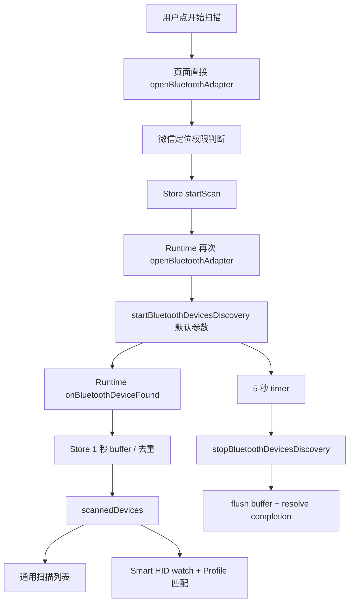
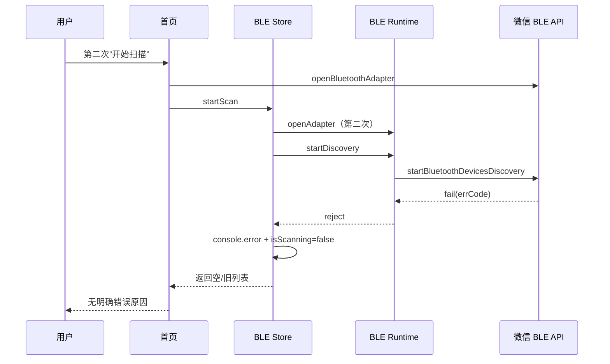
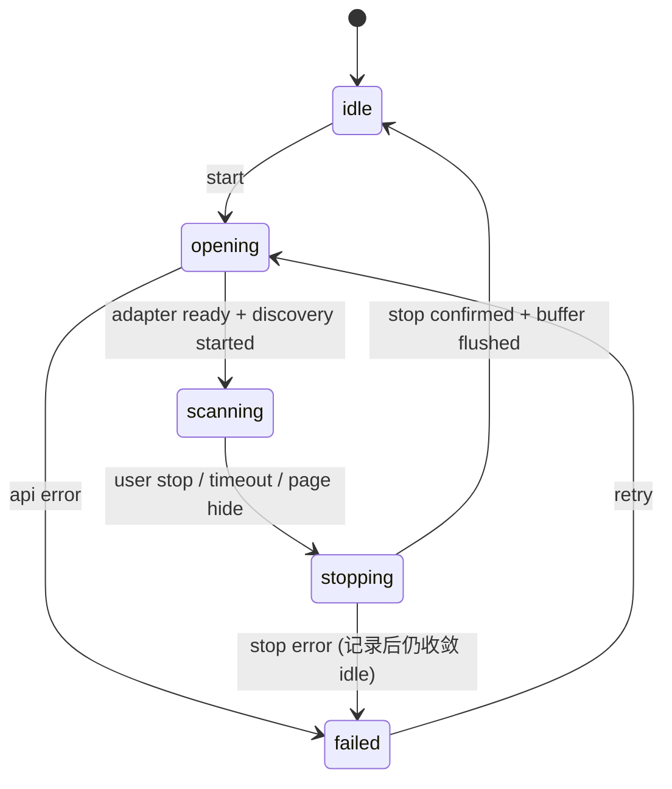
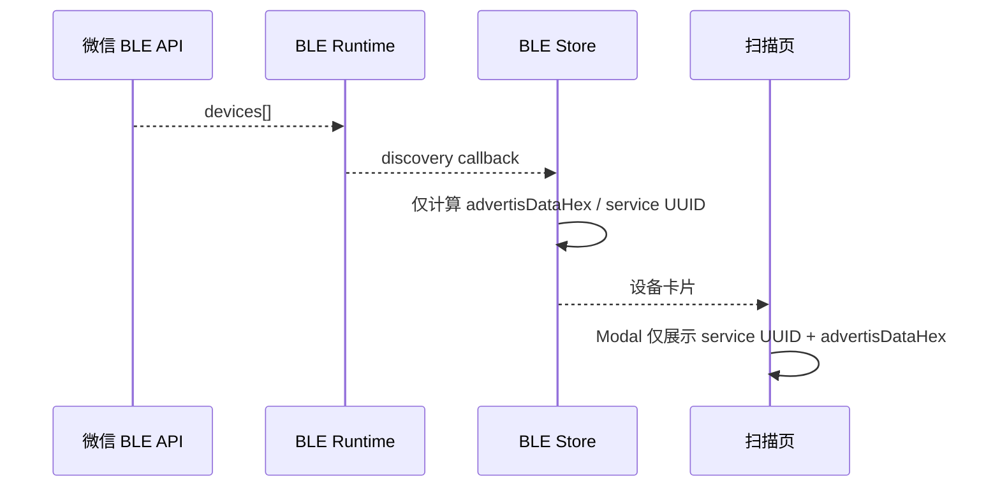

# UniApp 微信小程序端到端审计报告（扫描、广播、页面与资源）

**状态：** AUDIT ONLY / 不修改协议语义

**范围：** `apps/uniapp` 的微信小程序目标；重点为扫描重复执行、广播数据查看、关于页资源与 Smart HID 页面流程。
**结论：** 现有问题不是单一 AppID 或单一 UI 缺陷。扫描链路缺少明确的 session 生命周期和错误面；广播查看将平台原始对象缩减为两个字段；新增静态资源未进入当前微信构建产物。

## 1. 已复现的静态证据

| 严重度 | 现象 | 证据 | 根因判断 | 建议 |
|---|---|---|---|---|
| P0 | 首次可扫、第二次不可扫且无可行动错误 | `store/ble.js:163-195` 吞掉失败并返回当前列表；页面没有显示 `errCode` | 扫描 session 未建模，失败与“扫描到 0 台”混为一谈 | Runtime 提供 `idle / starting / scanning / stopping / failed`，将错误原样映射为用户提示与诊断日志 |
| P0 | 扫描入口重复打开适配器 | `pages/index/index.vue:225-244` 直接 `uni.openBluetoothAdapter`；`store/ble.js:177` 又经 Runtime 打开 | 适配器所有权不唯一，第二轮扫描的顺序/错误不可预测 | 页面只调用 Store；Store 只调用 Runtime；Runtime 成为 `open/close/state` 唯一所有者 |
| P0 | tab 切换/隐藏后扫描可能留存 | 首页只在 `onUnload` 停止扫描（`pages/index/index.vue:201`）；tab 页面切换通常触发 `onHide` 而非 unload | 旧扫描仍占用 discovery，下一次开始竞争或被平台拒绝 | 首页及 Smart HID 向导在 `onHide`/应用 hide 时结束本 session；停止完成后才允许下一轮开始 |
| P1 | 同时点扫描没有确定结果 | `startScan` 发现 `isScanning` 时直接 `return`（`store/ble.js:163-164`） | 调用者拿到 `undefined`，无法获知“复用、拒绝还是结束” | 返回现有 session 的 completion，或明确抛出 `ScanInProgressError`；不可静默 |
| P1 | 广播查看空白且难判别“设备没发”还是“工具没取到” | `store/ble.js:122-123` 仅变换 `advertisData`、`advertisServiceUUIDs`；`pages/index/index.vue:290-294` 仅展示这两个字段 | 未显示 `localName`、`serviceData`、`manufacturerData`、原始字段存在性/长度 | 创建 `AdvertisementSnapshot`，显示“未提供/空 payload/长度 0”三个不同状态，并支持 service/manufacturer data 的 hex 解码 |
| P1 | 关于页推广图标曾不显示 | 其他小程序图标已纳入 `static/other-apps/*.png` 与资源门禁；不再使用占首屏的大横幅 | 运行页使用独立推广卡组件和首字 fallback，原型与运行页均将推广前置 | 保留资源门禁；微信构建产物与真实小程序跳转仍需人工验证 |
| P1 | `onBluetoothAdapterStateChange` 没有统一托管或注销 | `pages/index/index.vue:195-199` 页面直接注册 | 仍存在 Runtime 之外的全局 BLE listener，页面重建时可能堆叠 | Runtime 统一注册并暴露 `onAdapterState`；页面只订阅/取消订阅 |
| P2 | 独立 Smart HID 入口把 BLE “已打开”显示成 “Ready” | 原 `pages/hid/index.vue` | 适配器可用不代表设备已发现、已连接或可配网 | 已移除独立入口；首页按 Profile 匹配和连接确认表达 |
| P2 | 诊断页无法从历史设备自行建立会话 | `pages/hid/diagnostics.vue:59-66` | 已知设备页面跳诊断，但诊断只读内存 session | 诊断页用 deviceId 重连并验证 Profile，或将按钮改为“返回向导连接后诊断” |

## 2. 当前扫描流程

### 扫描失败路径缺口

**目标流程：**每次 ScanSession 都有 ID、开始/停止时间、API 错误、发现数和结束原因。前一 session 未完成停止时，下一 session 先等待停止；不允许页面再直接调用 `uni.*`。

## 3. 广播数据链路与说明

微信平台或外设本身可能不给 `advertisData`，这应当显示为“本轮 API 未提供该字段”，而非把它混同为 “N/A”。同时，若 `manufacturerData`、`serviceData` 或 `localName` 存在，当前页面不会给用户看，因此即使广播中有内容也会显得“空白”。

## 4. 页面分析

| 页面 | 用户目标 | 当前状态 | 问题 | 目标状态 |
|---|---|---|---|---|
| `pages/index/index` | 扫描、查看广播、进入通用 GATT 调试 | 主入口 | 双 adapter open、全局状态 listener、无 scan 失败面 | ScanSession 面板：状态、轮次、时间、错误、结果；广播 snapshot |
| `pages/device/detail` | 通用 GATT 读写/notify | 已迁 Runtime | 需验证返回列表的连接状态同步 | 保持通用调试，不泄漏 Smart HID 语义 |
| 原 `pages/hid/index` | 第一方 Smart HID 独立入口 | 已移除 | 独立 Tab 与通用扫描重复 | 首页扫描卡片直接提供通用/专属入口 |
| `pages/hid/add` | Smart HID 配网 | 从首页 Profile 设备进入 | 已移除第二套扫描与六步技术向导 | 自动连接 → 单页 Wi-Fi/ControlHub → 下发并查看状态；失败按 V1 错误恢复 |
| `pages/hid/detail` | 查看历史配网资料 | 可导航 | 没有实时会话建立 | 明示“历史记录”，提供连接后刷新 |
| `pages/hid/diagnostics` | 读取当前设备状态 | 有 UI | 依赖内存连接，历史入口常失败 | 以 deviceId 建立/恢复 session 后诊断 |
| `pages/broadcast/index` | 手机作为 BLE 外设发广播 | 平台能力展示 | 不能与“扫描到的广播”混淆；微信小程序能力需如实降级 | 明确目标平台与支持矩阵，不承诺小程序可做外设广播 |
| `pages/about/index` | 展示应用、资源和跳转 | 资源路径已改 | dist 缺资源，图片无 error fallback | 资源完整性 gate + fallback + 合法小程序跳转失败提示 |

## 5. 推荐修复批次（须逐批确认）

1. **P0 · 扫描状态机与可观测性**：Runtime 独占 adapter/discovery 状态；session 串行化；停止确认；`onHide` 清理；错误码显示；真实/假平台回归测试。
2. **P1 · 广播 Snapshot**：规范化并展示全部微信发现字段，区分未提供/空/有值；加入 fixture 覆盖；不改变 Smart HID 协议。
3. **P1 · 微信静态资源发布链**：clean compile、dist asset manifest 校验、`image` fallback；确认品牌资源大小和首屏加载策略。
4. **P2 · Smart HID 页面语义**：实时状态标识、历史记录标识、诊断重连；接入 i18n namespace。
5. **P2 · 页面级自动化**：为扫描“连续两轮”、页面 hide、广播字段展示、资源存在性建立微信 API fake + SFC/产物检查；真实微信工具验证由人工完成。

## 6. 验收矩阵

| 场景 | 自动验证 | 微信开发者工具/真机验证 |
|---|---|---|
| 扫描两轮 | fake API 断言 `open → start → stop → start`，第二轮有独立 session | 连续点击两次，第二轮显示新 session、结果或明确错误 |
| 页面切换 | fake API 断言 hide 后 stop 完成 | 扫描中切 tab 返回，再扫不被拒绝 |
| 广播数据 | fixture：service/manufacturer/local name/空值 | 对比设备实际广播与 Snapshot 字段 |
| 图标资源 | 编译后逐一检查静态 src 存在 | 关于页应用图标、两个其他小程序图标均显示 |
| Smart HID 诊断 | fake Profile re-connect + status read | 从历史设备进入诊断可明确成功或提示重连失败 |

## 7. 未验证边界

- 本报告未声称微信模拟器能够替代 iOS/Android 真机 BLE 扫描验证。
- 外设若不发 Manufacturer/Service Data，页面应展示“未提供”，不能伪造内容。
- 不改变 BLE Provisioning V1 UUID、分帧、candidate、错误码或配对 API。
