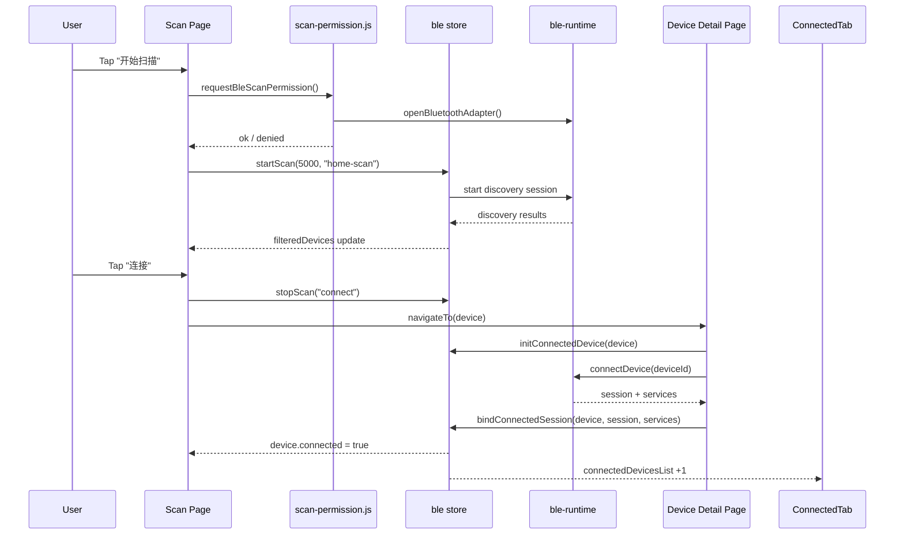
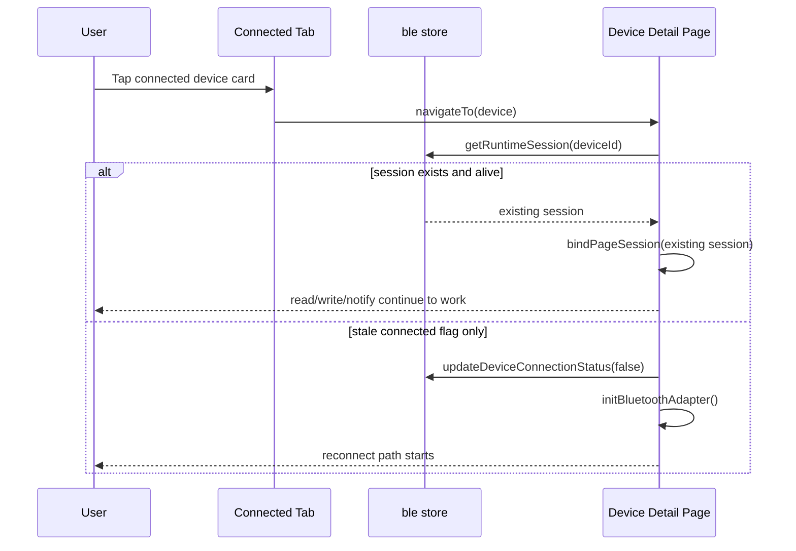
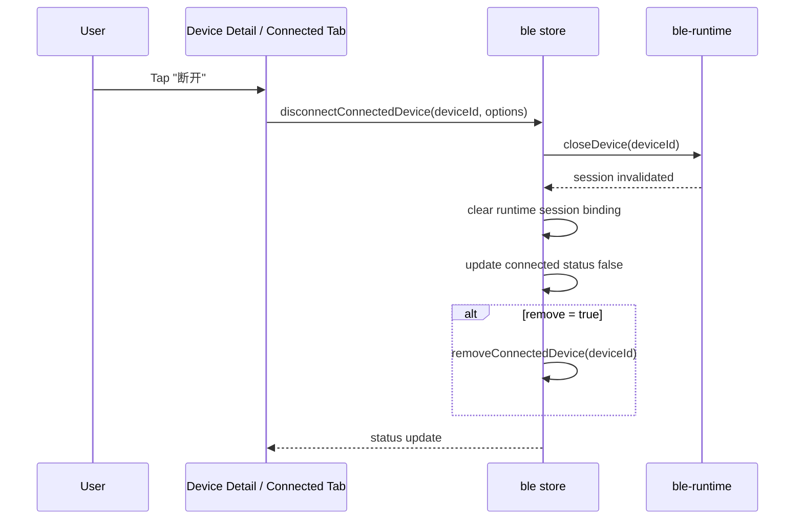
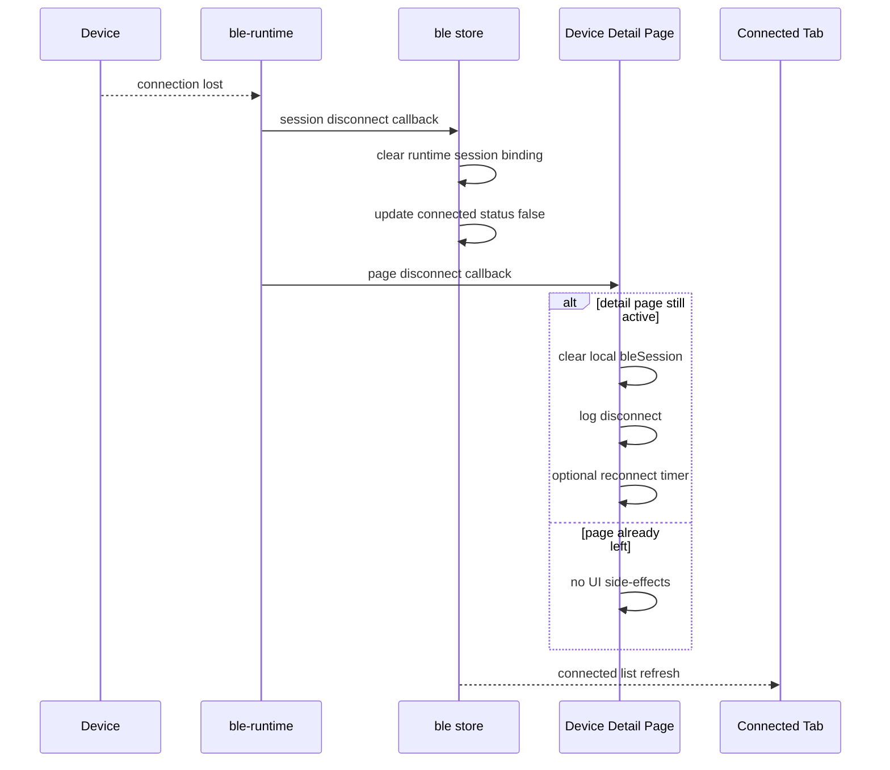
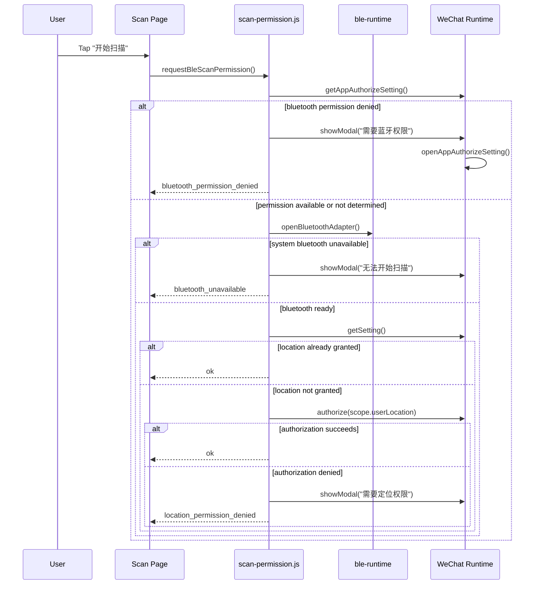
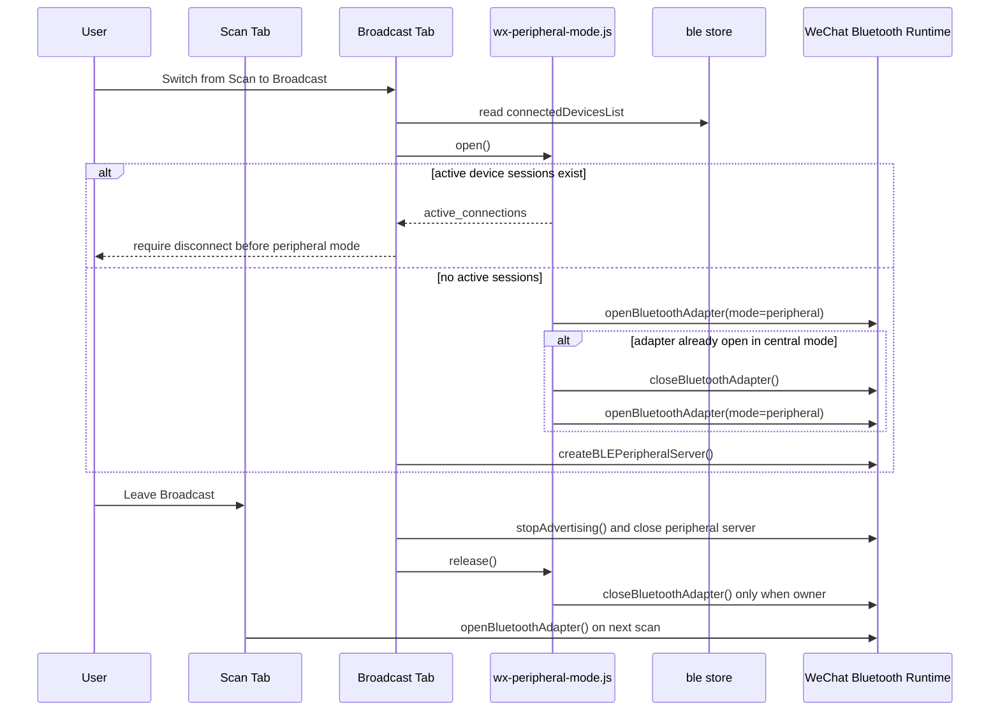

# UniApp Connected Session Sequence

Date: 2026-08-22
Related:
- `2026-08-21-smart-ble-interaction-sync-spec.md`
- `2026-08-21-smart-ble-page-wireframes.md`

## Purpose

This document records the actual session lifecycle for the UniApp mini program after introducing a dedicated `Connected` tab.

It exists for two reasons:

1. the connected-device entry is now a real product surface, not a placeholder
2. the previous implementation had lifecycle drift: leaving the detail page closed the BLE session, which made the `Connected` tab concept misleading

## Scope

This document covers:

- scan-page connect entry
- device-detail session creation and reuse
- connected-tab list maintenance
- explicit disconnect
- passive disconnect
- scan permission gate before discovery

It does not redefine GATT read/write/notify framing or Smart HID protocol details.

## Current State Model

The runtime now has three layers that must stay aligned:

1. `ble-runtime`
   owns real BLE sessions and adapter callbacks
2. `ble store`
   owns connected-device metadata and scan results; delegates runtime-session binding to `connected-session-registry`
3. `page instances`
   own only page-local UI subscriptions such as logs, notify toggles, and reconnect timers

Key rule:

- page unload must no longer equal session close

## Fixed Issues

Before this pass:

- leaving `pages/device/detail.vue` closed the runtime session in `onUnload`
- reopening a device from `Connected` could show connected UI but had no `bleSession` bound for read/write actions
- connected-list state could drift from scan-list state

After this pass:

- sessions are bound in `bleStore.bindConnectedSession(...)`
- concurrent Runtime connects for one device share one in-flight attempt
- session replacement unsubscribes the old registry callback before binding the new one
- detail pages reattach with `bleStore.getRuntimeSession(deviceId)`
- explicit disconnect uses `bleStore.disconnectConnectedDevice(...)`
- scan list mirrors connected status through store sync

## Sequence 1: Scan To Connected Session

## Sequence 2: Reopen From Connected Tab

## Sequence 3: Explicit Disconnect

## Sequence 4: Passive Disconnect

## Sequence 5: First-Time Scan Permission Gate

## Sequence 6: Scan / Broadcast Adapter Mode Handoff

## Code Mapping

Primary files:

- scan permission gate:
  - `apps/uniapp/services/scan-permission.js`
- scan page orchestration:
  - `apps/uniapp/composables/use-ble-scan.js`
  - `apps/uniapp/pages/index/index.vue`
- WeChat adapter-mode ownership:
  - `apps/uniapp/services/wx-peripheral-mode.js`
  - `apps/uniapp/pages/broadcast/index.vue`
- connected session state:
  - `apps/uniapp/store/ble.js`
  - `apps/uniapp/services/connected-session-registry.js`
- connected tab:
  - `apps/uniapp/pages/connected/index.vue`
- device session page:
  - `apps/uniapp/pages/device/detail.vue`

## Guardrails

Future changes must preserve:

- `Connected` is meaningful only if leaving detail does not auto-close the session
- reopening from `Connected` must restore an operable session, not just a pretty status badge
- permission denial must always produce a visible user-facing explanation
- scan list and connected list must stay in sync for the same device

## Verification Notes

Code-level verification completed in this pass:

- all files under `tests/unit/*.test.mjs`
- `node tests/unit/scan-permission.test.mjs`
- `node tests/unit/scan-session.test.mjs`
- `node tests/unit/ble-runtime.test.mjs`
- `node tests/unit/connected-session-registry.test.mjs`
- `node tests/unit/wx-peripheral-mode.test.mjs`
- `node tests/unit/uniapp-ui-contract.test.mjs`
- Vue SFC parse check for all 24 UniApp `.vue` files
- WeChat DevTools visual and interaction check for Scan, permission failure, Connected, and Broadcast mode entry

Still required on a real device:

- real device validation for first-time bluetooth + location permission flow
- cross-page connected-session reuse validation
