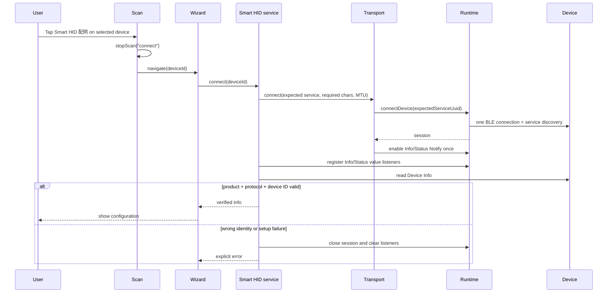
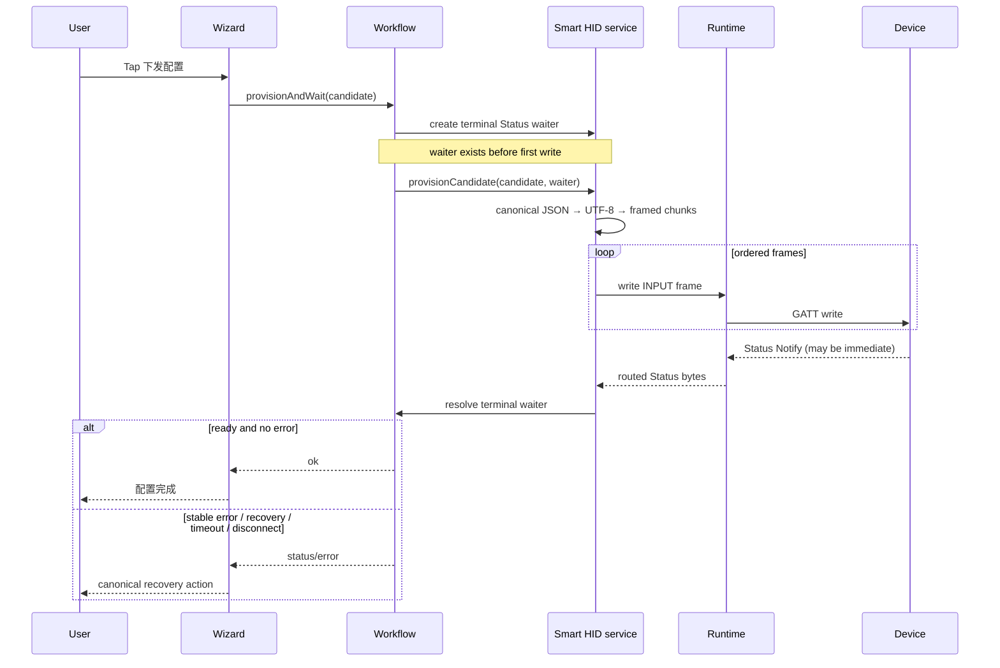
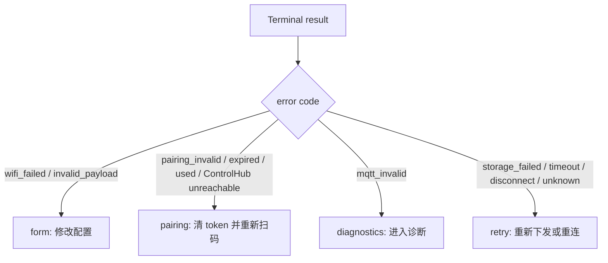

# UniApp Smart HID Sequence and Ownership

Date: 2026-08-22
Decision: D2 option 3, shared BLE Runtime primitives with separate verified Smart HID workflow ownership

## Ownership

| Layer | Owns | Must not own |
|---|---|---|
| BLE Runtime | global WeChat callbacks, one connection attempt/session per device, UUID routing, read/write/Notify primitives | Smart HID recovery labels or candidate meaning |
| Provisioning transport | selected service/characteristics, MTU, ordered frames, callback registration | page state or duplicate Runtime listeners |
| Smart HID service/workflow | Device Info verification, Info/Status subscriptions, waiter lifecycle, provisioning transaction, diagnostics | a second BLE adapter/callback system |
| Composable/pages | visible fields, labels, navigation, confirmation prompts, secret clearing | protocol constants, recovery tables, waiter timing |

## Selected Device to Verified Session



## Candidate Write and Fast Status



## Recovery



`workflow.js` is the only recovery table. Pages map these action keys to labels and navigation only.

## Diagnostics Ownership

```mermaid
sequenceDiagram
    participant Page as Diagnostics page
    participant HID as Smart HID service
    participant Device

    Page->>Page: clear stale diagnostic snapshot
    Page->>HID: getSessionState()
    alt same device already connected
        Page->>HID: diagnose()
        Note over Page,HID: borrowed connection; page does not close it on back
    else historical/offline device
        Page-->>Page: show offline + reconnect confirmation
        Page->>HID: connect(deviceId)
        HID->>Device: verify Device Info
        Page->>HID: diagnose()
        Note over Page,HID: page owns this reconnect and closes it on unload
    end
    HID-->>Page: live rows or explicit failure
```

## Advanced BLE

`高级 BLE 调试` builds `/pages/device/detail?device=...` from a whitelisted, non-sensitive selected-device context. Generic detail then reuses an eligible Runtime session or reconnects explicitly; it never sends the user back to Scan without context.

## Required Real Evidence

- strong and weak discovery plus wrong identity rejection
- immediate terminal Status after first write
- every stable recovery code
- timeout and passive disconnect waiter cleanup
- borrowed vs owned diagnostics navigation
- advanced route followed by a real GATT operation
