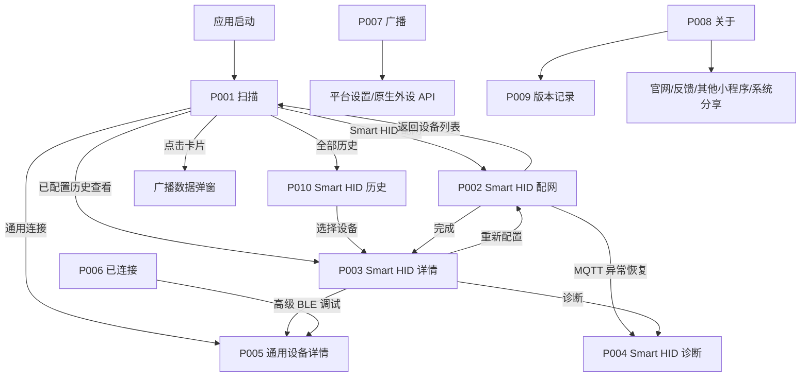

# 页面跳转关系

## A → B → A 核查

| 往返 | 代码证据 | 结论 |
|---|---|---|
| P001 → P005 → P006 | runtime session + P006 computed | 同进程可见；重启不保留 |
| P001 → P002 → P003 | commitKnownDevice + redirect | 本次可达 |
| P001 历史 → P003 → 返回 P001 | knownDevices 面板 + navigateTo | **重启后再入已闭环（2026-08-29）** |
| P001 → P010 → P003 → P010 | 历史列表 + 紧凑 deviceId 路由 | **微信模拟器回归通过（2026-08-31）** |
| P003 → P002 → P003 | 重配后 redirect | 路由闭环存在 |
| P005 断连 → 重连 | 最多三次 | 有链路，缺显式 UI 状态 |
| P007 离开 → 返回 | 释放外设 / 再检查 | 设计合理，待真机 |
