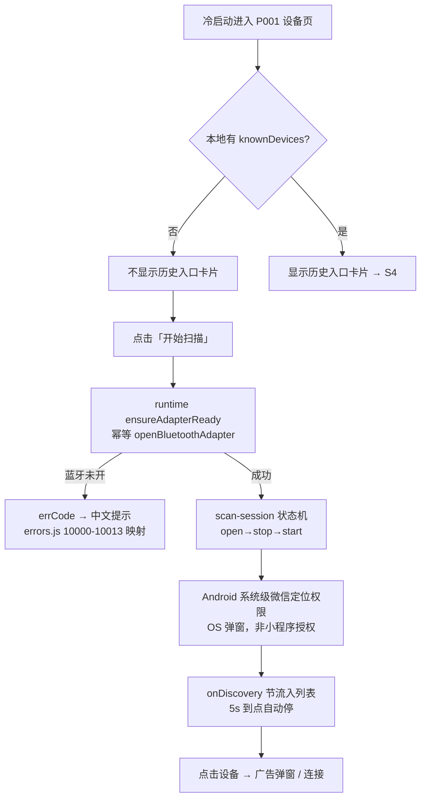
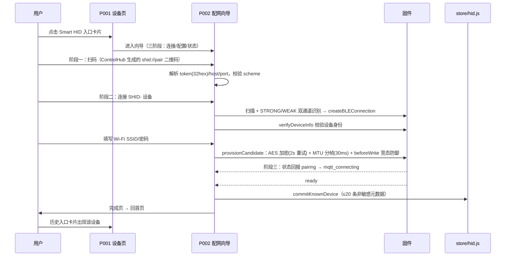
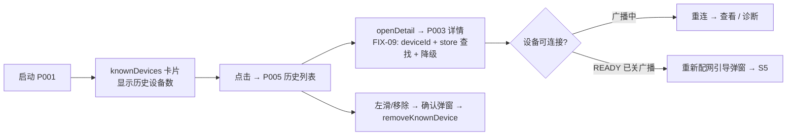
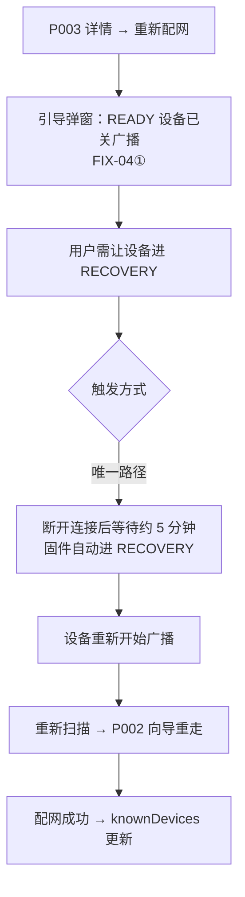
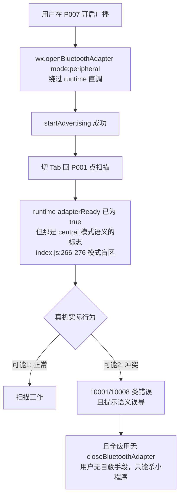

# 04 · 核心用户流程走查

> 以**真实用户目标**为主线（非页面视角）沿代码链路逐步走查。判定标准：**不是代码有没有，而是用户能不能真的完成这件事**。
> 证据基础：`05_页面逐页审计/P001~P009` 全部操作链路追踪结果。

---

## S1 · 新用户首次打开（从未授权任何权限）

**走查结论**：
- ✅ **可完成**。FIX-01 移除 `scope.userLocation` 后，小程序内不再弹定位授权；Android 仅剩 OS 层对微信 App 的定位权限（系统行为，代码不可控），iOS 无此要求。
- 残留问题：扫描页仍有过时的定位权限说明文案（P001-I05 P3）；5 秒扫描到点无任何完成反馈，新用户不知道「扫完了没有」（P001-I01 P2）。
- 首次扫描若系统权限被拒：错误经 `normalizeBleError` 归一化为中文提示，用户有明确出路。

---

## S2 · Smart HID 配网全流程（成功路径）

**走查结论**：✅ **全链路真实闭环**（P002 十项操作 8✅）。安全不变量成立：token 会话结束置空、Wi-Fi 密码用后即清、日志只打字节计数。配网成功后设备在 P005 历史列表可见、可进 P003 详情、可移除。

---

## S3 · 配网失败与恢复（八种失败场景）

| # | 失败场景 | 触发点 | 系统反应 | 用户出路 | 判定 |
|---|---|---|---|---|---|
| 1 | 手机蓝牙未开 | 进向导 / 扫描 | `ensureAdapterReady` errCode → 中文提示 | 引导开蓝牙后重试 | ✅ |
| 2 | 扫码中途取消 | `uni.scanCode` | 正常返回向导 | 重新扫码 | ✅ |
| 3 | **相机权限被拒** | `uni.scanCode` | `fail: () => {}` 无任何反馈 | **无提示，用户以为按钮坏了** | 💀（死路径，P002-I01 P2；当前入口为死按钮，真实扫码入口在 P001 Smart HID 卡片链路） |
| 4 | 设备未找到（READY 设备已关广播） | 连接阶段扫描 | 重新配网路径有 FIX-04④ READY 提示弹窗；**首次配网场景无对应提示** | 等待 / 重试 | ⚠️ |
| 5 | BLE 连接失败 / 超时 | `connect` | 错误归一化中文提示 | 重试连接 | ✅ |
| 6 | **配置阶段连接断开** | provision 进行中 | **界面不可见**（P002-I02 P2），用户只能等超时报错 | 超时后重试 | ⚠️ |
| 7 | 固件侧失败（Wi-Fi 寙密错 / MQTT 连不上） | 状态阶段 | `applyProvisionResult` error → 恢复四路（重试 Wi-Fi / 重试连接 / 诊断 / 重配） | 按建议恢复 | ✅（恢复动作词汇两套未对齐，P002-I03 P3） |
| 8 | 固件进入 RECOVERY（断连 5 分钟自动） | 再次连接时 | `recoveryFor` → `runRecovery` 按状态恢复 | 等待恢复完成 | ✅ |

**走查结论**：8 种失败中 5✅ 2⚠️ 1💀。断链集中在「失败发生时用户能否**看见**」：相机权限死路径（#3）与配置阶段断开不可见（#6）。

---

## S4 · 老用户找回历史设备

**走查结论**：✅ 可完成（P005 全页闭环，评分 A-）。小瑕疵：连接过设备后回来的空态图用 `empty_connected.png` 语义错位（P005-I01 P3）；历史超过 20 条静默截断最旧的（P005-I02 P4）。

---

## S5 · READY 设备重新配置（最长路径走查）

**走查结论**：⚠️ **可完成但路径长**。瓶颈在固件侧：无物理 RECOVERY 触发（按键 / 复位组合），用户唯一手段是等 5 分钟。弹窗引导文案已如实告知（诚实），但产品层无法缩短该路径。跨端改进项已记录于 06/11（固件 RECOVERY 按键）。

---

## S6 · 广播用户与调试用户混合使用（P1 风险场景）

**走查结论**：⚠️ → 潜在 ❌。这是全应用唯一 P1 级风险：**双角色用户（既调试别人设备又开本机广播）在 Tab 顺序切换时可能触发 central/peripheral 模式冲突，且错误提示会误导排查方向**。代码层证据充分（broadcast/index.vue:214/:554 直调绕过 runtime；runtime `adapterReady` 不区分模式；全仓库无 `closeBluetoothAdapter`），但最终行为需真机验证（微信基础库可能内部做了兼容）。已列为 12_修复路线图 Phase 0 阻断项。

---

## 走查总表

| 场景 | 主线目标 | 判定 | 关键断点 |
|---|---|---|---|
| S1 新用户首开 | 完成第一次扫描 | ✅ | 5s 无完成反馈（P2） |
| S2 配网全流程 | 设备上线并被记住 | ✅ | — |
| S3 失败恢复 | 每种失败都有出路 | 5✅ 2⚠️ 1💀 | 相机权限死路径、配置断开不可见 |
| S4 历史找回 | 找回并管理旧设备 | ✅ | — |
| S5 READY 重配 | 重新配置已上线设备 | ⚠️ | 固件无物理 RECOVERY（跨端） |
| S6 广播+调试混用 | 两角色不互相破坏 | ⚠️ 潜在❌ | 适配器双模冲突（待真机验证） |

**总结**：三条主线（首开扫描、配网成功、历史找回）全部真实可完成，产品核心价值成立。断点集中在失败可见性与跨模块互斥，而非主链路缺失。
