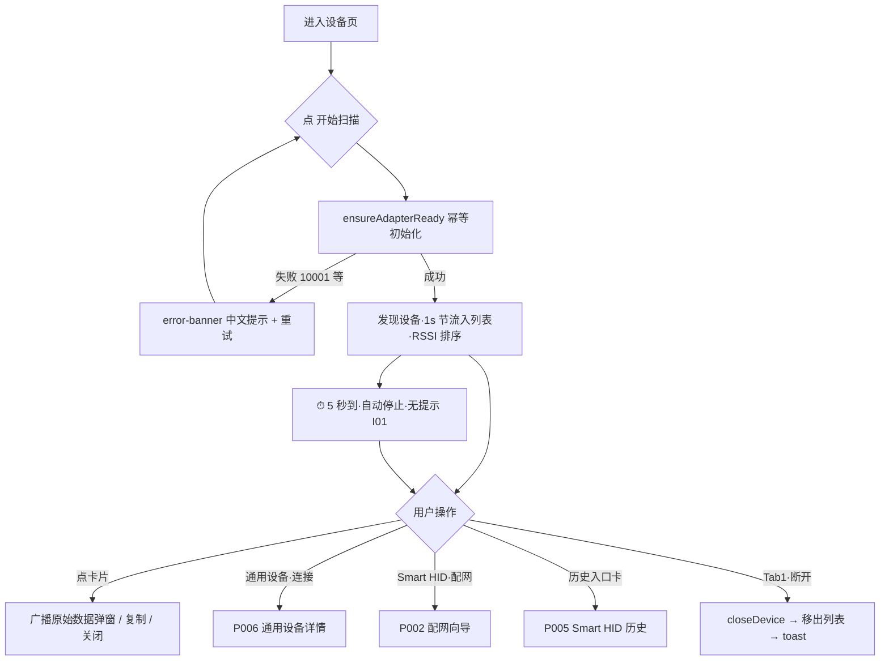

# P001 设备页（pages/index/index）

> 基线 `bf5d17e`。全部行号以当前 HEAD 为准。结论先行：**修复后主链路（扫描→连接/配网/历史）全部真实可达，无断链、无假完成**；遗留 8 个问题集中在体验层（扫描 5 秒无提示、状态灯误报、文案重复、计数口径），其中文案重复是用户上轮点名但未列入修复范围的项。

## 1. 页面基本信息

```text
页面名称：设备（tabBar 第 1 项）；导航标题 BLE Toolkit+（custom navbar）
页面路径：pages/index/index
页面类型：Tab 页（启动默认页，pages.json navigationStyle: custom）
进入方式：启动 / tabBar 切换 / 分享落地 / 各流程返回（switchTab ×3、navigateBack ×1）
退出方式：tabBar 切走（onHide 自动停扫描）/ navigateTo 三处（P006/P002/P005）
是否登录后可访问：无登录体系，直接可访问
是否依赖权限：系统蓝牙开关；Android 端微信 App 需具备 OS 级位置权限（非小程序 scope，FIX-01 已删除错误的 scope.userLocation 前置门）
是否依赖网络：否（纯 BLE；分享卡片由宿主处理）
```

## 2. 页面产品目的

用户在这里发现附近的 BLE 设备，一眼认出哪些是 Smart HID 设备，并把它们带进配网流程；同时这里是通用 BLE 设备调试连接的入口、已连接会话的续用入口、配网历史的找回入口。**它是全 App 唯一的扫描触发点——本页不动，下游五个页面全部失业。**

## 3. 页面信息结构

```text
设备页
├── 自定义导航栏（app-navbar）
│   ├── kicker "SmartBLE Mini" / 标题 "BLE Toolkit+"
│   └── 蓝牙状态灯（bleState: on→"蓝牙就绪" 绿点 / off→"蓝牙未开启" 灰点）
├── 扫描摘要卡（scan-summary）
│   ├── 大数字 filteredCount + 标签 "附近设备"          ← 文案重复点①
│   ├── 副行 "扫描到 X 台 · 已连接 Y 台"
│   ├── 按钮 开始扫描 ◉ / 停止扫描 ■（scanning 态变红渐变）
│   └── error-banner（scanError 非空时）"扫描失败（errCode）+ 中文提示 + 重试"
├── Smart HID 历史入口卡（v-if knownDevices.length > 0）
│   └── "已配置设备 / N 台设备完成过配网，点击查看历史配置" → P005
├── 分段切换（ble-pill-tabs）
│   ├── Tab0 "扫描设备"
│   └── Tab1 "已连接"                                    ← 文案重复点②相关
├── 结果面板（ble-card）
│   ├── 头部：标题 Tab0"附近设备"/Tab1"连接会话" + caption + "筛选"toggle（仅 Tab0） ← 重复点①
│   ├── filter-panel（内联展开，仅 Tab0）
│   │   ├── 信号强度 slider（-100~0）+ 预设 -100/-85/-70/-55
│   │   ├── 名称前缀 input
│   │   ├── 隐藏无名设备 switch
│   │   └── 重置过滤
│   ├── Tab0 设备卡列表（device-card ×N，RSSI 降序，上限 100）
│   │   └── 空态 ×2：未扫描过 / 有结果但被过滤光
│   └── Tab1 已连接会话卡列表 + 空态
└── advertisement-dialog（弹窗）：广播原始数据 + 复制
```

设备卡（Tab0）三种形态：

| 形态 | 条件 | 展示 | 按钮 |
| --- | --- | --- | --- |
| 通用设备 | 未匹配 Profile | 名称 + 猜测生态标签（小米/华为/Apple/穿戴/终端/BLE 设备）+ "点击卡片查看广播原始数据" | 「连接」 |
| Smart HID 强匹配 | 广播含 Service UUID 9f1d1001-…（matchLevel≥2） | 名称 + 绿色 "Smart HID" 徽章 + "配置 Wi-Fi 与 ControlHub 地址。" | 「连接」+「Smart HID 配网」（主按钮） |
| Smart HID 弱匹配 | 名称前缀 SHID-（matchLevel<2） | 同上，caption 变为"可能支持 Smart HID 配网，进入后先连接确认身份。" | 同上 |

## 4. 页面操作清单

| 操作ID | 用户操作 | UI入口 | 触发函数 | 预期结果 | 实际结果 | 后续页面 | 状态 |
| --- | --- | --- | --- | --- | --- | --- | --- |
| O01 | 开始扫描 | 摘要卡主按钮 | `toggle → start → store.startScan()` | 进入 scanning，设备实时出现 | 同预期，5 秒后自动停且无提示（I01） | 无 | ⚠️ |
| O02 | 停止扫描 | 同上（scanning 态） | `toggle → stop('user')` | 停止并保留列表 | 同预期 | 无 | ✅ |
| O03 | 重试 | error-banner | `@retry → startScan`（`index.vue:6`） | 重新发起扫描 | 同预期 | 无 | ✅ |
| O04 | 点设备卡（Tab0） | 卡片整卡 | `showAdvertisingData` | 弹广播原始数据窗 | 同预期，字段缺失有明确标注 | 无（弹窗） | ✅ |
| O05 | 复制广播数据 | 弹窗按钮 | `copyAdvData → uni.setClipboardData` | 复制+toast | 同预期 | 无 | ✅ |
| O06 | 关闭弹窗 | 弹窗 ×/关闭/遮罩 | `closeAdvDataModal` | 关闭 | 同预期 | 无 | ✅ |
| O07 | 连接（通用设备） | 卡片「连接」 | `connectDevice`（`index.vue:111-116`） | 停扫描→进通用调试页 | 同预期 | P006 | ✅ |
| O08 | 连接（Smart HID 卡副按钮） | 卡片「连接」 | 同 O07 | 进通用调试页看 GATT | 同预期 | P006 | ✅ |
| O09 | Smart HID 配网 | 卡片主按钮 | `openProfileDevice`（`index.vue:118-122`） | 停扫描→ setCurrentDevice → 进向导 | 同预期 | P002 | ✅ |
| O10 | 已连接卡片点击（Tab1） | 卡片整卡 | `connectDevice` | 回到该设备调试页 | 同预期 | P006 | ✅ |
| O11 | 断开（Tab1） | 卡片「断开」 | `disconnectDeviceFromList`（`index.vue:128-135`） | closeDevice→移出列表→toast | 同预期；失败有 toast | 无 | ✅ |
| O12 | 查看配网历史 | 历史入口卡 | `goHidHistory`（`index.vue:124-126`） | 进历史页 | 同预期（FIX-05 已接通） | P005 | ✅ |
| O13 | 调整筛选 | filter-panel 各控件 | `filterSettings` v-model | filteredDevices 重算 | 同预期；摘要大数字=过滤后、副行=总数，口径已区分 | 无 | ✅ |
| O14 | 切换分段 | pill tabs | `currentTab = index` | 切列表 | 同预期（扫描不中断，合理） | 无 | ✅ |
| O15 | 分享 | 右上角菜单 | `onShareAppMessage`（`index.vue:104-109`） | 分享卡片 | title/path 正常 | 落地本页 | ✅ |

## 5. 关键操作运行链路（逐层追踪）

### O01 开始扫描（修复后全链路）

```text
点击 ◉ → use-ble-scan.js:39 start() → store/ble.js:187 startScan(duration=5000)
→ scan-session.js:45 startSession
   ① open: store/ble.js:145 _openAdapterWithRetry(3次指数退避)
      → ble-runtime/index.js:278 openAdapter → :266 ensureAdapterReady
        → ensureCallbacks() 注册 4 个全局回调（设备发现/连接态/特征值/适配器态）
        → 幂等：adapterReady 或有会话则跳过 → openBluetoothAdapter
        → 失败经 errors.js normalizeBleError 转"蓝牙开关未打开…（errCode 10001）"中文
   ② stop().catch(()=>{})（清残留发现）
   ③ startBluetoothDevicesDiscovery({allowDuplicatesKey:true, interval:0})
   ④ onState('scanning') → isScanning=true → 按钮变 ■ 红渐变
   ⑤ setTimeout 5s → stopSession('timeout') → onBeforeFinish 冲刷 1s 节流缓冲 → idle
设备流：platform.onBluetoothDeviceFound → store onDiscovery（ble.js:180-185）
→ deviceBuffer + 1s 节流 → processDeviceBuffer（合并去重/RSSI 排序/上限 100）
→ scannedDevices → use-ble-scan.js:10 devices computed
→ matchScannedDevices 叠加 Profile 匹配字段 → filteredDevices（O13 过滤）→ UI
```

**结论：链路闭环。**失败路径同样闭环：open 失败 → onState('failed') + scanError → error-banner 中文提示 + 重试按钮（修复前此 banner 因权限门拦截根本不可达，现已验证可达）。

### O09 Smart HID 配网（本页责任段）

```text
点击主按钮 → prepareConnect()（stop('connect')，先停扫描再跳转 ✓）
→ hidStore.setCurrentDevice(device)（向导 fallback 链的兜底来源）
→ navigateTo /pages/hid/add?deviceId=…（FIX-09：只传 deviceId，不再整设备 JSON 入 URL）
```

**本页责任段闭环**；向导内部链路（GATT 连接、身份确认、扫码、下发）归 P002 审计。

### O11 断开

```text
点击断开 → ble-runtime closeDevice → 有会话则 session.close()（标记本地断开防误报回调）
→ bleStore.removeConnectedDevice → toast "已断开"；失败 toast error.message（中文，errors.js 已归一）
```

**闭环。**

## 6. 接口依赖（平台 API，无 HTTP 接口）

| API | 用途 | 触发时机 | 错误处理 | 备注 |
| --- | --- | --- | --- | --- |
| openBluetoothAdapter | 初始化适配器 | 扫描启动（经重试 3 次） | errors.js 中文 + banner + 重试 | ensureAdapterReady 幂等（FIX-02） |
| startBluetoothDevicesDiscovery | 发现设备 | scanning | 同上 | allowDuplicates 持续更新 RSSI |
| onBluetoothDeviceFound | 设备流 | 全局一次注册 | — | ble-runtime 唯一所有者 |
| stopBluetoothDevicesDiscovery | 停止 | 超时/手动/离开页面/onHide | `.catch(()=>{})` 静默 | 合理 |
| getBluetoothAdapterState | 状态灯 | **onLoad 一次** | fail→off | 时序问题见 I02 |
| onBluetoothAdapterStateChange | 状态灯纠偏 | open 成功后系统回调 | — | 见 I02 |
| closeBLEConnection | 断开 | O11 | toast | — |
| setClipboardData | 复制广播 | O05 | 无 fail 分支 | 可接受 |

无 mock 数据、无写死参数；设备数据全部来自实时扫描。

## 7. Store / 缓存 / 状态审计

| 状态 | 读/写 | 清理方 | 失效风险 |
| --- | --- | --- | --- |
| ble.scannedDevices | 读（devices computed） | 下次 starting 清空 | 返回本页保留旧结果，无"过期"标注（I08，P3） |
| ble.isScanning / scanError / scanState | 读 | 控制器 onState | — |
| ble.bleState | 读（状态灯） | setBleState（onLoad 查询 + 适配器回调） | 首屏误报（I02） |
| ble.connectedDevicesMap/List | 读（Tab1 + 计数） | device/detail 写入、本页断开移除 | **Smart HID 配网会话不写入** → "已连接 Y 台"口径失真（I04） |
| hid.knownDevices | 读（入口卡 v-if + 计数） | commitKnownDevice（P002 成功时）/ removeKnownDevice（P005） | 持久化 ≤20 条非敏感元信息 ✓ |

返回刷新场景：P005 删除记录 → switchTab/返回 P001 → 入口卡计数由 computed 自动更新 ✓；从 P006 返回 → 已连接 tab 状态实时（reactive map）✓；从 P002 配网成功 redirectTo P003 → switchTab 回本页 → 入口卡**会出现**（knownDevices 已 commit）✓。

## 8. 页面生命周期审计

| 钩子 | 行为 | 判定 |
| --- | --- | --- |
| onLoad | checkBluetoothState（use-ble-scan.js:45） | ⚠️ I02：此时适配器未 open，Android 真机 `getBluetoothAdapterState` 大概率 available:false → 首屏灯恒"未开启" |
| onShow | **无** | ⚠️ I02：切 tab 回来不重查；扫描后靠 onBluetoothAdapterStateChange 事件纠偏（ble-runtime:93-102 → ble.js:47），冷启动首屏到首次扫描之间是盲区 |
| onHide | stop('page_hide')（use-ble-scan.js:46） | ✅ 切 tab/进后台自动停扫，防电量流失 |
| onUnload | stop('page_unload') | ✅（tab 页实际不卸载，防御性） |
| onShareAppMessage | title+path | ✅（仅 MP-WEIXIN 条件编译） |
| 下拉刷新/触底 | 无（scroll-view 内滚） | ✅ 与交互模型一致 |

重复绑定风险：全局回调由 ble-runtime `ensureCallbacks` 单次注册（ble-runtime/index.js:52-107），页面级 onDiscovery 监听在 store 初始化一次（ble.js:180 `if (!stopDiscoveryListener)`）——无重复绑定。

## 9. 页面状态完整性

| 状态 | 需要 | 实现 | 判定 |
| --- | --- | --- | --- |
| 扫描中 | 是 | 按钮态 + 列表实时增长 | ✅（但无倒计时/剩余时长，见 I01） |
| 扫描结束 | 是 | 仅按钮回变 | ⚠️ 无任何"已停止"提示（I01） |
| 空数据-未扫 | 是 | empty-state "还没有扫描结果" | ✅ |
| 空数据-被过滤 | 是 | empty-state "当前没有匹配设备" + 建议 | ✅ |
| 错误-蓝牙关 | 是 | error-banner errCode 10001 中文 + 重试 | ✅（修复后可达） |
| 蓝牙开关系统引导 | 可选 | 仅 banner 文案 | ⚠️ 无"去开蓝牙"动作引导（P3） |
| 无结果设备多 | — | 上限 100 + 筛选 | ✅ |
| 提交中/成功/失败 | 不适用（本页无提交类操作） | — | — |

## 10. 导航合理性

- 用户从哪来/去哪：根页面，三出边（P006/P002/P005）+ 分享回流，结构清晰。
- 主操作明确：摘要卡大按钮是唯一扫描开关 ✓；Smart HID 卡的主按钮（配网）视觉强于副按钮（连接）✓。
- 操作反馈：除 I01/I02 外全部操作有真实反馈。
- 连续返回层数：最深链 P001→P002→（redirect）P003→P004 共 3 层，配网成功用 redirectTo 避免了"向导卡在返回栈"✓。
- 登录/支付断流：不适用。

## 11. 页面流程图



## 12. 问题清单（证据 → 严重度 → 建议）

| ID | 问题 | 证据 | 严重度 | 建议 |
| --- | --- | --- | --- | --- |
| I01 | 扫描固定 5 秒自动停止，无倒计时、无结束提示；用户感知"自己停了/坏了" | `store/ble.js:187`（duration=5000 默认且 index 不传参）；scan-summary 无进度元素；5s 到仅按钮文案回变 | **P2 核心体验** | 按钮内倒计时（`停止 4s`）或摘要行显示剩余时长；结束时轻提示；提供"连续扫描"开关 |
| I02 | 首屏蓝牙状态灯误报"蓝牙未开启"，onShow 不刷新 | `use-ble-scan.js:32-37,45`（onLoad 在 open 前查询）；无 onShow 重查；纠偏依赖 open 后的适配器事件（ble-runtime:93-102） | **P2 信任损伤** | onShow 重查一次；或状态灯在"从未初始化"态显示中性文案"点击扫描连接蓝牙" |
| I03 | 文案重复（用户上轮点名，未列入 FIX-01~12，仍在）：①"附近设备"×2（scan-summary.vue:4 大数字标签 + index.vue:30 结果区标题）；②"已连接"语义三处并存（index.vue:99 pill「已连接」、scan-summary.vue:5 计数「已连接 Y 台」、index.vue:30 Tab1 标题「连接会话」） | 引用如左 | **P1 文案** | 摘要卡只保留数字+统计行；结果区标题承担分区命名；统一"已连接"用词 |
| I04 | "已连接 Y 台"仅统计通用调试连接（connectedDevicesMap 只由 device/detail 写入），Smart HID 配网会话不计入 | `store/ble.js:59-70`（唯一写入方 initConnectedDevice 的调用链）；smart-hid 会话独立于该 map | P2 口径 | 计数改为"调试连接 Y 台"，或把 smart-hid 会话也纳入（需 runtime 统一登记） |
| I05 | error-banner 兜底文案"请确认蓝牙/定位权限后重试"表述过时：小程序 scope 权限门已删；Android 需要的是**微信 App 的系统级**位置权限 | `scan-summary.vue:12` | P3 文案 | 改为"请确认手机蓝牙已开启（Android 需给微信 App 位置权限）" |
| I06 | Tab1 卡片"连接稳定"chip 为静态装饰，无信号/质量依据，过度承诺 | `device-card.vue:29-31` | P3 | 改为中性"已连接"，或按最后 RSSI 分级 |
| I07 | 扫描卡「连接」按钮的"已连接"禁用态不可达：`scannedDevices[].connected` 无任何写入方（新设备固定 false，无人置 true） | `store/ble.js:127-133`（初始 false）；全项目无对该字段的写入 | P3 死状态 | 删除该禁用分支，或由 connectedDevicesMap 联动置位 |
| I08 | 返回本页保留旧扫描结果，无"快照过期"提示（RSSI/存在性是扫描时刻的） | 列表无时间戳标注；onShow 不清不提示 | P3 | 列表头部加"上次扫描 hh:mm"，或 onShow 超时淡出 |

**假完成检查：无。**本页所有按钮/操作均追到了真实结果（上表 15 项操作 13✅ 2⚠️，⚠️ 均为体验问题而非断链）。

## 13. 合理性与完成度评价

```text
产品合理性：B+   单页承载三职能（发现/连接管理/历史入口）但主次清楚；双分段+筛选的信息架构成立
功能完成度：85%  修复后全链路可达；扣分项=扫描时长控制缺失（I01 属产品决策缺口）
交互完整度：70%  无进度反馈（I01）、状态灯误报（I02）、文案重复（I03）
异常完整度：75%  错误链闭环且文案中文化；缺系统蓝牙引导动作、首屏状态盲区
```

- 页面是否应该存在：✅ 核心根页面，不可合并。
- 是否缺关键内容：扫描时长/连续扫描控制（I01）。
- 操作是否太多：卡片双按钮（连接+配网）对 Smart HID 设备是必要的区分，可接受。
- 关键入口是否隐蔽：历史入口卡仅老用户可见（条件渲染，合理）；筛选入口"筛选"文字按钮存在感偏弱（P3）。
- 用户理解成本：主要来自"已连接/连接会话/附近设备"措辞不统一（I03）。
