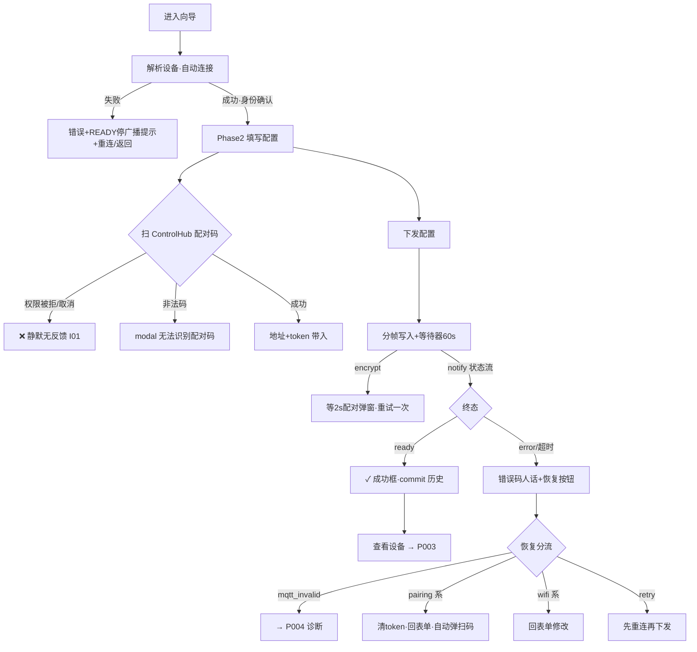

# P002 配网向导（pages/hid/add）

> 基线 `bf5d17e`。三段式向导（连接→填写配置→查看状态），全 App 风险最高链路：处理一次性配对 token 与 Wi-Fi 密码。
> 结论先行：**核心链路（连接→扫码→下发→状态跟踪→恢复）真实闭环，敏感数据流符合安全约束（仅内存/清空/不落日志）**；遗留 5 个问题，最重要的是扫码相机权限被拒时**完全静默**（点按钮无任何反应）和配置阶段 BLE 断开无 UI 反馈。

## 1. 页面基本信息

```text
页面名称：配置 Smart HID（navigationBarTitleText）
页面路径：pages/hid/add
页面类型：普通页（三段式向导）
进入方式：P001 设备卡「Smart HID 配网」；P003「重新配置」（先弹 READY 停广播确认）
退出方式：成功 redirectTo P003（栈替换，返回键不回向导 ✓）；goDevices switchTab P001；恢复动作进 P004；系统返回
是否登录后可访问：无登录体系
是否依赖权限：系统蓝牙；相机（uni.scanCode 扫 ControlHub 配对码）——权限被拒路径见 I01
是否依赖网络：否（BLE 直连设备；设备自己再去连 Wi-Fi/ControlHub）
```

## 2. 页面产品目的

把一台已确认身份的 Smart HID 设备的 Wi-Fi 凭据、ControlHub 地址和一次性配对 token 安全地下发到设备，实时跟踪设备侧状态机（连 Wi-Fi→配对→MQTT→READY），失败时按错误码给出针对性恢复路径。

## 3. 页面信息结构

```text
配网向导
├── provision-stepper（三步：连接 / 填写配置 / 查看状态，当前步高亮、已完成 ✓）
├── Phase 1 连接（v-if phase==='connect'）
│   ├── 说明文案 + 目标设备卡（名称 + deviceId）
│   ├── connecting 状态行（"连接并确认设备中…" 脉冲点）
│   ├── connectionError 错误框
│   ├── ready-hint（错误时出现）"READY 设备会关闭蓝牙广播，请先进入配网/恢复模式" ← FIX-04②
│   └── 按钮：重新连接（有设备时）/ 返回设备列表
├── Phase 2 填写配置
│   ├── 头部"设备已连接"徽章 + deviceInfoSummary（device_id · fw · state）
│   ├── Wi-Fi 名称（≤32）/ Wi-Fi 密码（password 掩码，≤64，可空）/ ControlHub 地址（提示默认端口 17892）
│   ├── 扫描 ControlHub 配对码大按钮（状态：必需/已获取；扫码后文案切换"地址仍可修改"）
│   ├── 隐私声明"W-Fi 密码和配对凭据只用于本次下发，不写入日志或本地存储"
│   └── 下发配置（canSubmit 门：ssid + 地址 + token + 非下发中）
└── Phase 3 查看状态
    ├── provision-progress 四行（Wi-Fi 连接 / ControlHub 配对 / MQTT 连接 / 设备控制链路就绪）
    │   状态：pending · active · done · fail · warn（notify 实时驱动）
    ├── 成功框（✓ 设备已就绪）或 errorMessage 错误框
    └── 按钮：查看设备（成功）/ 恢复动作（失败，按错误码变化文案）
```

## 4. 页面操作清单

| 操作ID | 用户操作 | UI入口 | 触发函数 | 预期结果 | 实际结果 | 后续页面 | 状态 |
| --- | --- | --- | --- | --- | --- | --- | --- |
| O01 | 进入页面自动连接 | onLoad | `initialize(options)`（add.vue:89） | 解析设备→自动 GATT 连接→过身份确认进配置 | 同预期；设备解析失败有错误+返回按钮 | 无 | ✅ |
| O02 | 重新连接 | Phase1 按钮 | `connectDevice`（composable:77-97） | 重试连接 | 同预期，失败有中文错误+ready-hint | 无 | ✅ |
| O03 | 返回设备列表 | Phase1 按钮 | `goDevices`（switchTab） | 回首页 | 同预期 | P001 | ✅ |
| O04 | 填写表单 | 三个输入框 | v-model | 实时更新 canSubmit | 同预期；下发按钮在缺 token 时禁用 | 无 | ✅ |
| O05 | 扫配对码 | 大按钮 | `scanControlHubQr`（composable:110-129） | 调相机→解析 QR→带入地址+token | 成功路径同预期；**fail 回调为空：权限被拒/取消时零反馈**（I01） | 无 | ⚠️ |
| O06 | 二维码无法识别 | 系统 modal | parse 返回 null 分支 | 提示"无法识别配对码" | 同预期（composable:116-122） | 无 | ✅ |
| O07 | 下发配置 | 主按钮 | `provision`（composable:140-185） | 分帧写入→跟踪状态→成功/失败 | 同预期（链路见 §5） | 无 | ✅ |
| O08 | 查看设备 | 成功主按钮 | `goDetail`（redirectTo） | 进设备详情 | 同预期；knownDevices 已 commit | P003 | ✅ |
| O09 | 恢复动作 | 失败副按钮 | `runRecovery`（composable:201-224） | 按错误码分流 | 同预期（四路见 §5） | P004 或本页 | ✅ |
| O10 | 离开页面 | onUnload | `dispose`（composable:232-236） | 清密码+清 hubInfo+断 BLE | 同预期（敏感清理 ✓） | 无 | ✅ |

## 5. 关键运行链路（逐层追踪）

### O01 连接链路（FIX-02/04 复核 ✅）

```text
onLoad(options) → initialize
→ hidStore.startProvisionSession()（resetProgress + clearError）
→ 设备解析 fallback：smartDevices（恒空，二期预留）→ knownDevices → currentDevice
→ smartHidService.connect(deviceId)（services/smart-hid/index.js:100-133）
   → transport.connect（transport.js:30-58）
      → ble-runtime.connectDevice → ensureAdapterReady()（FIX-02：冷启动直连不再 errCode 10000 ✓）
      → createBLEConnection(timeout 10s) → 服务发现（expectedServiceUuid 不匹配重试 3 次×400ms）
      → 服务/特征缺失 → 关闭连接 + 人话错误（"固件过旧"）
   → 订阅 INFO / STATUS notify → 读 Device Info
   → verifyDeviceInfo：product==='smart-hid' && protocol==='1.0' && HID-[A-Z0-9]{8}
      不通过 → 主动断开 + "目标设备不是兼容的 Smart HID Profile"（防误连）
→ 成功：deviceInfoSummary → phase='configure'
→ 失败：connectionError（errors.js 中文）+ ready-hint + 重新连接按钮
```

### O07 下发链路（时序/加密/分帧）

```text
canSubmit 门（ssid+地址+token）
→ buildProvisionFormCandidate（provision-form.js:3-18 地址防御校验：空白/非法字符/端口范围/IPv6 歧义拒绝）
→ buildProvisionCandidateJson（协议镜像：ssid≤32/pwd≤64/token 32hex 硬校验，不合法直接 throw）
→ phase='status' → provisionCandidate（smart-hid/index.js:150-180）
   ① beforeWrite：先建 waitForProvisionResult 等待器（60s 超时）——避免设备快速 status 在
      waiter 建立前丢失（代码注释明示此竞态防御 ✓）
   ② writeFrames：按协商 MTU 分帧、帧间隔 30ms 顺序写 INPUT 特征
   ③ 加密写失败（errCode 139/10006/10007 等）→ 等 2s（Just Works 系统配对弹窗）→ 重试一次
      → 再失败：setLastError + waiter.cancel + 抛出
→ await 等待器 → notify 状态流驱动 progress 四行（store/hid.applyProvisionStatus 状态机映射）
→ ok（state==='ready' 且无 error）：provisionDone + commitKnownDevice（lastWifi=ssid, lastHub）
→ 失败：describeStatus 错误码→人话（8 个码全映射）+ recoveryFor 分流
```

### O09 恢复四路（FIX-04③ 复核 ✅）

| 错误码 | recoveryAction | 行为 | 闭环判定 |
| --- | --- | --- | --- |
| mqtt_invalid | diagnostics | navigateTo P004 | ✅ |
| pairing_invalid / pairing_expired / pairing_used / controlhub_unreachable | pairing | 清 hubInfo → 回 configure → **自动弹扫码** | ✅（重新取一次性 token，正确） |
| wifi_failed / invalid_payload | form | 回 configure 改表单 | ✅ |
| 其他/超时/断开 | retry | `isConnected()` 检查 → 断开则先重连再下发（防无限失败循环，FIX-04③ ✓） | ✅ |

## 6. 接口依赖

无 HTTP。平台 API：createBLEConnection / getBLEDeviceServices / getBLEDeviceCharacteristics / notifyBLECharacteristicValueChange / writeBLECharacteristicValue（writeBLECharacteristicValue 默认带响应写）/ setBLEMTU / closeBLEConnection / **uni.scanCode（相机）** / uni.showModal / uni.showToast / uni.redirectTo / uni.switchTab。

数据协议（core/protocols/hid-provisioning-protocol.ts，受锁定镜像）：
- QR：`shid://pair?token=<32hex>&host=<ip>&port=<17892>`——token 形态、host 字符集、端口范围全部防御校验，非法返 null 走"无法识别"modal（协议:125-160）
- Candidate JSON：`{v:1, wifi_ssid, wifi_password, hub_host, hub_port, token}`，长度/形态硬校验（协议:91-106）
- Device Info / Status JSON：防御式解析，非法返 null

## 7. Store / 缓存 / 敏感数据审计（重点）

| 数据 | 生命周期 | 验证结果 |
| --- | --- | --- |
| Wi-Fi 密码 | composable 内存 ref | dispose 清空（composable:233）✓；密码框掩码 ✓；knownDevices 元信息**不含**密码 ✓ |
| 配对 token | hidStore.hubInfo（内存） | endProvisionSession 置 null（store/hid.js:182-186）✓；不持久化 ✓；恢复路径 pairing 主动清空再重扫 ✓ |
| 日志泄露 | logger | 仅记字节数/帧数（smart-hid/index.js:157），不打印内容 ✓ |
| knownDevices | 本地持久化 ≤20 条 | 仅非敏感元信息（deviceId/name/固件/协议/lastWifi=SSID/lastHub/时间）✓ |

**备注（非缺陷）**：candidate JSON 明文经 BLE 下发为协议 V1 固有约束（GATT 链路依赖系统 Just Works 加密）。

## 8. 页面生命周期审计

| 钩子 | 行为 | 判定 |
| --- | --- | --- |
| onLoad | initialize（自动连接） | ✅ |
| onUnload | dispose（敏感清理+断连） | ✅ |
| onHide | **无** | ⚠️ 下发过程中切后台：60s 等待器继续（setTimeout 不受影响），notify 依赖后台 BLE 回调——小程序后台 BLE 事件可能延迟，恢复前台后 progress 追上；无中断提示。可接受，记 P3 |
| 分享 | 无 onShareAppMessage | ✅ 向导页不分享，合理 |

## 9. 页面状态完整性

| 状态 | 实现 | 判定 |
| --- | --- | --- |
| 连接中 | 状态行脉冲 | ✅ |
| 连接失败 | 错误框 + ready-hint + 重连 | ✅（FIX-04 复核通过） |
| 表单不完整 | 下发按钮禁用 + 扫码状态"必需" | ✅ |
| 下发中 | progress 行 active 流转 + provisioning 禁用 | ✅ |
| 成功 | 成功框 + 查看设备 | ✅ |
| 失败×8 错误码 | 人话映射 + 定向恢复 | ✅ |
| 超时（60s 无终态） | 等待器 reject → retry 恢复（含重连） | ✅ |
| BLE 中途断开（配置阶段） | onDisconnect→setLastError，**页面无感知**（I02） | ⚠️ |
| 相机权限被拒 | fail 静默（I01） | ❌（唯一断点） |

## 10. 导航合理性

redirectTo 替换栈使"成功后返回"直接回 P001/P003 上下文，不卡向导 ✓；恢复分流不丢上下文（pairing/form 回 configure 保留已填 ssid/密码——**密码保留是便利与安全的权衡，页面仍在即保留合理**）；无深返回链。

## 11. 页面流程图



## 12. 问题清单

| ID | 问题 | 证据 | 严重度 | 建议 |
| --- | --- | --- | --- | --- |
| I01 | 扫码 fail 回调为空：相机权限被拒或取消时，点"扫描配对码"**无任何反馈**（死按钮感）；拒绝过一次后每次都静默 | `composables/use-smart-hid-provisioning.js:127` `fail: () => {}` | **P2** | fail 分支区分 `auth deny`（modal 引导 openSetting 开相机权限）与用户取消（静默/轻提示） |
| I02 | 配置阶段 BLE 断开无页面反馈：onDisconnect 仅 setLastError，composable 不监听；"设备已连接"徽章失真，直到点下发才报错（有兜底但反馈滞后一个用户动作） | `services/smart-hid/index.js:120-125`（断开只写 store）；composable 无 lastError/session watch；add.vue:27 徽章仅按 phase 渲染 | **P2** | composable watch `hidStore.lastError` 的 ble_disconnected → 顶部插入"连接已断开，请重新连接"条并允许一键回 Phase1 |
| I03 | 双套恢复映射并存：真实现是 composable 的 `recoveryFor`（form/pairing/diagnostics/retry）；`workflow.js smartHidRecoveryAction`（wifi/pairing_qr/…）仅作为 profile 契约注册、**零消费方**，且两套词表不一致（wifi vs form），存在改一处漏一处的漂移风险 | `services/smart-hid/workflow.js:13-28`；`profile.js:57`；消费方 grep 仅注册处 | P3 | 删除 workflow 侧映射或在注释中声明唯一事实源，避免双源 |
| I04 | 设备解析 fallback 首环 `smartDevices` 恒为空（零写入方的二期预留），当前等价于两环链 | `composable:103`；`store/hid.js:43` | P3 | 保持但已有注释；或审计二期落地时回收 |
| I05 | 成功后 commit 的 name 取扫描名（SHID-xxxxx 形态），P003/P005 列表也显示该名，与 device_id（HID-xxxxxxxx）两套编号并存增加理解成本 | `store/hid.js:153`（name: device.name）；协议双编号（SHID- 广播名 / HID- device_id） | P3 | knownDevices 同时存两号并区分展示（"设备名 / 出厂编号"） |

**假完成检查：无。**10 项操作 8✅ 1⚠️ 1❌（❌=I01 权限拒绝路径）。状态机映射、等待器时序、加密重试、恢复分流均为真实实现且与固件状态机（PROVISIONING_V1）对齐。

## 13. 合理性与完成度评价

```text
产品合理性：A-   三段式向导 + notify 实时进度 + 错误码定向恢复，是成熟 IoT 配网交互范型
功能完成度：90%  全链路真实闭环；扣分=相机权限拒绝死路（I01）
交互完整度：75%  扫码静默（I01）、断开失真（I02）
异常完整度：80%  8 个错误码全人话映射 + 超时兜底 + 加密重试；缺权限态与断开即时反馈
```

- 页面是否应该存在：✅ 核心流程。
- 是否缺关键内容：SSID 只能手输（协议 V2 的 Wi-Fi 扫描特征是已知 backlog）；权限拒绝引导。
- 用户理解成本：token/Hub/地址三概念对普通用户偏高（产品定位决定，隐私声明已尽力缓解）。
