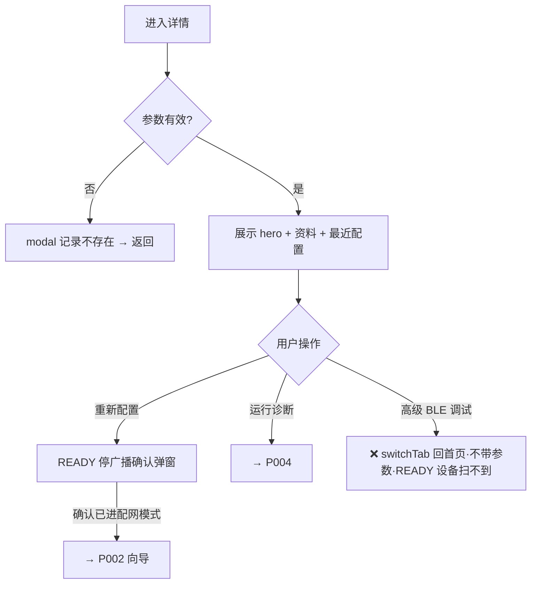

# P003 Smart HID 设备详情（pages/hid/detail）

> 基线 `bf5d17e`。配网成功后的落地页 + 历史设备的资料页。
> 结论先行：**「重新配置」「运行诊断」两条主链路真实闭环（FIX-04①④ 复核通过）；「高级 BLE 调试」是假完成按钮**——文案承诺调试，实际 switchTab 回首页，且不带 deviceId、READY 设备在首页也扫不到。

## 1. 基本信息

```text
页面名称：Smart HID 设备（navigationBarTitleText，FIX-07 已与通用详情区分）
页面路径：pages/hid/detail
页面类型：普通页（资料/管理页）
进入方式：P002 配网成功 redirectTo；P005 点历史记录
退出方式：navigateTo P002 / P004；switchTab P001；系统返回
是否登录后可访问：无登录体系   是否依赖权限：间接（后续页面需要蓝牙）
是否依赖网络：否（纯本地数据展示）
```

## 2. 页面产品目的

让完成配网的用户回看这台设备"上次配成了什么样"（固件/协议/SSID/Hub），并在需要时重新配置或诊断。本质是**本地记录页**，不是实时状态页（页面文案已诚实声明"最近一次配网信息"）。

## 3. 信息结构

```text
Smart HID 设备详情
├── hero 卡（kicker "Smart HID Device" + 设备名 + 副标题说明）
│   └── chips：deviceId（mono）+ 协议（success 绿）
├── 设备资料卡：Device ID / 固件版本 / 协议        ← deviceId、协议与 hero 重复
├── 最近配置卡：Wi-Fi（SSID）/ ControlHub（host:port）
└── 操作：重新配置（主）/ 运行诊断（次）/ 高级 BLE 调试（ghost）
```

## 4. 操作清单

| 操作ID | 用户操作 | 触发函数 | 预期结果 | 实际结果 | 后续页面 | 状态 |
| --- | --- | --- | --- | --- | --- | --- |
| O01 | 重新配置 | `reconfigure`（detail.vue:82-97） | 引导后进配网向导 | 先弹 READY 停广播确认（FIX-04① ✓）→ 确认后 setCurrentDevice + navigateTo | P002 | ✅ |
| O02 | 运行诊断 | `goDiagnostics`（:99-101） | 进诊断页带 deviceId | 同预期 | P004 | ✅ |
| O03 | 高级 BLE 调试 | `goAdvancedBle`（:103-105） | 进调试界面 | **switchTab 回首页**：不带 deviceId、无任何调试落点；READY 设备已停广播，首页也扫不到它 → 双重死路 | P001 | ❌ 假完成 |
| O04 | 参数无效进入 | onLoad 守卫（:75-80） | 提示并退回 | modal"设备记录不存在"+ navigateBack | 调用方 | ✅ |

## 5. 数据与状态

- 数据源：`[currentDevice, ...knownDevices]` 按 deviceId 查找（detail.vue:70-73）。配网成功路径 currentDevice 含 Device Info 合并字段；历史路径取 knownDevices 元信息——两路字段齐备（firmware/protocol/lastWifi/lastHub 均有值）✓。
- 纯展示页，无写操作、无生命周期钩子（onLoad 之外）、无分享——与定位一致。
- 已知缺口：knownDevices 存了 `hardware` 字段但页面不展示（I03）。

## 6. 问题清单

| ID | 问题 | 证据 | 严重度 | 建议 |
| --- | --- | --- | --- | --- |
| I01 | 「高级 BLE 调试」假完成：文案承诺调试能力，实际仅 switchTab 回首页；且不带 deviceId、READY 设备（停广播）在首页扫描列表根本找不到——对已配网设备此按钮永远无法达成其字面承诺 | `detail.vue:103-105`（仅 switchTab）；固件事实：READY 停广播 | **P2** | 方案 a：去掉该按钮；方案 b：改为 navigateTo `device/detail?deviceId=`（通用调试页本来就支持 store 查找降级） |
| I02 | 内容重复：deviceId 出现 2 次（hero chip :12-14 + 设备资料行 :25-27）、协议出现 2 次（hero chip :15-17 + 资料行 :33-36） | 引用如左 | P3 | hero 保留 chips，设备资料卡改放 firmware/hardware/配网时间等增量字段 |
| I03 | `hardware` 字段已持久化但无任何页面展示（内容丢失） | `store/hid.js:155` 存 / `detail.vue` 无引用 | P4 | 设备资料卡加"硬件版本"行 |
| I04 | hero 协议 chip 用 success 绿色，暗示"状态正常"，实际只是协议号快照，色彩语义过度 | `detail.vue:15-17` `ble-chip-success` | P4 | 改中性 chip |

**假完成检查：1 处（I01）。**

## 7. 流程图



## 8. 评价

```text
产品合理性：B    资料页定位清晰，三按钮主次合理；被一个假按钮拖累
功能完成度：80%  2/3 动作闭环，1 假完成
交互完整度：75%  守卫完整；重复信息降低信噪比
异常完整度：85%  无效参数自兜底；无其他异常面
```
