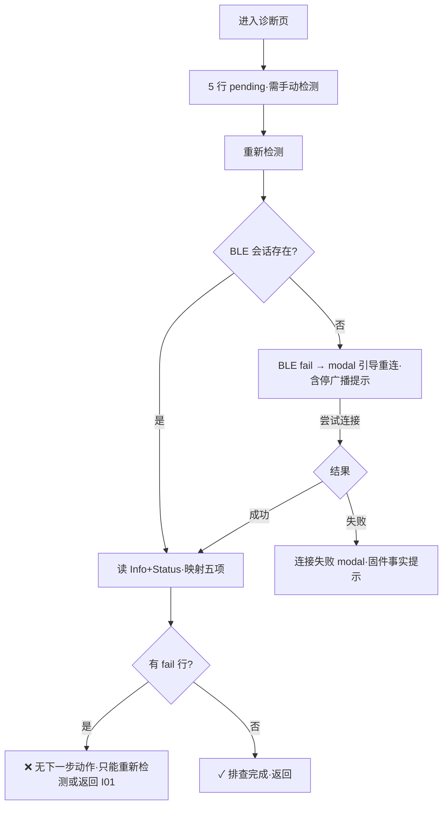

# P004 诊断（pages/hid/diagnostics）

> 基线 `bf5d17e`。五项链路诊断工具页，无出边孤岛页。
> 结论先行：**诊断本身的读链路与会话所有权（FIX-03）复核通过、READY 停广播引导（FIX-04④）两处到位；但"诊断出问题之后没有任何下一步动作"——查出 ControlHub 配对失败也只能反复"重新检测"，恢复动作全部只在 P002**。

## 1. 基本信息

```text
页面名称：诊断
页面路径：pages/hid/diagnostics
页面类型：普通页（工具页，出边 0）
进入方式：P003「运行诊断」；P002 恢复动作（mqtt_invalid）
退出方式：系统返回（唯一）
是否依赖权限：蓝牙   是否依赖网络：否（读设备侧状态）
```

## 2. 页面产品目的

回答"这台设备现在卡在哪一环"：BLE / Wi-Fi / ControlHub / MQTT / Ready 五项，各给 ok/warn/fail/待检测，并展示原始错误码辅助排查。

## 3. 信息结构

```text
诊断页
├── 诊断卡
│   ├── 5 行诊断项（状态点 + 标签 + 状态文案 + detail）
│   ├── 重新检测（主按钮，connecting 态禁用变"连接中…"）
│   ├── 显示错误码 toggle
│   └── 错误详情（code + message，v-if 展开且有 lastError）
```

## 4. 操作清单

| 操作ID | 用户操作 | 触发函数 | 预期结果 | 实际结果 | 状态 |
| --- | --- | --- | --- | --- | --- |
| O01 | 进入页面 | onLoad 仅存 deviceId（:56-58） | 直观期待：自动开始诊断 | **不自动诊断**：首屏 5 行全 pending（或残留 store 上次结果），需手动点重新检测（I02） | ⚠️ |
| O02 | 重新检测 | `refresh`（:69-97） | toast→diagnose→刷新 | 有会话：读 INFO+STATUS 映射五项 ✓；无会话：BLE=fail → modal 引导重连（含 READY 停广播提示，FIX-04④ ✓）→ 尝试连接 → 成功则复检、失败则带固件事实的 modal | ✅ |
| O03 | 显示错误码 | `toggleAdvanced` | 展开 code/message | 同预期；lastError 为全局最近错误，无时间戳（I04） | ⚠️ |
| O04 | 离开页面 | onUnload（:59-64） | 正确清理会话 | **FIX-03 复核通过**：仅断开本页建立的连接（connectedHere），且配网向导仍在栈中时不断开（provisionOwnerAlive 检查） | ✅ |

## 5. 运行链路

```text
refresh → smartHidService.diagnose()（services/smart-hid/index.js:202-234）
  无会话 → 直接返回 ble=fail 的五项（不尝试连接，由 UI 引导）
  有会话 → 并行读 Device Info + Provision Status → 按 state/step/error 三维映射：
    wifi ok/active/fail、hub（pairing 系错误 fail）、conn（mqtt_invalid fail / ready ok）、
    usb（state==='ready' ok，detail 明示"BLE 状态不等同于 USB HID 真机验收"）
  → hidStore.setDiagnostic → 页面 computed 刷新
重连引导 → smartHidService.connect(deviceId) → ensureAdapterReady（FIX-02 ✓）
  → READY 设备：广播已停 → 10002/超时 → errors.js 中文 + 停广播提示 modal
```

## 6. 问题清单

| ID | 问题 | 证据 | 严重度 | 建议 |
| --- | --- | --- | --- | --- |
| I01 | 诊断结果无行动出口：hub 行 fail（如 pairing_expired）时，本页只有"重新检测"；针对性恢复（重新扫码/改配置）只存在于 P002 的失败分支——从 P003 直接进诊断的用户找不到修复路径，只能原路返回自己想办法 | `diagnostics.vue:16-27`（仅两个按钮）；恢复映射唯一消费方在 `use-smart-hid-provisioning.js:187-192` | **P2** | 按 fail 行渲染定向按钮（hub fail→"重新配置并扫码"、wifi fail→"修改 Wi-Fi"），复用 P002 的 recoveryFor 映射 |
| I02 | 进入不自动诊断，首屏全 pending 需手动触发；从 P002 恢复路径进来时（session 活着）本可一键出结果 | `diagnostics.vue:56-58`（onLoad 仅存参） | P3 | onLoad（或 onShow）自动调用一次 refresh |
| I03 | 标签漂移：页面 fallback 数组 `控制连接` vs 服务层 `控制连接 (MQTT)` | `diagnostics.vue:51` vs `smart-hid/index.js:208` | P4 | fallback 删掉或对齐服务层 |
| I04 | "最近错误"无时间戳，可能是很久以前会话的 lastError，误导当次排查 | `diagnostics.vue:23-27`；`store/hid.js:82-89`（lastError 无 at 字段） | P4 | setLastError 附时间戳，UI 显示"hh:mm 前" |

**假完成检查：无**（所有按钮真实工作），但 I01 属"流程不完整"。

## 7. 流程图



## 8. 评价

```text
产品合理性：B-   诊断维度与映射设计扎实，但孤岛式"只诊不治"削弱存在意义
功能完成度：75%  诊断链路真；缺自动触发、缺行动出口
交互完整度：70%  手动门槛 + 无定向恢复
异常完整度：80%  无会话/连接失败/READY 三种异常都有人话闭环
```
