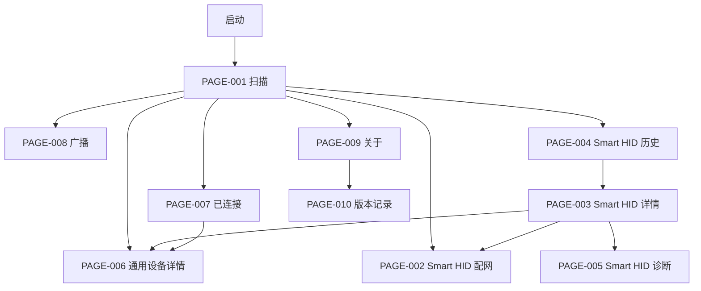

# UniApp 核心用户流程

## 全局导航

## FLOW-001 首次启动与扫描

**目标**：第一次进入的用户能明确知道平台是否可扫描，并找到 ESP32 或普通 BLE 设备。

1. 启动进入 PAGE-001。
2. 页面展示 BLE/平台状态和“开始扫描”。
3. 权限未决定时请求必要权限；拒绝时解释原因并提供设置入口。
4. 扫描过程中持续更新设备、RSSI 和结果数量。
5. 到时、手动停止或离开页面均结束本次扫描会话。
6. 无结果显示空态；失败显示错误和重试。

通过标准：Android 和微信真机均能连续完成两轮扫描，不重复设备、不残留旧扫描、不把失败显示成空结果。

## FLOW-002 广播数据检查

**目标**：在连接前判断设备身份和广播内容。

1. 用户点击设备卡片主体。
2. 打开广播快照，不触发连接。
3. 展示显示名、完整 deviceId、RSSI、Service UUID、Manufacturer Data、Service Data 和原始字节。
4. 用户可复制完整内容并关闭。

通过标准：无字段、空字段和值明确区分；复制内容与页面一致。

## FLOW-003 通用 GATT 调试

**目标**：从任意设备完成连接、发现、读写和 Notify。

1. 用户点击“连接”，扫描停止。
2. PAGE-006 显示连接中、成功或失败状态。
3. 成功后展示服务/特征值及权限。
4. 用户执行 Read、TEXT/HEX Write、Notify。
5. 每次操作在设备日志中产生结果；失败可恢复。
6. 离开详情后会话保留在 PAGE-007；主动断开才清理。

通过标准：使用 ESP32 权限服务逐项验证，事件不串到其他设备。

## FLOW-004 多设备与断线恢复

**目标**：同时维护多台设备并处理主动/被动断开。

1. 用户依次连接两台参考设备。
2. PAGE-007 展示两个独立会话。
3. 任一设备 Notify 不影响另一设备日志。
4. 单独断开只移除目标；全部断开汇总失败项。
5. 设备断电触发离线和有限重连；用户主动断开不得自动重连。

## FLOW-005 ESP32 功能验收

**目标**：用公开硬件完成 Core 功能的可重复演示。

1. 刷入指定固件并记录 commit/固件版本。
2. 扫描识别 `BLEToolkit-Server`。
3. 连接后发现主服务、权限服务和 OTA 服务。
4. 发送开、关、快闪、慢闪命令并观察 LED 与响应。
5. 验证只读、只写、Notify、组合权限和周期状态。
6. 断电、重启、错误命令后客户端状态正确恢复。

## FLOW-006 广播 / Peripheral

**目标**：让手机作为 BLE 外设并由第二设备观察。

1. 进入 PAGE-008，显示当前平台与支持状态。
2. 配置名称、UUID、Manufacturer Data，并实时计算字节。
3. 不合法或超过 31 字节时禁止开始。
4. 平台准备成功后才显示“广播中”。
5. 第二手机或 nRF Connect 发现并核对广播内容。
6. 停止或离页后观察端不再发现，扫描模式可重新进入。

Android App 和微信小程序分别保存证据；H5 显示不支持。

## FLOW-007 OTA

**目标**：安全升级 ESP32，并以设备确认和版本回读作为成功标准。

1. 连接支持 OTA 的 ESP32。
2. 选择固件，客户端验证文件与大小。
3. 发送 Start，等待 Ready。
4. 分包写入并显示进度；允许取消。
5. 发送 Commit，等待设备 Success。
6. ESP32 重启后重新连接并回读目标版本。

取消、断线、超时、错误包、空间不足和版本不一致必须失败，不得停留在成功页。

## FLOW-008 Smart HID 配网

**目标**：从统一扫描入口完成 Smart HID 首次配置。

1. Profile 匹配后显示“Smart HID 配网”。
2. PAGE-002 自动连接并读取 Device Info，弱匹配必须确认身份。
3. 用户填写 Wi-Fi 和 Hub 地址，扫描一次性二维码。
4. token 只在内存存在；候选配置分帧下发。
5. 页面显示 Wi-Fi、Pairing、MQTT、Ready 进度。
6. Ready 后写入非敏感历史并进入 PAGE-003。
7. 错误进入唯一恢复动作，不建立第二套扫描器。

## FLOW-009 历史、诊断与重新配置

**目标**：用户可以从历史记录继续管理 Smart HID。

1. PAGE-001 历史区或 PAGE-004 打开设备。
2. PAGE-003 明确数据是历史快照，不冒充在线状态。
3. 用户可进入 PAGE-005 重新连接并读取实时诊断。
4. 重新配置前提示 READY 设备需进入配网/恢复模式。
5. 返回时保留正确的页面栈和设备上下文。

## FLOW-010 产品与开源入口

**目标**：用户理解产品、平台限制、硬件和参与方式。

1. PAGE-009 展示名称、版本、能力和开源链接。
2. PAGE-010 展示与当前版本一致的变更记录。
3. 公开落地页提供体验/下载、ESP32 教程、HTML 原型、测试状态和贡献入口。
