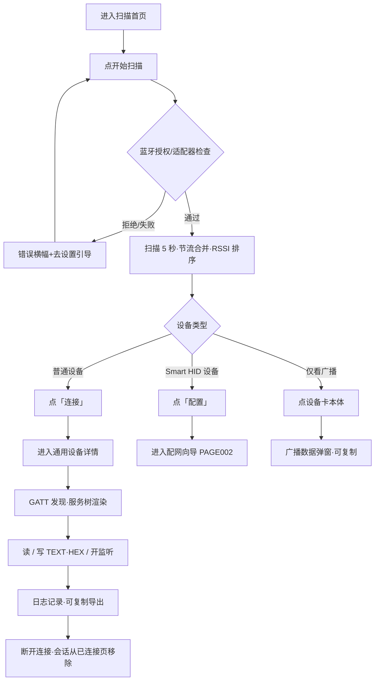
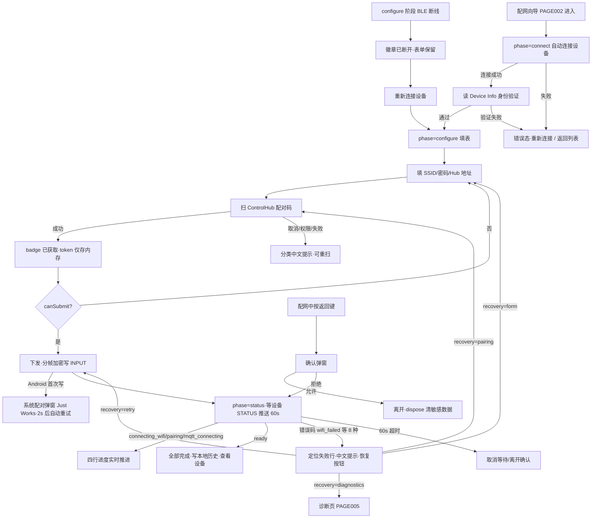
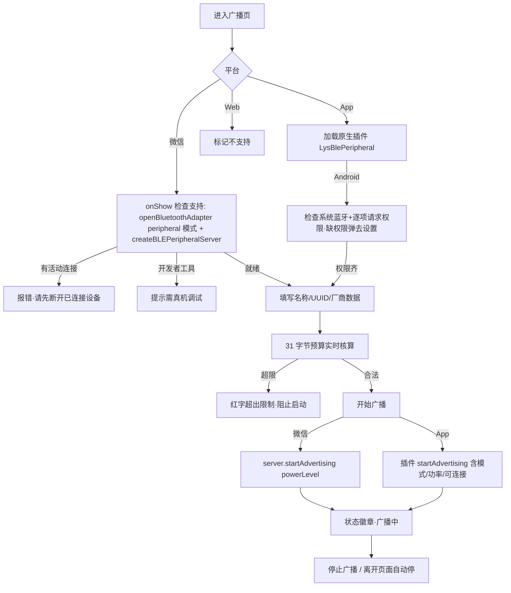
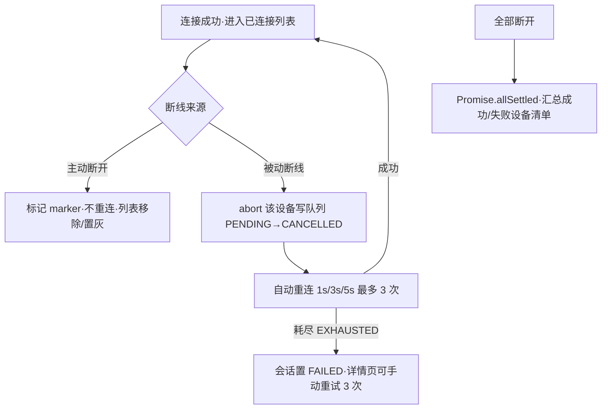
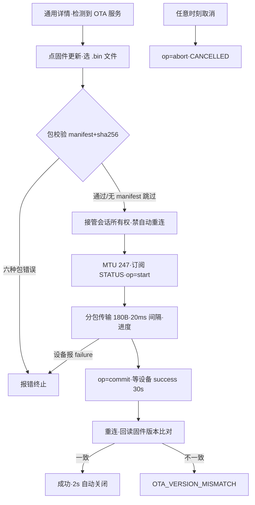
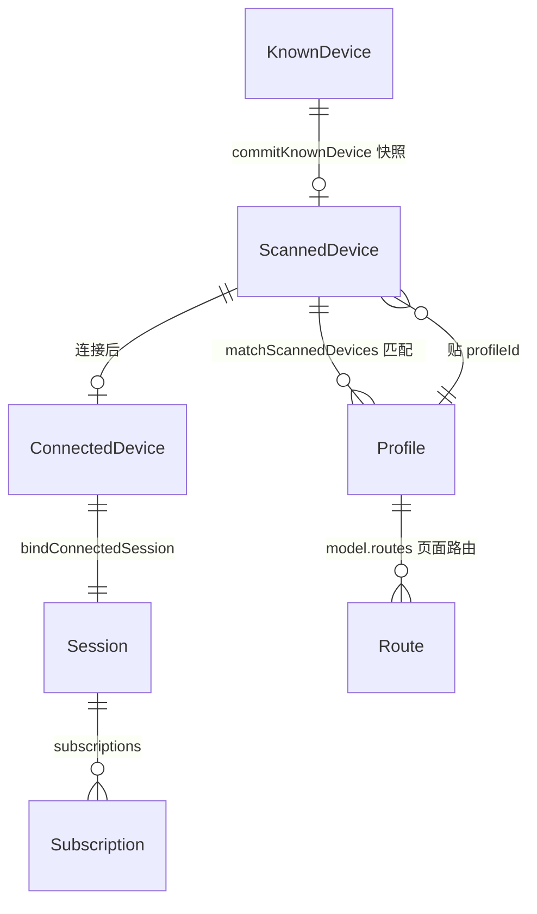

# 旧项目逆向分析报告 —— BLE Toolkit+（smart-ble uniapp 小程序）

> 生成日期：2026-09-02
> 分析对象：`/Users/luoyaosheng/Desktop/project/Open/smart-ble/apps/uniapp/`（uni-app 工程，HBuilderX 直接导入）
> 佐证材料：仓库根 `core/`（跨端共享层）、`docs/`（既有设计文档，仅作交叉验证，不作事实源）
> 代码基线：smart-ble 仓库 main 分支 HEAD `d305d3d`（2026-09-02 时点工作区）
> 说明：本报告所有事实均来自源码/配置/测试/资源文件，逐条附来源路径。无法确认的标【未知】。

---

# 1. 项目概述

## 1.1 产品定位

BLE Toolkit+ 是开源项目 **Smart BLE** 的微信小程序客户端，定位为「面向 UniApp、微信小程序与 ESP32 协同验证的 BLE 调试工具」。

真实产品模型：**通用 BLE Inspector（检查器） + 可扩展设备 Profile（档案）系统**。核心不是某一个硬件，而是提供从发现 BLE 设备、查看广播、连接 GATT、调试通信、升级固件，到接入第一方硬件 Profile（Smart HID 配网）的完整工具链。

- 来源：`manifest.json:2-4`（name "BLE Toolkit+"，description "蓝牙调试工具"）、`config/product.js`（PRODUCT_INFO.summary）、仓库根 `README.md`（产品家族表：uni-app 角色 = 「小程序与轻量传播入口」）、`docs/product-reconstruction/00_PRODUCT_OVERVIEW.md`（交叉验证一致）

命名沿革（同一产品三个名字，属历史遗留事实）：
| 名字 | 出现位置 | 含义 |
|---|---|---|
| BLE Toolkit+ | `manifest.json:2`、`pages.json:6` | 当前对外名 |
| LightBLE | `apps/uniapp/package.json:2` | 历史线名（README 称 "LightBLE 历史线"） |
| HJWY_BLE | `project.config.json:20` | 微信开发者工具工程名 |
| Smart BLE | 仓库根 `README.md` | 总项目名 |

版本：versionName **1.0.5** / versionCode 101（`manifest.json:5-6`）；release-metadata 同为 1.0.5 / build 101 / channel `preview` / overall_status `PREVIEW`（`config/release-metadata.generated.js`，脚本生成 DO NOT EDIT）。

## 1.2 技术架构

- **框架**：uni-app（HBuilderX 工程，无 CLI 构建脚本入口，`vite.config.js` 仅为 APP 平台 E5 测试构建的 rollup 修正）+ **Vue 3**（`manifest.json:125` vueVersion "3"）+ `<script setup>` 组合式 API
- **状态管理**：Pinia（`main.js:2,8-9`，两个 store：`store/ble.js`、`store/hid.js`）
- **UI**：无第三方 UI 库实际使用——`@dcloudio/uni-ui` 在 package.json 声明且 pages.json 有 easycom 规则（`pages.json:84-90`），但**全仓 pages/components 无任何 `<uni-` 组件标签**（grep 验证）；`fui-*`（firstui）easycom 规则指向不存在的 `@/components/firstui/` 目录，属死配置。视觉全部自建：`styles/design-system.css` 的 `--ble-*` CSS 变量是小程序侧唯一 token 来源（`App.vue:16-19` 注释）
- **条件编译多端**：`#ifdef MP-WEIXIN / APP-PLUS / APP-ANDROID / APP-IOS / H5` 贯穿广播页、关于页、OTA 弹窗、扫码权限等处；`pages.json`/`manifest.json` 声明 mp-alipay/mp-baidu/mp-toutiao，但未见专门适配代码
- **分层架构**（页面 → 组合式函数 → Pinia store → 服务层 → 平台 API）：
  - 服务层刻意「纯 JS 化」，平台调用（uni.*/wx.*/plus.*）收敛在 `services/ble-runtime/index.js`（经 `platform.js` 注入）、`services/scan-permission.js`、`services/wx-peripheral-*.js`、`pages/broadcast/index.vue` 少数几个文件
  - 与 monorepo 共享核心 `core/`（仓库根）通过相对路径直接 import（14 个文件引用，无 npm 包装）：`core/protocols/hid-provisioning-protocol.ts`（协议镜像）、`core/ble-core/provisioning/{framing,framing-strategies,profile-contract}.js`、`core/ble-core/utils/logger` 等
- **后端依赖**：**无**。小程序零 HTTP 请求、零登录体系，全部能力本地 + BLE + 扫码（`config/product.js` website/feedback 均为外链展示）。Smart HID 配网中 ControlHub 地址/凭据由用户扫码输入，经 BLE 下发，不经过任何服务端

## 1.3 用户类型

来源：`docs/product-reconstruction/00_PRODUCT_OVERVIEW.md`（与功能面交叉验证一致）：
- BLE 固件开发者、硬件工程师（调试自研设备/固件 OTA）
- 测试与售后人员（现场验证设备广播/连接）
- Android/iOS/微信 BLE 开发者、学习 BLE 协议的开发者（观察广播数据、GATT 结构）
- 自研硬件接入者（Smart HID 设备配网、ESP32 演示设备验证）

## 1.4 核心价值

1. **通用 BLE 调试**：扫描（5s 会话/节流合并/RSSI 排序）→ 筛选（信号/前缀/隐藏无名）→ 查看原始广播数据 → 连接 → GATT 服务树浏览 → 特征读/写（TEXT/HEX）/notify 监听 → 通信日志（复制导出）
2. **设备 Profile 系统**：扫描结果按注册 Profile（UUID/名称前缀）识别并给出专属动作；Smart HID 是首个第一方 Profile（配网全流程），esp32-demo 为第二注册档案（证明可扩展）
3. **Smart HID 配网**：三步向导（连接→填表→状态），扫码取 ControlHub 配对码，分帧加密写入，状态机驱动四行进度，错误码→恢复动作映射
4. **BLE 广播发射**：手机变 BLE 外设（微信 peripheral API / App 原生插件双路径），31 字节预算实时核算
5. **OTA 固件升级**：包校验（manifest+sha256）→ 分包传输 → 提交 → 版本回读验证（release-metadata 标注 BLOCKED，见 §9）

---

# 2. 项目结构分析

```
apps/uniapp/                        ← HBuilderX 工程根（本报告分析对象）
├── pages.json                      ← 10 页注册 + 4 tabBar + easycom 规则
├── manifest.json                   ← 多端清单（appid/权限/原生插件声明）
├── main.js                         ← Vue3+Pinia 装配；import builtins.js（Profile 注册副作用）
├── App.vue                         ← 生命周期日志 + 引入 design-system.css
├── project.config.json             ← 微信开发者工具配置（appid wxf6c58b1dcac4c82d）
├── env.js / vite.config.js / jest.config.js / sitemap.json / uni.promisify.adaptor.js
├── pages/                          ← 页面层（10 页，见 §3/§4）
│   ├── index/ connected/ broadcast/ about/（4 个 tab 级）
│   ├── hid/（add detail history diagnostics，4 页二级路由）
│   └── device/detail（通用 GATT 调试二级页）
│   └── index.test.js + page-flow.test.js（uni-automator E2E）
├── components/                     ← 公共组件层（15 个 .vue，见 §2.2）
├── composables/                    ← 组合式函数层（4 个，每页一个专属编排器）
│   └── use-ble-scan / use-device-session / use-broadcast-session / use-smart-hid-provisioning
├── store/                          ← Pinia 数据层（ble.js 通用会话 / hid.js Smart HID）
├── services/                       ← 服务层（60+ 文件，平台无关为主）
│   ├── ble-runtime/                ← BLE 运行时（16 文件：连接/发现/读写队列/重连/会话注册表）
│   ├── provisioning/               ← 设备无关配网框架（transport/profiles/orchestrator/builtins/导航）
│   ├── smart-hid/                  ← Smart HID 专属层（11 文件：门面/Profile/工作流引擎/表单/历史）
│   ├── broadcast/                  ← 广播会话/适配器/负载预算/观察证据（6 文件）
│   ├── ota/                        ← OTA 事务状态机/包模型/校验器（3 文件）
│   ├── esp32-demo/profile.js       ← ESP32 演示 Profile
│   └── 散装 13 文件                 ← 权限/路由上下文/断开汇总/版本元数据/日志脱敏/wx 外围双控制器等
├── utils/                          ← advertising-payload / ble-utils / ota_manager(注入适配)
├── config/                         ← product.js（产品信息/推广位）+ release-metadata.generated.*
├── locale/                         ← zh-CN.json / en-US.json（各 32 key，未接线，见 §9）
├── static/                         ← logo/share/tabs 8 图/placeholders 8 图/brand/other-apps
├── styles/design-system.css        ← --ble-* 设计 token 唯一来源
└── nativeplugins/LysBlePeripheral/ ← App 端原生广播插件（Android AAR + iOS framework）

（仓库根，非本工程但被直接 import）
core/
├── protocols/                      ← 协议正典镜像：hid-provisioning-protocol.ts / smart-ble-protocol.ts /
│   │                                  hid-command-schema.ts / smart-hid-contract.lock.json
└── ble-core/                       ← 跨端共享：provisioning/{framing,framing-strategies,profile-contract}、
                                       utils/{logger,command-queue,data-converter}、types/、interfaces/adapter.ts、
                                       components/*.js（Electron 端 Web Components，同名双实现非复用）
```

## 2.1 页面目录（10 页，pages.json 与 page-flow.test.js 双重锁定正典清单）

见 §3 页面清单。

## 2.2 公共组件（15 个，`components/`，全部 `<script setup>` 已实现）

| 组件 | 职责 | 关键 Props/Emits | 使用方 |
|---|---|---|---|
| common/app-navbar | 自绘导航栏（微信胶囊安全区适配） | kicker/title/statusText/statusActive；slot action | index、connected |
| common/empty-state | 空态占位卡 | image/title/description/actionLabel；emit action | index、connected、hid/history |
| common/error-banner | 错误横幅（role=alert） | title/message/actionLabel；emit action | scan-summary 内嵌 |
| common/operation-state | 四态组件（empty/loading/error/success/idle） | state/title/description/image/actionLabel | hid/add、service-panel |
| device-card/device-card | 设备卡（最大展示组件 251 行）：头像/名称/类型徽章/RSSI 四格信号条/按钮组 | device/isConnectionTab；emit click/action/generic/profile | index、connected |
| filter-panel/filter-panel | 扫描过滤器（v-model） | modelValue {rssi,prefix,hideNoName} | index |
| scan/scan-summary | 扫描工具条（状态/计数/启停按钮+错误横幅） | filteredCount/deviceCount/connectedCount/scanning/error；emit toggle/retry | index |
| scan/advertisement-dialog | 广播原始数据弹窗（纯文本报告+复制） | visible/device；emit close/copy | index |
| service-panel/service-panel | GATT 服务/特征折叠树（按 properties 条件渲染读/写/监听按钮） | services/state/errorMessage/retryDisabled；emit read/write/notifyToggle/retry | device/detail |
| write-dialog/write-dialog | 写入弹窗（TEXT/HEX 单选+输入） | visible/isSending；emit update:visible/confirm | device/detail |
| log-panel/log-panel | 通信日志面板（dock/card 两变体；中英文类型→六色 chip） | logs/scrollTop/variant/clearable…；emit clear | device/detail、broadcast |
| ota-dialog/ota-dialog | OTA 完整交互弹窗（非受控，选文件→传输→进度） | visible/deviceId；emit close | device/detail |
| hid/provision-stepper | 配网三步骤条（连接→填写配置→查看状态） | steps/current | hid/add |
| hid/provision-progress | 配网四行进度（Wi-Fi/ControlHub/MQTT/控制链路） | rows [{key,state,label}] | hid/add |
| about/app-card | 推广小程序卡片 | app；emit select | about/index |

## 2.3 服务层模块地图

| 模块 | 文件数 | 职责 | 关键事实 |
|---|---|---|---|
| ble-runtime | 16 | uni BLE 全局回调唯一所有者 + 会话注册表 + 写队列 + 重连 | 连接态机 8 态；同 deviceId 并发连接去重；主动断开 2s marker 区分被动断线；写队列同设备串行/跨设备并行/超时 5s/深 16；重连 3 次上限 backoff 1s/3s/5s，USER_REQUEST 永不重连 |
| provisioning | 5 | 设备无关配网框架 | Profile 注册表（契约在 core/ble-core/provisioning/profile-contract.js）；GATT transport（MTU 247、写帧间隔 30ms、加密写失败 2s 重试一次）；builtins.js 被 main.js import 即注册 smart-hid + esp32-demo |
| smart-hid | 11 | Smart HID 专属层 | smartHidService 门面（connect/provisionAndWait 60s/diagnose…）；workflow-engine 纯 JS 状态机（DISCOVERING→PAIRING→VERIFYING→PROVISIONED，可 CANCELLED）；token 仅内存 5 分钟 TTL |
| broadcast | 6 | 广播会话（单 owner）+ 负载预算 | BROADCAST_STATE 6 态；广播中禁改 payload（OWNER_BUSY）；31 字节预算不静默截断（PAYLOAD_TOO_LARGE） |
| ota | 3 | OTA 事务 | 12 态状态机；chunk 180B/20ms 间隔 writeNoResponse；commit 后重连回读版本验证 |
| 散装服务 | 13 | 权限/导航/汇总/元数据 | scan-permission 是唯一直调 wx.* 的服务；hid-navigation.js 整文件 @deprecated 兼容层 |

## 2.4 数据层

- `store/ble.js`（249 行）：扫描会话 + 已连接设备表（内存 reactive Map）
- `store/hid.js`（200 行）：Smart HID 会话/进度/诊断 + knownDevices（**唯一本地持久化**，key `smart_ble.smart_hid.known_devices.v1`，uni.getStorageSync，90 天 TTL、上限 20 条、敏感字段不入库——文件头注释明示 hubInfo.token/Wi-Fi 密码不落盘）
- `core/ble-core/utils/logger`：全局日志单例（历史 500 条/单设备 200 条/LRU 40 设备），镜像 console；敏感键脱敏真实在 `services/logger/log-redaction.js`（token/password/secret…→'***'）

---

# 3. 页面清单

| 编号 | 页面 | 入口 | 文件 | 状态 |
| ---- | ---- | ---- | ---- | ---- |
| PAGE001 | 扫描首页（tabBar「扫描」） | tabBar | pages/index/index.vue | 已实现 |
| PAGE002 | Smart HID 配网向导 | 首页 SHID 设备卡「配置」/已知设备「查看→重新配置」/诊断页「重新配网」 | pages/hid/add.vue | 已实现 |
| PAGE003 | Smart HID 设备详情 | 首页已知设备「查看」/历史页点击条目 | pages/hid/detail.vue | 已实现 |
| PAGE004 | Smart HID 历史 | 首页「全部历史」按钮 | pages/hid/history.vue | 已实现 |
| PAGE005 | Smart HID 诊断 | 详情页「运行诊断」/配网失败恢复入口 | pages/hid/diagnostics.vue | 已实现 |
| PAGE006 | 通用设备详情（GATT 调试） | 扫描卡「连接」/已连接页点击/SHID 详情「高级 BLE 调试」 | pages/device/detail.vue | 已实现 |
| PAGE007 | 已连接设备（tabBar「已连接」） | tabBar | pages/connected/index.vue | 已实现 |
| PAGE008 | BLE 广播（tabBar「广播」） | tabBar | pages/broadcast/index.vue | 已实现（能力按平台差异，见 §4.8） |
| PAGE009 | 关于（tabBar「关于」） | tabBar | pages/about/index.vue | 已实现 |
| PAGE010 | 版本记录 | 关于页「版本记录」菜单 | pages/about/version.vue | 已实现 |

tabBar 配置（`pages.json:91-122`）：扫描(pages/index/index) / 已连接(pages/connected/index) / 广播(pages/broadcast/index) / 关于(pages/about/index)；配色 #7B8FA5 / 选中 #1B6DFF。

注：历史设计稿（docs/smart-hid/MINIAPP_HID_MODULE.md v1.2）曾规划「设备|HID|广播|关于」4 tab + 6 步向导 W01-W06，**与现状不符**，现状以 pages.json + page-flow.test.js 为准（docs/smart-hid/MINIAPP_PAGE_MAP.md 2026-08-28 核对记录同此结论）。

---

# 4. 页面详细分析

## 4.1 PAGE001 扫描首页（pages/index/index.vue，196 行）

### 页面目的
BLE 设备发现入口：扫描、筛选、查看广播原始数据、按设备类型分流（通用连接 / Profile 配网），并管理本机已配置的 Smart HID 历史记录。

### 页面入口
tabBar 首项；微信分享 onShareAppMessage（`index/index.vue:96-101`）。

### 页面元素
- 自绘导航栏 app-navbar（kicker "SmartBLE Mini" / 标题 "BLE Toolkit+" / 蓝牙状态点+文案：蓝牙就绪/蓝牙未开启/当前平台不支持 BLE，`index/index.vue:87-91`）
- scan-summary 扫描工具条：状态标签（扫描中/需重试/已完成/待开始）、「N 台设备 · M 台已连接」、开始/停止扫描大按钮、错误横幅（含 error.code + 重试按钮）
- 「已配置 Smart HID」面板（有 knownDevices 时）：计数 chip、「全部历史」按钮、每行（名称/deviceId/「查看」「移除」）
- 「附近设备」面板：标题 + 「筛选」折叠开关 + filter-panel（RSSI 滑杆与 4 预设 -100/-85/-70/-55、名称前缀、隐藏无名开关、重置）+ scroll-view 设备卡列表 + 空态（两种文案：有结果不匹配→「当前没有匹配设备/调整筛选试试」；无结果→「还没有扫描结果/点上方按钮开始扫描」）
- device-card（扫描态）：头像 BLE / displayName / profile 徽章 / deviceId / meta 行 / RSSI 四格信号条（阈值 -60/-70/-80）+ dBm / 按钮组（SHID 设备=「连接」+「配置 Smart HID」双按钮；普通设备=「连接/已连接」单按钮，已连接 disabled）
- advertisement-dialog 广播数据弹窗

### 用户操作 → 系统响应
| 操作 | 响应 |
|---|---|
| 点「开始扫描/停止扫描」 | useBleScan.toggle：start 先过 requestBleScanPermission（微信蓝牙/定位授权检查），通过后 store.startScan(5000,'home-scan')：openBluetoothAdapter（失败指数退避重试 3 次）→ startBluetoothDevicesDiscovery(allowDuplicatesKey:true)；5s 超时自动停并 toast「扫描完成 · 发现 N 台」（注释 P001-I01）；失败则 scan-summary 显示错误横幅可重试 |
| 调整筛选 | filterSettings 双向绑定 → filterBleDevices（rssi/prefix/hideNoName，keyword 跨 name/localName/id/厂商 hex/serviceUUIDs 检索）实时投影 filteredDevices |
| 点设备卡本体 | 弹出 advertisement-dialog：设备 ID/名称/RSSI/Service UUIDs/原始广播数据/Manufacturer Data/Service Data 纯文本报告；未提供字段统一文案「本轮平台 API 未提供此字段」 |
| 弹窗内「复制数据」 | uni.setClipboardData + toast「已复制」 |
| 普通卡「连接」 | prepareConnect（等扫描收尾）→ stash 路由上下文 → navigateTo 通用设备详情 |
| SHID 卡「配置」 | prepareConnect → hidStore.setCurrentDevice → navigateTo 配网向导（buildProfileActionUrl） |
| 已知设备「查看」 | setCurrentDevice → navigateTo hid/detail |
| 已知设备「移除」 | showModal 确认（文案声明只删本机记录不影响设备）→ hidStore.removeKnownDevice |
| 「全部历史」 | navigateTo hid/history |

### 状态变化
- 蓝牙适配器状态 onAdapterState → bleState（on/off/unsupported）→ 导航栏状态点
- 扫描态机 starting/scanning/stopping/idle/failed → 工具条标签
- 扫描结果 1s 节流缓冲 → normalizeAdvertisement + attachDeviceDisplayName（解析链 name→localName→AD 0x09→AD 0x08→profileName→厂商→'未命名 BLE·ID后四位'）→ mergeDeviceCollection（deviceId 去重、RSSI 降序、上限 100）
- Smart HID 匹配：matchScannedDevices 贴 profileId/profileName/profileMatch（serviceUuid 命中=STRONG 优先于名称前缀 WEAK）
- 已连接计数 = 通用连接数 + Smart HID 配网会话在线标志（注释 P001-I04：避免「配网中却显示已连接 0」口径漂移）

### 异常情况
- 蓝牙未开（errCode 10001）→ 权限服务弹「请先打开系统蓝牙」引导
- 授权拒绝 → scanError 带 reason（bluetooth_permission_denied 等），错误横幅提示去设置
- 扫描失败 → 横幅 + 重试按钮
- 进入页面 onLoad/onShow 校验蓝牙状态；onHide→stop('page_hide')、onUnload→stop('page_unload')

### 数据来源
composables/use-ble-scan.js（本页专属编排）→ store/ble.js → services/ble-runtime；knownDevices ← store/hid.js（本地存储）。

## 4.2 PAGE002 Smart HID 配网向导（pages/hid/add.vue，145 行）

### 页面目的
三步向导完成 Smart HID 设备配网：建立 BLE 连接并验证设备身份 → 填写 Wi-Fi/ControlHub 信息并扫码 → 下发配置并跟踪设备侧状态到 READY。

### 页面入口
首页 SHID 设备卡「配置」、SHID 详情「重新配置」（reconfigure，经 currentDevice）、诊断页「重新配网」（带确认弹窗，提示 READY 设备需先进配网模式）。

### 页面元素
- provision-stepper 三步骤条（连接 → 填写配置 → 查看状态，常量 STEPS 来自 composable）
- **phase='connect' 阶段**：SMART HID kicker、设备卡（名称/deviceId）、loading 态（「连接并确认设备中…」）、错误态 + 「重新连接」「返回设备列表」按钮
- **phase='configure' 阶段**：标题区（连接状态徽章 已连接/已断开）、设备摘要行（deviceInfoSummary）、Wi-Fi 名称输入（maxlength 32）、Wi-Fi 密码输入（password，maxlength 64，placeholder「无密码可留空」）、ControlHub 地址输入（mono，placeholder 192.168.1.8:17892，提示「默认端口 17892」）、「扫描 ControlHub 配对码」大动作卡（badge 必需/已获取）、隐私声明（「Wi-Fi 密码和配对凭据只用于本次下发，不写入日志或本地存储」）、「下发配置」主按钮（canSubmit=false 时 disabled）
- **phase='status' 阶段**：provision-progress 四行进度（Wi-Fi/ControlHub/MQTT 控制链路/USB Ready，状态 done/active/fail/warn/pending）、成功态（「设备已就绪 / HID 控制请通过 ControlHub 下发」）、「查看设备」按钮、错误态 + 恢复按钮（文案按 recoveryAction 变化）、配网中「取消等待」

### 用户操作 → 系统响应
| 操作 | 响应 |
|---|---|
| 进入页面 onLoad(options) | initialize：解码 deviceId → known/current/smart 三级匹配设备 → startProvisionSession（重置进度/清错）→ connectDevice |
| connectDevice | smartHidService.connect：复用或新建会话 → 订阅 INFO/STATUS 特征 → 读 DeviceInfo → verifyDeviceInfo（product==='smart-hid'+协议版本+deviceId 正则 ^HID-[A-Z0-9]{8}$）失败即断开报错；成功绑定 store、phase='configure' |
| 扫码 | uni.scanCode → parsePairingQrPayload（shid://pair scheme，重复参数拒绝）→ setHubInfo + 回填 hubAddress；失败 describeScanCodeFailure 分类（取消/权限/失败）中文提示 |
| 下发配置 | buildProvisionFormCandidate 校验（地址 host[:port] 默认端口 17892、端口范围）→ candidate JSON {v, wifi_ssid, wifi_password, hub_host, hub_port, token} → 分帧（framed-v1，MTU-3-3 封顶 128B）顺序写 INPUT 特征（加密链路，失败 2s 自动重试一次——Android 首次写触发系统配对弹窗）→ provisionAndWait（60s 超时）轮询 STATUS |
| 设备状态推送 | applyProvisionStatus：state/step 双映射驱动四行进度（如 pairing→hub active；ready→全 done）；error code 经 rowByCode 定位失败行（wifi_failed→wifi 行等 8 种） |
| 配网成功 | commitKnownDevice（写非敏感历史：lastWifi/lastHub/configuredAt…）→ provisionDone → 「查看设备」redirectTo hid/detail（保留会话） |
| 配网失败 | describeSmartHidStatus 中文文案 + smartHidRecoveryAction 映射恢复按钮：diagnostics→跳诊断页 / pairing→清 hub 重新扫码 / form→回表单 / retry→重连后重下发（runRecovery） |
| 物理返回键（配网中） | onBackPress 拦截 → confirmLeaveIfNeeded 确认弹窗 → 允许才 navigateBack |
| 断线（configure 阶段） | connectionLost 徽章变「已断开」+ 错误态说明（「已填写的配网信息不会丢失」）+「重新连接设备」 |
| onUnload | dispose：清密码/hubInfo、断开连接 |

### 状态变化
phase（connect/configure/status）、connecting、connectionError、connectionLost、pairingReady、provisioning、provisionDone、errorMessage、recoveryAction（workflowState ← PROVISION_STATE）。

### 异常情况
设备身份验证失败（非 smart-hid 产品/协议版本不符/deviceId 格式错）、扫码取消/权限拒绝、地址格式错、加密写失败（Just Works 配对提示）、BLE 断线、8 种设备侧错误码（invalid_payload/wifi_failed/controlhub_unreachable/pairing_invalid/pairing_expired/pairing_used/mqtt_invalid/storage_failed，均带中文 HINTS）、等待超时 60s、用户取消等待、离开页面确认。

### 数据来源
composables/use-smart-hid-provisioning.js（375 行，最大 composable）→ services/smart-hid/* + services/provisioning/* + store/hid.js；协议常量 core/protocols/hid-provisioning-protocol.ts。

## 4.3 PAGE003 Smart HID 设备详情（pages/hid/detail.vue，150 行）

### 页面目的
展示单台已配网 Smart HID 的身份与最近配置快照，提供重新配置/诊断/高级调试入口。

### 页面入口
首页已知设备「查看」、配网成功后 redirectTo、历史页点击条目。

### 页面元素
设备身份卡（名称/协议 chip「协议未记录」兜底/Device ID mono/固件版本）、最近配置卡（Wi-Fi/ControlHub）、操作区（「重新配置」主按钮、「运行诊断」「高级 BLE 调试」次按钮）。

### 用户操作 → 系统响应
- 重新配置 → setCurrentDevice → navigateTo hid/add（buildHidProvisionUrl）
- 运行诊断 → navigateTo hid/diagnostics
- 高级 BLE 调试 → stash 上下文 → navigateTo 通用设备详情（buildGenericDeviceDetailUrl）

### 状态变化 / 异常情况
onLoad 校验 deviceId；记录不存在（currentDevice+knownDevices 均未命中）→ showModal「设备记录不存在」→ 强制 navigateBack。数据缺失字段显示「—」。

### 数据来源
store/hid.js（currentDevice + knownDevices 内存合并查找）。

## 4.4 PAGE004 Smart HID 历史（pages/hid/history.vue，162 行）

### 页面目的
本机已配网设备历史列表（非实时在线状态）。

### 页面入口
首页「全部历史」。

### 页面元素
空态卡（image + 「还没有配置过的设备」+ 说明 + 「去扫描」action）；列表 meta 卡（「本地历史记录，非实时在线状态。READY 设备已关闭蓝牙广播，重新配置前需让设备进入配网模式」+ 计数 chip）；历史条目（HID 头标/名称/deviceId/标签 chips：Wi-Fi xxx、Hub xxx、配置日期/「移除」按钮）。

### 用户操作 → 系统响应
- 点条目 → navigateTo hid/detail
- 「移除」（@click.stop）→ showModal 确认 → removeKnownDevice（本地记录，设备不受影响）
- 空态「去扫描」→ switchTab 首页

### 数据来源
store/hid.js knownDevices（持久化，进入时由首页 pruneKnownDevices 按 90 天 TTL 清理）。

## 4.5 PAGE005 Smart HID 诊断（pages/hid/diagnostics.vue，189 行）

### 页面目的
对单台 Smart HID 执行实时链路诊断：BLE → Wi-Fi → ControlHub → MQTT 控制连接 → 设备 Ready 五项检查。

### 页面入口
hid/detail「运行诊断」；配网错误恢复（recoveryAction=diagnostics）。

### 页面元素
状态卡（当前状态六值：尚未检测/设备已连接，可开始检测/正在读取实时状态/实时检测完成/设备未连接/检测失败）、五项诊断行（图标 ✓/!/…/· + 标签 + 状态文字 正常/异常/检测中/待检测/失败 + detail 明细）、操作区（「重新检测」「显示错误码（详细信息）」「返回设备详情」「重新配网」）、错误详情块（code + message）。

### 用户操作 → 系统响应
- 进入：清诊断/错误状态；匹配已知设备；检查 smartHidService 会话是否在线（在线→'connected'，否则 'idle'）
- 重新检测：会话不在线 → 状态 'offline' + showModal「BLE 未连接」（确认「连接并检测」→ smartHidService.connect → diagnose → 'live'；失败 → 'error' + lastError 记录 + 弹窗「请让设备进入配网/恢复模式后重试」）；在线 → 直接 diagnose
- diagnose 实现：读设备 status，state/step/error 映射为 5 项（错误串 wifi_failed/pairing_*/controlhub_unreachable/mqtt_invalid 定位异常项）
- 显示错误码：切换 showAdvanced，展示 hidStore.lastError {code,message}
- 返回设备详情/重新配网：**页面栈感知导航**——栈中已有 hid/detail 或 hid/add 则 navigateBack 复用，避免叠加页面实例（getCurrentPages 检查，diagnostics.vue:132-136）
- 重新配网：确认弹窗（READY 设备已关广播提示）→ 栈中有 add 则返回，否则 navigateTo
- onUnload：若本页持有连接（ownsConnection）则 smartHidService.disconnect

### 数据来源
services/smart-hid/index.js（getSessionState/connect/diagnose）+ store/hid.js（diagnostic/lastError）。

## 4.6 PAGE006 通用设备详情 / GATT 调试（pages/device/detail.vue，294 行）

### 页面目的
通用 BLE 设备的 GATT 调试工作台：服务/特征浏览、读/写/notify 监听、日志查看导出、OTA。

### 页面入口
扫描卡「连接」（携带 deviceId/name/rssi[/profileId] 的路由上下文）、已连接页点击、SHID 详情「高级 BLE 调试」。

### 页面元素
设备面板（名称+连接状态点/设备 ID/「固件更新」危险按钮——仅 hasOtaService 时显示/操作行：清空日志、导出日志、连接↔断开切换）、service-panel（GATT 树：服务折叠列表+全部展开/收起；特征行按 properties.read/write/notify 渲染「读取」「写入」「开始监听/停止监听」；非 ready 态交给 operation-state 五态：idle/connecting/ready/empty/error 带重试）、log-panel（dock 变体，类型六色 chip）、write-dialog（TEXT/HEX radio + 输入）、ota-dialog。

### 用户操作 → 系统响应
| 操作 | 响应 |
|---|---|
| 进入 onLoad | openFromRoute 解析路由上下文（无效参数弹窗+返回）→ initBluetoothAdapter → connectDevice（优先复用 store 未死会话；超时 10s；失败自动重试上限 3 次退避 n×2s）→ GATT 发现（getBLEDeviceServices→逐服务 getBLEDeviceCharacteristics，期望服务重试 3×400ms）→ bindPageSession（检测 OTA 服务 4fafc201-…-914d）|
| 连接/断开切换 | toggleConnection；被动断线 → onDisconnect 注册自动重连（ble-runtime 层 3 次 backoff） |
| 读取 | readValue：临时 valueListener + readBLECharacteristicValue（默认超时 3s）→ 日志「接收」HEX+TEXT 双格式（utf8Decode 来自 core framing） |
| 写入 | 点特征「写入」→ write-dialog → confirm → encodeWritePayload（HEX 校验/UTF-8）→ writeBleValue → 写队列（同设备串行）→ 成功 toast+日志「写入」；失败日志「错误」 |
| 监听 | notifyController.toggle（防抖去重）→ notifyBLECharacteristicValueChange → char.notifying 状态更新 + 日志「系统」 |
| 清空/导出日志 | 清空 logs；导出 formatDeviceLogExport → setClipboardData「日志已复制」（空日志 toast「暂无日志」） |
| 固件更新 | 打开 ota-dialog（见 §4.6.1） |

### 4.6.1 OTA 子流程（ota-dialog 组件，非受控）
选文件（微信 wx.chooseMessageFile 限 .bin / 其他端 uni.chooseFile）→ FileSystemManager 读取 → OtaManager.startOta：包校验（manifest 白名单 6 字段+SemVer+sha256 实测比对；无 manifest 跳过）→ 获取会话所有权（WORKFLOW:'ota-manager'，**期间禁自动重连**）→ MTU 247 → 订阅 STATUS → CTRL 写 {op:'start',target,size,chunk_size:180,sha256} → 等 ready 30s → DATA 按 MTU-3 分包 writeNoResponse（块间隔 20ms）→ {op:'commit'} 等 success 30s → 重连回读 DeviceInfo firmware_version 比对（OTA_VERSION_MISMATCH）→ 成功 2s 自动关弹窗；取消发 {op:'abort'}。

### 状态变化
isInitializing/isConnecting/isConnected（状态点灰/绿）、servicePanelState 五态、logs/logScrollTop、hasOtaService。

### 异常情况
路由参数无效、适配器初始化失败、连接超时（自动重试 3 次→手动重试）、服务列表空（empty 态文案来自 device-session-ui.js）、读/写/监听失败（errMsg 中文归一化，微信 errCode 10000-10013 映射表）、断线（写队列 abort：PENDING→CANCELLED）、OTA 六种包错误码 + 五种运行错误码。

### 数据来源
composables/use-device-session.js（280 行）→ store/ble.js + ble-runtime；显示名/UUID 中文名 ble-utils.js。

## 4.7 PAGE007 已连接设备（pages/connected/index.vue，151 行）

### 页面目的
保持中的通用调试连接会话列表，集中断开管理。

### 页面元素
汇总卡（>1 台时：「N 台设备保持连接」+「全部断开」）、设备卡列表（isConnectionTab 模式：头像 ON、meta 文案「已连接 · 可进行 GATT 调试」等、按钮「断开」）、空态（两种文案：配网会话在线→「Smart HID 配网连接进行中，这里列出通用调试连接」；否则→「先在"扫描"页找到设备并连接…」+「去扫描」）。

### 用户操作 → 系统响应
- 点卡 → buildConnectedDeviceOpenUrl（有 profileId 走 Profile 路由，否则通用详情）
- 「断开」→ smart-hid 会话先断 + bleStore.disconnectConnectedDevice({remove:true}) → toast「已断开」/失败 toast
- 「全部断开」→ Promise.allSettled 批量 → summarizeDisconnectAllResults（全部成功 toast / 部分失败 showModal 列失败设备）

### 数据来源
store/ble.js connectedDevicesList（仅 isConnected=true）。

## 4.8 PAGE008 BLE 广播（pages/broadcast/index.vue，854 行，最大页面）

### 页面目的
将本机变为 BLE 外设发射自定义广播，用于广播数据验证（配合 LightBLE Observer 等观察端）。

### 页面入口
tabBar「广播」。

### 页面元素
设置卡（标题+平台标签 Android/iOS/微信/Web + 运行状态徽章 广播中/失败/已停止/已就绪/未就绪/不支持）、设备名称输入（Android 提示「使用系统蓝牙名称」）、服务 UUID 输入（128 位校验，错误黄条提示）、**Android 专属区**（广播模式 picker 低功耗/平衡/低延迟、发射功率 picker 超低~高功率、可连接/包含设备名称/添加服务 UUID 三开关）、通用区（厂商 ID HEX、厂商数据输入）、字节数实时提示（「预计广播包大小：N / 31 字节」+ 超限红字「超出限制」）、操作区（开始广播↔停止广播 / 「检查支持」）、log-panel（card 变体，标题「操作日志」）。

### 平台双实现（同页条件编译并存）
- **微信小程序**：onLoad/onShow → checkWxBleSupport：wx.openBluetoothAdapter({mode:'peripheral'})（有活动连接时报 active_connections 错，提示先断开）→ wx.createBLEPeripheralServer() →「蓝牙从机模式已就绪」；开发者工具平台提示不支持需真机；开始广播 → server.startAdvertising({advertiseRequest{deviceName,serviceUuids,manufacturerData[]},powerLevel})；onHide/onUnload → releaseWxPeripheralMode（关 server+释放外围模式）
- **App（Android/iOS）**：uni.requireNativePlugin('LysBlePeripheral')；Android 启动前检查系统蓝牙开闭（plus.android Intent 引导开启）+ 逐项请求权限（ACCESS_FINE_LOCATION，SDK≥31 加 BLUETOOTH_ADVERTISE/CONNECT；缺权限弹「去设置」跳应用详情页），选项含 advertiseMode/txPowerLevel/connectable/includeDeviceName/serviceUuid；iOS 选项 localName/services/manufacturerData
- **其他平台（Web）**：标记不支持，按钮点击报「当前平台不支持 BLE 广播，请使用微信小程序或 App」
- 所有平台路径统一经 createBroadcastAdapter 适配器注入 broadcast-session（单 owner 状态机），页面不直调平台广播 API（文件头注释）
- 广播负载经 buildBroadcastPayload 31 字节预算核算（AD 结构 2+len、厂商块 2+2+len），**超限报 PAYLOAD_TOO_LARGE 不静默截断**
- 非 APP 平台 onHide 自动停广播（微信走外围模式释放）
- 日志：sessionAddLog 同步进 core logger（'broadcast' 命名空间，onMounted 回放历史）

### 异常情况
UUID 格式无效（4/8/36 位 hex 校验）、超 31 字节、插件未初始化、权限拒绝（missing 列表+去设置）、系统蓝牙未开（errCode 10001 引导）、微信外围模式初始化失败（errMsg 详情）、开发者工具限制提示、广播启停失败（adapter FAILED → 状态徽章「失败」+错误日志）。

## 4.9 PAGE009 关于（pages/about/index.vue，242 行）

### 页面目的
产品信息聚合页：品牌卡、推广位（同开发者小程序）、系统信息、功能特性、平台公开状态、相关链接。

### 页面元素
品牌卡（logo/名称/Version（运行时取值：APP 用 plus.runtime，微信用 getAccountInfoSync，兜底 release-metadata）/summary/技术栈 chips UniApp·Vue 3 + 总体状态）、「更多小程序」推广卡列表（app-card：萌喵圈 wxe0ed0e6727a0a5cd、宝宝点滴 wx1bb2d5c6821a7883，config/product.js RELATED_MINI_PROGRAMS）、「应用信息」卡（当前环境：系统平台/版本/设备型号 ← uni.getDeviceInfo；功能特性 6 chips ← PRODUCT_FEATURES：设备扫描/智能过滤/快速连接/数据读写/通知监听/广播模式；平台与公开状态 chips ← getPlatformPublicStatuses）、「相关链接」菜单（官方网站 lightble.i2kai.com / 版本记录 / 问题反馈 gitee issues / 分享应用）、页脚版权。

### 用户操作 → 系统响应
- 官网/反馈：APP plus.runtime.openURL / H5 window.open / **微信端复制链接+toast**（小程序无法直接开外链）
- 分享应用：微信 showShareMenu 提示点右上角；APP uni.share（system provider，失败降级复制链接）；H5 navigator.share 降级复制
- 推广卡：微信 navigateToMiniProgram（无 appId 的 toast「该小程序暂未配置跳转」，失败 showModal）；APP/H5 打开 URL
- onShareAppMessage/onShareTimeline（微信）

## 4.10 PAGE010 版本记录（pages/about/version.vue，255 行）

### 页面目的
版本与发布状态透明化展示（数据来自构建生成的 Release Metadata 投影，非手写）。

### 页面元素
当前版本卡（版本号+状态 pill/渠道/Release tag 登记标记/平台状态列表 android·wechat·h5·ios（REFERENCE 平台显示 REFERENCE）/「复制版本信息」）、当前限制卡（known_limitations 8 条，如无正式 APK/小程序码、OTA BLOCKED 等）、正式发布历史卡（releases）、预览记录卡（previews）、页脚声明「本页数据来自 Release Metadata 投影，不是手写版本事实源」。

### 数据来源
services/version-metadata.js → config/release-metadata.generated.js（app_version 1.0.5 / channel preview / overall PREVIEW；android+wechat=mainline PREVIEW/NOT_RELEASED；h5=UNSUPPORTED；ios=future；ota=**BLOCKED**；smart_hid=PREVIEW「端到端 E5 未完成」）。

---

# 5. 功能清单

| ID | 功能 | 入口 | 实现位置 | 状态 |
| ---- | ---- | ---- | -------- | ---- |
| F001 | BLE 扫描（5s 会话/节流合并/自动停） | 首页 | use-ble-scan + store/ble.js + ble-runtime/scan-session | 已实现 |
| F002 | 扫描权限前置检查（微信授权引导） | 扫描启动 | services/scan-permission.js | 已实现 |
| F003 | 扫描筛选（RSSI/前缀/隐藏无名） | 首页 | filter-panel + ble-runtime/device-filter | 已实现 |
| F004 | 广播原始数据查看/复制 | 首页点设备卡 | advertisement-dialog + ble-runtime/advertisement | 已实现 |
| F005 | 设备显示名智能解析（多级 fallback） | 扫描结果 | ble-runtime/{device-display-name,display-name} | 已实现 |
| F006 | GATT 连接（发现/能力/MTU） | 扫描卡「连接」 | ble-runtime/{index,connection-discovery} | 已实现 |
| F007 | GATT 服务树浏览（折叠/UUID 中文名） | 通用详情 | service-panel + utils/ble-utils | 已实现 |
| F008 | 特征读取（HEX+TEXT 双格式） | 通用详情 | device/detail + ble-runtime | 已实现 |
| F009 | 特征写入（TEXT/HEX、写队列串行） | 通用详情 | write-dialog + write-queue + device-session-operations | 已实现 |
| F010 | Notify 订阅监听（防抖去重） | 通用详情 | notify-toggle-controller + ble-runtime | 已实现 |
| F011 | 通信日志（六色分类/清空/复制导出） | 通用详情、广播页 | log-panel + core logger | 已实现 |
| F012 | 被动断线检测与自动重连（3 次 backoff） | 全局 | ble-runtime/{index,reconnect-manager,reconnect-policy} | 已实现 |
| F013 | 多设备连接管理与批量断开 | 已连接页 | connected/index + connected-disconnect | 已实现 |
| F014 | BLE 广播发射（微信 peripheral 双控制器） | 广播页 | wx-peripheral-{mode,server}.js + broadcast/* | 已实现（微信真机；开发者工具不支持） |
| F015 | BLE 广播发射（App 原生插件） | 广播页 | LysBlePeripheral + broadcast/index APP 分支 | 已实现（插件随工程分发） |
| F016 | 广播负载 31 字节预算核算 | 广播页 | utils/advertising-payload + broadcast/payload-builder | 已实现 |
| F017 | 广播观察侧证据匹配 | （服务层 API） | broadcast/observer-evidence-adapter | 已实现（当前无页面消费） |
| F018 | Smart HID 设备识别（Profile 匹配） | 扫描结果 | provisioning/profiles + smart-hid/profile | 已实现 |
| F019 | Smart HID 配网向导（三阶段） | 首页 SHID 卡 | hid/add + use-smart-hid-provisioning | 已实现 |
| F020 | ControlHub 配对码扫码（shid://pair） | 配网表单 | uni.scanCode + 协议 parsePairingQrPayload | 已实现 |
| F021 | 配网分帧加密写入 + 状态机跟踪 | 配网下发 | provisioning/{transport,orchestrator} + smart-hid/workflow-engine | 已实现 |
| F022 | 配网错误恢复（错误码→动作映射） | 配网失败 | smart-hid/workflow.js | 已实现 |
| F023 | 已配网设备本地历史（90 天/上限 20） | 首页/历史页 | smart-hid/known-devices + store/hid | 已实现 |
| F024 | Smart HID 实时诊断（五项链路） | 详情/配网恢复 | hid/diagnostics + smart-hid/index.diagnose | 已实现 |
| F025 | OTA 固件升级（校验/传输/验证） | 通用详情（有 OTA 服务时） | ota-dialog + services/ota + utils/ota_manager | 部分实现（客户端完整；release-metadata 标 BLOCKED，端到端未对齐） |
| F026 | 日志脱敏（敏感键→***） | 全局 | services/logger/log-redaction | 已实现 |
| F027 | 版本元数据展示 | 关于/版本页 | version-metadata + release-metadata.generated | 已实现 |
| F028 | 同开发者小程序推广跳转 | 关于页 | app-card + navigateToMiniProgram | 已实现 |
| F029 | 微信分享（页面级 onShareAppMessage/Timeline） | 各页 | 各页面 #ifdef MP-WEIXIN | 已实现 |
| F030 | 国际化 | — | locale/*.json | **未接线**（见 §9） |

---

# 6. 用户流程

## 6.1 主流程：扫描 → 连接 → GATT 调试（正常）



## 6.2 Smart HID 配网全流程（正常 + 异常 + 边界）



边界说明（来源：协议文档与代码）：READY 设备关闭蓝牙广播——已配网设备需擦 NVS 或进 RECOVERY 才能被重新扫描发现；重新配网入口均带确认弹窗提示此事（hid/diagnostics.vue:148-160、hid/history.vue 列表头说明）。

## 6.3 广播流程（平台分支）



## 6.4 已连接会话与断线恢复（异常流程）



## 6.5 OTA 流程（正常 + 异常）



---

# 7. 数据模型

## 7.1 扫描设备（ScannedDevice，内存，store/ble.js scannedDevices 元素）
`deviceId` / `name` / `localName` / `RSSI` / `connected`（同步自连接表）/ `profileId` / `profileName` / `profileMatch`（STRONG/WEAK）/ `profileBadge` / `profileActionLabel` / `advertisement{localName,rssi,serviceUuids,advertisData,manufacturerData,serviceData,observedAt}`（字节字段统一 {state,present,byteLength,length,hex}）/ `advertisDataHex` / `advertisServiceUUIDs` / `displayName{displayName,source,confidence}`

## 7.2 已连接设备（store/ble.js connectedDevicesMap 值）
`deviceId` / `name` / `RSSI` / `isConnected` / `services[]` / `profileId`

## 7.3 BLE 会话（session-registry，运行时事实源）
`deviceId` / `deviceInfo` / `connectionState`（CONNECTING→CONNECTED→DISCOVERING→READY / DISCONNECTING / DISCONNECTED / FAILED 共 8 态）/ `services` / `characteristics` / `capabilities{read,write,notify,ota,hid,broadcast}` / `subscriptions[{serviceId,characteristicId,enabled,callbackId,createdAt}]` / `owner`（PAGE/WORKFLOW/BACKGROUND/SYSTEM）/ `reconnectState`（NONE/SCHEDULED/RECONNECTING/SUCCESS/EXHAUSTED）/ `disconnectReason`（USER_REQUEST/REMOTE_LOST/TIMEOUT/ERROR）/ `provisioning`（配网互斥标志）
所有权语义：owner 可断开；borrow 引用只可 release（canDisconnect → release_only）。

## 7.4 已配网 Smart HID 设备（KnownDevice，**唯一持久化**）
存储：`uni.setStorageSync('smart_ble.smart_hid.known_devices.v1', …)`
字段：`deviceId` / `name` / `hardware` / `firmware` / `protocol` / `lastWifi` / `lastHub` / `configuredAt`；约束：90 天 TTL、上限 20 条、按 deviceId 去重留最新、configuredAt 降序（services/smart-hid/known-devices.js）
敏感字段（hubInfo.token / Wi-Fi 密码）**明确不持久化、不进日志**（store/hid.js 文件头注释 + profile store SENSITIVE_PROFILE_KEYS 黑名单）。

## 7.5 配网候选 JSON（BLE 下行，协议 V1）
`{v:1, wifi_ssid≤32, wifi_password≤64, hub_host, hub_port 1-65535, token 32 位小写 hex}`；分帧格式 `[seq:u8][total:u8][len:u8][payload]`（帧头 3B、单块封顶 128B、组装上限 1024B、帧数上限 64）。

## 7.6 配网状态（STATUS 特征，BLE 上行）
state ∈ {boot,load_config,unprovisioned,provisioning,connecting_wifi,pairing,mqtt_connecting,ready,recovery,error}；step ∈ {received,connecting_wifi,wifi_connected,pairing,pairing_success,mqtt_connecting,ready}；error ∈ 8 个字符串码（invalid_payload/wifi_failed/controlhub_unreachable/pairing_invalid/pairing_expired/pairing_used/mqtt_invalid/storage_failed，各配中文 HINTS）。UI 四行进度 {wifi,hub,conn,usb} × {pending,active,done,fail,warn}。

## 7.7 日志条目（LogEntry，core logger）
`{type(info/success/error/warning/receive/send), message, timestamp, deviceId?}`；UI 归一六色（sys/err/read/write/recv/ok）；约束：全局 500 条/单设备 200 条/LRU 40 设备；导出格式 formatDeviceLogExport。

## 7.8 广播会话快照
`{state(IDLE/STARTING/ADVERTISING/STOPPING/STOPPED/FAILED), owner(PAGE/WORKFLOW/SYSTEM), payload, startedAt, stoppedAt, platform, lastError, lastEvidence}`；payload 核算 {valid,errors,totalBytes,overBudget,maxBytes:31,parts{deviceName,serviceUuid,manufacturerData,serviceData}}。

## 7.9 OTA 固件包 manifest（白名单 6 字段）
`format_version / target(lightble-peripheral|lightble-observer) / hardware / firmware_version(SemVer) / size / sha256(64 位小写 hex，与二进制实测比对)`。

## 7.10 Profile 描述符（注册表条目）
`id / version / displayName / serviceUuid / characteristics{…} / required / notify / gatt.preferredMtu(247) / namePrefix / transport.framing(framed-v1|raw) / codec{parseDeviceInfo,parseStatus,buildCandidate} / workflow{classifyStatus,recoveryAction} / presentation{badge,actionLabel} / model{routes{detail,provision,diagnostics,history}} / parseQr / verifyDeviceInfo / matchAdvertisement`。内置：smart-hid、esp32-demo。

## 7.11 关系图



---

# 8. 外部依赖

## 8.1 uni.* / wx.* 平台 API（ble-runtime/platform.js 注入 + 各条件编译块）
- 适配器：openBluetoothAdapter / onBluetoothAdapterStateChange / closeBluetoothAdapter（微信外围模式带 mode:'peripheral'）
- 扫描：startBluetoothDevicesDiscovery / stopBluetoothDevicesDiscovery / onBluetoothDeviceFound
- 连接：createBLEConnection / closeBLEConnection / onBLEConnectionStateChange / setBLEMTU
- GATT：getBLEDeviceServices / getBLEDeviceCharacteristics / readBLECharacteristicValue / writeBLECharacteristicValue / notifyBLECharacteristicValueChange / onBLECharacteristicValueChange
- 微信外围广播：wx.createBLEPeripheralServer / server.startAdvertising / stopAdvertising / close
- 权限（services/scan-permission.js，唯一直调 wx.* 的服务）：wx.getAppAuthorizeSetting / openAppAuthorizeSetting / openSetting / getSetting / showModal / authorize(scope.userLocation)
- 其他：uni.scanCode（配网扫码）/ uni.setClipboardData / uni.showModal / uni.showToast / uni.navigateTo·navigateBack·redirectTo·switchTab / uni.navigateToMiniProgram（推广）/ uni.share（APP）/ wx.chooseMessageFile + FileSystemManager（OTA 选文件）/ uni.getDeviceInfo / uni.getAccountInfoSync（微信版本号）/ onShareAppMessage·onShareTimeline（微信分享）

## 8.2 App 原生桥（plus.*，仅 APP-PLUS/APP-ANDROID 条件编译，pages/broadcast/index.vue）
plus.android.importClass（BluetoothAdapter/Intent/Settings/Uri/Build/PackageManager）、plus.android.runtimeMainActivity、plus.android.requestPermissions、plus.runtime.getProperty/openURL、uni.requireNativePlugin('LysBlePeripheral')。

## 8.3 原生插件 LysBlePeripheral（nativeplugins/，本地非云插件）
Android AAR（com.lys.bleperipheral.LysBlePeripheralModule，依赖 fastjson 1.1.46 + appcompat 1.6.1，minSdk 21）+ iOS framework（CoreBluetooth，deploymentTarget 10.0）。JS API 四个：isSupported / startAdvertising / isAdvertising / stopAdvertising。文档：docs/readme-LysBlePeripheral.md。

## 8.4 硬件 / 固件依赖（跨仓协同）
- **Smart HID 设备**（ESP32-S3，Smart-HID-Workspace 固件）：配网 GATT 服务 9f1d1001-e73b-4c8f-9d2a-6f0b5e8a1c04（INFO 1002 read+notify / INPUT 1003 write 加密 Just Works / STATUS 1004 read+notify）；名称前缀 SHID-；QR scheme `shid://pair?token=&host=&port=`；协议正典在 Smart-HID-Workspace `protocols/ble/PROVISIONING_V1.md`，本仓 core/protocols/hid-provisioning-protocol.ts 为受锁镜像（core/protocols/smart-hid-contract.lock.json：canonical_repo LuoYaoSheng/smart-hid-workspace、contract_sha256、tested_smart_hid_version 1.1.1、miniapp_version 1.0.4——**略滞后于当前 1.0.5**）
- **LightBLE ESP32 外设/观察者固件**（OTA target lightble-peripheral/lightble-observer）：OTA 服务 4fafc201-…-914d（CTRL 26c0 / DATA 26c1 / STATUS 26c2 JSON 协议）；ESP32 演示服务 4fafc201-…-914b（esp32-demo Profile，framing raw）
- HID 实时控制命令（keyboard/mouse/system，MQTT）**不经小程序**——hid-command-schema.ts 仅为文档/联调对照契约

## 8.5 构建与测试工具链
- HBuilderX（工程直接导入 apps/uniapp；easycom 解析 uni-ui——当前源码未用）
- 微信开发者工具 CLI（env.js executablePath /Applications/wechatwebdevtools.app/…/cli，automator port 9420）——E2E 运行前提
- 仓库根 tests/unit 29 个 node:test 单测覆盖业务层；apps/uniapp 内 2 个 uni-automator E2E（index.test.js 首页+四 tab、page-flow.test.js 十页导航流与 pages.json 正典断言）
- config/release-metadata.generated.js 由脚本生成（生成脚本 scripts/generate-release-metadata.mjs，本报告未读，【未知】其细节）

## 8.6 第三方 npm 依赖（apps/uniapp/package.json）
`@dcloudio/uni-ui ^1.5.7`（已装未用，见 §9）、`pinia ^3.0.4`。（vue/vue-i18n 等由 HBuilderX 编译器内置提供；历史上曾装 vue-i18n@9.14.4 修编译错，当前 package.json 未列）

---

# 9. 未完成能力

## 9.1 已实现（代码在、可运行）
- §5 功能清单 F001-F014、F016-F024、F026-F029 全部
- 三层会话/重连体系（registry + runtime 回调 + reconnect manager）
- Profile 注册表框架与两个内置档案（smart-hid 真实、esp32-demo 演示）
- 完整安全约定落地：token/密码仅内存、日志脱敏、knownDevices 非敏感化

## 9.2 部分实现 / 占位 / 带病运行
| 项 | 现状 | 来源 |
|---|---|---|
| 国际化 i18n | locale/zh-CN.json + en-US.json 各 32 key 结构对齐，但 **main.js 未挂 vue-i18n、全仓无 $t()/useI18n 调用**，UI 文案全部硬编码中文；且 locale 的 tab 文案（创建广播）与 pages.json 实际（广播）不一致 | locale/、main.js、grep |
| OTA 端到端 | 客户端事务状态机完整，但 release-metadata 标注 `ota: BLOCKED`（"客户端与固件完整事务尚未对齐并完成 E5"）；ota-dialog 仅在检测到 OTA 服务时可见 | config/release-metadata.generated.js |
| @dcloudio/uni-ui | 依赖已装、easycom 规则在，但源码零使用（死依赖） | package.json、pages.json:84-90 |
| fui-* easycom 规则 | 指向不存在的 components/firstui/ 目录（死配置） | pages.json:88 |
| scan-summary filteredCount prop | 已声明未消费（占位） | components/scan/scan-summary.vue |
| esp32-demo verifyDeviceInfo | 恒返回 true（演示占位，文件自述） | services/esp32-demo/profile.js |
| workflow-engine 与 workflow.js | classify/recovery/describe/waiters 四函数双份重复实现；且 **workflow-engine.js:135 的 describeSmartHidStatus 使用了未 import 的 PROVISIONING_ERROR_HINTS——从该文件调用会 ReferenceError（确证 bug；当前页面均经 workflow.js 引入故未触发）** | services/smart-hid/workflow-engine.js |
| OTA_STATE.CONNECTING | 已定义但流程从不进入（连接由外部会话前置） | services/ota/ota-manager.js |
| 观察侧证据匹配 | observer-evidence-adapter 已实现但当前无页面消费 | services/broadcast/observer-evidence-adapter.js |
| 契约锁版本 | lock.json 记 miniapp_version 1.0.4，落后当前 1.0.5 | core/protocols/smart-hid-contract.lock.json |

## 9.3 未实现 / 明确不做
| 项 | 说明 | 来源 |
|---|---|---|
| H5 平台 | release-metadata 标 UNSUPPORTED（degradation 定位）；广播页 Web 分支直接报不支持 | release-metadata、broadcast/index.vue |
| iOS App 端验证 | manifest 配置齐全（权限/隐私文案/图标），release-metadata 标 future | manifest.json、release-metadata |
| 登录 / 会员 / License / 支付 / 订单 / 商业设备管理 | 产品边界明确不做 | docs/smart-hid/MINIAPP_HID_MODULE.md（产品边界节） |
| 后端服务 / 网络请求 | 全应用零 HTTP 调用（无 request 封装、无域名白名单需求） | 全仓 grep |
| HID 实时键鼠控制 | 不在小程序（走 ControlHub→MQTT） | core/protocols/hid-command-schema.ts 头注释 |
| mp-alipay / mp-baidu / mp-toutiao | manifest 声明了 usingComponents，无任何专门适配代码 | manifest.json:113-118 |
| 正式发布 | android/wechat 均 release_status NOT_RELEASED，无正式 APK / 小程序码 | release-metadata known_limitations |

---

# 附：与仓库既有文档的关系

仓库 docs/ 下已存在前人分析产物（docs/product-reconstruction/ 9 篇、docs/product-contract/ 10 篇、docs/prototypes/ 含 1 个 HTML 原型与全页审计、docs/smart-hid/ 4 篇）。本报告为按「旧 App → PRD → HTML 原型」模板要求、**以源码为事实源重新逆向**的独立产物；既有文档仅作交叉验证（结论一致处：产品定位、页面清单、配网流程；不一致处以本报告源码引用为准，如 MINIAPP_HID_MODULE.md 的旧 4-tab 设计已过时）。

—— 阶段一（旧项目逆向分析）完成，等待确认后进入阶段二（生成 PRD）。
