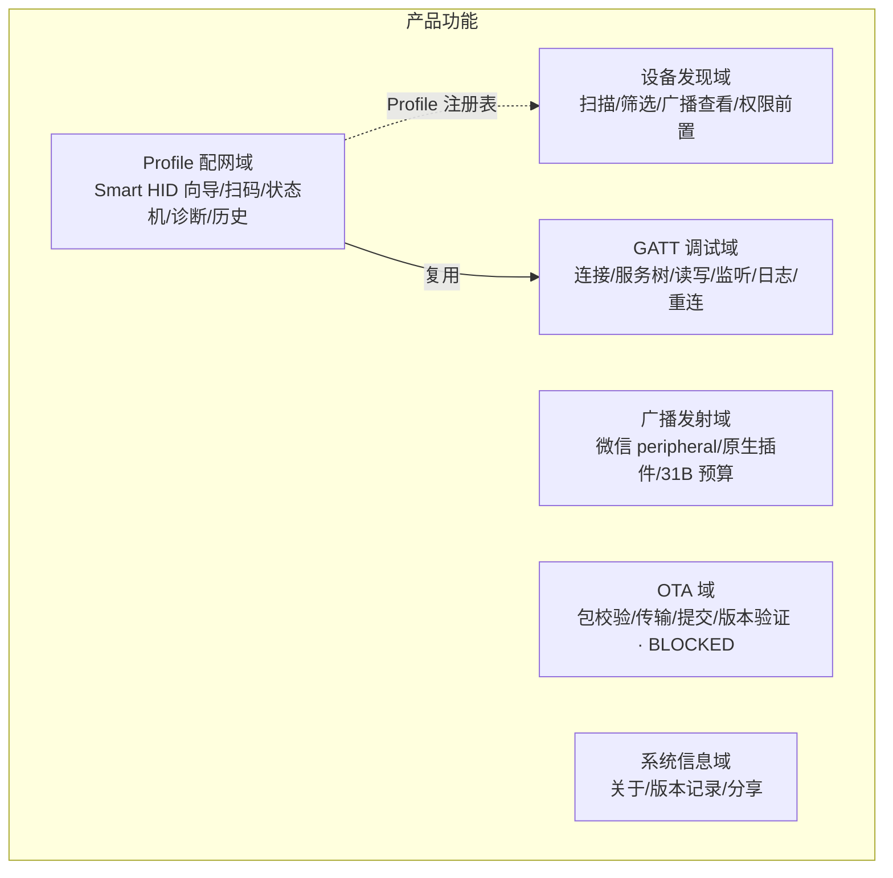
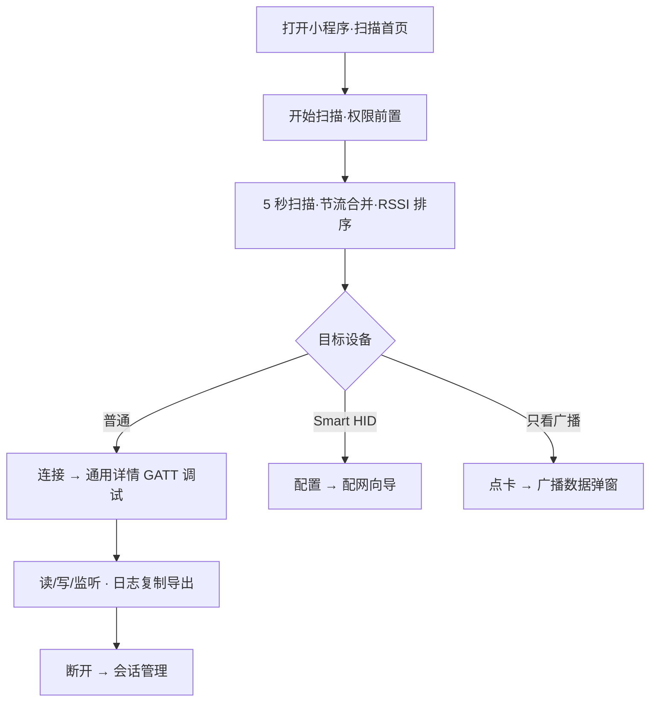
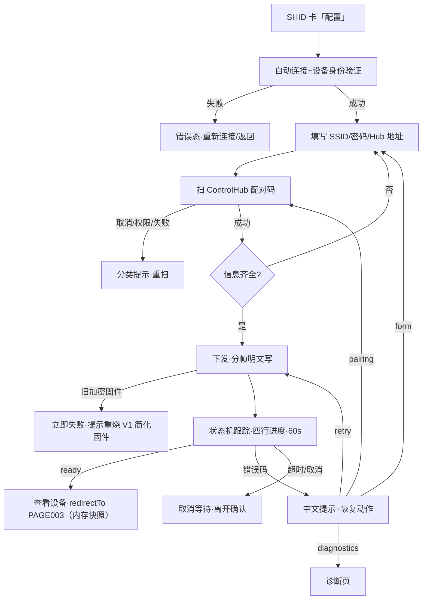
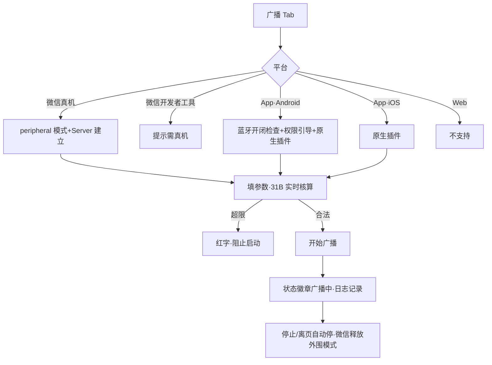
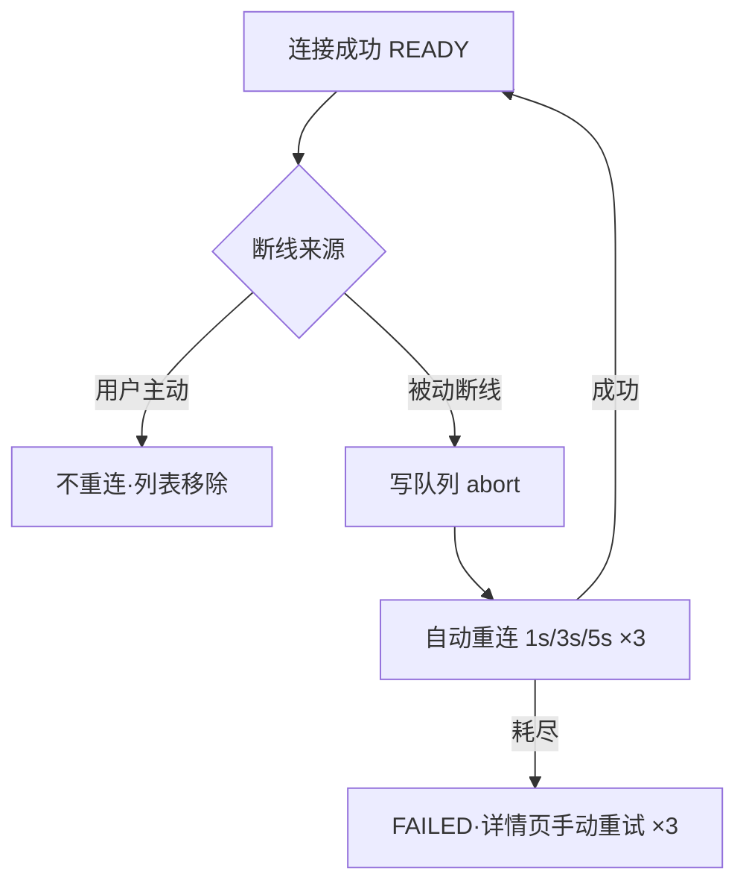
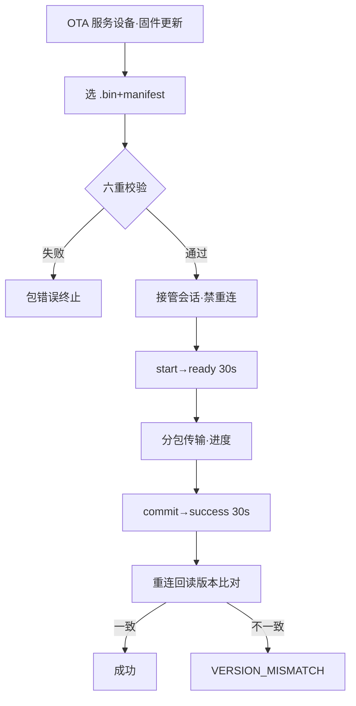

# BLE Toolkit+ 产品需求文档（PRD）

> 版本：1.0（基于旧项目逆向分析的产物化描述）
> 生成日期：2026-09-02
> 事实输入：[../01_reverse/REVERSE_ANALYSIS.md](../01_reverse/REVERSE_ANALYSIS.md)（旧项目逆向分析报告，代码基线 smart-ble main `d305d3d`）
> 文档性质：**不是重新设计**。本文档把已存在的系统用产品语言完整描述，作为重开发现代评审与验收的基线。所有需求均可在现有代码中找到对应实现（附来源）。
> 页面/功能编号与逆向报告保持一致（PAGE001-PAGE010、F001-F030）。

## 变更记录

| 日期 | 决策 | 影响范围 |
|---|---|---|
| 2026-09-02 | **移除「已配置 Smart HID」首页面板及整个已配网设备历史概念（用户决策）** | ① PAGE001 删除「已配置 Smart HID」面板及其「查看/移除/全部历史」操作；② PAGE004（Smart HID 历史）整页移除；③ F023（已配网设备历史）移除；④ PAGE003 入口收敛为「配网成功后查看设备」与诊断页返回，不再有历史列表入口；⑤ 验收标准 R19 作废。本地存储 `smart_ble.smart_hid.known_devices.v1` 及 90 天/20 条约束随功能一并移除（新开发不必实现）。 |
| 2026-09-02 | **启动跨平台扩展评估（用户指令「需要扩展到其他平台」，依据《旧产品原型跨平台扩展 SOP v1.0》《产品基准原型 Base Prototype 规范 v1.0》）** | §1.3「不做 H5 端支持」由旧产品现状边界转释为**扩展评估对象**；Web/Desktop 进入平台分析范围，App（Android 补齐/iOS）纳入扩展路线；四平台能力矩阵与差异设计见 [docs/10_platform/PLATFORM_EXTENSION.md](../10_platform/PLATFORM_EXTENSION.md)，最终平台范围待用户决策（D1–D3）。产品核心逻辑/数据模型/核心流程不因平台改变（先有产品，再有平台）。 |
| 2026-09-02 | **平台范围决策 D1（按 10_platform §6 默认建议确认）：首批 = 微信小程序 + App·Android；Desktop 待技术 spike（D2 保持开放）；Web 暂缓（D3=b）；06_review 遗留 P-04（F017 独立入口）/ P-05（F030 i18n）关闭：均不做** | 功能清单与验收基线不变（F017/F030 本就未纳入重开发范围，此处仅关闭遗留决策项）；平台扩展原型首批交付 `prototype/platform/{wechat,app}/`；详见 [10_platform/PLATFORM_EXTENSION.md](../10_platform/PLATFORM_EXTENSION.md) §6。 |
| 2026-09-03 | **零持久化残句修正（08-G0 工程实现基线纠偏，口径澄清非产品变更）** | §1.3「设备历史仅本机非敏感记录」与 §1.4「本地历史只存非敏感字段」两句为与 2026-09-02 零本地持久化决策冲突的残句，统一修正为：无设备历史业务；会话、配网快照与日志仅运行时内存；应用冷启动即空；F023/PAGE004 不得复刻。其余产品内容零改动（见 08_development/STORAGE_POLICY 与 06_review/ENGINEERING_BASELINE_CORRECTION_REPORT）。 |

---

# 1. 产品介绍

## 1.1 产品定位

BLE Toolkit+ 是开源项目 **Smart BLE** 的微信小程序客户端，一句话定位：

> **面向 UniApp、微信小程序与 ESP32 协同验证的 BLE 调试工具。**

产品模型：**通用 BLE Inspector（检查器）+ 可扩展设备 Profile（档案）系统**。核心不是某一个硬件，而是提供从发现 BLE 设备、查看广播、连接 GATT、调试通信、升级固件，到接入第一方硬件 Profile（Smart HID 配网）的完整工具链。

（来源：manifest.json、config/product.js、仓库 README 产品家族表）

## 1.2 基本信息卡

| 项 | 值 | 来源 |
|---|---|---|
| 产品名 | BLE Toolkit+（历史名 LightBLE / 工程名 HJWY_BLE，总项目名 Smart BLE） | manifest.json / package.json / project.config.json / README |
| 当前版本 | 1.0.5（versionCode 101），渠道 preview，总体状态 PREVIEW | manifest.json / release-metadata.generated.js |
| 主投放平台 | 微信小程序（appid wxf6c58b1dcac4c82d） | project.config.json:19 |
| 次要平台 | uni-app App（Android 原生插件广播 / iOS future）、H5（UNSUPPORTED） | release-metadata 平台矩阵 |
| 技术形态 | uni-app + Vue 3 + Pinia，自建设计系统（--ble-* token），无第三方 UI 库实际使用 | manifest / styles/design-system.css |
| 后端依赖 | **无**。零 HTTP、零登录、零账号体系；全部能力本地 + BLE + 扫码 | 全仓源码 |
| 官网 / 反馈 | lightble.i2kai.com / Gitee Issues（仅展示外链） | config/product.js |

## 1.3 产品边界（明确不做）

以下为现有产品既定边界（来源：docs/smart-hid/MINIAPP_HID_MODULE.md 产品边界节 + 代码事实）：

- 不做登录 / 会员 / License / 支付 / 订单 / 商业设备管理
- 不做 HID 实时键鼠控制（该能力属 ControlHub→MQTT 链路，小程序只负责配网与诊断）
- 不做云同步 / 远程设备管理（无设备历史业务：会话、配网快照与日志仅运行时内存，应用冷启动即空；F023/PAGE004 不得复刻——2026-09-02 决策，见 §1.3 末行与变更记录）
- 不做 H5 端支持（明确 UNSUPPORTED）——**旧产品现状**；2026-09-02 用户指令启动跨平台扩展评估，Web/Desktop 进入分析范围（见变更记录与 [10_platform/PLATFORM_EXTENSION.md](../10_platform/PLATFORM_EXTENSION.md)），最终范围待决策

## 1.4 核心价值主张

1. **口袋里的 BLE 调试台**：无需电脑，微信里完成扫描→筛选→广播分析→GATT 读写监听→日志导出的完整调试闭环。
2. **看得见的广播**：不仅扫别人，还能让手机自己变 BLE 外设发射广播（微信真机 / App 双路径），配 31 字节预算实时核算，让广播数据结构可教学、可验证。
3. **第一方硬件的配网入口**：Smart HID 设备开箱即配——扫码取 ControlHub 配对码，三步向导下发 Wi-Fi 与服务地址，状态机全程可视，错误码给出恢复动作。
4. **可扩展的 Profile 架构**：新设备家族以 Profile 注册表接入（UUID/前缀匹配→专属路由与动作），通用调试能力全家族复用。
5. **诚实的安全约定**：Wi-Fi 密码与配对凭据仅存内存、不落日志不落盘；日志全局脱敏；无设备历史业务——会话、配网快照与日志仅运行时内存，应用冷启动即空，F023/PAGE004 不得复刻（2026-09-02 决策）。

---

# 2. 用户画像

（来源：docs/product-reconstruction/00_PRODUCT_OVERVIEW.md 用户类型节，与功能面交叉验证）

| 画像 | 特征 | 核心使用 | 对应功能 |
|---|---|---|---|
| U1 BLE 固件开发者 | 写 ESP32/Nordic 等固件，需反复验证广播与 GATT 行为 | 扫描查看广播原始数据、连上设备读写字符、验证 notify | F001-F012 |
| U2 硬件工程师 | 自研 Smart HID 类设备，需交付配网体验 | 用小程序完成设备 Wi-Fi+ControlHub 配网、现场诊断 | F018-F024 |
| U3 测试/售后人员 | 现场验证「设备到底有没有在广播/连得上吗」 | 扫描+筛选快速定位设备、广播页做对照源、诊断五项链路 | F001-F004、F024 |
| U4 BLE 学习者/教学 | 理解广播包结构、AD 结构、31 字节限制 | 广播页实时字节数核算、扫描页广播数据弹窗、UUID 标准名映射 | F004、F016、F007 |
| U5 自研硬件接入者 | 想把自己的设备接入这套工具 | 按 Profile 契约注册（代码层），小程序自动识别给专属动作 | F018（架构） |
| U6 同生态普通用户 | ~~从「关于」页发现同开发者小程序~~ | ~~推广卡跳转~~ | F028（2026-09-10 移除） |

主用户是**专业人士（U1-U3）**，工具属性强，无娱乐化设计；UI 语言全中文。

---

# 3. 使用场景

## 场景 S1：调试自研 BLE 设备（最高频）
固件工程师改了广播字段，掏出手机：打开小程序→开始扫描（5 秒）→在列表点设备卡→查看广播原始数据（Service UUIDs/厂商数据/Service Data，可复制）→点「连接」进 GATT 树→对某特征「读取」看返回、开「监听」收推送、「写入」下发测试指令（TEXT/HEX）→导出日志贴进 Issue。中途设备断电，App 自动重连 3 次，重连期间写请求安全排队/取消。

## 场景 S2：Smart HID 设备首次上线
用户拿到 Smart HID 设备（未配网态，蓝牙广播配网服务）：首页扫描出现 SHID-XXXX 卡片（UUID 强匹配，绿色徽章）→点「配置 Smart HID」自动连接并验证设备身份→填 Wi-Fi SSID/密码→用 ControlHub 网页生成配对码→点「扫描 ControlHub 配对码」扫码（地址自动回填）→「下发配置」→看四行进度（Wi-Fi→ControlHub→MQTT→控制链路）依次点亮直到 READY→「查看设备」。设备侧 HID 键鼠控制自此转交 ControlHub。

## 场景 S3：Smart HID 设备故障排查
设备不响应控制：让设备进入配网/恢复模式（READY 设备停广播）→首页扫描出 SHID 卡→「配置」进向导→若配网报错，点恢复按钮「运行诊断」；已连接成功后也可从设备详情「运行诊断」→连接后读取实时状态→五项诊断（BLE/Wi-Fi/ControlHub/MQTT/USB Ready）指出哪一环异常，展开错误码看详情→按指引重新配网或回表单改配置。（2026-09-02 决策后入口更新：不再经由首页历史面板）

## 场景 S4：广播数据验证 / 教学
工程师想让手机当标准广播源：切到「广播」Tab→（微信真机）从机模式就绪→改设备名/服务 UUID/厂商 ID/厂商数据→看「预计广播包大小：N/31 字节」实时变化，超限变红→「开始广播」，用另一台扫描端或 LightBLE Observer 验证收到的内容；Android App 端还能调广播模式/发射功率/可连接性。

## 场景 S5：固件升级（受限场景）
对带 OTA 服务（4fafc201-…-914d）的 LightBLE 系设备：通用详情页出现「固件更新」→选 .bin（可选 manifest.json）→自动校验（目标/硬件/SemVer/sha256）→分包传输带进度→提交→重连回读版本号验证一致才报成功。
⚠ 当前产品状态：OTA 标注 BLOCKED（客户端与固件完整事务尚未对齐并完成 E5），属受限开放能力。

## 场景 S6：多设备会话管理
同时调试多台设备：「已连接」Tab 查看全部保持中的会话，逐台断开或「全部断开」（失败设备逐一列出）；Smart HID 配网会话不占用此列表但计入首页「已连接」计数。

---

# 4. 功能架构

## 4.1 功能域划分



## 4.2 技术分层（现状事实，重构需保持的骨架）

页面（10）→ 组合式函数（4）→ Pinia 状态（ble/hid）→ 服务层（ble-runtime / provisioning / smart-hid / broadcast / ota / 散装）→ 平台 API（uni.\*/wx.\*/plus.\* 收敛于少数文件）→ 仓库根共享层 core/（协议镜像 + framing + Profile 契约 + logger）。

关键机制（产品可感知的行为源头）：
- **会话三层体系**：注册表（8 态状态机+所有权）→ 运行时回调（主动断开 2s marker 区分被动断线）→ 重连管理（3 次，1s/3s/5s，用户主动断开永不重连）
- **写队列**：同设备串行、跨设备并行、超时 5s、深度 16、优先级插队
- **配网状态机**：DISCOVERING→PAIRING→VERIFYING→PROVISIONED（可 CANCELLED）；token 仅内存 5 分钟
- **本地持久化**：（2026-09-02 决策后）无——known_devices 持久化随 F023 移除，新版本为零本地存储形态（配网会话均为内存态）

## 4.3 页面信息架构

```
tabBar
├── 扫描 PAGE001 ──── 设备卡(普通)→ 通用详情 PAGE006
│              └─── 设备卡(SHID)→ 配网向导 PAGE002 ──(成功"查看设备")→ 设备详情 PAGE003 ──→ 诊断 PAGE005
├── 已连接 PAGE007 ── 点卡→ PAGE006 / Profile 路由
├── 广播 PAGE008
└── 关于 PAGE009 ─── 版本记录 PAGE010
（PAGE004 历史页已按 2026-09-02 决策移除）
```

---

# 5. 功能列表

优先级说明：P0=产品核心闭环；P1=重要支撑能力；P2=辅助/增长能力。状态描述现状，均来自逆向报告 §5/§9。

| 功能ID | 名称 | 描述 | 优先级 | 状态 |
| ---- | ---- | ---- | ---- | ---- |
| F001 | BLE 扫描 | 5 秒扫描会话、1s 节流合并、RSSI 降序、上限 100、自动停+结果 toast | P0 | 已实现 |
| F002 | 扫描权限前置 | 微信蓝牙/定位授权检查与引导（未授权→横幅+去设置） | P0 | 已实现 |
| F003 | 扫描筛选 | RSSI 滑杆+4 预设、名称前缀、隐藏无名、重置 | P0 | 已实现 |
| F004 | 广播数据查看 | 弹窗展示 Service UUIDs/原始广播/厂商/Service Data，一键复制；未提供字段如实标注 | P0 | 已实现 |
| F005 | 显示名智能解析 | name→localName→AD 0x09/0x08→Profile 名→厂商→「未命名 BLE·ID后四位」多级 fallback | P1 | 已实现 |
| F006 | GATT 连接 | 8 态会话、服务发现（期望服务重试 3×400ms）、MTU、能力建模 | P0 | 已实现 |
| F007 | 服务树浏览 | 折叠列表、UUID 标准中文命名、全部展开/收起 | P0 | 已实现 |
| F008 | 特征读取 | HEX+TEXT 双格式展示、3s 超时 | P0 | 已实现 |
| F009 | 特征写入 | TEXT/HEX 双模式、写队列串行化、非法 HEX 拦截 | P0 | 已实现 |
| F010 | Notify 监听 | 防抖去重开关、断线自动清理 | P0 | 已实现 |
| F011 | 通信日志 | 六色分类、清空、复制导出、全局/单设备容量上限 | P0 | 已实现 |
| F012 | 断线自动重连 | 被动断线检测、3 次 backoff、重连期间写队列 abort、用户主动断开不重连 | P0 | 已实现 |
| F013 | 多设备会话管理 | 已连接列表、单台/批量断开（失败清单反馈） | P1 | 已实现 |
| F014 | 广播发射（微信） | peripheral 模式切换+BLEPeripheralServer、活动连接冲突拦截、开发者工具提示真机 | P1 | 已实现 |
| F015 | 广播发射（App） | LysBlePeripheral 原生插件、Android 权限/蓝牙开闭前置引导、模式/功率/可连接选项 | P1 | 已实现 |
| F016 | 广播负载预算 | 31 字节实时核算（AD 结构逐项）、超限阻止并红字提示、不静默截断 | P1 | 已实现 |
| F017 | 观察侧证据匹配 | 广播内容与观察端上报 JSON 交叉匹配（服务层就绪，暂无页面入口） | P2 | 已实现（无消费方） |
| F018 | Profile 设备识别 | 注册表匹配（UUID=STRONG 优先于名称前缀=WEAK）、专属徽章与动作按钮 | P0 | 已实现 |
| F019 | Smart HID 配网向导 | 三阶段（连接验证/表单/状态）、步骤条、断线续填、离开确认 | P0 | 已实现 |
| F020 | ControlHub 配对码扫码 | shid://pair 解析、地址自动回填、token 仅内存 5 分钟、取消/权限/失败分类提示 | P0 | 已实现 |
| F021 | 分帧明文写入+状态跟踪 | framed-v1 分帧（MTU-3-3 封顶 128B）、无 SMP、写失败立即上抛、STATUS 轮询 60s | P0 | 已实现 |
| F022 | 配网错误恢复 | 8 种错误码→中文提示+恢复动作（form/pairing/diagnostics/retry） | P0 | 已实现 |
| ~~F023~~ | ~~已配网设备历史~~ | ~~本机非敏感记录、90 天 TTL、上限 20、增删查、配网完成自动落档~~ | — | **已移除（2026-09-02 用户决策，见变更记录）** |
| F024 | Smart HID 诊断 | 五项链路实时检查（BLE/Wi-Fi/Hub/MQTT/USB Ready）、错误码详情、页面栈感知导航 | P1 | 已实现 |
| F025 | OTA 固件升级 | 12 态事务、包六重校验、180B/20ms 分包传输、commit+版本回读验证 | P1 | 部分实现（端到端 BLOCKED） |
| F026 | 日志脱敏 | 敏感键（token/password/…）→\*\*\*，保护键白名单不脱敏 | P0 | 已实现 |
| F027 | 版本元数据展示 | 关于页+版本页消费构建生成的 Release Metadata（当前版本/限制/历史/平台状态） | P2 | 已实现 |
| F028 | 小程序推广跳转 | ~~同开发者小程序卡片与跨渠道承接~~ | P2 | **已移除（2026-09-10）**：关于页「更多小程序」推广区整链下线（原型/五实现线/配置/测试同步清除） |
| F029 | 微信分享 | 页面级 onShareAppMessage/onShareTimeline、APP 系统分享、H5 navigator.share | P2 | 已实现 |
| F030 | 国际化 | locale 文件就绪但未接线（UI 全中文硬编码） | P2 | 未实现 |

---

# 6. 页面需求

> 每页格式：编号 / 目标 / 入口 / 展示内容 / 操作与响应 / 状态 / 异常。全部对应现有实现（逆向报告 §4）。

## PAGE001 扫描首页（tabBar「扫描」）

- **页面目标**：BLE 设备发现与分流（通用调试 / Profile 配网）。（2026-09-02 决策：不再承担已配网设备历史管理）
- **入口**：tabBar 首项；微信分享卡片。
- **展示内容**：自绘导航栏（蓝牙状态点+三态文案）；扫描工具条（状态标签/「N 台设备·M 台已连接」/启停按钮/错误横幅含 code 与重试）；「附近设备」面板（筛选折叠/设备卡列表：显示名、Profile 徽章、deviceId、meta、RSSI 四格信号条、按钮组）；空态两种文案。
- **操作与响应**：开始/停止扫描（权限前置→适配器重试 3 次→5s 会话→完成 toast）；筛选实时投影；点卡弹广播数据（可复制）；普通卡「连接」→PAGE006；SHID 卡「配置」→PAGE002。
- **状态**：蓝牙 on/off/unsupported；扫描 starting/scanning/stopping/idle/failed；结果空/不匹配两种空态；SHID 匹配 STRONG/WEAK。
- **异常**：蓝牙未开（10001 引导开蓝牙）；授权拒绝（reason 分类+去设置）；扫描失败（横幅+重试）；进页校验、离页自动停扫。

## PAGE002 Smart HID 配网向导

- **页面目标**：三步完成 Smart HID 配网并让用户看懂每一步。
- **入口**：首页 SHID 卡「配置」；PAGE003「重新配置」；PAGE005「重新配网」（带 READY 停广播确认）。
- **展示内容**：三步骤条（连接→填写配置→查看状态）；connect 阶段（设备卡/loading/错误+重连）；configure 阶段（连接徽章、设备摘要、SSID≤32、密码≤64 可空、Hub 地址 mono+默认端口 17892 提示、扫码大动作卡 badge 必需→已获取、隐私声明「只用于本次下发不写日志不落盘」、下发按钮 canSubmit 联动）；status 阶段（四行进度 Wi-Fi/ControlHub/MQTT/控制链路、成功态「设备已就绪·HID 控制请通过 ControlHub 下发」、错误态+恢复按钮、取消等待）。
- **操作与响应**：进入自动连接+身份验证（product/协议版本/deviceId 正则，失败即断开报错）；扫码（uni.scanCode→shid://pair→回填地址；分类失败提示）；下发（表单校验→candidate JSON→分帧明文写→60s 轮询 STATUS→state/step 驱动进度→ready 后 redirectTo PAGE003，设备快照保留在内存会话，不落盘）；错误→中文提示+恢复动作（form/pairing/diagnostics/retry）；配网中物理返回→确认弹窗；断线→徽章已断开+表单保留+重连续传。
- **状态**：phase 三态；connecting/connectionError/connectionLost/pairingReady/provisioning/provisionDone/errorMessage/recoveryAction。
- **异常**：身份验证失败；扫码取消/权限/失败；地址格式错；旧加密固件写入失败（立即提示重烧）；8 种设备侧错误码；60s 超时；用户取消；离开页面 dispose 清敏感数据。

## PAGE003 Smart HID 设备详情

- **页面目标**：单台已配网设备身份+最近配置快照，三出口（重配/诊断/高级调试）。
- **入口**：配网成功后 redirectTo「查看设备」；PAGE005「返回设备详情」（栈感知）。（2026-09-02 决策：移除首页已知设备入口与历史页入口）
- **展示内容**：身份卡（名称/协议 chip 缺省「协议未记录」/Device ID mono/固件版本）；最近配置卡（Wi-Fi/ControlHub）；操作区。
- **操作与响应**：重新配置→PAGE002（setCurrentDevice）；运行诊断→PAGE005；高级 BLE 调试→PAGE006。
- **状态**：字段缺失显示「—」。
- **异常**：记录不存在→modal「设备记录不存在」→强制返回。

## PAGE004 Smart HID 历史 【已移除 2026-09-02】

> 用户决策移除（见变更记录）：首页「已配置 Smart HID」面板与历史页一并去除。以下原始描述仅存档备查。
>
> ~~页面目标：本机已配网历史列表；入口：首页「全部历史」；含空态卡/列表/移除确认。~~

## PAGE005 Smart HID 诊断

- **页面目标**：五项链路实时体检，给售后/用户一个明确的「坏在哪一环」。
- **入口**：PAGE003「运行诊断」；配网错误恢复（recoveryAction=diagnostics）。
- **展示内容**：当前状态六值；五项诊断行（BLE/Wi-Fi/ControlHub/控制连接/设备 Ready 状态，图标+状态词+明细）；操作区四按钮；错误码详情块（code+message）。
- **操作与响应**：重新检测（离线→确认弹窗「连接并检测」→connect+diagnose；在线→直接 diagnose）；显示/隐藏错误码；返回设备详情（页面栈感知：栈内有 PAGE003 则返回否则入栈）；重新配网（READY 确认→栈内有 PAGE002 则返回否则入栈）；本页持有连接则卸载时断开。
- **状态**：idle/connected/checking/live/offline/error 六态；行状态 ok/warn/active/pending/fail。
- **异常**：BLE 未连接（引导重连）；连接失败（modal 提示进入配网/恢复模式）；诊断失败 toast。

## PAGE006 通用设备详情（GATT 调试工作台）

- **页面目标**：单设备 GATT 全功能调试台。
- **入口**：扫描卡「连接」（带路由上下文）；PAGE007 点卡；PAGE003「高级 BLE 调试」。
- **展示内容**：设备面板（名称+连接状态点/设备 ID/「固件更新」仅 OTA 设备/清空日志·导出日志·连接↔断开）；服务树（折叠+UUID 中文名+按 properties 渲染读/写/监听按钮+全部展开收起；五态面板 idle/connecting/ready/empty/error 带重试）；日志面板 dock；写入弹窗；OTA 弹窗。
- **操作与响应**：进入（解析上下文→适配器→连接复用/超时 10s/自动重试 3 次退避→GATT 发现→绑定会话+OTA 检测）；连接↔断开；读取（HEX+TEXT 日志）；写入（TEXT/HEX 校验→写队列→toast+日志）；监听开关（防抖+char.notifying 同步）；日志清空/复制导出；OTA 见 PAGE006-OTA。
- **状态**：初始化/连接中/已连接（状态点变色）；服务面板五态；日志滚动。
- **异常**：路由参数无效（modal+返回）；连接超时与自动重试；服务空；读/写/监听失败（微信 errCode 10000-10013 中文归一）；被动断线（写队列 abort+自动重连）。

### PAGE006-OTA 固件更新（子流程）
- **入口**：设备面板「固件更新」（仅 hasOtaService）。
- **流程**：选 .bin（微信 chooseMessageFile/其他 chooseFile）→包校验（manifest 白名单/SemVer/sha256 实测）→接管会话+禁自动重连→MTU 247→订阅 STATUS→start（chunk 180）→ready 30s→分包 writeNoResponse 20ms 间隔带进度→commit→success 30s→重连回读版本比对→成功 2s 自动关闭；取消→abort。
- **异常**：六种包错误码；五种运行错误码；VERIFYING 版本不一致（OTA_VERSION_MISMATCH）。
- **状态**：进度条 sentBytes/totalBytes + 阶段文案。

## PAGE007 已连接设备（tabBar「已连接」）

- **页面目标**：保持中的通用会话集中管理。
- **入口**：tabBar。
- **展示内容**：>1 台时汇总卡（计数+全部断开）；设备卡列表（ON 头标/连接 meta/断开按钮）；空态两种文案（配网会话在线 vs 常规）。
- **操作与响应**：点卡→按 profileId 分流路由；单台断开（SHID 会话先断，toast 反馈）；全部断开（allSettled→汇总，部分失败 modal 列失败设备）。
- **异常**：断开失败 toast/汇总弹窗；空态「去扫描」。

## PAGE008 BLE 广播（tabBar「广播」）

- **页面目标**：本机变 BLE 外设，广播数据可定义、可验证、可教学。
- **入口**：tabBar。
- **展示内容**：设置卡（平台标签+运行状态徽章六值）；设备名称/服务 UUID（校验提示）/厂商 ID/厂商数据；字节数实时提示（N/31+超限红字）；Android 专属（模式/功率 picker+三开关）；操作区（启停/检查支持）；操作日志 card。
- **操作与响应**：检查支持（App：插件 isSupported；微信：peripheral+server 建立链路；其他：不支持）；开始广播（payload 校验→平台分支：微信 server.startAdvertising(powerLevel) / Android 蓝牙开闭+权限引导+插件 options / iOS 插件 options）；停止；离开页面自动停（非 APP）/释放外围模式（微信）。
- **状态**：广播中/失败/已停止/已就绪/未就绪/不支持；advertising 中输入禁用。
- **异常**：UUID 格式无效；超 31 字节；插件未初始化；权限缺失（清单+去设置）；系统蓝牙未开（10001 引导）；微信外围初始化失败（errMsg）；开发者工具限制提示；有活动连接冲突（提示先断开）。

## PAGE009 关于（tabBar「关于」）

- **页面目标**：产品信息、系统环境透明化（推广位 2026-09-10 移除）。
- **入口**：tabBar。
- **展示内容**：品牌卡（logo/名称/运行时版本（APP/微信渠道取值，兜底 release-metadata）/summary/技术栈 chips+总体状态）；应用信息（系统平台/版本/型号；6 项功能特性 chips；平台公开状态 chips）；菜单（官网/版本记录/问题反馈/分享应用）；页脚版权。
- **操作与响应**：官网/反馈（微信端复制链接；APP 开浏览器；H5 新窗）；分享（微信引导右上角；APP 系统分享降级复制；H5 navigator.share 降级）；（推广卡 2026-09-10 移除）；版本记录→PAGE010。
- **异常**：外链在小程序环境的降级复制策略；跳转失败提示。

## PAGE010 版本记录

- **页面目标**：版本与发布状态透明化（数据非手写，来自 Release Metadata 投影）。
- **入口**：PAGE009 菜单。
- **展示内容**：当前版本卡（版本号/状态 pill/渠道/Release tag 登记标记/平台状态列表/复制版本信息）；当前限制卡（known_limitations 8 条）；正式发布历史；预览记录；页脚声明。
- **操作与响应**：复制版本信息（display_version→剪贴板）；onShow 滚顶。
- **状态**：releases/previews 空态文案（「暂无正式发布版本」等）。

---

# 7. 业务流程

（与逆向报告 §6 同源，PRD 视角保留主链与关键分支）

## 7.1 核心调试流程



## 7.2 Smart HID 配网流程（含异常恢复）



## 7.3 广播流程（平台分支）



## 7.4 连接生命周期与断线恢复



## 7.5 OTA 流程（BLOCKED 状态下仍为契约基线）



---

# 8. 验收标准

> 每条 Given/When/Then 对应现有实现行为，可直接转为测试用例。（R-xx 为用例编号）

## 设备发现域

- **R01（F001）** Given 用户在扫描首页且蓝牙已授权开启 When 点击「开始扫描」Then 5 秒内持续出现去重后按 RSSI 降序的设备列表，会话结束 toast「扫描完成 · 发现 N 台」。
- **R02（F002）** Given 用户首次使用且微信蓝牙授权未决 When 点击开始扫描 Then 系统先请求授权；拒绝后显示含错误码的横幅与重试按钮，指引去系统设置。
- **R03（F003）** Given 扫描结果 ≥1 台 When 将 RSSI 阈值调至 -70 并开启「隐藏无名」Then 列表仅保留 RSSI≥-70 且有名称的设备，计数同步。
- **R04（F004）** Given 列表中任一设备 When 点击设备卡本体 Then 弹窗完整展示设备 ID/名称/RSSI/Service UUIDs/原始广播数据/Manufacturer Data/Service Data，平台未提供的字段标注「本轮平台 API 未提供此字段」，点「复制数据」写入剪贴板并 toast「已复制」。
- **R05（F005）** Given 一台无 name 的设备广播含 AD 0x09 字段 When 出现在列表 Then 显示名取自 AD 0x09；全部来源缺失时显示「未命名 BLE · ID后四位」。

## GATT 调试域

- **R06（F006）** Given 扫描到目标设备 When 点击「连接」Then 进入通用详情页，服务发现完成后服务树按 UUID 排序展示，面板进入 ready 态；连接超时（10s）自动重试至多 3 次。
- **R07（F007）** Given 已连接且服务含标准 SIG UUID（如 1800/180F）When 展开服务树 Then 服务/特征显示标准中文名；未知 UUID 显示「服务 N/特征值 N」占位。
- **R08（F008）** Given 某特征 properties.read=true When 点击「读取」Then 日志新增「接收」条目，内容为 HEX 与 TEXT 双格式；3 秒无响应按超时报错。
- **R09（F009）** Given 某特征 properties.write=true When 选择 HEX 模式输入非法 hex 并确认 Then 拦截并提示，不产生 BLE 写；输入合法则入写队列，成功 toast「写入成功」并记录「写入」日志。
- **R10（F010）** Given 某特征支持 notify When 点击「开始监听」Then 按钮变「停止监听」，此后设备推送均以「接收」日志呈现（HEX+TEXT）；重复快速点击不产生并发开关请求。
- **R11（F011）** Given 日志面板有 ≥1 条记录 When 点击「导出日志」Then 格式化文本写入剪贴板并 toast「日志已复制」；空日志时 toast「暂无日志」。
- **R12（F012）** Given 设备已连接且非用户主动 When 设备断电（被动断线）Then 该设备写队列中止（未发事务取消），系统按 1s/3s/5s 自动重连至多 3 次；用户点「断开连接」则永不重连。
- **R13（F013）** Given 已连接页有 3 台设备 When 点击「全部断开」Then 逐台断开，全部成功 toast 汇总；部分失败 modal 列出失败设备清单。

## Profile / Smart HID 配网域

- **R14（F018）** Given 一台广播含 9f1d1001-…-1c04 服务 UUID 的设备 When 扫描结果出现 Then 设备卡显示 Smart HID 徽章与「配置 Smart HID」动作按钮（STRONG 匹配）；仅名称前缀 SHID- 匹配时同样给出 Profile 标识（WEAK）。
- **R15（F019）** Given 从 SHID 卡进入配网向导 When 页面加载 Then 自动连接并验证设备身份（product/协议版本/deviceId 格式），通过后进入表单阶段；不通过则断开并给出错误与「重新连接」。
- **R16（F020）** Given 表单已填且未扫码 When 点击「扫描 ControlHub 配对码」并完成扫码 Then hubAddress 自动回填为 QR 中 host:port，动作卡 badge 变「已获取」；扫非 shid://pair 或缺参内容时给出失败分类提示，可重扫。
- **R17（F021）** Given SSID/Hub/配对码齐全 When 点击「下发配置」Then candidate 以明文分帧方式写入 INPUT 特征（各平台均不发起系统配对），随后 60 秒内 STATUS 推送驱动四行进度；state=ready 时四行全绿并允许「查看设备」（2026-09-02 决策后无本机历史写入，设备快照仅存内存会话）。
- **R18（F022）** Given 下发后设备报 wifi_failed When 状态到达 Then Wi-Fi 行标红、显示对应中文提示，恢复按钮引导回表单（SSID/密码已保留）；pairing_* 类错误引导重新扫码；controlhub_unreachable 可跳诊断。
- **R19（F023·已作废）** 2026-09-02 用户决策移除已配网设备历史（面板+历史页+本地存储），本条不再适用。
- **R20（F024）** Given 已配网设备 When 进入诊断页并点击「重新检测」Then 未连接时弹「连接并检测」确认，连接后读取实时状态并给出五项结论（BLE/Wi-Fi/ControlHub/控制连接/Ready）；「显示错误码」展示最近错误的 code 与 message。

## 广播域

- **R21（F016）** Given 广播页 When 修改厂商数据使预计包大小超过 31 字节 Then 提示区出现红色「超出限制」，点击开始广播被阻止。
- **R22（F014）** Given 微信真机且无活动 BLE 连接 When 进入广播页 Then 显示「蓝牙从机模式已就绪」（或就绪态）；点击开始广播后状态徽章为「广播中」；存在活动连接时提示先断开；开发者工具中提示使用真机。
- **R23（F015）** Given Android App When 点击开始广播且系统蓝牙关闭 Then 弹窗引导开启系统蓝牙；权限缺失时逐项请求并给出「去设置」入口；权限齐备后按所选模式/功率启动插件广播。
- **R24（F014/15）** Given 正在广播 When 用户离开页面（onHide/onUnload）Then 广播停止（非 APP 平台）或微信外围模式释放，操作日志留有记录。

## OTA 域

- **R25（F025）** Given 设备含 OTA 服务 When 打开通用详情 Then 「固件更新」按钮可见；选择 sha256 不符的包时校验失败并终止，不发起传输；合法包传输中显示进度，commit 后重连回读版本一致才显示成功，2 秒后自动关闭弹窗。

## 系统信息域

- **R26（F027）** Given 任意用户 When 打开「版本记录」Then 当前版本显示 1.0.5（构建号 101）与渠道 preview，平台状态与当前限制（含 OTA BLOCKED）如实展示；点「复制版本信息」写入剪贴板。
- **R27（F028）** ~~Given 关于页 When 点击已配置 appId 的推广卡…~~ **已移除（2026-09-10）**：推广区不存在，无对应验收路径。
- **R28（F026·安全）** Given 任意日志输出路径 When 记录中包含 token/password 等敏感键值 Then 输出中被替换为 \*\*\*；Wi-Fi 密码与配对 token 不出现在本地存储与日志中（2026-09-02 决策后应用为零本地持久化，仅内存态）。

## 平台与降级

- **R29（平台）** Given Web/H5 环境 When 进入广播页并尝试操作 Then 明确提示不支持并指引用微信小程序或 App；iOS 平台状态在版本页显示为 future 而非可用。
- **R30（F030·现状确认）** Given 当前版本 When 检查 UI 文案 Then 全部为硬编码中文（i18n 未接线为已知现状，重开发时作为决策项处理）。

---

—— 阶段二（PRD）完成，等待确认后进入阶段三（生成页面交互规格 docs/03_flow/PAGE_SPEC.md）。
