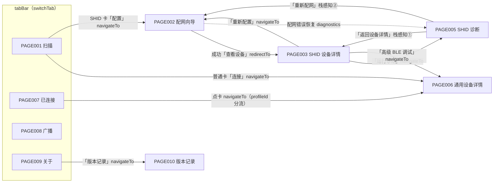

# PAGE_FLOW —— 页面跳转关系

> SOP v2.0 Phase 4 产出 · 2026-09-02
> 事实源：PAGE_SPEC.md 各页「跳转关系」+ PRD §4.3 信息架构 + pages.json 路由（原型已验证）。口径：2026-09-02 变更后（PAGE004 已移除）。

## 1. 全局跳转图

①② 栈感知：目标页已在页面栈中则 navigateBack 复用，否则 navigateTo（getCurrentPages 检查，diagnostics.vue:132-136），避免叠加实例。

**已移除**：PAGE004 Smart HID 历史（原 P001「全部历史」→ P004 → P003），2026-09-02 用户决策整链移除。

## 2. 跳转矩阵

| 页面 | 入口（来源 · 方式） | 出口（目标 · 方式） |
|---|---|---|
| PAGE001 | tabBar 首项 · switchTab；微信分享卡片 | →PAGE006 navigateTo（普通卡连接，带路由上下文）；→PAGE002 navigateTo（SHID 卡配置） |
| PAGE002 | ←PAGE001 / ←PAGE003「重新配置」/ ←PAGE005「重新配网」· navigateTo | →PAGE003 redirectTo（配网成功「查看设备」，保留会话）；navigateBack（物理返回需确认弹窗） |
| PAGE003 | ←PAGE002 redirectTo；←PAGE005 栈感知返回 | →PAGE002 / →PAGE005 / →PAGE006 navigateTo；记录不存在→modal 后强制 navigateBack |
| PAGE005 | ←PAGE003「运行诊断」；←PAGE002 错误恢复（recoveryAction=diagnostics） | →PAGE003 / →PAGE002（均栈感知）；onUnload 若持有连接则断开 |
| PAGE006 | ←PAGE001 / ←PAGE007 点卡 / ←PAGE003「高级 BLE 调试」· navigateTo | navigateBack（系统返回栏）；断开后 P007 列表同步 |
| PAGE007 | tabBar · switchTab | →PAGE006 / Profile 路由 navigateTo（buildConnectedDeviceOpenUrl） |
| PAGE008 | tabBar · switchTab | 无页面出口（onHide/onUnload 自动停广播/释放外围模式） |
| PAGE009 | tabBar · switchTab | →PAGE010 navigateTo；推广卡 navigateToMiniProgram；外链复制降级 |
| PAGE010 | ←PAGE009 · navigateTo | navigateBack |

## 3. 路由参数约定（现状事实）

- PAGE006：URL 携带 `deviceId/name/rssi[/profileId]` 或暂存路由上下文；无效参数→modal+返回。
- PAGE002：deviceId 编码入 URL（buildProfileActionUrl / buildHidProvisionUrl）。
- PAGE003：deviceId 编码入 URL；进入时 currentDevice+会话内存三级匹配，未命中→「设备记录不存在」强制返回。
