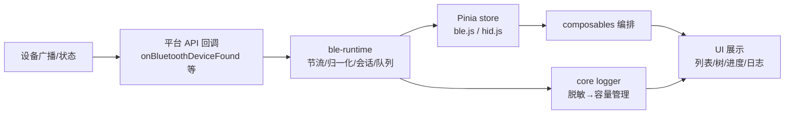

# DATA_FLOW —— 数据流动

> SOP v2.0 Phase 5 产出 · 2026-09-02
> 事实源：REVERSE_ANALYSIS §1.2/§2.4/§4/§7（数据模型）。描述旧项目数据如何从产生到 UI/出口。

## 0. 总览



## 1. 广播发现流（PAGE001）

```
设备广播
→ wx.onBluetoothDeviceFound（allowDuplicatesKey:true）
→ 扫描会话：1s 节流缓冲 → normalizeAdvertisement（字节字段统一 {state,present,byteLength,length,hex}）
→ attachDeviceDisplayName 解析链：name→localName→AD 0x09→AD 0x08→profileName→厂商→「未命名 BLE·ID后四位」
→ matchScannedDevices（Profile 注册表：serviceUuid 命中=STRONG 优先于名称前缀=WEAK）
→ mergeDeviceCollection（deviceId 去重、RSSI 降序、上限 100）
→ store.ble.scannedDevices → filterBleDevices 投影（rssi/prefix/hideNoName/keyword）
→ 首页列表 / 广播数据弹窗（未提供字段统一文案「本轮平台 API 未提供此字段」）
```

## 2. 写命令流（PAGE006）

```
write-dialog（TEXT/HEX 单选）
→ encodeWritePayload（HEX 合法性校验 / UTF-8）
→ 写队列（同设备串行、跨设备并行、单写超时 5s、深度 16、优先级插队）
→ writeBLECharacteristicValue
→ 成功：toast「写入成功」+ 日志「写入」；失败：日志「错误」（errMsg 中文归一）
被动断线 → 该设备队列 abort（PENDING→CANCELLED）
```

## 3. 通知流（PAGE006）

```
点「开始监听」→ notifyController.toggle（防抖去重）
→ notifyBLECharacteristicValueChange(true) → char.notifying 同步
→ onBLECharacteristicValueChange → 日志「接收」（HEX+TEXT 双格式，utf8Decode 来自 core framing）
断线 → 订阅自动清理
```

## 4. 配网数据流（PAGE002，核心链路）

```
表单（SSID≤32/密码≤64/Hub 地址）+ 扫码 token（仅内存，TTL 5 分钟）
→ buildProvisionFormCandidate 校验（host[:port]，默认端口 17892，端口范围）
→ candidate JSON {v,wifi_ssid,wifi_password,hub_host,hub_port,token}
→ framed-v1 分帧：[seq:u8][total:u8][len:u8][payload]（帧头 3B，单块封顶 128B，组装上限 1024B，帧数上限 64）
→ 顺序明文写 INPUT 特征（MTU 247，写帧间隔 30ms；失败立即上抛，旧加密固件提示重烧）
→ 设备 STATUS 特征（read+notify）推送 state/step/error
→ workflow-engine 状态机 + applyProvisionStatus 映射
→ 四行进度 {wifi,hub,conn,usb} × {pending,active,done,fail,warn} → UI
→ ready：会话内存快照（非敏感字段）→ redirectTo PAGE003
（2026-09-02 后不再有 known_devices 落盘分支——零本地持久化）
```

**安全边界**：token / Wi-Fi 密码全链路仅内存；SENSITIVE_PROFILE_KEYS 黑名单确保不入日志。

## 5. OTA 数据流（PAGE006 子流程）

```
wx.chooseMessageFile（.bin）→ FileSystemManager 读取
→ 包校验：manifest 白名单 6 字段 + SemVer + sha256 实测比对（无 manifest 跳过）
→ 接管会话所有权（WORKFLOW:'ota-manager'，禁自动重连）
→ CTRL 写 {op:'start',target,size,chunk_size:180,sha256} → 等 ready 30s
→ 固件分块（MTU-3）→ DATA 特征 writeNoResponse（块间隔 20ms，进度 sentBytes/totalBytes）
→ {op:'commit'} → 等 success 30s
→ 重连 → 读 DeviceInfo.firmware_version 比对（不一致=OTA_VERSION_MISMATCH）
→ 成功 2s 自动关闭；取消={op:'abort'}
```

## 6. 广播数据流（PAGE008，出站方向）

```
表单（名称/UUID/厂商 ID+数据[/Android 选项]）
→ buildBroadcastPayload 31 字节预算核算（AD 结构 2+len、厂商块 2+2+len，逐项 parts）
→ 超限：PAYLOAD_TOO_LARGE（不静默截断）→ 阻止启动
→ 合法：createBroadcastAdapter（微信 server.startAdvertising / LysBlePeripheral options）
→ 状态徽章 + sessionAddLog → core logger（'broadcast' 命名空间）
```

## 7. 日志与脱敏流（横切全部页面）

```
任意日志产生点 → services/logger/log-redaction（敏感键 token/password/secret…→'***'；保护键白名单）
→ core logger 单例（全局 500 条 / 单设备 200 条 / LRU 40 设备，镜像 console）
→ log-panel UI（六色 chip：sys/err/read/write/recv/ok）
→ 导出 formatDeviceLogExport → setClipboardData
```

## 8. 持久化现状

**2026-09-02 决策后：零本地持久化。** 原唯一存储键 `smart_ble.smart_hid.known_devices.v1`（90 天 TTL/上限 20/非敏感字段）随 F023 移除；扫描结果、连接表、配网会话、日志全部为内存态，冷启动即空。
