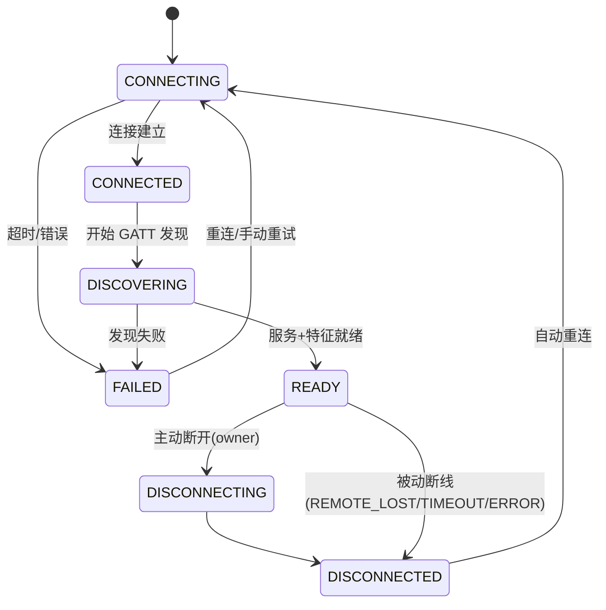
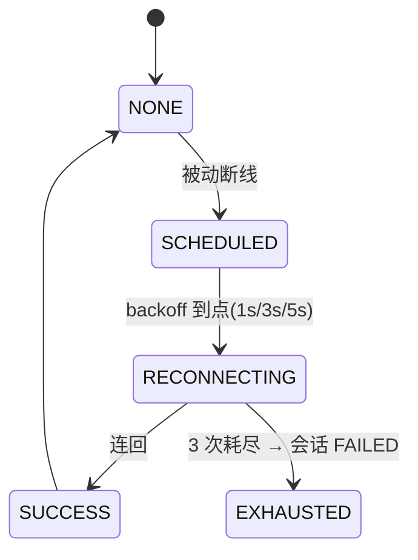
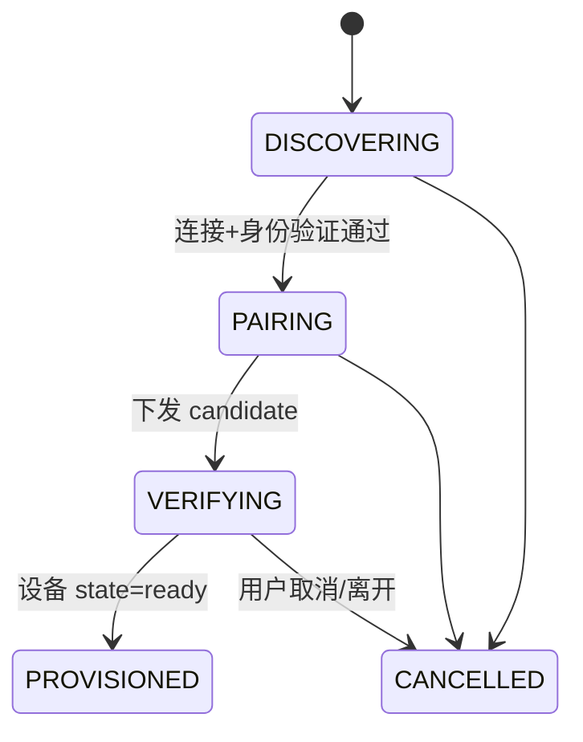
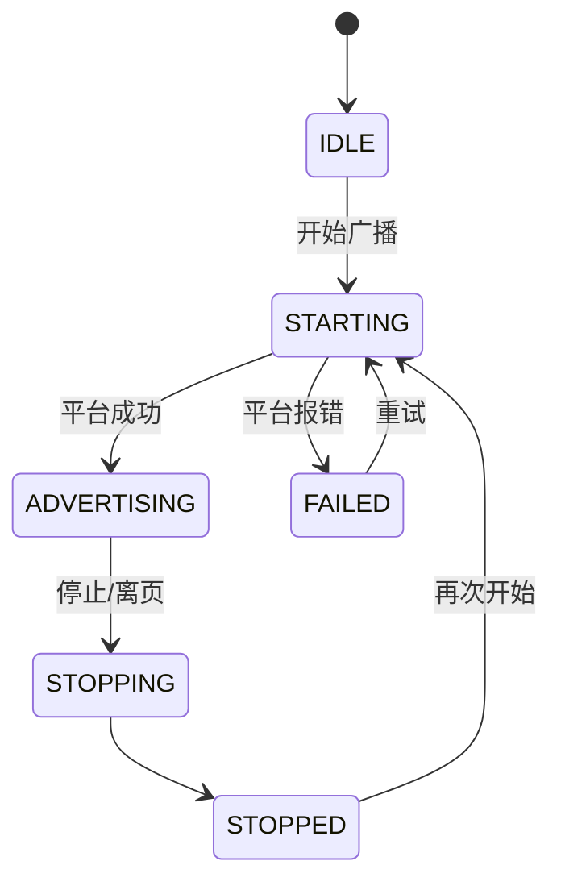
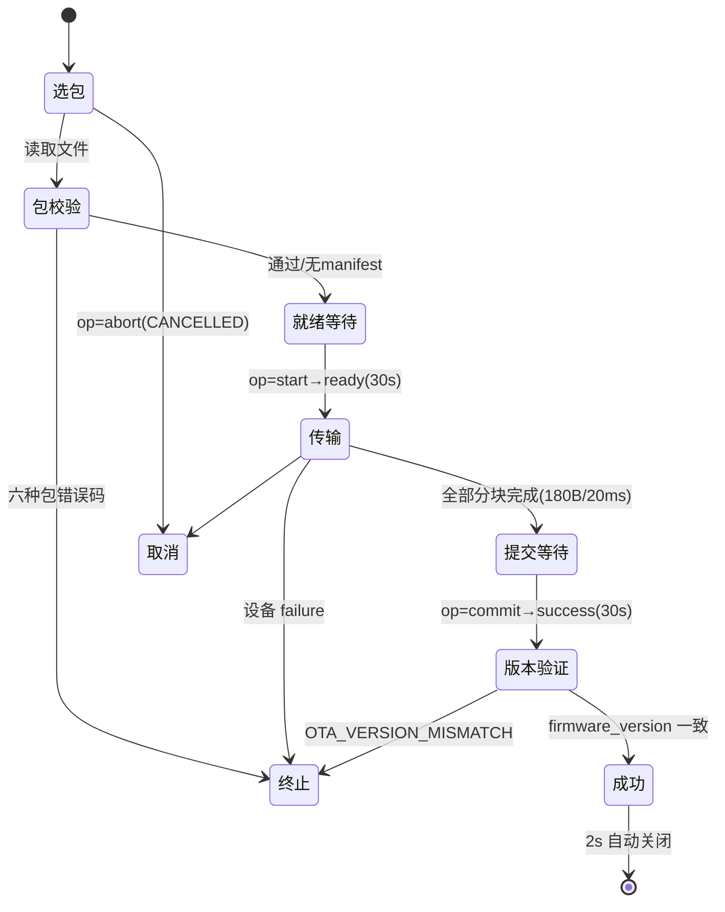

# STATE_MACHINE —— 状态机正典

> SOP v2.0 Phase 5 产出 · 2026-09-02
> 事实源：REVERSE_ANALYSIS §2.3/§4.1/§4.6.1/§7.3/§7.6/§7.8。枚举名以所注源码为准；标注【未知】处未逐行核对源码枚举全集。

## 1. BLE 连接会话（session-registry，8 态）

所有权：owner（PAGE/WORKFLOW/BACKGROUND/SYSTEM）可断开；borrow 引用只能 release。`provisioning` 标志实现配网互斥。

## 2. 重连（reconnectState）

USER_REQUEST（用户主动断开）**永不进入重连**；OTA 接管期间禁自动重连。

## 3. Smart HID 配网工作流（workflow-engine，纯 JS）

token 生命周期：内存态，TTL 5 分钟（createMemoryTokenStore）。

## 4. 设备侧 STATUS 状态（协议上行，驱动 UI 四行进度）

`state ∈ {boot, load_config, unprovisioned, provisioning, connecting_wifi, pairing, mqtt_connecting, ready, recovery, error}`
`step ∈ {received, connecting_wifi, wifi_connected, pairing, pairing_success, mqtt_connecting, ready}`
`error ∈ 8 码`（invalid_payload / wifi_failed / controlhub_unreachable / pairing_invalid / pairing_expired / pairing_used / mqtt_invalid / storage_failed）

UI 映射：四行 {wifi, hub, conn, usb} × {pending, active, done, fail, warn}；如 pairing→hub active、ready→全 done、wifi_failed→wifi 行 fail。

## 5. 广播会话（BROADCAST_STATE，6 态）

单 owner；ADVERTISING 中禁改 payload（OWNER_BUSY）。

## 6. OTA 事务（12 态；枚举全集以 services/ota/ota-manager.js 为准）

产品行为视图（阶段名与流程事实来自 REVERSE_ANALYSIS §4.6.1）：

注：OTA_STATE.CONNECTING 已定义但流程从不进入（连接由外部会话前置）；12 态精确枚举名【未知——未逐行核对 ota-manager.js，重构时以源码/单测为准】。

## 7. 扫描会话（PAGE001 页面级）

`starting → scanning → stopping → idle`；任一环节可 → `failed`（横幅+重试）。会话固定 5s 自动停。

## 8. 诊断页状态（PAGE005 页面级）

`idle（尚未检测）/ connected（已连接可检测）/ checking（检测中）/ live（检测完成）/ offline（设备未连接）/ error（检测失败）`；行级 ok/warn/active/pending/fail。

## 9. 服务面板状态（PAGE006）

`idle / connecting / ready / empty / error`（operation-state 承载，error 带 retry）。
