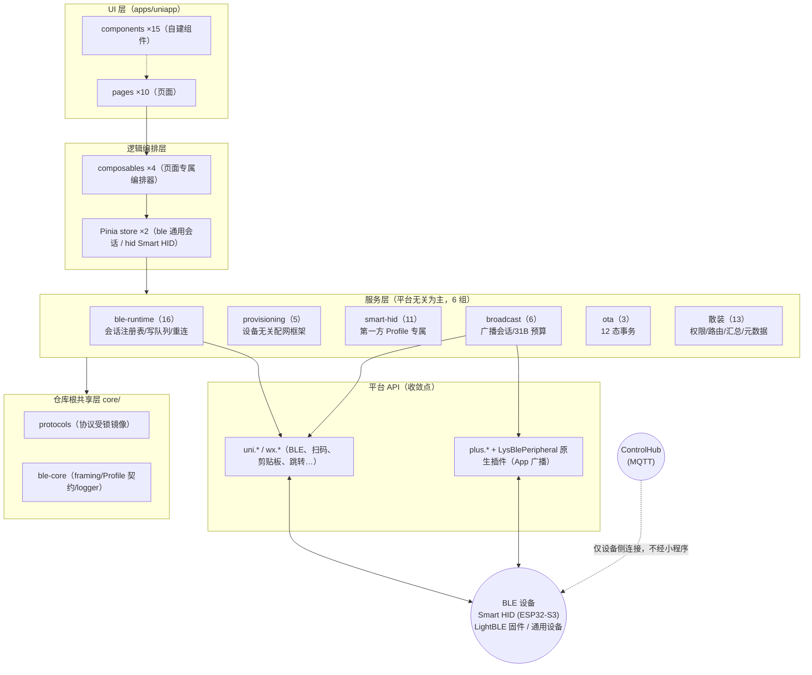

# SYSTEM_ARCH —— 系统整体架构

> SOP v2.0 Phase 5 产出 · 2026-09-02
> 事实源：REVERSE_ANALYSIS §1.2（技术架构）/ §2（结构）。描述旧项目现状架构，作为重构基线。

## 1. 系统架构图

**关键声明**：全系统**无后端、无 HTTP、无登录**（REVERSE_ANALYSIS §1.2）；小程序与 ControlHub 之间没有任何网络路径，配网信息经 BLE 下发到设备、由设备侧连接 ControlHub。

## 2. 分层规则（架构铁律）

1. 依赖单向：`pages → composables → store → services → core → 平台 API`。
2. 平台调用收敛：uni.\*/wx.\*/plus.\* 只出现在 4 处（ble-runtime/index.js 经 platform.js 注入、scan-permission.js、wx-peripheral-\*.js、broadcast/index.vue）——详见 [../00_context/TECH_STACK.md](../00_context/TECH_STACK.md) §2。
3. 服务层纯 JS 化：业务状态机可在 Node 直接单测（仓库根 tests/unit 29 个）。
4. core/ 为跨端正典：协议镜像受 smart-hid-contract.lock.json 锁定，改动须走契约流程。

## 3. 三层会话体系（产品可感知行为的架构源头）

- **注册表层**（session-registry）：会话 8 态状态机 + 所有权（owner 可断开 / borrow 只可 release）+ 配网互斥标志。
- **运行时回调层**（ble-runtime）：uni BLE 全局回调唯一所有者；主动断开 2s marker 区分被动断线。
- **重连管理层**（reconnect-manager/policy）：3 次上限、backoff 1s/3s/5s；USER_REQUEST 永不重连。

## 4. Profile 扩展机制（生态系统位）

新设备家族以 Profile 注册表接入（契约 core/ble-core/provisioning/profile-contract.js）：serviceUuid/namePrefix 匹配 → 专属路由（model.routes）与动作（presentation）→ 复用通用连接/写入/notify 基础设施。内置 smart-hid（真实）+ esp32-demo（演示）。**重构时该机制属须保留的通用层，不得为单一设备族改写**（与用户既有约定一致）。
