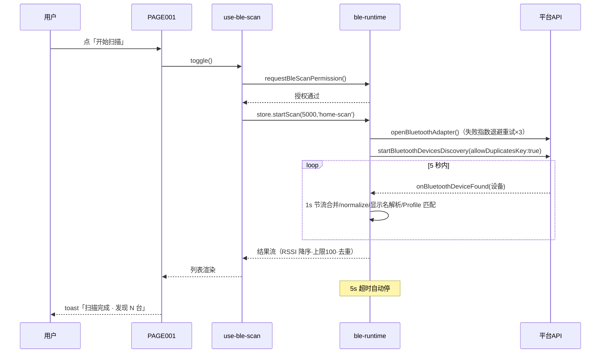
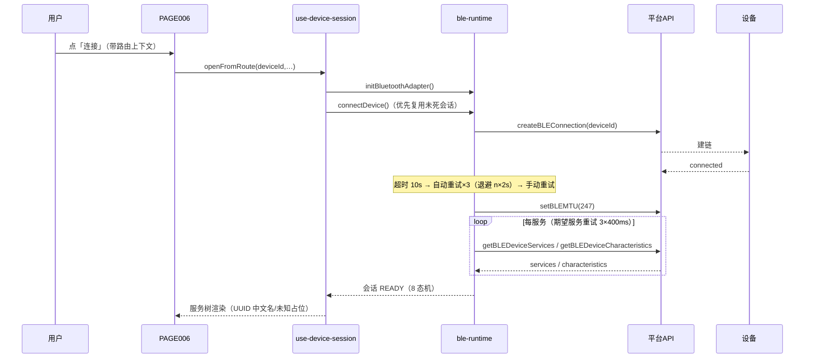
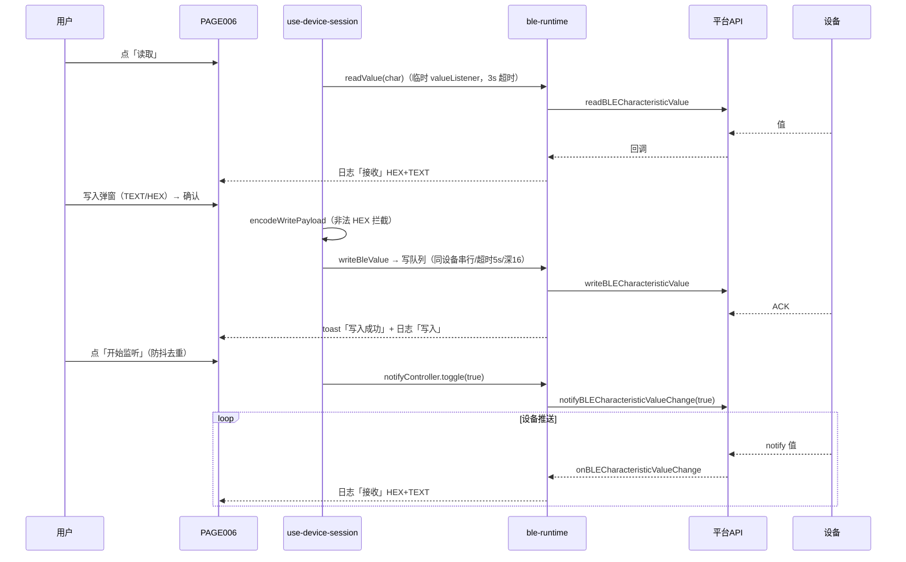
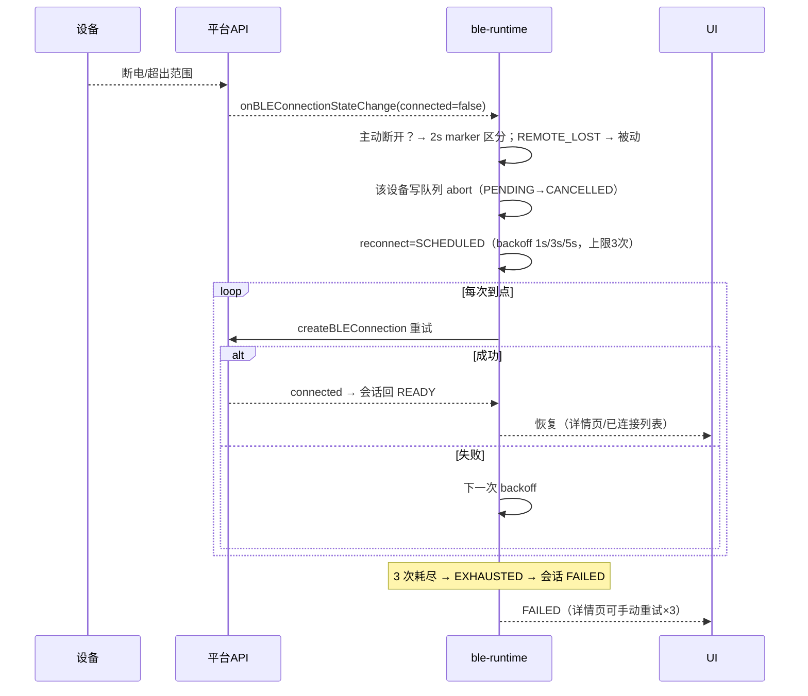
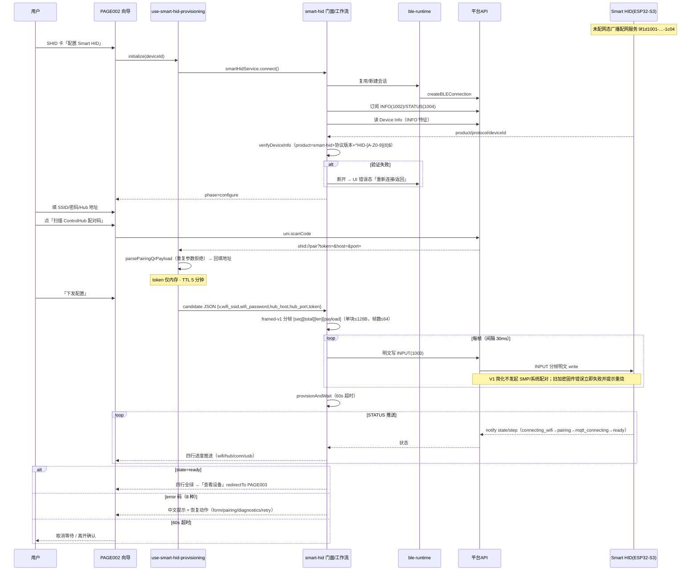
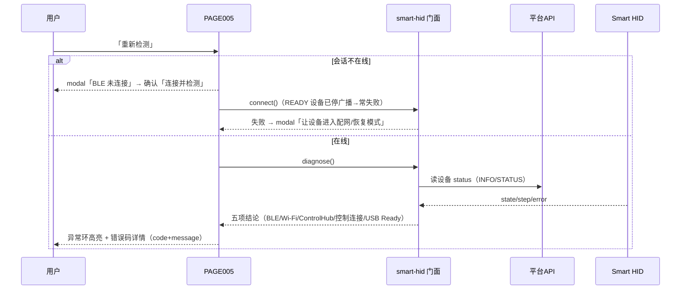
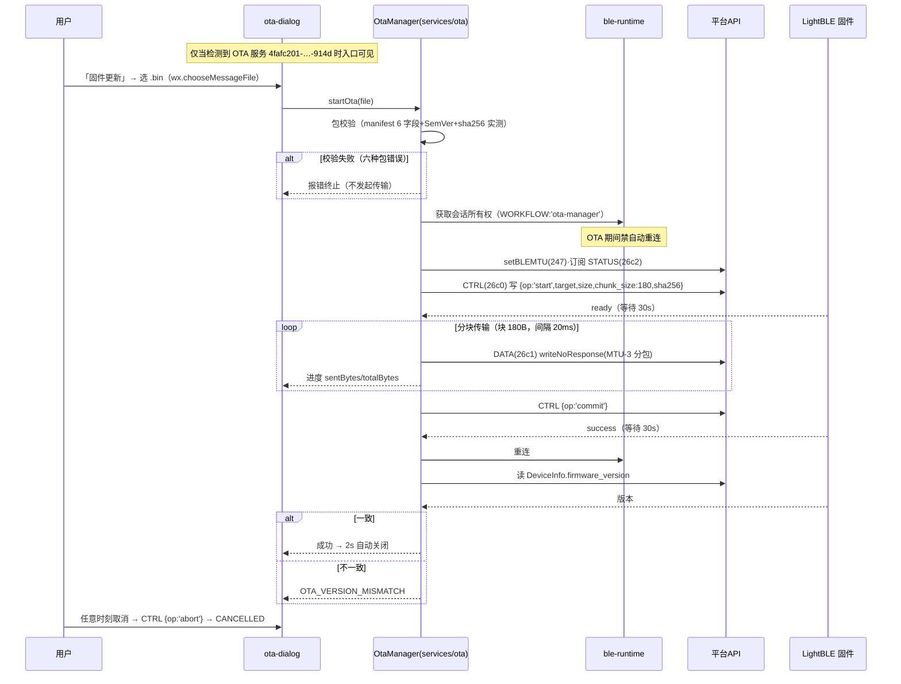
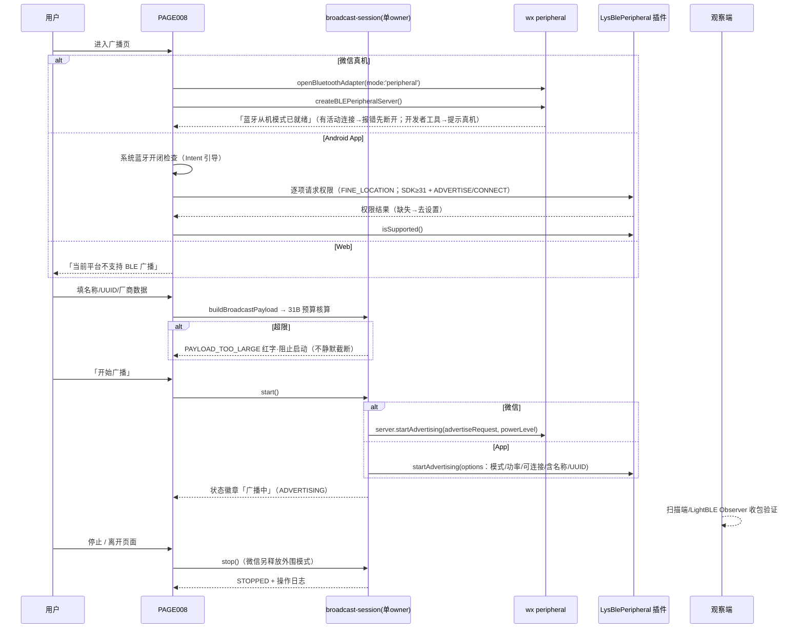

# SEQUENCE_DIAGRAMS —— 时序图正典

> SOP v2.0 Phase 6 产出 · 2026-09-02
> 事实源：REVERSE_ANALYSIS §2.3（机制参数）/ §4（页面行为）/ §4.6.1（OTA）/ §8.4（协议契约）。参与方约定：**用户 / UI / 编排(composable) / 服务(services) / 运行时(ble-runtime) / 平台API(uni·wx·plus·插件) / 设备**。本产品无登录/支付/网络同步，v2.0 清单中的「蓝牙通信/OTA/连接」对应下列 8 图。

## 1. 扫描会话（F001/F002）

异常：授权拒绝→scanError(reason)→错误横幅+去设置；蓝牙未开(10001)→引导弹窗。

## 2. GATT 连接与服务发现（F006）

## 3. 特征读 / 写 / 监听（F008/F009/F010）

## 4. 被动断线与自动重连（F012）

## 5. Smart HID 配网全流程（F019–F022，核心图）

## 6. Smart HID 诊断（F024）

## 7. OTA 固件升级（F025）

## 8. 广播启动（F014/F015，平台双路径）

