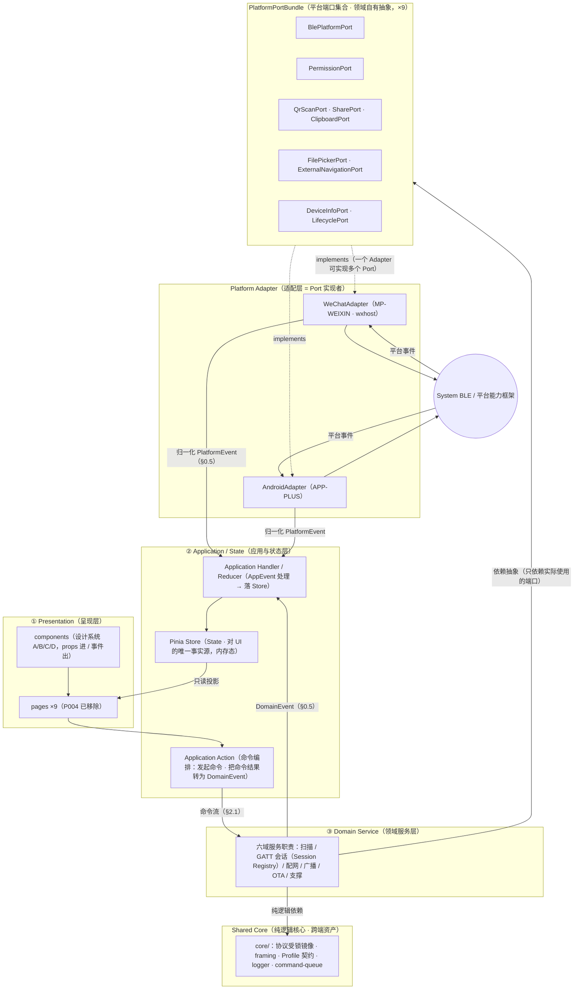

# RUNTIME_ARCHITECTURE —— Runtime 开发架构规范

> 版本：1.3（08-G0.1 原工程内重构口径）· 生成日期：2026-09-03（v1.0）；修订 2026-09-03（v1.1，08-G0）；修订 2026-09-03（v1.2，08-G1）；修订 2026-09-03（v1.3，08-G0.1）
> **v1.3 修订记录（08-G0.1 方向纠偏）**：① TARGET_APP_ROOT 由 `apps/uniapp-next`（平行新建，已废弃）改为 **`apps/uniapp`（原工程内重构改版）**——本文是旧工程**重构目标**，不是从零重写指令（[IMPLEMENTATION_TARGET](IMPLEMENTATION_TARGET.md) v1.2 §2）；② 现有模块先经 [LEGACY_REUSE_MATRIX](LEGACY_REUSE_MATRIX.md) 决定 保留/包装/重构/重写/删除/待验证，不默认全保留、不默认全重写；③ 稳定 BLE Runtime（会话注册表/写队列/重连/GATT 编解码）、协议、原生插件等可经测试后复用；页面、状态、平台边界按目标规范逐步重构；④ 删除「legacy-read-only 永久隔离」表述，改为 pre-development freeze（开发前暂不修改）+ implementation target（门禁通过后原路径重构）两态口径。分层/事件/端口契约本体零改动。
> **v1.1 修订记录（08-G0 工程实现基线纠偏）**：① 废弃 v1.0 的线性依赖链 `services → core → 平台 API`——该链是旧工程（apps/uniapp）实证形态，**不得自动升级为新工程架构事实**（[IMPLEMENTATION_TARGET](IMPLEMENTATION_TARGET.md) §1 规则 3）；② 改为 **Ports & Adapters** 目标模型（§0）；③ 新增命令流 / 事件流双通道正典（§2）；④ 新增五条依赖禁令（§0.4）；⑤ 新增「已采纳目标决定 vs legacy reference only」分类表（§0.3）；⑥ C1/C3 已裁决引用更新（[PLATFORM_CAPABILITY_DECISION](PLATFORM_CAPABILITY_DECISION.md)）。
> **v1.2 修订记录（08-G1 工程契约四件套生成与事件模型收口）**：① **事件来源二分**——PlatformEvent（平台/系统回调）与 DomainEvent（命令/状态机/校验/定时器）统合为 AppEvent 信封进入 Handler / Reducer（§0.5、§2.2）；② **命令流结果收口**——命令结果只允许 accepted / rejected / cancelled / completed 四值，Service 不得以命令结果直写 Store，Application Action 必须把命令结果转换为 DomainEvent 再交 Handler / Reducer（§2.1）；③ **运行隔离**——operationId / sessionId / generation / timestamp / source 五元组与旧运行失效规则（§0.6）；④ **平台端口拆分**——单一 BLE Platform Port 拆为职责明确的 **PlatformPortBundle**（BlePlatformPort / PermissionPort / QrScanPort / SharePort / ClipboardPort / FilePickerPort / ExternalNavigationPort / DeviceInfoPort / LifecyclePort ×9，§1.4）；⑤ 依赖禁令维持并显式列入「Store import Service」（§0.4）。方法与事件契约正文见 [API_SPEC](API_SPEC.md)、类型契约见 [DATA_MODEL](DATA_MODEL.md)、错误契约见 [ERROR_CODE](ERROR_CODE.md)、权限契约见 [PERMISSION](PERMISSION.md)——本文不重复四件套正文。
> 输入（本文全部结论的来源）：[04_architecture](../04_architecture/)（SYSTEM_ARCH / MODULE_ARCH / STATE_MACHINE / DATA_FLOW——**其中模块与依赖描述为旧工程实证，legacy reference**）· [10_platform/PLATFORM_EXTENSION.md](../10_platform/PLATFORM_EXTENSION.md) · [11_ecosystem](../11_ecosystem/)（API_UNIFIED_SPEC_v1.0 / ALIGNMENT_NOTES）· 08_development 既有件（API_ACTION_MATRIX / PLATFORM_ADAPTER_SPEC / STORAGE_POLICY / DEVELOPMENT_SCOPE / FEATURE_IMPLEMENTATION_MATRIX / IMPLEMENTATION_TARGET / PLATFORM_CAPABILITY_DECISION / API_SPEC / DATA_MODEL / ERROR_CODE / PERMISSION）
> 性质：**不新增功能、不改变产品定义、不引入后端与持久化**。本文只做 Runtime 运行时分层收口（目标分层 / 事件模型 / 命令流·事件流 / 状态唯一来源 / Adapter 边界 / 零持久化 / 测试边界），产品级结论全部引用既有正典章节，冲突时以被引文档为准，本文不产生第二正文。
> 用途：**改版目标工程（TARGET_APP_ROOT = `apps/uniapp`，原工程内重构）的运行时分层契约**——与 [PLATFORM_ADAPTER_SPEC](PLATFORM_ADAPTER_SPEC.md)（Base Core × Adapter 二分）、[IMPLEMENTATION_TARGET](IMPLEMENTATION_TARGET.md)（改版落位与复用纪律）、[API_SPEC](API_SPEC.md)（方法与事件契约）、[API_ACTION_MATRIX](API_ACTION_MATRIX.md)（动作契约）、[STORAGE_POLICY](STORAGE_POLICY.md)（数据位置策略）、[FEATURE_IMPLEMENTATION_MATRIX](FEATURE_IMPLEMENTATION_MATRIX.md)（功能映射）、[LEGACY_REUSE_MATRIX](LEGACY_REUSE_MATRIX.md)（旧代码逐项处置）并列使用。本文描述的是 `apps/uniapp` **重构后的目标形态**：开发前（pre-development freeze）不要求旧工程即时满足；门禁通过后按 [LEGACY_REUSE_MATRIX](LEGACY_REUSE_MATRIX.md) 逐模块渐进迁移到位，不要求从零重写。

## 0. 总览：Ports & Adapters 目标架构

### 0.1 目标架构图



依赖规则（Ports & Adapters，依赖只能指向内层抽象）：

1. **纵向主链**：Presentation → Application / State → Domain Service → **平台端口（PlatformPortBundle，端口属于领域，由 ③ 持有与定义）**；③ 内各服务只依赖其实际使用的端口，不要求全量依赖 bundle。
2. **纯逻辑依赖**：Domain Service → Shared Core（协议镜像 / framing / logger / command-queue 等纯逻辑资产，复用须经契约测试，[IMPLEMENTATION_TARGET](IMPLEMENTATION_TARGET.md) §3）。
3. **实现关系**：WeChatAdapter / AndroidAdapter **implements 平台端口** → 调用 System BLE / 平台能力框架（uni.\*/wx.\*/plus.\* 只许出现在 Adapter 内部）。Adapter 依赖 Port（向内），**Port 与 Base Core 不依赖任何具体 Adapter**——组装根（composition root，应用启动处，条件编译 MP-WEIXIN / APP-PLUS 或运行时注入）是唯一知道具体 Adapter 的位置；**所有 Port 都由组装根注入**。
4. **禁止隐式双向依赖**：Adapter 经端口接入 Base Core，只有「Adapter → Port」一条边；Base Core 侧不得出现任何反向引用 Adapter 的 import、全局单例探测或条件编译分支（[PLATFORM_ADAPTER_SPEC](PLATFORM_ADAPTER_SPEC.md) §2，PZ-8 目标形态）。
5. **端口不泄露平台类型**：任何 Port 的方法签名、返回值与事件载荷中禁止出现 wx.\* / plus.\* 原生对象（归一化义务在 Adapter，§1.4；API_SPEC §2）。

### 0.2 版本追溯（v1.0 五层 → v1.1 目标角色，v1.2 增量）

| v1.0 层名（旧工程实证映射） | v1.1+ 目标角色 | v1.2 增量 |
|---|---|---|
| ① Presentation Layer | **Presentation** | 不变 |
| ② State Layer | **Application / State** | ACT 新增「命令结果 → DomainEvent 转换」义务（§2.1）；HND 明确为 AppEvent 的 Handler / Reducer（§0.5） |
| ③ Domain Service Layer | **Domain Service** | 平台访问从「单一 BLE Port」改为「PlatformPortBundle 按职责取用」（§1.4）；新增 DomainEvent 产出义务（§0.5）与运行隔离五元组（§0.6） |
| ④ BLE Core Layer | **Shared Core（纯逻辑）** | 不变（core 不在平台链路上） |
| ⑤ Platform Adapter Layer | **Platform Adapter（Port 实现者）** | 实现对象从单一 Port 扩为端口集合（一个 Adapter 可实现多个 Port，§1.4） |

**废弃口径（v1.0 §0.2 依赖单向铁律原文）**：`pages → composables → store → services → core → 平台 API`（SYSTEM_ARCH §2 规则 1 / MODULE_ARCH §2）——此链为 **legacy reference only**（apps/uniapp 旧工程实证）；其 `store → services` 的 import 方向与本文 §0.4 禁令 2 冲突，重构后代码**不得沿用**。旧工程中「平台调用收敛于 4 个文件」（ble-runtime/index.js 经 platform.js 注入 / scan-permission.js / wx-peripheral-\*.js / broadcast/index.vue）同为 legacy reference（收敛**原则**被采纳，收敛**形态**不复刻，见 §0.3）。

### 0.3 采纳决定 × legacy reference 分类表（不得混写）

| 条目 | 分类 | 说明 |
|---|---|---|
| Application 编排层存在（Page 与 State/Service 之间的用例编排角色 = 命令发起 + 命令结果→DomainEvent 转换 + 事件落 Store） | **已明确采纳的目标架构决定** | §0.1 ② 层的 ACT/HND 两角色；命令流/事件流的必经编排 |
| 事件模型二分（PlatformEvent / DomainEvent → AppEvent → Handler / Reducer → Store，§0.5） | **已明确采纳的目标架构决定** | 08-G1 收口；事件信封字段以 [DATA_MODEL](DATA_MODEL.md) §2 为契约 |
| 运行隔离五元组与旧运行失效规则（§0.6） | **已明确采纳的目标架构决定** | P005 DIAG_RUN 教训的通用化抽象（原型变量名不升格为接口名） |
| composables ×4 具体文件（use-ble-scan / use-device-session / use-broadcast-session / use-smart-hid-provisioning 及行数） | **legacy reference only** | 旧工程实证（MODULE_ARCH §1）；重构后按用例组织 Action/Handler，不承诺同名同数（IMPLEMENTATION_TARGET §2 规则 4；逐文件处置见 LEGACY_REUSE_MATRIX） |
| Pinia 内存态 Store 作为 State Layer；Store 对 UI 为唯一事实源 | **已明确采纳的目标架构决定** | 零持久化（Z-2）与 SSOT（§3）的决定性载体；写入只经 Application Handler |
| Store ×2 具体文件（ble.js / hid.js 及行数） | **legacy reference only** | 两文件名与「恰好 2 个」为旧工程形态；状态**域**划分（扫描·连接投影 / 配网·诊断）作为产品口径采纳（DATA_MODEL §1 实体清单），文件数不强约束 |
| 六域 Domain Service 职责边界（扫描 / GATT 会话 / 配网 / 广播 / OTA / 支撑） | **已明确采纳的目标架构决定** | 与 FEATURE_MAP §1 六域能力树同构；Session Registry（会话 8 态 + owner/borrow）为领域内事实源 |
| services ×6 具体文件与文件数（ble-runtime 16 / provisioning 5 / smart-hid 11 / broadcast 6 / ota 3 / 散装 13） | **legacy reference only** | 旧工程实证（MODULE_ARCH §3 职责表仍作为职责证据被引用）；重构后按域组织，不复制文件数与文件名（稳定服务可经测试后保留复用，LEGACY_REUSE_MATRIX） |
| 平台端口集合 PlatformPortBundle ×9（职责拆分见 §1.4；物理文件是否拆分不是本轮决策） | **已明确采纳的目标架构决定** | 08-G1 收口；职责契约必须分开，形态自由 |
| 平台调用只出现在 Adapter 层（经端口接入，禁止散落 Base Core） | **已明确采纳的目标架构决定** | PZ-8 的目标形态；由 Port 实现自然收敛 |
| 旧工程 4 个平台收敛文件（ble-runtime/index.js 经 platform.js 注入 / scan-permission.js / wx-peripheral-\*.js / broadcast/index.vue） | **legacy reference only** | 旧收敛机制证据（SYSTEM_ARCH §2 规则 2）；重构后不复刻该形态——scan-permission 的「唯一直调 wx.\* 先例」在目标架构中归入 WeChatAdapter 的 **PermissionPort** 实现 |
| Shared Core = core/ 纯逻辑资产（协议镜像 / framing / Profile 契约 / logger / command-queue），零下游依赖 | **已明确采纳的目标架构决定** | 复用须经契约测试（IMPLEMENTATION_TARGET §3）；core/components 为 Electron 双实现禁误 import（MODULE_ARCH §4） |
| 旧工程「core 出现在通往平台的依赖链上」（services → core → 平台 API） | **legacy reference only（已废弃）** | v1.1+ 目标模型中 core 不在平台链路上（§0.2 第 4 行） |

### 0.4 依赖禁令（红线，任何重构后代码评审直接判违例）

| # | 禁令 | 判定 | 依据 |
|---|---|---|---|
| R-1 | **Service import Store** | ③ 内任何文件出现对 ② Pinia store 的 import / 引用即违例；服务产生的状态变化只能经事件通道由 Application Handler 落 Store | §0.1 事件流 · v1.0 §3.2 禁止 3 的目标化 |
| R-2 | **Store import Service（含双向 import）** | 重构后代码中两者**互不 import**（既禁 Service→Store，也禁 Store→Service，更禁双向）；编排与写入都归 ② Application 层 | §0.2 废弃口径 · MODULE_ARCH §2（legacy store→services 不沿用） |
| R-3 | **Core 调用 Adapter** | Shared Core（core/）出现对 Adapter / Port 实现 / 平台 API 的任何依赖即违例——core 零下游依赖 | MODULE_ARCH §2「core ──►（无）」 · IMPLEMENTATION_TARGET §3 |
| R-4 | **Page/Component 调用平台 API** | ① 内出现 uni.\*/wx.\*/plus.\* 直调即违例；平台能力一律经 ② ACT → ③ → 端口 → Adapter（扫码 / 分享 / 剪贴板 / 文件选择 / 外链 / 设置跳转同样如此，§1.4） | PZ-8 · SYSTEM_ARCH §2 规则 2（原则采纳） |
| R-5 | **Adapter 修改产品状态机** | Adapter 不得增删状态、改转移或恢复路由、改错误码四分流；平台特有失败分支只能作为平台补充态登记（§3.3） | PZ-2 · STATE_MODEL §2-1 · §4.2 |

**与生态统一架构的对应**（API_UNIFIED_SPEC §2「应用层 → Smart BLE API → 平台适配层 → 系统 BLE Framework」）：①② 对应应用层；③ + 平台端口承载 Smart BLE API（BLE.\*）的本项目实现——**BlePlatformPort 即「Smart BLE API ↔ 平台适配层」边界在本工程内的接口化身**；⑤ 即平台适配层。BLE.\* ↔ wx.\* 映射以 API_ACTION_MATRIX §4 为准（ALIGNMENT_NOTES §4）；枚举口径未定稿前不得单方面切换 BLE.\* 枚举（API_ACTION_MATRIX §6）。

### 0.5 事件模型（08-G1 收口：事件来源二分 + AppEvent 信封）

事件按**来源**分为两类，两者不得混写：

**PlatformEvent（平台事件）**——来源于平台或系统回调，只被 Adapter 订阅与归一化，统一载荷不含平台类型（wx.\* 原生形态不得越过 Port）：

| PlatformEvent | 载荷要点 | 来源 |
|---|---|---|
| BluetoothStateChanged | 蓝牙开关/适配器状态（基线三态+unknown，DATA_MODEL §3.1） | wx.onBluetoothAdapterState 等（API_SPEC §3） |
| DeviceFound | 归一化设备发现项（ScannedDevice 增量） | wx.onBluetoothDeviceFound |
| ConnectionStateChanged | deviceId + 连接态变化（含 connected=false 的被动断线） | wx.onBLEConnectionStateChange |
| CharacteristicValueChanged | deviceId + serviceUuid/charUuid + 值（notify/indicate/read 上行） | wx.onBLECharacteristicValueChange |
| PeripheralStateChanged | 外围广播态变化（C1 supported_limited 语境） | BLEPeripheralServer 回调（API_SPEC §8） |
| PermissionStateChanged | 权限态变化（PERMISSION §1 PermissionState） | 平台权限回调（API_SPEC §2） |
| LifecycleChanged | 前后台/页面卸载（BR-06 触发源） | 宿主生命周期回调（API_SPEC §2） |

**DomainEvent（领域事件）**——来源于应用命令、领域状态机、校验、定时器和超时（由 ③ 产出或由 ② ACT 在命令结果转换时产出）：

| DomainEvent | 语义 | 来源 |
|---|---|---|
| ScanRequested / ScanStarted | 扫描命令受理 / 会话启动（5s） | SM §7 · SEQ §1 |
| ScanStopRequested | 停止扫描（reason=user / page_hide / page_unload） | PAGE_SPEC §0.4 · BUSINESS_FLOW §1 |
| ScanTimedOut / ScanFailed | 5s 到时自动停 / 扫描失败 | SM §7 · BUSINESS_FLOW §1 |
| ConnectRequested | 连接命令受理（10s 超时 + 3 次退避重试） | SM §1 · SEQ §2 |
| RetryScheduled | 重连/重试排期（1s/3s/5s；初始化 1s/2s/4s） | SM §2 · BUSINESS_FLOW §1 |
| WriteQueued | 写请求入队（同设备串行，深度 16） | DATA_FLOW §2 |
| ValidationRejected | 校验拒绝（非法 HEX / 空 payload / 超 31B / 表单非法） | PAGE_SPEC §6/§8 · BR-05 |
| ProvisioningTimedOut | 配网 60s 轮询超时 | BUSINESS_FLOW §4 · SEQ §5 |
| DiagnosticStepChanged | 诊断步骤推进（五行状态） | SM §8 · SEQ §6 |
| OtaValidationFailed | OTA 包校验失败（六重校验） | SM §6 · SEQ §7 |
| OperationCancelled | 运行被取消（取消等待 / 队列 abort / OTA abort / 离开配网） | BUSINESS_FLOW §2/§4/§6 |

> 事件名可按规范最终整理；本表为最小闭环集，实现期如需同风格扩充须经评审并回写本表与 [API_SPEC](API_SPEC.md) §3——**但不得借事件名增加产品状态**（状态集合正典仍在 STATE_MACHINE §1–§9，PZ-2）。

**统一关系（事件通道唯一入口）**：

```text
PlatformEvent ─┐
               ├→ AppEvent → Application Handler / Reducer → Store
DomainEvent ───┘
```

AppEvent 信封公共字段（eventId / type / timestamp / source / operationId? / sessionId? / deviceId? / generation? / payload）的契约正文见 [DATA_MODEL](DATA_MODEL.md) §2。Handler 处理中可调用 ③ 的业务规则纯函数（节流 / 去重 / 合并 / 匹配 / 状态机转移），处理结果写入 Pinia Store；UI 只读 Store 投影。

### 0.6 运行隔离（stale run 防护）

**隔离标识（五元组）**：

| 标识 | 作用 | 契约 |
|---|---|---|
| operationId | 单次命令/操作运行的唯一标识（一次 connect / 一次下发 / 一次诊断） | DATA_MODEL §1（OperationId，technical-only） |
| sessionId | 会话归属（扫描会话 / 连接会话 / 配网会话 / 广播会话 / OTA 事务） | DATA_MODEL §1（SessionId） |
| generation（run token） | 同一目标上「当前有效代」——新命令使旧代失效 | runtime-only，never-persisted |
| timestamp | 事件/回调产生时间 | DATA_MODEL §1（Timestamp） |
| source | 来源（页面 / 工作流 / 系统 / 平台回调） | AppEvent.source |

**规则**：

1. 旧运行的异步回调、timer、Promise、平台回调，在 **operationId 不匹配**（非本次操作）或 **generation 不匹配**（已有更新代运行）时**必须被丢弃**，不得进入 Handler / 不得触发状态机转移 / 不得写 Store。
2. 每个回调 / 事件进入处理前先比对五元组（§0.6 表）——丢弃动作静默进行，不产生用户可见反馈、不产生错误日志噪音（可留 debug 级日志）。
3. 用户重新触发的同类操作（重新检测 / 重新配网 / 重下发）必须产生新 operationId 并推进 generation；禁止复用旧 operationId 续跑。
4. timer / 轮询（60s 配网轮询、5s 扫描、重连 backoff 1s/3s/5s、初始化退避 1s/2s/4s）与 Promise 挂钩同一失效规则——运行被取消（OperationCancelled）后其全部挂起回调按本规则丢弃。

**教训抽象**：原型 P005 修复（DIAG_RUN 竞态——重新检测期间旧检测回调回写覆盖新状态，[P005_DIAGNOSE_FIX_REPORT](../06_review/P005_DIAGNOSE_FIX_REPORT.md)）证明「无运行隔离的事件直写」会让旧运行结果穿越到新 UI。本节将该教训抽象为通用运行时规则；**原型中的具体变量名（如 DIAG_RUN 旗标）不升格为接口名**——重构后代码以五元组字段承载同等语义（DATA_MODEL §7 technical 字段表）。

### 0.7 依赖禁令重申（08-G1 维持）

仍然禁止（与 §0.4 同一组，逐字重申以防误读）：**Service import Store；Store import Service；Service 与 Store 双向依赖；Core 调 Adapter；Page/Component 调平台 API；Adapter 修改产品状态机。**

## 1. 分层逐层契约

### 1.1 ① Presentation（呈现层）

- **职责**：页面路由与渲染（P001–P010，P004 已移除，现行 9 页）、设计系统组件拼装（A/B/C/D 授权表内）、发起用户动作。
- **允许**：读 Store 只读投影并渲染；经 Application Action 发起命令；组件 props 进 / 事件出；生命周期隐式动作（P001 离页停扫、P008 离页停广播等——守则平台无关，PLATFORM_ADAPTER_SPEC §1 生命周期行；触发源经 LifecyclePort 上行 LifecycleChanged）。
- **禁止**：直调平台 API（禁令 R-4，含扫码/分享/剪贴板/文件选择/外链）；自持 BLE 状态副本（§3）；绕过 Application 层的数据旁路。
- **来源**：PAGE_SPEC / 07_design_system/COMPONENT.md 授权表 · MODULE_ARCH §2（组件依赖位置，legacy 实证同结论）。

### 1.2 ② Application / State（应用与状态层）

- **职责**：**命令编排**（Application Action：接收页面动作 → 调用 Domain Service → 命令经端口下行 → **把命令结果（accepted / rejected / cancelled / completed，§2.1）转换为 DomainEvent**）与**事件处理**（Application Handler / Reducer：订阅 AppEvent → 调用业务规则 → 写入 Pinia Store）；Store 持有全部运行时业务状态的对 UI 投影（内存 reactive，9 类实体，STORAGE_POLICY §3）。
- **允许**：ACT/HND import Store 与 Service（本层是唯一同时触达两者的层）；HND 在落 Store 前调用 Service 的业务规则处理（节流 / 去重 / 合并 / 匹配 / 状态机转移等纯函数或领域调用）；ACT 在发出命令时生成 operationId / 推进 generation（§0.6）。
- **禁止**：Store 出现任何存储键（Z-2，DATA_MODEL 前提）；Store 与 Service 互相 import（禁令 R-1/R-2——编排归本层，不归 Store 内部 action）；增删状态集合（PZ-2）；以命令结果直写 Store（§2.1——必须先转 DomainEvent）。
- **来源**：STORAGE_POLICY §1/§3 · DATA_MODEL §1 · §0.1 图 · §2.1/§2.2。

### 1.3 ③ Domain Service（领域服务层）

- **职责**：六域业务逻辑——扫描会话（节流 / 合并 / 上限）、GATT 会话（Session Registry：8 态 + owner/borrow 所有权 + provisioning 互斥 + 写队列 + 重连 3×backoff）、配网（Profile 注册表 / 工作流 / transport）、广播（会话 / 31B 预算）、OTA（12 态事务 / 校验）、支撑（路由上下文 / 断开汇总 / 版本元数据 / 日志脱敏）；**产出 DomainEvent**（§0.5）并执行运行隔离判定（§0.6）。
- **允许**：依赖平台端口（抽象，按需取用 bundle 内端口）与 Shared Core（纯逻辑）；平台无关业务逻辑可在 Node 直接单测（SYSTEM_ARCH §2 规则 3 原则采纳）；新设备家族经 Profile 注册表接入（DEVICE_PROFILE_RULE DR-2）。
- **禁止**：import Store / pages / components（禁令 R-1；MODULE_ARCH §2 明文）；直调平台 API（平台访问只经端口）；修改状态集合与转移、核心流程（PZ-2/PZ-4）。
- **来源**：MODULE_ARCH §3（职责证据，legacy reference）· STATE_MACHINE §1–§9 · SYSTEM_ARCH §3（三层会话体系机制锚点：注册表层 / 回调归一层 / 重连管理层——在新模型中回调所有权归 Adapter，注册表与重连逻辑归 ③）。

### 1.4 平台端口集合 PlatformPortBundle（领域自有抽象 · ×9）

08-G1 将单一「BLE Platform Port」拆分为职责明确的端口集合——**职责契约必须分开；物理文件是否拆分不是本轮决策**（可在同一 Adapter 模块内以接口分立表达）。

| Port | 职责边界（只含所列能力） | 明确不含 | 支撑功能 |
|---|---|---|---|
| **BlePlatformPort** | 只包含 BLE 中央（扫描/连接/GATT/读写）、Notify、外围广播与蓝牙状态能力 | 权限不混入；扫码/分享/剪贴板/文件/外链/设备信息不混入 | F001/F004–F021/F024/F025 |
| **PermissionPort** | 权限查询 / 申请 / 订阅状态变化 / 权限设置页跳转（open_settings 恢复动作的通道） | 不含任何 BLE 方法；不含通用外链 | F002/F015/F020（[PERMISSION](PERMISSION.md) §2/§3） |
| **QrScanPort** | 摄像头扫码（shid://pair 解析前置的原始内容获取；取消/权限/失败三分支） | 不属 BlePlatformPort | F020 |
| **SharePort** | 分享（微信社交卡片/Timeline、系统分享面板；失败降级复制由 ClipboardPort 协作） | — | F029 |
| **ClipboardPort** | 剪贴板单次写入（复制广播数据/日志/外链/版本；瞬态通道，STORAGE_POLICY §6） | 敏感字段永不进入（S-4） | F004/F011/F027/F028 |
| **FilePickerPort** | 文件选择（OTA 选 .bin：微信 chooseMessageFile / App chooseFile；一次性读入） | 不属 BlePlatformPort | F025 |
| **ExternalNavigationPort** | 通用外链跳转（系统浏览器/新窗）、小程序跳转（F028 navigateToMiniProgram）、落地页 | 权限设置页跳转归 PermissionPort | F027/F028 |
| **DeviceInfoPort** | 设备/宿主信息（platform / osName / 型号；wxhost 宿主维度判定）与运行时版本取值（APP widget / 微信 getAccountInfoSync） | — | F002（宿主分支）/F014（devtools 拦截）/F027 |
| **LifecyclePort** | 宿主生命周期订阅（onShow/onHide/onUnload → LifecycleChanged） | — | BR-06 全部隐式动作 |

**接入与实现规则**：

1. 所有 Port 都由**组装根注入**（§0.1 规则 3）；③ 只见抽象接口，不见 Adapter。
2. 所有 Port **禁止泄露 wx.\* / plus.\* 原生对象**（方法签名、返回值、事件载荷，§0.1 规则 5）。
3. Platform Adapter **可以实现多个 Port**（WeChatAdapter / AndroidAdapter 各自实现 bundle 全部或部分端口）；但 **Base Core 只能依赖抽象接口**（禁隐式双向依赖，§0.1 规则 4）。
4. 权限不得混入 BLE 方法（PermissionPort 独立）；扫码、分享、剪贴板、文件选择和外链**不得混入 BlePlatformPort**（本表第 2–7 行）。
5. 各 Port 的方法级契约（输入/返回/事件/错误）见 [API_SPEC](API_SPEC.md) §2；类型见 [DATA_MODEL](DATA_MODEL.md)。

**历史注记**：v1.1 的单一「BLE Platform Port」节点是本节 BlePlatformPort 的前身；v1.1 文中该词泛指「平台抽象边界」的用法，一律按本节 bundle 口径理解。

### 1.5 Shared Core（纯逻辑核心 · SHARED_CORE_ROOT = core）

- **职责**：跨端 BLE 域资产——protocols（协议受锁镜像，smart-hid-contract.lock.json 锁定）+ ble-core（provisioning{framing, framing-strategies, profile-contract} / utils{logger, command-queue, data-converter} / types）。
- **允许**：被 ③ 纯逻辑依赖；进入重构后依赖前须过契约测试（IMPLEMENTATION_TARGET §3）；改动走契约流程（SYSTEM_ARCH §2 规则 4）。
- **禁止**：反向依赖 apps（apps/uniapp 全路径均禁，禁令 R-3 的延伸）；触碰平台 API 与 Adapter（禁令 R-3）；误 import core/components（Electron 同名双实现，MODULE_ARCH §4）。
- **来源**：MODULE_ARCH §1/§2/§4 · IMPLEMENTATION_TARGET §3。

### 1.6 ⑤ Platform Adapter（适配层 = Port 实现者）

- **职责**：WeChatAdapter（MP-WEIXIN · wxhost，含宿主系统子维度）/ AndroidAdapter（APP-PLUS）实现 PlatformPortBundle 中的端口，调用 System BLE / 平台能力框架；权限链 / 扫码 / 分享 / 推广 / 日志导出 / 生命周期表达 / 广播外围能力分支全部收敛于此；**订阅平台原生回调并归一化为 PlatformEvent**（§0.5）。详契约见 [PLATFORM_ADAPTER_SPEC](PLATFORM_ADAPTER_SPEC.md) §2–§4。
- **允许/禁止**：见本文 §4；接入方式 = 实现端口（组装根注入，一个 Adapter 可实现多个 Port），禁止与 Base Core 隐式双向依赖（§0.1 规则 4）。
- **来源**：PLATFORM_ADAPTER_SPEC §0/§2/§3/§4 · 10_platform §4。

## 2. 数据流（命令流 / 事件流双通道正典）

### 2.1 命令流（指令下行通则 · 08-G1 收口）

```text
Page → Application Action → Domain Service → Platform Port → Adapter → System
```

规则：

1. 命令只能沿此链下行；每跳只依赖下一跳的抽象（Service 只见 Port，不见 Adapter）。
2. **允许的命令结果只有四种**（CommandResult，契约见 [API_SPEC](API_SPEC.md) §4）：
   - `accepted` —— 命令已受理（异步过程仍在进行，如扫描已启动、写已入队）；
   - `rejected` —— 命令被拒绝（校验失败 / 前置条件不满足 / 单会话冲突）；
   - `cancelled` —— 命令在完成前被取消（用户取消 / 运行失效）；
   - `completed` —— 命令同步完成（如状态查询类）。
3. **命令结果本身不得由 Service 直接写 Store**（禁令 R-1）；**Application Action 必须将命令结果转换为 DomainEvent**（§0.5：ScanRequested / ScanStarted / ValidationRejected / OperationCancelled / WriteQueued / …），再交 Handler / Reducer 更新 Store。
4. 结果上行的路径：`Service →（CommandResult 返回值）→ ACT →（转 DomainEvent）→ HND → Store`——与事件通道（§2.2）汇合于 Handler，Store 的写入入口唯一。

**扫描命令实例（P001 · F001，v1.2 口径）**：

```text
P001 点「开始扫描」（Page）
  → 权限前置 F002：Application Action 先经 PermissionPort 查询/申请扫描权限
    （旧工程 scan-permission 直调 wx.* 为 legacy reference；目标架构权限归
     WeChatAdapter 的 PermissionPort 实现，PLATFORM_ADAPTER_SPEC §2 权限行）
  → ACT 生成 operationId、发起扫描命令
  → ble-runtime 扫描会话服务（Domain Service：5s 会话、状态置位）
  → BlePlatformPort.startScan(options)（方法契约以 API_SPEC §5 为准）
  → WeChatAdapter implements Port：wx.startBluetoothDevicesDiscovery
    （BLE.* ↔ wx.* 映射：API_ACTION_MATRIX §4）
  → System BLE Framework 扫描 → 空中广播（Hardware）
  ‖ 结果回向：CommandResult=accepted → ACT 转 ScanStarted（DomainEvent）
      → Handler 落 Store（扫描会话态）→ UI 按钮变 danger
```

### 2.2 事件流（数据上行通则 · 08-G1 收口）

```text
System/平台回调 → Adapter（归一化）→ PlatformEvent ─┐
                                                    ├→ AppEvent → Handler / Reducer → Store → UI
DomainService/ACT 产出 ──────────────────→ DomainEvent ─┘
```

规则：

1. 平台原生回调（wx.onBluetoothDeviceFound / onBLEConnectionStateChange 等）**只被 Adapter 订阅**；Adapter 翻译为归一化 PlatformEvent（统一载荷，不含平台类型，§0.5 表）后发布。
2. DomainEvent 由 ③ 的状态机/校验/定时器产出，或由 ② ACT 在命令结果转换时产出（§2.1 规则 3）。
3. Application Handler 订阅 AppEvent（两类共用一个信封，DATA_MODEL §2），处理中可调用 Domain Service 业务规则（节流 / 去重 / 合并 / 匹配 / 状态机转移），处理结果写入 Pinia Store；**处理前先过运行隔离判定（§0.6：operationId / generation 不匹配即丢弃）**；UI 只读 Store 投影。
4. Service 不 import Store（禁令 R-1），Store 不 import Service（禁令 R-2）。

**扫描数据上行实例（DATA_FLOW §1 的产品规则逐跳保留，接线改为事件通道）**：

```text
设备广播
  → wx.onBluetoothDeviceFound（allowDuplicatesKey:true，Adapter 订阅并归一化）
  → PlatformEvent: DeviceFound（AppEvent 信封，含 operationId=当前扫描运行）
  → Application Handler 过运行隔离后调用 Domain Service 处理链：
      1s 节流缓冲 → normalizeAdvertisement → attachDeviceDisplayName
      （name→localName→AD 0x09→AD 0x08→profileName→厂商→「未命名 BLE·ID后四位」）
      → matchScannedDevices（serviceUuid=STRONG 优先于名称前缀=WEAK）
      → mergeDeviceCollection（deviceId 去重、RSSI 降序、上限 100）
  → Handler 写入 Store 扫描设备集合（State · 对 UI 唯一事实源）
  → 筛选投影（rssi/prefix/hideNoName/keyword）
  → 首页列表 / 广播数据弹窗（Presentation）
```

**连接状态事件实例**：`wx.onBLEConnectionStateChange`（Adapter 归一化 ConnectionStateChanged）→ Handler 过运行隔离 → 调 Session Registry 处理（8 态转移 / 被动断线判定 / 重连 3×backoff 1s/3s/5s，USER_REQUEST 永不重连，主动断开 2s marker——产品规则全部在 ③）→ Handler 写 Store 已连接表 → P006/P007 UI 同步。

**命令结果转事件的实例（P002 · F021）**：`下发配置` → ACT 发 startProvisioning → Service 分帧入写队列（WriteQueued）→ 60s 轮询超时 → Service 产 ProvisioningTimedOut / ACT 收 CommandResult=cancelled（用户点「取消等待」）转 OperationCancelled → Handler 落 Store（errorMessage / recoveryAction 投影，四分流 form/pairing/diagnostics/retry）→ P002 status 阶段失败态。

### 2.3 连接流（P006 · F006，Device Detail → Session Manager → Connection Adapter）

```text
P006 进页（Device Detail；←P001 普通卡「连接」/ ←P007 点卡 / ←P003「高级 BLE 调试」，携带 deviceId 路由上下文，PAGE_FLOW §2/§3）
  → Application Action（旧工程 use-device-session 同等编排角色，legacy reference）
  → Session Manager = 会话注册表（Domain Service ③）：
      会话进入 CONNECTING（8 态之始，STATE_MACHINE §1）；
      所有权 owner（可断开）/ borrow（只可 release），provisioning 标志互斥
  → BlePlatformPort.connect(deviceId)（契约见 API_SPEC §6）
  → Connection Adapter = WeChatAdapter 的 Port 实现：wx.createBLEConnection
    （BLE.connect ↔ wx.* 映射：API_ACTION_MATRIX §4）
  → System BLE Framework
  ‖ 事件回向（§2.2）：ConnectionStateChanged（Adapter 归一化）
      → CONNECTED → discoverServices / discoverCharacteristics（DISCOVERING → READY，经 Port）
      → Application Handler 写 Store 已连接表 → P006 服务树 UI / P007 已连接列表
```

异常分支（同一链路上的正典机制）：被动断线 → 重连管理层 3 次 backoff（1s/3s/5s），3 次耗尽 → 会话 FAILED；用户主动断开（USER_REQUEST）永不重连；主动断开以 2s marker 区分被动断线（STATE_MACHINE §2 · SYSTEM_ARCH §3）。

### 2.4 其余正典数据流索引（本文不重复正文，开发按引用实现）

| 数据流 | 页面 | 正典来源 |
|---|---|---|
| 写命令流（写队列：同设备串行/跨设备并行/单写 5s/深度 16——命令经 Port.write 下行，排队在 ③；结果经 WriteQueued/ValidationRejected/OperationCancelled 落 Store） | P006 | DATA_FLOW §2 |
| Notify 通知流（订阅防抖、断线自动清理——值经 CharacteristicValueChanged 上行） | P006 | DATA_FLOW §3 |
| 配网数据流（表单+扫码 token → framed-v1 分帧明文写 → STATUS 推送 → 四行进度；超时经 ProvisioningTimedOut） | P002 | DATA_FLOW §4 |
| OTA 数据流（选包校验 → 接管会话 → 分块传输 → commit → 版本回读；校验失败经 OtaValidationFailed；BLOCKED） | P006 子流程 | DATA_FLOW §5 |
| 广播数据流（31B 预算核算 → 平台外围（经 BlePlatformPort 广播能力）→ 状态徽章经 PeripheralStateChanged） | P008 | DATA_FLOW §6 |
| 日志与脱敏流（横切全页面：脱敏 → core logger 容量管理 → log-panel → 剪贴板导出） | 横切 | DATA_FLOW §7 |

## 3. 状态唯一来源（Single Source of Truth）

### 3.1 唯一事实源表

| 状态域 | 事实源 | 对 UI 的唯一投影通道 | 消费方（只读） | 来源 |
|---|---|---|---|---|
| 扫描态 + 已发现设备 | Store 扫描会话 / 设备集合（Handler 写入） | Store 直投 + 筛选投影 | P001 列表 | DATA_FLOW §1 · STORAGE_POLICY §3 |
| 连接态（会话 8 态 + 已连接表） | **Session Registry（③ 领域内事实源）** | Store 已连接表（Handler 经事件通道写入） | P006 / P007 / 配网工作流 / OTA 接管 | STATE_MACHINE §1 · SYSTEM_ARCH §3 · PLATFORM_CAPABILITY_DECISION §2（C3 裁决同口径） |
| 配网进度 / 诊断结论 | 配网工作流（③） | Store 配网会话/进度/诊断 | P002 / P003 / P005 | MODULE_ARCH §1（legacy 职责证据）· STATE_MACHINE §3 |

口径：领域内部状态的事实源在 ③（Registry / 工作流），**UI 侧唯一事实源是 Store**——两者只经事件通道单向同步；页面与组件不得持有第三副本。

### 3.2 禁止项（红线）

1. **禁止：页面维护连接状态**——页面不得自记 `isConnected` 等任何连接状态副本字段；连接状态一律从 ② Store 读取（§0.1 只读投影边）。
2. **禁止：组件保存 BLE 状态**——组件 props 进 / 事件出；BLE 状态副本不得进入组件 data/内部状态。
3. **禁止：服务层绕过 Store 直推 UI**——Service 不 import pages/components/Store（禁令 R-1）；服务产生的状态变化必须经事件通道 → Handler → Store 投影至 UI。
4. **禁止：Store 与 Service 互相 import**（禁令 R-1/R-2）——两者间的每次协作都必须显式经过 ② 的 ACT（命令）或 HND（事件）。
5. **禁止：Store projection 反向成为领域状态**（[DATA_MODEL](DATA_MODEL.md) §4）——Store 是 Registry/工作流的投影，不是第二个事实源；断电/重启后领域状态以 Registry 重建为准，Store 只能被事件重放刷新。

### 3.3 状态集合正典

- 状态集合与转移以 STATE_MACHINE §1–§9 九台为唯一正典（会话 8 态 / 重连 / 配网工作流 / 设备 STATUS / 广播 6 态 / OTA 12 态 / 扫描 / 诊断 / 服务面板）；**任何层不得增删状态或改变转移与恢复路由**（PZ-2，含 Adapter——禁令 R-5）。事件模型（§0.5）是状态变化的**通知通道**，不是状态集合的来源——不得借 DomainEvent 名义新增产品状态。
- 平台特有失败分支只能作为**平台补充态**登记在该平台 PAGE_SPEC 并引 10_platform 条目，不改产品状态集合（PLATFORM_ADAPTER_SPEC §2；STATE_MODEL §3）。

## 4. Platform Adapter 规则

详契约见 [PLATFORM_ADAPTER_SPEC](PLATFORM_ADAPTER_SPEC.md)；此处收口允许/禁止边界。**接入方式**：Adapter implements PlatformPortBundle 中所需端口，由组装根注入——不得与 Base Core 形成任何隐式双向依赖（§0.1 规则 4）。

### 4.1 允许（差异只许出现在此层 · 合法差异圈）

| 允许项 | 内容 | 圈定来源 |
|---|---|---|
| 权限 | 权限模型差异：微信授权弹窗+去设置 / Android 运行时权限+清单引导（含旧 scan-permission 职责的目标化收编——归 PermissionPort 实现；[PERMISSION](PERMISSION.md) §2/§3） | 10_platform §4「权限模型」行 · PLATFORM_ADAPTER_SPEC §2/§3.2/§4.1 |
| 生命周期 | BR-06 前后台守则的**平台表达**（微信后台挂起停扫/停广播；App 受限保连=候选不做）：守则平台无关，触发表达归 Adapter（经 LifecyclePort 上行 LifecycleChanged） | BR-06 · 10_platform §4「生命周期守则」行 |
| 系统 API | uni.\*/wx.\*/plus.\* 调用只出现在 Adapter（各 Port 实现内部）；能力探测（如 getCapabilities 判定、C1 真机运行时探测）在 Adapter 完成并归一化上报 | API_UNIFIED_SPEC §3 · PLATFORM_CAPABILITY_DECISION §1 · PZ-8 |
| 宿主差异 | wxhost 宿主子维度（安卓/iOS 真机同一 wx BLE 路径；开发者工具外围广播 unsupported→三处拦截；PC 端微信【未知】登记不建模——宿主判定经 DeviceInfoPort） | PLATFORM_ADAPTER_SPEC §3.1 · 10_platform §2.1 |

合法差异圈全集 = 10_platform §4 差异表 **7 行**（设备发现交互 / 权限模型 / 分享 / 扫码 / 推广跳转 / 日志导出 / 生命周期守则）；**圈外差异须先回写 10_platform §4 再开发**（BR-12 · specs/README 总纲 L3）。

### 4.2 禁止（任何 Adapter 不得触碰）

| 禁止项 | 内容 | 来源 |
|---|---|---|
| 修改产品流程 | 核心流程与旅程 S1–S6 平台无关；配网状态机/错误码表/31B 预算算法为产品资产 | PZ-4 · 10_platform §1/§4 |
| 修改数据模型 | ScannedDevice/Session 等实体与字段语义不变（Adapter 归一化事件载荷必须落在这些实体上）；获取**方式**可平台化，实体与语义不变 | PZ-3 · DATA_MODEL §2/§3 · [DATA_MODEL](DATA_MODEL.md) §7 |
| 修改状态机 | 不得增删状态、改转移或恢复路由（含错误码恢复动作四分流）；平台补充态规则见 §3.3（禁令 R-5） | PZ-2 · STATE_MODEL §2-1 |
| 隐式双向依赖 | 不得以全局单例 / 条件编译分支 / 反向 import 等任何形式让 Base Core 感知具体 Adapter | §0.1 规则 4 · PLATFORM_ADAPTER_SPEC §2 |
| （随附）三零边界 | 任何 Adapter 差异不得引入 HTTP/云端/落盘 | PZ-6 · STORAGE_POLICY §2 |
| （随附）静默降级 | 能力缺失/探测失败必须显式「不支持 + 指引」，不猜值不降级（C1 裁决明文） | 10_platform §7 三查② · PLATFORM_CAPABILITY_DECISION §1 |
| （随附）已裁决项执行 | C1 微信外围广播 = supported_limited（devtools unsupported / 真机运行时探测后启用 / 后台不承诺 / 不静默降级）；C3 微信多设备 = supported_foreground（前台多 Session / 每会话独立错误反馈 / Session Registry 唯一事实源）——真机证据待补 | PLATFORM_CAPABILITY_DECISION §1/§2 |

## 5. 零持久化约束

开发落地口径全文见 [STORAGE_POLICY](STORAGE_POLICY.md)；本节收口 Runtime 视角的允许/禁止（v1.0 结论不变，v1.2 维持——**运行隔离五元组（§0.6）与事件信封（§0.5）全部为 runtime-only / never-persisted 字段**，[DATA_MODEL](DATA_MODEL.md) §6）。

### 5.1 允许

| 允许项 | 内容 | 来源 |
|---|---|---|
| runtime memory | 模块级内存态：配对 token 内存 store（TTL 5 分钟）、core logger 单例容量管理（全局 500/单设备 200/LRU 40 设备）、配网成功会话内存快照 | STATE_MACHINE §3 · DATA_FLOW §7 · STORAGE_POLICY S-6 |
| Pinia state | Store 全部内存 reactive（内存 Map/实体），9 类内存实体及其生命周期；写入只经 Application Handler | STORAGE_POLICY §3 · 本文 §1.2 |

### 5.2 禁止

| 禁止项 | 内容 | 来源 |
|---|---|---|
| localStorage / 键值存储 | 不引入任何形式的本地存储键（含 uni.setStorage 系）；原唯一存储键 `smart_ble.smart_hid.known_devices.v1` 已随 F023 移除，**不复刻**（PRD §1.3/§1.4 已同步修正残句） | Z-2 · STORAGE_POLICY §1/§8 · BR-02 |
| 数据库 | 无任何数据库（本地/远端均无） | Z-2 · BR-01 |
| 文件保存 | 日志文件流导出=未决策候选，**不得实现**（做须先回写 10_platform §4 并补三查）；known_devices 落档业务已移除 | STORAGE_POLICY §5/§8 · BR-12 |

### 5.3 边界澄清（不构成持久化的瞬态通道）

- **剪贴板**：复制类操作为单次写入+toast 的瞬态通道，非存储（复制广播数据/日志导出/外链/版本信息，经 ClipboardPort）；敏感字段永不进入剪贴板（STORAGE_POLICY §6 · S-4）。
- **OTA 固件读入**：`FilePickerPort.pickFile` 选 .bin → 一次性读取属用户选择的读入，非本产品写侧落盘；写入禁止口径不变（DATA_FLOW §5）。
- **冷启动即空**：扫描结果、连接表、配网会话、日志、operationId/generation 全部内存态，冷启动即空——这是验收预期而非缺陷（DATA_FLOW §8；PRD §1.3/§1.4 同口径）。

## 6. 测试边界（每层如何测）

分层测试策略的架构依据：Ports & Adapters 决定可测性——越向内越纯（Shared Core / Domain Service / Store 可在 Node 直接单测，旧工程 tests/unit 29 个为同类先例，legacy reference）；端口使 ③ 的平台依赖可整体替换为**内存 Port 替身**（fake adapter：按端口契约回放归一化 PlatformEvent）；⑤ 是唯一必须真实平台环境的层。

| 层 | 测试方式 | 边界与锚点 | 来源 |
|---|---|---|---|
| ① Presentation | 页面/组件渲染与交互测试（对 Store 投影的渲染断言）；原型 HTML QA 对照（设计系统授权表核对）；旅程级真机验收 | 不测业务逻辑（逻辑在 ②③）；组件按 props/事件契约测 | 09_test/HTML_QA_REPORT · 07_design_system/COMPONENT.md · PRD §8 R01–R30 |
| ② Application / State | ACT/HND 单测（Node 环境）：命令编排调用序列、**命令结果→DomainEvent 转换断言**、事件处理落 Store 断言（如配网敏感数据清理）；Store 状态置位、投影、清理 | 不 mock 平台（本层不触平台 API）；HND 的业务规则调用以 Service 纯函数直接执行；须覆盖运行隔离（旧 operationId/generation 事件被丢弃） | STORAGE_POLICY §3 · DATA_MODEL §1 · §0.1 图 · §0.6 |
| ③ Domain Service | 纯 JS 单测（Node 直接跑）：9 台状态机表驱动、写队列/节流/合并/31B 预算/framing 分帧等 | 平台依赖经 **Port 内存替身**隔离（fake adapter 按契约回放 PlatformEvent）；不改状态集合；DomainEvent 产出断言 | SYSTEM_ARCH §2 规则 3（原则采纳）· STATE_MACHINE §1–§9 |
| Platform Ports（bundle ×9） | **Port 契约测试**：每个 Adapter 实现都必须通过同一套端口契约用例（方法语义 + 归一化 PlatformEvent 载荷 + 错误映射 + 不泄露平台类型）——WeChatAdapter 与 AndroidAdapter 共用；各端口分别成套（权限端口契约含 PermissionState 全集，扫码端口契约含取消/权限/失败三分支……） | 端口契约以 [API_SPEC](API_SPEC.md) §2 为可执行验收基线 | API_SPEC §2 · API_ACTION_MATRIX §4/§6 · API_UNIFIED_SPEC |
| Shared Core | 契约测试：协议镜像与 smart-hid-contract.lock.json 锁定一致性（**复用前置**，IMPLEMENTATION_TARGET §3）；framing/logger/command-queue 单测 | 改动须走契约流程；不依赖 apps/ 与平台（禁令 R-3） | SYSTEM_ARCH §2 规则 4 · MODULE_ARCH §1/§2 |
| ⑤ Platform Adapter | 真平台验证：微信真机 × 宿主维度（安卓/iOS/开发者工具各自行为，C1 真机验证矩阵）、Android 真机 × 权限/插件链；能力门禁（getCapabilities 判定） | 唯一允许真机环境的层；先过端口契约测试再上真机；能力缺失显式「不支持+指引」；枚举未定稿前不切 BLE.\* 枚举 | PLATFORM_ADAPTER_SPEC §2/§3.1 · PLATFORM_CAPABILITY_DECISION §1 · 10_platform §7 三查② |
| 端到端 | 功能级验收：29 功能 × R 编号用例映射；六域覆盖清单；**真实点击基线**（断言必须经真实用户动作触发，DEVELOPMENT_READINESS_FINAL §3 警示） | 验收锚 = PRD §8（R19 作废）+ COVERAGE_CHECKLIST 功能行；09_test 真实点击基线为功能迁移前必须固化项 | 09_test/COVERAGE_CHECKLIST · FEATURE_IMPLEMENTATION_MATRIX 测试用例字段 |

## 7. 冻结校验（v1.2）

- ☑ 事件来源二分成典：PlatformEvent ×7（平台/系统回调）与 DomainEvent ×13（命令/状态机/校验/定时器/超时）分类列举、不得混写；统一关系 `PlatformEvent/DomainEvent → AppEvent → Handler/Reducer → Store`（§0.5）
- ☑ 命令流收口：链路 Page → Application Action → Domain Service → Platform Port → Adapter → System；结果四值 accepted/rejected/cancelled/completed；Service 不以命令结果直写 Store；ACT 必须转 DomainEvent（§2.1）
- ☑ 运行隔离：五元组（operationId/sessionId/generation/timestamp/source）+ 旧运行失效规则；P005 DIAG_RUN 教训抽象为通用规则且原型变量名未升格为接口名（§0.6）
- ☑ 平台端口拆分：PlatformPortBundle ×9 落表（BlePlatformPort 职责边界 / 权限不混入 BLE / 扫码·分享·剪贴板·文件·外链不混入 / 物理文件拆分不决策 / 组装根注入 / 禁泄露 wx.\*·plus.\* / Adapter 可实现多 Port / Base Core 只依赖抽象）（§1.4）
- ☑ 依赖禁令维持：Service import Store / Store import Service / 双向依赖 / Core 调 Adapter / Page·Component 调平台 API / Adapter 改状态机，全部在表（§0.4/§0.7）
- ☑ 状态唯一来源：事实源（③ Registry/工作流）与 UI 唯一投影（② Store）口径分清；五条禁止（§3.2，新增 Store projection 不反向成为领域状态）；状态集合不可增删（PZ-2），事件模型不新增产品状态（§3.3）
- ☑ Adapter 允许 × 禁止边界维持 PLATFORM_ADAPTER_SPEC §2/§5 与 10_platform §4 收口转引；C1/C3 已裁决按 PLATFORM_CAPABILITY_DECISION 引用（真机证据待补）
- ☑ 零持久化允许 × 禁止 = STORAGE_POLICY §1–§8 转引；瞬态通道边界澄清不放松 Z-2；五元组与事件信封标记 runtime-only/never-persisted（§5）
- ☑ 测试边界按端口模型重排（内存 Port 替身 / 端口契约测试 ×9 / 契约测试为 core 复用前置 / 运行隔离单测 / 真平台唯一在 ⑤）；验收锚 = PRD §8 + COVERAGE_CHECKLIST + 真实点击基线
- ☑ 方法与事件契约正文移交 API_SPEC/DATA_MODEL/ERROR_CODE/PERMISSION 四件套，本文不重复正文、不新造 API
- ☑ 不新增功能、不改变产品定义、不引入后端与持久化（对齐 PZ-1/PZ-5/PZ-6）；**（v1.3）目标落位 = apps/uniapp 原工程内重构（非平行新建、非从零重写）；现有模块先过 LEGACY_REUSE_MATRIX 再处置；开发前 apps/uniapp 暂不修改（pre-development freeze）**
