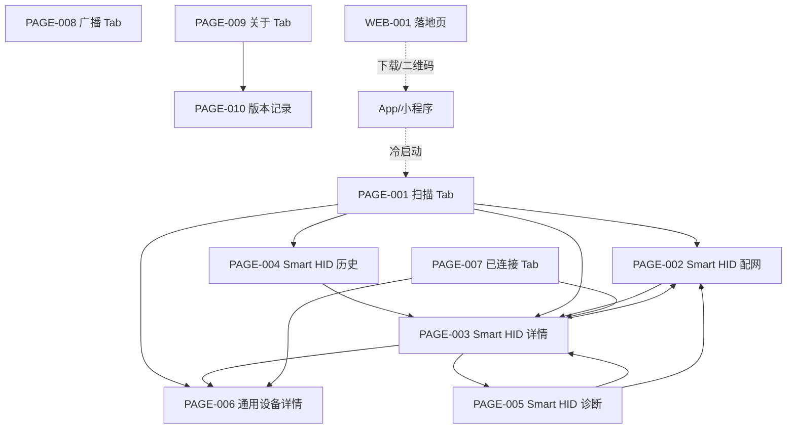

# 04 信息架构与导航

```yaml
status: APPROVED
document_version: 1.0
owner: Smart BLE Product / UX
last_reviewed: 2026-09-01
approved_by: user
supersedes: []
```

---

## 1. 本文负责什么 / 不负责什么

本文负责：目标信息架构（IA）、四 Tab 与二级页关系、路由与参数契约、深链与冷启动规则、返回与入口关系、页面跳转总图。

本文不负责：页面内部区块与操作（`pages/`）；能力赋值（`08`）。

---

## 2. 信息架构总图



层级原则：

1. 一级 Tab 固定 4 个：扫描、已连接、广播、关于；Smart HID 是 Profile 不占 Tab。
2. 二级页 6 个：PAGE-002/003/004/005/006/010。
3. 任意设备相关页之间的跳转只携带稳定身份参数，设备上下文经进程内 stash（`10` 第 6 节）补全。
4. 从任何页面 ≤3 步回到扫描 Tab（TabBar 常驻保证 1 步）。

---

## 3. 路由与参数契约

| 页面 | 路由 | 类型 | 必选参数 | 可选参数 | 禁止参数 |
|---|---|---|---|---|---|
| PAGE-001 | `pages/index/index` | Tab | 无 | 无 | 一切设备数据 |
| PAGE-002 | `pages/hid/add` | 二级 | `deviceId` | 无 | 密码/token/QR 内容 |
| PAGE-003 | `pages/hid/detail` | 二级 | `deviceId`（URL 编码） | 无 | 同上 |
| PAGE-004 | `pages/hid/history` | 二级 | 无 | 无 | 同上 |
| PAGE-005 | `pages/hid/diagnostics` | 二级 | `deviceId` | 无 | 同上 |
| PAGE-006 | `pages/device/detail` | 二级 | `deviceId` | `name`、`rssi`、`profileId` | 密码/token/完整广播 |
| PAGE-007 | `pages/connected/index` | Tab | 无 | 无 | — |
| PAGE-008 | `pages/broadcast/index` | Tab | 无 | 无 | — |
| PAGE-009 | `pages/about/index` | Tab | 无 | 无 | — |
| PAGE-010 | `pages/about/version` | 二级 | 无 | 无 | — |
| WEB-001 | `/`（文档站首页） | Web | 无 | 锚点 | — |

规则：

- 参数仅稳定身份字段；敏感字段禁止入 URL（SEC-004）。
- 缺必选参数：目标页展示说明 modal 并 `navigateBack`（ERR-SYS-02）。
- Tab 页不接受路由参数；Tab 间切换不经过导航栈 push。

## 4. 进入来源矩阵（入口 → 页面）

| 目标页 | 合法进入来源 |
|---|---|
| PAGE-001 | 冷启动默认 Tab、其他三个 Tab、PAGE-004/007 空态引导、分享回首页（微信） |
| PAGE-002 | PAGE-001 Profile 动作、PAGE-003 重新配置、PAGE-005 重新配网 |
| PAGE-003 | PAGE-001 历史紧凑入口/设备卡、PAGE-004 列表、PAGE-002 成功查看设备、PAGE-005 返回 |
| PAGE-004 | PAGE-001 全部历史 |
| PAGE-005 | PAGE-003 运行诊断、PAGE-002 错误恢复（mqtt_invalid） |
| PAGE-006 | PAGE-001 连接、PAGE-007 卡片、PAGE-003 高级 BLE |
| PAGE-007 | Tab 切换 |
| PAGE-008 | Tab 切换 |
| PAGE-009 | Tab 切换 |
| PAGE-010 | PAGE-009 版本记录 |
| WEB-001 | 外部搜索/分享/App 关于页官网入口 |

## 5. 深链与冷启动规则

1. 冷启动：落到 PAGE-001；恢复上次 Tab 不在首版目标（Not Now，避免状态机复杂化）。
2. 深链（分享卡片/二维码进入）：微信分享仅分享 PAGE-001、PAGE-010 与首页类路径；分享路径不得依赖进程内 stash（冷启动时 stash 为空）。
3. 冷启动直达二级页（如从外部打开 `pages/device/detail?deviceId=x`）：页面必须能以仅参数完成最小身份展示，并提示"从扫描页进入可获得完整上下文"；不允许因 stash 缺失而白屏。
4. WEB-001 深链：锚点（#download、#evidence、#quickstart 等）在无 JS 时仍可定位内容。

## 6. 返回规则

| 页面 | 返回行为 |
|---|---|
| PAGE-002 配网中 | 拦截返回，确认后离开并取消配网（释放连接） |
| PAGE-002/005/006 | `navigateBack` 回来源页；会话按各自所有权规则保留（`10`） |
| PAGE-003/004 | `navigateBack` |
| PAGE-006 从 PAGE-007 进入 | 返回 PAGE-007，会话保留 |
| PAGE-010 | 返回 PAGE-009 |
| Tab 页 | 系统返回退出应用/小程序（无栈内返回） |

## 7. 验收条件与关联测试规划

- 四 Tab + 六二级页 + WEB-001 与 `05` 完全一致；
- 每条路由有参数契约与禁止参数；
- 入口矩阵覆盖全部页面且无孤岛页面；
- 深链/冷启动规则完整。

关联计划测试：`TEST-C-005`（路由与参数契约静态校验）、`TEST-P-001..011`（页面跳转断言）、`TEST-A-002`、`TEST-W-002`（真机导航）。
