# 06 目标用户流程

```yaml
status: REVIEW
document_version: 1.0
owner: Smart BLE Product / UX
last_reviewed: 2026-09-01
approved_by: null
supersedes: []
```

---

## 1. 本文负责什么 / 不负责什么

本文负责：FLOW-001~FLOW-014 十四条主流程——目标、参与者、前置、主成功路径、替代路径、错误路径、取消与返回、状态与数据变化、Session/资源变化、ESP32/Smart HID 行为、平台差异、双 Mermaid 图、关联 ID 与完成证据。

本文不负责：页面内状态细节（`pages/`）；状态机正典（`07`）。

---

## FLOW-001 首次启动与权限

- 目标：新用户从安装/扫码到可扫描，权限与蓝牙障碍全部有出口。
- 参与者：用户、系统权限、蓝牙适配器。
- 前置：已安装 App/进入小程序。
- 主路径：启动→平台识别→落扫描 Tab→点开始→授权→扫描运行。
- 替代：H5 进入→UNSUPPORTED 面→引导微信/App。
- 错误路径：拒绝授权（ERR-PERM-01 重试）；永久拒绝（ERR-PERM-03 去设置）；蓝牙关（ERR-BT-01 去开启）；打开失败（ERR-BT-02 重试）。
- 取消/返回：随时退出；无残留。
- 状态数据：权限/蓝牙状态芯片；无业务数据。
- Session/资源：无会话；扫描资源随页面。
- 平台差异：微信定位策略（DEC-003）；App 三态权限。
- 关联：REQ-005..009｜FEAT-001/005..009｜PAGE-001｜TEST-A-001、TEST-W-001、TEST-P-001。
- 完成证据：EVID-001/002（双平台首启录屏）。

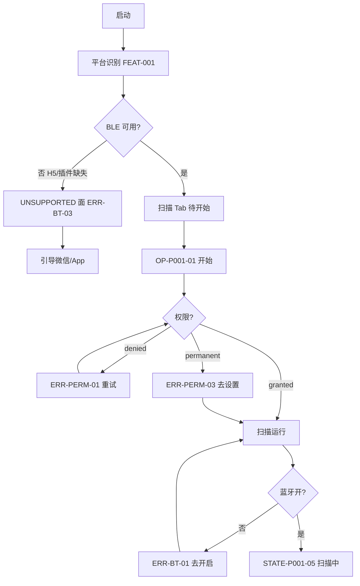
```mermaid
flowchart TD
  A[启动] --> B[平台识别 FEAT-001]
  B --> C{BLE 可用?}
  C -- 否 H5/插件缺失 --> D[UNSUPPORTED 面 ERR-BT-03]
  D --> E[引导微信/App]
  C -- 是 --> F[扫描 Tab 待开始]
  F --> G[OP-P001-01 开始]
  G --> H{权限?}
  H -- granted --> I[扫描运行]
  H -- denied --> J[ERR-PERM-01 重试]
  H -- permanent --> K[ERR-PERM-03 去设置]
  K --> I
  J --> H
  I --> L{蓝牙开?}
  L -- 否 --> M[ERR-BT-01 去开启] --> I
  L -- 是 --> N[STATE-P001-05 扫描中]
```

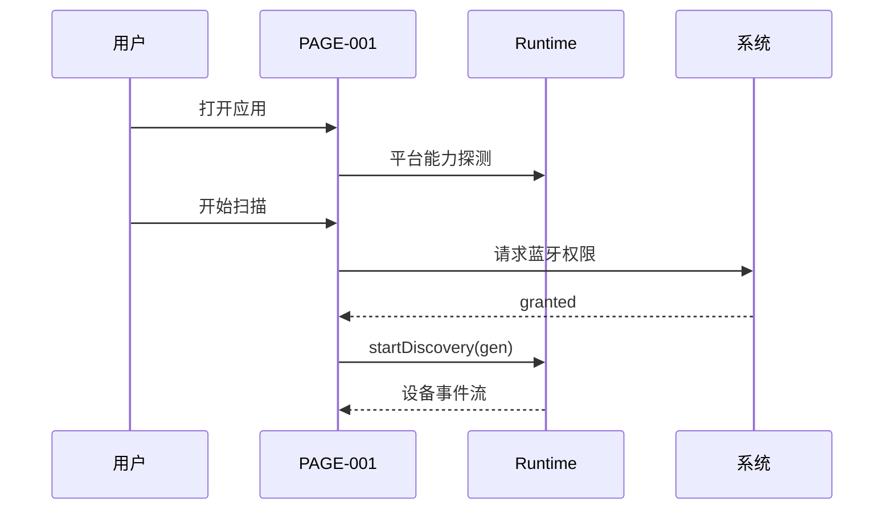
```mermaid
sequenceDiagram
  participant U as 用户
  participant P as PAGE-001
  participant RT as Runtime
  participant OS as 系统
  U->>P: 打开应用
  P->>RT: 平台能力探测
  U->>P: 开始扫描
  P->>OS: 请求蓝牙权限
  OS-->>P: granted
  P->>RT: startDiscovery(gen)
  RT-->>P: 设备事件流
```

## FLOW-002 两轮扫描

- 目标：两轮扫描互不污染；迟到事件丢弃。
- 参与者：用户、ScanSession。
- 前置：FLOW-001 就绪。
- 主路径：第一轮 5s 完成→查看结果→再次开始→新 generation→列表重建。
- 替代：手动提前停止。
- 错误路径：ERR-SCAN-01 重试。
- 取消/返回：停止/hide/unload 均停。
- 状态数据：N/M、去重、RSSI 更新。
- Session/资源：每轮计时器与 discovery 释放。
- 平台差异：无。
- 关联：REQ-010..015｜FEAT-010..015｜TEST-U-005、TEST-I-002、TEST-A-005、TEST-W-007、TEST-E-001。
- 完成证据：EVID-001/002/003。


```mermaid
flowchart LR
  A[第一轮 gen=1] --> B[完成 保留结果]
  B --> C[再次开始 gen=2]
  C --> D[旧事件丢弃]
  D --> E[列表重建]
  E --> F[N/M 实时]
```

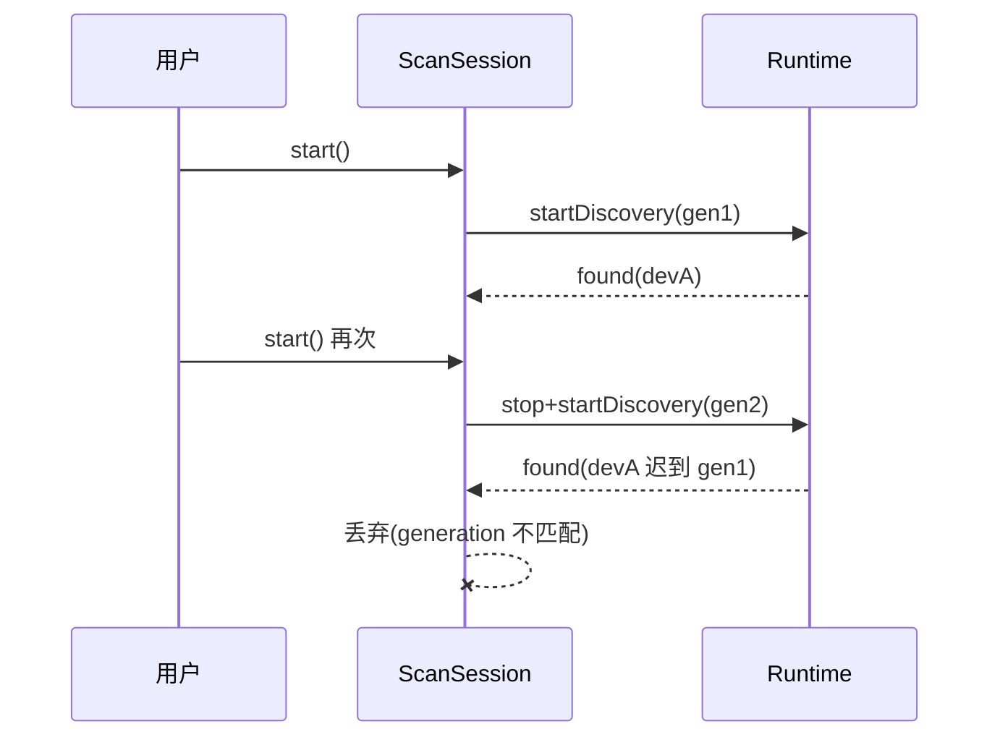
```mermaid
sequenceDiagram
  participant U as 用户
  participant SS as ScanSession
  participant RT as Runtime
  U->>SS: start()
  SS->>RT: startDiscovery(gen1)
  RT-->>SS: found(devA)
  U->>SS: start() 再次
  SS->>RT: stop+startDiscovery(gen2)
  RT-->>SS: found(devA 迟到 gen1)
  SS--xSS: 丢弃(generation 不匹配)
```

## FLOW-003 广播详情

- 目标：点卡片看广播不触发连接。
- 参与者：用户、广播归一层。
- 前置：设备在列表。
- 主路径：点卡→弹窗→字段+原始字节→复制。
- 替代：筛选后再看。
- 错误路径：解析失败段标注。
- 取消/返回：关弹窗。
- 状态数据：快照；无会话。
- Session/资源：无。
- 平台差异：微信字段缺失标注。
- 关联：REQ-016..018｜FEAT-017..019｜TEST-U-008、TEST-A-005、TEST-E-001。
- 完成证据：EVID-003（夹具字段逐项比对截图）。

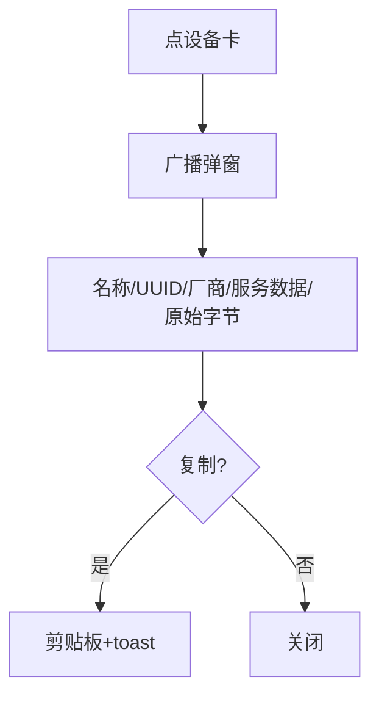
```mermaid
flowchart TD
  A[点设备卡] --> B[广播弹窗]
  B --> C[名称/UUID/厂商/服务数据/原始字节]
  C --> D{复制?}
  D -- 是 --> E[剪贴板+toast]
  D -- 否 --> F[关闭]
```

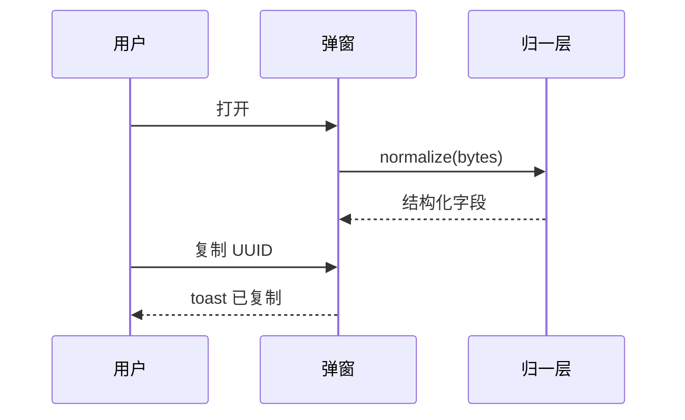
```mermaid
sequenceDiagram
  participant U as 用户
  participant D as 弹窗
  participant N as 归一层
  U->>D: 打开
  D->>N: normalize(bytes)
  N-->>D: 结构化字段
  U->>D: 复制 UUID
  D-->>U: toast 已复制
```

## FLOW-004 连接与服务发现

- 目标：从卡片到可用 GATT 树。
- 参与者：用户、连接服务、设备。
- 前置：设备已发现；权限就绪。
- 主路径：点连接→停扫→attempt→connected→发现→树展示→注册 Registry。
- 替代：PAGE-007 打开复用。
- 错误路径：连接失败/超时（ERR-CONN-01 重试）；发现失败（ERR-CONN-02 断开重连）；空服务（ERR-CONN-03 重试）；被动断开→有限重连 3 次→耗尽（ERR-CONN-05 手动）。
- 取消/返回：连接中可返回；页面离开会话保留。
- 状态数据：Session 建立；PAGE-007 联动。
- Session/资源：会话入 Registry；失败清理半开连接。
- 平台差异：无语义差异。
- 关联：REQ-019..023｜FEAT-020..025｜TEST-I-003、TEST-A-006/007、TEST-W-007、TEST-E-002/005。
- 完成证据：EVID-001/002/003。

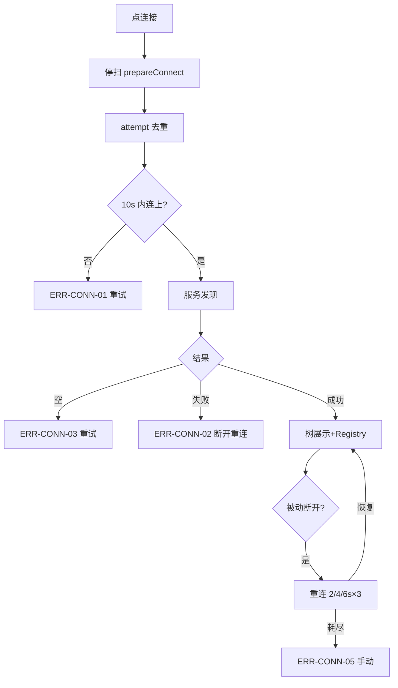
```mermaid
flowchart TD
  A[点连接] --> B[停扫 prepareConnect]
  B --> C[attempt 去重]
  C --> D{10s 内连上?}
  D -- 否 --> E[ERR-CONN-01 重试]
  D -- 是 --> F[服务发现]
  F --> G{结果}
  G -- 空 --> H[ERR-CONN-03 重试]
  G -- 失败 --> I[ERR-CONN-02 断开重连]
  G -- 成功 --> J[树展示+Registry]
  J --> K{被动断开?}
  K -- 是 --> L[重连 2/4/6s×3]
  L -- 恢复 --> J
  L -- 耗尽 --> M[ERR-CONN-05 手动]
```

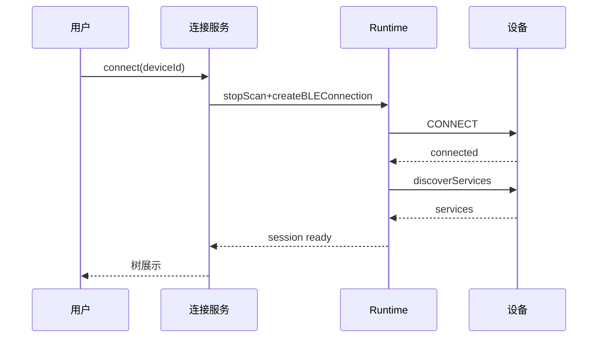
```mermaid
sequenceDiagram
  participant U as 用户
  participant CS as 连接服务
  participant RT as Runtime
  participant DV as 设备
  U->>CS: connect(deviceId)
  CS->>RT: stopScan+createBLEConnection
  RT->>DV: CONNECT
  DV-->>RT: connected
  RT->>DV: discoverServices
  DV-->>RT: services
  RT-->>CS: session ready
  CS-->>U: 树展示
```

## FLOW-005 Read/Write/Notify

- 目标：GATT 三类操作与日志闭环。
- 参与者：用户、GATT 服务、设备。
- 前置：FLOW-004 完成。
- 主路径：Read（3s）→值+日志；TEXT/HEX 写（队列）→响应+日志；Notify 开→推送流→关。
- 替代：HEX 写 LED `FF01` 点亮；indicate 订阅。
- 错误路径：ERR-GATT-01/03/04/05/07 各自重试；属性不允许按钮禁用（ERR-GATT-02）。
- 取消/返回：关订阅；离开页面订阅按 DEC-009。
- 状态数据：日志累积（DATA-005）。
- Session/资源：读超时 listener 单次清理；订阅归会话。
- 平台差异：微信 indicate 确认。
- 关联：REQ-024..029、REQ-034..037｜FEAT-026..032/037..040｜TEST-U-009..014、TEST-I-004/005、TEST-A-008、TEST-E-003/004/005。
- 完成证据：EVID-001/002/003。

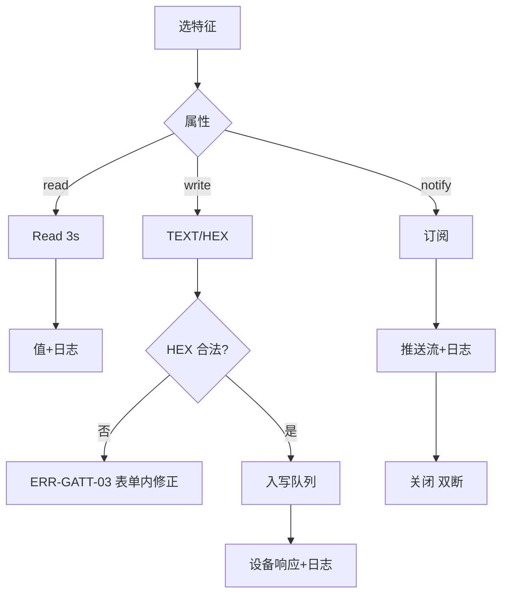
```mermaid
flowchart TD
  A[选特征] --> B{属性}
  B -- read --> C[Read 3s] --> D[值+日志]
  B -- write --> E[TEXT/HEX]
  E --> F{HEX 合法?}
  F -- 否 --> G[ERR-GATT-03 表单内修正]
  F -- 是 --> H[入写队列] --> I[设备响应+日志]
  B -- notify --> J[订阅] --> K[推送流+日志]
  K --> L[关闭 双断]
```

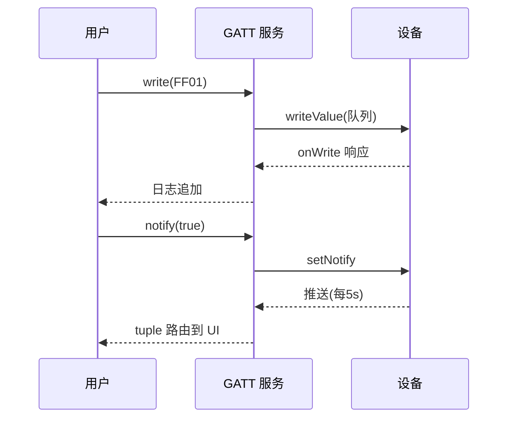
```mermaid
sequenceDiagram
  participant U as 用户
  participant GA as GATT 服务
  participant DV as 设备
  U->>GA: write(FF01)
  GA->>DV: writeValue(队列)
  DV-->>GA: onWrite 响应
  GA-->>U: 日志追加
  U->>GA: notify(true)
  GA->>DV: setNotify
  DV-->>GA: 推送(每5s)
  GA-->>U: tuple 路由到 UI
```

## FLOW-006 跨页 Session

- 目标：会话跨页/跨 Tab 存活与复用。
- 参与者：用户、Registry。
- 前置：至少一台已连接。
- 主路径：PAGE-006→Tab 切 PAGE-007→卡片打开→复用会话回 PAGE-006。
- 替代：经 PAGE-003 高级 BLE 进 PAGE-006。
- 错误路径：会话恰好失效→走连接流程。
- 取消/返回：正常返回。
- 状态数据：Registry 唯一源；PAGE-007 列表联动。
- Session/资源：页面 unload 只摘 UI 订阅；订阅随会话（DEC-009）。
- 平台差异：无。
- 关联：REQ-030/031/033｜FEAT-033/034/036｜TEST-I-006、TEST-A-009、TEST-W-008。
- 完成证据：EVID-001/002。

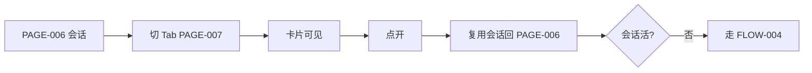
```mermaid
flowchart LR
  A[PAGE-006 会话] --> B[切 Tab PAGE-007]
  B --> C[卡片可见]
  C --> D[点开]
  D --> E[复用会话回 PAGE-006]
  E --> F{会话活?}
  F -- 否 --> G[走 FLOW-004]
```

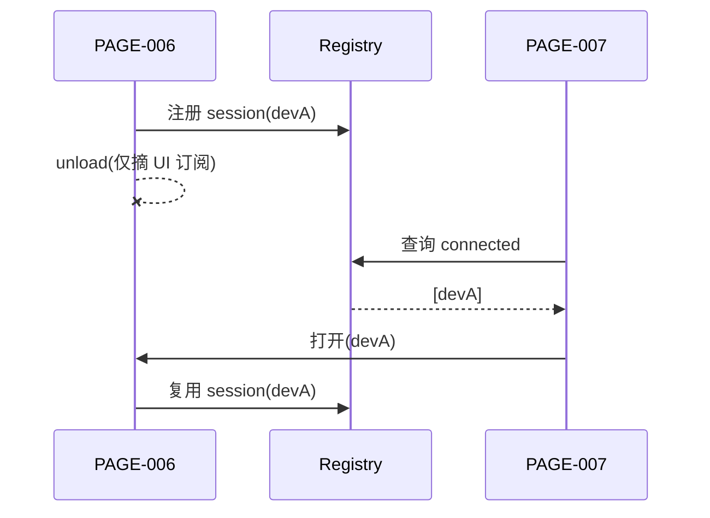
```mermaid
sequenceDiagram
  participant P6 as PAGE-006
  participant RG as Registry
  participant P7 as PAGE-007
  P6->>RG: 注册 session(devA)
  P6--xP6: unload(仅摘 UI 订阅)
  P7->>RG: 查询 connected
  RG-->>P7: [devA]
  P7->>P6: 打开(devA)
  P6->>RG: 复用 session(devA)
```

## FLOW-007 多设备

- 目标：两台设备并行互不影响。
- 参与者：用户、Registry、两台设备。
- 前置：首台已连接。
- 主路径：回扫描→连第二台→双会话→PAGE-007 显示 N=2→分别操作。
- 替代：同型号设备（同 UUID）验证隔离。
- 错误路径：断 A 连接错误不影响 B；上限提示（DEC-008）。
- 取消/返回：单断/全断（FLOW 于 PAGE-007）。
- 状态数据：会话表 2 条；Notify 隔离。
- Session/资源：各自独立。
- 平台差异：微信并行上限待 E5（NFR-012）。
- 关联：REQ-032｜FEAT-035｜TEST-I-005/006、TEST-A-009、TEST-W-009。
- 完成证据：EVID-001/002（双机同 UUID 隔离视频）。

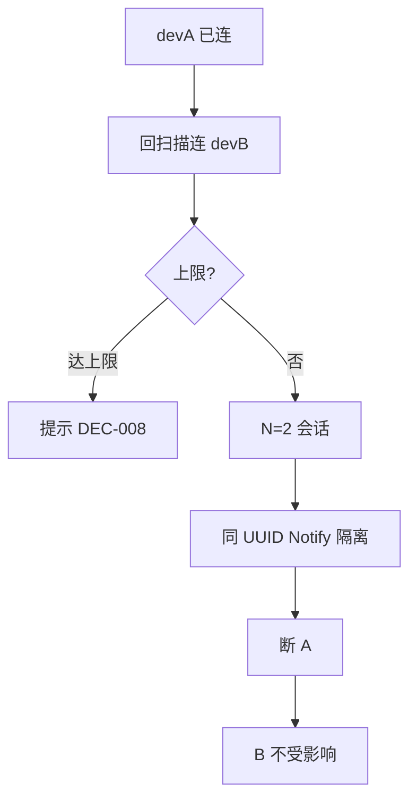
```mermaid
flowchart TD
  A[devA 已连] --> B[回扫描连 devB]
  B --> C{上限?}
  C -- 达上限 --> D[提示 DEC-008]
  C -- 否 --> E[N=2 会话]
  E --> F[同 UUID Notify 隔离]
  F --> G[断 A] --> H[B 不受影响]
```

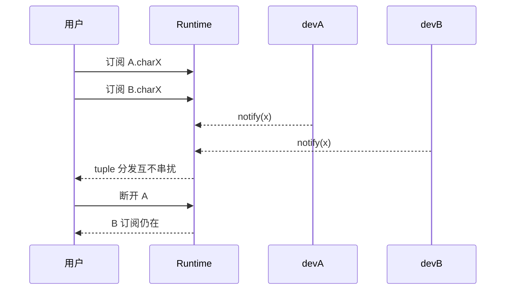
```mermaid
sequenceDiagram
  participant U as 用户
  participant RT as Runtime
  participant A as devA
  participant B as devB
  U->>RT: 订阅 A.charX
  U->>RT: 订阅 B.charX
  A-->>RT: notify(x)
  B-->>RT: notify(x)
  RT-->>U: tuple 分发互不串扰
  U->>RT: 断开 A
  RT-->>U: B 订阅仍在
```

## FLOW-008 手机 Peripheral

- 目标：手机发出可控广播并由 Observer 验证。
- 参与者：用户、BroadcastOwner、ESP32 Observer。
- 前置：PAGE-008 支持就绪、无活动连接。
- 主路径：编辑字段→预算 ≤31→开始→实际成功→广播中→（Observer 观测一致）→停止→释放。
- 替代：复制校验信息比对。
- 错误路径：32 字节阻止；冲突（先断开）；启动/停止失败重试；权限/蓝牙错误恢复。
- 取消/返回：hide/unload 自动停止释放。
- 状态数据：DATA-011；Observer 串口流（PROTO-009）。
- Session/资源：Owner 单例；离页释放。
- 平台差异：App 插件/微信 API/H5 不支持；Android 名称接管（DEC-004）。
- 关联：REQ-038..042｜FEAT-041..045｜TEST-U-014、TEST-I-007、TEST-A-010、TEST-W-009、TEST-E-006。
- 完成证据：EVID-004（Observer 串口日志+对照表）。

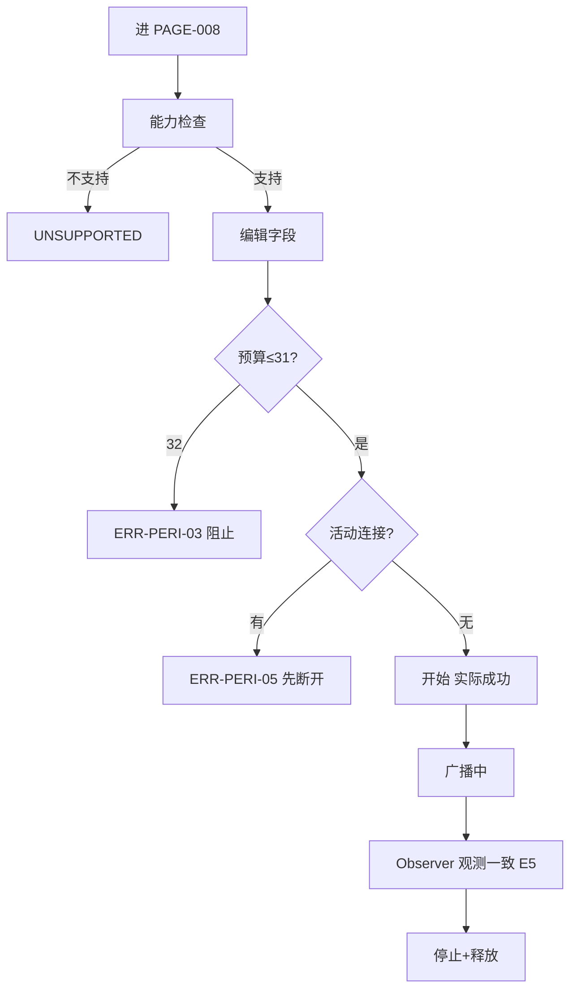
```mermaid
flowchart TD
  A[进 PAGE-008] --> B[能力检查]
  B -- 不支持 --> C[UNSUPPORTED]
  B -- 支持 --> D[编辑字段]
  D --> E{预算≤31?}
  E -- 32 --> F[ERR-PERI-03 阻止]
  E -- 是 --> G{活动连接?}
  G -- 有 --> H[ERR-PERI-05 先断开]
  G -- 无 --> I[开始 实际成功]
  I --> J[广播中]
  J --> K[Observer 观测一致 E5]
  K --> L[停止+释放]
```

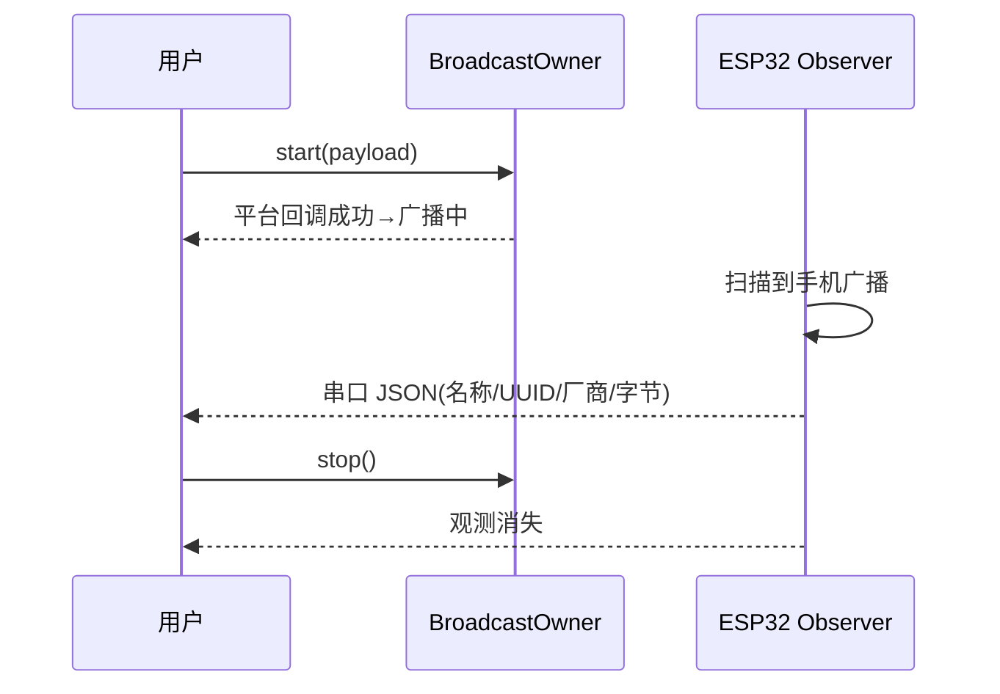
```mermaid
sequenceDiagram
  participant U as 用户
  participant BO as BroadcastOwner
  participant OB as ESP32 Observer
  U->>BO: start(payload)
  BO-->>U: 平台回调成功→广播中
  OB->>OB: 扫描到手机广播
  OB-->>U: 串口 JSON(名称/UUID/厂商/字节)
  U->>BO: stop()
  OB-->>U: 观测消失
```

## FLOW-009 OTA 完整事务

- 目标：10 步完整事务，版本一致才算成功。
- 参与者：用户、OtaManager、设备。
- 前置：设备含 OTA 服务；入口达标（DEC-001）；固件文件校验通过。
- 主路径：STATUS 订阅→CTRL start(size/chunk/target_version)→ready→DATA 分包→commit→success→reboot→重连→读 firmware_version→一致→成功。
- 替代：重试=重新完整事务。
- 错误路径：无 ready（ERR-OTA-02 abort）；data 失败（ERR-OTA-03）；无 success（ERR-OTA-04，fault 注入验证）；版本不一致（ERR-OTA-05）；abort 失败（ERR-OTA-07 兜底断开）；重连失败（ERR-OTA-08）。
- 取消/返回：取消=CTRL abort→设备回 idle；OTA 中离开页面需确认。
- 状态数据：STATE-OTA-01..10；进度百分比。
- Session/资源：事务资源终态释放；文件句柄关闭。
- 平台差异：微信文件选择。
- 关联：REQ-043..046｜FEAT-046..052｜TEST-I-008、TEST-A-011、TEST-E-007。
- 完成证据：EVID-006（双端：App 进度+串口 success/版本回读）。

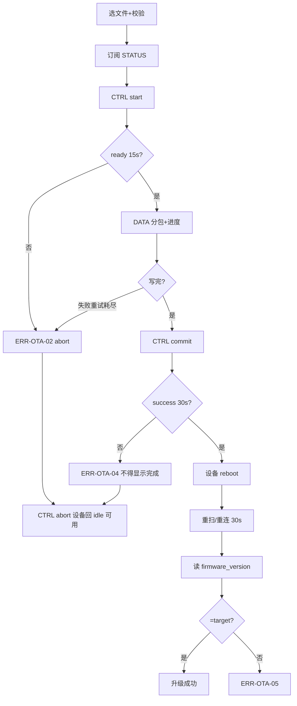
```mermaid
flowchart TD
  A[选文件+校验] --> B[订阅 STATUS]
  B --> C[CTRL start]
  C --> D{ready 15s?}
  D -- 否 --> X[ERR-OTA-02 abort]
  D -- 是 --> E[DATA 分包+进度]
  E --> F{写完?}
  F -- 失败重试耗尽 --> X
  F -- 是 --> G[CTRL commit]
  G --> H{success 30s?}
  H -- 否 --> Y[ERR-OTA-04 不得显示完成]
  H -- 是 --> I[设备 reboot]
  I --> J[重扫/重连 30s]
  J --> K[读 firmware_version]
  K --> L{=target?}
  L -- 是 --> M[升级成功]
  L -- 否 --> N[ERR-OTA-05]
  X & Y --> O[CTRL abort 设备回 idle 可用]
```

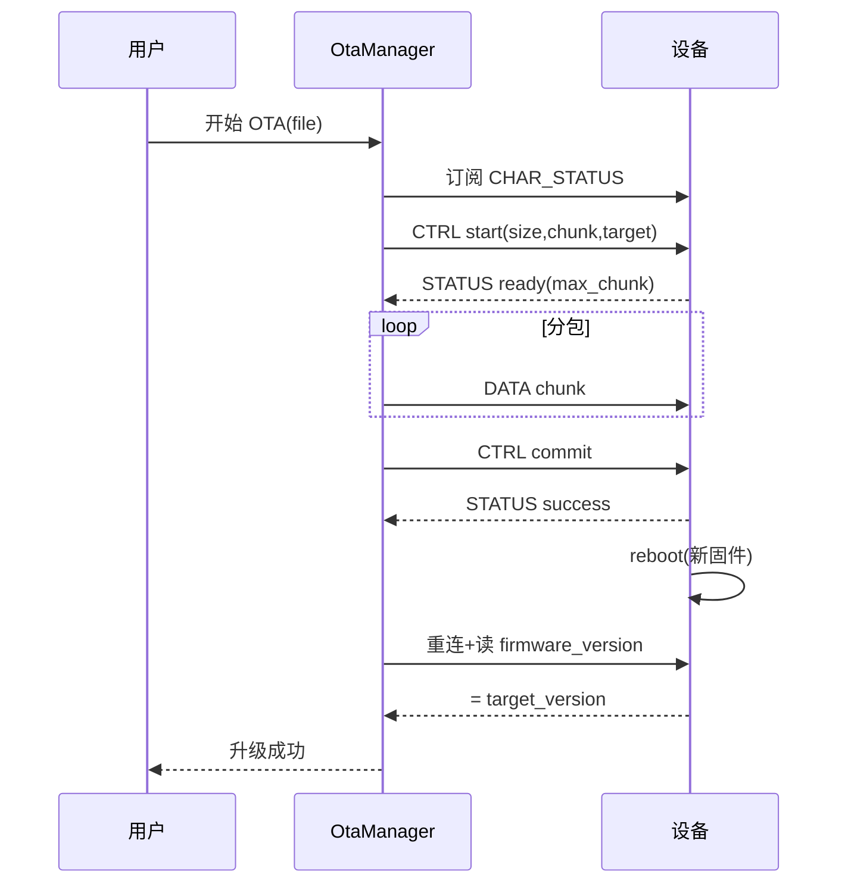
```mermaid
sequenceDiagram
  participant U as 用户
  participant OM as OtaManager
  participant DV as 设备
  U->>OM: 开始 OTA(file)
  OM->>DV: 订阅 CHAR_STATUS
  OM->>DV: CTRL start(size,chunk,target)
  DV-->>OM: STATUS ready(max_chunk)
  loop 分包
    OM->>DV: DATA chunk
  end
  OM->>DV: CTRL commit
  DV-->>OM: STATUS success
  DV->>DV: reboot(新固件)
  OM->>DV: 重连+读 firmware_version
  DV-->>OM: = target_version
  OM-->>U: 升级成功
```

## FLOW-010 Smart HID 首次配网

- 目标：完整配网到 READY，含八类错误恢复。
- 参与者：用户、SmartHidWorkflow、设备、ControlHub（外部）。
- 前置：扫描发现（强/弱匹配）；ControlHub 运行并已出 QR。
- 主路径：连接→INFO 二次确认→表单→扫码→waiter 注册→candidate 分帧写→四步进度→ready→写历史→释放连接。
- 替代：重配（设备恢复模式后同路径）。
- 错误路径：八类错误（ERR-HID-01..08 各唯一恢复）；身份失败断开（ERR-HID-09）；QR 无效（ERR-HID-11）；waiter 超时 60s（ERR-HID-12）。
- 取消/返回：取消等待=断开回表单；配网中返回需确认。
- 状态数据：DATA-006 写入（成功时）。
- Session/资源：配网连接 owned，终态释放。
- 平台差异：扫码 API。
- 关联：REQ-047..051｜FEAT-053..058｜TEST-U-015、TEST-I-009、TEST-H-001..003、TEST-W-010。
- 完成证据：EVID-005。

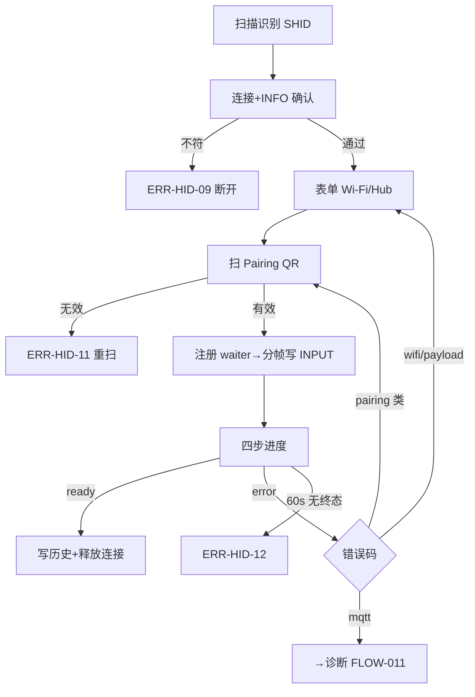
```mermaid
flowchart TD
  A[扫描识别 SHID] --> B[连接+INFO 确认]
  B -- 不符 --> Z[ERR-HID-09 断开]
  B -- 通过 --> C[表单 Wi-Fi/Hub]
  C --> D[扫 Pairing QR]
  D -- 无效 --> E[ERR-HID-11 重扫]
  D -- 有效 --> F[注册 waiter→分帧写 INPUT]
  F --> G[四步进度]
  G -- ready --> H[写历史+释放连接]
  G -- error --> I{错误码}
  I -- wifi/payload --> C
  I -- pairing 类 --> D
  I -- mqtt --> J[→诊断 FLOW-011]
  G -- 60s 无终态 --> K[ERR-HID-12]
```

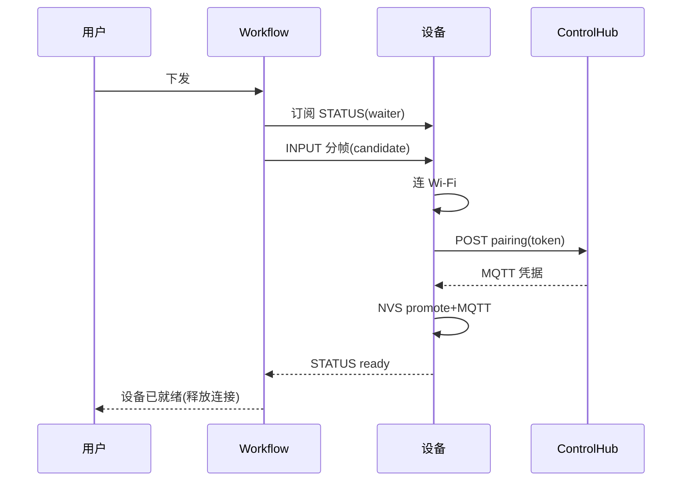
```mermaid
sequenceDiagram
  participant U as 用户
  participant WF as Workflow
  participant DV as 设备
  participant CH as ControlHub
  U->>WF: 下发
  WF->>DV: 订阅 STATUS(waiter)
  WF->>DV: INPUT 分帧(candidate)
  DV->>DV: 连 Wi-Fi
  DV->>CH: POST pairing(token)
  CH-->>DV: MQTT 凭据
  DV->>DV: NVS promote+MQTT
  DV-->>WF: STATUS ready
  WF-->>U: 设备已就绪(释放连接)
```

## FLOW-011 Smart HID 历史/诊断/重配

- 目标：历史设备的三条出路。
- 参与者：用户、历史数据、诊断服务。
- 前置：存在历史记录。
- 主路径：PAGE-004 列表→PAGE-003 详情（快照）→诊断（PAGE-005，自动一次）或重配（PAGE-002）。
- 替代：PAGE-001 紧凑入口直达详情。
- 错误路径：记录不存在（ERR-DATA-03）；离线（连接确认）；诊断失败（ERR-HID-13 重试）。
- 取消/返回：栈感知返回。
- 状态数据：诊断实时结果；重配更新历史。
- Session/资源：owned/borrowed 语义。
- 平台差异：无。
- 关联：REQ-052/053｜FEAT-059..064｜TEST-P-003/004/005、TEST-H-004/005/006。
- 完成证据：EVID-005。

```mermaid
flowchart TD
  A[PAGE-004 历史] --> B[PAGE-003 快照]
  B --> C[运行诊断 PAGE-005]
  B --> D[重新配置 PAGE-002]
  B --> E[高级 BLE PAGE-006]
  C --> F{有连接?}
  F -- 否 --> G[确认连接 owned]
  F -- 是 --> H[borrowed 自动诊断]
  H --> I[五项结果]
  I -- mqtt fail --> D
  D --> J[成功后历史更新去重]
```

```mermaid
sequenceDiagram
  participant U as 用户
  participant DS as 诊断服务
  participant RG as Registry
  participant DV as 设备
  U->>DS: 进入诊断页
  DS->>RG: 查询 session
  alt borrowed
    RG-->>DS: 复用连接
  else 无
    DS->>DV: connect(owned)
  end
  DS->>DV: 读 INFO/STATUS
  DV-->>DS: 实时状态
  DS-->>U: 五项结果+时间戳
  U->>DS: 离开
  DS->>DV: 仅 owned 才 disconnect
```

## FLOW-012 关于/分享/反馈

- 目标：产品信息、版本、分享与反馈闭环。
- 参与者：用户、页面、外部渠道。
- 前置：无。
- 主路径：PAGE-009 查看版本/平台状态→PAGE-010 版本记录→分享/反馈。
- 替代：直接从分享卡片进入。
- 错误路径：外链失败 modal；版本读取失败 `dev.unknown`。
- 取消/返回：正常。
- 状态数据：无。
- Session/资源：无。
- 平台差异：分享三端。
- 关联：REQ-055..057｜FEAT-065..068｜TEST-P-009/010、TEST-A-012、TEST-W-010、TEST-R-005。
- 完成证据：EVID-007（链接矩阵结果）。

```mermaid
flowchart LR
  A[PAGE-009] --> B[PAGE-010 版本]
  A --> C[官网/文档/GitHub/ESP32]
  A --> D[反馈 Issue]
  A --> E[分享]
  A --> F[隐私/安全/License]
```

```mermaid
sequenceDiagram
  participant U as 用户
  participant P9 as PAGE-009
  participant EX as 外部
  U->>P9: 查看版本
  P9-->>U: VERSION 投影
  U->>P9: 点反馈
  P9->>EX: 打开 Issue 入口
  EX-->>U: 404 时 modal 重试/复制
```

## FLOW-013 落地页体验/下载/ESP32

- 目标：访客完成理解→信任→获取（或诚实 NOT_RELEASED）。
- 参与者：访客、落地页、Release 产物、ESP32 教程。
- 前置：无。
- 主路径：Hero→闭环/能力卡→平台表→证据→下载（APK/码/固件，含 SHA）或快速开始三条之一。
- 替代：直接进 ESP32 区烧写夹具。
- 错误路径：404/SHA 不符/码失效（ERR-WEB-01..03，发布前阻断）；无产物 NOT_RELEASED 面。
- 取消/返回：浏览器行为。
- 状态数据：全部来自 DATA-009。
- Session/资源：静态页无。
- 平台差异：响应式/暗色。
- 关联：REQ-058..062｜FEAT-069..077｜TEST-R-001..010、TEST-E-008。
- 完成证据：EVID-007。

```mermaid
flowchart TD
  A[Hero] --> B[能力卡+证据]
  B --> C{获取路径}
  C -- Android --> D[APK+SHA 下载]
  C -- 微信 --> E[小程序码]
  C -- ESP32 --> F[固件+教程 烧写]
  C -- 无产物 --> G[NOT_RELEASED 卡]
  D & E & F --> H[安装/烧写]
  H --> I[FLOW-001 首启]
```

```mermaid
sequenceDiagram
  participant V as 访客
  participant W as WEB-001
  participant R as Release 产物
  V->>W: 访问 /
  W-->>V: 版本/状态徽标(Metadata)
  V->>W: 点击下载
  W->>R: 产物 URL+SHA
  R-->>V: APK
  V->>W: 查看证据
  W-->>V: EVID 链接
```

## FLOW-014 Release 后新安装与首次联调

- 目标：新用户在干净环境完成安装→首联调闭环（30 分钟标准的验收流）。
- 参与者：新用户、新电脑、ESP32、App/小程序。
- 前置：一次已通过 E6 的 Release。
- 主路径：落地页下载（SHA 校验）→安装→（并行）按教程烧写 fixture_peripheral→扫描发现 `BLEToolkit-Server`→连接→写 LED `FF01` 点亮→订阅 Notify 收到状态→（可选）Observer 验证手机广播。
- 替代：微信扫码路径。
- 错误路径：安装失败（系统限制指引）；烧写失败（串口/权限故障表）；扫描失败回 FLOW-001 错误路径。
- 取消/返回：—。
- 状态数据：首装无历史。
- Session/资源：首会话建立。
- 平台差异：Windows/macOS/Linux 烧写命令差异。
- 关联：REQ-062｜FEAT-077/073｜FLOW-001/004/005/008｜TEST-R-001/008、TEST-E-008、TP-G6 烟测。
- 完成证据：EVID-007/008。

```mermaid
flowchart TD
  A[落地页下载 APK+SHA] --> B[安装]
  C[教程烧写 fixture_peripheral] --> D[LED 待命]
  B --> E[扫描]
  D --> E
  E --> F[发现 BLEToolkit-Server]
  F --> G[连接 FLOW-004]
  G --> H[写 FF01 灯亮 FLOW-005]
  H --> I[订阅 Notify]
  I --> J[可选 Observer 验证 FLOW-008]
```

```mermaid
sequenceDiagram
  participant N as 新用户
  participant PC as 新电脑
  participant PH as 手机
  participant ESP as ESP32
  N->>PC: pio run + upload
  PC->>ESP: 烧写 fixture_peripheral
  N->>PH: 安装 APK(SHA 校验)
  PH->>ESP: 扫描+连接
  PH->>ESP: 写 FF01
  ESP-->>PH: LED 点亮+响应
  ESP-->>PH: Notify 状态
```

---

## 2. 验收条件与关联测试规划

- [x] 14 条流程各有主/替代/错误/取消/清理/双图/关联/证据；
- [x] 与页面操作表互相引用一致；
- [x] 每条流程映射计划测试 ID。

关联计划测试：全 TEST-P/A/W/H/E/R 系列以本文流程为脚本骨架；`TEST-C-009`（流程↔测试映射非空）。
