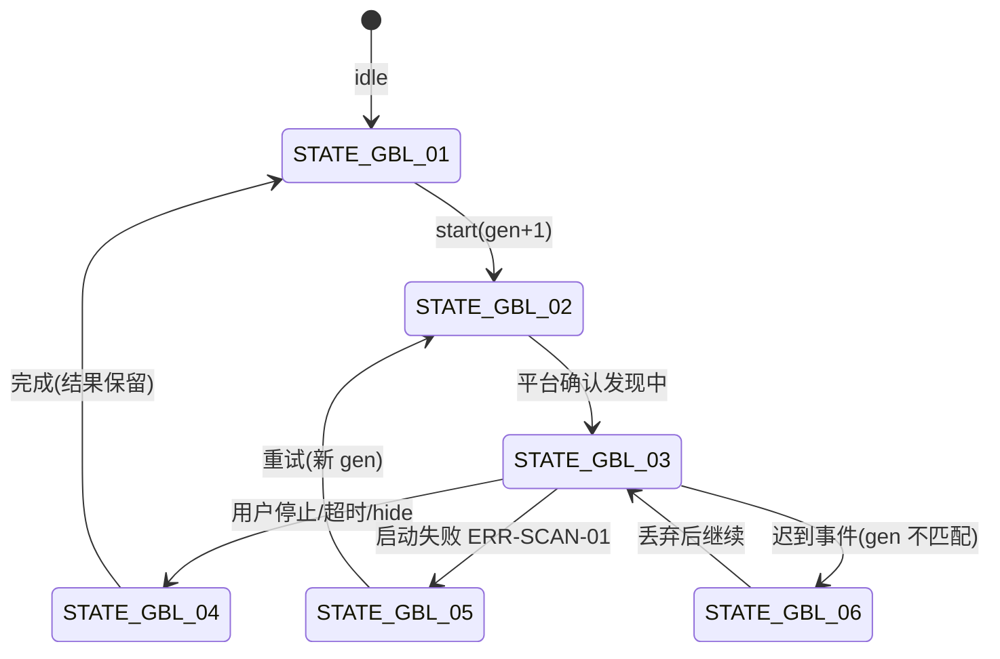
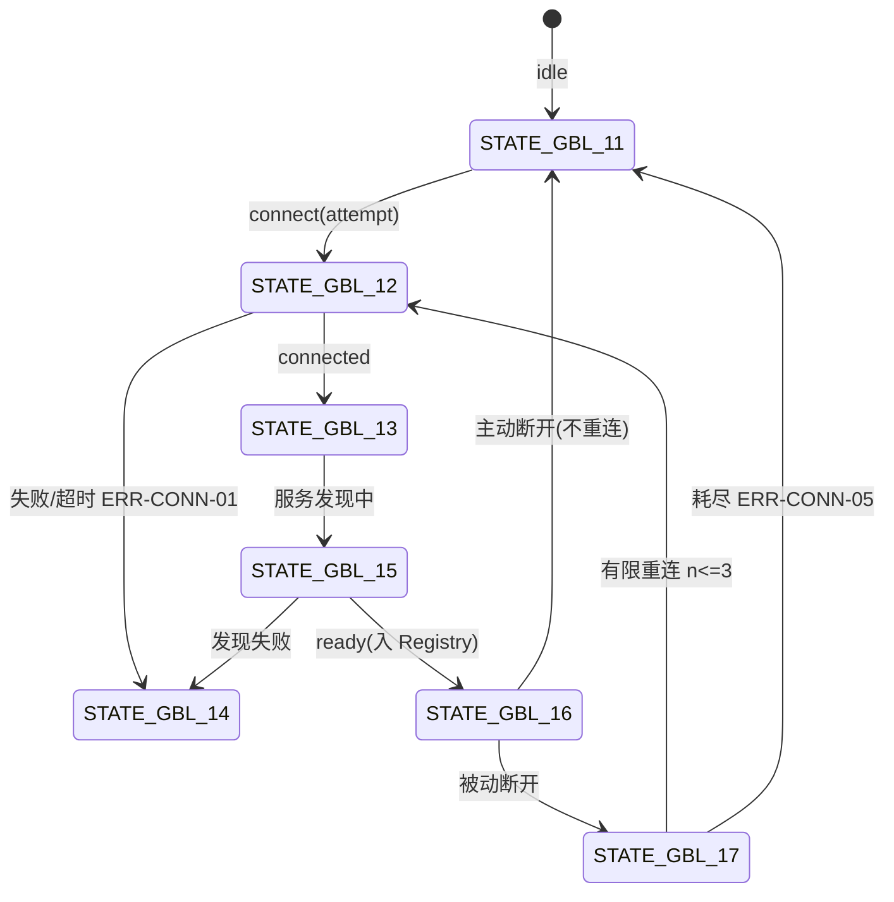
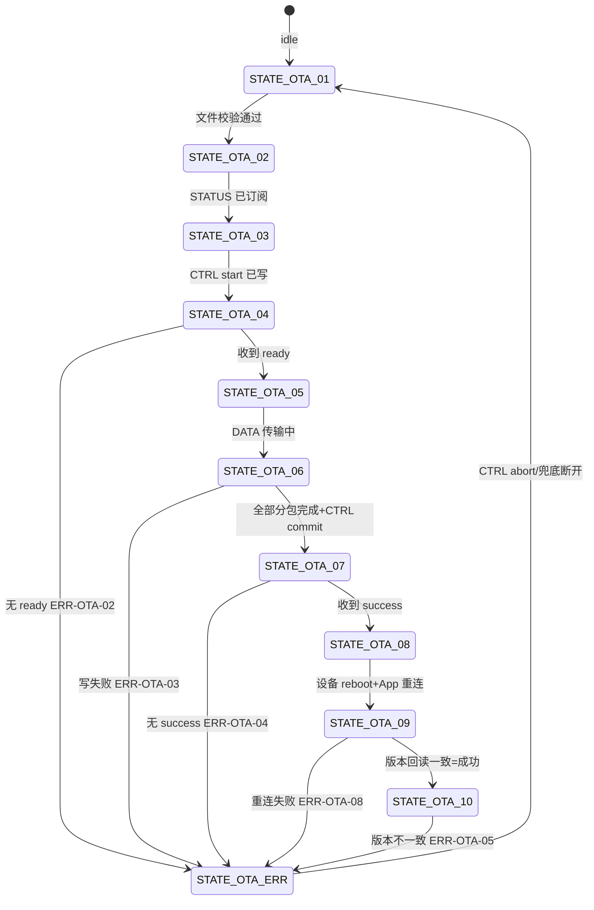

# 07 交互状态与错误模型

```yaml
status: REVIEW
document_version: 1.0
owner: Smart BLE Product / Engineering
last_reviewed: 2026-09-01
approved_by: null
supersedes: []
```

---

## 1. 本文负责什么 / 不负责什么

本文负责：全局引擎状态机（扫描/连接/OTA/Smart HID/广播 Owner）、完整错误登记表（唯一登记处）、错误呈现方式规则（Toast/Dialog/Banner/行内）、恢复动作唯一性原则。

本文不负责：页面级状态表（`pages/` 各第 8 节）。

---

## 2. 状态机正典

### 2.1 扫描引擎（STATE-GBL-01..06）



| State ID | 名称 | 语义 |
|---|---|---|
| STATE-GBL-01 | 扫描 idle | 无活动轮次 |
| STATE-GBL-02 | starting | start 调用未确认 |
| STATE-GBL-03 | active | 平台发现中（generation 生效） |
| STATE-GBL-04 | stopping | 停止中 |
| STATE-GBL-05 | failed | 启动失败 |
| STATE-GBL-06 | stale-drop | 迟到事件拦截（瞬态，仅计数） |

### 2.2 连接与会话（STATE-GBL-11..17）



| State ID | 名称 | 语义 |
|---|---|---|
| STATE-GBL-11 | 会话 idle | 无会话 |
| STATE-GBL-12 | connecting | attempt 去重中 |
| STATE-GBL-13 | connected | 链路建立 |
| STATE-GBL-14 | connect-failed | 可重试失败 |
| STATE-GBL-15 | discovering | 服务发现 |
| STATE-GBL-16 | session-ready | 会话可用（Registry） |
| STATE-GBL-17 | reconnecting | 被动断开重连（2s/4s/6s） |

### 2.3 OTA 事务（STATE-OTA-01..10）



| State ID | 名称 | 允许 UI |
|---|---|---|
| STATE-OTA-01 | idle | 就绪 |
| STATE-OTA-02 | file-validated | 显示目标版本 |
| STATE-OTA-03 | status-subscribed | 准备中 |
| STATE-OTA-04 | start-written | 等待 ready（≤15s） |
| STATE-OTA-05 | ready | 可开始传输 |
| STATE-OTA-06 | transferring | 进度条 |
| STATE-OTA-07 | committing | 等待 success（≤30s） |
| STATE-OTA-08 | success-received | 提示重启 |
| STATE-OTA-09 | reboot-reconnecting | 重连中（≤30s） |
| STATE-OTA-10 | version-matched | 升级成功（唯一成功点） |
| STATE-OTA-ERR | failed | 错误+恢复（ERR-OTA-02..08） |

成功显示的唯一定义：到达 STATE-OTA-10。任何其他状态不得渲染"成功/完成"。

### 2.4 Smart HID 配网（STATE-HID-01..12）

设备状态机（外部正典 `13`）在客户端的投影：

| State ID | 名称 | State ID（续） | 名称 |
|---|---|---|---|
| STATE-HID-01 | boot | STATE-HID-07 | mqtt_connecting |
| STATE-HID-02 | load_config | STATE-HID-08 | ready |
| STATE-HID-03 | unprovisioned | STATE-HID-09 | recovery |
| STATE-HID-04 | provisioning | STATE-HID-10 | error |
| STATE-HID-05 | connecting_wifi | STATE-HID-11 | form（客户端表单阶段） |
| STATE-HID-06 | pairing | STATE-HID-12 | waiting（客户端 waiter 等待中） |

终态判定：STATE-HID-08/09/10 为终态；超时由客户端 waiter 产生（ERR-HID-12），不得推断设备状态。

### 2.5 广播 Owner（STATE-GBL-21..27）

| State ID | 名称 |
|---|---|
| STATE-GBL-21 | 未持有 |
| STATE-GBL-22 | 检查支持中 |
| STATE-GBL-23 | 不支持 |
| STATE-GBL-24 | 就绪未广播 |
| STATE-GBL-25 | 启动中 |
| STATE-GBL-26 | 广播中（平台确认后） |
| STATE-GBL-27 | 停止中/释放中 |

---

## 3. 错误登记表（唯一登记处）

### 3.1 权限（ERR-PERM）

| ID | 错误 | 用户文案要点 | 恢复动作 | 呈现 |
|---|---|---|---|---|
| ERR-PERM-01 | 蓝牙权限被拒绝 | 需要蓝牙权限才能扫描 | 重新请求 | Banner |
| ERR-PERM-02 | 微信定位权限未授权 | Android 微信扫描需定位权限 | 去小程序设置 | Banner |
| ERR-PERM-03 | 永久拒绝 | 权限被永久拒绝 | 去系统设置 | Banner+说明 |

### 3.2 蓝牙适配器（ERR-BT）

| ID | 错误 | 恢复 | 呈现 |
|---|---|---|---|
| ERR-BT-01 | 蓝牙关闭 | 去系统开启 | 状态芯片+Banner |
| ERR-BT-02 | 适配器打开失败 | 重试（上限后指引重启蓝牙） | Banner |
| ERR-BT-03 | 平台/插件不支持 | 前往支持入口 | UNSUPPORTED 面 |

### 3.3 扫描（ERR-SCAN）

| ID | 错误 | 恢复 | 呈现 |
|---|---|---|---|
| ERR-SCAN-01 | 扫描启动失败 | 重试（新 generation） | Banner |
| ERR-SCAN-02 | 停止失败 | 兜底静默清理+日志 | 日志 |

### 3.4 连接（ERR-CONN）

| ID | 错误 | 恢复 | 呈现 |
|---|---|---|---|
| ERR-CONN-01 | 连接失败/超时 | 重试 | 页面状态 |
| ERR-CONN-02 | 服务发现失败 | 重试（先断开半开连接） | 面板错误 |
| ERR-CONN-03 | 空服务 | 重试 | 面板空态 |
| ERR-CONN-04 | 断开失败 | 记日志+本地清理 | Toast |
| ERR-CONN-05 | 重连耗尽 | 手动重试 | 页面终态 |

### 3.5 GATT（ERR-GATT）

| ID | 错误 | 恢复 | 呈现 |
|---|---|---|---|
| ERR-GATT-01 | Read 失败/超时 | 重试 | 行内+日志 |
| ERR-GATT-02 | 属性不允许 | 无（按钮禁用+说明） | 控件禁用 |
| ERR-GATT-03 | 写入编码非法（HEX 奇数/非法字符） | 表单修正（不发 API） | 表单行内 |
| ERR-GATT-04 | Write 失败 | 重试 | 行内+日志 |
| ERR-GATT-05 | MTU 协商失败 | 保守默认 23 继续分包 | 日志 |
| ERR-GATT-06 | 广播段解析失败 | 展示原始 HEX | 弹窗标注 |
| ERR-GATT-07 | Notify/Indicate 订阅失败 | 重试 | 行内 |

### 3.6 会话（ERR-SESSION）

| ID | 错误 | 恢复 | 呈现 |
|---|---|---|---|
| ERR-SESSION-01 | 会话失效（stale） | 走重连/重新连接 | 页面状态 |
| ERR-SESSION-02 | 会话清理失败 | 兜底清理+日志 | 日志 |

### 3.7 广播（ERR-PERI）

| ID | 错误 | 恢复 | 呈现 |
|---|---|---|---|
| ERR-PERI-01 | 支持检查失败 | 重试 | 状态区 |
| ERR-PERI-02 | Service UUID 格式非法 | 修改字段 | 字段行内 |
| ERR-PERI-03 | 超过 31 字节预算 | 删减字段 | 预算红显+阻止 |
| ERR-PERI-04 | 必填缺失 | 补全 | 字段行内 |
| ERR-PERI-05 | 活动连接冲突 | 先断开设备 | 说明+入口 |
| ERR-PERI-06 | 启动失败 | 重试 | 错误区 |
| ERR-PERI-07 | 停止失败 | 兜底重试+日志 | 错误区 |

### 3.8 OTA（ERR-OTA）

| ID | 错误 | 恢复 | 呈现 |
|---|---|---|---|
| ERR-OTA-01 | 固件文件无效 | 重新选择 | 弹窗 |
| ERR-OTA-02 | start 后无 ready | CTRL abort 后重试 | 弹窗 |
| ERR-OTA-03 | DATA 写失败（重试耗尽） | abort 后整事务重来 | 弹窗 |
| ERR-OTA-04 | commit 后无 success | 不得显示完成；abort/取证 | 弹窗 |
| ERR-OTA-05 | 版本回读不一致 | 引导重试/取证 | 弹窗 |
| ERR-OTA-06 | 设备拒绝 start（空间不足） | 换固件/联系支持 | 弹窗 |
| ERR-OTA-07 | abort 失败 | 兜底断开重连 | 弹窗+日志 |
| ERR-OTA-08 | 重启后重连失败 | 手动重连+版本读取 | 弹窗 |

### 3.9 Smart HID（ERR-HID）

| ID | 错误（协议码） | 唯一恢复动作 |
|---|---|---|
| ERR-HID-01 | invalid_payload | 回表单修改 |
| ERR-HID-02 | wifi_failed | 回表单检查 SSID/密码 |
| ERR-HID-03 | controlhub_unreachable | 确认 Hub 后重新扫码 |
| ERR-HID-04 | pairing_invalid | 重新扫码 |
| ERR-HID-05 | pairing_expired | 重新扫码 |
| ERR-HID-06 | pairing_used | 重新扫码 |
| ERR-HID-07 | mqtt_invalid | 进入诊断 |
| ERR-HID-08 | storage_failed | 重试；反复失败联系支持 |
| ERR-HID-09 | 身份确认失败（客户端） | 断开+返回列表 |
| ERR-HID-10 | 表单校验失败（客户端） | 字段修正 |
| ERR-HID-11 | QR 无效/取消（客户端） | 重新扫码 |
| ERR-HID-12 | waiter 超时（客户端） | 重试/重新连接 |
| ERR-HID-13 | 诊断失败（客户端） | 重新检测 |

### 3.10 数据（ERR-DATA）

| ID | 错误 | 恢复 |
|---|---|---|
| ERR-DATA-01 | 本地存储读写失败 | 重试/重启 |
| ERR-DATA-02 | 日志导出失败 | 重试/改用复制 |
| ERR-DATA-03 | 历史记录不存在 | 返回上一页 |
| ERR-DATA-04 | TTL 清理失败 | 下次启动重试 |
| ERR-DATA-05 | 版本数据读取失败 | 显示 dev.unknown |

### 3.11 系统（ERR-SYS）

| ID | 错误 | 恢复 |
|---|---|---|
| ERR-SYS-01 | 运行环境识别失败 | 按最保守能力处理 |
| ERR-SYS-02 | 路由参数非法 | modal+返回 |
| ERR-SYS-03 | 剪贴板失败 | toast |

### 3.12 Web/发布（ERR-WEB）

| ID | 错误 | 处置 |
|---|---|---|
| ERR-WEB-01 | 链接/下载 404 | 发布前阻断+修复 |
| ERR-WEB-02 | SHA 不符 | 阻断发布 |
| ERR-WEB-03 | 二维码失效 | 重新生成+复测 |
| ERR-WEB-04 | Metadata 漂移 | 与 `18` 比对失败阻断 |

---

## 4. 呈现方式规则

| 方式 | 使用场景 | 规则 |
|---|---|---|
| Banner（页内横幅） | 可恢复的环境类错误（权限/蓝牙/扫描） | 恰好一个主恢复按钮；不与其他错误并排 |
| Dialog/Modal | 需要确认/阻断类（连接确认、移除确认、OTA 失败、批量断开部分失败、路由参数非法） | 不得连续叠加超过一层 |
| Toast | 轻结果反馈（复制/断开/导出成功） | 不承载错误详情 |
| 行内 | 字段校验与单操作失败（GATT/广播字段） | 就近显示，含原因 |
| 状态芯片/面 | 状态展示（UNSUPPORTED、蓝牙、扫描） | 与 STATE 联动，不只靠颜色 |

恢复动作唯一性：同一错误同一时刻只提供一个主恢复动作；次动作（如"了解更多"）不得与主动作竞争。

## 5. 全局状态词汇

页面统一状态词：`idle / loading / empty / error / success / disconnected / unsupported`（`05` 第 4 节）；与本文状态机映射由各页面第 8 节定义，禁止页面自造第三套词汇。

## 6. 验收条件与关联测试规划

- [x] 五组引擎状态机有唯一 ID 与转移；
- [x] OTA 成功唯一定义为 STATE-OTA-10；
- [x] 全部错误 ID 有恢复动作与呈现方式；
- [x] 呈现方式规则可执行。

关联计划测试：`TEST-U-001/005`（状态机单测）、`TEST-I-001..009`（状态转移）、`TEST-C-003`（状态词合法值）、`TEST-C-010`（错误登记完整性）。
