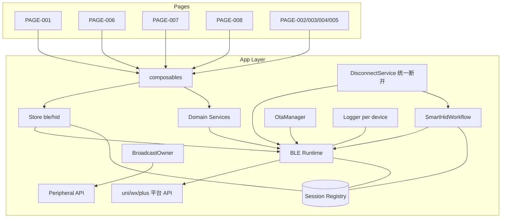

# 10 Runtime 架构与资源所有权

```yaml
status: REVIEW
document_version: 1.0
owner: Smart BLE Product / Engineering
last_reviewed: 2026-09-01
approved_by: null
supersedes: []
```

---

## 1. 本文负责什么 / 不负责什么

本文负责：目标 Runtime 分层、全局回调所有权、六大机制（Scan Generation / Connection Attempt / Session Registry / Notify 路由 / OTA 事务 / Smart HID Workflow）、资源所有权与释放矩阵、并发/重入/迟到事件规则。

本文不负责：页面交互（`pages/`）；协议编码（`11`~`13`）。

---

## 2. 目标分层

```text
Page（页面，UI 与页面生命周期）
→ Composable（页面级行为组合：权限、扫描、会话、广播、配网）
→ Store / Workflow（应用级状态与业务工作流）
→ Domain Service（连接服务、断开服务、诊断服务、OTA 管理、Logger）
→ BLE Runtime / Platform Adapter（唯一平台 API 出口）
→ uni / wx / plus / 原生插件（平台 API）
```

规则：

1. **Central Runtime 是全局 BLE 回调唯一所有者**：`onBluetoothDeviceFound`、`onBLEConnectionStateChange`、`onBLECharacteristicValueChange`、`onBluetoothAdapterStateChange` 只允许 Runtime 注册一次并内部分发。**页面禁止直接注册任何全局 BLE 回调**（E0 静态检查项）。
2. 页面与业务只通过 composable → service 语义接口交互，不 import 平台 BLE API。
3. Peripheral 广播路径（App 插件 / 微信 Peripheral API）归 BroadcastOwner 单例管理，与 Central Runtime 并列但同样禁止页面直连。

## 3. 六大机制

### 3.1 Scan Generation

- 每轮扫描分配递增 generation；
- 发现回调先比对 generation，不匹配即丢弃（STATE-GBL-06）；
- 新一轮 start 时清空上一轮列表（策略：重置重建）；
- active 时重复 start 合并进同一轮（不并行两轮）。

### 3.2 Connection Attempt

- 同 deviceId 并发连接请求合并为一个 attempt（去重）；
- attempt 在 finally 中从进行表移除；
- 连接前 `prepareConnect`：停止活动扫描；
- 服务发现失败必须关闭半开连接。

### 3.3 Session Registry（应用级）

- 连接成功创建 Session 入 Registry；页面卸载不销毁；
- 替换会话时退订旧回调，旧会话事件失效（invalidate）；
- 主动断开/重连耗尽/远端关闭都会改变 Registry 状态并广播给订阅页面（PAGE-007 联动）；
- 配网工作流内部连接不进入"活动会话列表"口径（PAGE-007 排除规则）；
- Registry 维护每会话 `subscription_count`（= 该会话活动订阅数，DEC-017 统一订阅语义下的派生计数）：PAGE-007 卡片显示"订阅中 N"（0 时不显示徽标）；进入 PAGE-006 后按实际订阅状态恢复开关显示。

### 3.4 Characteristic Subscription 与 tuple 路由（DEC-017）

- 订阅键：`(deviceId, serviceId, characteristicId)`；
- 特征值变更回调按 tuple 分发；多设备同 UUID 天然隔离；
- 用户统一操作为"开启订阅/关闭订阅"（Notify 与 Indicate 不区分用户动作）；Runtime 按平台能力启用 Characteristic Value Change；仅当平台 API 明确暴露 ATT indication confirmation 时才允许测试/展示底层 ACK；
- 用户开启的订阅属于 Session（DEC-009 推荐保留），页面卸载仅摘除 UI 监听；订阅数实时反映到 Registry `subscription_count`；
- 关闭订阅=远程 setNotify(false)+本地退订双动作。

### 3.5 OTA Transaction

- 独立状态机（STATE-OTA-01..10），不与页面生命周期绑定；
- 页面离开（确认后）可继续或取消（目标：确认后取消并 abort，保证两端一致）；
- 事务资源（订阅、文件句柄、计时器）在终态释放。

### 3.6 Smart HID Workflow

- 与通用 Runtime 分层：Workflow 使用 Runtime 原语实现协议语义（帧、waiter、错误映射）；
- 通用层不得 import Smart HID；移除 Smart HID Profile 后扫描/连接/GATT/日志/广播全部可用（红线，TEST-C-007）；
- waiter：先注册谓词等待 STATUS notify，再写 INPUT；支持 cancel/failAll。

## 4. 资源所有权与释放矩阵

| 资源 | 所有者 | 页面离开 | 成功 | 失败 | 超时 | 取消 | 应用后台 |
|---|---|---|---|---|---|---|---|
| 扫描 discovery+计时器 | ScanSession | 停止 | 停止 | 停止 | 停止 | 停止 | hide 停止 |
| 连接 attempt | 连接服务 | 继续（属会话） | 入 Registry | 清理半开 | 清理 | 清理 | 继续 |
| Session | Registry | 保留 | 保留 | 移除 | — | — | 保留（平台可能回收） |
| 用户 Notify 订阅 | Session | 保留（DEC-009） | — | 退订 | — | 退订 | 保留 |
| Read 超时 listener | Runtime 单次 | 移除 | 移除 | 移除 | 移除 | 移除 | — |
| Write 队列 | Runtime | 继续 | 排空 | 记录继续 | — | 清空 | 继续 |
| OTA 事务 | OtaManager | 确认后取消+abort | 释放 | 释放+abort | 释放+abort | abort+释放 | 继续（提示） |
| 配网连接 | SmartHidWorkflow | 释放 | 释放（READY） | 释放 | 释放 | 释放 | 释放（恢复重连） |
| 诊断 owned 连接 | 诊断服务 | 断开 | — | 断开 | 断开 | — | 断开 |
| 诊断 borrowed 连接 | 原 Owner | 不动 | 不动 | 不动 | 不动 | 不动 | 不动 |
| Peripheral Server/广播 | BroadcastOwner | 停止+释放 | 停止+释放 | 释放 | — | 释放 | 停止+释放 |
| 微信 Adapter 所有权 | BroadcastOwner | 释放 | 释放 | 释放 | — | 释放 | 释放 |
| 文件句柄（OTA/导出） | 操作发起方 | 关闭 | 关闭 | 关闭 | 关闭 | 关闭 | — |
| Logger | 按设备 | 保留 | 保留 | 保留 | — | — | 保留 |

## 5. 并发、重入、迟到事件、超时与取消

1. **迟到事件**：平台回调携带的上下文（generation/session/tuple）先校验后处理；失效即丢弃并计数（可观测）。
2. **重入**：扫描 start×2 合并；连接 attempt 去重；Notify 开关幂等；OTA start 重入拒绝（ERR-OTA-02 路径）；断开与断开并发以 Registry 状态为准。
3. **超时**：全部异步操作有显式超时（NFR-008/009/014/015）；超时视为失败并走清理列。
4. **取消**：取消是协议/资源动作（OTA=CTRL abort；配网=断开；扫描=stop），不是纯 UI 隐藏。
5. **并发多设备**：会话互不共享状态；断 A 的重连计时器不影响 B。

## 6. 设备上下文传递（stash）

跨页跳转携带稳定身份参数 + 进程内 stash（LRU 30）补全广播快照等大对象；stash 冷启动为空，页面必须能仅凭参数渲染最小身份信息并提示回扫描页获取完整体验。

## 7. 目标架构图



## 8. 验收条件与关联测试规划

- 分层与六大机制冻结；
- 释放矩阵覆盖全部资源×六种终局；
- 禁止事项可静态检查（页面直注册回调、通用层依赖 Profile）。

关联计划测试：`TEST-I-001..009`（Fake Runtime 全机制）、`TEST-C-011`（架构静态约束：页面无直接 BLE 回调注册、通用层无 Smart HID import）。
