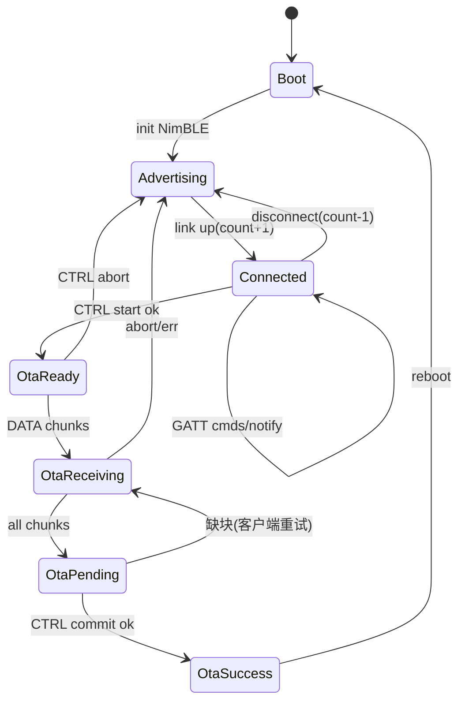

# 12 LightBLE ESP32 夹具契约（fixture_peripheral / fixture_observer）

```yaml
status: REVIEW
document_version: 1.0
owner: Smart BLE Hardware / Engineering
last_reviewed: 2026-09-01
approved_by: null
supersedes: []
```

---

## 1. 本文负责什么 / 不负责什么

本文负责：LightBLE 固件两种目标模式（`fixture_peripheral`、`fixture_observer`）的服务/特征/命令/Notify/OTA/故障注入/串口/构建/安全边界。

本文不负责：App 侧实现（`10`/`11`）；Smart HID 固件（外部仓）。

---

## 2. 支持板型与最小硬件

| 项 | 目标 |
|---|---|
| 主板 | ESP32 DevKit / WROOM-32（目标基线）；ESP32-S3 兼容构建（Observer 常用） |
| 最小外设 | 板载 LED（GPIO2） |
| 供电 | USB 供电即可 |
| 串口 | 115200 baud；**不预设固定串口**（教程与配置示例一律"选择你的端口"） |
| 工具链 | PlatformIO（`pio run` / `-t upload` / `pio device monitor`） |

## 3. 模式与广播

### fixture_peripheral

- 广播名：`BLEToolkit-Server`（**正典名**；固件宏与实际 init 必须一致——这是目标，任何漂移都是缺陷）；
- 广播含主 Service 128-bit UUID（供强匹配与扫描过滤）；
- Scan Response：完整本地名 + 厂商数据示例（`0x00E0` + `LightBLE` ASCII，供广播解析教学）；
- 可连接（connectable）；配对无绑定要求（开放调试服务），OTA 服务同样开放（首版边界，SEC-010 声明）。

### fixture_observer

- 不提供 GATT 服务；仅扫描；
- 广播名 `BLEToolkit-Observer`（自识别）；
- 默认过滤：无（观测全部）或按参数过滤名称前缀；
- 输出：串口 JSON 流（第 10 节）。

## 4. PROTO-001 主服务

| 项 | 值 |
|---|---|
| Service | `4fafc201-1fb5-459e-8fcc-c5c9c331914b` |
| Control | `beb5483e-36e1-4688-b7f5-ea07361b26a8`（Read/Write/Notify） |
| Status/Notify | `beb5483e-36e1-4688-b7f5-ea07361b26a9`（Write/Notify） |

Control 语义：读=Device Info JSON（PROTO-004 `system_info`）；写=LED 命令（HEX `FFxx` 或文本"开灯/关灯"）；写入即回 `write_response`。Status 特征：周期 Notify `device_status`（每 5000ms，含 led/uptime），并统计 notify_sent 计数（写该特征可查询）。

## 5. PROTO-002 权限演示服务

| 项 | 值 |
|---|---|
| Service | `4fafc201-1fb5-459e-8fcc-c5c9c331914c` |
| 特征 ×7 | UUID 末段 `26b0`~`26b6`：READ_ONLY / WRITE_ONLY / NOTIFY_ONLY / READ_WRITE / READ_NOTIFY / WRITE_NOTIFY / ALL |

规则：每特征严格只允许其命名操作；越权操作按属性拒绝（客户端 ERR-GATT-02 前置拦截 + 固件侧拒绝响应 `status code!=0`）。

## 6. LED 命令（PROTO-001 子集）

| 命令 | HEX | 文本 | 效果 |
|---|---|---|---|
| 关 | `FF00` | 关灯 | state=off |
| 开 | `FF01` | 开灯 | state=on |
| 快闪 | `FF02` | — | 200ms 周期 |
| 慢闪 | `FF03` | — | 1000ms 周期 |

未知命令：返回明确错误 JSON（`status code!=0`），**不得固定返回成功**；非法帧头（非 0xFF）同样报错。

## 7. PROTO-003 OTA 服务与事务

| 项 | 值 |
|---|---|
| Service | `4fafc201-1fb5-459e-8fcc-c5c9c331914d` |
| Control（CTRL） | `beb5483e-36e1-4688-b7f5-ea07361b26c0`（Write+Read） |
| Data（DATA） | `beb5483e-36e1-4688-b7f5-ea07361b26c1`（WriteNoResponse） |
| Status（STATUS） | `beb5483e-36e1-4688-b7f5-ea07361b26c2`（Notify+Read） |

CTRL 命令（JSON 写入）：

```json
{"op":"start","size":123456,"chunk_size":180,"target_version":"1.1.0"}
{"op":"commit"}
{"op":"abort"}
```

STATUS notify（JSON）：

```json
{"state":"ready","max_chunk":180}
{"state":"receiving","received":36000,"total":123456,"percent":29}
{"state":"success"}
{"state":"error","code":"OTA_ERR_SPACE","detail":"..."}
```

目标事务（唯一正典顺序，两端共同遵守）：

```text
1. 客户端订阅 STATUS
2. CTRL start(size/chunk_size/target_version)
3. 设备校验（空间/参数）→ STATUS ready(max_chunk)
4. DATA 分包写（≤max_chunk，序即序）
5. 全部到达 → 客户端 CTRL commit
6. 设备校验镜像 → STATUS success
7. 设备 reboot 到新固件
8. 客户端重扫描/重连
9. 读 firmware_version（system_info）
10. 与 target_version 一致 → 客户端判成功
```

约束：

- 任一步失败：设备回 idle，旧固件继续可运行；
- 无 ready 不得写 DATA；无 success 不得显示完成；版本不一致不得成功；
- 取消=CTRL abort（设备丢弃暂存镜像）；
- 分包丢失/乱序由客户端整事务重试解决（V1 无断点续传，Not Now）；
- 错误码枚举：`OTA_ERR_SPACE / OTA_ERR_CHECKSUM / OTA_ERR_SIZE / OTA_ERR_STATE / OTA_ERR_FLASH`。

## 8. Device Info 与版本

`system_info` JSON：`name="BLEToolkit-Server"`、`firmware_version`（语义化，与构建元数据一致）、`hardware`（模块型号）、`uptime_s`。固件构建产物携带 `firmware_version + git shortsha`，供 Release Metadata 与 SHA 校验。

## 9. Fault Injection（故障注入）

默认关闭；开启方式：串口命令或构建宏；开启后广播名追加 `-FAULT` 标识（可识别）。模式：

| 模式 | 行为 | 验证对象 |
|---|---|---|
| delayed_response | 写响应延迟 2s | Write 队列/超时 |
| disconnect_on_write | 第 N 次写入时主动断链 | 被动断开重连 |
| reject_write | 拒绝全部写入 | ERR-GATT-04 |
| notify_burst | Notify 连发 20 条 | 推送路由/UI 节流 |
| ota_wrong_size | start size 与实际不符 | ERR-OTA-06 |
| ota_fail_commit | commit 永不 success | ERR-OTA-04 |
| ota_no_success | data 完成但静默 | 超时路径 |

## 10. PROTO-009 串口 JSON（两模式共用输出约束）

Peripheral 模式事件：

```json
{"t":"adv","name":"BLEToolkit-Server"}
{"t":"conn","count":1}
{"t":"disc","reason":8,"count":0}
{"t":"led","state":"on","cmd":"FF01"}
{"t":"notify","sent":42}
{"t":"ota","state":"success","percent":100}
{"t":"err","code":"LED_CMD_UNKNOWN"}
```

Observer 模式观测流（手机广播证据）：

```json
{"t":"obs","ts":1725168000123,"name":"MyPhone","rssi":-58,
 "uuids":["ffe0"],"mfg":"4c000100...","svc_data":"...","raw":"020106...","last_seen":1725168000123}
```

字段必备：时间戳、名称、RSSI、UUID 列表、Manufacturer/Service Data（hex）、原始字节、最后发现时间。Observer 速率：≥5 条/秒不丢帧（环形缓冲）。

## 11. 状态机与时序（Peripheral）



## 12. 构建、烧写与恢复

- `pio run`（构建）、`pio run -t upload`（烧写，端口由用户选择）、`pio device monitor --baud 115200`；
- platformio.ini 不写死 `upload_port`（教程示例使用环境变量或提示选择）；
- 恢复：OTA 失败后旧固件自动继续运行；刷坏时 USB 串口重刷即可（教程含故障表）；
- 产物：`firmware.bin` + `bootloader/partitions`（按板型）+ `manifest.json`（版本/shortsha/SHA256）。

## 13. 测试与证据要求

- 固件静态/单元（E1）：协议常量、JSON schema、LED 解码；
- on-target（TEST-E-001..008）：广播字段、LED、权限组合、Notify 频率、故障注入、OTA 全事务、Observer 流、串口 schema；
- 真机联动：TEST-A/TEST-W 中夹具相关用例；
- 证据：EVID-003（Peripheral）、EVID-004（Observer）、EVID-006（OTA）。

## 14. 安全边界

- 夹具是**公开测试设备**：无安全配对、无固件签名校验（V1 明示限制，SEC-010）；不得用于生产或敏感环境声明；
- OTA 无签名 → 恶意固件风险由"仅测试夹具"定位与文档声明缓解（`15` 残余风险 R-OTA）；
- 串口输出无敏感数据；Observer 流记录的广播数据属公开空口数据。

## 15. 验收条件与关联测试规划

- [x] 双模式、三服务、命令、Notify、OTA、故障、串口、构建全定义；
- [x] OTA 10 步与 `07`/FLOW-009 一致；
- [x] 无固定串口、广播名正典、版本可回读。

关联计划测试：`TEST-E-001..008`、`TEST-C-012`（协议常量一致）、`TEST-R-008`（固件下载+SHA）。
