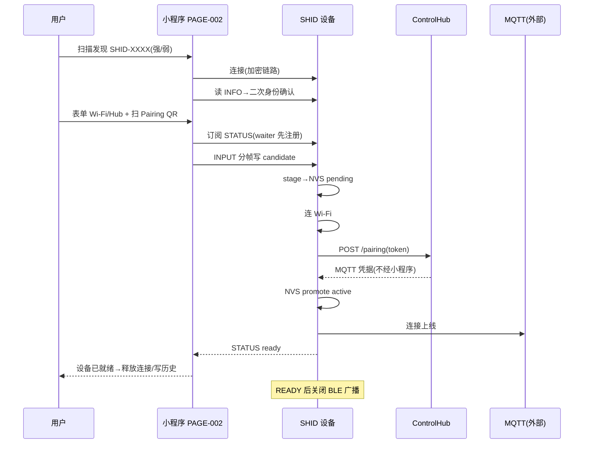

# 13 Smart HID Profile 契约

```yaml
status: REVIEW
document_version: 1.0
owner: Smart BLE Product / Profile
last_reviewed: 2026-09-01
approved_by: null
supersedes: []
```

---

## 1. 本文负责什么 / 不负责什么

本文负责：Smart HID 作为 Smart BLE 第一个第一方 Profile 的客户端目标契约——匹配、身份、配网、状态、错误、历史、诊断、与通用 Runtime 的分层、发布状态规则。

本文不负责：Smart HID 固件与 ControlHub/MQTT/USB HID 实现（外部正典 Smart-HID-Workspace）；通用 GATT 语义（`11`）。

---

## 2. 外部正典与锁定

- 语义正典：Smart-HID-Workspace `protocols/ble/PROVISIONING_V1.md` 与 `protocols/contracts/smart-hid-v1.json`；
- 本仓 `core/protocols/hid-provisioning-protocol.ts` 是**受锁定镜像**，与 `core/protocols/smart-hid-contract.lock.json`（canonical commit/SHA/版本）绑定；
- 修改流程：先改外部正典 → 更新 lock → 同步镜像 → 双侧校验（TEST-C-013 计划项）；
- MQTT 命令 schema（hid-command-schema.ts）是公开定义参考，**Smart BLE App 不实现 MQTT 控制链路**。

## 3. GATT 结构（PROTO-005）

| 项 | UUID | 权限 |
|---|---|---|
| Provisioning Service | `9f1d1001-e73b-4c8f-9d2a-6f0b5e8a1c04` | — |
| Device Info（INFO） | `9f1d1002-e73b-4c8f-9d2a-6f0b5e8a1c04` | read + notify |
| Provision Input（INPUT） | `9f1d1003-e73b-4c8f-9d2a-6f0b5e8a1c04` | write（要求加密链路） |
| Provision Status（STATUS） | `9f1d1004-e73b-4c8f-9d2a-6f0b5e8a1c04` | read + notify |

广播：ADV 携带 Provisioning Service UUID；Scan Response 名称 `SHID-XXXXXXXX`（device_id 8 位尾码）。正则：名称 `/^SHID-[A-Z0-9]{6,8}$/`；device_id `/^HID-[A-Z0-9]{8}$/`。

## 4. 匹配与身份

- **STRONG**：广播 Service UUID（小写归一）命中 `9f1d1001-…-1c04`；
- **WEAK**：名称以 `SHID-` 开头（大写化）；
- **二次身份确认**（连接后读 INFO）：`product==='smart-hid'` 且 `protocol==='1.0'` 且 `device_id` 匹配格式——三条件同时成立；任一不成立=ERR-HID-09，立即断开返回；
- 错误设备（含恶意仿冒 UUID 广播）无法通过二次确认进入表单。

Profile 描述符：`id='smart-hid'`、`version='1'`、required=[INFO,INPUT,STATUS]、notify=[INFO,STATUS]、preferredMtu=247、transport.framing='framed-v1'、capabilities=['provisioning','diagnostics','gatt-debug']。

## 5. PROTO-006 Pairing QR

- URI：`shid://pair?token=<32 位小写 hex>&host=<hub-lan-ip>&port=<17892>`；
- 解析规则：scheme 大小写不敏感；重复 query 参数=非法；token 强制小写化校验；host 非空且无空白/斜杠；port 缺省 17892；任何非法→返回 null（按非 SHID 码处理，不抛错）；
- token 5 分钟一次性（服务端语义）；客户端仅内存持有。

## 6. PROTO-007 candidate 与分帧

candidate JSON（单次完整配置）：

```json
{"v":1,"wifi_ssid":"...","wifi_password":"...","hub_host":"...","hub_port":17892,"token":"<32hex>"}
```

校验：ssid 非空 ≤32；password ≤64；host 非空；port 1–65535（默认 17892）；token `/^[0-9a-f]{32}$/`。

分帧（长度前缀，无转义）：

```text
帧 = [seq:u8][total:u8][len:u8][payload:len]
```

- seq 从 0 递增；total 1–64；payload ≤128B；组装上限 1024B；
- 切块 `chunkSizeForMtu(mtu)=min(128, mtu-3-3)`；默认 MTU 23 时每块 17B 合法；
- `seq=0` 视为新传输（可整体重发）；乱序/跳号/total 变化由设备丢弃报错；
- **单次写入流程**：先注册 STATUS waiter → 分帧逐写 INPUT → 等待终态。

## 7. 状态机（state/step 分离）

state（10）：`boot / load_config / unprovisioned / provisioning / connecting_wifi / pairing / mqtt_connecting / ready / recovery / error`。

step（过渡，7）：`received / connecting_wifi / wifi_connected / pairing / pairing_success / mqtt_connecting / ready`。

Status JSON：`{"state":…,"step":…,"error":string|null}`。UI 规则：四步进度=step 投影（Wi-Fi→Pairing→MQTT→Ready）；终态判定：error/ready/recovery；客户端 waiter 超时（60s）≠设备状态，显示 ERR-HID-12 不假成功。

## 8. 八类错误与恢复（唯一登记见 `07` 3.9）

| 协议码 | ERR | 恢复 |
|---|---|---|
| invalid_payload | ERR-HID-01 | 表单 |
| wifi_failed | ERR-HID-02 | 表单（检查 SSID/密码） |
| controlhub_unreachable | ERR-HID-03 | 确认 Hub→重新扫码 |
| pairing_invalid | ERR-HID-04 | 重新扫码 |
| pairing_expired | ERR-HID-05 | 重新扫码 |
| pairing_used | ERR-HID-06 | 重新扫码 |
| mqtt_invalid | ERR-HID-07 | 诊断 |
| storage_failed | ERR-HID-08 | 重试/支持 |

恢复原则：Wi-Fi 失败只退回 Wi-Fi 步；token 失效只重扫码；MQTT 失败进诊断；不重做已完成阶段；切后台恢复后重连读 Status。

## 9. 安全边界（SEC-007/009）

- INPUT 要求加密链路（bonding Just Works + LE Secure Connections）；
- **Just Works ≠ MITM 抗性**——V1 已知取舍，如实声明（`15` 残余风险 R-HID-01）；
- token/密码仅内存；不落盘、不入 URL/日志/截图/导出；
- MQTT 凭据由 ControlHub→设备直发，**不经过小程序**；
- 设备身份根（Secure Boot/Flash Encryption）属外部 Production Security 范畴。

## 10. 历史、诊断与会话所有权

- 历史=DATA-006（非敏感快照；TTL 90 天；去重按 device_id；上限 50；仅本机移除）；
- 诊断五项：BLE / Wi-Fi / ControlHub / 控制连接 / Ready；进入自动一次（有连接时）；owned=离页断开，borrowed=离页保持；
- READY 后设备关闭广播：详情/诊断需设备处于可连接（恢复）模式；页面明确提示；
- 重配：deviceId 复用走 PAGE-002；成功后历史更新（去重不新增）。

## 11. 与通用 BLE Runtime 的分层

| 层 | 通用 | Smart HID |
|---|---|---|
| 匹配 | 通用 matcher 框架 | 注册 smart-hid 强/弱规则 |
| 连接/发现/读写/订阅 | Runtime 原语 | Workflow 组合原语实现协议 |
| 状态 | Session 状态机 | 叠加协议 state/step 投影 |
| 页面 | PAGE-006 通用调试 | PAGE-002~005 Profile 页 |

红线（TEST-C-007）：

1. 通用层（Runtime/Store/页面 001/006/007/008/009/010）不得 import Smart HID 专用模块；
2. 移除 smart-hid Profile 注册后，扫描/连接/GATT/日志/广播全部功能不回归；
3. Smart HID 设备仍可作为通用设备经 PAGE-006 调试（gatt-debug 能力）。

## 12. 发布状态规则

- Smart HID 不阻塞通用 BLE 首版 Gate：通用 BLE 能力可先于 Smart HID 达到 VERIFIED；
- Smart HID 公开状态独立评定（DEC-006）：推荐首版 PREVIEW（若 E5 证据不全）或 VERIFIED（TEST-H 全过）；
- ControlHub/MQTT/USB HID 不由 Smart BLE 通用 Runtime 承担，也不在落地页声明为 Smart BLE 能力。

## 13. 时序图（正典配网）



## 14. 验收条件与关联测试规划

- 匹配/身份/QR/分帧/状态/错误/安全/历史/诊断/分层全定义；
- 与外部正典锁定关系与修改流程明确；
- 分层红线可静态检查。

关联计划测试：`TEST-H-001..008`（E5 矩阵）、`TEST-U-015`、`TEST-I-009`、`TEST-C-007`（分层红线）、`TEST-C-013`（镜像与 lock 一致）。
