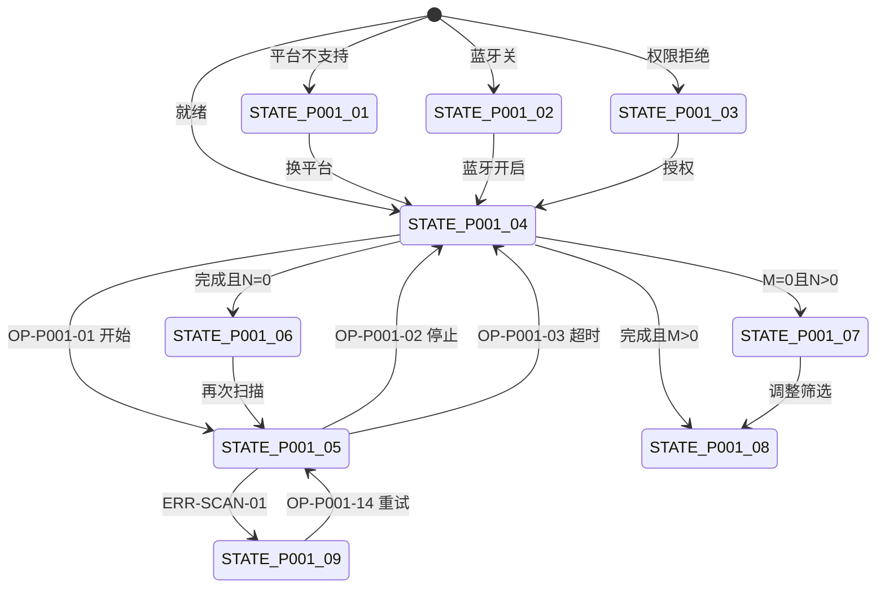

# PAGE-001 扫描页目标规范

## 0. 文档元数据

```yaml
status: REVIEW
document_version: 1.0
owner: Smart BLE Product / UX
last_reviewed: 2026-09-01
approved_by: null
supersedes: []
```

## 1. 页面目标与存在必要性

扫描页是一切 BLE 流程的起点：发现、识别、理解附近设备，并把用户送进正确的后续路径（通用调试 PAGE-006 / Smart HID 配网 PAGE-002 / 历史 PAGE-004）。它同时是平台能力与权限的第一现场：用户必须在第一屏知道自己"能不能扫、为什么不能"。

存在必要性：没有此页则产品没有入口；它是 PERM/SCAN/AD 三组功能（FEAT-005~019）的唯一宿主。

## 2. 用户角色与使用场景

- PER-01 陈工：烧写夹具后验证广播（场景 1-1）；
- PER-02 林同学：微信首用权限链路（场景 2-1）、无设备学习（场景 2-2 前置）；
- PER-03 赵哥：找到 SHID 设备发起配网（场景 3-1）；
- 全角色：H5 降级首触（场景 2-4）。

## 3. 进入来源、路由参数、深链与冷启动

- 路由：`pages/index/index`，Tab 页，无参数。
- 进入来源：冷启动默认、四 Tab 切换、PAGE-004/007 空态引导（switchTab）、微信分享回流回本页。
- 深链/冷启动：本页无参数依赖；分享路径即本页，冷启动直接可用。

## 4. 信息架构与区块顺序（自上而下）

1. 导航区：产品标识 + 蓝牙状态芯片（三态：开/关/检测中）；
2. 平台/权限状态区：平台能力结论 + 权限状态（异常时升级为可操作横幅）；
3. 扫描控制区：状态芯片（待开始/扫描中/已完成/失败）、"发现 N 台 · 筛选后 M 台"、开始/停止按钮、失败重试横幅；
4. Smart HID 历史紧凑区（有历史时）：最近 1 台摘要 + "查看详情" + "全部历史"入口（形态 DEC-012；**只读入口**——不提供删除/批量管理/TTL/重命名，历史管理唯一归 PAGE-004）；
5. 设备列表区：标题"附近设备" + 筛选控件（RSSI 阈值/名称前缀/隐藏无名）+ 列表/空态；
6. 广播详情弹窗（点击设备卡触发，非页面区块）。

## 5. 首屏必须可见内容

- 蓝牙/权限/平台状态（或对应可操作提示）；
- 扫描控制按钮与状态；
- 设备列表或对应空态（无结果/筛选空/无权限/不支持四者其一）；
- 发现总数与筛选数（开始扫描后）。

## 6. 字段定义与数据来源

| 字段 | 类型 | 来源 | 实时/历史 |
|---|---|---|---|
| 蓝牙状态 | enum(on/off/checking) | 适配器状态事件 | 实时 |
| 权限状态 | enum(granted/denied/permanent-denied/location-required/location-denied/location-service-off/na) | 权限 API + Capability Detection（location-* 仅在环境确实要求时出现，DEC-003） | 实时 |
| 扫描状态 | STATE-P001-04..09 | 扫描会话 | 实时 |
| 发现总数 N | int | 设备集合 | 实时 |
| 筛选数 M | int | 过滤器纯函数 | 实时 |
| 设备显示名 | string | 解析链（FEAT-013） | 实时 |
| deviceId | string | 平台归一 | 实时 |
| RSSI | int dBm | 发现事件 | 实时 |
| Profile 标记 | enum(smart-hid/generic) | matcher | 实时 |
| 广播字段 | 结构化 | 广播归一层（FEAT-017） | 快照（发现时） |

## 7. 完整操作表

| Operation ID | 控件/入口 | 显示条件 | 禁用条件 | 用户输入 | 调用链 | 成功反馈 | 失败反馈 | 跳转/返回 | 清理 | 测试 |
|---|---|---|---|---|---|---|---|---|---|---|
| OP-P001-01 | 开始扫描按钮 | 状态=待开始/已完成/失败 | 权限拒绝、蓝牙关、平台不支持 | 无 | Composable→Store→ScanSession→Runtime.startDiscovery | 列表增量出现，状态=扫描中 | ERR-SCAN-01 横幅+重试 | 无 | 进入扫描前确保旧会话已停 | TEST-P-001、TEST-A-005、TEST-W-007、TEST-E-001 |
| OP-P001-02 | 停止扫描按钮 | 状态=扫描中 | 无 | 无 | Store.stopScan(user) | 状态=已完成，列表保留 | 记日志兜底静默 | 无 | 停发现+清计时器 | TEST-P-001、TEST-A-005 |
| OP-P001-03 | 超时自动停止 | 扫描中达到默认时长（DEC-013） | 无 | 无 | 计时器→stopScan(timeout) | 状态=已完成（视为正常完成） | 同 OP-P001-02 | 无 | 同上 | TEST-P-001、TEST-U-005 |
| OP-P001-04 | hide/unload 停止 | 页面隐藏/卸载 | 无 | 无 | 生命周期→stopScan(page_hide/unload) | 无声（后台不扫描） | 记日志 | 无 | 同上+页面订阅 | TEST-I-002、TEST-A-003、TEST-W-003 |
| OP-P001-05 | 第二轮扫描 | 完成后再次点开始 | 同 OP-P001-01 | 无 | 新 generation start | 列表重建 | 同 ERR-SCAN-01 | 无 | 旧 generation 事件作废 | TEST-U-005、TEST-I-002 |
| OP-P001-06 | 设备卡点击 | 列表有设备 | 无 | 无 | 打开广播弹窗（不连接） | 弹窗展示结构化字段+原始字节 | 解析失败段标注 | 无 | 弹窗关闭无残留 | TEST-P-001、TEST-A-005、TEST-E-001 |
| OP-P001-07 | 连接按钮（卡上） | 通用设备 | 扫描中（需先停）不禁用但流程先停扫 | 无 | prepareConnect(停扫)→跳 PAGE-006 并发起连接 | PAGE-006 连接中 | ERR-CONN-01 在目标页呈现 | →PAGE-006 | 停止本轮扫描 | TEST-P-006、TEST-A-006、TEST-W-007 |
| OP-P001-08 | Profile 动作（Smart HID 配网） | matcher 命中（强/弱） | 同上 | 无 | 设定 Profile 当前设备→跳 PAGE-002 | PAGE-002 自动连接 | 身份错误在目标页呈现 | →PAGE-002 | 停止本轮扫描 | TEST-P-002、TEST-H-001、TEST-W-010 |
| OP-P001-09 | 筛选控件 | 列表区 | 无 | RSSI 阈值/前缀/开关 | 纯函数过滤→M 更新 | 列表即时更新 | 筛选空态 STATE-P001-07 | 无 | 无 | TEST-U-007、TEST-P-001 |
| OP-P001-10 | 复制广播字段 | 广播弹窗内 | 弹窗开 | 无 | 剪贴板 | toast 已复制 | ERR-SYS-03 toast | 无 | 无 | TEST-P-001、TEST-W-007 |
| OP-P001-11 | 历史紧凑-查看 | 本机存在 Smart HID 历史 | 无 | 无 | →PAGE-003 | 详情页打开 | ERR-DATA-03 modal 返回 | →PAGE-003 | 无 | TEST-P-003 |
| OP-P001-13 | 历史紧凑-全部历史 | 同上 | 无 | 无 | →PAGE-004 | 历史页打开 | 无 | →PAGE-004 | 无 | TEST-P-004 |
| OP-P001-14 | 失败重试横幅按钮 | 状态=扫描失败 | 无 | 无 | 重新 start（新 generation） | 恢复扫描 | 保持失败态 | 无 | 同 OP-P001-01 | TEST-P-001 |
| OP-P001-15 | 分享（微信菜单） | 微信环境 | 无 | 无 | shareApp | 分享面板 | 无 | 无 | 无 | TEST-W-010 |

编号说明：OP-P001-12（历史紧凑-移除）已于 TP-G0-R1 **废弃删除**——历史管理唯一归 PAGE-004（DEC-012 附则、FEAT-016 边界）；编号不复用（`00` 3.2 规则 1），后续操作保持原编号不变。

## 8. 完整状态表

| State ID | 状态名称 | 进入条件 | 页面内容 | 允许操作 | 退出条件 | 数据更新 | 测试 |
|---|---|---|---|---|---|---|---|
| STATE-P001-01 | 平台不支持 | 能力探测=BLE 不可用（H5/插件缺失） | UNSUPPORTED 说明+替代入口 | 去微信/App、浏览文档 | 平台变化（罕见） | 无 | TEST-P-001、TEST-W-006 |
| STATE-P001-02 | 蓝牙关闭 | 适配器=off | 蓝牙芯片=关+去开启按钮 | OP-P001-14 类重试、去设置 | 用户开启自动恢复 | 状态芯片 | TEST-A-004、TEST-W-005 |
| STATE-P001-03 | 权限拒绝 | 权限=denied/permanent | 权限横幅+重试/去设置 | 重试请求或跳设置 | 授权成功恢复 | 状态芯片 | TEST-A-001、TEST-W-001 |
| STATE-P001-04 | 待开始 | 就绪且未扫描 | 空提示"点击开始扫描" | OP-P001-01 | 开始扫描 | 清列表策略见 DEC-013 附则（新一轮重置） | TEST-P-001 |
| STATE-P001-05 | 扫描中 | discovery active | 状态芯片+停止按钮+实时列表 | OP-P001-02/06/07/08/09 | 完成/停止/失败/超时 | 列表增量、N/M 实时 | TEST-A-005、TEST-W-007、TEST-E-001 |
| STATE-P001-06 | 无结果 | 轮次完成且 N=0 | 空态"未发现设备"+建议（换位置/确认设备广播） | 再次扫描 | 新轮次 | 无 | TEST-P-001、TEST-A-005 |
| STATE-P001-07 | 筛选无结果 | N>0 且 M=0 | "筛选后无匹配"+调整筛选建议 | 调整筛选、清筛选 | M>0 或清筛选 | M 更新 | TEST-P-001 |
| STATE-P001-08 | 结果列表 | M>0 | 设备卡列表 | 卡片全部操作 | 新轮次/离开 | 去重与 RSSI 更新 | TEST-A-005、TEST-E-001 |
| STATE-P001-09 | 扫描失败 | startDiscovery 失败 | 错误横幅+重试 | OP-P001-14 | 重试成功 | 无 | TEST-P-001、TEST-E-005 |
| STATE-P001-10 | 已有连接提示 | Registry 有活动会话 | 顶部轻提示"N 台设备保持连接"（不阻塞扫描） | 全部 | 会话清空 | 计数联动 | TEST-P-007 |

## 9. 错误、空态和恢复动作

| 错误/空态 | ID | 用户所见 | 唯一恢复动作 |
|---|---|---|---|
| 权限拒绝 | ERR-PERM-01 | 横幅：需要蓝牙权限 | 重新请求 |
| 永久拒绝 | ERR-PERM-03 | 横幅+说明 | 去系统设置 |
| 环境要求定位未授权（仅能力检测命中） | ERR-PERM-02 | 横幅：当前环境需定位授权 | 去授权（环境不需要定位时本条不得出现） |
| 环境要求位置服务未开（仅能力检测命中） | ERR-PERM-04 | 横幅：需开启位置服务 | 去系统设置开启 |
| 蓝牙关闭 | ERR-BT-01 | 芯片+横幅 | 去开启蓝牙 |
| 适配器打开失败 | ERR-BT-02 | 错误横幅 | 重试（上限后指引重启蓝牙） |
| 平台不支持 | ERR-BT-03 | UNSUPPORTED 面 | 前往支持的入口 |
| 扫描启动失败 | ERR-SCAN-01 | 横幅+重试 | 重试 |
| 无结果 | STATE-P001-06 | 空态 | 再次扫描/换位置 |
| 筛选空 | STATE-P001-07 | 空态 | 调整筛选 |

权限失败与扫描失败是两个独立状态：权限问题绝不静默归入扫描失败（FEAT-005/010 边界）。

## 10. 页面跳转与返回规则

出口：→PAGE-002（OP-08）、→PAGE-003（OP-11）、→PAGE-004（OP-13）、→PAGE-006（OP-07）。Tab 常驻可去其余 Tab。本页为 Tab，无返回。跳转带走：连接类跳转先停扫描；页面状态（筛选配置）在 Tab 切换间保留。

## 11. Runtime / Web 调用链

```text
UI(设备卡/按钮)
→ composable use-ble-scan（权限/生命周期/超时）
→ store.ble（列表/筛选/N·M）
→ ScanSessionController（generation）
→ BLE Runtime.startDiscovery / stopDiscovery
→ 平台 API（uni/wx/plus）
```

广播弹窗数据来自广播归一层纯函数；无页面级全局回调注册。

## 12. 资源所有权与生命周期

| 资源 | 所有者 | 释放时机 |
|---|---|---|
| 扫描计时器 | 页面 composable | 超时/停止/hide/unload |
| discovery | Runtime 扫描会话 | stop 或 prepareConnect |
| 设备列表 store 订阅 | 页面 | unload |
| 广播弹窗状态 | 页面局部 | 关闭即弃 |

全局发现回调归 Runtime 常驻（应用级），页面不注册 `onBluetoothDeviceFound`。

## 13. 平台差异与降级

| 平台 | 行为 |
|---|---|
| Android App | Full；权限三态+永久拒绝路径 |
| 微信 | Full/Adapted；权限能力驱动最小申请（FEAT-006、DEC-003：点击扫描才申请；仅环境要求时引导定位）；广播字段可能不全，缺失标"平台未提供" |
| H5 | UNSUPPORTED 面（STATE-P001-01） |
| iOS App | 同 Android 语义；未发布不影响本页定义 |

## 14. ESP32 / Smart HID / Release 依赖

- ESP32：夹具广播是 E5 验证对象（广播名/UUID/厂商数据逐字段一致，TEST-E-001）。
- Smart HID：matcher 在本页展示配网动作（FEAT-053）；历史紧凑入口（FEAT-016）。
- Release：本页为公开能力卡"扫描/广播解析"的证据宿主（CLAIM-004/005）。

## 15. 安全、隐私和脱敏

本页不产生敏感数据；URL 无参数；MAC/deviceId 不上送远端（SEC-002）。广播原始数据仅在本地展示。

## 16. 性能、容量和超时

扫描 UI 合并刷新 ≤1s（NFR-004）；列表上限 100（NFR-006）；过滤 ≤50ms（NFR-007）；默认扫描时长 10 秒（DEC-013，常量可调；可手动停止、完成后可立即重扫）；状态变化到 UI ≤1s（NFR-003）。

## 17. 无障碍、文案和视觉规则

状态芯片不只靠颜色（附文字与图标）；错误横幅是唯一恢复动作入口（不并列多按钮）；触控目标 ≥44px；读屏可朗读"N 台设备，筛选后 M 台"；空态文案给出下一步（`17` 文案表 S-01~S-05）。

## 18. 自动化测试映射

TEST-P-001（页面四态+操作）、TEST-U-005/006/007/008（纯函数）、TEST-I-002（扫描会话/迟到事件）、TEST-C-005（路由）。

## 19. 真机 / 发布测试映射

TEST-A-001/004/005（Android 权限/蓝牙/扫描）、TEST-W-001/005/007（微信）、TEST-E-001（夹具广播观测）。发布条件：双平台扫描 E5 + Observer 一致。

## 20. 公开声明与证据要求

CLAIM-004"扫描与广播解析"：VERIFIED 前提=TEST-A-005+TEST-W-007+TEST-E-001 通过且证据入 EVID-001/002/003。不达标时能力卡标 PREVIEW。

## 21. 验收条件

- 五个独立状态（权限拒绝/蓝牙关/扫描失败/无设备/筛选空）在页面与测试中互相可区分；
- N 与 M 同时可见；
- 显示名解析链完整生效；
- 全部已登记操作（OP-P001-01..11/13..15，OP-P001-12 已废弃）有 ID、反馈与清理定义；
- 权限错误与扫描错误不合并；
- 定位相关状态仅在能力检测判定环境需要时出现（DEC-003）。

## 22. 非目标与禁止行为

- 不在本页做配网/写操作；
- 不重复 PAGE-004 的完整历史列表；
- **不在本页删除/批量管理 Smart HID 历史、不修改 TTL、不重命名历史记录**（历史管理唯一归 PAGE-004，FEAT-016/061 边界）；
- 不显示"连接稳定"类无证据健康词；
- H5 不出现假扫描动画或示例数据冒充真实发现。

## 23. Mermaid 流程图 / 状态图



## 24. 关联 ID 与链接

REQ-005~018｜FEAT-005~019｜FLOW-001/002/003/010｜错误：ERR-PERM-01/02/03/04、ERR-BT-01/02/03、ERR-SCAN-01、ERR-SYS-03、ERR-DATA-03｜数据：DATA-001/002｜[`05 总表`](../05_TARGET_PAGE_CATALOG.md)｜[`06 流程`](../06_TARGET_USER_FLOWS.md)｜[`10 Runtime`](../10_RUNTIME_ARCHITECTURE_AND_RESOURCE_OWNERSHIP.md)
