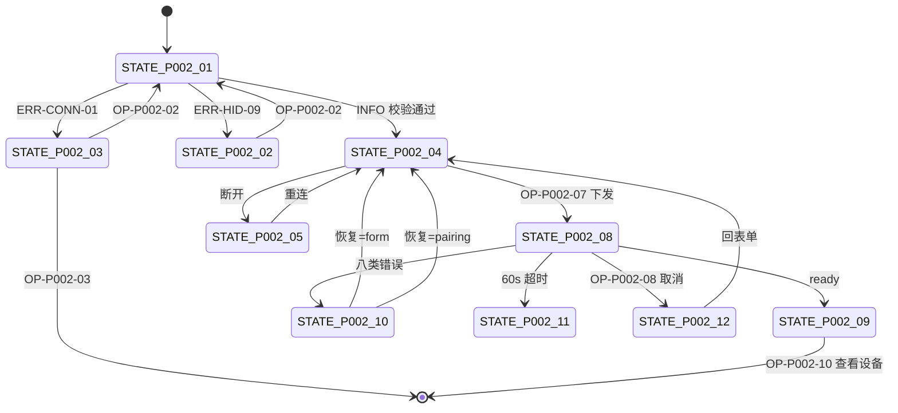

# PAGE-002 Smart HID 配网页目标规范

## 0. 文档元数据

```yaml
status: APPROVED
document_version: 1.0
owner: Smart BLE Product / Profile
last_reviewed: 2026-09-01
approved_by: user
supersedes: []
```

## 1. 页面目标与存在必要性

单页向导完成 Smart HID 设备配网：自动连接 → Device Info 身份确认 → 表单（Wi-Fi + ControlHub）→ 动态 Pairing QR → candidate 分帧下发 → 四步状态 → READY 或八类错误恢复。

存在必要性：这是 Smart HID Profile 的唯一写入路径；没有它用户无法把设备接入 ControlHub。协议正典为外部仓 PROVISIONING_V1（`13` 引用），本页是其客户端宿主。

## 2. 用户角色与使用场景

- PER-03 赵哥：首次配网（场景 3-1）、token 过期（3-2）、换 Wi-Fi 重配（3-4，从 PAGE-003 进入）。
- PER-04 王同学：按文档复现配网作为 Profile 扩展参考。

## 3. 进入来源、路由参数、深链与冷启动

- 路由：`pages/hid/add?deviceId=<enc>`；deviceId 必选，设备对象经 Profile 当前设备上下文或 Registry/stash 解析，解析失败时尝试按 deviceId 直连。
- 来源：PAGE-001 OP-P001-08、PAGE-003 重新配置、PAGE-005 重新配网。
- 冷启动深链：仅参数进入时允许自动连接流程；stash 缺失不白屏。
- 配网进行中拦截返回（OP-P002-11）。

## 4. 信息架构与区块顺序

1. 阶段指示器（连接 → 填写配置 → 查看状态）；
2. 连接阶段：目标设备名/ID、连接中动画、连接错误与重连/返回；
3. 表单阶段：连接徽章、Device Info 摘要（product/protocol/device_id/firmware）、SSID、密码（掩码+显示开关）、Hub 地址（host:port，端口默认 17892）、扫码卡（必需/已获取状态）、隐私说明、下发按钮；
4. 状态阶段：四步进度（Wi-Fi/Pairing/MQTT/Ready）、当前 state+step、等待取消、错误卡（码+文案+唯一恢复动作）、成功卡（查看设备/返回扫描）。

## 5. 首屏必须可见内容

当前阶段指示器 + 该阶段主内容（连接中状态或表单或进度）；隐私说明在表单阶段首屏可见。

## 6. 字段定义与数据来源

| 字段 | 类型 | 来源 | 校验 |
|---|---|---|---|
| deviceId | string | 路由 | 必选 |
| 设备名 | string | 广播/Device Info | 显示用 |
| product/protocol/device_id/firmware | string | INFO 特征读取 | 二次身份确认（FEAT-054） |
| wifi_ssid | string ≤32 | 用户输入 | 非空、长度 |
| wifi_password | string ≤64 | 用户输入（掩码） | 长度 |
| hub_host | string | 用户/QR | 非空、无空白斜杠 |
| hub_port | int 1–65535 | 用户/QR 默认 17892 | 范围 |
| token | 32hex | QR 解析（仅内存） | `/^[0-9a-f]{32}$/` |
| state/step/error | 枚举 | STATUS notify | `13` 状态机 |

## 7. 完整操作表

| Operation ID | 控件/入口 | 显示条件 | 禁用条件 | 用户输入 | 调用链 | 成功反馈 | 失败反馈 | 跳转/返回 | 清理 | 测试 |
|---|---|---|---|---|---|---|---|---|---|---|
| OP-P002-01 | 自动连接（进入触发） | 进入页面且未连接 | 无 | 无 | SmartHidService.connect→发现→读 INFO | 身份通过进入表单 | ERR-CONN-01/ERR-HID-09 | 无 | 半初始化失败必须断开 | TEST-H-001、TEST-H-002 |
| OP-P002-02 | 重新连接按钮 | 连接失败态 | 连接中 | 无 | 同上 | 同上 | 同上 | 无 | 同上 | TEST-H-001 |
| OP-P002-03 | 返回设备列表 | 连接失败态 | 无 | 无 | navigateBack | — | — | →来源页 | 释放连接 | TEST-P-002 |
| OP-P002-04 | 表单输入 | 表单阶段 | 下发中（表单冻结） | 见字段表 | 本地校验（纯函数） | 下发按钮随完整性启用 | 字段级错误 ERR-HID-10 | 无 | 无 | TEST-U-015、TEST-P-002 |
| OP-P002-05 | 密码显示开关 | 表单阶段 | 无 | 切换 | 本地 | 明文/掩码 | 无 | 无 | 无 | TEST-P-002 |
| OP-P002-06 | 扫码 | 表单阶段 | 无 | 相机 | parsePairingQrPayload | "已获取"状态+host 回填 | 取消回表单；无效 ERR-HID-11 | 无 | 相机会话关闭 | TEST-U-015、TEST-H-002 |
| OP-P002-07 | 下发配置 | 表单完整+QR 有效 | 缺任一必填 | 无 | buildCandidate→先注册 STATUS waiter→分帧写 INPUT | 进入状态阶段 | 见八类错误 | 无 | waiter 取消能力 | TEST-I-009、TEST-H-002 |
| OP-P002-08 | 取消等待 | 状态阶段未终态 | 无 | 无 | 取消 waiter+（可选）CTRL 无——本协议无 abort 特征，取消即断开连接 | 回表单（保留输入） | 断开失败兜底重试 | 无 | 断开连接+退订 | TEST-P-002、TEST-H-003 |
| OP-P002-09 | 错误恢复按钮 | 错误终态 | 无 | 无 | 按 `13` 恢复映射（form/pairing/diagnostics/retry） | 进入对应阶段 | 无 | 可→PAGE-005 | 按动作清理 | TEST-H-003 |
| OP-P002-10 | 查看设备 | READY | 无 | 无 | 写历史→跳详情 | — | — | →PAGE-003 | 释放配网连接（REQ-051） | TEST-H-004 |
| OP-P002-11 | 返回键（拦截） | 配网进行中 | 无 | 确认 | 确认后取消+离开 | — | — | →来源页 | 同 OP-P002-08 | TEST-P-002 |

## 8. 完整状态表

| State ID | 状态名称 | 进入条件 | 页面内容 | 允许操作 | 退出条件 | 数据更新 | 测试 |
|---|---|---|---|---|---|---|---|
| STATE-P002-01 | 连接中 | 进入/重连 | 动画+目标设备 | OP-03 | 成功/失败 | 无 | TEST-H-001 |
| STATE-P002-02 | 身份确认失败 | INFO 校验不符 | 错误说明（错设备） | OP-02/03 | 离开或重连 | 无 | TEST-H-001 |
| STATE-P002-03 | 连接失败 | connect 超时/失败 | 错误+重连/返回 | OP-02/03 | 成功/离开 | 无 | TEST-H-001 |
| STATE-P002-04 | 已连接待填写 | 身份通过 | 表单 | OP-04/05/06/07 | 下发或连接丢失 | 无 | TEST-P-002 |
| STATE-P002-05 | 连接丢失 | 下发前断开 | 提示+重连（表单保留） | 重连 | 恢复或离开 | 表单值本地保留 | TEST-P-002 |
| STATE-P002-06 | 表单不完整 | 必填缺失 | 下发禁用+缺失提示 | OP-04/05/06 | 完整 | 无 | TEST-U-015 |
| STATE-P002-07 | QR 无效/取消 | 解析失败或用户取消 | 提示回表单 | 重新扫码 | 获取成功 | 无 | TEST-U-015 |
| STATE-P002-08 | 下发中 | OP-07 触发 | 四步进度实时 | OP-08 | 终态 | waiter 挂起 | TEST-I-009 |
| STATE-P002-09 | Ready | state=ready | 成功卡 | OP-10 | 离开 | 写 DATA-006 | TEST-H-002 |
| STATE-P002-10 | 协议错误 | error 非 null | 八类错误卡+唯一恢复 | OP-09 | 恢复 | 记录 lastError | TEST-H-003 |
| STATE-P002-11 | 等待超时 | waiter 60s 无终态 | 超时说明+重试 | 重试 | 恢复 | 无（不假成功） | TEST-H-003 |
| STATE-P002-12 | 用户取消 | OP-08 | 回表单 | 全部表单操作 | 重新下发 | 无 | TEST-P-002 |

## 9. 错误、空态和恢复动作

八类协议错误（唯一恢复动作，与 `13` 一致）：

| 协议错误码 | ERR ID | 恢复动作 |
|---|---|---|
| invalid_payload | ERR-HID-01 | 回表单修改 |
| wifi_failed | ERR-HID-02 | 回表单检查 SSID/密码 |
| controlhub_unreachable | ERR-HID-03 | 确认 Hub 运行后重新扫码 |
| pairing_invalid | ERR-HID-04 | 重新扫码 |
| pairing_expired | ERR-HID-05 | 重新扫码 |
| pairing_used | ERR-HID-06 | 重新扫码 |
| mqtt_invalid | ERR-HID-07 | 进入诊断（PAGE-005） |
| storage_failed | ERR-HID-08 | 重试；反复失败联系支持 |

客户端侧：ERR-HID-09 身份错误（断开+返回）、ERR-HID-10 表单校验、ERR-HID-11 QR 无效、ERR-HID-12 waiter 超时。空态：本页无列表无传统空态；N/A。

## 10. 页面跳转与返回规则

出口：→PAGE-003（成功）、→PAGE-005（mqtt_invalid 恢复）、→来源页（取消/失败离开）。返回拦截见 OP-11。离开页面即释放配网所拥有的连接。

## 11. Runtime / Web 调用链

```text
UI(表单/进度)
→ composable use-smart-hid-provisioning
→ SmartHidWorkflow（Profile 服务，与通用 Runtime 分层）
→ BLE Runtime（连接/发现/读/写/订阅，tuple 路由）
→ GATT：INFO 读+订阅、STATUS 订阅、INPUT 分帧写
```

## 12. 资源所有权与生命周期

| 资源 | 所有者 | 释放 |
|---|---|---|
| 配网连接（owned） | SmartHidWorkflow | READY/错误终态离开/取消/页面 unload |
| STATUS waiter | Workflow | 终态/取消/failAll |
| 表单值 | 页面 | 离页丢弃（密码不落盘） |
| token | Workflow 内存 | 页面离开即丢 |

## 13. 平台差异与降级

App 与微信语义一致；扫码 API 差异；H5 不可达本页（扫描页 UNSUPPORTED 拦截）。iOS 未发布不影响定义。

## 14. ESP32 / Smart HID / Release 依赖

依赖 Smart HID 固件（非 LightBLE 夹具）与外部 ControlHub；LightBLE 不承担本页测试（E5 矩阵走 TEST-H）。发布状态独立于通用 BLE Gate（REQ-054、DEC-006）。

## 15. 安全、隐私和脱敏

密码掩码显示；token 不展示、不持久化、不进日志/URL（SEC-007）；candidate 写入走加密链路（SEC-009）；隐私说明文案在表单首屏（S-12）。

## 16. 性能、容量和超时

连接 ≤10s；INFO 读取 ≤5s；waiter 默认 60s（NFR-015）；分帧 ≤64 帧、≤1024B；推送到 UI ≤500ms。

## 17. 无障碍、文案和视觉规则

四步进度每步有文字标签（不只颜色）；错误卡以文字陈述错误码含义；密码框带显示开关（读屏兼容）；触控 ≥44px；文案表 S-10~S-16。

## 18. 自动化测试映射

TEST-P-002（页面/状态/操作）、TEST-U-015（校验/解析/恢复映射）、TEST-I-009（workflow 时序）。

## 19. 真机 / 发布测试映射

TEST-H-001（匹配/身份）、TEST-H-002（配网主路径）、TEST-H-003（八类错误）、TEST-W-010（微信）。发布条件：Smart HID 决策（DEC-006）通过。

## 20. 公开声明与证据要求

CLAIM-014"Smart HID 配网"：VERIFIED 前提=TEST-H-001..003 全过+证据 EVID-005；否则 PREVIEW 或不展示（DEC-006）。

## 21. 验收条件

- 协议时序（连接→身份→表单→QR→下发→状态）与 `13` 完全一致；
- waiter 先注册后写入；
- 八类错误各有唯一恢复动作且 UI 可达；
- token/密码边界全部满足；
- READY 后连接释放。

## 22. 非目标与禁止行为

- 不提供正式"跳过 ControlHub"路径（Mock 仅测试构建，不得进入正式 UI）；
- 不展示 token 明文；
- 不把 Pending/超时显示为成功；
- 不承担 MQTT/USB HID 控制（外部系统）。

## 23. Mermaid 流程图 / 状态图



## 24. 关联 ID 与链接

REQ-047~051｜FEAT-053~058｜FLOW-010｜ERR-CONN-01、ERR-HID-01..12｜PROTO-005/006/007｜[`13 Smart HID 契约`](../13_SMART_HID_PROFILE_CONTRACT.md)｜[`10 Runtime`](../10_RUNTIME_ARCHITECTURE_AND_RESOURCE_OWNERSHIP.md)
