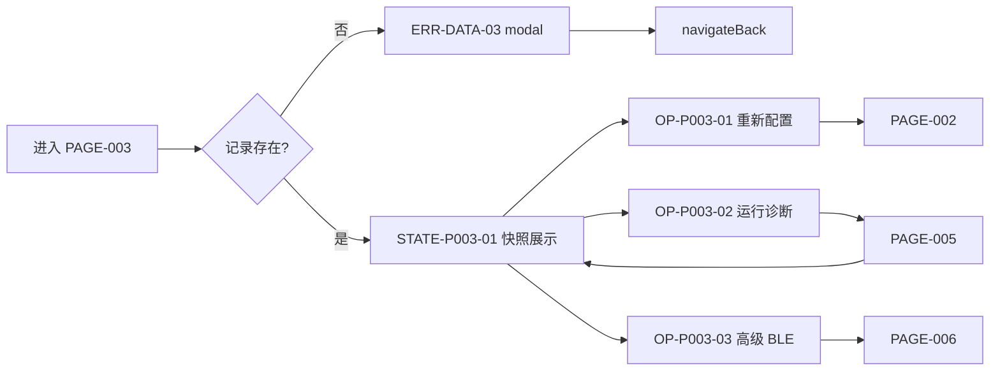

# PAGE-003 Smart HID 详情页目标规范

## 0. 文档元数据

```yaml
status: REVIEW
document_version: 1.0
owner: Smart BLE Product / Profile
last_reviewed: 2026-09-01
approved_by: null
supersedes: []
```

## 1. 页面目标与存在必要性

展示一台已配网 Smart HID 设备的**历史快照**，并提供三个出口动作：重新配置（→PAGE-002）、运行诊断（→PAGE-005）、高级 BLE 调试（→PAGE-006）。它是历史与实时操作之间的枢纽。

存在必要性：配网成功后的落点与重配/诊断的入口；没有它用户无法回到已配设备。

## 2. 用户角色与使用场景

- PER-03 赵哥：查看上次配置（3-3）、发起诊断（3-3）、换 Wi-Fi 重配（3-4）。
- PER-04：核对 device_id/protocol 用于 issue 报告。

## 3. 进入来源、路由参数、深链与冷启动

- 路由：`pages/hid/detail?deviceId=<enc>`；deviceId 必选。
- 来源：PAGE-001 紧凑入口/设备卡（强匹配时）、PAGE-004 列表、PAGE-002 成功、PAGE-005 返回。
- 记录不存在：modal 说明后 `navigateBack`（ERR-DATA-03）。
- 纯本地页：无 BLE、无网络；冷启动深链可用。

## 4. 信息架构与区块顺序

1. 标题区：设备名（或"Smart HID 设备"）；
2. 身份区：Device ID、协议版本、固件版本（缺失字段整行隐藏，DEC-014）；
3. 快照声明条："以下为上次成功配置的历史快照，不代表设备当前在线"（醒目、非脚注）；
4. 最近配置区：Wi-Fi SSID、ControlHub 地址、配置成功时间；
5. 动作区：重新配置（主动作）/ 运行诊断 / 高级 BLE 调试（折叠在"高级"分组，展开说明可发现条件）。

## 5. 首屏必须可见内容

设备名、Device ID、历史快照声明、三个动作（高级组可折叠但入口可见）。

## 6. 字段定义与数据来源

| 字段 | 类型 | 来源 | 说明 |
|---|---|---|---|
| name | string | DATA-006 | 可能缺失 |
| device_id | string | DATA-006 | 必有 |
| protocol | string | DATA-006 | 快照字段，样式弱化为普通文本（不做实时能力徽章） |
| firmware | string | DATA-006 | 可能缺失 |
| wifi_ssid | string | DATA-006 | 快照 |
| hub_host/port | string/int | DATA-006 | 快照 |
| configured_at | timestamp | DATA-006 | 本地时间戳 |

## 7. 完整操作表

| Operation ID | 控件/入口 | 显示条件 | 禁用条件 | 用户输入 | 调用链 | 成功反馈 | 失败反馈 | 跳转/返回 | 清理 | 测试 |
|---|---|---|---|---|---|---|---|---|---|---|
| OP-P003-01 | 重新配置 | 记录存在 | 无 | 无 | 设定 Profile 当前设备→PAGE-002 | — | — | →PAGE-002 | 无 | TEST-H-006 |
| OP-P003-02 | 运行诊断 | 记录存在 | 无 | 无 | →PAGE-005 | — | — | →PAGE-005 | 无 | TEST-P-005 |
| OP-P003-03 | 高级 BLE 调试 | 记录存在 | 无 | 无 | 构建设备上下文→PAGE-006 | — | — | →PAGE-006 | 无 | TEST-P-006 |
| OP-P003-04 | 返回 | — | — | 系统/按钮 | navigateBack | — | — | →来源页 | 无 | TEST-P-003 |

三个动作同携 deviceId，返回后上下文仍是本设备。

## 8. 完整状态表

| State ID | 状态名称 | 进入条件 | 页面内容 | 允许操作 | 退出条件 | 数据更新 | 测试 |
|---|---|---|---|---|---|---|---|
| STATE-P003-01 | 快照展示 | 记录存在 | 全部区块 | OP-01/02/03/04 | 离开 | 无（纯读） | TEST-P-003 |
| STATE-P003-02 | 记录不存在 | 查询无结果 | modal 说明 | 确认返回 | navigateBack | 无 | TEST-P-003 |

loading/empty/error 异常态仅 STATE-P003-02 一种；读取为本地同步无 loading 态（N/A+原因：本地 storage 同步读）。

## 9. 错误、空态和恢复动作

ERR-DATA-03 记录不存在（恢复：返回上一页）。字段缺失不是错误：隐藏行（DEC-014）。

## 10. 页面跳转与返回规则

出口见操作表；返回遵循 `04` 第 6 节（回来源页）。

## 11. Runtime / Web 调用链

```text
UI → composable（本地读 DATA-006）→ Store(hid knownDevices)
```

无 BLE Runtime 调用（N/A：纯本地快照页）。

## 12. 资源所有权与生命周期

无连接、无计时器、无订阅；仅本地读取（N/A 项全部有原因）。

## 13. 平台差异与降级

三平台一致（本地页）；无降级。

## 14. ESP32 / Smart HID / Release 依赖

Smart HID Profile 数据结构（DATA-006）；LightBLE 无关；发布随 DEC-006。

## 15. 安全、隐私和脱敏

不展示 token/密码（历史本就不含，SEC-007）；URL 仅 deviceId。

## 16. 性能、容量和超时

同步读 ≤50ms；渲染 ≤300ms。

## 17. 无障碍、文案和视觉规则

快照声明使用醒目样式（图标+文字，不只颜色）；协议字段弱化为文本避免被读作实时徽章；文案表 S-17~S-19。

## 18. 自动化测试映射

TEST-P-003（快照渲染、缺失字段隐藏、三动作跳转）。

## 19. 真机 / 发布测试映射

TEST-H-004（历史/详情链路）、TEST-W-010。E4 为主（本地页），链路验证 E5。

## 20. 公开声明与证据要求

本页不直接产生公开 CLAIM；作为 CLAIM-014 的组成链路。

## 21. 验收条件

- [x] 历史快照声明在首屏显著位置；
- [x] 缺失字段隐藏而非显示占位噪音；
- [x] 三动作同 deviceId 且返回上下文保持；
- [x] 无在线状态暗示。

## 22. 非目标与禁止行为

- 不显示在线绿点/心跳；
- 不自动刷新；
- 不把协议/固件字段渲染成实时能力徽章。

## 23. Mermaid 流程图 / 状态图



## 24. 关联 ID 与链接

REQ-052｜FEAT-060/064｜FLOW-011｜ERR-DATA-03｜DATA-006｜[`PAGE-002`](PAGE-002_HID_PROVISION.md)｜[`PAGE-005`](PAGE-005_HID_DIAGNOSTICS.md)｜[`PAGE-006`](PAGE-006_DEVICE_DETAIL.md)
