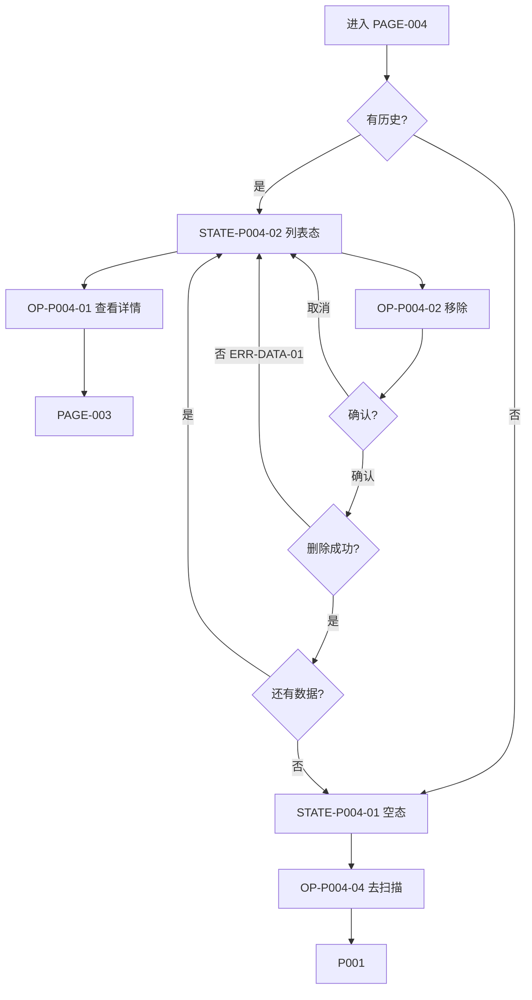

# PAGE-004 Smart HID 历史页目标规范

## 0. 文档元数据

```yaml
status: REVIEW
document_version: 1.0
owner: Smart BLE Product / Profile
last_reviewed: 2026-09-01
approved_by: null
supersedes: []
```

## 1. 页面目标与存在必要性

Smart HID 已配设备的**唯一完整列表**：查看、移除本机记录，并进入详情/重配/诊断。是 Smart HID 历史 SSOT 的 UI 面。

存在必要性：PAGE-001 只保留紧凑入口；完整列表、TTL 说明与移除管理必须有一个唯一宿主，避免两处列表互相漂移。

## 2. 用户角色与使用场景

- PER-03 赵哥：管理多台已配设备（3-3/3-4 前置）。
- PER-02 学习者：理解"历史 ≠ 在线"。

## 3. 进入来源、路由参数、深链与冷启动

- 路由：`pages/hid/history`，无参数。
- 来源：PAGE-001 "全部历史"（唯一入口）。
- 出口：PAGE-003（卡片）或空态去扫描（switchTab）。冷启动深链：纯本地页可用。

## 4. 信息架构与区块顺序

1. 标题"已配置设备" + 台数芯片；
2. 历史说明条："本地历史记录，非实时在线。READY 设备已关闭蓝牙广播，需重连请使用诊断或重新配置。"（含 90 天 TTL 说明）；
3. 设备卡列表（名称/ID/Wi-Fi/Hub/配置时间/移除）；
4. 空态（插图+说明+"去扫描"）。

## 5. 首屏必须可见内容

列表或空态其一 + 历史说明条（有数据时）。

## 6. 字段定义与数据来源

| 字段 | 类型 | 来源 |
|---|---|---|
| 台数 | int | DATA-006 计数 |
| 卡片字段 | 同 PAGE-003 快照 | DATA-006 |
| 配置时间 | timestamp→本地格式 | DATA-006 |

## 7. 完整操作表

| Operation ID | 控件/入口 | 显示条件 | 禁用条件 | 用户输入 | 调用链 | 成功反馈 | 失败反馈 | 跳转/返回 | 清理 | 测试 |
|---|---|---|---|---|---|---|---|---|---|---|
| OP-P004-01 | 卡片点击 | 列表态 | 无 | 无 | →PAGE-003 | — | — | →PAGE-003 | 无 | TEST-P-004 |
| OP-P004-02 | 移除按钮 | 列表态 | 无 | 确认框 | 删除 DATA-006 记录 | toast+列表更新 | ERR-DATA-01 toast | 无 | 无 | TEST-P-004、TEST-H-004 |
| OP-P004-03 | 确认框取消 | 移除确认中 | 无 | 无 | 关闭确认 | 无变化 | 无 | 无 | 无 | TEST-P-004 |
| OP-P004-04 | 空态去扫描 | 空态 | 无 | 无 | switchTab | — | — | →PAGE-001 | 无 | TEST-P-004 |
| OP-P004-05 | 返回 | — | — | 系统 | navigateBack | — | — | →PAGE-001 | 无 | TEST-P-004 |

移除语义：仅删除本机记录，不改变设备实际配置（确认框文案明示）。

## 8. 完整状态表

| State ID | 状态名称 | 进入条件 | 页面内容 | 允许操作 | 退出条件 | 数据更新 | 测试 |
|---|---|---|---|---|---|---|---|
| STATE-P004-01 | 空态 | 无历史 | 插图+说明+去扫描 | OP-04/05 | 有数据/离开 | 无 | TEST-P-004 |
| STATE-P004-02 | 列表态 | ≥1 条 | 标题+说明+卡片列表 | OP-01/02/05 | 移除至空/离开 | 移除即时更新 | TEST-P-004、TEST-H-004 |
| STATE-P004-03 | 移除确认 | OP-02 触发 | 确认框 | OP-03/确认 | 关闭或删除 | 删除时更新 | TEST-P-004 |

loading：N/A（本地同步读）；error：存储失败以 toast 呈现（ERR-DATA-01），不整页错误。

## 9. 错误、空态和恢复动作

ERR-DATA-01 存储/删除失败（恢复：重试一次或重启应用）；空态恢复=去扫描。

## 10. 页面跳转与返回规则

出口：→PAGE-003、→PAGE-001（空态/返回）。无其他出口。

## 11. Runtime / Web 调用链

```text
UI → composable（DATA-006 读写）→ Store(hid knownDevices)
```

无 BLE Runtime 调用（N/A：本地数据页）。

## 12. 资源所有权与生命周期

无连接/计时器/订阅；本地读取后即释放句柄。

## 13. 平台差异与降级

三平台一致；无降级。

## 14. ESP32 / Smart HID / Release 依赖

DATA-006 与 TTL 规则（FEAT-059）；发布随 DEC-006。

## 15. 安全、隐私和脱敏

记录本就不含 token/密码；移除即彻底删除本机数据（SEC-008 用户删除权）。

## 16. 性能、容量和超时

同步读 ≤50ms；上限 50 台（FEAT-059）；渲染 ≤300ms。

## 17. 无障碍、文案和视觉规则

历史说明条醒目；"在线"词汇禁止出现；卡片信息读屏可整卡朗读；文案表 S-20~S-22。

## 18. 自动化测试映射

TEST-P-004（空态/列表/移除/入口）、TEST-U-015（TTL/去重纯函数）。

## 19. 真机 / 发布测试映射

TEST-H-004（历史链路 E5）、TEST-W-010。

## 20. 公开声明与证据要求

组成 CLAIM-014 链路；本页无独立公开声明。

## 21. 验收条件

- [x] 是唯一完整列表（PAGE-001 仅有紧凑入口）；
- [x] 移除仅本机、有确认、有失败反馈；
- [x] TTL 与"非在线"说明可见；
- [x] 无在线绿点。

## 22. 非目标与禁止行为

- 不显示在线状态/绿点；
- 不做搜索/排序（记为 Could，不入首版）；
- 不删除设备端配置。

## 23. Mermaid 流程图 / 状态图



## 24. 关联 ID 与链接

REQ-052｜FEAT-016/059/060/061｜FLOW-011｜ERR-DATA-01｜DATA-006｜[`PAGE-001`](PAGE-001_SCAN.md)｜[`PAGE-003`](PAGE-003_HID_DETAIL.md)
