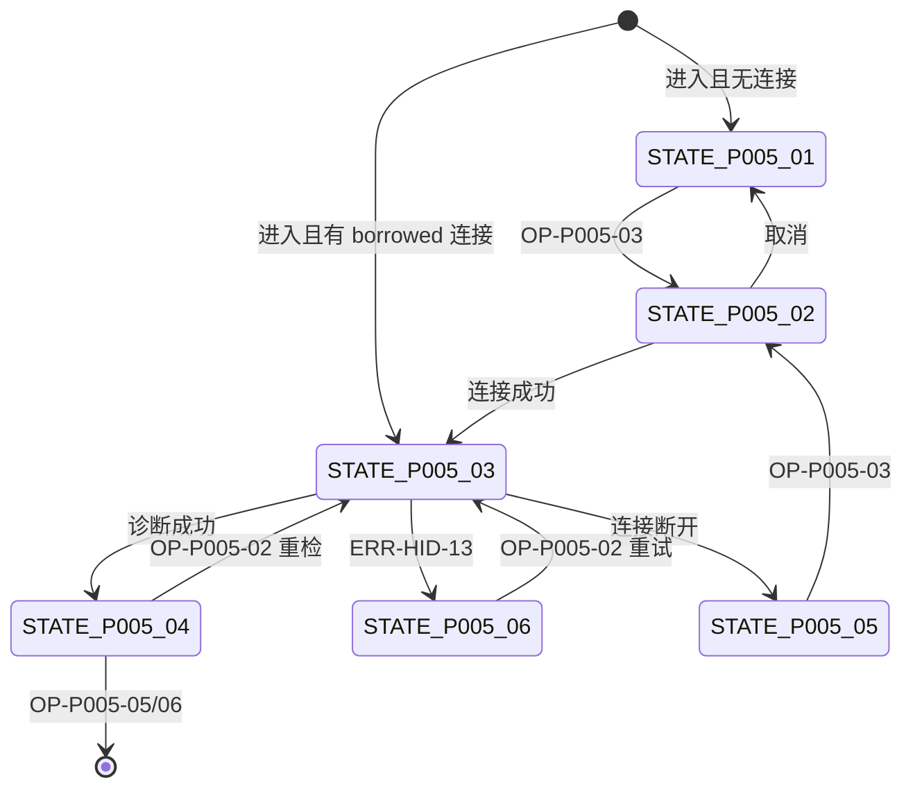

# PAGE-005 Smart HID 诊断页目标规范

## 0. 文档元数据

```yaml
status: REVIEW
document_version: 1.0
owner: Smart BLE Product / Profile
last_reviewed: 2026-09-01
approved_by: null
supersedes: []
```

## 1. 页面目标与存在必要性

对一台 Smart HID 设备执行五项实时诊断（BLE / Wi-Fi / ControlHub / 控制连接 / Ready），以设备真实应答区分"未检测/检测中/实时结果/离线/失败"，并以 owned/borrowed 会话语义安全复用连接。

存在必要性：`mqtt_invalid` 等错误的恢复出口、离线设备排查（场景 3-3）的唯一工具页。

## 2. 用户角色与使用场景

- PER-03 赵哥：设备无响应时诊断（3-3）、诊断后转入重配（3-4 变体）。
- PER-04：作为 Profile 诊断能力参考。

## 3. 进入来源、路由参数、深链与冷启动

- 路由：`pages/hid/diagnostics?deviceId=<enc>`；必选参数。
- 来源：PAGE-003 运行诊断、PAGE-002 错误恢复（mqtt_invalid）。
- 冷启动深链：允许进入；无连接时呈现离线态与连接引导。
- 进入时清空上一次诊断残留（onLoad 重置）。

## 4. 信息架构与区块顺序

1. 当前状态芯片（尚未检测/已连接可检测/正在读取/实时完成/未连接/检测失败）；
2. 读取时间戳（"数据于 HH:MM:SS 读取"）；
3. 五行固定诊断项（顺序固定：BLE、Wi-Fi、ControlHub、控制连接、Ready），每项状态：pending/ok/fail/unknown；
4. 操作区：重新检测、未连接时"连接设备"；
5. 错误详情折叠区（错误码+消息）；
6. 底部：返回设备详情、重新配网（带 READY 警告确认）。

## 5. 首屏必须可见内容

当前状态芯片、五项诊断（pending 也可见且视觉上明显"未检测"）、重新检测按钮。

## 6. 字段定义与数据来源

| 字段 | 类型 | 来源 |
|---|---|---|
| 诊断项状态 ×5 | enum(pending/ok/fail/unknown) | SmartHidService.diagnose() 实时 |
| 读取时间 | timestamp | 每次完成更新 |
| lastError | {code,message} | 诊断失败记录 |
| 会话所有权 | enum(owned/borrowed) | Registry 查询 |

## 7. 完整操作表

| Operation ID | 控件/入口 | 显示条件 | 禁用条件 | 用户输入 | 调用链 | 成功反馈 | 失败反馈 | 跳转/返回 | 清理 | 测试 |
|---|---|---|---|---|---|---|---|---|---|---|
| OP-P005-01 | 进入自动诊断 | 进入页面且已有可用连接（borrowed） | 无 | 无 | diagnose() 一次 | 五项刷新+时间戳 | ERR-HID-13 | 无 | 无（borrowed 不动连接） | TEST-P-005、TEST-H-005 |
| OP-P005-02 | 重新检测 | 页面可见 | 检测中 | 无 | diagnose() | 同上 | 同上 | 无 | 同上 | TEST-H-005 |
| OP-P005-03 | 连接设备（确认） | 离线态 | 检测中/连接中 | 确认框 | connect（owned）→diagnose() | 进入检测 | ERR-CONN-01 | 无 | owned 连接离页断开 | TEST-H-005 |
| OP-P005-04 | 显示/隐藏错误码 | 有 lastError | 无 | 无 | 本地切换 | 折叠区展开 | 无 | 无 | 无 | TEST-P-005 |
| OP-P005-05 | 返回设备详情 | 页面可见 | 检测中可选禁用 | 无 | navigateBack（栈感知，无栈则 redirectTo 详情） | — | — | →PAGE-003 | owned 清理 | TEST-P-005 |
| OP-P005-06 | 重新配网 | 页面可见 | 检测中 | READY 设备警告确认 | 设定上下文→PAGE-002 | — | — | →PAGE-002 | owned 清理 | TEST-H-006 |

进入自动诊断一次是目标（REQ-053）；若进入时无连接，不自动发起连接，先呈现离线态（避免意外占用蓝牙）。

## 8. 完整状态表

| State ID | 状态名称 | 进入条件 | 页面内容 | 允许操作 | 退出条件 | 数据更新 | 测试 |
|---|---|---|---|---|---|---|---|
| STATE-P005-01 | 尚未检测 | 进入且无可用连接 | 芯片"未连接，需重连设备" | OP-03/05/06 | 连接成功 | 五项 pending | TEST-P-005 |
| STATE-P005-02 | 连接确认 | OP-03 弹确认 | 确认框 | 确认/取消 | 成功→03 | 无 | TEST-H-005 |
| STATE-P005-03 | 检测中 | diagnose 运行 | 芯片"正在读取"+逐项 spinner | OP-05（可禁用） | 完成/失败 | 逐项更新 | TEST-H-005 |
| STATE-P005-04 | 实时完成 | 诊断成功 | 五项结果+时间戳 | OP-02/04/05/06 | 重新检测 | 全量更新 | TEST-H-005 |
| STATE-P005-05 | 未连接离线 | 诊断中连接断开 | 芯片"连接已断开" | OP-03/05/06 | 重连 | 保留上次结果并标注时间 | TEST-H-005 |
| STATE-P005-06 | 检测失败 | diagnose 抛错 | 芯片"检测失败"+错误折叠 | OP-02/04/05 | 重试成功 | lastError | TEST-P-005 |

## 9. 错误、空态和恢复动作

ERR-HID-13 诊断失败（恢复：重试）；ERR-CONN-01 连接失败（恢复：重试/回详情）；离线态（恢复：连接设备）。Pending ≠ OK：pending 视觉必须与 ok 显著不同（灰+图标）。

## 10. 页面跳转与返回规则

→PAGE-003（返回）、→PAGE-002（重配）。返回栈感知：来源是 PAGE-002 时返回改为 redirectTo PAGE-003（避免回到已完成配网页）。

## 11. Runtime / Web 调用链

```text
UI → composable use-hid-diagnostics
→ SmartHidService.connect(可选)/diagnose
→ BLE Runtime（读 INFO/STATUS、订阅）
```

## 12. 资源所有权与生命周期

| 资源 | 所有者 | 释放 |
|---|---|---|
| owned 连接 | 本页诊断服务 | 离页断开 |
| borrowed 连接 | 原 Owner（如 PAGE-006/Registry） | 本页离页不动 |
| 诊断订阅 | 诊断服务 | 完成或离页退订 |

## 13. 平台差异与降级

App/微信一致；H5 不可达。

## 14. ESP32 / Smart HID / Release 依赖

依赖 Smart HID 固件处于可连接模式（READY 设备需恢复模式）；LightBLE 不适用（N/A：非本夹具协议）。发布随 DEC-006。

## 15. 安全、隐私和脱敏

诊断读取不含凭据字段；错误消息经脱敏（SEC-005）。

## 16. 性能、容量和超时

单项 ≤10s，全轮 ≤30s；页面进入 ≤500ms。

## 17. 无障碍、文案和视觉规则

五项结果每项文字标签（ok/fail/pending 有图标+文字+颜色三通道）；时间戳可读屏；文案表 S-23~S-26。

## 18. 自动化测试映射

TEST-P-005（状态/自动诊断/所有权展示）、TEST-I-009（owned/borrowed）。

## 19. 真机 / 发布测试映射

TEST-H-005（诊断 E5）、TEST-H-006（重配移交 E5）、TEST-W-010。

## 20. 公开声明与证据要求

组成 CLAIM-014 链路；诊断能力公开状态随 DEC-006。

## 21. 验收条件

- 进入自动诊断一次（有连接时）；
- Pending 与 OK 视觉与语义严格区分；
- 读取时间戳存在；
- owned/borrowed 离页行为正确；
- 重配前有 READY 警告。

## 22. 非目标与禁止行为

- 不常驻轮询；
- 不修改设备配置（除重配跳转）；
- 不把离线设备显示为"全部正常"。

## 23. Mermaid 流程图 / 状态图



## 24. 关联 ID 与链接

REQ-053｜FEAT-062/063/064｜FLOW-011｜ERR-HID-13、ERR-CONN-01｜PROTO-005｜[`PAGE-003`](PAGE-003_HID_DETAIL.md)｜[`PAGE-002`](PAGE-002_HID_PROVISION.md)｜[`10 Runtime`](../10_RUNTIME_ARCHITECTURE_AND_RESOURCE_OWNERSHIP.md)
