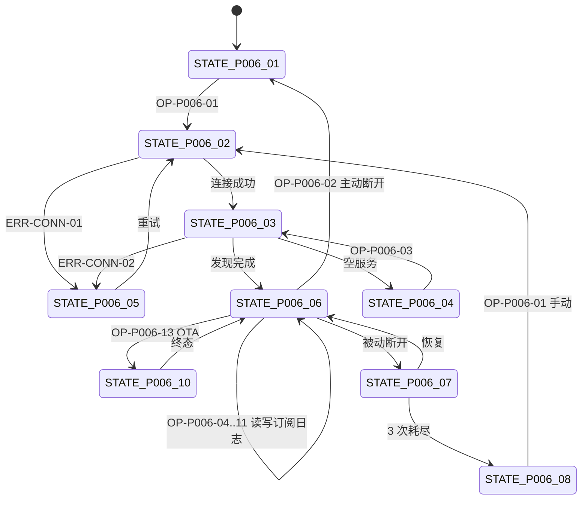

# PAGE-006 通用设备详情页目标规范

## 0. 文档元数据

```yaml
status: APPROVED
document_version: 1.0
owner: Smart BLE Product / Engineering
last_reviewed: 2026-09-01
approved_by: user
supersedes: []
```

## 1. 页面目标与存在必要性

任意 BLE 设备的调试工作台：设备身份与连接状态、服务/特征树、Read/Write（TEXT/HEX）、Characteristic Subscription（Notify/Indicate 统一订阅，DEC-017）、按设备通信日志、OTA 完整事务（含固件包校验）。是 CONN/GATT/LOG/OTA 四组功能（FEAT-020~052、FEAT-081）的唯一宿主。

存在必要性：没有它产品只是扫描器；它是"手机上的 BLE 万用表"核心。

## 2. 用户角色与使用场景

- PER-01 陈工：验证 GATT/权限组合（1-2）、OTA（1-3）、双机隔离（1-4 前置）。
- PER-02 林同学：观察 Notify 推送（2-3）。
- PER-03 赵哥：高级 BLE 调试 SHID 设备（经 PAGE-003）。

## 3. 进入来源、路由参数、深链与冷启动

- 路由：`pages/device/detail?deviceId=<必选>&name=<可选>&rssi=<可选>&profileId=<可选>`。
- 来源：PAGE-001 连接、PAGE-007 卡片（复用会话）、PAGE-003 高级 BLE。
- 设备上下文：进程内 stash 补全（上限 30 条，`10` 第 6 节）；冷启动深链仅身份字段，页面提示可回扫描页获得完整体验；缺 deviceId → modal 返回（ERR-SYS-02）。

## 4. 信息架构与区块顺序

1. 标题区：设备名 + 连接状态点（当前状态文字）+ deviceId；
2. 操作行：清空日志 / 导出日志 / 连接-断开；
3. 服务面板（五态：idle/connecting/empty/error/ready）：服务→特征树，每特征属性标记与操作（读/写/订阅）；
4. 通信日志面板：时间/方向/类型/HEX/TEXT/操作 ID；
5. 写入弹窗（TEXT/HEX 模式切换）；
6. OTA 弹窗（文件选择→进度→结果）；
7. 主动作按钮区（连接/断开；有 OTA 服务且达标时显示"固件更新"）。

## 5. 首屏必须可见内容

设备名与连接状态、deviceId、主操作（连接/断开）、服务面板当前状态。

## 6. 字段定义与数据来源

| 字段 | 类型 | 来源 |
|---|---|---|
| 连接状态 | STATE-P006-01..09 | 会话 |
| 服务树 | Service[]→Characteristic[] | 服务发现（属性位） |
| 特征值（读/写/推送） | bytes→HEX/TEXT | GATT 操作 |
| 日志条目 | DATA-005 | Logger（按设备） |
| OTA 进度/状态 | STATE-OTA-* | OTA 事务（PROTO-003） |
| firmware_version | string | Device Info JSON（PROTO-004） |

## 7. 完整操作表

| Operation ID | 控件/入口 | 显示条件 | 禁用条件 | 用户输入 | 调用链 | 成功反馈 | 失败反馈 | 跳转/返回 | 清理 | 测试 |
|---|---|---|---|---|---|---|---|---|---|---|
| OP-P006-01 | 连接 | 未连接 | 连接中 | 无 | use-device-session.connect（attempt 去重） | 服务面板 ready | ERR-CONN-01+重试 | 无 | 失败关半开连接 | TEST-I-003、TEST-A-006 |
| OP-P006-02 | 主动断开 | 已连接 | 无 | 无 | disconnect(主动标记，不重连) | 状态=已断开，Registry 更新 | ERR-CONN-04 记日志 | 无 | 会话注销 | TEST-A-007、TEST-E-002 |
| OP-P006-03 | 服务发现重试 | empty/error 态 | 发现中 | 无 | 重新 discoverServices | ready | ERR-CONN-02/03 | 无 | 失败关连接 | TEST-I-003、TEST-E-005 |
| OP-P006-04 | Read | 特征可读 | 操作中 | 无 | readValue(3s 超时) | 值展示+日志 | ERR-GATT-01 | 无 | 一次性 listener 移除 | TEST-A-008、TEST-E-003 |
| OP-P006-05 | TEXT 写 | 特征可写 | 队列满 | 文本 | encodeWritePayload(text) UTF-8 | 设备响应+日志 | ERR-GATT-04 | 无 | 队列出队 | TEST-A-008、TEST-E-003 |
| OP-P006-06 | HEX 写 | 特征可写 | 队列满 | HEX 串 | 严格偶数+字符校验→字节 | 同上 | 非法输入 ERR-GATT-03（不发 API）；失败 ERR-GATT-04 | 无 | 同上 | TEST-U-010、TEST-A-008 |
| OP-P006-07 | 开启订阅（Characteristic Subscription，DEC-017） | 特征含 notify 和/或 indicate（属性标记显示 Notify / Indicate / Notify + Indicate） | 订阅中 | 无 | Runtime 按平台能力启用 Characteristic Value Change | 推送流+日志；Registry subscription_count +1 | ERR-GATT-07 | 无 | 关闭时远程+本地双关 | TEST-I-005、TEST-A-008、TEST-E-004 |
| OP-P006-08 | 关闭订阅 | 已订阅 | 无 | 无 | setNotifyEnabled(false)（远程+本地双断） | 推送停止；subscription_count −1 | 同上 | 无 | 退订+UI 摘除 | TEST-I-005 |
| OP-P006-09 | ~~Indicate 开/关~~（已废弃，TP-G0-R1） | — | — | — | DEC-017 统一订阅语义：Notify 与 Indicate 共用 OP-07/08，无独立操作 | — | — | — | — | — |
| OP-P006-10 | 清空日志 | 页面可见 | 无 | 无 | logger.clear(deviceId) | toast+面板清空 | 无 | 无 | 无 | TEST-P-006 |
| OP-P006-11 | 导出日志 | 页面可见 | 无 | 无 | 脱敏→格式化→导出/复制 | 导出成功 | 空日志提示；失败 ERR-DATA-02 | 无 | 文件句柄关闭 | TEST-W-008、TEST-U-012 |
| OP-P006-12 | 选择 OTA 固件包 | 有 OTA 服务且入口达标（REQ-046/DEC-001） | OTA 进行中 | 固件包（manifest.json+firmware.bin，PROTO-011） | FEAT-081 六项校验（格式/target/hardware/version/size/SHA256） | 显示 target/硬件/目标版本/SHA 摘要 | ERR-OTA-01（读取失败）、ERR-OTA-09..13（包校验失败，不进入事务） | 无 | 无 | TEST-U-016、TEST-I-010、TEST-A-011、TEST-E-007 |
| OP-P006-13 | 开始 OTA | 包校验通过 | 无 | 无 | OTA 事务（第 0 步后 10 步正典，`12`；start 携带 target/sha256） | 进度→success→版本一致=成功 | ERR-OTA-02..08 | 无 | 事务资源释放 | TEST-I-008、TEST-A-011、TEST-E-007 |
| OP-P006-14 | 取消 OTA | OTA 进行中 | 无 | 无 | CTRL abort→设备回 idle | 取消完成回就绪 | ERR-OTA-07 兜底断开 | 无 | 同上 | TEST-E-007 |
| OP-P006-15 | 返回 | — | OTA 进行中需确认 | 系统 | navigateBack | — | — | →来源页 | 页面级订阅摘除（会话保留，DEC-009） | TEST-P-006 |

订阅语义（DEC-017）：用户操作统一为"开启订阅/关闭订阅"；App 声明"收到 Characteristic Value Change"，不承诺"已收到 Indication Confirm"（仅平台 API 明确暴露 ATT indication confirmation 时才可展示底层 ACK）。从 PAGE-007 返回本页时，订阅开关按 Session 实际订阅状态恢复（subscription_count 联动，`10` 3.3）。

## 8. 完整状态表

| State ID | 状态名称 | 进入条件 | 页面内容 | 允许操作 | 退出条件 | 数据更新 | 测试 |
|---|---|---|---|---|---|---|---|
| STATE-P006-01 | 初始化 | 进入未连接 | 身份+连接按钮 | OP-01 | 连接发起 | 无 | TEST-P-006 |
| STATE-P006-02 | 连接中 | attempt 进行 | 状态"连接中" | 无（可返回） | 成功/失败/超时 | 无 | TEST-A-006 |
| STATE-P006-03 | 服务加载中 | 连接成功发现中 | 树骨架/spinner | 无 | ready/empty/error | 无 | TEST-A-006 |
| STATE-P006-04 | 空服务 | 发现结果空 | "设备未暴露服务"+重试 | OP-03 | 重试 | 无 | TEST-I-003 |
| STATE-P006-05 | 连接失败 | attempt 失败/超时 | 错误+重试 | OP-01 | 成功 | lastError | TEST-A-006 |
| STATE-P006-06 | 已连接 | ready | 完整树+操作 | OP-02/04..14 | 断开 | 日志持续 | TEST-A-006、TEST-E-003 |
| STATE-P006-07 | 重连中 | 被动断开重试 | "重连中 n/3" | 取消重连 | 恢复/耗尽 | 会话保留 | TEST-A-007 |
| STATE-P006-08 | 重连耗尽 | 3 次失败 | 终态+手动重试 | OP-01 | 手动成功 | 无 | TEST-I-003 |
| STATE-P006-09 | 操作失败 | 读/写/订阅失败 | 面板内错误+该操作重试 | 对应重试 | 成功 | 日志记录错误 | TEST-A-008 |
| STATE-P006-10 | OTA 组态 | OTA 弹窗打开 | 见 STATE-OTA-01..10（`07`） | OP-13/14 | 终态 | 事务状态 | TEST-E-007 |

## 9. 错误、空态和恢复动作

ERR-CONN-01 连接失败（重试）、ERR-CONN-02 发现失败（重试/断开重连）、ERR-CONN-03 空服务（重试）、ERR-CONN-04 断开失败（记日志+本地清理）、ERR-CONN-05 重连耗尽（手动重试）、ERR-GATT-01 读失败（重试）、ERR-GATT-02 属性不允许（按钮禁用+说明）、ERR-GATT-03 编码非法（表单内修正）、ERR-GATT-04 写失败（重试）、ERR-GATT-05 MTU 失败（保守分包继续）、ERR-GATT-07 订阅失败（重试）、ERR-OTA-01..13（`07` 详表；09..13 为包校验，事务前拦截）、ERR-DATA-02 导出失败。空态：空服务（STATE-P006-04）；日志空面板说明。

## 10. 页面跳转与返回规则

来源页返回；离开页面会话保留（应用级），页面级订阅按 DEC-009（推荐保留用户订阅，见决策）。OTA 进行中返回需确认。

## 11. Runtime / Web 调用链

```text
UI(树/日志/弹窗)
→ composables use-device-session / use-notify-toggle
→ Store(ble sessions) + ConnectedSessionRegistry
→ BLE Runtime：connect/discover/read/write/setNotify（tuple 路由、write 队列、MTU）
→ OtaManager（独立事务状态机）
→ 平台 API
```

## 12. 资源所有权与生命周期

| 资源 | 所有者 | 释放 |
|---|---|---|
| 会话 | Registry（应用级） | 断开/移除 |
| Characteristic Subscription（用户开启，DEC-017 统一订阅） | 会话（DEC-009 推荐随会话保留；计入 subscription_count） | 会话销毁或用户关闭 |
| 读超时 listener | Runtime 单次操作 | 完成/超时 |
| 写队列 | Runtime | 排空/清空 |
| OTA 事务 | OtaManager | 终态 |
| 文件句柄 | OTA | 读毕/取消 |
| 页面 UI 订阅 | 页面 | unload 摘除 |

## 13. 平台差异与降级

App/微信同语义；微信文件选择与导出方式差异；H5 不可达。

## 14. ESP32 / Smart HID / Release 依赖

- LightBLE：三组服务是主要 E5 对象（TEST-E-002..007）；LED 命令与权限组合是标准用例。
- Smart HID：设备也可经本页通用调试（Profile 不排斥 GATT）。
- Release：CLAIM-006/007/008/010（GATT/日志/OTA）证据宿主；OTA 入口受 DEC-001 约束。

## 15. 安全、隐私和脱敏

日志写入与导出双段脱敏（FEAT-040）；URL 无敏感字段；OTA 文件仅本地处理。

## 16. 性能、容量和超时

连接 ≤10s；发现 ≤10s；读 ≤3s；写 ≤5s；订阅 ≤5s；日志 200 条/设备；写队列深度 16；OTA 阈值见 NFR-014。

## 17. 无障碍、文案和视觉规则

属性标记用图标+缩写文字；状态点附文字；日志行可复制；弹窗焦点管理（`17`）；文案表 S-27~S-33。

## 18. 自动化测试映射

TEST-P-006（页面）、TEST-U-009..014（编解码/队列/预算/日志）、TEST-I-003/004/005/008（连接/GATT/订阅/OTA）。

## 19. 真机 / 发布测试映射

TEST-A-006..011（Android 全操作）、TEST-W-007/008（微信）、TEST-E-002..007（夹具与故障注入）。OTA 发布门槛见 REQ-046/DEC-001。

## 20. 公开声明与证据要求

CLAIM-006"连接与 GATT 读写"（EVID-001/002/003）、CLAIM-008"通信日志"、CLAIM-010"OTA"（须 TEST-E-007+A/W 对应用例全过，否则 BLOCKED/PREVIEW，且入口隐藏）。

## 21. 验收条件

- 服务树五态与 15 操作齐备；
- HEX 严格校验先于 API；
- Notify 关闭双断（远程+本地）；
- 用户订阅属会话不属页面；
- 主动断开即移出 Registry；
- OTA 仅在 10 步全过（含版本一致）才显示成功。

## 22. 非目标与禁止行为

- 不做云端设备管理；
- OTA 未达标时隐藏/BLOCKED 入口（不显示假按钮）；
- 不绕过属性校验发送操作；
- 不把写完字节当作 OTA 成功。

## 23. Mermaid 流程图 / 状态图



## 24. 关联 ID 与链接

REQ-019~029、REQ-034~037、REQ-043~046｜FEAT-020~040、FEAT-046~052｜FLOW-004/005/006/009｜PROTO-001..004｜[`07 状态与错误`](../07_INTERACTION_STATE_AND_ERROR_MODEL.md)｜[`11 BLE/GATT 契约`](../11_BLE_GATT_PROTOCOL_CONTRACT.md)｜[`12 ESP32 契约`](../12_ESP32_FIXTURE_CONTRACT.md)
