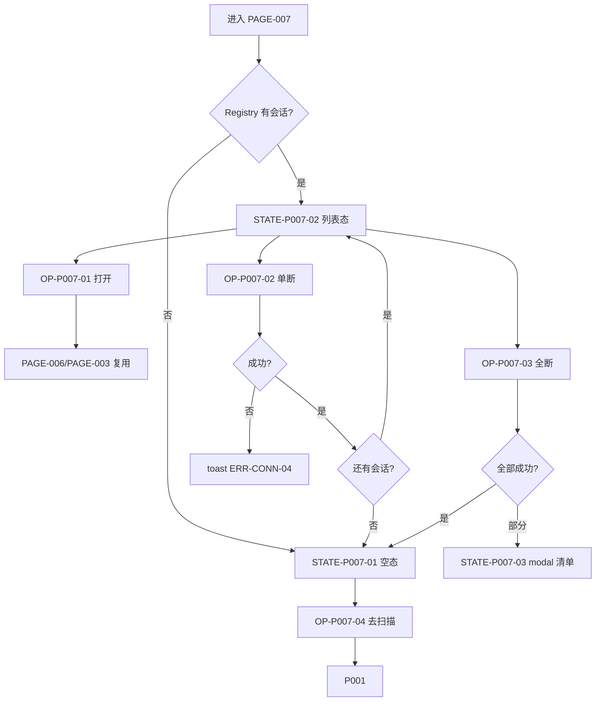

# PAGE-007 已连接页目标规范

## 0. 文档元数据

```yaml
status: APPROVED
document_version: 1.0
owner: Smart BLE Product / Engineering
last_reviewed: 2026-09-01
approved_by: user
supersedes: []
```

## 1. 页面目标与存在必要性

展示并管理**当前活动会话**（应用级 Session Registry 的 UI 面）：打开（复用连接）、单台断开、全部断开、重连进度；空态引导回扫描页。

存在必要性：多设备并行的管理中枢；没有它用户无法知道"还连着谁"。

## 2. 用户角色与使用场景

- PER-01 陈工：双设备并行（1-4）、批量收尾。
- PER-03：确认配网连接不混入（口径清晰）。

## 3. 进入来源、路由参数、深链与冷启动

- 路由：`pages/connected/index`，Tab，无参数。
- 来源：Tab 切换。无下级页面（出口为 PAGE-003/006）。
- 冷启动：会话随应用存在；Tab 可直接进入。

## 4. 信息架构与区块顺序

1. 导航"已连接设备"；
2. 摘要区（>1 台时）："N 台设备保持连接" + "全部断开"；
3. 列表：设备卡（名称/ID/meta 按 Profile/**活动订阅徽标"订阅中 N"**/断开按钮/点击打开）；
4. 空态：说明（"从扫描页连接设备后在此管理"）+ 去扫描；若 Smart HID 配网连接进行中，附加提示"Smart HID 配网连接进行中…"（不把配网会话列为可断开条目）。

## 5. 首屏必须可见内容

活动会话列表或空态；多台时的批量断开。

## 6. 字段定义与数据来源

| 字段 | 类型 | 来源 |
|---|---|---|
| 活动会话列表 | Session[] | Registry（仅 connected） |
| 台数 N | int | 同上 |
| 活动订阅数 subscription_count | int（每会话，= notifySubscriptions.size） | Session Registry（唯一来源，`09` DATA-003；0 时不显示徽标，>0 显示"订阅中 N"） |
| 重连进度 | "n/3" | 会话重连计数 |
| Profile meta | string | Profile 注册表 |
| 配网进行中标志 | bool | SmartHidWorkflow 状态 |

口径（唯一）：列表=Registry 中 connected 会话，**排除配网内部会话**（属 PAGE-002 内部所有权）；扫描页"N 已连接"计数与本页同源同口径。

订阅可见性（TP-G0-R1，DEC-009/017 联动）：用户开启的订阅随会话保留（DEC-009），因此本页每张活动会话卡提供活动订阅数量——`subscription_count` 来自 Session Registry；为 0 时不显示额外徽标；>0 时显示"订阅中 N"（例如"订阅中 2"，或"Notify × 2"形态由 `17` 文案表定稿）。目标：用户离开 PAGE-006 后仍知道 App 是否持续监听设备。点击设备卡进入 PAGE-006 后，订阅开关按实际订阅状态恢复。

## 7. 完整操作表

| Operation ID | 控件/入口 | 显示条件 | 禁用条件 | 用户输入 | 调用链 | 成功反馈 | 失败反馈 | 跳转/返回 | 清理 | 测试 |
|---|---|---|---|---|---|---|---|---|---|---|
| OP-P007-01 | 卡片点击 | 列表态 | 无 | 无 | 按 Profile 路由携稳定身份 | 打开 PAGE-006/003 且复用会话 | 会话恰失效→走连接流程 | →PAGE-006/003 | 无 | TEST-I-006、TEST-A-009 |
| OP-P007-02 | 单独断开 | 列表态 | 断开中 | 无 | 统一断开入口（含 Smart HID service 通知）→Registry 移除 | toast+条目消失 | ERR-CONN-04 toast | 无 | 会话注销+订阅清理 | TEST-A-007、TEST-W-008 |
| OP-P007-03 | 全部断开 | N>1 | 执行中 | 无 | 对全部会话统一断开（同一入口，含 HID；allSettled） | toast 汇总 | 部分失败 modal 列出失败设备 | 无 | 同上逐台 | TEST-W-009、TEST-A-009 |
| OP-P007-04 | 空态去扫描 | 空态 | 无 | 无 | switchTab | — | — | →PAGE-001 | 无 | TEST-P-007 |
| OP-P007-05 | 查看重连进度 | 重连中条目 | 无 | 无 | 展示型（无点击链路） | 条目显示"重连中 n/3" | — | 无 | 无 | TEST-P-007 |

单断与全断必须走**同一断开服务入口**（对 Smart HID 会话的处理一致），消除两条路径行为差异。

## 8. 完整状态表

| State ID | 状态名称 | 进入条件 | 页面内容 | 允许操作 | 退出条件 | 数据更新 | 测试 |
|---|---|---|---|---|---|---|---|
| STATE-P007-01 | 空态 | Registry 空 | 引导+去扫描（+配网提示可选） | OP-04 | 有会话 | 无 | TEST-P-007 |
| STATE-P007-02 | 列表态 | ≥1 会话 | 摘要+卡片 | OP-01/02/03 | 断开至空/打开 | 联动 Registry | TEST-A-009、TEST-W-009 |
| STATE-P007-03 | 部分失败 | 批量断开部分失败 | modal 失败清单 | 关闭 modal | 确认 | 保留失败条目 | TEST-W-009 |

loading：断开执行中按钮级 loading（无全局遮罩）；error 见 OP-02/03。

## 9. 错误、空态和恢复动作

ERR-CONN-04 断开失败（单台 toast/批量 modal；恢复：重试断开）。空态恢复=去扫描。

## 10. 页面跳转与返回规则

→PAGE-006（通用卡）、→PAGE-003（smart-hid 卡）、→PAGE-001（空态）。Tab 无返回。

## 11. Runtime / Web 调用链

```text
UI → Store(connected 列表投影) → ConnectedSessionRegistry
断开 → DisconnectService（统一入口）→ BLE Runtime / SmartHidService
```

## 12. 资源所有权与生命周期

本页零持有：全部资源归 Registry/Owner；页面仅投影与触发（`10` 矩阵本页行全部"无"）。

## 13. 平台差异与降级

App/微信一致；H5 永远空态+引导（UNSUPPORTED 语义）。

## 14. ESP32 / Smart HID / Release 依赖

- ESP32：断开后夹具连接计数下降是 E5 断言（TEST-E-002）。
- Smart HID：配网会话的排除口径；统一断开入口含 HID service。
- Release：CLAIM-009"多设备会话"证据宿主。

## 15. 安全、隐私和脱敏

卡片仅身份字段；无敏感内容。

## 16. 性能、容量和超时

列表联动 ≤500ms；断开 ≤3s/台；上限 DEC-008。

## 17. 无障碍、文案和视觉规则

文案只能写"当前已连接"，禁止"连接稳定"等无健康指标词；批量断开有确认；文案表 S-34~S-36。

## 18. 自动化测试映射

TEST-P-007（空态/列表/断开）、TEST-I-006（Registry 联动与统一断开）。

## 19. 真机 / 发布测试映射

TEST-A-007/009、TEST-W-008/009、TEST-E-002。

## 20. 公开声明与证据要求

CLAIM-009"多设备会话管理"：VERIFIED 前提=TEST-A-009+TEST-W-009+EVID-001/002。

## 21. 验收条件

- 只显示活动会话（配网会话排除且口径唯一）；
- 单断/全断同入口同语义；
- 复用连接打开；
- 多设备隔离与部分失败呈现；
- 活动订阅徽标"订阅中 N"与 Registry subscription_count 一致（0 不显示）；
- 无健康指标词汇。

## 22. 非目标与禁止行为

- 不显示扫描结果；
- 不显示"稳定/健康"类无证据词；
- 不提供无限重连；
- 不在此页修改设备。

## 23. Mermaid 流程图 / 状态图



## 24. 关联 ID 与链接

REQ-022/023/029/030~033｜FEAT-023/031/033/034/035｜FLOW-006/007｜ERR-CONN-04｜[`10 Runtime`](../10_RUNTIME_ARCHITECTURE_AND_RESOURCE_OWNERSHIP.md)｜[`PAGE-006`](PAGE-006_DEVICE_DETAIL.md)
