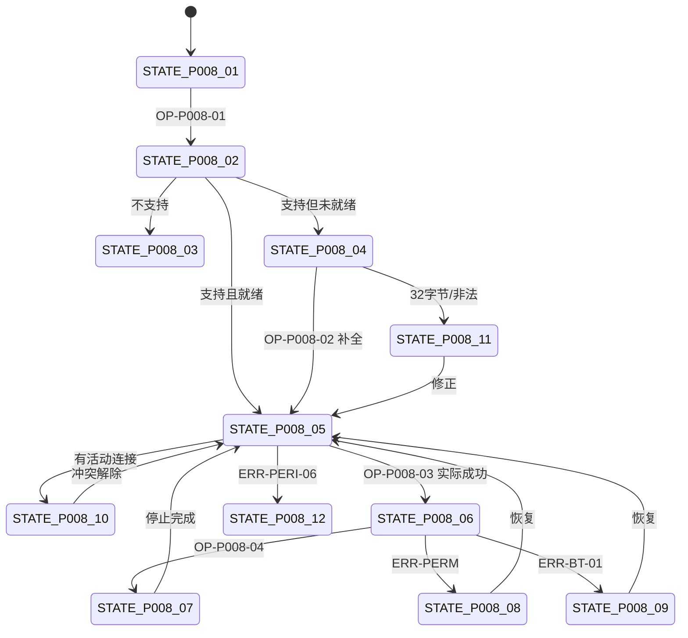

# PAGE-008 广播页目标规范

## 0. 文档元数据

```yaml
status: REVIEW
document_version: 1.0
owner: Smart BLE Product / Engineering
last_reviewed: 2026-09-01
approved_by: null
supersedes: []
```

## 1. 页面目标与存在必要性

让手机作为 Peripheral 发出**可控、可预算、可验证**的广播：真实可控字段与系统接管字段分列、31/32 字节预算、Central/Peripheral 单一 Owner 与活动连接保护，并以 ESP32 Observer 观测流作为正式证据。

存在必要性：广播编码是 BLE 学习核心场景（场景 2-2）；没有它产品少了"手机当设备"的半边。

## 2. 用户角色与使用场景

- PER-02 林同学：31 字节实验 + Observer 观察（2-2）。
- PER-01 陈工：验证自家 Central 端解析（用本页构造 payload）。

## 3. 进入来源、路由参数、深链与冷启动

- 路由：`pages/broadcast/index`，Tab，无参数。
- 无下级页面。冷启动直接进入；进入即执行能力检查（FEAT-041）。

## 4. 信息架构与区块顺序

1. 平台与支持状态区（含 H5 UNSUPPORTED、插件缺失检测）；
2. Payload 字段区：设备名称（标注系统接管规则，DEC-004）、本地名、Service UUID、厂商 ID、厂商数据、平台专属开关（App：模式/发射功率/可连接/包含设备名；微信：按 API 集）；
3. 字节预算区："预计 xx/31 字节"实时计算（单一算法 SSOT）；
4. 控制区：检查支持 / 开始 / 停止；
5. 操作日志区（可清空）：启停、错误、Observer 校验提示；
6. Observer 证据提示条："用 ESP32 Observer 固件验证广播内容"。

## 5. 首屏必须可见内容

支持状态、payload 核心字段、字节预算、开始/停止控制。

## 6. 字段定义与数据来源

| 字段 | 类型 | 来源 | 接管说明 |
|---|---|---|---|
| 支持状态 | STATE-P008-* | 能力探测 | — |
| 设备名称 | string | 用户输入 | Android 可能被系统蓝牙名接管（DEC-004：标注+不强求） |
| 本地名/UUID/厂商数据 | string/bytes | 用户输入 | 真实可控 |
| 平台开关 | enum/bool | 平台能力 | App 专属 |
| 预算 | int | 单一预算算法 | 31 上限 |
| 默认 payload | 预设 | DATA-011 | 名称与产品一致（BLEToolkit） |
| 操作日志 | DATA-005（页面级） | 事件 | — |

## 7. 完整操作表

| Operation ID | 控件/入口 | 显示条件 | 禁用条件 | 用户输入 | 调用链 | 成功反馈 | 失败反馈 | 跳转/返回 | 清理 | 测试 |
|---|---|---|---|---|---|---|---|---|---|---|
| OP-P008-01 | 检查支持 | 页面可见 | 检查中 | 无 | 能力探测（含插件存在性） | 状态芯片更新 | ERR-BT-03 不支持面 | 无 | 无 | TEST-P-008、TEST-A-010 |
| OP-P008-02 | 编辑字段 | 未广播中 | 广播中（输入禁用并说明） | 字段值 | 校验+预算重算 | 预算即时更新 | UUID 错误首行提示 ERR-PERI-02 | 无 | 无 | TEST-U-014、TEST-P-008 |
| OP-P008-03 | 开始广播 | 就绪且预算≤31 且无活动连接 | 见左 | 无 | Owner 获取→平台广播启动 | 状态=广播中（实际成功后） | ERR-PERI-05 冲突/ERR-PERI-06 启动失败 | 无 | 失败释放 Owner | TEST-I-007、TEST-A-010、TEST-E-006 |
| OP-P008-04 | 停止广播 | 广播中 | 停止中 | 无 | 平台停止+Server 关闭 | 状态=已就绪；Observer 观测消失（E5） | ERR-PERI-07 兜底重试 | 无 | Owner 释放 | TEST-A-010、TEST-E-006 |
| OP-P008-05 | 清空操作日志 | 日志区 | 无 | 无 | 本地清空 | toast | 无 | 无 | 无 | TEST-P-008 |
| OP-P008-06 | hide/unload 释放 | 广播中离开页面 | 无 | 无 | 自动停止+释放 | 无声 | 记日志 | 无 | 同 OP-04 | TEST-I-007、TEST-A-003 |
| OP-P008-07 | 复制 Observer 校验信息 | 广播中 | 无 | 无 | 复制当前 payload 摘要（供比对） | toast | ERR-SYS-03 | 无 | 无 | TEST-P-008 |

广播中字段编辑禁用且给原因（避免"改了没生效"错觉）；部分 Android 系统开关在广播中不可变，UI 同步禁用。

## 8. 完整状态表

| State ID | 状态名称 | 进入条件 | 页面内容 | 允许操作 | 退出条件 | 数据更新 | 测试 |
|---|---|---|---|---|---|---|---|
| STATE-P008-01 | 未知 | 进入未检查 | "支持情况未知"+检查按钮 | OP-01 | 检查完成 | 无 | TEST-P-008 |
| STATE-P008-02 | 检查中 | 探测运行 | spinner | 无 | →03/04 | 无 | TEST-P-008 |
| STATE-P008-03 | 不支持 | 探测失败/H5/插件缺失 | UNSUPPORTED 说明 | 浏览 | 平台变化 | 无 | TEST-P-008、TEST-W-006 |
| STATE-P008-04 | 未就绪 | 支持但必填缺失/无效 | 字段级提示 | OP-02 | 就绪 | 预算更新 | TEST-U-014 |
| STATE-P008-05 | 已就绪 | 支持且有效 | 开始可点 | OP-02/03 | 开始/离开 | 无 | TEST-P-008 |
| STATE-P008-06 | 广播中 | 启动实际成功 | 状态+停止按钮+Observer 提示 | OP-04/05/07 | 停止/失败 | 日志 | TEST-A-010、TEST-E-006 |
| STATE-P008-07 | 停止中 | 停止执行 | 过渡 | 无 | 就绪 | 日志 | TEST-P-008 |
| STATE-P008-08 | 权限错误 | 广播权限缺失 | 错误+去设置 | 恢复授权 | 就绪 | 无 | TEST-A-010 |
| STATE-P008-09 | 蓝牙关闭 | 适配器 off | 错误+去开启 | 恢复 | 就绪 | 无 | TEST-W-005 |
| STATE-P008-10 | 连接冲突 | 有活动连接时尝试开始 | 说明"先断开 N 台设备" | 去断开/取消 | 冲突解除 | 无 | TEST-I-007、TEST-A-010 |
| STATE-P008-11 | 参数错误 | 预算 32/UUID 非法 | 阻止+首行原因 | 修改字段 | 就绪 | 预算红显 | TEST-U-014 |
| STATE-P008-12 | 启停失败 | 平台返回失败 | 错误+重试 | 重试 | 成功 | 日志 | TEST-A-010 |

"广播中"只在平台回调确认成功后显示（不信任同步返回值）。

## 9. 错误、空态和恢复动作

ERR-PERI-01 检查失败（重试）、ERR-PERI-02 UUID 格式（修改）、ERR-PERI-03 超 31 字节（删减字段）、ERR-PERI-04 必填缺失（补全）、ERR-PERI-05 连接冲突（先断开）、ERR-PERI-06 启动失败（重试）、ERR-PERI-07 停止失败（兜底重试+日志）、ERR-PERM-*、ERR-BT-01/03。空态：本页无列表空态（N/A：工具页）。

## 10. 页面跳转与返回规则

无下级页；Tab 切换离开时按 OP-06 处理。

## 11. Runtime / Web 调用链

```text
UI → composable use-broadcast（目标架构：页面不内联实现）
→ BroadcastOwner（单一 Owner：App 原生插件 / 微信 Peripheral API）
→ 平台 API
证据链：ESP32 Observer 串口 JSON（PROTO-009）
```

## 12. 资源所有权与生命周期

| 资源 | 所有者 | 释放 |
|---|---|---|
| Peripheral Server/广播 | BroadcastOwner（单例） | 停止/hide/unload |
| 微信 Adapter 所有权 | Owner | 同上 |
| 页面日志 | 页面 | 清空/离页 |
| Central 侧（保护对象） | Runtime | 不为本页静默关闭 |

## 13. 平台差异与降级

App：原生插件（缺失=STATE-P008-03）；微信：Peripheral API（字段集不同语义一致）；H5：UNSUPPORTED。Android 广播名系统接管按 DEC-004 处理（标注"由系统决定"）。

## 14. ESP32 / Smart HID / Release 依赖

ESP32 fixture_observer 是本页正式证据（REQ-042、DEC-002）；Smart HID 无关；Release：CLAIM-011"手机广播+Observer 验证"。

## 15. 安全、隐私和脱敏

payload 为用户构造数据；默认值不含个人信息；日志无敏感内容。

## 16. 性能、容量和超时

预算计算 ≤10ms；启动 ≤5s；停止 ≤2s；页面日志上限 100 条。

## 17. 无障碍、文案和视觉规则

预算超限红色+文字+图标；状态芯片文字化；系统接管字段有说明图标（读屏可读）；文案表 S-37~S-41。

## 18. 自动化测试映射

TEST-P-008（状态与操作）、TEST-U-014（预算/字段校验）、TEST-I-007（Owner/保护/释放）。

## 19. 真机 / 发布测试映射

TEST-A-010、TEST-W-009、TEST-E-006（Observer 字节级一致 + 停止后消失）。发布条件：Observer E5 存在，否则本能力只能 PREVIEW（DEC-002）。

## 20. 公开声明与证据要求

CLAIM-011：VERIFIED 前提=TEST-E-006+TEST-A-010 通过+EVID-004；Observer 缺失时 PREVIEW 且页面证据条改为说明限制。

## 21. 验收条件

- [x] 12 状态含平台真实约束；
- [x] 31/32 边界阻止；
- [x] Owner 与活动连接保护；
- [x] 生命周期释放；
- [x] 默认 payload 与产品名一致；
- [x] Observer 为正式证据入口。

## 22. 非目标与禁止行为

- 不支持 >31 字节扩展广播（Not Now）；
- H5 不模拟广播成功；
- 不静默截断超预算 payload；
- 不为广播静默关闭用户连接；
- 页面不得内联持有全部广播逻辑（目标架构要求 composable+Owner）。

## 23. Mermaid 流程图 / 状态图



## 24. 关联 ID 与链接

REQ-038~042｜FEAT-041~045｜FLOW-008｜ERR-PERI-01..07、ERR-PERM-*、ERR-BT-01/03｜PROTO-008/009｜[`12 ESP32 契约`](../12_ESP32_FIXTURE_CONTRACT.md)｜[`10 Runtime`](../10_RUNTIME_ARCHITECTURE_AND_RESOURCE_OWNERSHIP.md)
