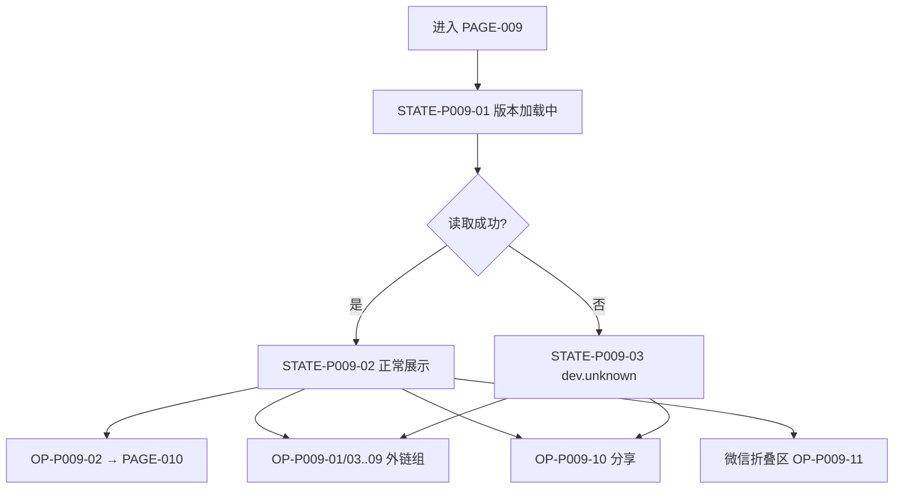

# PAGE-009 关于页目标规范

## 0. 文档元数据

```yaml
status: APPROVED
document_version: 1.0
owner: Smart BLE Product
last_reviewed: 2026-09-01
approved_by: user
supersedes: []
```

## 1. 页面目标与存在必要性

产品身份的诚实面：真实版本（VERSION 投影）、平台状态（五词）、核心能力、全部公开入口（官网/文档/GitHub/ESP32/反馈/分享/隐私/安全/License）。（其他小程序推广区 2026-09-10 移除）

存在必要性：合规入口集中地；版本与平台状态的站内展示面。

## 2. 用户角色与使用场景

- 全角色：查版本、找文档、反馈问题（FLOW-012）。
- PER-05 转化前置：分享出去的落地前信任补充。

## 3. 进入来源、路由参数、深链与冷启动

- 路由：`pages/about/index`，Tab，无参数。
- 出口：PAGE-010 与外链。冷启动可直接进入。

## 4. 信息架构与区块顺序

1. 产品标识：Logo + 产品名 + 版本号（VERSION 投影）+ 一句话定位（UniApp 主线）；
2. 技术标签：UniApp·Vue3、开源跨平台；
3. 应用信息：系统平台、版本、型号；
4. 功能特性：与首版 Must 对齐的六条（不暗示未验证能力）；
5. 支持平台：Android App / 微信小程序 / H5（降级）/ iOS（NOT_RELEASED）——五词状态；
6. 相关链接：官方网站、版本记录、开发文档、GitHub 仓库、ESP32 教程、问题反馈、隐私声明、安全披露、开源许可（MIT）；
7. 分享应用；
8. 页脚：版权与 License；
9. ~~更多小程序（仅微信，页底折叠区）~~（2026-09-10 移除）。

## 5. 首屏必须可见内容

产品名、真实版本、平台状态区入口、核心链接组。（推广区已移除）

## 6. 字段定义与数据来源

| 字段 | 来源 |
|---|---|
| 版本 | DATA-008（VERSION 投影；读取失败 `dev.unknown`） |
| 平台/型号 | 运行环境 |
| 平台状态表 | `08` 投影 |
| 功能特性文案 | `03` Must 组（措辞经 `17`） |
| 外链清单 | DATA-009/仓库元数据 |

## 7. 完整操作表

| Operation ID | 控件/入口 | 显示条件 | 禁用条件 | 用户输入 | 调用链 | 成功反馈 | 失败反馈 | 跳转/返回 | 清理 | 测试 |
|---|---|---|---|---|---|---|---|---|---|---|
| OP-P009-01 | 打开官网 | 页面可见 | 无 | 无 | App openURL / H5 window.open / 微信复制链接 | 打开/复制 toast | 失败 modal | 外部 | 无 | TEST-P-009、TEST-R-005 |
| OP-P009-02 | 版本记录 | 页面可见 | 无 | 无 | navigate | — | — | →PAGE-010 | 无 | TEST-P-010 |
| OP-P009-03 | 开发文档 | 页面可见 | 无 | 无 | 同 OP-01 | 同上 | 同上 | 外部 | 无 | TEST-R-005 |
| OP-P009-04 | GitHub 仓库 | 页面可见 | 无 | 无 | 同 OP-01 | 同上 | 同上 | 外部 | 无 | TEST-R-005 |
| OP-P009-05 | ESP32 教程 | 页面可见 | 无 | 无 | 同 OP-01 | 同上 | 同上 | 外部 | 无 | TEST-R-005、TEST-E-008 |
| OP-P009-06 | 问题反馈 | 页面可见 | 无 | 无 | Issue 入口（DEC-011 仓库角色） | 打开/复制 | 同上 | 外部 | 无 | TEST-R-005 |
| OP-P009-07 | 隐私声明 | 页面可见 | 无 | 无 | 文档站隐私页 | 打开 | 同上 | 外部 | 无 | TEST-R-005 |
| OP-P009-08 | 安全披露 | 页面可见 | 无 | 无 | SECURITY.md 入口 | 打开 | 同上 | 外部 | 无 | TEST-R-005 |
| OP-P009-09 | 开源许可 | 页面可见 | 无 | 无 | LICENSE 展示 | 打开 | 同上 | 弹窗/外部 | 无 | TEST-R-005 |
| OP-P009-10 | 分享应用 | 页面可见 | 无 | 无 | 微信 share / App uni.share / H5 Web Share→复制 | 分享面板 | 失败 toast | 无 | 无 | TEST-P-009、TEST-W-010 |
| OP-P009-11 | 跳转其他小程序 | 仅微信、折叠区展开后 | 无 | 无 | navigateToMiniProgram | 跳转 | 无 appId toast/失败 modal | 外部小程序 | 无 | TEST-W-010 |

## 8. 完整状态表

| State ID | 状态名称 | 进入条件 | 页面内容 | 允许操作 | 退出条件 | 数据更新 | 测试 |
|---|---|---|---|---|---|---|---|
| STATE-P009-01 | 版本加载中 | 进入 | 版本占位"读取中" | 其余可用 | 读取完成 | 版本填充 | TEST-P-009 |
| STATE-P009-02 | 正常展示 | 版本就绪 | 全部区块 | OP-01..11 | 离开 | 无 | TEST-P-009 |
| STATE-P009-03 | 版本读取失败 | 读取异常 | 版本显示 `dev.unknown` | 同上 | 修复后重启 | ERR-DATA-05 记日志 | TEST-P-009 |

## 9. 错误、空态和恢复动作

ERR-DATA-05 版本读取失败（显示 `dev.unknown`；恢复：无用户动作，记录待诊断）；外链失败 modal（重试/复制）。空态：N/A（静态内容页）。

## 10. 页面跳转与返回规则

→PAGE-010；外链不占导航栈。

## 11. Runtime / Web 调用链

```text
UI → composable（版本读取 DATA-008；外链/分享平台 API）
```

无 BLE 调用（N/A：信息页）。

## 12. 资源所有权与生命周期

无连接/计时器/订阅（N/A：静态页；仅异步版本读取一次性完成）。

## 13. 平台差异与降级

外链打开方式三平台不同（OP-01 链）；H5 页面可用（无 BLE 依赖）；推广折叠区已移除（2026-09-10）。

## 14. ESP32 / Smart HID / Release 依赖

ESP32 教程外链（TEST-E-008 复现链路）；平台状态与 `18` 公开状态同源（发布联动）。

## 15. 安全、隐私和脱敏

隐私声明入口（SEC-015）；无敏感数据展示。

## 16. 性能、容量和超时

版本读取 ≤300ms；页面渲染 ≤300ms。

## 17. 无障碍、文案和视觉规则

平台状态用五词+图标；产品名与 `01` 定位一致（品牌规范：显示名统一 Smart BLE / BLE Toolkit+，禁用历史混用名）；文案表 S-42~S-46。

## 18. 自动化测试映射

TEST-P-009（区块/版本/链接矩阵）、TEST-C-006（版本一致性）。

## 19. 真机 / 发布测试映射

TEST-A-012、TEST-W-010、TEST-R-003/005（链接与声明一致性 E6）。

## 20. 公开声明与证据要求

本页平台状态=CLAIM-013 的站内投影；全部外链进入 TEST-R-005 链接矩阵。

## 21. 验收条件

- 版本来自 VERSION（五处一致链）；
- 平台状态五词且与 `08`/`18` 一致；
- 九类公开入口齐全；
- ~~推广区仅微信页底折叠~~（2026-09-10 移除）；
- 无"完整支持/稳定"类越权文案。

## 22. 非目标与禁止行为

- 不展示 Windows/macOS/Linux 等未交付平台为支持平台；
- 不做账号/个人信息；
- 不把内部 P0/P1 审计暴露给用户；
- 品牌名不得混用旧名（SmartBLE Mini 等）。

## 23. Mermaid 流程图 / 状态图



## 24. 关联 ID 与链接

REQ-055/057/064｜FEAT-065/067/068｜FLOW-012｜ERR-DATA-05｜DATA-008/009｜[`08 平台矩阵`](../08_PLATFORM_CAPABILITY_AND_DEGRADATION_MATRIX.md)｜[`18 版本与发布`](../18_VERSION_RELEASE_METADATA_AND_PUBLIC_STATUS.md)
