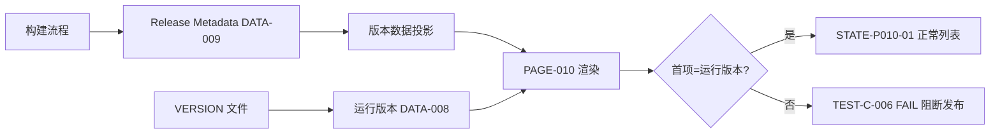

# PAGE-010 版本记录页目标规范

## 0. 文档元数据

```yaml
status: REVIEW
document_version: 1.0
owner: Smart BLE Product
last_reviewed: 2026-09-01
approved_by: null
supersedes: []
```

## 1. 页面目标与存在必要性

站内版本历史的唯一展示：首项必须等于运行版本（VERSION 投影），每项含发布日期与新增/修复/优化/限制四类条目，与 Release Metadata 同源生成，杜绝手写漂移。

存在必要性：用户排查"我装的是哪版"；与 `18` 共同构成版本 SSOT 的 UI 面。

## 2. 用户角色与使用场景

- 全角色：查当前版本与更新内容（FLOW-012）。
- PER-04：核对 Release 与站内一致性。

## 3. 进入来源、路由参数、深链与冷启动

- 路由：`pages/about/version`，无参数；仅 PAGE-009 进入。
- 冷启动深链：本地数据渲染可用。微信可分享本页 path。

## 4. 信息架构与区块顺序

1. 当前版本标记区：运行版本 + `dev.<shortsha>`（开发版时）+"当前"徽标；
2. 版本条目列表（倒序）：每项版本号、发布日期、类型分组条目（新增/修复/优化/限制）；
3. 页脚说明：数据与 Release Notes 同源。

## 5. 首屏必须可见内容

当前版本标记与最近一条版本记录。

## 6. 字段定义与数据来源

| 字段 | 来源 |
|---|---|
| 运行版本 | DATA-008 |
| 版本历史条目 | DATA-009（Release Metadata 投影，构建期生成） |
| shortsha | 构建元数据 |

历史数据**不是**手写数组：由构建流程从 Release Metadata 生成的静态数据投影（实现形式可以是生成文件，但源头唯一）。

## 7. 完整操作表

| Operation ID | 控件/入口 | 显示条件 | 禁用条件 | 用户输入 | 调用链 | 成功反馈 | 失败反馈 | 跳转/返回 | 清理 | 测试 |
|---|---|---|---|---|---|---|---|---|---|---|
| OP-P010-01 | 查看条目（滚动） | 页面可见 | 无 | 滚动 | 静态渲染 | — | — | 无 | 无 | TEST-P-010 |
| OP-P010-02 | 复制版本信息 | 当前版本区 | 无 | 无 | 复制"版本+shortsha" | toast | ERR-SYS-03 | 无 | 无 | TEST-P-010 |
| OP-P010-03 | 分享本页 | 微信 | 无 | 无 | shareApp（本 path） | 分享面板 | 失败 toast | 无 | 无 | TEST-W-010 |
| OP-P010-04 | 返回 | — | — | 系统 | navigateBack | — | — | →PAGE-009 | 无 | TEST-P-010 |

## 8. 完整状态表

| State ID | 状态名称 | 进入条件 | 页面内容 | 允许操作 | 退出条件 | 数据更新 | 测试 |
|---|---|---|---|---|---|---|---|
| STATE-P010-01 | 正常列表 | 有版本数据 | 当前标记+条目 | OP-01/02/03/04 | 离开 | 无 | TEST-P-010 |
| STATE-P010-02 | 数据缺失 | 投影为空 | 占位说明"版本数据缺失（dev.unknown）"+当前运行版本 | OP-02/04 | 修复构建 | 无 | TEST-P-010 |

loading/empty/error 合并为 STATE-P010-02（N/A 异步：构建期静态数据）。

## 9. 错误、空态和恢复动作

ERR-DATA-05 数据缺失（恢复：显示运行版本兜底；修复在构建侧）。

## 10. 页面跳转与返回规则

→PAGE-009（返回）。onShow 回到顶部。

## 11. Runtime / Web 调用链

```text
UI → 构建期生成的版本数据模块（DATA-009 投影）→ 渲染
```

无运行时网络/BLE（N/A：静态页）。

## 12. 资源所有权与生命周期

无任何运行时资源（N/A：静态渲染页）。

## 13. 平台差异与降级

三平台一致；仅微信有分享本页。

## 14. ESP32 / Smart HID / Release 依赖

与 Release Metadata（DATA-009）同源是硬约束（REQ-056）；固件版本不在本页（属固件发布页/落地页）。

## 15. 安全、隐私和脱敏

无敏感内容；shortsha 公开安全。

## 16. 性能、容量和超时

渲染 ≤300ms；条目上限保留最近 30 个版本。

## 17. 无障碍、文案和视觉规则

类型分组（新增/修复/优化/限制）用图标+文字；"当前"徽标读屏可读；文案表 S-47~S-48。

## 18. 自动化测试映射

TEST-P-010（首项=运行版本断言、四类分组渲染）、TEST-C-006（五处一致）。

## 19. 真机 / 发布测试映射

TEST-A-012、TEST-R-002（与 Release Notes 同源 E6 断言）。

## 20. 公开声明与证据要求

本页内容=CLAIM-012（版本透明）站内侧；公开侧由 TEST-R-002 保证一致。

## 21. 验收条件

- 首项=运行版本（自动化断言）；
- 数据源为 Release Metadata 投影而非手写数组；
- 每项四类条目与日期；
- 缺失态有兜底不空白。

## 22. 非目标与禁止行为

- 不做在线更新检查/下载跳转（App 更新走商店/落地页）；
- 不手写与 Release 漂移的版本数组；
- 不展示无证据的能力声明条目。

## 23. Mermaid 流程图 / 状态图



## 24. 关联 ID 与链接

REQ-056｜FEAT-066/080｜FLOW-012｜ERR-DATA-05｜DATA-008/009｜[`18 版本与发布`](../18_VERSION_RELEASE_METADATA_AND_PUBLIC_STATUS.md)｜[`PAGE-009`](PAGE-009_ABOUT.md)
